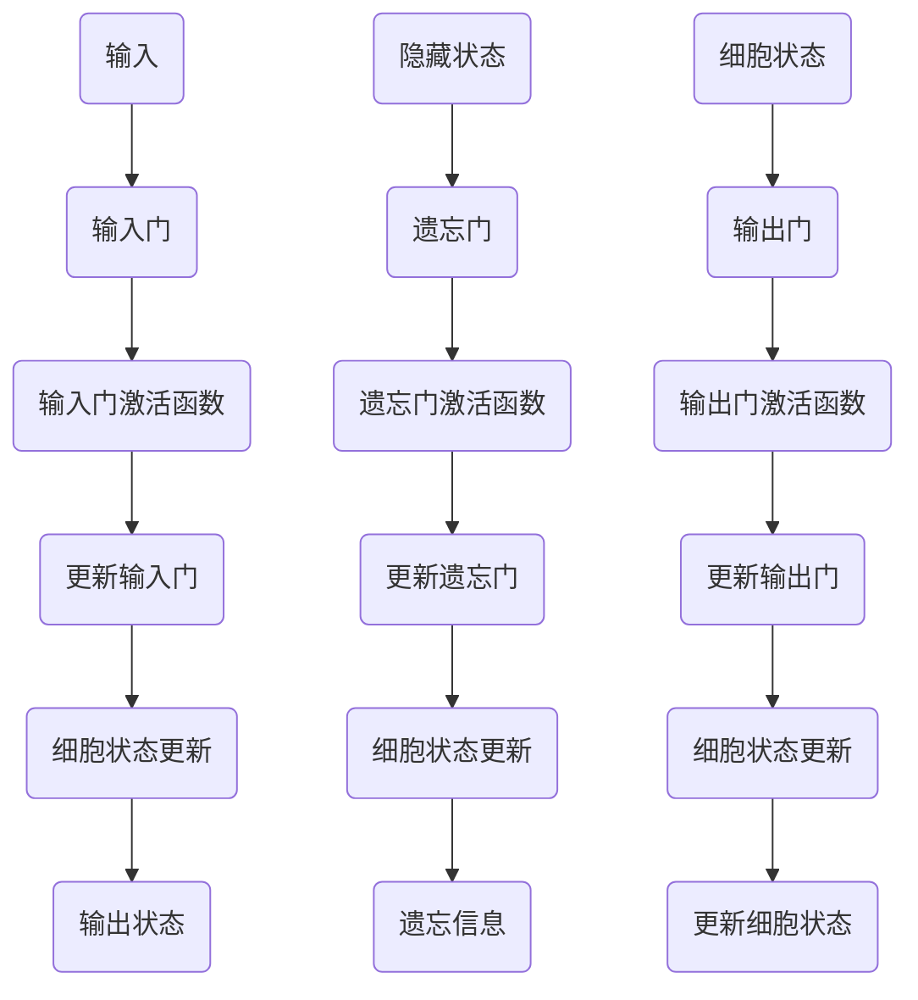

                 

### LSTMs：理解序列数据处理的强大武器

LSTM（长短期记忆）是一种特殊的循环神经网络（RNN），旨在解决传统RNN在处理长序列数据时遇到的“梯度消失”和“梯度爆炸”问题，使得模型能够学习到长序列中的长期依赖关系。LSTM在序列数据处理领域具有广泛的应用，如时间序列分析、自然语言处理、语音识别等。

#### 背景介绍

传统RNN在处理序列数据时存在一些问题，例如：

1. **梯度消失**：在反向传播过程中，梯度会随着层级的增加而迅速减小，导致模型难以学习到长序列中的依赖关系。
2. **梯度爆炸**：在某些情况下，梯度会随着层级的增加而急剧增大，导致模型不稳定。

为了解决这些问题，Hochreiter和Schmidhuber在1997年提出了LSTM网络。LSTM通过引入门控机制，有效地解决了梯度消失和梯度爆炸问题，使得模型能够更好地学习长序列数据中的长期依赖关系。

#### LSTM网络的工作原理

LSTM网络由细胞状态（cell state）、输入门（input gate）、遗忘门（forget gate）和输出门（output gate）四个部分组成。每个部分都有不同的功能：

1. **细胞状态（Cell State）**：细胞状态是LSTM网络的核心，它存储了序列数据的信息，并能够在时间步之间传递这些信息。
2. **输入门（Input Gate）**：输入门控制细胞状态接收新的信息。在新的时间步，输入门会决定哪些信息会被更新到细胞状态。
3. **遗忘门（Forget Gate）**：遗忘门控制细胞状态丢弃哪些不需要的信息。遗忘门决定了哪些旧的信息需要被遗忘。
4. **输出门（Output Gate）**：输出门决定了细胞状态中的哪些信息会被输出到下一个时间步。

下面是一个简化的LSTM单元的Mermaid流程图：



#### LSTM网络的核心算法原理

LSTM的核心算法包括三个关键操作：输入门的更新、遗忘门的更新和输出门的更新。

1. **输入门的更新**：

   输入门的更新取决于当前输入和隐藏状态，以及前一个时间步的输入门激活函数。具体地，输入门激活函数可以表示为：

   $$ 
   \text{input\_gate} = \sigma(W_{ix}x + W_{ih}h_{t-1} + b_{i})
   $$

   其中，$W_{ix}$和$W_{ih}$是权重矩阵，$b_{i}$是偏置项，$\sigma$是Sigmoid函数。

2. **遗忘门的更新**：

   遗忘门的更新取决于当前输入、隐藏状态以及前一个时间步的遗忘门激活函数。具体地，遗忘门激活函数可以表示为：

   $$ 
   \text{forget\_gate} = \sigma(W_{fx}x + W_{fh}h_{t-1} + b_{f})
   $$

   其中，$W_{fx}$和$W_{fh}$是权重矩阵，$b_{f}$是偏置项。

3. **输出门的更新**：

   输出门的更新取决于当前输入、隐藏状态以及前一个时间步的输出门激活函数。具体地，输出门激活函数可以表示为：

   $$ 
   \text{output\_gate} = \sigma(W_{ox}x + W_{oh}h_{t-1} + b_{o})
   $$

   其中，$W_{ox}$和$W_{oh}$是权重矩阵，$b_{o}$是偏置项。

#### LSTM网络的数学模型

LSTM的数学模型可以用以下公式来描述：

1. **输入门**：

   $$ 
   \text{input\_gate} = \sigma(W_{ix}x + W_{ih}h_{t-1} + b_{i})
   $$

   $$ 
   \text{input\_candidate} = \tanh(W_{cx}x + W_{ch}h_{t-1} + b_{c})
   $$

2. **遗忘门**：

   $$ 
   \text{forget\_gate} = \sigma(W_{fx}x + W_{fh}h_{t-1} + b_{f})
   $$

   $$ 
   \text{cell\_state\_candidate} = \text{forget\_gate} \odot \text{cell\_state}_{t-1} + \text{input\_gate} \odot \text{input\_candidate}
   $$

3. **输出门**：

   $$ 
   \text{output\_gate} = \sigma(W_{ox}x + W_{oh}h_{t-1} + b_{o})
   $$

   $$ 
   \text{cell\_state} = \text{output\_gate} \odot \tanh(\text{cell\_state\_candidate})
   $$

   $$ 
   \text{h}_{t} = \text{output\_gate} \odot \tanh(\text{cell\_state})
   $$

其中，$\odot$表示元素乘积操作，$W_{ix}, W_{ih}, W_{fx}, W_{fh}, W_{cx}, W_{ch}, W_{ox}, W_{oh}$是权重矩阵，$b_{i}, b_{f}, b_{c}, b_{o}$是偏置项，$h_{t}$是隐藏状态，$x$是输入，$\text{cell\_state}_{t-1}$是前一个时间步的细胞状态。

#### LSTM网络的应用实例

以下是一个简化的LSTM网络在股票市场预测中的应用实例：

1. **数据预处理**：

   将股票价格序列作为输入数据，对数据进行标准化处理，以便于模型训练。

2. **模型构建**：

   使用TensorFlow或PyTorch等深度学习框架构建LSTM模型。具体地，定义输入层、LSTM层和输出层。

   ```python
   model = tf.keras.Sequential([
       tf.keras.layers.LSTM(units=50, return_sequences=True, input_shape=(time_steps, features)),
       tf.keras.layers.LSTM(units=50),
       tf.keras.layers.Dense(units=1)
   ])
   ```

3. **模型训练**：

   使用训练数据对模型进行训练，通过反向传播算法更新模型参数。

   ```python
   model.compile(optimizer='adam', loss='mean_squared_error')
   model.fit(x_train, y_train, epochs=100, batch_size=32)
   ```

4. **模型评估**：

   使用验证数据对模型进行评估，计算预测误差和准确度。

   ```python
   mse = model.evaluate(x_val, y_val, verbose=2)
   print(f'Mean squared error on validation set: {mse}')
   ```

5. **模型应用**：

   使用训练好的模型对新的股票价格序列进行预测。

   ```python
   predictions = model.predict(x_new)
   ```

### 小结

LSTM网络是序列数据处理领域的一种强大工具，通过门控机制有效地解决了传统RNN在处理长序列数据时遇到的梯度消失和梯度爆炸问题。LSTM网络在时间序列分析、自然语言处理、语音识别等领域有着广泛的应用。通过本文，我们了解了LSTM网络的基本概念、工作原理、数学模型和应用实例。在后续章节中，我们将进一步探讨LSTM网络在序列数据处理中的具体应用和优化技巧。

### 拓展阅读

- **论文推荐**：

  1. Hochreiter, S., & Schmidhuber, J. (1997). Long Short-Term Memory. Neural Computation, 9(8), 1735-1780.
  2. Graves, A. (2013). Generating Sequences With Recurrent Neural Networks. arXiv preprint arXiv:1308.0850.
  3. Zhang, X., Bengio, S., & Salakhutdinov, R. (2017). Learning lengths and alignments with the hierarchical recurrent neural network. arXiv preprint arXiv:1702.02467.

- **在线课程**：

  1. Andrew Ng的“深度学习”课程，其中包含了LSTM的详细讲解。
  2. fast.ai的“深度学习实务”课程，其中介绍了LSTM在时间序列预测中的应用。

- **书籍推荐**：

  1. 《深度学习》（Goodfellow, I., Bengio, Y., & Courville, A.）
  2. 《Python深度学习》（François Chollet）
  3. 《序列模型与深度学习》（Alessio Sardina & Matteo Matteucci）

