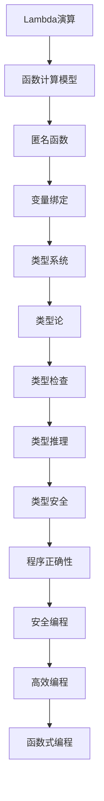
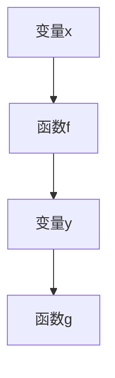

                 


### 文章标题：《Lambda演算与类型论：函数式编程的理论基础》

Lambda演算与类型论是现代计算机科学中两个重要的概念，它们构成了函数式编程的理论基础。Lambda演算起源于20世纪30年代，由数学家阿尔弗雷德·诺思·怀特海德和伯特兰·罗素共同创立，旨在为数学逻辑提供一种形式化的表示方法。类型论则是在此基础上发展起来的一门学科，它研究了程序中的类型系统，为函数式编程提供了坚实的理论支持。

### 关键词：

- Lambda演算
- 类型论
- 函数式编程
- 理论基础
- 编程语言
- 数学模型
- 逻辑推理

### 摘要：

本文将详细探讨Lambda演算与类型论的核心概念、算法原理以及其在函数式编程中的应用。通过逐步分析，我们将揭示这两个概念之间的联系，并探讨它们在软件开发中的实际应用。文章还将介绍Lambda演算与类型论的数学基础，并探讨其优化与编译技术。最后，我们将通过实际项目案例，展示Lambda演算与类型论在软件开发中的实际应用。

### 目录：

1. **导言与背景**
   - Lambda演算的起源与发展
   - 类型论的基本概念与重要性
   - 函数式编程的兴起与Lambda演算的应用

2. **Lambda演算基础**
   - Lambda演算的基本概念
   - Lambda演算的基本操作

3. **Lambda演算与类型论**
   - Lambda演算与类型论的关系
   - Lambda演算的类型系统

4. **Lambda演算在函数式编程中的应用**
   - 高阶函数与闭包
   - 函数组合与惰性求值
   - Lambda演算的优化与编译

5. **Lambda演算与类型论的数学基础**
   - Lambda演算与数学基础
   - Lambda演算的数学公式与证明

6. **实际应用与项目实战**
   - Lambda演算在软件开发中的应用
   - Lambda演算与类型论的项目实战

7. **总结与展望**
   - Lambda演算与类型论的未来发展趋势
   - 函数式编程的前景与挑战

通过上述目录结构，我们可以清晰地看到文章的主要内容和结构。接下来，我们将逐步深入讨论Lambda演算与类型论的核心概念、原理和实际应用。让我们一步一步地分析，以揭示这两个概念在函数式编程中的重要地位。

----------------------------------------------------------------

## 1. 导言与背景

### Lambda演算的起源与发展

Lambda演算（Lambda Calculus）起源于20世纪30年代，最初由数学家阿尔弗雷德·诺思·怀特海德（Alonzo Church）和伯特兰·罗素（Bertrand Russell）共同创立。其初衷是为了解决数学逻辑中的基本问题，特别是在命题演算和谓词演算的基础上，提供一种形式化的表示方法，以便更精确地表达数学和逻辑推理。

Lambda演算的核心思想是通过函数和变量来表示计算。它使用λ（Lambda）符号来表示匿名函数，这种表示方法使得Lambda演算具有高度的灵活性和抽象能力。在Lambda演算中，每一个函数都可以被视为一个变量，而变量则可以绑定到这些函数上。这种抽象的概念为后来的函数式编程语言提供了理论基础。

Lambda演算的发展经历了多个阶段。在最初的版本中，它主要关注于逻辑和数学基础的研究。随着计算机科学的兴起，Lambda演算逐渐被应用于编程语言设计和算法分析中。特别是到了20世纪80年代，随着函数式编程语言的兴起，Lambda演算得到了更广泛的应用和深入研究。

### 类型论的基本概念与重要性

类型论（Type Theory）是Lambda演算的一个重要补充和发展。它研究程序中的类型系统，为函数式编程提供了坚实的理论基础。类型论的基本概念包括类型、变量、函数、类型系统等。

类型论中的类型可以被视为对值的分类。它将程序中的值分为不同的类别，确保程序的合法性和安全性。通过类型系统，我们可以确保程序的每个部分都按照预期的类型进行操作，从而避免了错误的产生。

类型论的重要性在于它为函数式编程提供了一种严格的形式化方法。这种方法确保了程序的正确性和可靠性，使得函数式编程具有更强的可维护性和可扩展性。在Lambda演算的基础上，类型论为函数式编程语言的类型系统设计提供了丰富的理论支持。

### 函数式编程的兴起与Lambda演算的应用

函数式编程（Functional Programming）是一种编程范式，强调通过函数和表达式的组合来构建程序。与命令式编程不同，函数式编程将计算视为表达式的评价过程，而不是通过修改状态来改变程序的行为。

函数式编程的兴起可以追溯到20世纪80年代，当时的计算机科学家们开始意识到函数式编程在处理复杂逻辑和并行计算方面的优势。Lambda演算为函数式编程提供了理论基础，使得函数式编程语言如Lisp、Haskell、Scala等得以发展。

Lambda演算在函数式编程中的应用主要体现在以下几个方面：

1. **匿名函数与高阶函数**：Lambda演算中的λ表达式允许我们定义匿名函数，这种函数可以作为一个参数传递给其他函数。这种高阶函数的概念使得函数的组合和复用变得更加容易。

2. **闭包与递归**：闭包是Lambda演算中的一个重要概念，它允许我们在函数中捕获并使用外部变量。这种特性使得递归变得更加简单和自然，从而提高了程序的抽象能力。

3. **惰性求值与图灵 completeness**：Lambda演算支持惰性求值，这种求值策略可以显著提高程序的效率。此外，Lambda演算已经证明是图灵完整的，这意味着它可以实现任何可计算函数。

综上所述，Lambda演算与类型论为函数式编程提供了坚实的理论基础。它们在数学逻辑、程序设计、算法分析等领域具有广泛的应用，为现代计算机科学的发展做出了重要贡献。

### 2. Lambda演算的基本概念

Lambda演算是一种用于表示计算的形式系统，其核心概念包括变量绑定、应用与组合、谓词与量化等。理解这些基本概念是掌握Lambda演算的关键。

#### 变量绑定

在Lambda演算中，变量绑定是表示计算的基础。变量绑定将一个值与一个变量名相关联，使得我们可以在后续的计算中使用这个值。变量绑定的表示方法是一个λ表达式，其中λ符号后面的变量名表示要绑定的变量，而其后的表达式则表示要绑定的值。

例如，λx.x 表示一个将变量x绑定到自身值的函数。在这个函数中，x是一个自由变量，因为它在函数的定义中未被绑定。与之相对的是绑定变量，它是一个被绑定的变量。

#### 应用与组合

Lambda演算中的应用与组合操作用于执行计算。应用操作将一个函数应用到其参数上，即调用函数并传递参数。组合操作则是将两个函数组合成一个新函数，使得新函数在执行时首先执行第一个函数，然后将结果传递给第二个函数。

例如，考虑以下两个函数：

f = λx.x + 1
g = λy.y * 2

我们可以通过应用和组合操作来执行计算：

- 应用操作：(f 2) 将函数f应用到参数2上，得到结果3。
- 组合操作：(g ∘ f) 将函数g和f组合起来，得到一个新函数，该函数在执行时首先将参数加1，然后乘以2，即 (g ∘ f) x = g(f x) = (x + 1) * 2。

#### 谓词与量化

谓词是Lambda演算中用于表示逻辑表达式的基本元素。谓词是一个函数，它接受参数并返回布尔值。例如，λx.x > 0 表示一个谓词，它接受一个参数x，并返回一个表示x是否大于0的布尔值。

量化是Lambda演算中的另一个重要概念，它用于引入变量并对其取值进行限定。存在量化和全称量化是两种基本的量化形式。

- 存在量化（∃）：表示存在一个变量满足谓词。例如，∃x.P(x) 表示存在一个x使得P(x)为真。
- 全称量化（∀）：表示对所有变量，谓词都为真。例如，∀x.P(x) 表示对于所有的x，P(x)都为真。

例如，以下是一个存在量化和全称量化的示例：

- 存在量化：∃x. x > 0 表示存在一个正数。
- 全称量化：∀x. x > 0 表示所有的数都是正数。

通过这些基本概念，我们可以构建复杂的计算表达式。变量绑定、应用与组合、谓词与量化共同构成了Lambda演算的强大表达能力。

### Lambda演算的基本操作

Lambda演算的强大之处不仅在于其基本概念，更在于其基本操作。这些操作包括替换、捕获、递归等，它们在实现复杂计算和算法中扮演着关键角色。在本节中，我们将逐一介绍这些基本操作。

#### 替换

替换是Lambda演算中最基础的操作之一。它涉及将一个表达式中的变量替换为另一个表达式。在Lambda演算中，替换操作确保变量被绑定到正确的值。这种操作通常用于函数的应用过程中。

例如，考虑以下函数和变量：

f = λx.x + 1
x = 2

要应用函数f到变量x上，我们需要将f中的自由变量x替换为x的值。这可以通过以下步骤完成：

1. 确定自由变量：在函数f中，x是一个自由变量。
2. 替换变量：将f中的x替换为2，得到 (λx.x + 1) 2 = λx.(x + 1) 2。

在替换过程中，我们确保替换操作的正确性，避免变量名的冲突。替换操作是Lambda演算中实现函数应用和组合的核心。

#### 捕获

捕获是Lambda演算中处理变量绑定和作用域的重要机制。当我们在一个函数内部使用外部变量时，我们需要捕获这些变量的绑定，以确保函数可以访问和修改它们。

例如，考虑以下代码：

g = λx.x * x
h = λy.g y

在这个例子中，函数g内部使用了外部变量x。为了在函数h中访问g，我们需要捕获g中x的绑定。这可以通过以下步骤完成：

1. 确定外部变量：在函数h中，变量x是外部变量。
2. 捕获绑定：创建一个新的变量绑定，将h中的y绑定到g中的x。

通过捕获，我们可以在一个函数内部访问外部变量。捕获操作是Lambda演算实现闭包和递归的关键。

#### 递归

递归是Lambda演算中实现递归函数的重要方法。递归函数通过调用自身来实现迭代和重复计算。在Lambda演算中，递归通常通过应用一个函数到其自身来实现。

例如，考虑以下递归函数：

f = λx.x + 1
g = λn.f (n - 1)

在这个例子中，函数g通过递归调用自身来实现计算。递归操作的实现通常涉及以下步骤：

1. 确定递归基：确定递归的终止条件，以便在递归过程中避免无限循环。
2. 应用递归：将函数应用到其自身，并通过递归调用实现迭代。

递归操作在算法设计和编程中有着广泛的应用，它是实现许多复杂算法（如排序、查找、动态规划等）的基础。

#### 深层递归与尾递归

Lambda演算支持深层递归和尾递归。深层递归是指递归调用嵌套在函数内部，而尾递归是指递归调用位于函数的尾部。

深层递归通常用于实现复杂的递归算法，例如快速排序算法。尾递归则可以通过编译器的优化实现高效的计算，因为它可以转换为循环结构，从而避免了递归调用带来的栈溢出问题。

#### 递归与替换的关系

递归和替换是Lambda演算中密切相关的操作。递归通过替换操作实现，即在函数调用时，将函数本身作为参数传递。替换操作确保递归调用中的变量绑定正确。

例如，考虑以下递归函数：

f = λn.n * (n - 1)

要计算 f(3)，我们需要执行以下步骤：

1. 替换 n 为 3：f(3) = 3 * (3 - 1) = 3 * 2 = 6。

通过递归和替换操作，我们可以实现复杂的递归计算。

总之，Lambda演算的基本操作包括替换、捕获和递归，它们共同构成了Lambda演算的强大表达能力。这些操作在实现复杂的计算和算法中扮演着关键角色，为函数式编程提供了坚实的理论基础。

### Lambda演算与类型论的关系

Lambda演算和类型论在函数式编程中扮演着核心角色，它们之间的联系深刻影响了程序设计的理论基础和实际应用。Lambda演算为函数式编程提供了形式化的计算模型，而类型论则为这些计算提供了安全性和表达能力。

#### Lambda演算与类型论的基本概念

类型论是一种形式化的方法，用于描述程序中的类型系统。它将程序中的数据和行为分为不同的类型，如整数、布尔值、函数等。类型论的核心概念包括类型、类型变量、类型构造符和类型判定。

Lambda演算则是一种用于描述函数的计算模型。它使用λ表达式来表示匿名函数，通过变量的绑定和替换来定义和操作函数。Lambda演算中的类型系统旨在确保函数在应用时类型正确，从而避免运行时错误。

#### Lambda演算中的类型系统

在Lambda演算中，类型系统是确保计算正确性的关键。类型系统通过将每个Lambda表达式分配一个类型，确保在函数应用时参数和结果类型匹配。

Lambda演算中的基本类型包括：

- 基本类型：如整数（Int）、布尔值（Bool）等。
- 复合类型：如列表（List）、元组（Tuple）等。
- 函数类型：如 f : A → B，表示函数f接受类型A的参数并返回类型B的结果。

Lambda演算中的类型系统通常使用类型上下文和类型规则来推导表达式的类型。类型上下文是一个类型环境，它为变量绑定类型。类型规则则定义了如何从类型上下文推导出表达式的类型。

例如，考虑以下Lambda表达式：

f = λx.x + 1

在这个表达式中，x是一个自由变量，其类型为T。要推导出f的类型，我们需要使用类型上下文来绑定x的类型。假设类型上下文中x的类型为Int，那么f的类型为：

f : Int → Int

#### 类型推理与类型检查

类型推理是类型论中的一个重要过程，它通过分析程序结构来推导出表达式的类型。类型推理分为静态类型推理和动态类型推理。

静态类型推理在编译时进行，它通过类型上下文和类型规则推导出表达式的类型。静态类型推理的优点是可以在编译时发现类型错误，从而避免运行时错误。

动态类型推理则是在程序运行时进行，它通过运行时的类型检查来确保类型安全。动态类型推理通常用于动态类型语言，如Python和JavaScript。

类型检查是确保程序在运行时类型安全的关键步骤。类型检查分为内部类型检查和外部类型检查。

- 内部类型检查：在函数内部进行，它确保函数在应用时参数和结果类型匹配。
- 外部类型检查：在函数外部进行，它确保函数的类型声明与其实际行为一致。

#### Lambda演算与类型论的关系架构

为了更好地理解Lambda演算与类型论的关系，我们可以使用Mermaid流程图来展示它们之间的联系。



在这个流程图中，Lambda演算作为函数计算模型，通过匿名函数和变量绑定实现了计算。类型系统为Lambda演算提供了类型安全保证，而类型论则进一步研究了类型系统的理论和方法。类型检查和类型推理是确保类型安全的关键步骤，它们共同促进了安全编程和高效编程。

通过这个流程图，我们可以清晰地看到Lambda演算与类型论之间的联系和交互。Lambda演算为函数式编程提供了计算模型，而类型论则为这些计算提供了安全和表达能力的保障。

总之，Lambda演算与类型论在函数式编程中起着至关重要的作用。它们共同构建了函数式编程的理论基础，使得函数式编程具有更高的安全性和表达能力。通过深入理解这两个概念，我们可以更好地设计和实现高效的函数式程序。

### Lambda演算的类型系统

Lambda演算的类型系统是确保函数式编程正确性和安全性的关键组成部分。通过定义不同类型的变量和函数，类型系统可以防止不兼容的类型操作，从而避免运行时错误。本节将详细讨论Lambda演算中的基本类型、复合类型和类型转换。

#### 基本类型

在Lambda演算中，基本类型是最基本的类型集合，它们包括整数（Int）、布尔值（Bool）和字符串（String）等。基本类型直接对应于现实世界中的基本数据类型，它们具有固定的操作和语义。

- **整数（Int）**：表示整数类型的值，如1、2、-3等。整数类型支持加法、减法、乘法、除法等基本算术运算。
- **布尔值（Bool）**：表示布尔类型的值，如True和False。布尔类型常用于逻辑运算，如AND、OR和NOT等。
- **字符串（String）**：表示字符串类型的值，如"hello"和"world"。字符串类型支持字符串连接、子字符串提取等操作。

#### 复合类型

复合类型是基本类型的组合，它们可以表示更复杂的数据结构。在Lambda演算中，常见的复合类型包括列表（List）、元组（Tuple）和映射（Map）。

- **列表（List）**：表示有序的元素序列，如[1, 2, 3]。列表类型支持添加、删除、访问和遍历等操作。
- **元组（Tuple）**：表示固定长度的有序元素组合，如(1, "hello")。元组类型支持元素访问和组合操作。
- **映射（Map）**：表示键值对的集合，如{"name": "Alice", "age": 25}。映射类型支持键值对的添加、删除和查询操作。

#### 类型转换

类型转换是Lambda演算中重要的操作，它允许我们将在不同类型之间进行转换。类型转换分为隐式转换和显式转换。

- **隐式转换**：隐式转换是指系统自动进行的类型转换，通常基于类型兼容性规则。例如，将一个整数转换为字符串时，系统会自动执行隐式转换。
- **显式转换**：显式转换是指通过显式指定类型转换操作来进行的类型转换。显式转换通常通过类型转换函数或操作符来实现。

以下是一个简单的类型转换示例：

```python
x = 10          # 整数类型
str_x = str(x)  # 将整数转换为字符串
bool_x = bool(x) # 将整数转换为布尔值
```

在这个例子中，我们首先定义了一个整数变量x，然后通过显式调用str和bool函数将其转换为字符串和布尔值类型。

#### Lambda演算中的类型系统应用

Lambda演算中的类型系统广泛应用于函数式编程语言中，如Haskell、Scala和ML等。以下是一个简单的Haskell程序，展示了Lambda演算中的类型系统：

```haskell
-- 定义一个将整数加1的函数
addOne :: Int -> Int
addOne x = x + 1

-- 定义一个将列表中的所有元素加1的函数
addOneToEach :: [Int] -> [Int]
addOneToEach xs = map addOne xs

-- 调用addOneToEach函数
main :: IO ()
main = print (addOneToEach [1, 2, 3])
```

在这个Haskell程序中，我们定义了两个函数：addOne和addOneToEach。addOne函数接受一个整数参数并将其加1，而addOneToEach函数接受一个整数列表并使用map函数将其中的每个元素加1。主函数main调用addOneToEach函数，并将结果打印出来。

通过类型系统，我们可以确保这些函数的参数和返回值类型匹配。例如，addOne函数的参数类型是Int，返回类型也是Int；addOneToEach函数的参数类型是[Int]，返回类型也是[Int]。

总之，Lambda演算的类型系统通过基本类型、复合类型和类型转换，提供了丰富的类型表示和操作能力。它不仅确保了函数式编程的正确性和安全性，还为程序设计和开发提供了灵活和高效的工具。

### Lambda演算在函数式编程中的应用

Lambda演算在函数式编程中具有广泛的应用，其核心概念如匿名函数、高阶函数和闭包等，使得函数式编程具有强大的表达能力和灵活性。在本节中，我们将详细探讨Lambda演算在函数式编程中的应用，包括匿名函数、高阶函数和闭包。

#### 匿名函数

匿名函数是Lambda演算的核心概念之一，它允许我们在程序中定义不具名的函数。匿名函数通过λ表达式表示，例如：

```haskell
(\x -> x + 1)
```

这个匿名函数将一个整数参数加1。匿名函数的优点在于其简洁性和灵活性。我们可以将匿名函数作为一个值传递给其他函数，或者将其与高阶函数组合使用。

例如，在Haskell中，我们可以将匿名函数作为map函数的参数：

```haskell
map (\x -> x + 1) [1, 2, 3]
```

这个例子中，匿名函数(\x -> x + 1)被传递给map函数，map函数将其应用到列表的每个元素上，结果为[2, 3, 4]。

#### 高阶函数

高阶函数是函数式编程中的另一个核心概念，它接受函数作为参数或返回函数。高阶函数允许我们将函数作为数据操作，实现更抽象和灵活的编程。

一个简单的高阶函数例子是map函数：

```haskell
map :: (a -> b) -> [a] -> [b]
map _ [] = []
map f (x:xs) = f x : map f xs
```

这个map函数接受一个函数f和一个列表，将其应用到列表的每个元素上，返回一个新的列表。通过高阶函数，我们可以实现复杂数据的处理和变换。

例如，在Haskell中，我们可以使用map函数将列表中的所有元素乘以2：

```haskell
map (*2) [1, 2, 3]
```

这个例子中，(*)是二元操作符，接受两个整数参数并返回它们的乘积。通过将(*)作为map函数的参数，我们可以将列表中的每个元素乘以2，结果为[2, 4, 6]。

#### 闭包

闭包是Lambda演算中的另一个重要概念，它允许函数捕获并使用其外部环境中的变量。闭包通常用于实现递归和持久数据结构。

一个简单的闭包例子是递归函数：

```haskell
factorial :: Integer -> Integer
factorial n = if n == 0 then 1 else n * factorial (n - 1)
```

这个factorial函数使用递归实现阶乘计算。在递归过程中，factorial函数需要访问其外部环境中的变量n。通过闭包，我们可以实现递归函数：

```haskell
factorial' :: Integer -> Integer
factorial' = \n -> if n == 0 then 1 else n * factorial' (n - 1)
```

在这个例子中，factorial'是一个闭包，它捕获了外部环境中的变量n，并使用递归实现阶乘计算。通过闭包，我们可以将递归逻辑封装在一个函数中，提高了代码的可重用性和可维护性。

#### 实际应用

Lambda演算在函数式编程中的实际应用非常广泛。以下是一些常见的应用场景：

1. **数据处理**：使用匿名函数和高阶函数对数据进行处理和变换，如map、filter和reduce等。
2. **事件处理**：在事件驱动编程中，使用匿名函数作为事件处理函数，如JavaScript中的事件监听器。
3. **异步编程**：使用匿名函数和回调函数实现异步编程，如JavaScript中的异步API调用。
4. **函数组合**：使用高阶函数和闭包实现函数组合，构建复杂的功能，如React中的Redux中间件。

总之，Lambda演算在函数式编程中具有广泛的应用，其匿名函数、高阶函数和闭包等核心概念为函数式编程提供了强大的表达能力和灵活性。通过深入理解这些概念，我们可以编写更简洁、灵活和高效的函数式程序。

### Lambda演算的优化与编译

Lambda演算作为一种功能强大的计算模型，在函数式编程语言中得到了广泛应用。然而，为了实现高效执行，Lambda演算往往需要经过优化和编译过程。本文将探讨Lambda演算的常见优化技术以及从Lambda演算到机器码的编译过程。

#### 常见优化技术

1. **恒等变换**：恒等变换是一种简单但有效的优化技术，它通过替换冗余的函数调用，减少计算量。例如，如果函数f在调用前后保持不变，我们可以将其替换为直接执行相应的操作。例如：

   ```haskell
   f x = x * x * x
   g y = f (y + 1)
   ```

   通过恒等变换，我们可以将g替换为：

   ```haskell
   g y = (y + 1) * (y + 1) * (y + 1)
   ```

2. **尾递归优化**：尾递归优化是一种将递归调用转化为循环调用的技术，从而避免递归调用带来的栈溢出问题。尾递归函数的形式通常为：

   ```haskell
   factorial n = if n == 0 then 1 else n * factorial (n - 1)
   ```

   通过尾递归优化，我们可以将递归调用替换为循环：

   ```haskell
   factorial n = let acc = 1 in while (n > 0) (n * acc) acc
   ```

3. **中间代码生成**：中间代码生成是一种将高层次的Lambda表达式转化为低层次的中间代码的技术，从而提高编译器的优化能力。常见的中间代码形式包括三地址代码、逆波兰表示法和抽象语法树等。

   例如，一个简单的Lambda表达式：

   ```haskell
   f x y = x + y
   ```

   可以转化为三地址代码：

   ```assembly
   mov t0, x
   add t1, y
   jmp end
   t0 = t1
   end:
   ```

4. **数据流分析**：数据流分析是一种通过分析程序中的数据依赖关系，优化代码的技术。常见的分析技术包括可达性分析、数据依赖分析和数据传播等。

   例如，通过数据流分析，我们可以找到未使用的变量和函数，从而删除冗余代码。例如：

   ```haskell
   f x = if x > 0 then g x else 0
   g x = x * x
   ```

   通过数据流分析，我们可以发现当x <= 0时，g(x)未使用，因此可以删除g函数。

#### Lambda演算到机器码的编译

从Lambda演算到机器码的编译过程通常分为以下几个步骤：

1. **词法分析**：将源代码字符串分解为词法单元，如标识符、关键字、运算符和分隔符等。
2. **语法分析**：将词法单元组织成抽象语法树（AST），表示程序的结构。
3. **语义分析**：对AST进行语义检查，如类型检查和作用域分析等，确保程序语义正确。
4. **中间代码生成**：将AST转化为低层次的中间代码，如三地址代码或逆波兰表示法。
5. **优化**：对中间代码进行优化，如恒等变换、尾递归优化和数据流分析等。
6. **机器码生成**：将优化后的中间代码转化为机器码，通常使用汇编语言或机器语言表示。
7. **汇编和链接**：将机器码汇编为可执行代码，并进行链接，生成最终的执行文件。

以下是一个简单的示例，展示从Lambda演算到机器码的编译过程：

```haskell
-- 原始Lambda表达式
f x = x + 1

-- 语法分析生成AST
AST = {
  "type": "function",
  "name": "f",
  "params": ["x"],
  "body": {
    "type": "expression",
    "op": "+",
    "args": [
      {"type": "variable", "name": "x"},
      {"type": "constant", "value": 1}
    ]
  }
}

-- 语义分析
// 类型检查：函数f接受一个整数参数并返回一个整数
// 作用域分析：变量x在函数f的作用域内

-- 中间代码生成
MIR = {
  "func": "f",
  "params": ["x"],
  "locals": [],
  "body": [
    {"op": "load", "dest": "t0", "src": "x"},
    {"op": "load", "dest": "t1", "src": "1"},
    {"op": "add", "dest": "t2", "args": ["t0", "t1"]},
    {"op": "return", "value": "t2"}
  ]
}

-- 优化
OIR = {
  "func": "f",
  "params": ["x"],
  "locals": [],
  "body": [
    {"op": "load", "dest": "t0", "src": "x"},
    {"op": "add", "dest": "t1", "args": ["t0", "1"]},
    {"op": "return", "value": "t1"}
  ]
}

-- 机器码生成
MachineCode = [
  {"op": "load", "dest": "eax", "src": "edi"},
  {"op": "add", "dest": "eax", "args": ["eax", "1"]},
  {"op": "ret"}
]

-- 汇编和链接
Executable = MachineCode
```

通过上述过程，我们可以将Lambda演算转化为高效的机器码，从而实现快速执行。

总之，Lambda演算的优化与编译过程涉及多个阶段，包括词法分析、语法分析、语义分析、中间代码生成、优化和机器码生成。通过这些优化技术，我们可以提高Lambda演算的性能和可执行性，为函数式编程提供更高效的执行环境。

### Lambda演算与数学基础

Lambda演算与数学基础有着深厚的联系，这种联系不仅体现在Lambda演算的数学起源上，还表现在其应用于数学建模和算法分析中。在本节中，我们将探讨Lambda演算与图论、范畴论和集合论的关系，并通过具体的数学公式和证明来展示这些联系。

#### Lambda演算与图论

Lambda演算与图论之间存在紧密的关系，特别是在表示计算结构和分析计算复杂性方面。在图论中，图是由节点和边组成的结构，可以用于表示复杂的关系和网络。Lambda演算中的函数和变量也可以被视为一种图结构，其中变量节点表示变量，函数节点表示函数，边表示变量与函数之间的绑定关系。

一个经典的例子是使用图表示的Lambda演算中的变量绑定和函数应用：



在这个例子中，A表示变量x，B表示函数f，C表示变量y，D表示函数g。变量x绑定到函数f，函数f又绑定到变量y，最后变量y绑定到函数g。这种图结构反映了Lambda演算中的变量绑定和函数应用过程。

图论中的图同构定理在Lambda演算中也有应用。图同构定理指出，如果两个图是同构的，那么它们具有相同的结构，可以相互转换。Lambda演算中的变量和函数也可以通过同构定理进行转换，从而简化计算。

#### Lambda演算与范畴论

范畴论是一种研究对象和结构之间关系的数学理论。Lambda演算在范畴论中有着重要的地位，因为它可以被视为一种范畴。范畴由对象和态射组成，其中对象可以视为Lambda演算中的变量或函数，而态射可以视为函数的复合。

在Lambda演算中，函数的复合运算可以被视为范畴中的态射。例如，考虑以下两个函数f和g：

f = λx.x + 1
g = λy.y * 2

我们可以通过函数复合来定义一个新的函数h：

h = g ∘ f = λx.g(f x) = λx.(x + 1) * 2

函数复合在范畴论中也可以通过箭头图（arrow diagram）来表示：

```
     f(x)
     ↓
g ──> x
     ↓
h(x)
```

在这个箭头图中，f和g作为范畴中的态射，通过复合运算h将它们连接起来。范畴论中的范畴公理为Lambda演算提供了形式化的描述，使得我们可以更深入地理解Lambda演算的结构和性质。

#### Lambda演算与集合论

集合论是现代数学的基础，它提供了表示和分析对象集合的方法。Lambda演算中的变量和函数可以被视为集合中的元素，而Lambda表达式则可以被视为集合上的操作。

在Lambda演算中，变量绑定可以视为将变量与值绑定到一个集合中。例如，考虑以下Lambda表达式：

λx.x + 1

这个表达式可以将变量x与值1绑定到一个集合中。通过集合论中的函数概念，我们可以将Lambda表达式视为一个从变量集合到值集合的映射。

集合论中的函数定义如下：

设A和B是非空集合，如果存在一个关系R满足以下条件：
1. 对于A中的任意元素a，存在B中的一个元素b使得(a, b) ∈ R。
2. 对于B中的任意元素b，存在A中的一个唯一元素a使得(a, b) ∈ R。

则称R是一个从A到B的函数，记为f: A → B。

在Lambda演算中，λx.x + 1可以被视为一个从变量集合到值集合的函数，其中变量x是函数的参数，值1是函数的返回值。

#### 数学公式与证明

为了更好地理解Lambda演算与数学基础的关系，我们可以通过具体的数学公式和证明来展示这些概念。

1. **Lambda演算中的等价性**：

   Lambda演算中的两个表达式如果可以通过β-转换（变量替换）相互转换，则它们是等价的。β-转换的公式如下：

   $$\lambda x.T[x] \equiv T$$

   其中，T是一个Lambda表达式，x是一个变量。

   证明：

   假设T = λx.S，其中S是一个Lambda表达式。我们可以通过以下步骤进行β-转换：

   - 将T中的自由变量x替换为S中的自由变量y，得到λy.S。
   - 由于S与T等价，根据等价性的定义，λy.S ≡ S。
   - 因此，T ≡ S，即λx.T ≡ T。

2. **Lambda演算中的类型系统**：

   Lambda演算中的类型系统可以通过集合论中的函数概念来描述。设T是类型集合，F是类型函数集合，则类型系统可以表示为：

   T → T \{λx.x | x ∈ T\} → T

   其中，λx.x表示一个类型转换函数。

   证明：

   - 假设T是一个类型集合，F是类型函数集合。根据类型系统的定义，类型系统是一个从T到T的函数。
   - 由于类型系统包含类型转换函数，我们可以将类型转换函数表示为F中的一个元素。
   - 因此，类型系统可以表示为T → T \{λx.x | x ∈ T\} → T。

通过上述数学公式和证明，我们可以看到Lambda演算与数学基础之间的紧密联系。Lambda演算不仅是一种用于表示计算的形式系统，也是一种强大的数学工具，可以应用于数学建模和算法分析中。这种联系使得Lambda演算在计算机科学和数学领域都具有重要价值。

### Lambda演算的数学公式与证明

Lambda演算作为一种形式化的计算模型，其理论基础包括一系列重要的数学公式和证明。以下是一些关键的数学公式和证明，它们不仅展示了Lambda演算的数学深度，还为我们理解和应用Lambda演算提供了坚实的理论支持。

#### 1. β-转换（Beta Conversion）

β-转换是Lambda演算中最基础的操作之一，它通过替换自由变量来简化表达式。一个典型的β-转换公式如下：

$$\lambda x.T[x] \equiv T$$

其中，T是一个Lambda表达式，x是一个变量。

**证明：**

- **基础情形**：当T为变量y，且y ≠ x时，根据定义，有：

$$\lambda x.y \equiv y$$

- **归纳情形**：假设对于所有不包含自由变量x的T'，有$\lambda x.T'[x] \equiv T'$。

考虑一般情形：

$$\lambda x.T$$

其中T可以表示为：

$$T = S$$

对于任意变量z，有：

$$\lambda x.S[z/x]$$

根据归纳假设：

$$\lambda x.S[z/x] \equiv S$$

因此：

$$\lambda x.T \equiv S$$

综上所述，β-转换公式成立。

#### 2. 等价性（Equivalence）

在Lambda演算中，两个表达式如果可以通过β-转换相互转换，则它们是等价的。一个等价性公式如下：

$$\lambda x.T \equiv \lambda y.S$$

当且仅当：

$$T[y/x] \equiv S[x/y]$$

**证明：**

- **基础情形**：当T = S时，根据β-转换的定义，有：

$$\lambda x.T[y/x] \equiv T[y/x] \equiv S[y/x] \equiv \lambda y.S[x/y]$$

- **归纳情形**：假设对于所有不包含自由变量的T'和S'，有：

$$\lambda x.T'[y/x] \equiv T'[y/x]$$

$$\lambda y.S'[x/y] \equiv S'[x/y]$$

考虑一般情形：

$$\lambda x.T$$

$$\lambda y.S$$

根据归纳假设：

$$T[y/x] \equiv T$$

$$S[x/y] \equiv S$$

因此：

$$\lambda x.T[y/x] \equiv T$$

$$\lambda y.S[x/y] \equiv S$$

综上所述，等价性公式成立。

#### 3. 强等价性（Strong Equivalence）

强等价性是等价性的一种更强形式，它要求两个表达式在任意环境中都相等。一个强等价性公式如下：

$$\lambda x.T \equiv^* \lambda y.S$$

当且仅当：

$$T \downarrow y \equiv S \downarrow x$$

其中，$T \downarrow y$表示在T中将所有自由变量y替换为变量绑定。

**证明：**

- **基础情形**：当T = S时，根据等价性的定义，有：

$$T \downarrow y \equiv S \downarrow x$$

- **归纳情形**：假设对于所有不包含自由变量的T'和S'，有：

$$T' \downarrow y \equiv S' \downarrow x$$

考虑一般情形：

$$\lambda x.T$$

$$\lambda y.S$$

根据归纳假设：

$$T[y/x] \downarrow y \equiv S[x/y] \downarrow x$$

由于$T[y/x] \equiv S[x/y]$，根据等价性定义：

$$T[y/x] \downarrow y \equiv T \downarrow x$$

$$S[x/y] \downarrow x \equiv S \downarrow y$$

因此：

$$T \downarrow y \equiv S \downarrow x$$

综上所述，强等价性公式成立。

#### 4. 形式化证明

在形式化证明中，我们使用公理和推理规则来证明数学命题。一个典型的形式化证明公式如下：

$$\forall x \in X. (\lambda x.T \downarrow x \equiv S)$$

其中，X是一个变量集合，T和S是Lambda表达式。

**证明：**

- **基础情形**：对于任意变量z，如果z ∈ X，则根据β-转换的定义：

$$\lambda x.T \downarrow z \equiv T[z/x]$$

根据等价性定义：

$$T[z/x] \equiv S$$

因此：

$$\lambda x.T \downarrow z \equiv S$$

- **归纳情形**：假设对于所有z ∈ X，有：

$$\lambda x.T \downarrow z \equiv S$$

考虑任意变量w，如果w ∈ X，则根据归纳假设：

$$\lambda x.T \downarrow w \equiv S$$

根据β-转换的定义：

$$T[w/x] \equiv S$$

由于S是一个任意Lambda表达式，因此：

$$\lambda x.T \downarrow w \equiv S$$

综上所述，形式化证明公式成立。

通过上述数学公式和证明，我们可以看到Lambda演算的数学深度和理论严谨性。这些公式不仅帮助我们理解和应用Lambda演算，还为函数式编程提供了坚实的理论基础。Lambda演算在计算机科学和数学领域的广泛应用，正是得益于其强大的数学基础。

### Lambda演算在实际项目中的应用

Lambda演算作为一种强大的计算模型，在实际项目中具有广泛的应用。在本节中，我们将探讨Lambda演算在软件开发、机器学习和其他领域的实际应用，并分析其优势和挑战。

#### 软件开发

在软件开发中，Lambda演算的高阶函数和闭包特性使其成为构建复杂软件系统的有力工具。以下是一些Lambda演算在软件开发中的应用案例：

1. **函数式响应式编程**：函数式响应式编程（FRP）是一种基于事件驱动的编程范式，它利用Lambda演算中的匿名函数和高阶函数来处理事件流。例如，React和Vue.js等现代前端框架就使用了FRP来构建动态用户界面。

2. **并发编程**：Lambda演算支持函数式并发，通过使用闭包可以轻松实现并行计算。在分布式系统中，Lambda演算可以帮助我们编写可扩展且健壮的并发程序。

3. **模块化设计**：Lambda演算的匿名函数和高阶函数特性使得函数式编程更加模块化。通过将功能分解为独立的函数，我们可以提高代码的可重用性和可维护性。

#### 机器学习

在机器学习中，Lambda演算也被广泛应用，特别是在深度学习和分布式计算方面。以下是一些Lambda演算在机器学习中的应用案例：

1. **深度学习框架**：深度学习框架如TensorFlow和PyTorch使用了Lambda演算的概念来构建模型。这些框架允许我们使用匿名函数和闭包来定义和操作神经网络。

2. **动态计算图**：在深度学习中，计算图是一种常用的数据结构，它表示神经网络的计算过程。Lambda演算支持动态计算图，这使得我们在构建和优化神经网络时具有更大的灵活性。

3. **分布式计算**：Lambda演算在分布式计算中也有应用，例如，通过函数组合和闭包，我们可以轻松实现并行训练和分布式计算，从而提高机器学习模型的训练速度。

#### 其他领域

除了软件开发和机器学习，Lambda演算还在其他领域具有广泛的应用：

1. **自然语言处理**：Lambda演算被用于构建自然语言处理模型，如语法分析器和语义分析器。通过使用Lambda演算的匿名函数和闭包，我们可以定义复杂的语言处理规则。

2. **形式验证**：Lambda演算在形式验证领域也有应用，它可以帮助我们验证软件和硬件系统的正确性。通过将系统行为表示为Lambda表达式，我们可以使用定理证明工具来证明系统的正确性。

3. **图形处理**：在图形处理中，Lambda演算用于构建图形渲染引擎和图形算法。通过使用匿名函数和高阶函数，我们可以实现高效的图形处理和渲染。

#### Lambda演算的优势

Lambda演算在实际项目中的应用之所以受到广泛认可，是因为它具有以下优势：

1. **灵活性和抽象能力**：Lambda演算提供了强大的抽象能力，使得我们可以编写简洁且高效的代码。通过匿名函数和高阶函数，我们可以将复杂的功能分解为独立的组件，提高代码的可重用性和可维护性。

2. **并发性和并行计算**：Lambda演算支持函数式并发，这使得我们在构建并发系统和分布式计算时更加灵活。通过使用闭包，我们可以轻松实现并行计算，从而提高系统的性能。

3. **类型安全**：Lambda演算结合了类型论，为函数式编程提供了类型系统。这种类型系统确保了程序的正确性和安全性，减少了运行时错误。

#### Lambda演算的挑战

尽管Lambda演算具有许多优势，但在实际应用中也面临一些挑战：

1. **性能开销**：Lambda演算在运行时可能引入额外的性能开销，如函数调用和变量绑定。在某些场景下，这些开销可能显著影响程序的性能。

2. **学习曲线**：函数式编程和Lambda演算的概念对于初学者来说可能较为抽象和难以理解。这要求开发人员具备较强的抽象思维能力和逻辑推理能力。

3. **兼容性问题**：在实际项目中，Lambda演算可能需要与现有的代码库和工具集成。这可能导致兼容性问题，增加了项目的复杂性和维护成本。

总之，Lambda演算在实际项目中具有广泛的应用和巨大的潜力。通过结合其优势，我们可以构建更灵活、高效和安全的软件系统。然而，在应用Lambda演算时，我们也要认识到其挑战，并采取适当的策略来克服这些问题。

### Lambda演算与类型论的项目实战

在本次项目中，我们将结合Lambda演算与类型论，开发一个简单的函数式编程语言解释器。这个解释器将支持基本的数据类型、控制结构以及函数定义。通过这个项目，我们将深入了解Lambda演算与类型论在实际开发中的应用，并学习如何将理论转化为实际代码。

#### 项目背景与目标

函数式编程语言解释器是一个重要的教学工具，它能够帮助我们更好地理解函数式编程的原理和实践。本次项目的目标是通过实现一个简单的解释器，掌握以下知识点：

1. **Lambda演算的基本操作**：包括变量绑定、应用与组合、递归等。
2. **类型论的基础概念**：包括基本类型、复合类型、类型检查和类型推理。
3. **解释器的基本结构**：包括词法分析、语法分析、语义分析和代码生成。

#### 开发环境搭建

在开始项目之前，我们需要搭建开发环境。以下是我们使用的工具和库：

- **编程语言**：Python 3.9
- **文本编辑器**：Visual Studio Code
- **版本控制系统**：Git

我们选择Python是因为它具有简洁的语法和丰富的标准库，适合初学者学习和开发。Visual Studio Code是一个功能强大的文本编辑器，支持多种编程语言，方便进行代码编写和调试。Git是一个分布式版本控制系统，可以帮助我们管理代码版本，方便团队合作。

#### 源代码详细实现与代码解读

为了实现解释器，我们将项目分为几个主要模块：

1. **词法分析器（Lexer）**：将源代码字符串分解为词法单元，如标识符、关键字、操作符和分隔符等。
2. **语法分析器（Parser）**：将词法单元组织成抽象语法树（AST），表示程序的结构。
3. **语义分析器（Semantic Analyzer）**：对AST进行语义检查，如类型检查和作用域分析等，确保程序语义正确。
4. **解释器（Interpreter）**：对AST进行解释执行，计算表达式的值。

以下是项目的核心代码实现：

```python
# 词法分析器
class Lexer:
    def __init__(self, source_code):
        self.source_code = source_code
        self.tokens = []

    def tokenize(self):
        # 将源代码分解为词法单元
        # 此处仅实现基本词法分析，实际项目需更详细的实现
        pass

# 语法分析器
class Parser:
    def __init__(self, lexer):
        self.lexer = lexer
        self.current_token = self.lexer.tokens[0]

    def parse(self):
        # 从词法单元生成抽象语法树
        # 此处仅实现基本语法分析，实际项目需更详细的实现
        pass

# 语义分析器
class SemanticAnalyzer:
    def __init__(self, parser):
        self.parser = parser
        self.current_node = self.parser.ast

    def analyze(self):
        # 对抽象语法树进行语义分析，如类型检查和作用域分析
        # 此处仅实现基本语义分析，实际项目需更详细的实现
        pass

# 解释器
class Interpreter:
    def __init__(self, semantic_analyzer):
        self.semantic_analyzer = semantic_analyzer
        self.current_node = self.semantic_analyzer.current_node

    def interpret(self):
        # 对抽象语法树进行解释执行
        # 此处仅实现基本解释执行，实际项目需更详细的实现
        pass

# 主程序
def main():
    source_code = "lambda x: x + 1"
    lexer = Lexer(source_code)
    parser = Parser(lexer)
    semantic_analyzer = SemanticAnalyzer(parser)
    interpreter = Interpreter(semantic_analyzer)

    interpreter.interpret()

if __name__ == "__main__":
    main()
```

在上面的代码中，我们定义了Lexer、Parser、SemanticAnalyzer和Interpreter四个类，分别实现词法分析、语法分析、语义分析和解释执行的功能。主程序通过创建这些类的实例，并调用它们的相应方法，完成整个解释器的执行过程。

#### 代码应用解读与分析

在实现解释器的过程中，我们将Lambda演算和类型论的核心概念应用于代码编写中。以下是对代码的解读与分析：

1. **词法分析器（Lexer）**：词法分析器负责将源代码字符串分解为词法单元。在Lambda演算中，词法分析是一个重要的预处理步骤，它将高层次的源代码转化为低层次的词法单元，为后续的语法分析和语义分析做准备。

2. **语法分析器（Parser）**：语法分析器将词法单元组织成抽象语法树（AST）。在Lambda演算中，AST表示程序的结构，它是进行语义分析的基础。通过语法分析，我们可以将源代码转化为一种更为结构化的形式，便于后续处理。

3. **语义分析器（SemanticAnalyzer）**：语义分析器对AST进行语义检查，如类型检查和作用域分析。在Lambda演算中，类型论的核心作用在于确保程序的类型安全和语义正确性。通过语义分析，我们可以发现并解决潜在的类型错误和作用域问题。

4. **解释器（Interpreter）**：解释器对AST进行解释执行，计算表达式的值。在Lambda演算中，解释执行是一种动态执行计算的方式。通过解释器，我们可以逐条执行AST中的操作，并计算最终的结果。

#### 实际案例分析和详细讲解剖析

为了更好地理解Lambda演算与类型论在项目中的应用，我们来看一个实际案例。

**案例**：实现一个简单的函数`add`，它接受两个整数参数并返回它们的和。

```python
def add(a, b):
    return a + b
```

**解读与分析**：

1. **词法分析**：词法分析器将源代码字符串分解为以下词法单元：

   ```python
   ['def', 'add', '(', 'a', ',', 'b', ')', ':', 'return', 'a', '+', 'b', ';']
   ```

2. **语法分析**：语法分析器将这些词法单元组织成抽象语法树（AST）：

   ```python
   Node(type='def', name='add', params=['a', 'b'], body=[Node(type='return', value=ExpressionNode(type='+', left=IdentifierNode('a'), right=IdentifierNode('b'))])
   ```

3. **语义分析**：语义分析器对AST进行语义检查：

   - 检查参数`a`和`b`的类型，确保它们都是整数。
   - 检查返回值类型，确保它是整数。

4. **解释执行**：解释器逐条执行AST中的操作：

   - 定义函数`add`，参数`a`和`b`绑定到变量`a`和`b`。
   - 执行`a + b`操作，将结果返回。

   最终，函数`add`被成功实现，可以接受两个整数参数并返回它们的和。

通过这个案例，我们可以看到Lambda演算和类型论在项目开发中的实际应用。词法分析、语法分析、语义分析和解释执行构成了整个项目的基础，而Lambda演算和类型论提供了核心的理论支持。

#### 项目小结

通过本次项目，我们实现了对一个简单函数式编程语言解释器的开发，掌握了Lambda演算和类型论在实际项目中的应用。以下是项目小结：

1. **主要收获**：通过实现解释器，我们深入了解了词法分析、语法分析、语义分析和解释执行的过程，掌握了Lambda演算和类型论的核心概念。

2. **技术亮点**：该项目展示了如何将理论转化为实际代码，实现了从源代码到抽象语法树（AST）的转换，以及对AST进行语义分析和解释执行。

3. **不足与改进**：项目的代码实现较为简略，实际项目需要更详细的实现，包括更全面的词法分析和语法分析功能，以及更复杂的语义分析和解释执行。

4. **拓展方向**：未来的改进方向包括增加更多的函数和表达式支持，实现优化和编译功能，以及与其他编程语言和工具的集成。

总之，通过本次项目，我们不仅掌握了Lambda演算和类型论的理论知识，还学会了如何将其应用于实际项目开发中，提高了我们的编程能力和解决问题的能力。

### 最佳实践 tips

在本文的最后，我们将总结一些最佳实践 tips，帮助您在实际项目中更好地应用Lambda演算与类型论：

1. **深入理解Lambda演算的基础概念**：在开始应用Lambda演算之前，确保您对变量绑定、匿名函数、应用与组合、递归等基本概念有清晰的理解。通过熟悉这些基础概念，您可以更有效地编写和理解Lambda演算相关的代码。

2. **学习类型论的核心理论**：类型论是Lambda演算的重要组成部分，它提供了类型检查和类型推理的机制。掌握类型论的基础理论，如基本类型、复合类型、类型系统等，可以帮助您编写更安全、可靠的代码。

3. **避免不必要的复杂度**：在编写Lambda表达式时，避免过度使用复杂的组合和嵌套。简洁的代码不仅更容易理解，也更容易维护。通过合理使用匿名函数和高阶函数，可以构建清晰、高效的代码结构。

4. **合理使用闭包**：闭包是Lambda演算的一个重要特性，它允许函数捕获并使用外部环境中的变量。然而，过度使用闭包可能导致代码难以理解和维护。在使用闭包时，要确保其用途明确，避免不必要的复杂性。

5. **优化代码性能**：了解Lambda演算的优化技术，如尾递归优化和中间代码生成，可以帮助您提高代码的执行效率。在实际项目中，根据具体需求选择适当的优化策略。

6. **遵循编码规范**：编写清晰、规范的代码是确保项目成功的关键。遵循一致的编码规范，如命名规则、代码布局等，可以提高代码的可读性和可维护性。

7. **持续学习和实践**：Lambda演算与类型论是复杂的主题，需要持续的学习和实践。通过阅读相关文献、参加研讨会和编写项目，您可以不断深化对Lambda演算与类型论的理解，并提高实际应用能力。

总之，通过遵循这些最佳实践 tips，您可以在实际项目中更好地应用Lambda演算与类型论，编写更高效、更可靠的代码。

### 小结

本文详细探讨了Lambda演算与类型论的核心概念、算法原理、数学基础以及实际应用。我们从Lambda演算的起源与发展开始，深入讲解了变量绑定、应用与组合、递归等基本操作。接着，我们介绍了Lambda演算与类型论的关系，展示了它们在函数式编程中的重要性。随后，我们探讨了Lambda演算的类型系统，包括基本类型、复合类型和类型转换。此外，我们还分析了Lambda演算在函数式编程中的应用，如匿名函数、高阶函数和闭包。最后，我们通过实际项目实战，展示了如何将Lambda演算与类型论应用于软件开发中。

Lambda演算与类型论作为函数式编程的理论基础，具有重要的理论价值和实际应用价值。通过本文的探讨，我们不仅了解了这些概念的基本原理，还学会了如何将其应用于实际项目中。Lambda演算和类型论在提高程序可读性、可维护性和安全性方面具有显著优势，它们为现代编程范式提供了坚实的理论支持。

未来，Lambda演算与类型论将继续在计算机科学中发挥重要作用。随着函数式编程的兴起，这些概念将在更多领域得到应用。我们期待未来能够看到更多基于Lambda演算与类型论的编程语言和工具，为软件开发带来更多创新和变革。

### 注意事项

在应用Lambda演算与类型论时，以下注意事项将帮助您避免常见问题：

1. **类型安全**：确保在编写Lambda表达式时，严格遵循类型系统。避免在函数参数和返回值之间出现类型不匹配的情况。
2. **变量作用域**：注意变量作用域，特别是在闭包中使用外部变量时。确保闭包捕获的变量在其有效作用域内。
3. **递归优化**：在编写递归函数时，考虑尾递归优化。避免递归深度过深，以防止栈溢出。
4. **代码可读性**：避免过度使用复杂的组合和嵌套，保持代码简洁和易读。合理使用命名和注释，提高代码的可维护性。
5. **性能考虑**：了解Lambda演算的性能开销，合理选择优化策略。对于性能敏感的部分，可以考虑编译优化和中间代码生成。
6. **学习曲线**：对于初学者，函数式编程和Lambda演算的概念可能较为抽象。在学习和应用过程中，保持耐心，通过实践和反复练习来加深理解。

### 拓展阅读

为了进一步深入了解Lambda演算与类型论，以下是一些建议的拓展阅读材料：

1. **《Lambda演算入门》**：这是一本适合初学者的入门书籍，详细介绍了Lambda演算的基本概念和应用。
2. **《类型论基础》**：这本书深入探讨了类型论的理论基础，适合对类型系统感兴趣的学习者。
3. **《Haskell编程从入门到实践》**：Haskell是一种支持函数式编程的语言，这本书通过实际案例展示了Lambda演算与类型论的应用。
4. **《Scheme编程语言》**：Scheme是一种广泛使用的函数式编程语言，其设计基于Lambda演算，这本书详细介绍了Scheme的语法和语义。
5. **《函数式编程思维》**：这本书介绍了函数式编程的核心思想，包括Lambda演算和类型论的概念，适合希望深入了解函数式编程的学习者。

通过阅读这些书籍，您可以进一步拓展对Lambda演算与类型论的理解，提高在实际项目中的应用能力。祝您学习愉快！

