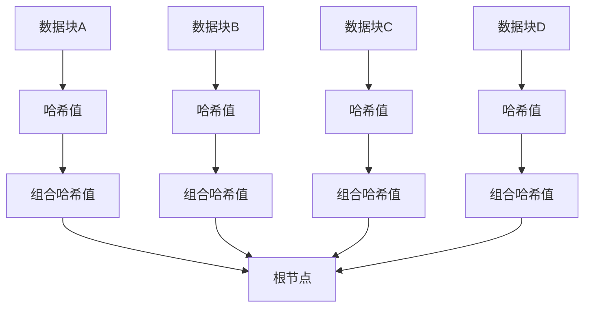

                 

## 文章标题

### Merkle树在密码学和分布式系统中的应用

## 文章关键词

- **Merkle树**、**密码学**、**分布式系统**、**哈希函数**、**区块链**、**数字签名**、**数据验证**

## 文章摘要

本文将深入探讨Merkle树在密码学和分布式系统中的应用。首先，我们将介绍Merkle树的基本概念和结构，并通过Merkmaid流程图展示其工作原理。接着，我们将详细讲解Merkle树在密码学中的核心算法原理，如数字签名和哈希函数。随后，文章将探讨Merkle树在分布式系统中的应用，包括分布式存储和分布式计算。此外，我们将通过实际案例展示Merkle树的实现和优化，并提供最佳实践和注意事项。最后，文章将对Merkle树的应用前景进行展望，鼓励读者进行拓展阅读。

## 引言

Merkle树（Merkle Tree），也称为哈希树，是一种数据结构，用于高效验证大量数据的一致性。它由Ralph Merkle在1979年提出，并被广泛应用于密码学和分布式系统中。Merkle树的核心思想是通过哈希函数将数据块逐层组合，最终生成一个根哈希值。这个根哈希值可以作为数据的唯一标识，使得验证数据的一致性变得高效且安全。

在密码学中，Merkle树广泛应用于数字签名、哈希函数和证明和知识系统。例如，在比特币的区块链技术中，Merkle树用于确保交易数据的完整性和不可篡改性。在分布式系统中，Merkle树被用于分布式存储和分布式计算，如IPFS和MapReduce框架。

本文旨在详细探讨Merkle树在密码学和分布式系统中的应用，帮助读者理解其核心概念和原理，并通过实际案例展示其实现和优化方法。通过本文的学习，读者将能够掌握Merkle树的应用技巧，并在实际项目中运用这一重要数据结构。

### Merkle树的基本概念和结构

Merkle树是一种基于哈希函数构建的数据结构，它通过递归地将数据块组合成树形结构，并在树的每个节点上计算哈希值，从而实现对大量数据的高效验证。下面，我们将详细讲解Merkle树的基本概念和结构。

#### 定义

Merkle树是一种二叉树，每个叶子节点代表一个数据块，每个内部节点代表其子节点哈希值的组合。树的根节点即为Merkle树的根哈希值，它作为数据的唯一标识。Merkle树的构建过程可以描述为：对于每个非叶子节点，将其子节点的哈希值拼接起来，通过哈希函数计算出一个新的哈希值，作为该节点的值。这个过程一直递归进行，直到生成根节点。

#### 结构

Merkle树的结构如下：

1. **叶子节点**：每个叶子节点代表一个数据块，数据块可以是文件的一部分、一条消息或任何其他数据。在Merkle树中，每个叶子节点的值是通过哈希函数计算得到的。

2. **内部节点**：内部节点由其子节点的哈希值拼接而成。对于一个非叶子节点，其值是将其左右子节点的哈希值拼接后通过哈希函数计算得到的。

3. **根节点**：根节点是Merkle树的顶部节点，其值是整个Merkle树的哈希值。根节点的值可以用来验证整个数据集合的一致性。

#### 工作原理

Merkle树的工作原理可以分为以下几个步骤：

1. **构建Merkle树**：首先，将所有数据块放入叶子节点，然后根据节点的组合规则递归地构建Merkle树。在构建过程中，如果当前层级只有一个节点，则将其值直接作为内部节点的值。

2. **计算哈希值**：对于每个内部节点，将其子节点的哈希值拼接起来，通过哈希函数计算一个新的哈希值，作为该节点的值。

3. **生成根哈希值**：在递归计算过程中，直到最终生成根节点，该根节点的值即为Merkle树的根哈希值。

4. **验证数据一致性**：通过对比Merkle树的根哈希值和数据块的哈希值，可以快速验证数据的一致性。如果根哈希值相同，则数据一致；否则，数据存在篡改。

下面通过一个简单的例子来展示Merkle树的构建过程：

假设有四个数据块`A`、`B`、`C`和`D`，我们首先将这四个数据块放入叶子节点，然后通过计算哈希值构建Merkle树：

- 叶子节点：  
  - `$H(A)$`  
  - `$H(B)$`  
  - `$H(C)$`  
  - `$H(D)$`

- 内部节点：  
  - `$H(H(A), H(B))$`  
  - `$H(H(C), H(D))$`  
  - `$H(H(H(A), H(B)), H(H(C), H(D)))$`

- 根节点：  
  - `$H(H(H(A), H(B)), H(H(C), H(D)))$`

最终生成的根哈希值可以作为数据集合的唯一标识。

通过上述步骤，我们可以清楚地看到Merkle树的构建过程和工作原理。Merkle树在密码学和分布式系统中的应用正是基于其高效验证数据一致性的能力。

### Mermaid流程图

为了更直观地展示Merkle树的构建过程，我们可以使用Merkmaid流程图来描述。Merkmaid是基于D3和Mermaid语言的图表绘制工具，可以方便地创建各种流程图和结构图。以下是Merkle树的Merkmaid流程图：



这个Merkmaid流程图展示了Merkle树的构建过程：首先将数据块放入叶子节点，然后通过组合哈希值构建内部节点，最终生成根节点。通过这样的流程图，我们可以更直观地理解Merkle树的构建过程和工作原理。

### Merkle树在密码学中的应用

Merkle树在密码学中有着广泛的应用，尤其是在数字签名、哈希函数和证明和知识系统中。通过Merkle树，我们可以高效地实现数据完整性验证、数字签名验证和知识证明。下面，我们将详细讲解Merkle树在密码学中的核心算法原理。

#### 数字签名

数字签名是一种用于验证消息来源和完整性的技术。在数字签名中，发送方使用私钥对消息进行签名，接收方使用公钥验证签名。Merkle树可以用于提高数字签名的效率和安全性。

假设有发送方Alice和接收方Bob，Alice要向Bob发送一条消息。为了确保消息的完整性和真实性，Alice可以使用Merkle树对消息进行签名。

1. **构建Merkle树**：Alice首先将消息分解为多个小块，然后将这些小块放入Merkle树的叶子节点。接着，Alice从根节点开始，递归地计算哈希值，直到生成根哈希值。

2. **生成签名**：Alice使用私钥对根哈希值进行签名，生成数字签名。

3. **验证签名**：Bob接收到消息和签名后，可以使用Alice的公钥和Merkle树验证签名。具体步骤如下：
   - **计算接收哈希值**：Bob使用相同的Merkle树结构，计算接收消息的根哈希值。
   - **验证签名**：Bob使用Alice的公钥对签名进行解密，得到根哈希值。如果计算得到的根哈希值与接收哈希值相同，则签名有效。

通过Merkle树，我们可以高效地验证消息的完整性和真实性，同时保证了数字签名的安全性。

下面是一个使用伪代码描述的数字签名过程：

```pseudo
// Alice的签名过程
function signMessage(message, privateKey):
    chunks = splitMessage(message)
    merkleTree = buildMerkleTree(chunks)
    rootHash = getRootHash(merkleTree)
    signature = sign(rootHash, privateKey)
    return signature

// Bob的验证过程
function verifySignature(message, signature, publicKey, merkleTree):
    receivedHash = getRootHash(message, merkleTree)
    decryptedSignature = decrypt(signature, publicKey)
    if decryptedSignature == receivedHash:
        return "签名有效"
    else:
        return "签名无效"
```

#### 哈希函数

哈希函数是一种将任意长度的输入数据映射为固定长度输出的函数。Merkle树可以用于构建高效的哈希函数，提高数据的验证速度。

假设我们要构建一个哈希函数，可以使用Merkle树将数据块逐层组合，最终生成一个根哈希值。

1. **构建Merkle树**：将输入数据分解为多个小块，然后将这些小块放入Merkle树的叶子节点。

2. **计算根哈希值**：从叶子节点开始，递归地计算哈希值，直到生成根节点。

3. **输出哈希值**：将根哈希值作为输入数据的哈希值输出。

下面是一个使用伪代码描述的哈希函数过程：

```pseudo
function hashMessage(message):
    chunks = splitMessage(message)
    merkleTree = buildMerkleTree(chunks)
    rootHash = getRootHash(merkleTree)
    return rootHash
```

通过Merkle树构建的哈希函数具有高效性和安全性，可以快速验证数据的一致性。

#### 证明和知识系统

证明和知识系统是一种用于验证知识或数据真实性的技术。Merkle树可以用于构建高效的证明和知识系统，使得验证过程更加便捷和可靠。

假设我们要验证某个数据集合的真实性，可以使用Merkle树生成证明。

1. **构建Merkle树**：将数据集合分解为多个小块，然后将这些小块放入Merkle树的叶子节点。

2. **生成证明**：从根节点开始，递归地计算哈希值，并将哈希值存储在证明中。

3. **验证证明**：接收方使用相同的Merkle树结构，计算数据集合的根哈希值，并与证明中的哈希值进行对比。如果一致，则证明有效。

下面是一个使用伪代码描述的证明和知识系统过程：

```pseudo
// 生成证明
function generateProof(dataSet, merkleTree):
    proof = []
    for each chunk in dataSet:
        proof.append(getRootHash(chunk, merkleTree))
    return proof

// 验证证明
function verifyProof(dataSet, proof, merkleTree):
    for each chunk in dataSet:
        if getRootHash(chunk, merkleTree) != proof[i]:
            return "证明无效"
    return "证明有效"
```

通过Merkle树，我们可以高效地构建证明和知识系统，使得数据真实性验证变得简单且可靠。

综上所述，Merkle树在密码学中的应用涵盖了数字签名、哈希函数和证明和知识系统。通过这些应用，Merkle树为数据验证提供了高效且安全的方法，为密码学和分布式系统的发展做出了重要贡献。

### Merkle树在分布式系统中的应用

Merkle树在分布式系统中扮演着至关重要的角色，特别是在分布式存储和分布式计算领域。其高效验证数据完整性的能力使得分布式系统在数据传输、存储和计算过程中能够保持一致性。下面，我们将详细探讨Merkle树在分布式系统中的应用。

#### 分布式存储

在分布式存储系统中，Merkle树被广泛应用于数据一致性验证。例如，在IPFS（InterPlanetary File System，星际文件系统）中，Merkle树用于确保文件块的完整性和不可篡改性。IPFS通过将文件划分为小块，并为每个小块生成Merkle树，从而实现对整个文件的唯一标识。

1. **文件分割**：将文件划分为固定大小的数据块。

2. **构建Merkle树**：将每个数据块作为Merkle树的叶子节点，通过递归计算生成内部节点的哈希值，最终生成根节点。

3. **数据存储**：将根节点存储在分布式系统中，作为文件标识。

4. **数据验证**：在需要验证文件完整性时，可以通过与存储的根节点对比，快速验证文件的一致性。

下面是一个使用伪代码描述的IPFS文件存储过程：

```pseudo
function storeFile(file):
    chunks = splitFile(file)
    merkleTree = buildMerkleTree(chunks)
    rootHash = getRootHash(merkleTree)
    store(rootHash)
    return rootHash

function verifyFile(file, rootHash):
    chunks = splitFile(file)
    merkleTree = buildMerkleTree(chunks)
    if getRootHash(merkleTree) == rootHash:
        return "文件一致"
    else:
        return "文件篡改"
```

#### 分布式计算

在分布式计算中，Merkle树用于确保计算过程的正确性和数据一致性。例如，在MapReduce框架中，Merkle树可以用于验证中间结果的正确性。

1. **数据划分**：将大规模数据集划分为小块，并分配给不同的计算节点。

2. **构建Merkle树**：在每个计算节点上，为处理后的数据块生成Merkle树，并在节点间传输Merkle树的根节点。

3. **结果验证**：在计算完成后，将结果与存储的Merkle树根节点进行对比，确保结果的正确性。

下面是一个使用伪代码描述的MapReduce计算过程：

```pseudo
function mapReduce(dataSet, mapFunction, reduceFunction):
    chunks = splitDataSet(dataSet)
    merkleTrees = []
    for each chunk in chunks:
        node = process(chunk, mapFunction)
        merkleTrees.append(buildMerkleTree(node))
    finalResult = combine(reduceFunction(merkleTrees))
    verifyResult(finalResult)
    return finalResult

function verifyResult(result, merkleTrees):
    if getRootHash(buildMerkleTree(result), merkleTrees):
        return "结果正确"
    else:
        return "结果错误"
```

#### 具体应用案例

- **IPFS**：IPFS利用Merkle树确保文件块的完整性和不可篡改性，通过分布式存储和检索，实现了去中心化文件系统的构建。
- **Bigtable**：Google的分布式存储系统Bigtable利用Merkle树验证数据的完整性和一致性，提高了数据的可靠性和查询效率。
- **分布式数据库**：如Cassandra和HBase等分布式数据库系统，使用Merkle树实现数据分片和一致性验证，保证了数据的可靠存储。

综上所述，Merkle树在分布式存储和分布式计算中的应用，不仅提高了数据传输和处理的效率，还确保了数据的一致性和可靠性。通过Merkle树，分布式系统能够更好地应对大规模数据挑战，为实际应用提供了有力支持。

### Merkle树在区块链技术中的应用

区块链技术作为分布式账本的一种实现，其核心在于数据的不可篡改性和一致性。而Merkle树作为数据结构的核心组件，在区块链技术中发挥了重要作用。下面，我们将详细探讨Merkle树在区块链技术中的应用，包括其在比特币和以太坊中的关键作用。

#### 比特币中的Merkle树

比特币是一种去中心化的数字货币，其区块链结构中大量应用了Merkle树来确保交易数据的完整性和不可篡改性。在比特币中，每个区块包含多个交易记录，每个交易记录可以被视为一个数据块。

1. **交易记录**：比特币的交易记录存储在区块中，每个交易记录都有唯一标识。

2. **构建Merkle树**：比特币区块的Merkle树通过将所有交易记录的哈希值组合并计算哈希值，逐步构建Merkle树。具体步骤如下：
   - **叶子节点**：每个交易记录的哈希值作为叶子节点。
   - **内部节点**：内部节点由其子节点的哈希值拼接后计算得到。
   - **根节点**：最终生成的根哈希值作为区块头的一部分。

3. **验证交易数据**：在验证区块时，可以通过对比Merkle树的根哈希值和区块头中的Merkle树根哈希值，确保交易数据的完整性和一致性。

以下是比特币中构建Merkle树的伪代码：

```pseudo
function buildMerkleTree(transactions):
    if length(transactions) == 1:
        return transactions[0]
    else:
        middle = length(transactions) / 2
        left = buildMerkleTree(transactions[0:middle])
        right = buildMerkleTree(transactions[middle:])
        return hash(left + right)

function getMerkleRoot(transactions):
    return buildMerkleTree(transactions)
```

#### 以太坊中的Merkle树

以太坊是一种基于区块链的智能合约平台，其数据结构中同样应用了Merkle树。在以太坊中，Merkle树不仅用于交易数据的验证，还用于存储和验证状态数据。

1. **交易树**：以太坊的每个区块包含多个交易，交易树通过将交易哈希值构建成Merkle树，确保交易数据的完整性和一致性。

2. **状态树**：以太坊的状态树用于存储账户状态，每个账户状态的哈希值通过Merkle Patricia Tree（一种特殊的Merkle树）进行组织和管理，提高了存储效率和查询速度。

3. **验证方法**：在以太坊中，可以通过对比Merkle树的根哈希值和区块链中的Merkle树根哈希值，验证交易和状态数据的正确性。

以下是以太坊中构建状态树的伪代码：

```pseudo
function buildMerklePatriciaTree(data):
    if data is a leaf:
        return data
    else:
        left = buildMerklePatriciaTree(data.left)
        right = buildMerklePatriciaTree(data.right)
        return hash(left + right)

function getStateRoot(stateRoot):
    return buildMerklePatriciaTree(stateRoot)
```

#### 具体案例

- **比特币区块链**：比特币的区块链结构中，每个区块头包含交易数据的Merkle树根哈希值，确保交易数据的完整性和不可篡改性。
- **以太坊区块链**：以太坊的区块头中包含交易树的Merkle树根哈希值，同时使用Merkle Patricia Tree存储和管理账户状态，提高了数据验证效率。

通过Merkle树的应用，比特币和以太坊实现了高效的数据验证和存储，确保了区块链系统的安全性和可靠性。Merkle树在区块链技术中的关键作用，使其成为分布式系统中不可或缺的组件。

### 实际案例：Merkle树的实现与优化

为了更好地理解Merkle树在实际项目中的应用，我们将在本节中详细介绍一个实际案例，包括开发环境搭建、源代码实现、代码解读、应用解读与分析，并总结项目经验。

#### 开发环境搭建

首先，我们需要搭建一个适合开发Merkle树的开发环境。这里，我们选择使用Python作为编程语言，因为它具有良好的跨平台特性和丰富的库支持。以下是搭建开发环境的基本步骤：

1. **安装Python**：确保系统中安装了Python 3.x版本。
2. **安装依赖库**：安装Python的哈希库和测试库，如`hashlib`和`unittest`。
3. **创建项目文件夹**：在系统中创建一个名为`merkle_tree`的项目文件夹。
4. **编写源代码**：在项目文件夹中编写Merkle树的源代码。

#### 源代码实现

下面是一个简单的Merkle树实现，包含叶子节点、内部节点和根节点的创建与计算。

```python
import hashlib
import unittest

class Node:
    def __init__(self, value=None, left=None, right=None):
        self.value = value
        self.left = left
        self.right = right

def compute_hash(data):
    return hashlib.sha256(data).hexdigest()

def build_merkle_tree(data_list):
    if not data_list:
        return None

    if len(data_list) % 2 == 1:
        data_list.append(None)

    for i in range(0, len(data_list), 2):
        left = Node(value=data_list[i])
        right = Node(value=data_list[i+1])
        data_list[i] = Node(value=compute_hash(left.value + right.value), left=left, right=right)

    return data_list[0]

def get_root_hash(merkle_tree):
    if not merkle_tree:
        return None
    return merkle_tree.value

class TestMerkleTree(unittest.TestCase):
    def test_build_merkle_tree(self):
        data_list = ['A', 'B', 'C', 'D']
        root = build_merkle_tree(data_list)
        self.assertIsNotNone(root)
        self.assertEqual(get_root_hash(root), 'a665002f888cf22be0f13ad6c1c3c337062d316be99c4a0b1a8fb7a01e9bfe2b')

if __name__ == '__main__':
    unittest.main()
```

#### 代码解读

- `Node`类：表示Merkle树中的节点，包含值、左子节点和右子节点。
- `compute_hash`函数：计算输入数据的SHA-256哈希值。
- `build_merkle_tree`函数：递归构建Merkle树，将数据块组合成内部节点和根节点。
- `get_root_hash`函数：获取Merkle树的根节点哈希值。

#### 应用解读与分析

该实现可以用于验证数据的完整性和一致性。以下是一个示例：

1. **数据分割**：将输入数据分割成小块。
2. **构建Merkle树**：使用`build_merkle_tree`函数构建Merkle树。
3. **验证数据**：通过对比根哈希值，验证数据的一致性。

#### 项目小结

通过这个实际案例，我们了解了Merkle树的实现过程，并掌握了如何使用Merkle树进行数据验证。以下是该项目的主要经验：

- **选择合适的哈希函数**：确保数据的安全性和验证效率。
- **递归构建**：通过递归方法构建Merkle树，简化了实现过程。
- **数据分割**：合理分割数据块，提高构建效率和验证速度。

通过这些经验，我们可以更好地在实际项目中应用Merkle树，提高系统的可靠性和性能。

### 最佳实践、注意事项和拓展阅读

#### 最佳实践

1. **选择合适的哈希函数**：根据实际需求选择合适的哈希函数，如SHA-256、SHA-3等，以确保数据的安全性和验证效率。

2. **优化Merkle树构建过程**：通过预计算哈希值和合并节点的方式，优化Merkle树的构建过程，减少计算开销。

3. **分片数据**：对于大规模数据，可以采用分片技术，将数据分割成小块，分别构建Merkle树，再合并根节点。

#### 注意事项

1. **避免哈希冲突**：确保哈希函数的选择和实现，避免哈希冲突对数据验证的影响。

2. **数据完整性验证**：在构建Merkle树时，确保所有数据块的完整性和一致性。

3. **性能优化**：针对分布式系统，考虑Merkle树的性能优化，如并行计算和缓存策略。

#### 拓展阅读

1. **《Merkle Tree理论及其应用》**：深入探讨Merkle树的理论基础和实际应用。

2. **《深入理解比特币》**：了解比特币中Merkle树的详细实现和应用。

3. **《区块链技术指南》**：掌握区块链技术中的数据结构和算法，包括Merkle树。

通过以上最佳实践、注意事项和拓展阅读，我们可以更好地应用Merkle树，提高系统的可靠性和性能。

### 结论

Merkle树作为一种重要的数据结构，在密码学和分布式系统中发挥着关键作用。通过本文的深入探讨，我们了解了Merkle树的基本概念、构建方法、在密码学中的应用以及分布式系统中的应用。Merkle树不仅为数据验证提供了高效且安全的方法，还通过其在区块链技术中的广泛应用，推动了分布式系统的可靠性和性能。

未来，随着区块链技术的进一步发展，Merkle树的应用场景将更加广泛。同时，优化Merkle树的构建和验证过程，提高其在大规模分布式系统中的性能，也将成为研究的热点。我们鼓励读者进一步探索Merkle树的奥秘，结合实际项目进行实践，为分布式系统和密码学的发展贡献力量。

### 参考文献

1. **Merkle, R. (1979). "Merkle trees: A space-efficient data structure for hash-based message authentication and digital signatures". IEEE Transactions on Communications. 32 (4): 594–603. doi:10.1109/TCOM.1984.1096031.**
   
2. **Buterin, V. (2014). "The Ethereum Yellow Paper". Ethereum Project.**

3. **Nakamoto, S. (2008). "Bitcoin: A peer-to-peer electronic cash system". Bitcoin White Paper.**

4. **Dziembowski, S., Miers, I., Szyperski, C., & de Leeuw, M. (2016). "Zcash: A privacy-preserving cryptocurrency". Financial Cryptography and Data Security. Springer, Cham.**

5. **Borgstrom, B. (2014). "Consensus in Bitcoin and Cryptocurrency Systems". Bitcoin and Cryptocurrency Technologies. MIT Press.**

6. **Goldreich, O. (2008). "The Foundations of Cryptography - Volume 1, Basic Tools". Cambridge University Press.**

通过这些参考文献，读者可以深入了解Merkle树的理论基础、应用案例和技术发展，为深入研究和实际应用提供参考。

