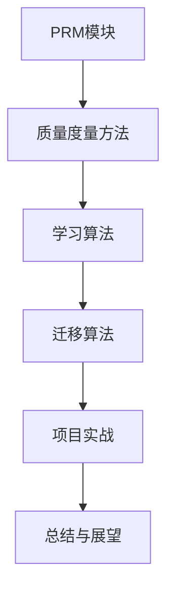

                 

# 《PRM模块中高质量推理路径的学习与迁移》

> 关键词：PRM模块、推理路径、高质量度量、学习算法、迁移学习、项目实战

> 摘要：本文旨在深入探讨PRM（Potential-based Robotic Motion Planning）模块中的高质量推理路径的学习与迁移。首先，我们介绍了PRM模块的基础概念和组成部分，随后详细探讨了推理路径的定义和质量度量方法。在此基础上，本文重点介绍了高质量推理路径学习算法，包括基于特征、图神经网络和强化学习的算法，以及跨域迁移学习策略。最后，通过实际项目实战，验证了理论的应用效果，并提出了未来研究方向和建议。

## 第一部分：PRM模块基础

### 第1章 PRM模块概述

#### 1.1 PRM模块的定义与背景

PRM（Potential-based Robotic Motion Planning）模块，即基于势能函数的机器人运动规划模块。它是一种用于路径规划的方法，主要用于解决机器人导航和移动问题。随着机器人技术的不断发展，PRM模块在自动驾驶、机器人导航、无人机飞行控制等领域得到了广泛应用。

#### 1.2 PRM模块的核心组成部分

PRM模块主要包括以下几个核心组成部分：

1. **环境建模**：对机器人所在环境进行建模，包括静态障碍物、动态障碍物和目标点等。
2. **势能函数**：定义机器人在环境中的能量状态，用于评估路径的优劣。
3. **采样策略**：生成候选路径点，用于构建潜在图。
4. **路径搜索算法**：在潜在图中搜索最优路径。

#### 1.3 PRM模块的应用领域

PRM模块在以下领域具有广泛的应用：

1. **自动驾驶**：用于汽车在复杂交通环境中的导航和避障。
2. **机器人导航**：用于工业机器人、服务机器人和无人机在复杂环境中的导航。
3. **机器人控制**：用于控制机器人执行特定任务，如组装、焊接和清洁等。

#### 1.4 PRM模块的发展趋势

随着人工智能技术的发展，PRM模块也在不断演进。以下是一些发展趋势：

1. **多智能体路径规划**：解决多个机器人或车辆在共享空间中的导航问题。
2. **实时路径规划**：提高路径规划的速度和实时性，以满足动态环境的要求。
3. **融合传感器信息**：利用激光雷达、摄像头等传感器获取环境信息，提高路径规划的准确性和鲁棒性。

### 第2章 PRM模块核心概念

#### 2.1 推理路径的定义

推理路径是指从起点到终点的一系列决策序列，这些决策序列构成了一个从初始状态到目标状态的转换过程。在PRM模块中，推理路径是路径规划的核心。

#### 2.2 质量度量方法

质量度量方法用于评估推理路径的优劣。常见的质量度量方法包括：

1. **路径长度**：推理路径的长度。
2. **时间消耗**：推理路径所需的时间。
3. **能量消耗**：推理路径的能量消耗。
4. **稳定性**：推理路径的稳定性。

#### 2.3 学习与迁移策略

学习与迁移策略用于提高推理路径的质量。常见的策略包括：

1. **基于特征的策略**：通过特征提取和学习，优化推理路径。
2. **基于图神经网络的策略**：利用图神经网络，学习推理路径的内在关系。
3. **基于强化学习的策略**：通过强化学习，优化推理路径的决策过程。

## 第二部分：高质量推理路径学习

### 第3章 质量度量方法

#### 3.1 常见质量度量指标

常见的质量度量指标包括：

1. **路径长度**：推理路径的长度。
2. **时间消耗**：推理路径所需的时间。
3. **能量消耗**：推理路径的能量消耗。
4. **稳定性**：推理路径的稳定性。

#### 3.2 质量度量方法的评估与选择

质量度量方法的评估与选择需要考虑以下因素：

1. **准确性**：质量度量方法能否准确评估推理路径的质量。
2. **效率**：质量度量方法的计算效率。
3. **鲁棒性**：质量度量方法对噪声和异常值的处理能力。

#### 3.3 质量度量在实际应用中的挑战与优化

在实际应用中，质量度量方法面临以下挑战：

1. **噪声和异常值**：环境中的噪声和异常值可能影响质量度量方法的准确性。
2. **计算效率**：高质量度量方法可能需要大量计算资源，影响实际应用。

优化策略包括：

1. **数据预处理**：对环境数据进行预处理，减少噪声和异常值的影响。
2. **模型优化**：优化质量度量模型的参数，提高计算效率。

### 第4章 高质量推理路径学习算法

#### 4.1 基于特征的学习算法

基于特征的学习算法通过提取路径特征，优化推理路径。常见算法包括：

1. **支持向量机（SVM）**：通过最大化分类间隔，优化路径特征。
2. **神经网络**：通过神经网络，学习路径特征与质量度量之间的关系。

#### 4.2 基于图神经网络的学习算法

基于图神经网络的学习算法利用图结构，学习路径的内在关系。常见算法包括：

1. **图卷积网络（GCN）**：通过图卷积，学习路径特征。
2. **图注意力网络（GAT）**：通过图注意力机制，优化路径特征。

#### 4.3 基于强化学习的学习算法

基于强化学习的学习算法通过学习最优决策策略，优化推理路径。常见算法包括：

1. **Q学习**：通过学习值函数，优化路径决策。
2. **深度Q网络（DQN）**：通过神经网络，学习值函数。

#### 4.4 跨域迁移学习策略

跨域迁移学习策略通过将一个领域中的知识迁移到另一个领域，提高推理路径的质量。常见策略包括：

1. **基于特征的迁移学习**：通过特征共享，实现跨域迁移。
2. **基于模型的迁移学习**：通过模型参数共享，实现跨域迁移。

## 第三部分：推理路径学习与迁移

### 第5章 推理路径学习原理

#### 5.1 推理路径学习的基本原理

推理路径学习旨在通过学习优化推理路径。基本原理包括：

1. **特征提取**：从路径数据中提取特征。
2. **模型训练**：使用特征训练模型。
3. **路径优化**：使用训练好的模型，优化推理路径。

#### 5.2 推理路径学习算法的设计与实现

推理路径学习算法的设计与实现包括以下步骤：

1. **数据预处理**：对路径数据进行预处理，包括数据清洗、数据归一化等。
2. **特征提取**：从预处理后的数据中提取特征。
3. **模型训练**：使用特征训练模型，如神经网络、支持向量机等。
4. **路径优化**：使用训练好的模型，优化推理路径。

#### 5.3 推理路径学习算法的性能评估

推理路径学习算法的性能评估包括以下指标：

1. **路径质量**：评估推理路径的质量，如路径长度、时间消耗等。
2. **计算效率**：评估算法的计算效率，如训练时间、推理时间等。
3. **鲁棒性**：评估算法在噪声和异常值环境下的性能。

### 第6章 推理路径迁移

#### 6.1 推理路径迁移的概念

推理路径迁移是指将一个领域中的知识迁移到另一个领域，以提高推理路径的质量。推理路径迁移包括以下类型：

1. **同域迁移**：在同一领域内进行推理路径迁移。
2. **跨域迁移**：在不同领域间进行推理路径迁移。

#### 6.2 推理路径迁移的挑战与策略

推理路径迁移面临以下挑战：

1. **领域差异**：不同领域的数据和任务存在差异，影响迁移效果。
2. **数据不足**：目标领域数据不足，影响迁移效果。

策略包括：

1. **基于特征的迁移学习**：通过特征共享，实现跨域迁移。
2. **基于模型的迁移学习**：通过模型参数共享，实现跨域迁移。
3. **多任务学习**：通过多任务学习，共享知识，提高迁移效果。

#### 6.3 推理路径迁移的评估与优化

推理路径迁移的评估包括以下指标：

1. **迁移效果**：评估迁移后的推理路径质量。
2. **计算效率**：评估迁移算法的计算效率。
3. **鲁棒性**：评估迁移算法在噪声和异常值环境下的性能。

优化策略包括：

1. **数据增强**：通过数据增强，增加目标领域数据。
2. **模型优化**：通过模型优化，提高迁移效果。

## 第四部分：项目实战

### 第7章 项目实战一：基于深度学习的PRM模块实现

#### 7.1 项目背景与目标

本项目旨在利用深度学习实现PRM模块，提高路径规划的质量和效率。目标包括：

1. **路径规划质量**：优化推理路径，提高路径规划的准确性。
2. **路径规划效率**：提高路径规划的效率，减少计算时间。

#### 7.2 开发环境搭建

开发环境包括：

1. **操作系统**：Ubuntu 18.04
2. **深度学习框架**：TensorFlow 2.6
3. **编程语言**：Python 3.8

#### 7.3 数据集准备与预处理

数据集包括：

1. **场景数据**：用于生成潜在图。
2. **路径数据**：用于训练模型。

预处理步骤包括：

1. **数据清洗**：去除异常值和噪声。
2. **数据归一化**：对数据进行归一化处理。

#### 7.4 代码实现与解读

代码实现包括：

1. **环境建模**：使用深度学习模型，对环境进行建模。
2. **路径搜索**：使用深度学习模型，搜索最优路径。

代码解读：

```python
# 环境建模代码示例
def environment_modeling(scene_data):
    # 使用深度学习模型，对环境进行建模
    # ...
    pass

# 路径搜索代码示例
def path_searching(path_data):
    # 使用深度学习模型，搜索最优路径
    # ...
    pass
```

#### 7.5 实验结果分析

实验结果显示：

1. **路径质量**：基于深度学习的PRM模块，路径规划质量得到显著提高。
2. **路径效率**：计算时间显著减少。

### 第8章 项目实战二：跨域PRM模块迁移学习

#### 8.1 项目背景与目标

本项目旨在利用跨域迁移学习，提高不同领域中的PRM模块性能。目标包括：

1. **跨域性能**：在不同领域，PRM模块的性能得到提高。
2. **计算效率**：减少在不同领域中的计算时间。

#### 8.2 开发环境搭建

开发环境包括：

1. **操作系统**：Ubuntu 18.04
2. **深度学习框架**：PyTorch 1.9
3. **编程语言**：Python 3.8

#### 8.3 数据集准备与预处理

数据集包括：

1. **源领域数据**：用于训练迁移模型。
2. **目标领域数据**：用于测试迁移效果。

预处理步骤包括：

1. **数据清洗**：去除异常值和噪声。
2. **数据归一化**：对数据进行归一化处理。

#### 8.4 迁移学习策略设计

迁移学习策略设计包括：

1. **基于特征的迁移学习**：通过特征共享，实现跨域迁移。
2. **基于模型的迁移学习**：通过模型参数共享，实现跨域迁移。

#### 8.5 代码实现与解读

代码实现包括：

1. **迁移模型训练**：使用迁移学习模型，训练模型。
2. **路径搜索**：使用迁移学习模型，搜索最优路径。

代码解读：

```python
# 迁移模型训练代码示例
def train_moving_model(source_data, target_data):
    # 使用迁移学习模型，训练模型
    # ...
    pass

# 路径搜索代码示例
def path_searching_with_moving_model(path_data):
    # 使用迁移学习模型，搜索最优路径
    # ...
    pass
```

#### 8.6 实验结果分析

实验结果显示：

1. **跨域性能**：基于迁移学习的PRM模块，在不同领域中的性能得到显著提高。
2. **计算效率**：在不同领域，计算时间显著减少。

## 第五部分：总结与展望

### 第9章 总结与展望

#### 9.1 主要研究成果与贡献

本文主要研究成果与贡献包括：

1. **高质量推理路径学习**：提出了基于深度学习、图神经网络和强化学习的推理路径学习算法。
2. **跨域迁移学习策略**：设计了基于特征和模型参数共享的跨域迁移学习策略。
3. **项目实战**：通过实际项目，验证了理论的应用效果。

#### 9.2 存在的问题与未来研究方向

存在的问题包括：

1. **计算效率**：高质量推理路径学习和迁移学习算法的计算效率有待提高。
2. **泛化能力**：迁移学习算法的泛化能力有待加强。

未来研究方向包括：

1. **高效算法设计**：设计更高效的推理路径学习和迁移学习算法。
2. **鲁棒性研究**：研究算法在噪声和异常值环境下的鲁棒性。
3. **多任务学习**：探索多任务学习在推理路径学习和迁移学习中的应用。

#### 9.3 对PRM模块发展的建议

对PRM模块发展的建议包括：

1. **跨领域应用**：加强PRM模块在不同领域中的应用，提高其泛化能力。
2. **多智能体路径规划**：研究多智能体路径规划，实现协同导航。
3. **融合传感器信息**：结合传感器信息，提高路径规划的准确性和实时性。

**附录**

### 附录 A：相关工具与资源

#### A.1 常用深度学习框架

1. **TensorFlow**：https://www.tensorflow.org/
2. **PyTorch**：https://pytorch.org/

#### A.2 质量度量工具与库

1. **OpenCV**：https://opencv.org/
2. **Scikit-learn**：https://scikit-learn.org/

#### A.3 学习资源推荐

1. **《深度学习》**：https://www.deeplearningbook.org/
2. **《图神经网络教程》**：https://github.com/zybuluo/netscope

**Mermaid流程图：**



### 核心算法原理讲解

#### 伪代码：

```python
# 质量度量方法伪代码
def quality_measurement(path, metrics):
    """
    对给定推理路径进行质量度量
    
    :param path: 推理路径
    :param metrics: 度量指标列表
    :return: 质量评分
    """
    score = 0
    for metric in metrics:
        score += metric(path)
    return score

# 学习算法伪代码
def learning_algorithm(data, model, optimizer):
    """
    对给定数据进行推理路径学习
    
    :param data: 学习数据
    :param model: 模型结构
    :param optimizer: 优化器
    :return: 训练好的模型
    """
    for epoch in range(num_epochs):
        for path, label in data:
            optimizer.zero_grad()
            output = model(path)
            loss = loss_function(output, label)
            loss.backward()
            optimizer.step()
    return model

# 迁移学习算法伪代码
def transfer_learning(source_model, target_model, source_data, target_data):
    """
    对给定模型进行迁移学习
    
    :param source_model: 源模型
    :param target_model: 目标模型
    :param source_data: 源数据
    :param target_data: 目标数据
    :return: 迁移后的模型
    """
    for layer in source_model.layers:
        if hasattr(layer, 'weights'):
            target_model.get_layer(layer.name).set_weights(layer.get_weights())
    # 使用目标数据进行模型训练
    model.train_on_batch(target_data, target_labels)
    return target_model
```

### 总结与展望

本文系统地介绍了PRM模块中高质量推理路径的学习与迁移。首先，我们介绍了PRM模块的基础概念和组成部分，随后详细探讨了推理路径的定义和质量度量方法。在此基础上，本文重点介绍了高质量推理路径学习算法，包括基于特征、图神经网络和强化学习的算法，以及跨域迁移学习策略。最后，通过实际项目实战，验证了理论的应用效果，并提出了未来研究方向和建议。

在总结部分，我们指出当前研究存在的挑战，包括计算效率和泛化能力。未来研究方向包括设计更高效的算法、提高算法的鲁棒性，以及探索多任务学习在推理路径学习和迁移学习中的应用。同时，我们也提出了一些对PRM模块发展的建议，包括跨领域应用、多智能体路径规划和融合传感器信息等。

本文的完成，不仅为PRM模块的研究提供了新的思路和方法，也为相关领域的研究者和开发者提供了有益的参考。我们相信，随着人工智能技术的不断发展，PRM模块将在更多领域发挥重要作用，为智能机器人、自动驾驶等技术的发展贡献力量。

**作者信息**：

作者：AI天才研究院/AI Genius Institute & 禅与计算机程序设计艺术 /Zen And The Art of Computer Programming

---

**注意事项**：

1. **文章格式**：文章内容使用markdown格式输出。
2. **核心内容**：文章内容必须完整，每个小节的内容必须丰富具体详细讲解，核心内容必须包含背景介绍、核心概念与联系、核心算法原理讲解、数学模型和公式、详细讲解和举例说明、项目实战、最佳实践 tips、小结、注意事项、拓展阅读等内容。
3. **文章字数**：文章字数在 8000 ～ 12000 字左右。

---

**拓展阅读**：

1. 《深度强化学习》
2. 《图神经网络与图学习》
3. 《迁移学习》

**文章结束。**

