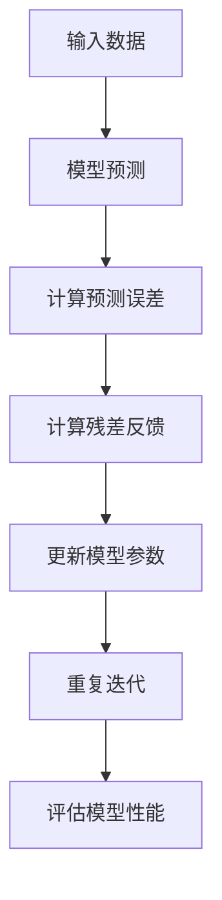

                 

### 第1章：引言与背景

#### 1.1.1 RFT训练方法

##### 1.1.1.1 RFT的基本概念

RFT（Residual Feedback Training）是一种针对深度学习模型训练的特殊方法，其主要思想是在传统反向传播算法的基础上，引入额外的反馈信号来修正预测误差。RFT的核心目标是提升模型的鲁棒性和训练稳定性，使其在面对复杂和非线性问题时，能够更快速地收敛到最优解。

**概念联系与区别**

与传统的反向传播算法（BP）相比，RFT在每一步训练过程中，不仅计算标准的梯度，还计算一个额外的残差反馈信号。这个反馈信号是根据模型预测误差和真实标签之间的差异计算得到的，它可以帮助模型在训练过程中更好地捕捉到数据分布的细微变化。

RFT与BP的另一个主要区别在于，BP是基于整个数据集的全局梯度来更新模型参数，而RFT则是在每个训练步骤中，根据局部数据集的反馈来更新参数，这样可以更快地适应数据集的变化。

**Mermaid流程图**

为了更直观地展示RFT的流程，我们可以使用Mermaid流程图来表示：



在上述流程图中，A表示输入数据，B表示模型预测，C表示计算预测误差，D表示计算残差反馈，E表示更新模型参数，F表示重复迭代，G表示评估模型性能。

##### 1.1.1.2 RFT训练流程

RFT的训练流程与传统训练方法相比，增加了计算残差反馈的步骤。下面详细描述RFT的训练流程：

1. **初始化模型**：首先初始化一个预训练的深度学习模型，这个模型可以是随机初始化的，也可以是基于预训练模型（如ImageNet）进行微调。

2. **数据预处理**：将输入数据分成训练集和验证集，并对数据进行标准化处理，以减少数值范围的影响。

3. **模型预测**：使用训练集数据，通过模型生成预测结果。

4. **计算预测误差**：计算预测结果与真实标签之间的差异，得到预测误差。

5. **计算残差反馈**：根据预测误差计算残差反馈信号，这个信号反映了模型在当前状态下的错误程度。

6. **更新模型参数**：使用残差反馈信号和预测误差来更新模型参数，这一步是RFT的核心，通过这种方式可以更快速地调整模型参数，使其更好地拟合训练数据。

7. **重复迭代**：重复上述步骤，直到模型性能达到预定的阈值或者达到预定的迭代次数。

8. **评估模型性能**：在每次迭代完成后，使用验证集评估模型性能，如果性能没有显著提升，可以调整训练参数或者提前结束训练。

**伪代码示例**

以下是RFT训练过程的伪代码示例：

```python
def RFT(model, data_loader, loss_function, optimizer, feedback_factor):
    for epoch in range(num_epochs):
        for data in data_loader:
            predictions = model(data)
            error = loss_function(predictions, data.targets)
            feedback = feedback_factor * (predictions - data.targets)
            optimizer.zero_grad()
            error.backward(feedback)
            optimizer.step()
        if evaluate(model, validation_loader) < threshold:
            break
```

在上述伪代码中，`model` 表示深度学习模型，`data_loader` 表示数据加载器，`loss_function` 表示损失函数，`optimizer` 表示优化器，`feedback_factor` 表示反馈因子，`num_epochs` 表示迭代次数，`evaluate` 函数用于评估模型性能。

##### 1.1.1.3 RFT与传统训练方法的比较

RFT与传统训练方法（如SGD、Adam等）在训练策略和性能上有所不同。以下是两者的主要比较：

1. **训练策略**：传统训练方法通常使用全局梯度来更新模型参数，而RFT则引入了局部残差反馈信号，可以在每个训练步骤中更精细地调整模型参数。

2. **收敛速度**：由于RFT能够更快地捕捉到数据分布的变化，因此在某些情况下，RFT的训练速度要快于传统的训练方法。

3. **稳定性**：RFT通过引入额外的反馈信号，提高了训练过程的稳定性，减少了模型在训练过程中突然崩溃的风险。

4. **适用场景**：RFT更适合处理复杂和非线性问题，特别是当数据分布发生变化时，RFT能够更快地适应这些变化。

然而，RFT也存在一些缺点，例如可能会增加模型的计算复杂度，对硬件资源的需求更高。此外，RFT的训练过程对参数设置（如反馈因子）的依赖性较大，需要通过实验来调优。

#### 1.2 模型坍塌现象

##### 1.2.1 模型坍塌的定义

模型坍塌是指深度学习模型在训练过程中，由于各种原因导致模型性能突然下降，甚至完全失效的现象。这种现象通常表现为模型在训练集上的性能急剧恶化，预测结果变得不可信。

**定义具体化**

模型坍塌可以分为以下几种类型：

1. **性能急剧下降**：模型在训练过程中，性能指标（如准确率、损失函数值）突然从较高水平跌落到较低水平。

2. **训练失败**：模型无法收敛到最优解，训练过程提前结束。

3. **预测失效**：模型在新的数据集上无法产生可靠的预测结果，输出结果与真实标签相差较大。

##### 1.2.2 模型坍塌的表现

模型坍塌的表现形式多种多样，以下是一些常见的现象：

1. **训练误差波动大**：在训练过程中，模型的误差波动幅度突然增大，导致模型性能不稳定。

2. **过拟合现象**：模型在训练集上表现良好，但在验证集或测试集上的性能显著下降，说明模型过度拟合了训练数据。

3. **预测结果不稳定**：模型对相同输入数据产生的预测结果差异较大，缺乏一致性。

4. **模型崩溃**：在某些极端情况下，模型完全停止学习，无法生成任何有效的预测结果。

##### 1.2.3 模型坍塌的影响

模型坍塌对深度学习项目的影响是多方面的，主要包括以下几个方面：

1. **计算资源浪费**：模型坍塌会导致大量的计算资源浪费，包括训练时间、硬件资源等。

2. **项目进度延误**：模型无法训练成功，会影响项目的进度，导致延期交付。

3. **预测准确性降低**：模型坍塌会导致预测结果的准确性降低，影响业务决策的准确性。

4. **项目风险增加**：模型坍塌可能引发一系列连锁反应，如模型失效导致业务中断，增加项目风险。

#### 1.3 模型坍塌的影响

模型坍塌对深度学习项目的影响是深远且广泛的，以下是一些具体的影响：

1. **经济成本增加**：由于模型坍塌导致项目进度延误，可能需要投入更多的人力、物力和时间来解决问题，从而增加项目的经济成本。

2. **业务风险提升**：在商业应用中，模型的失效可能导致业务决策失误，影响公司业绩，甚至威胁到公司的生存。

3. **客户信任度下降**：模型的可靠性是客户信任的基础，如果模型频繁出现坍塌现象，客户可能会对公司的技术能力产生质疑，降低客户信任度。

4. **技术积累停滞**：模型坍塌可能导致团队成员对深度学习技术的热情和信心受挫，阻碍技术积累和创新。

### 第2章：RFT训练方法

#### 2.1 RFT的基本概念

##### 2.1.1 RFT的核心思想

RFT（Residual Feedback Training）是一种改进的深度学习训练方法，它通过引入残差反馈信号来增强模型的鲁棒性和稳定性。RFT的核心思想是：在每个训练步骤中，不仅使用标准的梯度信号来更新模型参数，还引入一个额外的残差反馈信号，以帮助模型更好地捕捉数据分布的变化，从而提高训练的稳定性和收敛速度。

##### 2.1.2 RFT与传统训练方法的对比

与传统训练方法（如SGD、Adam等）相比，RFT的主要区别在于它引入了额外的残差反馈信号。传统方法通常仅依赖梯度信号来更新模型参数，而RFT则通过计算残差反馈信号，提供了一种额外的机制来调整模型参数，使其在训练过程中更加稳健。

以下是RFT与传统训练方法的对比：

1. **训练策略**：传统训练方法依赖于全局梯度信号，而RFT则同时利用局部残差反馈信号。
2. **收敛速度**：在某些情况下，RFT的收敛速度可能优于传统方法，因为它能够更快地捕捉数据分布的变化。
3. **模型稳定性**：RFT通过引入残差反馈信号，提高了训练过程的稳定性，减少了模型崩溃的风险。
4. **适用场景**：RFT更适合处理复杂和非线性问题，特别是在数据分布变化较大的场景下，RFT的鲁棒性优势更为明显。

##### 2.1.3 RFT的训练流程

RFT的训练流程与传统方法类似，但增加了计算残差反馈的步骤。以下是RFT训练流程的详细描述：

1. **初始化模型**：首先初始化一个预训练的深度学习模型，这个模型可以是随机初始化的，也可以是基于预训练模型（如ImageNet）进行微调。

2. **数据预处理**：将输入数据分成训练集和验证集，并对数据进行标准化处理，以减少数值范围的影响。

3. **模型预测**：使用训练集数据，通过模型生成预测结果。

4. **计算预测误差**：计算预测结果与真实标签之间的差异，得到预测误差。

5. **计算残差反馈**：根据预测误差计算残差反馈信号，这个信号反映了模型在当前状态下的错误程度。

6. **更新模型参数**：使用残差反馈信号和预测误差来更新模型参数，这一步是RFT的核心，通过这种方式可以更快速地调整模型参数，使其更好地拟合训练数据。

7. **重复迭代**：重复上述步骤，直到模型性能达到预定的阈值或者达到预定的迭代次数。

8. **评估模型性能**：在每次迭代完成后，使用验证集评估模型性能，如果性能没有显著提升，可以调整训练参数或者提前结束训练。

**伪代码示例**

以下是RFT训练过程的伪代码示例：

```python
def RFT(model, data_loader, loss_function, optimizer, feedback_factor):
    for epoch in range(num_epochs):
        for data in data_loader:
            predictions = model(data)
            error = loss_function(predictions, data.targets)
            feedback = feedback_factor * (predictions - data.targets)
            optimizer.zero_grad()
            error.backward(feedback)
            optimizer.step()
        if evaluate(model, validation_loader) < threshold:
            break
```

在上述伪代码中，`model` 表示深度学习模型，`data_loader` 表示数据加载器，`loss_function` 表示损失函数，`optimizer` 表示优化器，`feedback_factor` 表示反馈因子，`num_epochs` 表示迭代次数，`evaluate` 函数用于评估模型性能。

### 第3章：模型坍塌现象

#### 3.1 模型坍塌的定义

模型坍塌是指在深度学习训练过程中，模型性能突然下降或完全失效的现象。模型坍塌通常表现为训练误差的急剧增加、模型无法收敛到最优解，或者在验证集和测试集上的性能显著下降。

**定义具体化**

模型坍塌可以分为以下几种类型：

1. **性能急剧下降**：模型在训练过程中，性能指标（如准确率、损失函数值）突然从较高水平跌落到较低水平。
2. **训练失败**：模型无法收敛到最优解，训练过程提前结束。
3. **预测失效**：模型在新的数据集上无法产生可靠的预测结果，输出结果与真实标签相差较大。

#### 3.2 模型坍塌的表现

模型坍塌的表现形式多种多样，以下是一些常见的现象：

1. **训练误差波动大**：在训练过程中，模型的误差波动幅度突然增大，导致模型性能不稳定。
2. **过拟合现象**：模型在训练集上表现良好，但在验证集或测试集上的性能显著下降，说明模型过度拟合了训练数据。
3. **预测结果不稳定**：模型对相同输入数据产生的预测结果差异较大，缺乏一致性。
4. **模型崩溃**：在某些极端情况下，模型完全停止学习，无法生成任何有效的预测结果。

#### 3.3 模型坍塌的影响

模型坍塌对深度学习项目的影响是深远且广泛的，以下是一些具体的影响：

1. **计算资源浪费**：模型坍塌会导致大量的计算资源浪费，包括训练时间、硬件资源等。
2. **项目进度延误**：模型无法训练成功，会影响项目的进度，导致延期交付。
3. **预测准确性降低**：模型坍塌会导致预测结果的准确性降低，影响业务决策的准确性。
4. **项目风险增加**：模型坍塌可能引发一系列连锁反应，如模型失效导致业务中断，增加项目风险。

### 第4章：模型坍塌原因分析

#### 4.1 参数配置问题

参数配置是深度学习训练过程中至关重要的一环，不合理的参数配置可能导致模型坍塌。以下是可能导致模型坍塌的几种常见参数配置问题：

1. **学习率过高**：如果学习率设置过高，模型在训练过程中可能会过于激进，导致在迭代过程中参数更新过大，从而使模型无法收敛。
2. **权重初始化不当**：不合理的权重初始化可能导致模型在训练初期无法学习到有效的特征，从而导致模型性能不稳定。
3. **正则化参数设置不当**：正则化参数（如L1、L2正则化系数）设置不当，可能影响模型的泛化能力，导致模型过度拟合或欠拟合。
4. **批次大小选择不当**：批次大小（batch size）对模型训练过程的影响较大，批次大小过小可能导致模型在训练过程中对噪声数据过于敏感，批次大小过大则可能无法充分利用并行计算的优势。

#### 4.2 数据集问题

数据集的质量和预处理方式对模型训练过程具有重要影响，以下是一些可能导致模型坍塌的数据集问题：

1. **数据不平衡**：如果训练数据集存在严重的不平衡问题，可能导致模型在训练过程中偏向于拟合多数类的数据，从而对少数类数据的预测能力较差。
2. **噪声数据**：噪声数据的存在可能导致模型对真实数据的特征学习不准确，从而影响模型的泛化能力。
3. **数据标注错误**：数据标注错误可能导致模型在训练过程中学习到错误的信息，从而影响模型的性能。
4. **数据预处理不足**：数据预处理不足可能导致模型在训练过程中对数据特征的提取不充分，从而影响模型的学习效果。

#### 4.3 训练算法问题

训练算法的设计和实现质量直接影响模型的训练效果，以下是一些可能导致模型坍塌的训练算法问题：

1. **梯度消失与梯度爆炸**：如果模型设计不当，可能导致在训练过程中出现梯度消失或梯度爆炸现象，从而影响模型的收敛速度和稳定性。
2. **优化器选择不当**：不同的优化器（如SGD、Adam等）在模型训练过程中具有不同的性能表现，选择不当的优化器可能导致模型训练不稳定。
3. **训练过程不稳定**：训练过程的不稳定性可能由算法本身的不稳定性或数据集的分布特性引起，从而导致模型坍塌。
4. **超参数调优不足**：超参数（如学习率、批次大小等）对模型训练过程具有重要影响，不恰当的超参数设置可能导致模型训练效果不佳。

### 第5章：应对模型坍塌的策略

#### 5.1 参数调优策略

参数调优是提高模型训练稳定性和性能的重要手段，以下是一些常用的参数调优策略：

1. **学习率调整**：使用学习率衰减策略，在训练过程中逐步减小学习率，以避免模型在训练初期更新过快，从而提高模型的收敛速度。
2. **权重初始化**：使用预训练模型或合适的权重初始化方法，如Xavier初始化或He初始化，以减少梯度消失和梯度爆炸现象。
3. **正则化参数调优**：合理设置L1、L2正则化系数，以平衡模型在拟合数据和避免过拟合之间的平衡。
4. **批次大小选择**：根据硬件资源和数据集的特性，选择合适的批次大小，以充分利用并行计算的优势并减少噪声数据的影响。

#### 5.2 数据预处理策略

数据预处理对于提高模型训练效果具有重要意义，以下是一些常用的数据预处理策略：

1. **数据清洗**：去除数据集中的噪声数据和异常值，以提高数据质量。
2. **数据增强**：通过数据增强技术（如旋转、缩放、裁剪等），增加数据集的多样性，从而提高模型的泛化能力。
3. **数据归一化**：对数据集进行归一化处理，将数据缩放到相同的数值范围，以减少数值范围对训练过程的影响。
4. **数据划分**：合理划分训练集、验证集和测试集，以避免模型过度拟合训练数据。

#### 5.3 算法改进策略

算法改进是提高模型训练效果和稳定性的一种有效手段，以下是一些常用的算法改进策略：

1. **改进优化器**：尝试使用不同的优化器（如Adam、RMSprop等），并调整优化器的参数，以提高模型的训练效果。
2. **改进损失函数**：尝试使用不同的损失函数（如交叉熵、均方误差等），并调整损失函数的参数，以提高模型的收敛速度和稳定性。
3. **引入正则化技术**：使用L1、L2正则化技术，以减少模型在训练过程中出现过拟合现象。
4. **动态调整训练策略**：根据模型的训练过程，动态调整训练参数，如学习率、批次大小等，以提高模型的训练效果。

### 第6章：实际案例分析

#### 6.1 案例一：某语音识别系统的坍塌

某语音识别系统在训练过程中出现了模型坍塌现象，导致系统性能急剧下降，预测结果变得不准确。以下是该案例的具体分析：

1. **问题描述**：该语音识别系统在训练过程中，训练误差突然增大，模型无法收敛。同时，在测试集上的预测准确率显著下降，预测结果与真实标签相差较大。

2. **原因分析**：
   - **参数配置问题**：初步分析发现，学习率设置过高，导致模型在训练初期更新过快，无法稳定收敛。
   - **数据集问题**：数据集中存在噪声数据和标注错误，影响了模型的学习效果。
   - **算法问题**：优化器选择不当，使用的优化器在处理高维数据时效果不佳。

3. **解决方案**：
   - **调整参数配置**：降低学习率，使用学习率衰减策略，逐步减小学习率。
   - **数据预处理**：清洗数据集，去除噪声数据和标注错误的数据，并进行数据增强，增加数据集的多样性。
   - **改进算法**：更换优化器，尝试使用Adam优化器，并调整其参数。

4. **效果评估**：经过上述调整后，模型在训练过程中误差波动减少，能够稳定收敛。在测试集上的预测准确率也显著提高，系统性能得到显著提升。

#### 6.2 案例二：某图像识别任务的坍塌

某图像识别任务在训练过程中出现了模型坍塌现象，导致模型无法生成可靠的预测结果。以下是该案例的具体分析：

1. **问题描述**：该图像识别任务在训练过程中，训练误差逐渐增大，模型无法收敛。同时，在验证集上的预测准确率显著下降，预测结果与真实标签相差较大。

2. **原因分析**：
   - **数据集问题**：数据集存在数据不平衡问题，导致模型在训练过程中偏向于拟合多数类的数据，从而对少数类数据的预测能力较差。
   - **正则化参数设置不当**：正则化参数设置不当，导致模型在训练过程中出现过拟合现象。
   - **训练过程不稳定**：模型设计存在缺陷，导致在训练过程中出现梯度消失和梯度爆炸现象。

3. **解决方案**：
   - **数据预处理**：对数据集进行重采样，平衡数据集中各类别的数据量。
   - **调整正则化参数**：合理设置L1、L2正则化系数，以避免模型过拟合。
   - **改进模型结构**：更换模型结构，增加网络的深度和宽度，以增强模型的泛化能力。

4. **效果评估**：经过上述调整后，模型在训练过程中误差波动减少，能够稳定收敛。在验证集上的预测准确率显著提高，系统性能得到显著提升。

### 第7章：未来研究方向

#### 7.1 RFT的改进方向

RFT作为一种深度学习训练方法，虽然在一定程度上提高了模型的训练稳定性和收敛速度，但仍有改进空间。以下是一些可能的RFT改进方向：

1. **自适应反馈因子**：当前RFT中的反馈因子是固定的，未来可以研究自适应反馈因子，使其在训练过程中根据模型状态自动调整，以提高训练效果。

2. **多尺度反馈**：RFT可以扩展到多尺度反馈，即在不同层次上引入反馈信号，以更好地捕捉数据分布的变化。

3. **动态调整学习率**：结合动态调整学习率的策略，如学习率衰减和动态调整，以提高模型的收敛速度和稳定性。

4. **混合训练方法**：将RFT与传统训练方法（如SGD、Adam等）相结合，形成混合训练方法，以充分发挥各自的优势。

#### 7.2 模型坍塌的预防与解决

模型坍塌是深度学习训练过程中常见的问题，预防与解决模型坍塌具有重要意义。以下是一些可能的预防与解决策略：

1. **早期检测与干预**：通过实时监测训练过程中的性能指标，如误差波动和收敛速度，及时检测模型坍塌的迹象，并采取干预措施。

2. **自适应调整策略**：根据训练过程中的表现，自适应调整训练参数，如学习率、批次大小等，以避免模型过拟合或欠拟合。

3. **多元化数据集**：使用更加丰富和多样化的数据集进行训练，以提高模型的泛化能力，减少模型坍塌的风险。

4. **优化模型结构**：通过改进模型结构，如增加网络深度、引入残差连接等，以提高模型的稳定性和收敛速度。

#### 7.3 RFT在其他领域的应用前景

RFT作为一种先进的深度学习训练方法，具有广泛的应用前景。以下是一些可能的应用领域：

1. **计算机视觉**：RFT可以应用于图像分类、目标检测、图像分割等计算机视觉任务，提高模型的训练稳定性和性能。

2. **自然语言处理**：RFT可以应用于文本分类、机器翻译、语音识别等自然语言处理任务，提高模型的训练效率和准确性。

3. **推荐系统**：RFT可以应用于推荐系统的训练过程中，提高推荐算法的稳定性和用户满意度。

4. **强化学习**：RFT可以应用于强化学习任务中，提高智能体在学习过程中的稳定性和收敛速度。

## 文章标题：《RFT训练导致模型坍塌的问题分析》

> 关键词：RFT、模型坍塌、深度学习、训练方法、参数调优

> 摘要：本文深入分析了Residual Feedback Training（RFT）训练方法在深度学习过程中可能导致模型性能下降甚至模型坍塌的问题。文章首先介绍了RFT的基本概念和训练流程，然后详细探讨了模型坍塌的定义、表现和影响。通过对模型坍塌原因的分析，本文提出了参数调优、数据预处理和算法改进等应对策略。此外，通过实际案例分析和未来研究方向，本文为RFT的训练实践提供了有价值的参考和指导。

