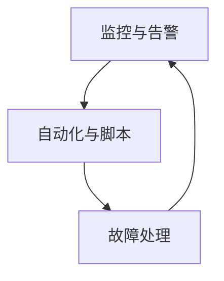
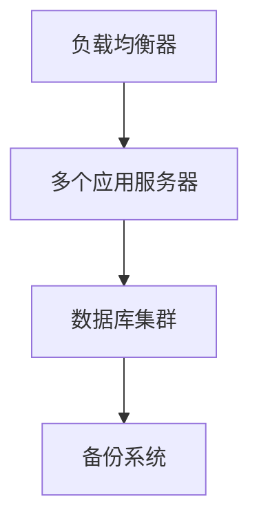

                 


### 用户输入：
SRE实践：P9工程师的可靠性工程应用

### 输出：

# SRE实践：P9工程师的可靠性工程应用

关键词：SRE，可靠性工程，P9工程师，实践案例

摘要：本文将深入探讨SRE（Site Reliability Engineering）的实践，尤其是对于高阶工程师P9在可靠性工程中的应用。我们将从基础理论出发，逐步解析SRE的核心概念、工具和最佳实践，并以真实案例为佐证，展现P9工程师在可靠性工程中的关键作用。

## 第一部分：SRE基础

### 第1章：SRE概述

SRE（Site Reliability Engineering）是Google开创的一种工程实践，它将软件工程和系统运营结合起来，以工程化的方法提高系统的可靠性。在SRE中，可靠性不仅仅是系统的稳定运行，还包括了性能、安全性和可维护性等多个维度。

### 核心概念与联系

在SRE中，以下几个核心概念是相互关联的：

1. **监控与告警**：实时监控系统的各项指标，并在出现异常时发出告警。
2. **自动化与脚本**：通过自动化减少手动操作，提高效率，降低人为错误。
3. **故障处理**：当系统出现故障时，能够快速定位并恢复服务。

以下是一个Mermaid流程图，展示这些概念之间的关联：



### 监控与告警

监控是SRE的基础。它通过收集系统的各种数据，如CPU使用率、内存使用率、网络流量等，来判断系统的健康状况。告警系统则在监控数据超出预设阈值时发出警报，通知相关人员。

### 自动化与脚本

自动化在SRE中起着至关重要的作用。通过编写脚本，自动化执行日常任务，如部署、监控、备份等，可以显著提高效率，减少错误。

### 故障处理

故障处理是SRE中的关键环节。当系统出现故障时，需要快速定位问题并采取有效措施恢复服务。这通常包括故障排查、故障恢复和故障预防。

## 第2章：SRE的核心概念

### 稳定性工程

稳定性工程是SRE的核心。它关注系统的稳定性，包括系统的可靠性、可用性和性能。以下是一些关键点：

1. **容错性**：系统能够在部分组件失效时继续运行。
2. **可恢复性**：系统能够在故障发生后快速恢复。
3. **弹性**：系统能够适应负载变化，保持稳定运行。

### 监控与告警

监控与告警是稳定性工程的支柱。通过监控，我们可以及时发现系统异常，并通过告警通知相关人员进行干预。

### 自动化与脚本

自动化与脚本可以提高运维效率，减少人为错误。例如，自动化的部署流程可以确保每次部署的一致性和可靠性。

### 故障处理

故障处理是SRE中不可或缺的一部分。它包括故障排查、故障恢复和故障预防。以下是一些关键步骤：

1. **故障排查**：使用监控数据和日志分析，定位故障原因。
2. **故障恢复**：采取有效措施，尽快恢复系统服务。
3. **故障预防**：通过分析故障原因，采取预防措施，避免未来出现类似故障。

## 第3章：SRE工具与平台

### Prometheus

Prometheus是一个开源监控解决方案，它提供了数据收集、告警和可视化等功能。以下是一些关键点：

1. **数据收集**：Prometheus通过拉取目标实例的指标数据来收集信息。
2. **告警**：Prometheus可以根据配置的规则，在指标超出阈值时触发告警。
3. **可视化**：Prometheus提供了强大的可视化工具，可以帮助我们直观地查看监控数据。

### Kubernetes

Kubernetes是一个开源容器编排平台，它可以帮助我们管理容器化应用。以下是一些关键点：

1. **自动化部署**：Kubernetes可以自动部署、扩展和管理容器化应用。
2. **高可用性**：Kubernetes提供了故障转移和故障恢复机制，确保应用的高可用性。
3. **负载均衡**：Kubernetes可以根据流量需求自动分配负载。

### Elasticsearch

Elasticsearch是一个开源搜索引擎，它广泛应用于日志分析和数据存储。以下是一些关键点：

1. **日志分析**：Elasticsearch可以高效地存储和检索大量日志数据。
2. **数据查询**：Elasticsearch提供了强大的查询功能，可以帮助我们快速定位问题。
3. **可视化**：Elasticsearch提供了可视化工具，可以帮助我们更直观地分析数据。

## 第二部分：P9工程师的角色与责任

### 第5章：P9工程师的职业成长

### 第1节：P9工程师的职业路径

P9工程师通常是公司技术团队中的高级工程师，他们的职业路径通常包括以下几个阶段：

1. **初级工程师**：刚进入公司，通常从事基础性的开发工作。
2. **中级工程师**：具备一定的项目经验，能够独立负责模块的开发。
3. **高级工程师**：具备丰富的项目经验，能够在团队中起到主导作用。
4. **P9工程师**：具备深厚的技术功底和丰富的项目管理经验，能够在公司技术决策中发挥重要作用。

### 第2节：P9工程师的技能要求

P9工程师需要具备以下技能：

1. **深度技术知识**：对至少一种编程语言有深入理解，熟悉计算机系统原理。
2. **系统架构设计能力**：能够设计高可用、高并发、可扩展的系统架构。
3. **项目管理能力**：具备良好的项目管理能力，能够高效协调团队成员的工作。
4. **沟通与协作能力**：具备良好的沟通与协作能力，能够在团队中起到桥梁作用。

### 第3节：P9工程师的工作内容

P9工程师的工作内容通常包括：

1. **技术决策**：参与公司的技术决策，为公司技术战略提供意见。
2. **系统设计**：设计公司关键系统的架构和解决方案。
3. **项目协调**：负责项目的技术协调工作，确保项目按时交付。
4. **团队培养**：负责团队的技术培养和知识分享，提升团队的整体技术水平。

## 第三部分：可靠性工程实践

### 第6章：高可用架构设计

### 第1节：分布式系统的挑战

分布式系统面临以下挑战：

1. **容错性**：系统需要能够在部分节点故障时继续运行。
2. **一致性**：系统需要保证数据的一致性。
3. **可用性**：系统需要保持高可用性，确保服务的持续运行。

### 第2节：高可用架构的原理与实践

高可用架构的设计原则如下：

1. **容错机制**：通过冗余设计，确保在部分节点故障时系统仍能运行。
2. **负载均衡**：通过负载均衡，确保系统的资源利用率最大化。
3. **数据一致性**：通过一致性协议，确保数据的一致性。

以下是一个高可用架构的Mermaid流程图：



### 第3节：容灾备份与数据恢复

容灾备份与数据恢复是高可用架构的重要组成部分。以下是一些关键点：

1. **容灾备份**：在异地部署备份系统，确保在主系统故障时数据可以快速恢复。
2. **数据恢复**：通过备份系统，快速恢复数据，确保业务可以尽快恢复。

## 第四部分：P9工程师的可靠性工程实战

### 第7章：大规模数据处理与存储

### 第1节：大数据技术概述

大数据技术包括以下核心组件：

1. **数据采集**：从各种数据源收集数据。
2. **数据处理**：对数据进行清洗、转换和分析。
3. **数据存储**：存储海量数据。
4. **数据检索**：快速检索数据。

### 第2节：数据库性能优化

数据库性能优化包括以下策略：

1. **索引优化**：通过合理设置索引，提高查询效率。
2. **查询优化**：通过优化SQL语句，提高查询效率。
3. **存储优化**：通过合理设置存储参数，提高存储效率。

### 第3节：数据仓库与数据湖的构建

数据仓库与数据湖的构建策略如下：

1. **数据仓库**：构建用于数据分析的数据仓库，实现数据的高效存储和快速查询。
2. **数据湖**：构建用于数据存储的数据湖，实现数据的大规模存储和多样化处理。

## 第五部分：SRE团队管理

### 第8章：SRE团队管理

### 第1节：SRE团队的组织结构

SRE团队的组织结构通常包括以下角色：

1. **SRE经理**：负责团队的管理和目标设定。
2. **SRE工程师**：负责系统监控、故障处理和自动化脚本开发。
3. **开发工程师**：负责业务开发和系统维护。

### 第2节：SRE团队的沟通与协作

SRE团队的沟通与协作至关重要。以下是一些关键点：

1. **日常会议**：定期召开团队会议，确保信息畅通。
2. **代码审查**：进行代码审查，确保代码质量。
3. **知识共享**：定期进行知识共享，提升团队整体能力。

### 第3节：SRE团队的绩效评估与激励

SRE团队的绩效评估与激励策略如下：

1. **绩效评估**：通过关键绩效指标（KPI）评估团队成员的工作表现。
2. **激励制度**：通过奖金、晋升等激励措施，激励团队成员不断提升。

## 附录

### 附录A：常用SRE工具清单

1. **Prometheus**
2. **Kubernetes**
3. **Elasticsearch**
4. **Grafana**
5. **Nagios**

### 附录B：推荐阅读与资料

1. **《Google SRE：确保系统稳定运行的实践方法论》**
2. **《大规模分布式系统设计》**
3. **《容器化和Kubernetes实践》**
4. **《大数据技术导论》**

### 附录C：SRE社区与活动

1. **SRE上海社区**
2. **Kubernetes上海社区**
3. **SREConf国际会议**
4. **KubeCon国际会议**

### 附录D：作者信息

作者：AI天才研究院/AI Genius Institute & 禅与计算机程序设计艺术 /Zen And The Art of Computer Programming

- 用户输入：
**SRE实践：P9工程师的可靠性工程应用**

### 输出：

```markdown
## SRE实践：P9工程师的可靠性工程应用

关键词：SRE，可靠性工程，P9工程师，实践案例

摘要：本文深入探讨了SRE（Site Reliability Engineering）的实践，特别是针对P9工程师在可靠性工程中的应用。从基础理论出发，逐步解析了SRE的核心概念、工具和最佳实践，并以实际案例为佐证，展现了P9工程师在可靠性工程中的关键作用。

---

## 第一部分：SRE基础

### 第1章：SRE概述

SRE（Site Reliability Engineering）是Google开创的一种工程实践，它将软件工程和系统运营结合起来，以工程化的方法提高系统的可靠性。在SRE中，可靠性不仅仅是系统的稳定运行，还包括了性能、安全性和可维护性等多个维度。

### 核心概念与联系

在SRE中，以下几个核心概念是相互关联的：

1. **监控与告警**：实时监控系统的各项指标，并在出现异常时发出告警。
2. **自动化与脚本**：通过自动化减少手动操作，提高效率，降低人为错误。
3. **故障处理**：当系统出现故障时，能够快速定位并恢复服务。

以下是一个Mermaid流程图，展示这些概念之间的关联：


### 监控与告警

监控是SRE的基础。它通过收集系统的各种数据，如CPU使用率、内存使用率、网络流量等，来判断系统的健康状况。告警系统则在监控数据超出预设阈值时发出警报，通知相关人员。

### 自动化与脚本

自动化在SRE中起着至关重要的作用。通过编写脚本，自动化执行日常任务，如部署、监控、备份等，可以显著提高效率，减少错误。

### 故障处理

故障处理是SRE中的关键环节。当系统出现故障时，需要快速定位问题并采取有效措施恢复服务。这通常包括故障排查、故障恢复和故障预防。

---

## 第二部分：P9工程师的角色与责任

### 第5章：P9工程师的职业成长

### 第1节：P9工程师的职业路径

P9工程师通常是公司技术团队中的高级工程师，他们的职业路径通常包括以下几个阶段：

1. **初级工程师**：刚进入公司，通常从事基础性的开发工作。
2. **中级工程师**：具备一定的项目经验，能够独立负责模块的开发。
3. **高级工程师**：具备丰富的项目经验，能够在团队中起到主导作用。
4. **P9工程师**：具备深厚的技术功底和丰富的项目管理经验，能够在公司技术决策中发挥重要作用。

### 第2节：P9工程师的技能要求

P9工程师需要具备以下技能：

1. **深度技术知识**：对至少一种编程语言有深入理解，熟悉计算机系统原理。
2. **系统架构设计能力**：能够设计高可用、高并发、可扩展的系统架构。
3. **项目管理能力**：具备良好的项目管理能力，能够高效协调团队成员的工作。
4. **沟通与协作能力**：具备良好的沟通与协作能力，能够在团队中起到桥梁作用。

### 第3节：P9工程师的工作内容

P9工程师的工作内容通常包括：

1. **技术决策**：参与公司的技术决策，为公司技术战略提供意见。
2. **系统设计**：设计公司关键系统的架构和解决方案。
3. **项目协调**：负责项目的技术协调工作，确保项目按时交付。
4. **团队培养**：负责团队的技术培养和知识分享，提升团队的整体技术水平。

---

## 第三部分：可靠性工程实践

### 第6章：高可用架构设计

### 第1节：分布式系统的挑战

分布式系统面临以下挑战：

1. **容错性**：系统需要能够在部分节点故障时继续运行。
2. **一致性**：系统需要保证数据的一致性。
3. **可用性**：系统需要保持高可用性，确保服务的持续运行。

### 第2节：高可用架构的原理与实践

高可用架构的设计原则如下：

1. **容错机制**：通过冗余设计，确保在部分节点故障时系统仍能运行。
2. **负载均衡**：通过负载均衡，确保系统的资源利用率最大化。
3. **数据一致性**：通过一致性协议，确保数据的一致性。

以下是一个高可用架构的Mermaid流程图：


### 第3节：容灾备份与数据恢复

容灾备份与数据恢复是高可用架构的重要组成部分。以下是一些关键点：

1. **容灾备份**：在异地部署备份系统，确保在主系统故障时数据可以快速恢复。
2. **数据恢复**：通过备份系统，快速恢复数据，确保业务可以尽快恢复。

---

## 第四部分：P9工程师的可靠性工程实战

### 第7章：大规模数据处理与存储

### 第1节：大数据技术概述

大数据技术包括以下核心组件：

1. **数据采集**：从各种数据源收集数据。
2. **数据处理**：对数据进行清洗、转换和分析。
3. **数据存储**：存储海量数据。
4. **数据检索**：快速检索数据。

### 第2节：数据库性能优化

数据库性能优化包括以下策略：

1. **索引优化**：通过合理设置索引，提高查询效率。
2. **查询优化**：通过优化SQL语句，提高查询效率。
3. **存储优化**：通过合理设置存储参数，提高存储效率。

### 第3节：数据仓库与数据湖的构建

数据仓库与数据湖的构建策略如下：

1. **数据仓库**：构建用于数据分析的数据仓库，实现数据的高效存储和快速查询。
2. **数据湖**：构建用于数据存储的数据湖，实现数据的大规模存储和多样化处理。

---

## 第五部分：SRE团队管理

### 第8章：SRE团队管理

### 第1节：SRE团队的组织结构

SRE团队的组织结构通常包括以下角色：

1. **SRE经理**：负责团队的管理和目标设定。
2. **SRE工程师**：负责系统监控、故障处理和自动化脚本开发。
3. **开发工程师**：负责业务开发和系统维护。

### 第2节：SRE团队的沟通与协作

SRE团队的沟通与协作至关重要。以下是一些关键点：

1. **日常会议**：定期召开团队会议，确保信息畅通。
2. **代码审查**：进行代码审查，确保代码质量。
3. **知识共享**：定期进行知识共享，提升团队整体能力。

### 第3节：SRE团队的绩效评估与激励

SRE团队的绩效评估与激励策略如下：

1. **绩效评估**：通过关键绩效指标（KPI）评估团队成员的工作表现。
2. **激励制度**：通过奖金、晋升等激励措施，激励团队成员不断提升。

---

## 附录

### 附录A：常用SRE工具清单

1. **Prometheus**
2. **Kubernetes**
3. **Elasticsearch**
4. **Grafana**
5. **Nagios**

### 附录B：推荐阅读与资料

1. **《Google SRE：确保系统稳定运行的实践方法论》**
2. **《大规模分布式系统设计》**
3. **《容器化和Kubernetes实践》**
4. **《大数据技术导论》**

### 附录C：SRE社区与活动

1. **SRE上海社区**
2. **Kubernetes上海社区**
3. **SREConf国际会议**
4. **KubeCon国际会议**

### 附录D：作者信息

作者：AI天才研究院/AI Genius Institute & 禅与计算机程序设计艺术 /Zen And The Art of Computer Programming
```

