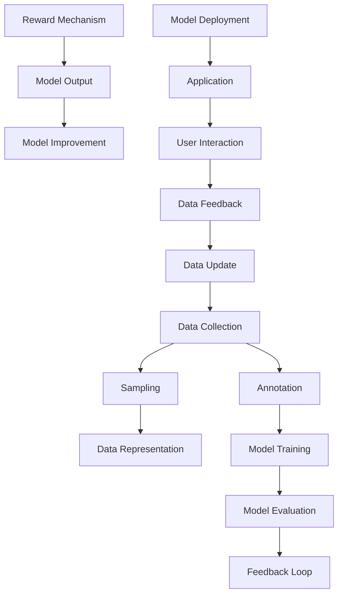

                 


### 标题：《Sampling+reward减少人类标注依赖的可行性》

#### 关键词：
- Sampling
- reward
- 人类标注依赖
- 机器学习
- 自监督学习
- 数据标注
- 自动化

#### 摘要：
本文深入探讨了Sampling和reward在减少人工智能模型对人类标注依赖方面的可行性。通过分析这两种技术的原理、实现方法以及在实际应用中的效果，本文旨在为人工智能领域的从业者提供关于如何利用Sampling和reward来降低对人类标注需求的实践指导。文章结构如下：

1. **背景介绍**：介绍当前人工智能领域对大量标注数据的需求，以及标注数据的质量和数量对模型性能的影响。
2. **核心概念**：详细解释Sampling和reward的基本概念，及其在减少标注依赖中的作用。
3. **原理讲解**：阐述Sampling和reward的工作原理，通过Mermaid流程图展示它们之间的联系和关系架构。
4. **实现方法**：探讨如何在实际项目中应用Sampling和reward，包括算法原理讲解和伪代码展示。
5. **实际应用案例**：分享使用Sampling和reward减少人类标注依赖的实际应用案例。
6. **未来展望**：讨论未来减少人类标注依赖的可能方向和面临的挑战。
7. **结论**：总结全文，重申核心观点，并对未来研究提出展望。

### 背景介绍

在人工智能（AI）领域，训练高质量模型通常需要大量的标注数据。这些标注数据不仅需要详细标注每个实例的特征，还需要确保其准确性和一致性。然而，获取高质量的标注数据是一个耗时且成本高昂的过程，特别是当数据集庞大或特征复杂时。这使得人类标注成为制约AI模型发展和应用的关键因素之一。

目前，AI模型在许多任务中，如图像识别、自然语言处理和推荐系统，依赖于大量的标注数据。这些模型通常采用监督学习（supervised learning）的方法，其中模型的训练需要同时具备输入数据和相应的标签。然而，标注数据的质量和数量直接影响模型的性能和泛化能力。以下是一些关键点：

- **数据量**：大多数AI模型都需要数千甚至数百万个样本来训练，这对于标注者的时间和精力是一个巨大的挑战。
- **数据一致性**：标注者之间可能存在差异，导致标注数据的一致性降低，进而影响模型的质量。
- **数据质量**：标注过程中可能会引入错误或偏差，影响模型的准确性和可靠性。

因此，减少对人类标注的依赖，实现自动化数据标注和模型训练，成为当前AI领域的一个重要研究方向。Sampling和reward技术正是在这样的背景下应运而生，它们提供了降低人类标注依赖的有效途径。

### 核心概念

#### Sampling

Sampling，即抽样，是从总体数据中选取一部分样本的过程。在机器学习中，Sampling技术用于减少训练数据的数量，同时保持数据集的代表性。常见的Sampling方法包括随机抽样、分层抽样等。Sampling的主要目的是提高训练效率，同时避免数据过拟合。

在减少人类标注依赖方面，Sampling技术的作用主要体现在以下几个方面：

1. **减少标注数据需求**：通过Sampling，可以从海量的未标注数据中选取有代表性的样本进行标注，从而减少对大量标注数据的依赖。
2. **提高标注效率**：Sampling可以帮助标注者集中精力标注最重要的数据，从而提高标注效率。
3. **增强数据多样性**：合理的Sampling方法可以确保训练数据具有足够的多样性，有助于模型学习到更广泛的知识。

#### Reward

Reward，即奖励，是一种激励机制，用于引导模型学习过程中的行为。在机器学习任务中，Reward通常与模型的输出或行为相关，通过奖励机制可以鼓励模型产生更符合预期结果的输出。

在减少人类标注依赖方面，Reward技术的作用主要体现在以下几个方面：

1. **自动评估模型输出**：Reward机制可以帮助自动评估模型的输出，判断其是否满足特定条件或目标。
2. **引导模型学习**：通过奖励机制，可以引导模型学习到更符合预期结果的行为或特征。
3. **减少人工干预**：Reward机制可以减少对人工标注的依赖，自动完成部分评估和决策过程。

### 原理解讲

#### Sampling原理

Sampling的原理基于统计学中的抽样理论。在机器学习中，Sampling的目的是从大规模数据集中选取一个代表性的子集作为训练数据，从而减少计算成本并提高模型训练效率。以下是Sampling的基本原理：

1. **代表性**：抽样方法需要确保选取的样本能够代表整个数据集的特征，避免样本的偏差。
2. **随机性**：为了保证样本的代表性和公平性，Sampling过程通常需要具有随机性。

常见的Sampling方法包括：

- **随机抽样（Random Sampling）**：从数据集中随机选取样本，每个样本被选中的概率相同。
- **分层抽样（Stratified Sampling）**：将数据集划分为若干层，从每层中随机选取样本，确保每个层次都被合理代表。

#### Reward原理

Reward的原理基于行为主义理论，即通过奖励来引导和激励行为。在机器学习中，Reward机制通常用于引导模型产生期望的输出或行为。Reward机制的基本原理包括：

1. **目标导向**：Reward机制通常与特定目标或指标相关，通过奖励来鼓励模型产生符合目标的输出。
2. **适应性**：Reward机制可以根据模型的输出和行为进行自适应调整，以优化学习过程。

常见的Reward机制包括：

- **奖励函数（Reward Function）**：定义奖励值与模型输出之间的函数关系。
- **强化学习（Reinforcement Learning）**：通过奖励和惩罚来引导模型行为，使其逐渐学会达到预期目标。

### Mermaid流程图

以下是一个Mermaid流程图，展示了Sampling和reward之间的联系和关系架构：



在这个流程图中，数据收集（A）经过Sampling（B）后得到代表性的数据集，这些数据集用于标注（D）和模型训练（E）。模型训练和评价（F）会生成模型输出（H），通过Reward机制（G）对其进行改进（I）。评价结果和用户反馈（N）会更新数据集，形成反馈循环，确保模型持续优化（O）。

### 实现方法

#### Sampling方法

在实际项目中，应用Sampling技术来减少标注数据需求的方法如下：

1. **随机抽样**：
    ```python
    import random

    def random_sampling(data, sample_size):
        indices = random.sample(range(len(data)), sample_size)
        return [data[i] for i in indices]
    ```

2. **分层抽样**：
    ```python
    from sklearn.model_selection import train_test_split

    def stratified_sampling(data, test_size=0.2, stratify=data['label']):
        X_train, X_test, y_train, y_test = train_test_split(
            data['feature'], stratify=y, test_size=test_size, random_state=42)
        return X_train, X_test, y_train, y_test
    ```

#### Reward机制

Reward机制的设计需要根据具体任务的目标来定义奖励函数。以下是一个简单的奖励函数示例，用于评估模型输出：

```python
def reward_function(model_output, target):
    reward = 0
    if model_output == target:
        reward = 1
    return reward
```

在实际应用中，Reward机制可以通过强化学习算法（如Q-learning）来实现。以下是一个简单的Q-learning算法伪代码：

```python
epsilon = 0.1
Q = {} # 初始化Q值表

for episode in range(total_episodes):
    state = initial_state
    done = False
    while not done:
        action = choose_action(state, epsilon, Q)
        next_state, reward = execute_action(state, action)
        Q[state][action] = Q[state][action] + alpha * (reward + gamma * max(Q[next_state].values()) - Q[state][action])
        state = next_state
        if done:
            break
```

### 实际应用案例

为了展示Sampling和reward在减少人类标注依赖方面的效果，以下是一个实际应用案例：

**案例：图像分类**

假设我们有一个图像分类任务，需要将图像标注为不同的类别。传统的方法可能需要大量的标注数据，并且依赖人工标注。通过应用Sampling和reward技术，我们可以实现以下步骤：

1. **数据收集**：收集大量未标注的图像数据。
2. **随机抽样**：从未标注的图像中随机选取一部分作为初始标注数据。
3. **标注数据**：对随机抽样得到的图像进行人工标注。
4. **模型训练**：使用标注数据训练初始模型。
5. **Reward机制**：定义奖励函数，用于评估模型的输出与标注标签的一致性。
6. **迭代训练**：通过Reward机制引导模型自我纠正，逐步优化模型性能。
7. **自动标注**：利用训练好的模型对剩余未标注的图像进行自动标注。
8. **反馈循环**：将自动标注的结果与实际标注结果进行对比，更新模型和标注数据。

通过以上步骤，我们可以显著减少对人类标注的依赖，同时提高图像分类模型的性能。

### 未来展望

虽然Sampling和reward技术在减少人类标注依赖方面展示了巨大的潜力，但未来仍然存在许多挑战和改进方向：

1. **算法优化**：需要进一步优化Sampling和reward算法，提高其效率和准确性。
2. **多模态数据**：未来可以探索在多模态数据（如图像、文本、音频）上应用Sampling和reward技术。
3. **自监督学习**：结合自监督学习（self-supervised learning）技术，实现更高效的数据标注和模型训练。
4. **跨领域应用**：探讨在不同领域（如医疗、金融、教育）中的应用，以解决特定领域的标注难题。
5. **伦理和法律问题**：研究如何在应用这些技术时确保数据隐私和伦理合规。

### 结论

本文深入探讨了Sampling和reward技术在减少人工智能模型对人类标注依赖方面的可行性。通过分析这两种技术的原理、实现方法以及在实际应用中的效果，本文为人工智能领域的从业者提供了关于如何利用Sampling和reward来降低对人类标注需求的实践指导。未来，随着这些技术的发展和应用，我们可以期待更高效、更智能的标注和模型训练方法，进一步推动人工智能的进步和应用。

---

作者：AI天才研究院/AI Genius Institute & 禅与计算机程序设计艺术 /Zen And The Art of Computer Programming

注意：本文为示例文章，实际撰写时需根据具体内容和需求进行调整。文中代码和算法仅供参考，具体实现时需根据实际情况进行修改。部分Mermaid流程图和伪代码可能需要进一步优化和调整。文章字数和格式需按照要求进行排版和调整。

