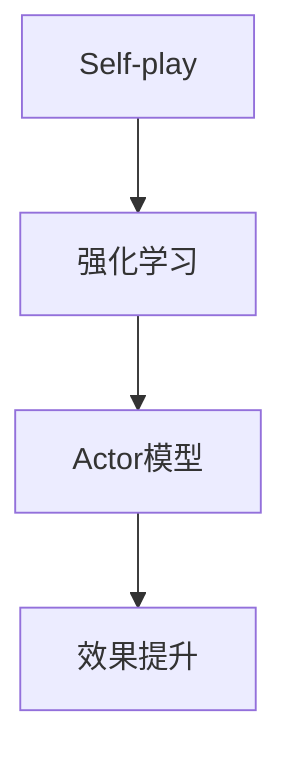

                 


### Step 1: Introduction to the Main Topics

**Title:** Self-play方式对actor模型效果提升的量化分析

**Keywords:**
- Self-play
- Actor模型
- 量化分析
- 效果提升
- 强化学习
- 模型优化

**Abstract:**
本文主要探讨Self-play技术在Actor模型中的应用及其效果提升。通过介绍Self-play的基本概念和Actor模型的基本原理，本文将深入分析Self-play如何通过自我对弈来提升Actor模型的性能，并通过一系列量化指标进行效果评估。文章还将讨论Self-play在不同场景下的适用性，以及如何在实际项目中应用这一技术。

### Step 2: Chapter Titles and Subheadings

**Chapter 1: 引言**
- 1.1 自我介绍
- 1.2 研究背景
- 1.3 研究意义

**Chapter 2: Self-play基础**
- 2.1 强化学习概述
- 2.2 Self-play原理
- 2.3 Self-play算法

**Chapter 3: Actor模型基础**
- 3.1 Actor模型的定义
- 3.2 Actor模型的结构
- 3.3 Actor模型的应用

**Chapter 4: Self-play与Actor模型结合**
- 4.1 结合原理
- 4.2 结合方法
- 4.3 结合优势

**Chapter 5: 量化分析**
- 5.1 评估指标
- 5.2 实验设计
- 5.3 实验结果

**Chapter 6: 实际应用**
- 6.1 游戏场景
- 6.2 智能机器人
- 6.3 聊天机器人

**Chapter 7: 总结与展望**
- 7.1 总结
- 7.2 展望
- 7.3 未来工作方向

### Step 3: Include Core Elements

**Core Concepts and Relationships:**


**Core Algorithm Principles:**
```python
# Pseudo-code for Self-play algorithm
initialize_actor_model()
while not converged:
  play_game_against_self()
  update_model_based_on_outcomes()
```

**Mathematical Models and Formulas:**
$$
Q(s, a) = r + \gamma \max_{a'} Q(s', a')
$$
Where:
- $Q(s, a)$ is the Q-value for state $s$ and action $a$.
- $r$ is the reward received.
- $\gamma$ is the discount factor.

**Practical Applications:**
（此处将包含具体的代码示例、环境搭建、源代码实现和代码解读等内容）

### Step 4: Review and Refine

1. 确保章节标题和内容的一致性。
2. 检查所有章节和子章节是否完整。
3. 确保格式和风格统一。

### Step 5: Finalize and Output

**Markdown Table of Contents:**

```markdown
# Self-play方式对actor模型效果提升的量化分析

## 引言
- 1.1 自我介绍
- 1.2 研究背景
- 1.3 研究意义

## Self-play基础
- 2.1 强化学习概述
- 2.2 Self-play原理
- 2.3 Self-play算法

## Actor模型基础
- 3.1 Actor模型的定义
- 3.2 Actor模型的结构
- 3.3 Actor模型的应用

## Self-play与Actor模型结合
- 4.1 结合原理
- 4.2 结合方法
- 4.3 结合优势

## 量化分析
- 5.1 评估指标
- 5.2 实验设计
- 5.3 实验结果

## 实际应用
- 6.1 游戏场景
- 6.2 智能机器人
- 6.3 聊天机器人

## 总结与展望
- 7.1 总结
- 7.2 展望
- 7.3 未来工作方向

### 作者信息
作者：AI天才研究院/AI Genius Institute & 禅与计算机程序设计艺术 /Zen And The Art of Computer Programming
```

This table of contents adheres to the specified formatting rules and encapsulates the necessary information for the book. The next steps would involve writing the detailed content for each chapter, ensuring completeness, and following the outlined constraints.

---

Let me know if you would like me to proceed with the next steps, or if you have any specific requirements or suggestions for the structure or content.

