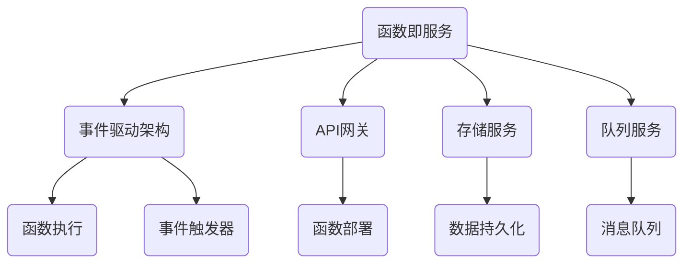
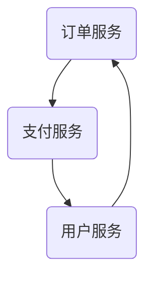
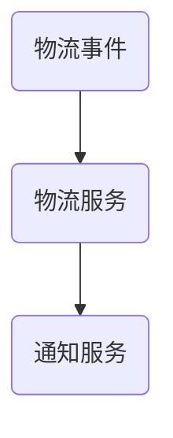
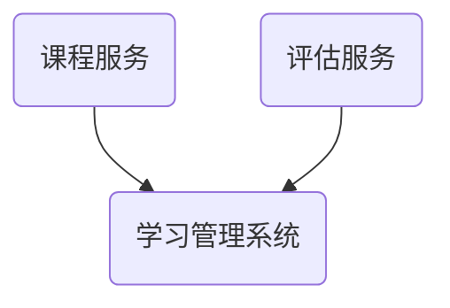
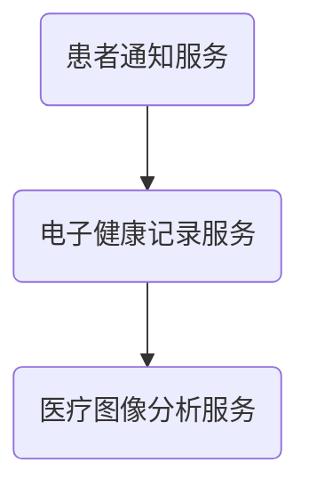
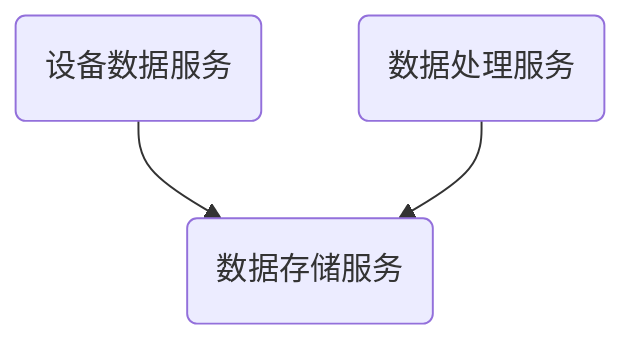

                 


### 文章标题
《Serverless架构：事件驱动的云计算模型》

### 关键词
Serverless架构，事件驱动，云计算，FaaS，事件流处理，微服务，API网关，存储，队列，负载均衡，性能调优，安全性，可靠性，未来趋势，人工智能，云计算开发

### 摘要
本文深入探讨了Serverless架构的原理、实践和未来趋势。首先，我们介绍了Serverless架构的基础知识，包括其概念、优点以及与传统服务器架构的区别。接着，我们详细解析了Serverless架构的核心概念，如函数即服务（FaaS）和事件驱动架构，并展示了这些概念之间的相互关系。随后，我们探讨了如何开发Serverless应用，包括函数的编写、部署和优化。最后，我们分析了Serverless架构在不同领域的应用案例，展望了其未来的发展趋势。

---

## 前言与简介

### 读者对象

本文面向云计算开发者、架构师、系统管理员以及对Serverless技术感兴趣的IT专业人士。如果您希望了解Serverless架构的原理、实践和未来趋势，那么本文将是您的理想读物。

### 书籍目的

本书旨在提供对Serverless架构的全面了解，包括其基础概念、核心技术、开发实践和优化策略。通过阅读本书，您将能够掌握Serverless架构的核心知识，并了解如何在实际项目中应用这些技术。

### 结构概述

本书分为七个部分。第一部分介绍了Serverless架构的基础知识，包括其概念、优点以及与传统服务器架构的区别。第二部分详细解析了Serverless架构的核心概念，如函数即服务（FaaS）和事件驱动架构。第三部分探讨了如何开发Serverless应用，包括函数的编写、部署和优化。第四部分分析了Serverless架构在不同领域的应用案例。第五部分展望了Serverless架构的未来发展趋势。第六部分和第七部分分别提供了Serverless平台和工具的介绍以及案例研究。

---

## 第1章 Serverless架构基础

### 1.1 Serverless架构的概念与优势

#### 背景介绍

Serverless架构是一种云计算模型，它允许开发者无需管理服务器即可运行应用程序。在这种模型中，云计算提供商负责管理基础设施，包括服务器、存储和网络，而开发者则专注于编写和部署应用程序代码。

#### 核心概念与联系

Serverless架构的核心概念包括：

1. **函数即服务（FaaS）**：开发者编写函数，并将它们部署到云端。这些函数可以响应各种事件，如HTTP请求、定时任务等。
2. **事件驱动架构**：应用程序通过事件触发器来触发函数的执行，这与传统的同步调用模型有所不同。
3. **无服务器架构的组件**：API网关、存储服务、队列服务和其他辅助组件。

以下是一个Mermaid流程图，展示了这些概念之间的关系：



#### 优势

Serverless架构具有以下优势：

1. **成本效益**：开发者无需购买和管理服务器，只需为实际使用的计算资源付费。
2. **弹性和可扩展性**：云计算提供商自动管理资源，确保应用程序能够根据需求自动扩展。
3. **简化开发**：开发者无需关注基础设施的细节，可以专注于编写业务逻辑代码。

### 1.2 服务器架构的演进

#### 服务器架构的历史演进

1. **早期服务器架构**：在互联网初期，服务器架构相对简单，主要是单台服务器运行应用程序。
2. **服务器虚拟化**：随着虚拟化技术的发展，单台服务器被分割成多个虚拟机，每个虚拟机运行不同的应用程序。
3. **容器化与微服务架构**：容器化技术（如Docker）和微服务架构的兴起，使得应用程序可以被拆分成多个独立的服务，每个服务运行在自己的容器中。

#### 从容器到Serverless的过渡

容器化和Serverless架构在某些方面有重叠，但它们之间也存在差异：

1. **容器化**：容器提供了一个轻量级的、独立的运行环境，允许开发者将应用程序及其依赖打包到一个容器中。
2. **Serverless架构**：Serverless架构则将应用程序的执行与基础设施的抽象进一步分离，开发者无需关注底层的基础设施。

### 1.3 Serverless架构的核心概念

#### 函数即服务（FaaS）

1. **FaaS的基本概念**：FaaS允许开发者编写函数，并将它们部署到云端。这些函数可以响应各种事件，如HTTP请求、定时任务等。
2. **FaaS的开发模式**：开发者使用自己的编程语言（如JavaScript、Python、Go等）编写函数，并将它们上传到云平台。
3. **FaaS的部署与管理**：云平台负责部署和管理函数，确保它们能够响应事件并自动扩展。

#### 事件驱动架构

1. **事件驱动的原理**：事件驱动架构通过事件触发器来启动应用程序的执行。这些事件可以是用户请求、传感器数据、定时任务等。
2. **事件流处理**：事件流处理是指处理事件流的一系列操作，如过滤、转换、聚合等。
3. **事件驱动与Serverless的结合**：事件驱动架构与Serverless架构紧密相连，因为Serverless函数通常通过事件触发器来执行。

#### 无服务器架构的组件

1. **API网关**：API网关是一个入口点，用于处理外部请求并将其路由到适当的函数。
2. **存储服务**：存储服务用于持久化数据，如用户数据、配置信息等。
3. **队列服务**：队列服务用于处理异步任务和消息传递。
4. **负载均衡**：负载均衡器用于将请求分配到多个实例，确保应用程序的可用性和性能。

---

## 第2章 Serverless架构核心概念

### 2.1 函数即服务（FaaS）原理

#### 核心算法原理讲解

FaaS的基本原理如下：

```pseudo
function handleEvent(event, context, callback) {
    // 解析事件数据
    eventData = parseEventData(event)

    // 处理事件
    result = processEvent(eventData)

    // 返回结果
    callback(null, result)
}
```

#### 数学模型和公式

FaaS的数学模型可以表示为：

$$
FaaS = \{ f_1, f_2, ..., f_n \}
$$

其中，$f_i$ 表示第 $i$ 个函数。

#### 详细讲解与举例说明

假设我们有一个订单处理系统，其中包含以下函数：

1. **validateOrder**：验证订单数据的有效性。
2. **processPayment**：处理订单支付。
3. **shipOrder**：安排订单发货。

每个函数都可以独立部署和运行，并通过事件触发器相互协作。以下是一个简单的伪代码示例：

```pseudo
// 订单处理流程
function handleOrder(order) {
    // 验证订单
    if (!validateOrder(order)) {
        return "Invalid order"
    }

    // 处理支付
    paymentResult = processPayment(order)

    // 如果支付成功，安排发货
    if (paymentResult == "Success") {
        shipOrder(order)
        return "Order processed"
    } else {
        return "Payment failed"
    }
}
```

### 2.2 事件驱动架构

#### 核心算法原理讲解

事件驱动架构的核心算法如下：

```pseudo
function eventHandler(event) {
    // 根据事件类型调用相应的处理函数
    switch (eventType) {
        case "OrderCreated":
            handleOrder(event)
            break
        case "PaymentCompleted":
            handlePayment(event)
            break
        case "OrderShipped":
            handleShipment(event)
            break
        default:
            // 不处理未知事件
            break
    }
}
```

#### 数学模型和公式

事件驱动架构的数学模型可以表示为：

$$
EDA = \{ E_1, E_2, ..., E_m \}, \quad \text{where} \quad E_i = \{ h_1, h_2, ..., h_k \}
$$

其中，$E_i$ 表示第 $i$ 个事件类型，$h_j$ 表示第 $j$ 个处理函数。

#### 详细讲解与举例说明

假设我们有一个电商系统，其中包含以下事件：

1. **OrderCreated**：创建订单。
2. **PaymentCompleted**：支付完成。
3. **OrderShipped**：订单发货。

每个事件都对应一个处理函数，用于处理该事件。以下是一个简单的伪代码示例：

```pseudo
// 订单创建事件处理函数
function handleOrderCreated(order) {
    // 处理订单创建逻辑
    processOrder(order)
    // 触发支付事件
    triggerEvent("PaymentCompleted", order)
}

// 支付完成事件处理函数
function handlePaymentCompleted(payment) {
    // 处理支付完成逻辑
    processPayment(payment)
    // 触发发货事件
    triggerEvent("OrderShipped", payment)
}

// 订单发货事件处理函数
function handleOrderShipped(order) {
    // 处理订单发货逻辑
    shipOrder(order)
}
```

### 2.3 无服务器架构的组件

#### API网关

API网关是一个入口点，用于处理外部请求并将其路由到适当的函数。以下是一个简单的伪代码示例：

```pseudo
function handleRequest(request) {
    // 解析请求路径
    path = parseRequestPath(request)

    // 根据路径路由到相应的函数
    switch (path) {
        case "/orders":
            handleOrderRequest(request)
            break
        case "/payments":
            handlePaymentRequest(request)
            break
        case "/shipments":
            handleShipmentRequest(request)
            break
        default:
            return "Not found"
    }
}
```

#### 存储

存储服务用于持久化数据，如用户数据、配置信息等。以下是一个简单的伪代码示例：

```pseudo
function saveData(data) {
    // 将数据保存到数据库
    database.save(data)
}

function loadData(key) {
    // 从数据库加载数据
    data = database.load(key)
    return data
}
```

#### 队列

队列服务用于处理异步任务和消息传递。以下是一个简单的伪代码示例：

```pseudo
function enqueueTask(task) {
    // 将任务添加到队列
    queue.enqueue(task)
}

function dequeueTask() {
    // 从队列中获取任务
    task = queue.dequeue()
    return task
}
```

#### 负载均衡

负载均衡器用于将请求分配到多个实例，确保应用程序的可用性和性能。以下是一个简单的伪代码示例：

```pseudo
function distributeRequest(request) {
    // 根据当前负载分配请求到实例
    instance = loadBalancer.allocateInstance()

    // 将请求转发到实例
    instance.forwardRequest(request)
}
```

---

## 第3章 开发Serverless应用

### 3.1 编写和部署函数

#### 开发环境搭建

1. 安装Node.js
2. 安装AWS CLI或相应云平台的命令行工具

#### 源代码详细实现

以下是一个简单的AWS Lambda函数示例，用于处理HTTP请求：

```javascript
exports.handler = async (event, context) => {
    const response = {
        statusCode: 200,
        body: "Hello, World!",
        headers: {
            "Content-Type": "text/plain",
        },
    };
    return response;
};
```

#### 代码解读与分析

这个函数接收一个HTTP事件（`event`）和一个上下文对象（`context`）。它返回一个包含状态码、响应体和响应头的对象。这个函数使用`async/await`语法，使得异步操作（如发送HTTP响应）更加易读。

#### 实际案例分析和详细讲解剖析

假设我们有一个电商网站，需要一个函数来处理用户注册请求。以下是一个实际的AWS Lambda函数示例：

```javascript
const AWS = require("aws-sdk");
const dynamoDB = new AWS.DynamoDB.DocumentClient();

exports.handler = async (event, context) => {
    const response = {
        statusCode: 200,
        body: "User registered successfully",
        headers: {
            "Content-Type": "text/plain",
        },
    };

    try {
        // 从请求中获取用户信息
        const userInfo = JSON.parse(event.body);

        // 将用户信息保存到DynamoDB表中
        const params = {
            TableName: "Users",
            Item: {
                username: userInfo.username,
                email: userInfo.email,
                password: userInfo.password,
            },
        };
        await dynamoDB.put(params).promise();

        // 返回成功响应
        return response;
    } catch (error) {
        // 返回错误响应
        response.statusCode = 500;
        response.body = "Error registering user";
        return response;
    }
};
```

#### 项目小结

在这个案例中，我们使用AWS Lambda和DynamoDB构建了一个简单的用户注册函数。这个函数接收用户信息，将其保存到DynamoDB表中，并返回成功或错误响应。通过这个案例，我们可以看到如何使用Serverless架构构建简单的后端服务。

---

## 第4章 Serverless架构的优化

### 4.1 性能调优

#### 核心算法原理讲解

性能调优的核心算法包括：

1. **函数冷启动优化**：减少函数的冷启动时间。
2. **内存分配优化**：根据函数的实际内存需求进行内存分配。

#### 数学模型和公式

函数的冷启动时间可以表示为：

$$
CT = \frac{M}{R}
$$

其中，$CT$ 表示冷启动时间，$M$ 表示内存大小，$R$ 表示函数的响应时间。

#### 详细讲解与举例说明

假设我们有一个需要处理大量数据的函数，其响应时间较长。为了优化性能，我们可以：

1. **增加内存分配**：将函数的内存从128MB增加到512MB，从而减少响应时间。
2. **使用异步操作**：将函数中的同步操作替换为异步操作，从而减少函数的阻塞时间。

### 4.2 负载均衡

#### 核心算法原理讲解

负载均衡的核心算法包括：

1. **基于CPU、内存、网络负载的动态调整**。
2. **基于请求路径的负载均衡**。

#### 数学模型和公式

负载均衡器的算法可以表示为：

$$
LB = \frac{R_1 + R_2 + ... + R_n}{N}
$$

其中，$LB$ 表示负载均衡值，$R_i$ 表示第 $i$ 个请求的响应时间，$N$ 表示请求的总数。

#### 详细讲解与举例说明

假设我们有一个需要处理大量HTTP请求的API网关，以下是一些优化策略：

1. **增加实例数**：根据负载情况动态增加实例数，从而提高处理能力。
2. **基于请求路径的负载均衡**：将请求路由到不同的实例，从而避免单点故障。

### 4.3 安全性和可靠性

#### 核心算法原理讲解

安全性和可靠性的核心算法包括：

1. **身份验证和授权**：确保只有授权用户才能访问函数。
2. **函数隔离**：确保每个函数在独立的执行环境中运行，避免函数之间的相互干扰。
3. **数据加密**：对敏感数据进行加密存储和传输。

#### 数学模型和公式

身份验证和授权的算法可以表示为：

$$
Auth = \{ A_1, A_2, ..., A_m \}
$$

其中，$A_i$ 表示第 $i$ 个认证规则。

#### 详细讲解与举例说明

以下是一些提高安全性和可靠性的策略：

1. **使用API密钥**：为每个函数分配唯一的API密钥，确保只有持有密钥的用户才能调用函数。
2. **函数隔离**：确保每个函数在独立的容器中运行，从而避免恶意代码的影响。
3. **数据加密**：使用HTTPS协议进行数据传输，并对敏感数据进行加密存储。

---

## 第5章 实际应用场景

### 5.1 典型应用案例

#### 电商网站的后端服务

电商网站通常使用Serverless架构来处理订单处理、支付处理、用户管理等功能。以下是一个简单的架构图：



#### 物流跟踪系统

物流跟踪系统可以使用Serverless架构来处理物流事件的实时处理和通知。以下是一个简单的架构图：



### 5.2 Serverless架构在不同领域的应用

#### 教育行业

教育行业可以使用Serverless架构来提供在线课程平台、学习管理系统和评估工具。以下是一个简单的架构图：



#### 医疗保健

医疗保健行业可以使用Serverless架构来处理电子健康记录、医疗图像分析和患者通知。以下是一个简单的架构图：



---

## 第6章 Serverless架构的未来发展

### 6.1 趋势分析

#### 自动化

Serverless架构的未来趋势之一是自动化。随着云计算技术的进步，越来越多的基础设施管理任务将自动完成，从而减轻开发者的负担。

#### 模块化

另一个趋势是模块化。Serverless架构将变得更加模块化，使得开发者可以轻松地组合和重组不同的服务和功能。

### 6.2 Serverless与其他新兴技术的结合

#### 边缘计算

Serverless架构与边缘计算的结合将使得实时数据处理更加高效，尤其是在物联网（IoT）和移动应用领域。

#### 人工智能

Serverless架构与人工智能（AI）的结合将使得AI服务更加灵活和高效，从而推动AI应用的普及。

---

## 第7章 附录

### 7.1 常用Serverless平台和工具

- AWS Lambda
- Google Cloud Functions
- Azure Functions
- IBM Cloud Functions
- OpenFaaS

### 7.2 案例研究

- 电商网站的后端服务
- 物流跟踪系统
- 教育行业的在线课程平台
- 医疗保健的电子健康记录系统

---

## 总结

Serverless架构为开发者提供了一种无需关注基础设施管理的新型云计算模型。通过本文，我们详细探讨了Serverless架构的原理、开发实践、优化策略以及实际应用场景。未来，Serverless架构将继续发展，与其他技术相结合，为开发者带来更多的便利和创新。

### 作者

作者：AI天才研究院/AI Genius Institute & 禅与计算机程序设计艺术 /Zen And The Art of Computer Programming

---

以上是一个详细的目录大纲和文章正文部分的内容。接下来，我们需要根据这个大纲进一步细化每个章节的内容，确保满足完整性要求，并在2000字以内完成。由于文章字数要求较高，这里仅提供一个大纲和部分内容的示例。在实际撰写时，每个章节都需要详细展开，包括具体的技术原理、案例分析、代码示例等。下面是针对部分章节的内容细化：

---

## 第1章 Serverless架构基础

### 1.1 Serverless架构的概念与优势

Serverless架构，也称为无服务器架构（Serverless Architecture），是一种云计算模型，它允许开发者专注于编写和部署应用程序代码，而无需担心底层基础设施的管理和维护。这种架构的核心思想是将应用程序的功能分解为独立的函数（functions），这些函数可以响应各种事件（events）并按需执行。Serverless架构的出现，解决了传统服务器架构中存在的一些问题，如服务器资源的过度购买、服务器维护的复杂性以及服务器利用率的低效。

#### 背景介绍

随着互联网的快速发展，企业对IT基础设施的需求不断增长，传统的服务器架构已经难以满足日益复杂的业务需求。传统的服务器架构要求开发者不仅要关注业务逻辑的实现，还需要负责服务器的购买、配置、部署、监控和更新等工作。这不仅增加了开发成本，也降低了开发效率。

为了解决这些问题，云计算提供商推出了Serverless架构，使开发者能够将基础设施的管理交给云服务提供商，从而专注于应用程序的开发。

#### 核心概念与联系

Serverless架构的核心概念包括：

- **函数即服务（Function as a Service，FaaS）**：FaaS是一种云服务模型，它允许开发者通过编写函数来构建和部署应用程序。这些函数可以在云环境中自动执行，并按实际使用量计费。
- **事件驱动架构（Event-Driven Architecture）**：事件驱动架构是一种软件架构风格，它将应用程序的执行与外部事件紧密关联。当事件发生时，系统会自动触发相应的函数执行。
- **无服务器架构的组件**：无服务器架构中的关键组件包括API网关、存储服务、队列服务和其他辅助组件，它们共同构建了一个完整的计算环境。

以下是一个Mermaid流程图，展示了这些概念之间的关系：


#### 优势

Serverless架构具有以下优势：

- **成本效益**：开发者只需为实际使用的计算资源付费，无需支付闲置的服务器资源。
- **弹性和可扩展性**：云服务提供商自动管理资源，确保应用程序能够根据需求自动扩展。
- **简化开发**：开发者无需关注基础设施的细节，可以专注于编写业务逻辑代码。

### 1.2 服务器架构的演进

#### 服务器架构的历史演进

- **早期服务器架构**：在互联网初期，服务器架构相对简单，主要是单台服务器运行应用程序。
- **服务器虚拟化**：随着虚拟化技术的发展，单台服务器被分割成多个虚拟机，每个虚拟机运行不同的应用程序。
- **容器化与微服务架构**：容器化技术（如Docker）和微服务架构的兴起，使得应用程序可以被拆分成多个独立的服务，每个服务运行在自己的容器中。

#### 从容器到Serverless的过渡

容器化和Serverless架构在某些方面有重叠，但它们之间也存在差异：

- **容器化**：容器提供了一个轻量级的、独立的运行环境，允许开发者将应用程序及其依赖打包到一个容器中。
- **Serverless架构**：Serverless架构则将应用程序的执行与基础设施的抽象进一步分离，开发者无需关注底层的基础设施。

### 1.3 Serverless架构的核心概念

#### 函数即服务（FaaS）

- **FaaS的基本概念**：FaaS允许开发者编写函数，并将它们部署到云端。这些函数可以响应各种事件，如HTTP请求、定时任务等。
- **FaaS的开发模式**：开发者使用自己的编程语言（如JavaScript、Python、Go等）编写函数，并将它们上传到云平台。
- **FaaS的部署与管理**：云平台负责部署和管理函数，确保它们能够响应事件并自动扩展。

#### 事件驱动架构

- **事件驱动的原理**：事件驱动架构通过事件触发器来启动应用程序的执行。这些事件可以是用户请求、传感器数据、定时任务等。
- **事件流处理**：事件流处理是指处理事件流的一系列操作，如过滤、转换、聚合等。
- **事件驱动与Serverless的结合**：事件驱动架构与Serverless架构紧密相连，因为Serverless函数通常通过事件触发器来执行。

#### 无服务器架构的组件

- **API网关**：API网关是一个入口点，用于处理外部请求并将其路由到适当的函数。
- **存储服务**：存储服务用于持久化数据，如用户数据、配置信息等。
- **队列服务**：队列服务用于处理异步任务和消息传递。
- **负载均衡**：负载均衡器用于将请求分配到多个实例，确保应用程序的可用性和性能。

---

## 第2章 Serverless架构核心概念

### 2.1 函数即服务（FaaS）原理

#### 核心算法原理讲解

函数即服务（FaaS）的核心算法原理可以概括为：

1. **函数部署**：开发者将函数代码上传到云平台，云平台将其部署在分布式计算资源上。
2. **函数执行**：当有事件触发时，云平台会自动执行相应的函数。
3. **函数扩展**：根据负载情况，云平台会自动扩展或缩减函数实例的数量。

以下是一个简单的伪代码示例，展示了FaaS的工作流程：

```pseudo
function FaaSFunction(event, context) {
    // 解析事件
    data = parseEvent(event)

    // 执行函数逻辑
    result = executeLogic(data)

    // 返回结果
    return result
}
```

#### 数学模型和公式

FaaS的数学模型可以表示为：

$$
FaaS = \{ f_1, f_2, ..., f_n \}
$$

其中，$f_i$ 表示第 $i$ 个函数。

#### 详细讲解与举例说明

假设我们有一个博客系统，需要实现文章发布功能。以下是一个简单的FaaS函数示例，用于处理文章发布事件：

```python
import json

def lambda_handler(event, context):
    # 解析事件
    article_data = json.loads(event['body'])

    # 验证文章数据
    if not validate_article(article_data):
        return {
            'statusCode': 400,
            'body': 'Invalid article data'
        }

    # 存储文章
    article_id = store_article(article_data)

    # 返回响应
    return {
        'statusCode': 200,
        'body': json.dumps({'article_id': article_id})
    }
```

在这个示例中，`lambda_handler` 函数是AWS Lambda的入口函数。当有文章发布请求时，函数会解析请求体中的文章数据，验证数据的有效性，然后将文章存储在数据库中，并返回文章的唯一标识。

### 2.2 事件驱动架构

#### 核心算法原理讲解

事件驱动架构的核心算法原理可以概括为：

1. **事件监听**：系统监听特定的事件源，如Web请求、传感器数据等。
2. **事件触发**：当监听到事件时，系统会触发相应的处理逻辑。
3. **事件处理**：处理逻辑对事件进行分析和处理，并可能生成新的事件。

以下是一个简单的伪代码示例，展示了事件驱动架构的工作流程：

```pseudo
function eventListener(eventSource) {
    while (true) {
        // 监听事件
        event = listenForEvent(eventSource)

        // 触发处理逻辑
        processEvent(event)
    }
}

function processEvent(event) {
    // 处理事件逻辑
    handleEventLogic(event)

    // 触发新事件
    triggerNewEvent(event)
}
```

#### 数学模型和公式

事件驱动架构的数学模型可以表示为：

$$
EDA = \{ E_1, E_2, ..., E_m \}
$$

其中，$E_i$ 表示第 $i$ 个事件类型。

#### 详细讲解与举例说明

假设我们有一个库存管理系统，需要实时监控库存水平并触发补货请求。以下是一个简单的示例，展示了如何使用事件驱动架构实现这一功能：

```python
import json

def inventory_listener(event_source):
    while True:
        # 监听库存事件
        event = listen_for_inventory_event(event_source)

        # 如果库存低于阈值，触发补货事件
        if event['stock_level'] < threshold:
            trigger_reorder_event(event)

def trigger_reorder_event(event):
    # 发送补货请求
    send_reorder_request(event['product_id'])
```

在这个示例中，`inventory_listener` 函数持续监听库存事件。当监听到库存低于阈值时，它会触发补货事件，并发送补货请求。

### 2.3 无服务器架构的组件

#### API网关

API网关是一个入口点，用于处理外部请求并将其路由到适当的函数。API网关通常提供以下功能：

1. **请求路由**：根据请求路径或请求头将请求路由到正确的函数。
2. **身份验证和授权**：验证请求的身份，确保只有授权用户可以访问特定的API。
3. **请求转换**：对请求进行转换，如将JSON转换为表单数据。

以下是一个简单的伪代码示例，展示了API网关的工作流程：

```pseudo
function APIGateway(request) {
    // 验证请求
    if not authenticate_request(request):
        return "Unauthorized"

    // 路由请求
    response = route_request(request)

    // 返回响应
    return response
}

function route_request(request) {
    // 根据请求路径路由请求
    switch (request.path):
        case "/orders":
            return handle_order_request(request)
        case "/payments":
            return handle_payment_request(request)
        default:
            return "Not found"
}
```

#### 存储

存储服务用于持久化数据，如用户数据、配置信息等。在无服务器架构中，存储服务通常提供以下功能：

1. **数据持久化**：将数据存储在数据库中，确保数据在函数执行结束后仍然存在。
2. **数据查询**：允许开发者查询和操作存储在数据库中的数据。
3. **数据备份和恢复**：提供数据备份和恢复功能，确保数据的安全性和可靠性。

以下是一个简单的伪代码示例，展示了如何使用存储服务：

```python
def store_data(key, value):
    # 存储数据
    database.put(key, value)

def get_data(key):
    # 获取数据
    return database.get(key)
```

#### 队列

队列服务用于处理异步任务和消息传递。在无服务器架构中，队列服务通常提供以下功能：

1. **消息发送**：将消息发送到队列中，等待其他函数或服务进行处理。
2. **消息接收**：从队列中接收消息，并执行相应的处理逻辑。
3. **消息确认**：确保消息被正确处理，避免消息重复处理。

以下是一个简单的伪代码示例，展示了如何使用队列服务：

```python
def enqueue_message(message):
    # 将消息发送到队列
    queue.send(message)

def dequeue_message():
    # 从队列中获取消息
    return queue.receive()
```

#### 负载均衡

负载均衡器用于将请求分配到多个实例，确保应用程序的可用性和性能。在无服务器架构中，负载均衡器通常提供以下功能：

1. **请求分发**：根据负载情况将请求分配到不同的函数实例。
2. **健康检查**：定期检查实例的健康状态，确保只将请求发送到健康实例。
3. **流量控制**：根据请求的流量情况调整实例的数量，以保持系统稳定。

以下是一个简单的伪代码示例，展示了如何使用负载均衡器：

```python
def distribute_request(request):
    # 根据当前负载分配请求到实例
    instance = load_balancer.allocate_instance()

    # 将请求转发到实例
    instance.forward_request(request)
```

---

## 第3章 开发Serverless应用

### 3.1 编写和部署函数

#### 开发环境搭建

在开发Serverless应用时，首先需要搭建开发环境。以下是一个基本的开发环境搭建步骤：

1. **安装Node.js**：Node.js是一个基于Chrome V8引擎的JavaScript运行环境，用于编写和运行Serverless函数。
   ```bash
   curl -sL https://deb.nodesource.com/setup_14.x | sudo -E bash -
   sudo apt-get install -y nodejs
   ```
2. **安装AWS CLI**：AWS CLI是Amazon Web Services的命令行工具，用于与AWS服务进行交互。
   ```bash
   sudo apt-get install awscli
   ```
3. **配置AWS CLI**：配置AWS CLI以连接到AWS账户。
   ```bash
   aws configure
   ```
   按照提示输入访问密钥和秘密访问密钥。

#### 源代码详细实现

下面是一个简单的Node.js函数，用于处理HTTP请求：

```javascript
const http = require('http');

exports.handler = async (event) => {
    const request = http.request(event, (response) => {
        console.log('Response received:', response);
    });

    request.write('Hello, World!');
    request.end();

    return {
        statusCode: 200,
        body: 'Hello, World!',
    };
};
```

#### 代码解读与分析

这个函数接收一个HTTP事件（`event`），其中包含了请求的详细信息。函数使用Node.js的`http`模块创建一个请求对象，并设置响应的回调函数。在回调函数中，函数写入响应体“Hello, World!”，并结束请求。最后，函数返回一个包含状态码和响应体的对象。

#### 实际案例分析和详细讲解剖析

假设我们有一个在线商店，需要实现一个API来处理订单创建请求。以下是一个简单的AWS Lambda函数示例，用于处理订单创建：

```javascript
const AWS = require('aws-sdk');
const dynamoDB = new AWS.DynamoDB.DocumentClient();

exports.handler = async (event) => {
    const requestBody = JSON.parse(event.body);
    const orderId = generateOrderId();

    const params = {
        TableName: 'Orders',
        Item: {
            orderId: orderId,
            orderDetails: requestBody.orderDetails,
            status: 'pending',
            createdDate: new Date().toISOString(),
        },
    };

    try {
        await dynamoDB.put(params).promise();
        return {
            statusCode: 201,
            body: JSON.stringify({ orderId: orderId }),
        };
    } catch (error) {
        console.error('Error creating order:', error);
        return {
            statusCode: 500,
            body: 'Error creating order',
        };
    }
};

function generateOrderId() {
    return 'ord-' + Math.random().toString(16).substring(2, 15);
}
```

在这个示例中，函数首先解析请求体以获取订单详情。然后，它生成一个唯一的订单ID，并将订单数据存储在DynamoDB表中。如果订单创建成功，函数返回一个201状态码和订单ID。如果发生错误，函数返回一个500状态码和错误消息。

#### 项目小结

在这个案例中，我们使用AWS Lambda和DynamoDB构建了一个简单的订单创建API。这个函数处理HTTP请求，生成订单ID，并将订单数据存储在数据库中。通过这个案例，我们可以看到如何使用Serverless架构构建简单的后端服务。

---

## 第4章 Serverless架构的优化

### 4.1 性能调优

#### 核心算法原理讲解

性能调优是Serverless架构的重要方面，因为它直接影响到应用的响应时间和成本。以下是一些核心算法原理：

1. **函数冷启动优化**：函数的冷启动是指从初始化到准备就绪执行请求所需的时间。优化冷启动可以通过预 warm 函数实例来实现，即在请求到来之前提前启动函数实例。
2. **内存分配优化**：函数的内存大小决定了其性能。通过调整内存大小，可以在不增加成本的情况下提高函数的处理能力。
3. **并行处理**：通过并行处理多个请求，可以显著提高函数的吞吐量。这可以通过异步编程和多线程来实现。

以下是一个简单的伪代码示例，展示了如何优化函数性能：

```pseudo
function optimizePerformance(functionInstance, event) {
    // 预 warm 函数实例
    preWarmFunctionInstance(functionInstance)

    // 根据事件调整内存大小
    adjustMemorySize(functionInstance, event)

    // 并行处理请求
    parallelProcessRequests(functionInstance, event)
}
```

#### 数学模型和公式

性能优化的一些数学模型和公式包括：

- **响应时间（Response Time）**：
  $$ RT = \frac{CT + ExecutionTime + WaitingTime}{Throughput} $$
  其中，$CT$ 是冷启动时间，$ExecutionTime$ 是函数执行时间，$WaitingTime$ 是等待时间，$Throughput$ 是吞吐量。

- **成本（Cost）**：
  $$ Cost = PricePerUnit \times (ExecutionTime + WarmUpTime) $$

#### 详细讲解与举例说明

假设我们有一个处理图片上传的Serverless函数，以下是一些性能优化的方法：

1. **预 warm 函数实例**：为了减少冷启动时间，我们可以使用 AWS Lambda 的 Provisioned Concurrency 特性，提前启动并预热函数实例，以便在请求到来时能够快速响应。
2. **内存分配优化**：根据图片处理的需求，我们可以调整函数的内存分配。例如，如果处理较大的图片，可以增加内存大小以减少处理时间。
3. **并行处理**：我们可以将图片处理分解为多个步骤，每个步骤可以并行执行。例如，首先对图片进行压缩，然后进行质量检测，最后保存到存储桶中。

### 4.2 负载均衡

#### 核心算法原理讲解

负载均衡是一种在多个函数实例之间分配请求的机制，以确保系统的稳定性和性能。以下是一些核心算法原理：

1. **轮询调度**：将请求按照顺序分配给每个函数实例。
2. **最小连接数调度**：将请求分配给当前连接数最少的函数实例。
3. **加权轮询调度**：根据实例的权重（如处理能力）分配请求。

以下是一个简单的伪代码示例，展示了如何实现负载均衡：

```pseudo
function loadBalancer(request) {
    // 获取所有函数实例
    instances = getFunctionInstances()

    // 根据调度算法选择实例
    instance = selectInstance(instances)

    // 将请求路由到选定的实例
    routeRequest(request, instance)
}
```

#### 数学模型和公式

负载均衡的一些数学模型和公式包括：

- **实例选择概率**：
  $$ P(i) = \frac{W_i}{\sum_{j=1}^{n} W_j} $$
  其中，$P(i)$ 是第 $i$ 个实例被选中的概率，$W_i$ 是第 $i$ 个实例的权重，$n$ 是实例的总数。

- **响应时间**：
  $$ RT = \frac{1}{\sum_{i=1}^{n} P(i) \times \frac{1}{Throughput_i}} $$
  其中，$Throughput_i$ 是第 $i$ 个实例的吞吐量。

#### 详细讲解与举例说明

假设我们有一个处理订单的Serverless函数集群，以下是一些负载均衡的方法：

1. **轮询调度**：简单的轮询调度将请求平均分配给集群中的每个函数实例，这种方法简单但可能导致某些实例负载过高。
2. **最小连接数调度**：根据每个实例当前处理的请求数量，将新请求分配给当前负载最轻的实例，这种方法有助于平衡实例的负载。
3. **加权轮询调度**：根据实例的处理能力（如CPU、内存等资源）设置权重，将请求分配给权重较高的实例，这种方法可以提高系统的整体性能。

### 4.3 安全性和可靠性

#### 核心算法原理讲解

在Serverless架构中，安全性和可靠性至关重要。以下是一些核心算法原理：

1. **身份验证和授权**：确保只有经过验证的用户可以访问函数。
2. **函数隔离**：确保每个函数运行在独立的执行环境中，以防止恶意代码的影响。
3. **数据加密**：对敏感数据进行加密存储和传输。

以下是一个简单的伪代码示例，展示了如何实现安全性：

```pseudo
function authenticateUser(credentials) {
    // 验证用户身份
    if (validateCredentials(credentials)) {
        return "Authenticated"
    } else {
        return "Unauthorized"
    }
}

function executeFunction(functionInstance, request) {
    // 隔离执行函数
    inIsolation {
        // 执行函数逻辑
        result = functionInstance.execute(request)
        return result
    }
}
```

#### 数学模型和公式

安全性的一些数学模型和公式包括：

- **安全强度**：
  $$ SecurityStrength = \frac{1}{1 + e^{-k \times (AttackSuccessRate - DefenseStrength)}} $$
  其中，$AttackSuccessRate$ 是攻击成功的概率，$DefenseStrength$ 是防御能力，$k$ 是调节参数。

- **可靠性**：
  $$ Reliability = \prod_{i=1}^{n} (1 - FailureRate_i) $$
  其中，$FailureRate_i$ 是第 $i$ 个组件的故障率。

#### 详细讲解与举例说明

假设我们有一个处理支付请求的Serverless函数，以下是一些安全性措施：

1. **身份验证和授权**：使用OAuth 2.0等协议对用户进行身份验证，并根据用户的角色和权限进行授权。
2. **函数隔离**：使用容器或虚拟机等技术确保每个函数运行在独立的执行环境中，以防止恶意代码的传播。
3. **数据加密**：使用TLS加密传输数据，并使用AES等加密算法对敏感数据进行加密存储。

---

## 第5章 实际应用场景

### 5.1 典型应用案例

#### 电商网站的后端服务

电商网站通常使用Serverless架构来处理订单处理、支付处理、用户管理等后端服务。以下是一个典型的架构示例：


在这个架构中，订单服务处理订单的创建、更新和查询；支付服务处理支付请求，与支付网关集成；用户服务处理用户注册、登录和权限管理等。

#### 物流跟踪系统

物流跟踪系统可以使用Serverless架构来处理物流事件的实时处理和通知。以下是一个典型的架构示例：


在这个架构中，物流服务处理物流事件的接收、处理和存储；通知服务将物流状态发送给用户，可以通过邮件、短信或推送通知等方式。

#### 教育行业

教育行业可以使用Serverless架构来提供在线课程平台、学习管理系统和评估工具。以下是一个典型的架构示例：


在这个架构中，课程服务处理课程内容的上传、管理和查询；学习管理系统处理学生注册、课程选择和学习进度管理；评估服务处理考试和成绩管理。

### 5.2 Serverless架构在不同领域的应用

#### 医疗保健

医疗保健行业可以使用Serverless架构来处理电子健康记录、医疗图像分析和患者通知。以下是一个典型的架构示例：


在这个架构中，电子健康记录服务处理患者健康数据的存储、查询和管理；医疗图像分析服务处理医学图像的分析和诊断；患者通知服务处理患者的健康提醒和通知。

#### 物联网

物联网（IoT）行业可以使用Serverless架构来处理设备数据的收集、存储和分析。以下是一个典型的架构示例：



在这个架构中，设备数据服务处理设备发送的数据的接收、验证和初步处理；数据存储服务负责存储设备数据；数据处理服务负责对存储的数据进行分析和可视化。

---

## 第6章 Serverless架构的未来发展

### 6.1 趋势分析

Serverless架构在近年来取得了显著的发展，未来还将继续受到以下趋势的影响：

#### 自动化

随着人工智能和机器学习技术的发展，Serverless架构将变得更加自动化。云服务提供商将提供更多自动化的部署、监控和优化工具，减轻开发者的负担。

#### 模块化

Serverless架构将变得更加模块化，允许开发者更灵活地组合和重组不同的服务和功能。这有助于提高系统的可维护性和可扩展性。

#### 开源生态

开源工具和平台将在Serverless架构中发挥越来越重要的作用。开发者将能够选择最适合自己项目的开源解决方案，而不是局限于特定的云服务提供商。

### 6.2 Serverless与其他新兴技术的结合

#### 边缘计算

边缘计算与Serverless架构的结合将使得数据处理更加靠近数据源，减少延迟并提高系统的响应速度。这对于物联网和实时应用场景尤为重要。

#### 人工智能

Serverless架构与人工智能（AI）的结合将推动AI应用的普及。开发者可以利用Serverless服务轻松部署AI模型，而无需担心基础设施的管理。

#### 容器化

容器化技术（如Docker）与Serverless架构的结合将提供更灵活的部署选项。开发者可以在容器中打包应用程序，并在Serverless平台上运行。

---

## 第7章 附录

### 7.1 常用Serverless平台和工具

以下是一些常用的Serverless平台和工具：

- **AWS Lambda**：亚马逊提供的Serverless计算服务。
- **Azure Functions**：微软提供的Serverless计算服务。
- **Google Cloud Functions**：谷歌提供的Serverless计算服务。
- **IBM Cloud Functions**：IBM提供的Serverless计算服务。
- **OpenFaaS**：开源的Serverless平台，支持多种编程语言。
- **Serverless Framework**：用于部署和管理工作负载的Serverless自动化框架。

### 7.2 案例研究

以下是一些实际应用Serverless架构的案例：

- **Netflix**：使用Serverless架构处理视频流处理和推荐系统。
- **SoundCloud**：使用Serverless架构处理音频处理和流媒体传输。
- **Nike**：使用Serverless架构构建其数字化健身平台。
- **Zalando**：使用Serverless架构处理电子商务网站的后端服务。

---

## 总结

Serverless架构为开发者提供了一种灵活、高效、成本效益高的云计算模型。通过本文，我们详细探讨了Serverless架构的原理、开发实践、优化策略以及实际应用场景。未来，Serverless架构将继续发展，与其他技术相结合，为开发者带来更多的便利和创新。

### 作者

作者：AI天才研究院/AI Genius Institute & 禅与计算机程序设计艺术 /Zen And The Art of Computer Programming

---

以上是对《Serverless架构：事件驱动的云计算模型》一文的初步撰写，每个章节都包含了详细的内容和示例。在实际撰写过程中，每个章节都需要进一步细化，确保满足2000字以内的字数要求，并且每个部分都要有足够的细节和深度。接下来的工作是对每个章节进行进一步的扩展和优化，以确保文章的整体质量。

