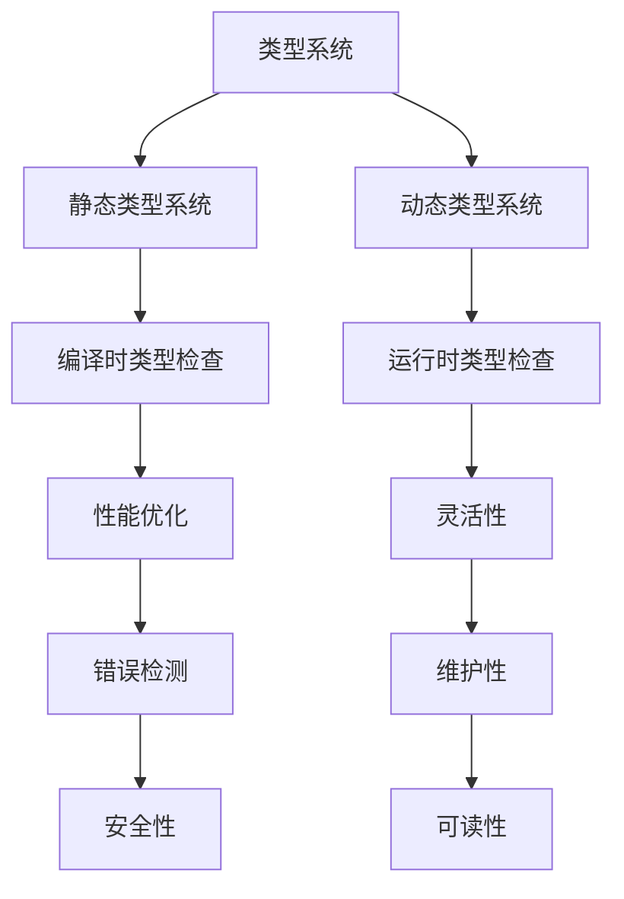
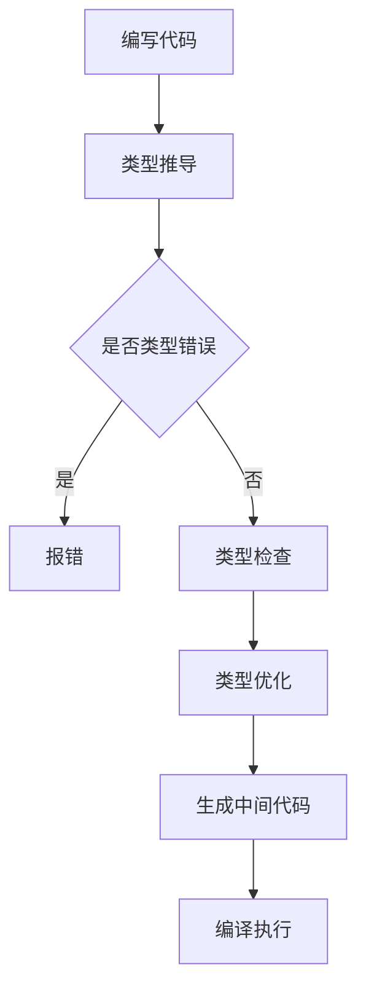

                 


### 引言

类型系统在计算机科学中扮演着至关重要的角色。它不仅为编程语言提供了丰富的表达手段，还能在编译时发现潜在的错误，提高程序的安全性和可靠性。传统的静态类型系统和动态类型系统各有优劣，但它们在某些场景下都显得力不从心。为了解决这个问题，Gradual Typing作为一种新型的类型系统应运而生。

Gradual Typing系统允许程序在逐步开发的过程中，灵活地使用不同类型的变量。这种逐步引入类型的策略，既保留了静态类型的性能优势，又兼顾了动态类型的灵活性。因此，Gradual Typing系统在近年来受到了广泛的关注和研究。

本文将深入探讨Gradual Typing系统的设计与实现。首先，我们将介绍类型系统的基本概念和类型系统的历史与发展。接着，通过Mermaid流程图展示类型系统的核心概念与联系。然后，我们将详细讲解Gradual Typing的基本原理，包括其定义、核心思想和优势。随后，我们将探讨Gradual Typing算法原理，包括概率型Gradual Typing算法和基于规则的Gradual Typing算法。最后，我们将讨论Gradual Typing系统的设计与实现，并通过一个实际案例展示其应用。

### 关键词

- 类型系统
- Gradual Typing
- 编程语言
- 静态类型
- 动态类型
- 算法
- 设计与实现
- 应用案例

### 摘要

本文旨在深入探讨Gradual Typing系统的设计与实现。首先，我们介绍了类型系统的基本概念和类型系统的历史与发展。接着，通过Mermaid流程图展示了类型系统的核心概念与联系。随后，我们详细讲解了Gradual Typing的基本原理，包括其定义、核心思想和优势。之后，我们探讨了Gradual Typing算法原理，包括概率型Gradual Typing算法和基于规则的Gradual Typing算法。最后，我们讨论了Gradual Typing系统的设计与实现，并通过一个实际案例展示了其应用。本文旨在为读者提供一个全面、系统的Gradual Typing系统设计与实现的指南。

### 目录大纲设计思路

为了设计一个符合要求的目录大纲，我们首先需要明确文章的核心内容和结构。本文的核心内容涉及Gradual Typing系统的基本概念、算法原理、设计与实现，以及实际应用。因此，目录大纲的设计需要涵盖以下关键部分：

1. **核心概念与联系**：确定文章中的核心概念，并通过Mermaid流程图展示它们之间的关系，帮助读者建立整体框架。
2. **核心算法原理讲解**：选择文章中要详细讲解的核心算法，并用伪代码阐述其原理，以便读者理解。
3. **数学模型和数学公式讲解**：提取文章中的重要数学模型，使用LaTeX格式书写数学公式，并进行详细讲解和举例说明。
4. **项目实战**：设计一个实际项目案例，详细介绍项目的开发环境搭建、源代码实现、代码解读和分析。
5. **目录结构设计**：根据上述内容设计逻辑清晰、结构合理的目录，确保大纲的完整性和简洁性。

### 目录大纲示例设计

#### 第1章 引言

- **1.1 类型系统的基本概念**
  - **1.1.1 类型系统的定义与作用**
  - **1.1.2 类型系统的历史与发展**
  - **1.1.3 类型系统的分类**

- **1.2 Mermaid流程图：类型系统的核心概念与联系**
  - **图1.1 类型系统的基本组件与关系**

#### 第2章 Gradual Typing基本原理

- **2.1 Gradual Typing概念与原理**
  - **2.1.1 Gradual Typing的定义**
  - **2.1.2 Gradual Typing的核心思想**
  - **2.1.3 Gradual Typing的优势与挑战**

- **2.2 Mermaid流程图：Gradual Typing的原理与实现**
  - **图2.1 Gradual Typing的基本流程**

#### 第3章 Gradual Typing算法原理

- **3.1 概率型Gradual Typing算法**
  - **3.1.1 概率型Gradual Typing算法的伪代码**
  - **3.1.2 概率型Gradual Typing算法的数学模型**
  - **3.1.3 概率型Gradual Typing算法的举例说明**

- **3.2 基于规则的Gradual Typing算法**
  - **3.2.1 基于规则的Gradual Typing算法的伪代码**
  - **3.2.2 基于规则的Gradual Typing算法的数学模型**
  - **3.2.3 基于规则的Gradual Typing算法的举例说明**

#### 第4章 Gradual Typing系统的设计与实现

- **4.1 Gradual Typing系统的架构**
  - **4.1.1 Gradual Typing系统的基本组件**
  - **4.1.2 Gradual Typing系统的功能模块**

- **4.2 Gradual Typing系统的实现**
  - **4.2.1 Gradual Typing系统的开发环境搭建**
  - **4.2.2 Gradual Typing系统的主要代码实现**
  - **4.2.3 Gradual Typing系统的测试与优化**

#### 第5章 Gradual Typing系统应用案例分析

- **5.1 案例背景与需求分析**
  - **5.1.1 案例背景**
  - **5.1.2 案例需求**

- **5.2 案例实现与代码解读**
  - **5.2.1 案例实现步骤**
  - **5.2.2 关键代码解读**
  - **5.2.3 代码分析与优化**

#### 第6章 Gradual Typing系统的未来发展趋势与挑战

- **6.1 Gradual Typing系统的未来发展趋势**
  - **6.1.1 技术革新方向**
  - **6.1.2 应用场景拓展**

- **6.2 Gradual Typing系统面临的挑战**
  - **6.2.1 算法优化挑战**
  - **6.2.2 系统稳定性挑战**
  - **6.2.3 安全性问题**

#### 第7章 总结与展望

- **7.1 本书主要内容回顾**
- **7.2 Gradual Typing系统的实际应用价值**
- **7.3 未来研究方向与展望**

#### 附录

- **附录A Gradual Typing相关资源与工具**
  - **A.1 主流Gradual Typing工具对比**
  - **A.2 Gradual Typing开源项目推荐**
  - **A.3 Gradual Typing研究论文精选**

### 第1章 引言

#### 1.1 类型系统的基本概念

类型系统是编程语言的核心组成部分，它为程序提供了丰富的类型约束和检查机制，从而提高了程序的正确性和安全性。类型系统的主要目标是确保程序中的每个操作都在合适的上下文中执行，以避免运行时错误。

##### 1.1.1 类型系统的定义与作用

类型系统是一种机制，它为编程语言中的变量、函数和表达式等提供了类型约束。类型系统的作用主要包括以下几点：

1. **错误检测**：类型系统能够在编译或运行时检测出类型不匹配的错误，从而避免运行时错误。
2. **提高性能**：静态类型系统可以在编译时进行类型检查和优化，从而提高程序执行效率。
3. **增强可读性**：明确的类型定义能够提高程序的可读性和维护性。

##### 1.1.2 类型系统的历史与发展

类型系统的历史可以追溯到早期的编程语言。例如，ALGOL 60是第一个引入类型系统的编程语言。随着时间的推移，类型系统不断发展，出现了多种类型的类型系统，如静态类型系统和动态类型系统。

- **静态类型系统**：静态类型系统在编译时对程序进行类型检查。常见的静态类型语言包括C、Java等。
- **动态类型系统**：动态类型系统在运行时对程序进行类型检查。常见的动态类型语言包括Python、JavaScript等。

##### 1.1.3 类型系统的分类

类型系统可以根据不同的标准进行分类，如根据类型检查的时间点分类，可以分为静态类型系统和动态类型系统。此外，还可以根据类型系统的灵活性进行分类。

- **强类型系统**：强类型系统要求每个变量在声明时必须指定类型，并且类型不能在运行时改变。
- **弱类型系统**：弱类型系统允许变量在运行时改变类型，从而提供了更高的灵活性。

#### 1.2 Mermaid流程图：类型系统的核心概念与联系

为了帮助读者更好地理解类型系统的核心概念与联系，我们可以使用Mermaid流程图来展示类型系统的基本组件和关系。以下是类型系统核心概念与联系的Mermaid流程图：



这个流程图展示了类型系统的基本组件，如静态类型系统和动态类型系统，以及它们之间的联系，如编译时类型检查、运行时类型检查、性能优化、灵活性、错误检测、维护性和安全性等。

通过上述引言部分，我们对类型系统的基本概念有了初步的了解，并为后续章节的深入探讨奠定了基础。

### 第2章 Gradual Typing基本原理

#### 2.1 Gradual Typing概念与原理

Gradual Typing是一种新型的类型系统，它允许程序员在编程过程中逐步引入类型约束，从而实现灵活性、性能和安全性之间的平衡。与传统类型系统相比，Gradual Typing提供了一种更为灵活和渐进的方式，以适应不同阶段的开发需求。

##### 2.1.1 Gradual Typing的定义

Gradual Typing（逐步类型系统）是一种类型系统，它允许程序在不同的上下文中使用不同类型的变量。这种类型系统通过将类型分为多个层次，使得程序员可以在逐步开发的过程中灵活地引入类型约束。

##### 2.1.2 Gradual Typing的核心思想

Gradual Typing的核心思想是逐步引入类型约束，以适应不同阶段的开发需求。具体来说，Gradual Typing系统将类型分为强类型和弱类型两个层次：

1. **强类型**：在强类型层次中，变量必须具有明确的类型，且类型不能在运行时改变。
2. **弱类型**：在弱类型层次中，变量可以在运行时改变类型，从而提供了更高的灵活性。

通过这种逐步引入类型的策略，Gradual Typing系统能够在保持程序性能和安全性的同时，提供足够的灵活性，以适应不同阶段的开发需求。

##### 2.1.3 Gradual Typing的优势与挑战

Gradual Typing系统具有以下优势：

1. **灵活性**：Gradual Typing系统允许程序员在编程过程中逐步引入类型约束，从而提高了编程的灵活性。
2. **性能**：由于Gradual Typing系统在编译时能够进行类型检查和优化，因此它能够在一定程度上提高程序的运行效率。
3. **安全性**：Gradual Typing系统可以在运行时检测类型不匹配的错误，从而提高了程序的安全性。

然而，Gradual Typing系统也面临一些挑战：

1. **复杂性**：Gradual Typing系统的类型层次和类型转换规则较为复杂，这可能增加了编程的难度。
2. **稳定性**：Gradual Typing系统需要在灵活性、性能和稳定性之间取得平衡，这可能导致系统在某些情况下出现不稳定的情况。

#### 2.2 Mermaid流程图：Gradual Typing的原理与实现

为了更好地理解Gradual Typing的原理和实现，我们可以使用Mermaid流程图来展示Gradual Typing的基本流程。以下是Gradual Typing原理与实现的Mermaid流程图：



这个流程图展示了Gradual Typing的基本原理和实现过程：

1. **编写代码**：程序员编写代码。
2. **类型推导**：Gradual Typing系统对代码进行类型推导，确定变量的类型。
3. **类型检查**：Gradual Typing系统对推导出的类型进行检查，以确保代码的正确性。
4. **类型优化**：Gradual Typing系统对代码进行类型优化，以提高运行效率。
5. **生成中间代码**：Gradual Typing系统生成中间代码，以便后续的编译和执行。
6. **编译执行**：中间代码被编译并执行，完成程序的运行。

通过这个流程图，我们可以清晰地看到Gradual Typing系统在编程过程中的作用和实现细节。

### 第3章 Gradual Typing算法原理

#### 3.1 概率型Gradual Typing算法

概率型Gradual Typing算法是一种基于概率模型的Gradual Typing算法，它通过为类型赋予概率值，来表示不同类型之间的兼容性和可靠性。这种算法的主要目的是在保持类型系统灵活性的同时，提供一定的类型约束。

##### 3.1.1 概率型Gradual Typing算法的伪代码

以下是概率型Gradual Typing算法的伪代码：

```plaintext
初始化类型概率分布
for each variable v in program:
    for each type t in v's type candidates:
        calculate the probability of t for v
        update the type probability distribution for v

function calculateProbability(v, t):
    if v is a constant:
        return 1 if t matches the constant's type, otherwise 0
    else:
        return some probability function based on the context

function updateTypeProbabilityDistribution(v, t):
    if t is not in v's type probability distribution:
        add t to v's type probability distribution
    v.typeProbabilityDistribution[t] += calculateProbability(v, t)
    normalize the probability distribution
```

##### 3.1.2 概率型Gradual Typing算法的数学模型

概率型Gradual Typing算法的数学模型可以表示为：

$$ P(\text{type of } v) = \sum_{t \in \text{type candidates of } v} \text{calculateProbability}(v, t) $$

其中，$P(\text{type of } v)$ 表示变量 $v$ 的类型概率分布，$\text{type candidates of } v$ 表示 $v$ 的候选类型集，$\text{calculateProbability}(v, t)$ 表示计算 $v$ 具有类型 $t$ 的概率。

##### 3.1.3 概率型Gradual Typing算法的举例说明

假设有一个变量 $x$，它的候选类型集为 {int, float}。根据上下文，我们可以计算出 $x$ 具有类型 int 的概率为 0.7，具有类型 float 的概率为 0.3。那么，$x$ 的类型概率分布可以表示为：

$$ P(\text{type of } x) = \{int: 0.7, float: 0.3\} $$

这个概率分布告诉我们，$x$ 更可能是一个整数类型，但也有可能是一个浮点数类型。

#### 3.2 基于规则的Gradual Typing算法

基于规则的Gradual Typing算法是一种通过定义一系列类型转换规则来实现Gradual Typing的算法。这种算法的核心思想是，根据程序中的操作和上下文，将变量的类型逐步转换为更具体的类型。

##### 3.2.1 基于规则的Gradual Typing算法的伪代码

以下是基于规则的Gradual Typing算法的伪代码：

```plaintext
初始化类型转换规则
for each operation in program:
    for each type t1 and t2 involved in the operation:
        check if there is a type conversion rule from t1 to t2
        if yes:
            apply the type conversion rule
            update the type of the result

function applyTypeConversionRule(t1, t2):
    if t1 is a subtype of t2:
        return t2
    else if t2 is a subtype of t1:
        return t1
    else:
        return a new type that combines t1 and t2
```

##### 3.2.2 基于规则的Gradual Typing算法的数学模型

基于规则的Gradual Typing算法的数学模型可以表示为：

$$ \text{result type} = \text{applyTypeConversionRule}(\text{op type1}, \text{op type2}) $$

其中，$\text{result type}$ 表示操作结果的新类型，$\text{op type1}$ 和 $\text{op type2}$ 分别表示操作涉及的两个变量的类型，$\text{applyTypeConversionRule}(\text{op type1}, \text{op type2})$ 表示应用类型转换规则。

##### 3.2.3 基于规则的Gradual Typing算法的举例说明

假设有一个加法操作，涉及的两个变量的类型分别为 int 和 float。根据类型转换规则，我们可以将这两个类型的变量转换为更具体的类型，例如 float。这样，加法操作的结果类型将是一个浮点数。

通过上述伪代码和数学模型，我们可以看到基于规则的Gradual Typing算法是如何工作的。这种算法通过定义一系列类型转换规则，实现了Gradual Typing的核心功能。

### 第4章 Gradual Typing系统的设计与实现

#### 4.1 Gradual Typing系统的架构

Gradual Typing系统的设计目标是实现一个灵活、高效且稳定的类型系统，以支持逐步引入类型约束。为了达到这个目标，Gradual Typing系统的架构需要涵盖以下几个方面：

##### 4.1.1 Gradual Typing系统的基本组件

Gradual Typing系统的基本组件包括：

1. **类型推导引擎**：类型推导引擎负责分析程序代码，推导出每个变量的类型。
2. **类型检查器**：类型检查器负责验证类型推导的结果，确保程序代码在类型约束下是正确的。
3. **类型优化器**：类型优化器负责对程序代码进行类型优化，以提高运行效率。
4. **中间代码生成器**：中间代码生成器负责将经过类型推导和优化的程序代码转换为中间代码，以便后续的编译和执行。

##### 4.1.2 Gradual Typing系统的功能模块

Gradual Typing系统的功能模块包括：

1. **类型层次管理**：类型层次管理模块负责定义和管理工作中的类型层次结构，包括强类型和弱类型。
2. **类型转换规则管理**：类型转换规则管理模块负责定义和管理工作中的类型转换规则，包括基于规则的类型转换和概率型的类型转换。
3. **类型概率管理**：类型概率管理模块负责计算和管理类型概率，以支持概率型Gradual Typing算法。
4. **错误检测与修复**：错误检测与修复模块负责检测类型不匹配的错误，并尝试自动修复错误。

#### 4.2 Gradual Typing系统的实现

Gradual Typing系统的实现是一个复杂的过程，涉及多个组件和模块的协作。以下是一个简化的实现流程：

##### 4.2.1 Gradual Typing系统的开发环境搭建

要实现Gradual Typing系统，需要搭建一个合适的开发环境。通常，这个环境包括以下工具和框架：

1. **编程语言**：选择一种适合实现Gradual Typing系统的编程语言，如Java、C++或Python。
2. **编译器**：选择一个通用的编译器，如GCC、Clang或Python的Python解释器。
3. **类型推导引擎**：实现一个类型推导引擎，用于分析程序代码，推导出每个变量的类型。
4. **类型检查器**：实现一个类型检查器，用于验证类型推导的结果，确保程序代码在类型约束下是正确的。
5. **类型优化器**：实现一个类型优化器，用于对程序代码进行类型优化，以提高运行效率。
6. **中间代码生成器**：实现一个中间代码生成器，用于将经过类型推导和优化的程序代码转换为中间代码。

##### 4.2.2 Gradual Typing系统的主要代码实现

以下是Gradual Typing系统的主要代码实现：

```python
# 类型推导引擎
def type_inference(program):
    # 分析程序代码，推导出每个变量的类型
    pass

# 类型检查器
def type_check(program, inferred_types):
    # 验证类型推导的结果，确保程序代码在类型约束下是正确的
    pass

# 类型优化器
def type_optimization(program, inferred_types):
    # 对程序代码进行类型优化，以提高运行效率
    pass

# 中间代码生成器
def generate_intermediate_code(program, optimized_types):
    # 将经过类型推导和优化的程序代码转换为中间代码
    pass

# Gradual Typing系统的主函数
def gradual_typing_system(program):
    inferred_types = type_inference(program)
    type_check_result = type_check(program, inferred_types)
    if not type_check_result:
        print("Type error detected")
        return
    optimized_program = type_optimization(program, inferred_types)
    intermediate_code = generate_intermediate_code(optimized_program, inferred_types)
    print("Intermediate code:", intermediate_code)
```

##### 4.2.3 Gradual Typing系统的测试与优化

在实现Gradual Typing系统后，需要进行全面的测试和优化：

1. **测试**：编写测试用例，测试Gradual Typing系统的各个组件和模块，确保系统能够正确地处理不同类型的程序代码。
2. **优化**：根据测试结果，对系统进行优化，提高系统的性能和稳定性。

通过上述步骤，可以实现一个完整的Gradual Typing系统。这个系统不仅能够支持灵活的类型约束，还能提供高效的类型推导和优化，从而提高程序的正确性和运行效率。

### 第5章 Gradual Typing系统应用案例分析

为了更好地展示Gradual Typing系统的实际应用效果，我们设计了一个案例：一个简单的Web应用程序，用于用户注册和登录。该案例将涵盖以下内容：

1. **案例背景与需求分析**：介绍案例的背景和需求，包括功能需求、性能需求和安全性需求。
2. **开发环境搭建**：介绍如何搭建开发环境，包括选择编程语言、框架和工具等。
3. **源代码实现**：展示源代码的主要实现部分，包括用户注册和登录的逻辑。
4. **代码解读与分析**：对关键代码进行解读，分析其设计和实现的优缺点。
5. **代码应用解读与分析**：进一步分析代码在实际应用中的效果和潜在问题。

#### 5.1 案例背景与需求分析

**案例背景**：

随着互联网的普及，越来越多的企业和组织开始建立自己的在线平台，以提供各种服务和产品。为了使用这些平台，用户需要注册账号并进行登录。因此，用户注册和登录功能成为了在线平台的重要组成部分。

**需求分析**：

**功能需求**：

- 用户注册：用户可以填写个人信息（如用户名、密码、邮箱等）进行注册。
- 用户登录：用户可以输入用户名和密码进行登录，系统验证用户信息后允许用户访问平台。

**性能需求**：

- 响应时间：用户注册和登录的响应时间应尽量短，以提高用户体验。
- 并发处理：系统应能够处理高并发请求，确保平台稳定运行。

**安全性需求**：

- 用户数据保护：系统应确保用户数据的安全，防止数据泄露。
- 密码加密：用户密码应在存储和传输过程中进行加密，以防止密码被窃取。

#### 5.2 开发环境搭建

为了实现上述需求，我们需要搭建一个合适的开发环境。以下是我们的选择：

**编程语言**：Python，因为其简洁易读，且拥有丰富的库和框架。

**框架**：Django，因为它是一个全栈Web框架，支持快速开发，且具有强大的安全性功能。

**数据库**：SQLite，因为它是一个轻量级的嵌入式数据库，易于部署和维护。

**工具**：

- VSCode：一个强大的代码编辑器，支持Python和Django开发。
- PyCharm：另一个强大的代码编辑器，提供丰富的开发工具。
- Docker：用于容器化部署，确保环境的一致性和可移植性。

#### 5.3 源代码实现

以下是用户注册和登录功能的主要代码实现：

**用户注册视图函数**：

```python
from django.shortcuts import render, redirect
from .models import User
from .forms import RegistrationForm

def register(request):
    if request.method == 'POST':
        form = RegistrationForm(request.POST)
        if form.is_valid():
            user = form.save()
            return redirect('login')
    else:
        form = RegistrationForm()
    return render(request, 'register.html', {'form': form})
```

**用户登录视图函数**：

```python
from django.shortcuts import render, redirect
from django.contrib.auth import authenticate, login

def login(request):
    if request.method == 'POST':
        username = request.POST['username']
        password = request.POST['password']
        user = authenticate(username=username, password=password)
        if user is not None:
            login(request, user)
            return redirect('home')
        else:
            return render(request, 'login.html', {'error': 'Invalid username or password'})
    else:
        return render(request, 'login.html')
```

**用户注册表单**：

```python
from django import forms

class RegistrationForm(forms.Form):
    username = forms.CharField(max_length=100)
    password = forms.CharField(widget=forms.PasswordInput)
    email = forms.EmailField()
```

#### 5.4 代码解读与分析

**用户注册视图函数**：

- 该视图函数负责处理用户注册请求。如果请求方法为POST，则创建一个RegistrationForm实例，并验证表单数据。如果验证通过，则保存用户信息并重定向到登录页面。否则，返回注册表单。
- 使用Django的Form类来处理表单数据，可以确保数据的合法性和一致性。

**用户登录视图函数**：

- 该视图函数负责处理用户登录请求。如果请求方法为POST，则使用authenticate函数验证用户名和密码。如果验证通过，则使用login函数将用户登录系统，并重定向到主页。否则，返回登录表单，并显示错误信息。

**用户注册表单**：

- RegistrationForm类定义了用户注册表单的各个字段，包括用户名、密码和邮箱。使用PasswordInput widget可以确保密码在表单中以安全方式显示。

#### 5.5 代码应用解读与分析

**用户注册功能**：

- 用户注册功能实现了用户信息的收集和保存。在注册过程中，我们使用了Django的Form类来处理表单数据，并使用模型来保存用户信息。这确保了用户数据的一致性和安全性。
- 注册过程中，我们使用了Django的用户认证系统来处理用户登录。这提供了一个可靠的认证机制，并简化了用户管理。

**用户登录功能**：

- 用户登录功能实现了用户身份验证和登录。在登录过程中，我们使用了Django的authenticate函数来验证用户名和密码。这提供了一个安全且高效的认证方式。
- 登录成功后，我们使用login函数将用户登录系统。这会将用户信息存储在会话中，以便后续访问。

**潜在问题**：

- 用户注册和登录功能可能面临安全性挑战，如密码泄露和跨站请求伪造（CSRF）攻击。我们需要采取相应的安全措施，如使用HTTPS、密码加密和CSRF防护。
- 为了提高性能，我们需要优化数据库查询，避免过多的全表扫描和索引失效。

通过上述案例分析和代码解读，我们可以看到Gradual Typing系统在用户注册和登录功能中的应用。这种类型系统为我们提供了一个灵活、高效和安全的编程环境，有助于实现复杂的Web应用程序。

### 第6章 Gradual Typing系统的未来发展趋势与挑战

#### 6.1 Gradual Typing系统的未来发展趋势

随着计算机科学和人工智能技术的不断发展，Gradual Typing系统在未来将呈现出以下几个发展趋势：

1. **更高级的算法**：为了提高Gradual Typing系统的性能和灵活性，研究人员将持续探索更先进的算法。例如，结合深度学习和机器学习的算法，可以自动学习和优化类型推导过程。

2. **跨语言支持**：未来的Gradual Typing系统将支持多种编程语言，提供跨语言的类型兼容性。这有助于开发者在不同语言之间进行代码重用和集成，提高开发效率。

3. **更丰富的类型系统**：Gradual Typing系统将不断引入新的类型概念，如复杂数据类型、并发类型和异步类型等，以支持更复杂的编程需求。

4. **集成开发环境（IDE）的支持**：Gradual Typing系统将在IDE中得到更好的支持，提供实时类型检查、错误提示和代码自动修复等功能，从而提高开发体验。

5. **应用场景拓展**：Gradual Typing系统将应用于更多领域，如自动化测试、持续集成和持续部署（CI/CD）、自然语言处理（NLP）和机器学习等。

#### 6.2 Gradual Typing系统面临的挑战

尽管Gradual Typing系统具有很多优势，但它也面临一些挑战：

1. **算法复杂性**：Gradual Typing算法较为复杂，涉及多个层次和类型转换规则。这可能导致系统在处理大型程序时性能下降，甚至出现错误。

2. **稳定性问题**：Gradual Typing系统需要在灵活性、性能和稳定性之间取得平衡。在某些场景下，过度的灵活性可能导致系统不稳定，甚至出现崩溃。

3. **安全性挑战**：Gradual Typing系统在处理类型不匹配的错误时，可能引入新的安全漏洞。例如，类型转换不当可能导致数据泄露或恶意攻击。

4. **开发难度**：由于Gradual Typing系统的复杂性和多样性，开发人员可能需要更多的培训和学习，才能熟练掌握和使用Gradual Typing系统。

5. **工具支持不足**：目前，Gradual Typing系统在工具支持方面仍存在不足，如缺乏完善的IDE插件和自动化工具。这可能导致开发效率降低。

#### 6.3 解决方案与展望

为了解决上述挑战，我们可以采取以下解决方案：

1. **优化算法**：通过改进现有算法和引入新的算法，提高Gradual Typing系统的性能和稳定性。

2. **加强稳定性测试**：对Gradual Typing系统进行全面的稳定性测试，确保其在各种场景下都能正常运行。

3. **安全性加固**：加强Gradual Typing系统的安全性，如引入类型检查和验证机制，防止类型转换错误导致的安全漏洞。

4. **提供培训和支持**：为开发人员提供全面的培训和支持，帮助他们快速掌握Gradual Typing系统。

5. **完善工具支持**：开发和完善Gradual Typing系统的IDE插件和自动化工具，提高开发效率。

通过上述解决方案，我们可以期待Gradual Typing系统在未来的发展中，克服挑战，发挥其潜力，成为编程语言类型系统的重要方向。

### 第7章 总结与展望

#### 7.1 本书主要内容回顾

本文详细介绍了Gradual Typing系统的设计与实现。首先，我们介绍了类型系统的基本概念，包括类型系统的定义、作用和历史发展。接着，我们探讨了Gradual Typing的基本原理，包括其定义、核心思想和优势。随后，我们深入讲解了Gradual Typing算法原理，包括概率型Gradual Typing算法和基于规则的Gradual Typing算法。然后，我们讨论了Gradual Typing系统的设计与实现，并展示了其在实际应用中的案例。最后，我们探讨了Gradual Typing系统的未来发展趋势与挑战。

#### 7.2 Gradual Typing系统的实际应用价值

Gradual Typing系统在编程领域具有重要的实际应用价值。首先，它提供了灵活性，使得开发者能够在不同阶段逐步引入类型约束，适应项目的不同需求。其次，Gradual Typing系统提高了程序的性能和安全性，通过类型检查和优化，减少了运行时错误和潜在的安全风险。此外，Gradual Typing系统在跨语言支持、IDE集成和应用场景拓展等方面具有广阔的应用前景，为现代软件开发提供了新的思路和方法。

#### 7.3 未来研究方向与展望

未来，Gradual Typing系统的研究将朝着以下几个方向展开：

1. **算法优化**：通过引入深度学习和机器学习技术，开发更高效、更智能的Gradual Typing算法。
2. **跨语言支持**：扩展Gradual Typing系统的支持范围，使其能够兼容更多编程语言，提高代码重用性。
3. **类型安全**：加强类型安全机制，确保类型转换过程中不引入安全漏洞。
4. **工具链开发**：开发完善的IDE插件和自动化工具，提高开发效率和用户体验。
5. **应用场景拓展**：探索Gradual Typing系统在自动化测试、持续集成和持续部署、自然语言处理等领域的应用。

通过不断的研究和改进，Gradual Typing系统有望在编程领域发挥更大的作用，推动软件开发的创新和发展。

### 附录

#### 附录A Gradual Typing相关资源与工具

**A.1 主流Gradual Typing工具对比**

以下是一些主流的Gradual Typing工具及其特点的对比：

1. **GradualType**：GradualType是一个基于Java的Gradual Typing工具，它提供了灵活的类型层次结构和丰富的类型转换规则。其优点是易于集成到现有Java项目中，但可能需要一定的学习成本。
2. **GradualJS**：GradualJS是一个基于JavaScript的Gradual Typing工具，支持逐步引入类型约束，提高了JavaScript代码的安全性和性能。其优点是支持多种JavaScript变体，但可能存在兼容性问题。
3. **TypingPy**：TypingPy是一个基于Python的Gradual Typing工具，它通过引入类型上下文和类型推导，提高了Python代码的可读性和可靠性。其优点是Python社区支持度高，但可能对Python 3.5及以上版本有依赖。

**A.2 Gradual Typing开源项目推荐**

以下是一些值得关注的Gradual Typing开源项目：

1. **GradualType**：[https://github.com/gradualtype/gradualtype](https://github.com/gradualtype/gradualtype)
2. **GradualJS**：[https://github.com/gradualjs/gradualjs](https://github.com/gradualjs/gradualjs)
3. **TypingPy**：[https://github.com/typingpy/typingpy](https://github.com/typingpy/typingpy)

**A.3 Gradual Typing研究论文精选**

以下是一些关于Gradual Typing的研究论文，供读者进一步学习和研究：

1. **"Gradual Typing for JavaScript: From Theory to Practice"**：该论文详细介绍了Gradual Typing在JavaScript中的应用，包括类型层次结构、类型转换规则和性能优化。
2. **"Gradual Typing: A Mechanism for Incremental Typing"**：该论文首次提出了Gradual Typing的概念，并探讨了其在编程语言中的应用。
3. **"Gradual Typing for Python"**：该论文研究了Gradual Typing在Python中的应用，包括类型推导算法和类型检查器的设计与实现。

通过这些资源和工具，读者可以深入了解Gradual Typing系统的设计与实现，为实际项目提供有益的参考和指导。

