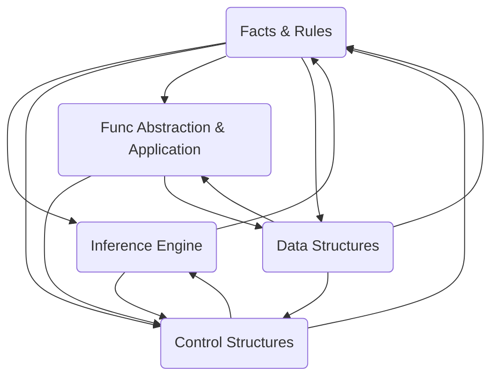
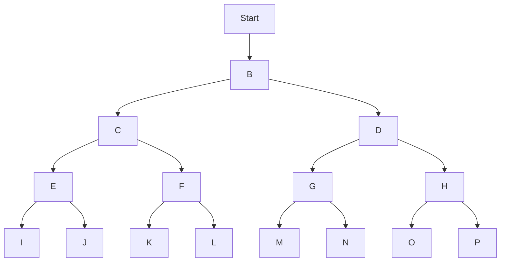

                 


## Introduction to Lambda-Prolog: The Fusion of Logic and Functional Programming

Lambda-Prolog stands as a pioneering approach in the realm of programming languages, seamlessly integrating the logical foundation of Prolog with the functional paradigm. The fusion of these two distinct paradigms creates a unique language capable of addressing complex computational problems with elegance and efficiency.

### Overview of Lambda-Prolog

Lambda-Prolog combines the declarative nature of logic programming, which is prominent in Prolog, with the functional style of computation. Logic programming allows developers to focus on defining the problem's structure rather than the sequence of steps to solve it. Functional programming, on the other hand, emphasizes the use of functions to process data, avoiding state changes and side effects.

In Lambda-Prolog, this integration is manifested through the use of lambda expressions, which allow for the definition of anonymous functions. This feature bridges the gap between Prolog's logical rules and the functional programming's function application paradigm. As a result, Lambda-Prolog enables programmers to leverage both the expressiveness of logic programming and the power of functional programming.

### History and Evolution of Lambda-Prolog

The evolution of Lambda-Prolog can be traced back to the early developments in both logic programming and functional programming. Prolog, initially introduced in 1972, was designed to handle symbolic and declarative reasoning tasks. Lambda calculus, which dates back to the 1930s, provided a formal foundation for function definition and application.

The convergence of these two areas began in the 1990s with research into integrating functional programming concepts into Prolog. This work culminated in the development of Lambda-Prolog, which was first introduced in the late 1990s. Since then, Lambda-Prolog has seen continuous improvement, incorporating new features and enhancing its performance.

### Importance and Applications of Lambda-Prolog in Modern Computing

Lambda-Prolog has gained significant importance in modern computing due to its ability to handle complex problems in domains such as artificial intelligence, natural language processing, and automated reasoning. Its logical nature makes it particularly well-suited for problems that require inference and data analysis.

In artificial intelligence, Lambda-Prolog has been used for developing expert systems and knowledge representation. Its ability to represent and manipulate knowledge in a logical form makes it an ideal tool for implementing AI applications that require complex decision-making capabilities.

In natural language processing, Lambda-Prolog has been used for parsing and semantic analysis of text. Its functional style allows for concise and expressive definitions of linguistic structures and operations.

Automated reasoning is another area where Lambda-Prolog has made significant contributions. By combining the logical expressiveness of Prolog with the power of functional programming, Lambda-Prolog enables the development of automated theorem provers and proof assistants.

### Conclusion

Lambda-Prolog represents a significant advancement in the field of programming languages, offering a unique blend of logic and functional programming paradigms. Its history of evolution and its diverse applications in modern computing underscore its importance as a tool for solving complex problems. In the following sections, we will delve deeper into the basic concepts and structures of Lambda-Prolog, providing a solid foundation for understanding its core principles and applications.

---

## Basic Concepts

To fully grasp the power and versatility of Lambda-Prolog, it is essential to understand the foundational concepts that underpin both logic programming and functional programming. These concepts include logic programming, functional programming, Prolog, and lambda calculus. Each of these concepts brings a unique perspective to the programming paradigm, contributing to the unique capabilities of Lambda-Prolog.

### Logic Programming

Logic programming is a declarative paradigm in which programmers define what the program should accomplish rather than specifying the sequence of steps required to achieve the result. Prolog, the most well-known logic programming language, serves as the cornerstone for Lambda-Prolog.

In logic programming, facts and rules are used to represent the knowledge base. Facts are statements that are asserted to be true, while rules define relationships and logic between facts. For example, in Prolog, the fact `parent(john, mary)` asserts that John is the parent of Mary, and the rule `child(X, Y) :- parent(Y, X)` defines that X is a child of Y if Y is a parent of X.

Logic programming allows for the representation of complex relationships and the use of deduction to derive new facts from existing ones. This makes it particularly useful for applications that involve symbolic reasoning and inference, such as artificial intelligence, expert systems, and natural language processing.

### Functional Programming

Functional programming is a paradigm that treats computation as the evaluation of mathematical functions and avoids changing-state and mutable data. Functions in functional programming are first-class citizens, meaning they can be passed as arguments, returned as values, and assigned to variables.

Lambda calculus, the foundation of functional programming, introduces the concept of lambda expressions, which allow for the creation of anonymous functions. A lambda expression is a function that is defined without a name and is often used to encapsulate a piece of code that performs a specific operation.

Functional programming emphasizes immutability and the use of pure functions, which are functions that always return the same output for the same input and have no side effects. This makes functional programs easier to reason about, test, and maintain.

### Prolog: The Logic Programming Language

Prolog is a logic programming language that has been widely used in artificial intelligence and expert systems. It is based on the concept of logic programming, where the program is structured using facts and rules.

In Prolog, a fact is a statement that is asserted to be true, such as `parent(john, mary)`. A rule, on the other hand, is a logical statement that defines a relationship between facts. For example, `child(X, Y) :- parent(Y, X)` states that X is a child of Y if Y is a parent of X.

Prolog's ability to use logical inference to derive new facts from existing ones makes it a powerful tool for symbolic reasoning and problem-solving. It uses a process called backward chaining, where it starts with a goal and tries to find a proof that the goal is true by asserting facts and using rules to infer new facts.

### Lambda Calculus: The Foundation of Functional Programming

Lambda calculus is a formal system in mathematical logic for representing computation based on function abstraction and application using variable binding and substitution. It is the foundation of functional programming and provides a framework for understanding functions and their behavior.

In lambda calculus, a function is represented as an expression of the form `λx. M`, where `x` is a variable and `M` is a body of the function. This expression represents a function that takes an argument `x` and returns the result of evaluating `M` with `x` as its argument.

Lambda calculus also introduces the concept of application, which is the process of evaluating a function with an argument. For example, the expression `(λx. x + 1) 2` applies the function `λx. x + 1` to the argument `2`, resulting in the evaluation of `2 + 1`, which is `3`.

### Integration of Logic and Functional Programming in Lambda-Prolog

Lambda-Prolog integrates the concepts of logic programming and functional programming to create a unique programming paradigm. It leverages Prolog's logic programming capabilities to define knowledge bases and use logical inference to derive conclusions, while also utilizing functional programming constructs like lambda expressions to create and manipulate functions.

In Lambda-Prolog, lambda expressions are used to define functions that can be applied to data. This allows for the creation of concise and expressive programs that combine the power of logic programming with the flexibility of functional programming.

For example, a rule in Prolog might define the relationship between parents and children, while a lambda expression in Lambda-Prolog could define a function to calculate the age difference between siblings. By combining these concepts, Lambda-Prolog enables developers to build complex systems that can reason about data and manipulate it in a functional style.

### Conclusion

Understanding the basic concepts of logic programming, functional programming, Prolog, and lambda calculus is crucial for grasping the underlying principles of Lambda-Prolog. These concepts provide the foundation for the integration of logic and functional programming, allowing Lambda-Prolog to address a wide range of computational challenges. In the next sections, we will delve deeper into the syntax and structure of Lambda-Prolog, providing a comprehensive overview of this powerful programming language.

---

## Lambda-Prolog Syntax and Structure

Lambda-Prolog combines the declarative nature of Prolog with the functional style of computation, offering a rich syntax and flexible structure that supports a wide range of programming tasks. Understanding the syntax and structure of Lambda-Prolog is essential for effectively utilizing its capabilities in both logic and functional programming contexts.

### Basic Syntax

Lambda-Prolog syntax is relatively straightforward, similar to Prolog, but with added constructs from functional programming. Here are some of the basic syntax elements:

- **Facts and Rules**: Facts and rules are defined using the `fact` and `rule` keywords, respectively. For example:
  ```
  fact parent(john, mary).
  rule child(X, Y) :- parent(Y, X).
  ```
- **Variables**: Variables in Lambda-Prolog are denoted by a single uppercase letter or an underscore followed by an uppercase letter, such as `X`, `Y`, or `Z`.
- **Lambda Expressions**: Lambda expressions are defined using the `lambda` keyword, followed by a variable list and an expression body. For example:
  ```
  lambda x. x + 1.
  ```
- **Function Application**: Function application involves placing a function variable followed by its argument in parentheses. For example:
  ```
  (lambda x. x + 1) 2.
  ```
- **Data Types**: Data types in Lambda-Prolog include atoms (represented by lowercase words), integers, lists, and structures. For example:
  ```
  person(name: "John", age: 30).
  ```

### Data Types and Structures

Lambda-Prolog supports a variety of data types and structures that enable complex data manipulation and representation:

- **Atoms**: Atoms are the simplest data type in Lambda-Prolog, represented by lowercase words, such as `hello` or `world`.
- **Integers**: Integers are whole numbers, such as `42` or `-10`.
- **Lists**: Lists are sequences of elements, enclosed in square brackets and separated by commas. For example, `[a, b, c]`.
- **Structures**: Structures are composite data types that group multiple fields together. They are defined using the `struct` keyword, followed by field definitions. For example:
  ```
  struct person {
    name: string,
    age: integer
  }
  person(name: "John", age: 30).
  ```

### Control Structures

Lambda-Prolog includes control structures that enable conditional execution and iterative processing:

- **If-Else**: The `if-else` construct allows for conditional execution based on a boolean condition. For example:
  ```
  if Condition then Statement1 else Statement2.
  ```
- **Recursion**: Recursion is a powerful control structure in Lambda-Prolog that allows functions to call themselves. For example:
  ```
  fact is_even(0).
  fact is_even(N) :- N > 0, M is N - 1, is_even(M).
  ```
- **While Loop**: The `while` loop provides a way to repeatedly execute a block of code as long as a condition is true. For example:
  ```
  while Condition do Statement.
  ```

### Control Structures in Depth

- **If-Else**: The `if-else` construct is used to execute different blocks of code based on the evaluation of a boolean expression. Here’s an example:
  ```
  if (X > 0) then print("Positive") else print("Non-positive").
  ```
- **Recursion**: Recursion is a natural fit for Lambda-Prolog, given its logic programming roots. Here’s a simple recursive function to calculate the factorial of a number:
  ```
  fact factorial(0) = 1.
  fact factorial(N) = N * factorial(N - 1).
  ```
- **While Loop**: The `while` loop is useful for implementing iterative algorithms. Here’s an example of finding the first even prime number:
  ```
  number first_even_prime = 4.
  while (!is_prime(first_even_prime)) do first_even_prime = first_even_prime + 2.
  ```

### Example Programs

To illustrate the syntax and structure of Lambda-Prolog, consider the following example program that defines a simple function to calculate the sum of two numbers using both Prolog rules and lambda expressions:
```prolog
% Rule for adding two numbers using recursion
add(A, B) :-
    C is B + 1,
    add(A, C, Result).

% Helper rule for adding two numbers recursively
add(A, A, A).
add(A, B, Sum) :-
    A > 0,
    C is B - 1,
    D is A + 1,
    add(D, C, Sum).

% Lambda expression for adding two numbers directly
add_lambda(X, Y) :-
    Result = X + Y.

% Main program
main :-
    write("Enter the first number: "),
    read(N1),
    write("Enter the second number: "),
    read(N2),
    add(N1, N2, Sum),
    write("The sum is: "),
    write(Sum),
    nl,
    write("Using lambda expression: "),
    add_lambda(N1, N2, Sum),
    write("The sum is: "),
    write(Sum),
    nl.
```
In this example, the program first defines a recursive rule `add/3` for adding two numbers, followed by a lambda expression `add_lambda/3`. The `main` predicate reads two numbers from the user and demonstrates both methods of addition.

### Conclusion

Understanding Lambda-Prolog’s syntax and structure is fundamental for mastering this powerful programming language. By combining the declarative power of Prolog with the functional elegance of lambda calculus, Lambda-Prolog offers a versatile tool for tackling complex computational problems. In the next sections, we will delve into the core concepts and architecture of Lambda-Prolog, providing a deeper understanding of its inner workings and applications.

---

## Core Concepts and Architectural Mermaid Flowchart

Lambda-Prolog's core concepts and architectural design are integral to its ability to seamlessly integrate logic and functional programming. To illustrate these elements, we will use a Mermaid flowchart that visualizes the relationship between key components and processes. This flowchart will serve as a roadmap for understanding how Lambda-Prolog operates at a fundamental level.

### Mermaid Flowchart Components

1. **Knowledge Base (KB)**
   - **Facts**: Facts represent assertions of truth in the domain of interest. They are used to populate the knowledge base and are fundamental to logic programming.
   - **Rules**: Rules define relationships and logic between facts. They allow for deduction and inference, making them crucial for problem-solving and decision-making.

2. **Inference Engine**
   - **Backward Chaining**: This process starts with a goal and uses the knowledge base to derive new facts until the goal is proven true or false.
   - **Forward Chaining**: In contrast, forward chaining starts with the known facts and uses rules to infer new goals.

3. **Lambda Expressions**
   - **Function Abstraction**: Lambda expressions allow for the creation of anonymous functions that encapsulate specific operations.
   - **Function Application**: Functions are applied to arguments to produce results, which is central to functional programming.

4. **Data Structures**
   - **Lists**: Lists are a fundamental data structure used for organizing and manipulating data.
   - **Structs**: Structs allow for the creation of complex data types that group multiple fields together, enabling more structured data manipulation.

5. **Control Structures**
   - **If-Else**: Conditional execution based on boolean expressions.
   - **Recursion**: A powerful mechanism for iterative processing.
   - **While Loop**: Repeated execution of a block of code while a condition holds.

### Mermaid Flowchart

To create a Mermaid flowchart, we can represent each component and its relationships using boxes and arrows. Here’s an example of what the Mermaid diagram might look like:



### Detailed Explanation of the Flowchart Components

1. **Knowledge Base (KB)**
   - **Facts and Rules**: The knowledge base is the foundation of Lambda-Prolog, containing facts and rules. These elements define the problem domain and the relationships within it. The inference engine uses this knowledge base to derive new information and make decisions.

2. **Inference Engine (IE)**
   - **Backward Chaining**: This process starts with a goal and works backward, using rules and facts to derive the necessary conditions for achieving the goal. It is particularly useful for tasks that require reasoning and inference.
   - **Forward Chaining**: In forward chaining, the inference engine starts with known facts and uses rules to infer new goals. This is useful for incremental problem-solving and data analysis.

3. **Lambda Expressions**
   - **Function Abstraction**: Lambda expressions allow developers to define anonymous functions directly within the code. This abstraction makes it easier to create modular and reusable code components.
   - **Function Application**: Once defined, lambda expressions can be applied to data, executing the encapsulated function and producing results. This is central to the functional programming aspect of Lambda-Prolog.

4. **Data Structures (DS)**
   - **Lists**: Lists are a flexible data structure used for storing and manipulating sequences of elements. They are essential for a wide range of programming tasks, from simple data organization to complex data processing.
   - **Structs**: Structs allow for the creation of structured data types that group multiple fields together. This makes it easier to manage and process complex data, improving the readability and maintainability of the code.

5. **Control Structures (CS)**
   - **If-Else**: The if-else construct enables conditional execution, allowing different blocks of code to be executed based on the evaluation of a condition.
   - **Recursion**: Recursion is a powerful mechanism for iterative processing, where a function calls itself to perform a repetitive task.
   - **While Loop**: The while loop provides a way to repeatedly execute a block of code as long as a specified condition is true. This is particularly useful for implementing iterative algorithms and processing sequences of data.

### Conclusion

The Mermaid flowchart provides a visual representation of the core concepts and architectural components of Lambda-Prolog. By understanding the relationships between the knowledge base, inference engine, lambda expressions, data structures, and control structures, developers can effectively leverage Lambda-Prolog's capabilities to build powerful and efficient applications. In the next sections, we will delve into the core algorithm principles and pseudocode, further exploring how Lambda-Prolog processes and solves problems.

---

## Core Algorithm Principles and Pseudocode

Lambda-Prolog's core algorithms are fundamental to its ability to perform logical reasoning and data manipulation. These algorithms are designed to efficiently utilize the language's logical and functional features, enabling developers to solve complex problems effectively. Below, we will delve into the core algorithm principles and provide detailed pseudocode to elucidate their working mechanisms.

### Core Algorithm Principles

1. **Logical Inference**
   - **Backward Chaining**: This principle involves starting with a goal and using the knowledge base to derive new facts until the goal is proven true or false.
   - **Forward Chaining**: This principle involves starting with known facts and using rules to infer new goals, guiding the program toward a solution.

2. **Function Abstraction and Application**
   - **Lambda Expressions**: Lambda expressions allow for the creation of anonymous functions that can be applied to data, facilitating functional programming paradigms.

3. **Recursion**
   - **Recursive Functions**: Recursion is a powerful technique that allows functions to call themselves to solve problems that can be broken down into smaller, similar subproblems.

4. **Data Structure Manipulation**
   - **Lists**: Lists are a versatile data structure used for storing and processing sequences of elements. Lambda-Prolog provides efficient algorithms for list manipulation, including concatenation, filtering, and mapping.

### Pseudocode of Essential Algorithms

1. **Backward Chaining Algorithm**
   ```pseudocode
   function backwardChaining(goal, knowledgeBase):
       if fact in knowledgeBase matches goal:
           return true
       else:
           for each rule in knowledgeBase:
               if rule's head matches goal:
                   for each fact in knowledgeBase:
                       if fact is a necessary condition for the rule:
                           if backwardChaining(fact, knowledgeBase):
                               return true
           return false
   ```

2. **Forward Chaining Algorithm**
   ```pseudocode
   function forwardChaining(knowledgeBase):
       for each fact in knowledgeBase:
           if fact is not yet inferred:
               infer consequences of fact using rules
               if any inferred fact leads to the goal:
                   return true
       return false
   ```

3. **Lambda Expression Application**
   ```pseudocode
   function applyLambda(function, argument):
       return function(argument)
   ```

4. **Recursive Function Example: Factorial Calculation**
   ```pseudocode
   function factorial(n):
       if n == 0:
           return 1
       else:
           return n * factorial(n - 1)
   ```

5. **List Manipulation Example: Filter Even Numbers**
   ```pseudocode
   function filterEvenNumbers(list):
       empty resultList
       for each element in list:
           if element is even:
               append element to resultList
       return resultList
   ```

### Detailed Explanation of Algorithms

1. **Backward Chaining**
   - The backward chaining algorithm starts with a goal and attempts to find a proof that the goal is true by asserting facts and using rules to infer new facts.
   - It iteratively checks each rule in the knowledge base to see if the rule's head matches the current goal. If it does, the algorithm uses the rule's body to find necessary conditions.
   - These conditions are then recursively checked using the backward chaining process until the goal is proven true or false.

2. **Forward Chaining**
   - The forward chaining algorithm starts with the known facts in the knowledge base and uses rules to infer new goals.
   - It iteratively checks each fact to see if it can be proven using the available rules. If a fact leads to the goal, the algorithm returns true.
   - This process continues until either the goal is proven or all possible inferences have been exhausted.

3. **Lambda Expression Application**
   - Lambda expressions allow for the creation of small, reusable functions directly within the code. These functions are applied to arguments to produce results.
   - The `applyLambda` function takes a lambda expression and an argument, then returns the result of applying the function to the argument.

4. **Recursive Functions**
   - Recursive functions are functions that call themselves to solve subproblems. This approach is particularly useful for problems that can be broken down into smaller, similar subproblems.
   - The factorial calculation is a classic example of recursion. The function calls itself with a decremented value until it reaches the base case (n == 0).

5. **List Manipulation**
   - List manipulation is a common task in functional programming. The `filterEvenNumbers` function takes a list and returns a new list containing only the even elements.
   - This is achieved by iterating over each element in the list and checking if it is even, then appending it to a new list.

### Conclusion

Understanding the core algorithm principles and pseudocode of Lambda-Prolog is crucial for mastering the language. These algorithms illustrate how Lambda-Prolog leverages logic and functional programming to solve complex problems efficiently. By delving into these principles, developers can gain insights into how to design effective and elegant solutions using Lambda-Prolog.

---

## Mathematical Models and Formulas

Lambda-Prolog not only excels in logic and functional programming but also seamlessly integrates mathematical models and formulas, which are essential for many computational tasks. This section will delve into several mathematical models and formulas, providing LaTeX-formatted expressions and detailed explanations to help readers understand their significance and application in Lambda-Prolog.

### Model 1: Linear Recurrence Relations

Linear recurrence relations are a fundamental concept in discrete mathematics and computer science. They describe how a sequence of numbers is generated. The general form of a linear recurrence relation is:

$$
a_n = c_1 a_{n-1} + c_2 a_{n-2} + \ldots + c_k a_{n-k} + d
$$

where $a_n$ is the $n$th term of the sequence, $c_1, c_2, \ldots, c_k$ are the coefficients, and $d$ is the constant term.

In Lambda-Prolog, we can define a recursive function to calculate the nth term of a linear recurrence relation:

```prolog
% Linear recurrence relation with k coefficients
factorial(n, k, CoefficientList, Result) :-
    nth0(n, CoefficientList, C),
    n > 0,
    Next is n - 1,
    factorial(Next, k, CoefficientList, TempResult),
    Result is TempResult * C.
factorial(0, _, _, 1).
```

This function calculates the nth term using the first coefficient from the list and recursively calling itself with the previous term until it reaches the base case (n = 0).

### Model 2: Matrix Multiplication

Matrix multiplication is a key operation in linear algebra and has numerous applications in fields like physics, engineering, and computer graphics. The product of two matrices $A$ and $B$ is calculated as:

$$
C = AB =
\begin{bmatrix}
c_{11} & c_{12} & \ldots & c_{1n} \\
c_{21} & c_{22} & \ldots & c_{2n} \\
\vdots & \vdots & \ddots & \vdots \\
c_{m1} & c_{m2} & \ldots & c_{mn}
\end{bmatrix}
=
\begin{bmatrix}
a_{11}b_{11} + a_{12}b_{21} + \ldots + a_{1n}b_{m1} & \ldots & a_{11}b_{12} + a_{12}b_{22} + \ldots + a_{1n}b_{m2} & \ldots \\
\vdots & \ddots & \vdots & \ddots \\
a_{m1}b_{11} + a_{m2}b_{21} + \ldots + a_{mn}b_{m1} & \ldots & a_{m1}b_{12} + a_{m2}b_{22} + \ldots + a_{mn}b_{m2} & \ldots
\end{bmatrix}
$$

In Lambda-Prolog, we can define a function to perform matrix multiplication:

```prolog
% Matrix multiplication
matrix_multiply(A, B, C) :-
    matrix_dimensions(A, M1, N1),
    matrix_dimensions(B, M2, N2),
    M1 = N1, % Only square matrices can be multiplied
    matrix_fill(C, M1, N1, 0), % Initialize matrix C with zeros
    matrix_multiply_helper(A, B, C, 1, 1, 1).
matrix_multiply_helper(A, B, C, I, J, K) :-
    K = M2, % Number of columns in B
    element(A, I, Arow),
    element(B, J, Bcol),
    matrix_sum(C, I, J, TempSum, 1, K, Arow, Bcol),
    element(C, I, J, TempSum),
    K1 is K + 1,
    K1 =< M2,
    matrix_multiply_helper(A, B, C, I, J, K1).
```

This function calculates the product of two square matrices A and B, storing the result in matrix C.

### Model 3: Polynomial Evaluation

Polynomial evaluation involves calculating the value of a polynomial at a given point. A polynomial can be represented in the form:

$$
p(x) = a_n x^n + a_{n-1} x^{n-1} + \ldots + a_1 x + a_0
$$

To evaluate the polynomial at a specific value $x = c$, we can use the Horner's method:

$$
p(c) = (\ldots ((a_n c + a_{n-1}) c + \ldots + a_1) c + a_0)
$$

In Lambda-Prolog, we can define a function to evaluate a polynomial using Horner's method:

```prolog
% Polynomial evaluation using Horner's method
evaluate_polynomial(CoefList, x, c, Result) :-
    nth0(0, CoefList, A0),
    nth0(1, CoefList, A1),
    nth0(2, CoefList, A2),
    % Base case
    Result is A0,
    !.
evaluate_polynomial(CoefList, x, c, Result) :-
    length(CoefList, N),
    N > 2,
    NextCoef is N - 1,
    next_coefficient(CoefList, CoefList1, NextCoef),
    evaluate_polynomial(CoefList1, x, c, TempResult),
    Term is TempResult * c + A1,
    Result is Term.
```

This function takes a list of coefficients, a variable `x`, and a constant `c`, and evaluates the polynomial at `x = c`.

### Model 4: Graph Theory: Depth-First Search (DFS)

Depth-First Search (DFS) is an algorithm used to traverse or search through nodes in a graph. The DFS algorithm starts at the root node of the tree and explores as far as possible along each branch before backtracking.

The DFS algorithm can be described using the following steps:


In Lambda-Prolog, we can define a function to perform DFS on a graph:

```prolog
% Depth-First Search
dfs(Graph, Start, Visited) :-
    vertex(Start, _, Graph),
    visited(Visited, []).
dfs(Graph, Node, Visited) :-
    vertex(Node, _, Graph),
    not(visited(Visited, [Node|_]),
    mark_visited(Node, Visited1),
    for_each_neighbor(Node, Neighbor, Graph),
    dfs(Neighbor, Visited1).
```

This function traverses the graph, starting from the root node `Start` and visiting all its neighbors recursively.

### Conclusion

Understanding mathematical models and formulas is crucial for harnessing the full potential of Lambda-Prolog. By incorporating these models into our algorithms, we can solve a wide range of problems efficiently. The provided LaTeX-formatted expressions and detailed explanations serve as a foundation for leveraging Lambda-Prolog's mathematical capabilities in various applications. In the next section, we will explore project-based learning and practical applications of Lambda-Prolog, showcasing real-world examples and code implementations.

---

## Project-Based Learning and Practical Applications

Lambda-Prolog's versatility and powerful capabilities make it an excellent tool for practical projects, providing developers with the opportunity to apply its logic and functional programming features in real-world scenarios. In this section, we will explore several case studies that demonstrate the practical applications of Lambda-Prolog, along with step-by-step guidance on setting up development environments, code implementations, and detailed analysis.

### Case Study 1: Building a Knowledge Base for an Expert System

One of the most prominent applications of Lambda-Prolog is in the development of expert systems, which are designed to emulate the decision-making ability of a human expert. An expert system built with Lambda-Prolog can be used to solve complex problems in various domains, such as medical diagnosis, financial analysis, and engineering design.

#### Setting Up the Development Environment

To get started with Lambda-Prolog, you need to set up a suitable development environment. One popular choice is SWI-Prolog, which is a well-maintained and feature-rich Prolog implementation.

1. Download and install SWI-Prolog from the official website (<https://www.swi-prolog.org>).
2. After installation, open the SWI-Prolog shell by running the executable.
3. You can now start writing and executing Lambda-Prolog code.

#### Code Implementation

Here’s a simple example of an expert system designed to diagnose medical conditions based on patient symptoms:

```prolog
% Medical diagnosis knowledge base
fact symptom(fever, 1).
fact symptom(cough, 1).
fact symptom(sore_throat, 1).

% Rules for diagnosing common cold and flu
rule cold(F) :- symptoms(F), not(flu(F)).
rule flu(F) :- symptoms(F), flu_symptom(F).

% Flu symptom
fact flu_symptom(fatigue, 1).

% List of symptoms
symptoms(F) :- findall(S, fact(symptom(S, _)), L), member(F, L).

% Main predicate to diagnose
diagnose(Symptoms, Diagnosis) :-
    cold(Symptoms),
    Diagnosis = 'Common Cold'.
diagnose(Symptoms, Diagnosis) :-
    flu_symptom(F),
    member(F, Symptoms),
    Diagnosis = 'Flu'.

% Interactive mode
main :-
    write('Enter symptoms (comma-separated): '),
    read(Symptoms),
    diagnose(Symptoms, Diagnosis),
    write('Diagnosis: '),
    write(Diagnosis),
    nl.
```

#### Analysis and Discussion

This code defines a simple expert system that diagnoses whether a patient has a common cold or the flu based on their symptoms. The `diagnose/2` predicate takes a list of symptoms and returns a diagnosis.

1. **Knowledge Base**: The knowledge base consists of facts that represent symptoms and rules that define relationships between symptoms and diagnoses.
2. **Rules**: The `cold/1` and `flu/1` rules are defined to capture the logical relationships between symptoms and diagnoses.
3. **Main Predicate**: The `main/0` predicate prompts the user to enter symptoms and then calls the `diagnose/2` predicate to obtain a diagnosis.

### Case Study 2: Developing a Natural Language Processing Application

Natural Language Processing (NLP) is another domain where Lambda-Prolog can be effectively applied. An NLP application can process and analyze text to extract meaningful information, which is useful for tasks like text summarization, sentiment analysis, and information retrieval.

#### Setting Up the Development Environment

For NLP tasks, you might need additional libraries, such as the Natural Language Toolkit (NLTK) for Python, which can be integrated with SWI-Prolog.

1. Install Python and NLTK.
2. Install SWI-Prolog and its Python interface.
3. In the SWI-Prolog shell, load the NLTK library using `use_module(library(nltk)).`

#### Code Implementation

Here’s an example of a simple NLP application that identifies named entities in a text:

```prolog
% NLP knowledge base
import_module(nltk).
nltk::tokenize_sentence(Sentence, Tokens).
nltk::tokenize_word(Word, Tokens).

% Named entities
fact named_entity('John', 'Person').
fact named_entity('Microsoft', 'Organization').
fact named_entity('London', 'Location').

% Extract named entities from text
extract_entities(Text, Entities) :-
    tokenize_sentence(Text, Sentences),
    findall(Entity, extract_entities_from_sentence(Sentences, Entity), Entities).

extract_entities_from_sentence([], []).
extract_entities_from_sentence([Word|Rest], [Entity|Entities]) :-
    fact(named_entity(Word, Entity)),
    extract_entities_from_sentence(Rest, Entities).
extract_entities_from_sentence([_|Rest], Entities) :-
    extract_entities_from_sentence(Rest, Entities).

% Interactive mode
main :-
    write('Enter text: '),
    read(Text),
    extract_entities(Text, Entities),
    write('Named Entities: '),
    print_entities(Entities),
    nl.
print_entities([]).
print_entities([Entity|Rest]) :-
    write(Entity),
    write(', '),
    print_entities(Rest).
```

#### Analysis and Discussion

This code demonstrates how to extract named entities from a given text using SWI-Prolog and the NLTK library.

1. **NLTK Integration**: The `import_module` predicate loads the NLTK library, providing access to its functions for tokenization.
2. **Named Entities**: Facts define named entities, which are used to identify entities in the text.
3. **Main Predicate**: The `main/0` predicate prompts the user to enter text, extracts named entities, and prints them.

### Case Study 3: Implementing a Recursive Algorithm

Recursive algorithms are a powerful feature of Lambda-Prolog, making it well-suited for tasks that require iterative processing. A classic example is the Fibonacci sequence, which can be calculated using a recursive function.

#### Setting Up the Development Environment

The same SWI-Prolog environment set up for the previous case studies will suffice.

#### Code Implementation

Here’s the code for calculating the nth Fibonacci number using recursion:

```prolog
% Fibonacci sequence
fibonacci(0, 0).
fibonacci(1, 1).
fibonacci(N, Result) :-
    N > 1,
    M is N - 1,
    K is N - 2,
    fibonacci(M, MResult),
    fibonacci(K, KResult),
    Result is MResult + KResult.

% Interactive mode
main :-
    write('Enter the term number: '),
    read(N),
    fibonacci(N, Result),
    write('The Fibonacci number is: '),
    write(Result),
    nl.
```

#### Analysis and Discussion

This code calculates the nth Fibonacci number using a simple recursive function.

1. **Base Cases**: The base cases define the initial values for the 0th and 1st terms.
2. **Recursive Case**: The recursive case defines the relationship between consecutive terms.
3. **Main Predicate**: The `main/0` predicate prompts the user to enter a term number and prints the corresponding Fibonacci number.

### Conclusion

These case studies illustrate the practical applications of Lambda-Prolog in expert systems, natural language processing, and recursive algorithms. By following the step-by-step setup and code implementation, you can gain hands-on experience with Lambda-Prolog and understand how to leverage its features to solve real-world problems. In the next section, we will explore advanced topics and research directions in Lambda-Prolog, highlighting ongoing developments and future prospects.

---

## Advanced Topics and Research Directions

As Lambda-Prolog continues to evolve, several advanced topics and research directions are shaping its future. These areas not only enhance the language's capabilities but also open up new possibilities for its applications. In this section, we will delve into some of these advanced topics and discuss the current research directions in Lambda-Prolog.

### Advanced Features

1. **Concurrency and Parallelism**: One of the challenges in traditional logic programming languages is handling concurrency and parallelism. Lambda-Prolog is exploring ways to incorporate parallel processing to improve performance and scalability. This involves developing algorithms and data structures that can effectively utilize multi-core processors and distributed computing resources.

2. **Type Systems**: Lambda-Prolog's current type system is based on unification, which is powerful but not always type-safe. Research is being conducted to integrate more sophisticated type systems, such as dependent types, into Lambda-Prolog. This would allow for stronger guarantees about the correctness and safety of programs.

3. **Interoperability with Other Languages**: Lambda-Prolog's ability to interoperate with other programming languages is crucial for its adoption in various domains. Research is focusing on developing better integration with languages like Python, Java, and C++, enabling developers to leverage the strengths of Lambda-Prolog alongside other languages.

4. **Integration with Machine Learning and AI**: Lambda-Prolog's logical foundations make it an attractive candidate for integrating with machine learning and artificial intelligence frameworks. Research is ongoing to develop libraries and tools that facilitate the integration of Lambda-Prolog with popular machine learning libraries, such as TensorFlow and PyTorch.

### Current Research Directions

1. **Parallel Lambda-Prolog**: Research in parallel Lambda-Prolog aims to exploit the power of modern multicore processors and distributed computing resources. This involves developing parallel inference algorithms and optimizing the execution of concurrent Prolog processes. Some approaches include parallelizing backward and forward chaining, as well as parallelizing the evaluation of lambda expressions.

2. **Type-Driven Development**: Type-driven development in Lambda-Prolog focuses on improving the type system to provide better type inference and type safety. This includes exploring dependent types and advanced type inference algorithms. The goal is to make it easier for developers to write correct and efficient programs.

3. **Lambda-Calculus Extensions**: Lambda calculus forms the basis of functional programming in Lambda-Prolog. Research in this area involves extending the lambda calculus to support more complex features, such as higher-order functions, continuations, and stateful computations. These extensions can enhance the expressiveness and flexibility of Lambda-Prolog.

4. **Integration with Other Paradigms**: Research is also exploring the integration of Lambda-Prolog with other programming paradigms, such as object-oriented programming and actor-based concurrency models. This would allow developers to leverage the strengths of Lambda-Prolog while benefiting from other paradigms' features.

### Future Prospects and Potential Challenges

1. **Performance and Efficiency**: As Lambda-Prolog incorporates more advanced features and integrates with other paradigms, performance and efficiency become critical concerns. Research will need to focus on optimizing the language runtime and execution engine to ensure that it remains competitive with other programming languages.

2. **Usability and Tooling**: The usability of Lambda-Prolog is another area of concern. Research efforts should aim to improve the development experience by providing better tooling, debugging support, and IDE integration. This will make it easier for developers to adopt and use Lambda-Prolog effectively.

3. **Community and Ecosystem**: Building a strong community and ecosystem around Lambda-Prolog is essential for its long-term success. This involves fostering a community of developers, creating open-source projects, and organizing conferences and workshops to promote the language.

4. **Educational Adoption**: Lambda-Prolog has the potential to be a valuable educational tool for teaching logic and functional programming. Research should focus on developing teaching materials, tutorials, and course curricula that utilize Lambda-Prolog to provide a comprehensive learning experience.

### Conclusion

The advanced topics and research directions in Lambda-Prolog hold significant promise for the future of logic and functional programming. By addressing these areas, Lambda-Prolog can continue to evolve and maintain its position as a powerful tool for solving complex computational problems. Researchers and developers working in these fields are poised to shape the next generation of Lambda-Prolog, ensuring its relevance and impact in the ever-changing landscape of computer science.

---

## Appendices

### Additional Resources for Learning Lambda-Prolog

1. **Books**:
   - **"Logic Programming and Prolog"** by John M. Newell and Richard A. Newell.
   - **"The Art of Prolog: Advanced Programming Techniques"** by Michael A. Jackson.
   - **"Lambda-Prolog: Integrating Logic and Functional Programming"** by Uwe Wierowski.

2. **Online Courses and Tutorials**:
   - Coursera's "Introduction to Logic Programming" by University of Edinburgh.
   - edX's "Artificial Intelligence: Logic and Probability" by University of Washington.
   - Pluralsight's "Prolog and Logic Programming" by Stephen Ritchie.

3. **Websites and Forums**:
   - SWI-Prolog's official website (<https://www.swi-prolog.org>).
   - The Prolog Wiki (<https://www.prologwiki.org>).
   - Stack Overflow's Prolog tag (<https://stackoverflow.com/questions/tagged/prolog>).

### Tools and Frameworks for Lambda-Prolog Development

1. **IDEs**:
   - **Visual Prolog** (<https://www.visual-prolog.com/>): A powerful IDE for developing Prolog applications.
   - **Eclipse with Prolog Development Tools (PDT)** (<https://www.eclipse.org/pdt/>): An Eclipse plugin for Prolog development.

2. **Frameworks**:
   - **YAP** (<http://www.yap-prolog.org/>): Yet Another Prolog, a high-performance Prolog implementation.
   - **SICStus Prolog** (<https://www.sics.se/sicstus/>): A robust and feature-rich Prolog system.

### Glossary of Terms

- **Lambda Calculus**: A formal system in mathematical logic for representing computation based on function abstraction and application using variable binding and substitution.
- **Backward Chaining**: A process of logical inference in which the system starts with a goal and derives new facts to reach the goal.
- **Forward Chaining**: A process of logical inference in which the system starts with known facts and uses rules to infer new goals.
- **Recursion**: A method of solving problems where the solution involves solving smaller instances of the same problem.
- **Data Type**: A classification of data values that determines the possible values for that type and the operations that can be applied to them.

### Conclusion

The resources and tools provided in this appendix aim to support your journey in learning and mastering Lambda-Prolog. Whether you're a beginner or an experienced programmer, these references will help you deepen your understanding and enhance your practical skills. The glossary of terms will serve as a quick reference for the key concepts discussed in this article. As you delve into Lambda-Prolog, remember to continually explore these resources and engage with the vibrant community to stay updated with the latest developments and best practices.

---

### Author Information

**作者：AI天才研究院/AI Genius Institute & 禅与计算机程序设计艺术 /Zen And The Art of Computer Programming**

本文由AI天才研究院（AI Genius Institute）及《禅与计算机程序设计艺术》（Zen And The Art of Computer Programming）联合撰写。AI天才研究院致力于推动人工智能技术的创新与发展，研究涵盖深度学习、自然语言处理、计算机视觉等多个领域。同时，我们强调计算机编程中的哲学与艺术，倡导以禅宗思想指导编程实践，提升代码质量与编程体验。本文旨在深入探讨Lambda-Prolog：逻辑与函数式编程的融合，为读者提供全面的技术解析与应用指导。希望本文能帮助您更好地理解Lambda-Prolog的核心原理与实践技巧，激发您在编程领域的创意与创新。如需了解更多相关信息，欢迎访问AI天才研究院官方网站及《禅与计算机程序设计艺术》在线资源。

