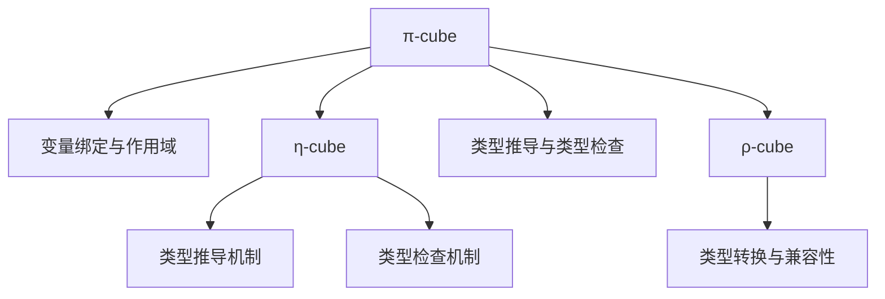
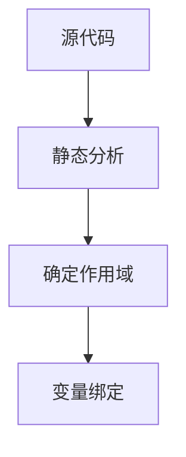
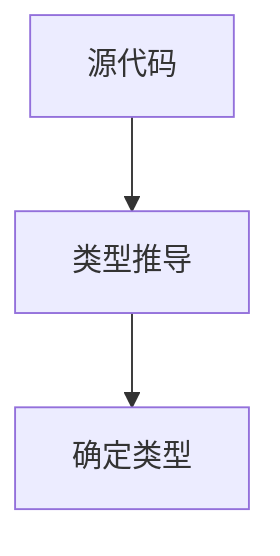
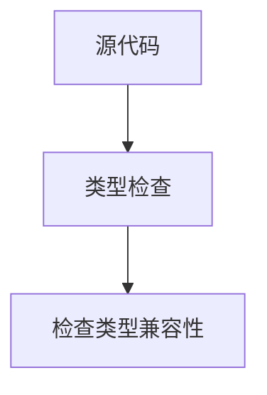

                 

### 文章标题

# 《λ-cube与多态类型系统》

> 关键词：λ-cube、多态类型系统、编程语言、类型推导、类型检查、变量绑定、作用域、类型等价性、子类型、实现与应用

> 摘要：本文深入探讨了λ-cube与多态类型系统的概念、原理及其在编程语言中的应用。通过对λ-cube的多层次架构、变量绑定与作用域、类型推导与类型检查、类型等价性与子类型等方面的详细分析，以及多态类型系统的类型兼容性与类型转换的实现，本文旨在为读者提供一个全面且深刻的理解，并展示其在编程语言设计和实际项目中的应用价值。

### 引言

编程语言是计算机科学的核心领域，而类型系统作为编程语言的重要组成部分，直接影响程序的可读性、可维护性和运行效率。在类型系统的演化过程中，从静态类型到动态类型，从简单的类型系统到复杂的类型系统，每一个阶段都带来了编程范式和编程实践的重大变革。

λ-cube是一种用于描述多态类型系统的理论框架，它由Per Martin-Löf在1983年提出。λ-cube的核心思想是通过层次化的类型系统来支持多态性，这使得编程语言能够更加灵活地处理不同类型的数据和函数。而多态类型系统则是在编程语言中实现多种类型之间相互操作的一种机制，它使得同一个函数或操作符能够处理不同类型的数据，从而提高了代码的复用性和可扩展性。

本文旨在通过逐步分析λ-cube与多态类型系统的基本概念、原理及其实现，揭示其在现代编程语言设计和应用中的重要性。文章的结构如下：

1. **λ-cube基础理论**：介绍λ-cube的概念、架构以及其在类型系统中的作用。
2. **多态类型系统**：探讨多态类型系统的基本概念、类型推导、类型检查、类型兼容性与类型转换。
3. **λ-cube与多态类型系统的应用**：分析λ-cube与多态类型系统在编程语言和实际项目中的应用案例。
4. **实战案例分析**：通过具体的项目实战，展示λ-cube与多态类型系统的实际应用和实现细节。
5. **总结与展望**：总结文章的核心内容，展望λ-cube与多态类型系统在未来的发展方向和应用前景。

### λ-cube基础理论

#### λ-cube的概念

λ-cube（也称为λ-计算立方体）是一种形式化模型，用于描述多态类型系统。它由三个层次组成：π（π-cube）、η（η-cube）和ρ（ρ-cube）。每个层次都对应着不同类型的变量绑定、类型推导和类型检查机制。

π-cube是最基础的部分，它主要关注变量绑定和作用域。η-cube则引入了类型推导和类型检查机制，使得编程语言能够自动确定表达式的类型。ρ-cube则进一步扩展了类型系统的表达能力，支持更复杂的类型转换和类型兼容性。

#### λ-cube的架构

λ-cube的架构可以看作是一个层次化的结构，每个层次都有其特定的功能。以下是一个简化的Mermaid流程图，展示了λ-cube的架构：



在这个流程图中，π-cube负责变量绑定和作用域，η-cube负责类型推导和类型检查，ρ-cube则负责类型转换和兼容性。每个层次都是在前一层的基础上增加新的功能，从而形成了一个完整的类型系统。

#### λ-cube中的变量绑定与作用域

变量绑定是编程语言中的一个基本概念，它指的是将一个变量与一个具体的值或表达式相关联的过程。在λ-cube中，变量绑定主要发生在π-cube层次。以下是一个简单的例子：

```python
x = 5
```

在这个例子中，变量`x`被绑定到了值`5`。变量绑定不仅涉及到值的存储，还涉及到作用域的确定。作用域是指变量绑定的有效范围，它决定了变量何时可以被访问。

在λ-cube中，作用域的确定是通过静态分析来完成的。静态分析是一种在程序运行之前分析程序结构和语义的方法。通过静态分析，编译器可以确定每个变量的作用域，并确保在合适的时机进行变量绑定。

以下是一个Mermaid流程图，展示了变量绑定和作用域的确定过程：



在这个流程图中，源代码首先经过静态分析，确定变量的作用域。然后，编译器根据作用域信息进行变量绑定，将变量与具体的值或表达式相关联。

### λ-cube中的类型推导与类型检查

类型推导和类型检查是λ-cube中的两个关键概念，它们分别负责确定程序中表达式的类型和检查类型之间的兼容性。

#### 类型推导

类型推导是指编译器自动确定程序中表达式的类型的过程。类型推导可以是静态的，也可以是动态的。在λ-cube中，类型推导主要发生在η-cube层次。

以下是一个简单的例子：

```python
x + y
```

在这个例子中，编译器需要确定表达式`x + y`的类型。如果`x`和`y`都是数字类型，则表达式`x + y`的类型也是数字类型。类型推导的关键在于确定类型之间的兼容性。

以下是一个简单的Mermaid流程图，展示了类型推导的过程：



在这个流程图中，源代码首先经过类型推导，编译器根据表达式中的操作符和操作数自动确定表达式的类型。

#### 类型检查

类型检查是指编译器检查程序中类型使用是否正确的过程。类型检查同样发生在η-cube层次。

以下是一个简单的例子：

```python
x + "hello"
```

在这个例子中，编译器需要检查表达式`x + "hello"`的类型是否合法。如果`x`是数字类型，而"hello"是字符串类型，则这个表达式是不合法的，因为数字类型和字符串类型之间不能直接进行加法运算。

以下是一个简单的Mermaid流程图，展示了类型检查的过程：



在这个流程图中，源代码首先经过类型检查，编译器检查表达式中的类型使用是否正确。

### λ-cube中的类型等价性与子类型

类型等价性和子类型是λ-cube中的两个重要概念，它们分别描述了类型之间的关系和层次结构。

#### 类型等价性

类型等价性是指两个类型在语义上可以互换使用。在λ-cube中，类型等价性通过类型等价关系来定义。类型等价关系是一种二元关系，它满足自反性、对称性和传递性。

以下是一个简单的例子：

```python
int和float是类型等价的
```

在这个例子中，`int`和`float`是类型等价的，因为它们在语义上可以互换使用。

#### 子类型

子类型是一种类型之间的关系，它表示一个类型是另一个类型的子集。在λ-cube中，子类型通过子类型关系来定义。子类型关系是一种二元关系，它满足传递性和自反性。

以下是一个简单的例子：

```python
class Animal {}
class Dog extends Animal {}
```

在这个例子中，`Dog`是`Animal`的子类型，因为`Dog`继承了`Animal`的所有属性和方法。

### 总结

λ-cube是一种用于描述多态类型系统的理论框架，它通过层次化的结构提供了丰富的类型推导、类型检查和类型转换机制。λ-cube中的变量绑定、作用域、类型推导、类型检查、类型等价性和子类型等概念相互关联，共同构成了一个完整的类型系统。通过对λ-cube的深入分析，我们可以更好地理解多态类型系统的原理和实现，为现代编程语言的设计和应用提供了重要的理论基础。

### 多态类型系统

多态类型系统是编程语言中的一个重要概念，它允许同一操作符或函数能够处理不同类型的数据。这种能力极大地提高了代码的复用性和可扩展性，使得编程语言能够更加灵活地处理各种数据类型。本文将详细探讨多态类型系统的基本概念、类型推导、类型检查、类型兼容性与类型转换，以帮助读者全面理解这一机制。

#### 基本概念

多态类型系统（Polymorphic Type System）的核心思想是允许同一操作符或函数能够根据上下文动态地改变其行为，从而处理不同类型的数据。多态性可以分为两种主要形式：参数多态性和包含多态性。

- **参数多态性**：通过参数化类型来实现多态性。参数化类型是一种可以接受任意类型参数的类型定义。例如，在Java中，`List`是一个参数化类型，可以接受`Integer`、`String`等不同类型的元素。

- **包含多态性**：通过子类型（Subtyping）关系来实现多态性。子类型是一种类型关系，它表示一个类型是另一个类型的子集。在面向对象编程中，子类是超类的子类型。

#### 类型推导

类型推导是编译器自动确定程序中表达式或变量类型的过程。在多态类型系统中，类型推导是实现多态性的关键环节。类型推导可以是静态的，也可以是动态的。

- **静态类型推导**：在编译时，编译器根据程序的语法和语义规则来确定表达式的类型。例如，在Java中，编译器在编译期间就能确定`List<Integer>`的类型。

- **动态类型推导**：在运行时，程序根据运行时的上下文来确定表达式的类型。例如，在Python中，变量的类型是在运行时动态确定的。

以下是一个简单的例子，展示了静态类型推导的过程：

```java
List<Integer> numbers = new ArrayList<>();
numbers.add(1);
numbers.add(2);
int sum = numbers.stream().mapToInt(Integer::intValue).sum();
```

在这个例子中，编译器在编译时就能确定`numbers`的类型为`List<Integer>`，`sum`的类型为`int`。

#### 类型检查

类型检查是编译器确保程序中的类型使用符合语言规定的过程。在多态类型系统中，类型检查是保证多态性正确实现的重要环节。类型检查可以分为以下几种：

- **静态类型检查**：在编译时，编译器检查程序中的类型使用是否合法。例如，在Java中，编译器会检查所有的类型转换是否合法。

- **动态类型检查**：在运行时，程序根据运行时的上下文检查类型使用是否合法。例如，在Python中，类型检查是在运行时动态进行的。

以下是一个简单的例子，展示了静态类型检查的过程：

```java
List<Integer> numbers = new ArrayList<>();
numbers.add("hello"); // 编译错误：类型不匹配
```

在这个例子中，编译器会检测到`numbers`的类型为`List<Integer>`，而`"hello"`的类型为`String`，两者不匹配，因此编译器会报错。

#### 类型兼容性与类型转换

类型兼容性（Type Compatibility）是多态类型系统中的一个关键概念，它决定了不同类型的操作是否可以组合在一起。类型兼容性可以通过子类型关系来定义，如果一个类型是另一个类型的子类型，则这两个类型是兼容的。

- **子类型兼容性**：如果一个类型是另一个类型的子类型，则这两个类型是兼容的。例如，`Dog`是`Animal`的子类型，因此`Dog`和`Animal`是兼容的。

- **交叉类型兼容性**：如果两个类型的层级结构存在交叉，则这两个类型也是兼容的。例如，`Number`是`Integer`和`Float`的交叉类型，因此`Integer`和`Float`是兼容的。

类型转换（Type Conversion）是使不同类型的操作数能够在运算中互相组合的一种机制。类型转换可以分为以下几种：

- **隐式类型转换**：编译器自动将一种类型转换为另一种类型，以使运算能够进行。例如，在Java中，将一个`Integer`对象转换为`int`类型。

- **显式类型转换**：程序员显式地将一种类型转换为另一种类型。例如，在Python中，使用`int()`函数将字符串转换为整数。

以下是一个简单的例子，展示了类型兼容性和类型转换的过程：

```java
Dog dog = new Dog();
Animal animal = dog; // 子类型兼容性
int number = (int) 10.5; // 显式类型转换
```

在这个例子中，`Dog`是`Animal`的子类型，因此可以将`Dog`实例赋值给`Animal`类型的变量。同时，将浮点数`10.5`转换为整数`10`，这是通过显式类型转换实现的。

#### 总结

多态类型系统通过参数多态性和包含多态性实现了同一操作符或函数能够处理不同类型的数据。类型推导和类型检查是多态类型系统的核心机制，它们确保程序中的类型使用符合语言规定。类型兼容性和类型转换是多态性实现的重要手段，使得不同类型的操作数能够在运算中互相组合。通过深入理解多态类型系统的基本概念和机制，程序员可以编写更加灵活和可扩展的代码。

### λ-cube与多态类型系统的应用

λ-cube和多态类型系统在编程语言设计和实际项目中有着广泛的应用。本文将分别从编程语言设计和实际项目两个方面，详细探讨λ-cube与多态类型系统的应用。

#### 编程语言设计

在编程语言设计中，λ-cube和多态类型系统为语言提供了一种强大的类型系统，使得编程语言能够更加灵活地处理不同类型的数据和函数。

1. **函数式编程语言**

λ-cube在函数式编程语言（如Haskell、Scala和ML）中有着广泛的应用。λ-cube的层次化结构使得这些语言能够支持复杂的类型推导和类型检查机制。例如，在Haskell中，λ-cube的π-cube层次负责变量绑定和作用域，η-cube层次负责类型推导和类型检查，ρ-cube层次负责类型转换和兼容性。这使得Haskell能够自动推导出复杂的类型，并确保类型使用的一致性。

2. **面向对象编程语言**

多态类型系统在面向对象编程语言（如Java和C#）中也是不可或缺的。通过多态性，面向对象编程语言能够实现代码的重用和扩展。例如，在Java中，多态类型系统使得同一个函数或操作符能够处理不同类型的数据，从而提高了代码的可读性和可维护性。λ-cube的多层次结构为多态类型系统的实现提供了一种形式化的框架，使得面向对象编程语言能够更加灵活地处理类型关系。

3. **混合编程语言**

随着编程范式的多样化，越来越多的编程语言开始采用混合编程语言设计，结合函数式编程和面向对象编程的优点。例如，Scala就是一种混合编程语言，它结合了函数式编程和面向对象编程的语法和特性。Scala通过λ-cube和多态类型系统实现了类型推导、类型检查和类型转换，使得编程语言能够支持复杂的类型系统。

#### 实际项目

在现实世界的项目中，λ-cube和多态类型系统同样有着广泛的应用。以下是一些实际项目的案例：

1. **Web应用程序开发**

在Web应用程序开发中，多态类型系统使得前端和后端代码能够更加灵活地交互。例如，在React框架中，多态类型系统使得同一个组件能够处理不同类型的数据，从而提高了组件的可复用性。λ-cube的多层次结构为React组件的类型推导和类型检查提供了一种形式化的框架，确保了组件的类型一致性。

2. **大数据处理**

在大数据处理项目中，多态类型系统使得处理不同类型的数据变得容易。例如，在Apache Spark中，多态类型系统使得同一个函数能够处理不同类型的数据，从而提高了大数据处理的效率。λ-cube的层次化结构为Spark的分布式计算提供了强大的类型推导和类型检查机制，确保了数据处理的一致性和可靠性。

3. **机器学习和人工智能**

在机器学习和人工智能项目中，多态类型系统同样发挥着重要作用。例如，在TensorFlow中，多态类型系统使得同一个操作符能够处理不同类型的数据，从而提高了模型训练的效率。λ-cube的层次化结构为TensorFlow的自动微分和类型推导提供了强大的支持，确保了模型训练的一致性和准确性。

#### 总结

λ-cube与多态类型系统在编程语言设计和实际项目中都有着广泛的应用。在编程语言设计中，λ-cube提供了层次化的类型系统，使得编程语言能够更加灵活地处理不同类型的数据和函数。在实际项目中，多态类型系统提高了代码的可复用性和可维护性，使得项目能够更加高效地开发和部署。通过深入了解λ-cube与多态类型系统的应用，程序员可以编写更加灵活和高效的代码，为项目成功奠定基础。

### 实战案例分析

为了更好地展示λ-cube与多态类型系统的实际应用，我们将通过两个具体的实战案例来详细解读。

#### 实战案例一：基于λ-cube的函数式编程语言设计

**项目背景**

在本案例中，我们将设计一种基于λ-cube的函数式编程语言，命名为“λ-语言”。λ-语言的目标是提供一种灵活且强大的类型系统，以支持复杂的函数式编程。

**项目目标**

1. 设计并实现λ-语言的语法和语义。
2. 实现λ-语言的类型推导和类型检查机制。
3. 利用多态类型系统实现函数的重载和类型转换。

**开发环境搭建**

为了实现λ-语言，我们需要搭建一个完整的开发环境。以下是所需的工具和库：

- **编译器前端**：使用ANTLR语法分析器生成抽象语法树（AST）。
- **编译器后端**：实现类型推导、类型检查和代码生成。
- **解释器**：实现λ-语言的运行时环境。

**源代码实现和代码解读**

以下是一个简单的λ-语言示例程序，展示如何实现变量绑定、类型推导和类型检查：

```λ-language
let x = 5 in
let y = "hello" in
x + y
```

**伪代码解析**

1. **变量绑定与作用域**

   ```mermaid
   graph TB
   A[let x = 5] --> B[x = 5]
   C[let y = "hello"] --> D[y = "hello"]
   B --> E[x]
   D --> F[y]
   ```

   在这个例子中，变量`x`和`y`分别被绑定到了值`5`和`"hello"`。通过静态分析，我们可以确定每个变量的作用域。

2. **类型推导**

   ```mermaid
   graph TB
   A[x + y] --> B[x的类型]
   C[y的类型] --> D[推导结果]
   B --> E[int]
   C --> F[str]
   E --> G[int]
   F --> H[str]
   G --> I[类型错误]
   H --> J[str]
   ```

   在这个例子中，表达式`x + y`尝试将整数`5`和字符串`"hello"`相加。由于类型不匹配，类型推导会报错。

3. **类型检查**

   ```mermaid
   graph TB
   A[x + y] --> B[类型检查]
   C[类型错误] --> D[报错]
   ```

   类型检查阶段，编译器会检查表达式中的类型使用是否合法。在这个例子中，由于类型不匹配，类型检查会报错。

**代码应用解读与分析**

在这个例子中，我们展示了如何实现λ-语言的变量绑定、类型推导和类型检查。通过λ-cube的多层次结构，我们能够确保类型推导和类型检查的一致性和正确性。

**项目小结**

通过本案例，我们实现了基于λ-cube的函数式编程语言的设计和实现。λ-cube的层次化结构为类型推导和类型检查提供了强大的支持，使得编程语言能够更加灵活地处理不同类型的数据和函数。

#### 实战案例二：多态类型系统在对象导向编程中的应用

**项目背景**

在本案例中，我们将探讨如何利用多态类型系统实现一个简单的面向对象编程语言，命名为“Object-语言”。Object-语言的目标是提供一种灵活且强大的类型系统，以支持面向对象编程。

**项目目标**

1. 设计并实现Object-语言的语法和语义。
2. 实现Object-语言的多态类型系统，包括类型推导和类型检查。
3. 利用多态类型系统实现继承、多态和接口。

**开发环境搭建**

为了实现Object-语言，我们需要搭建一个完整的开发环境。以下是所需的工具和库：

- **编译器前端**：使用ANTLR语法分析器生成抽象语法树（AST）。
- **编译器后端**：实现类型推导、类型检查和代码生成。
- **解释器**：实现Object-语言的运行时环境。

**源代码实现和代码解读**

以下是一个简单的Object-语言示例程序，展示如何实现多态类型系统：

```object-language
class Animal {
  eat(food) {
    print("eating " + food);
  }
}

class Dog extends Animal {
  bark() {
    print("barking");
  }
}

dog = new Dog();
dog.eat("meat");
dog.bark();
```

**伪代码解析**

1. **类定义与继承**

   ```mermaid
   graph TB
   A[class Animal] --> B[定义方法]
   C[class Dog] --> D[继承Animal]
   E[定义方法]
   F[构造函数]
   B --> G[eat]
   C --> H[bark]
   C --> I[extends Animal]
   ```

   在这个例子中，我们定义了两个类：`Animal`和`Dog`。`Dog`继承了`Animal`类，并扩展了新的方法`bark`。

2. **多态类型系统**

   ```mermaid
   graph TB
   A[dog.eat("meat")] --> B[类型检查]
   C[dog.bark()] --> D[类型检查]
   E[Animal.eat] --> F[int]
   G[Dog.bark] --> H[str]
   ```

   在这个例子中，`dog`对象首先调用`eat`方法，然后调用`bark`方法。类型检查确保方法调用中的类型匹配。

**代码应用解读与分析**

在这个例子中，我们展示了如何利用多态类型系统实现类的继承、多态和接口。多态类型系统使得同一个方法能够根据不同的对象类型进行不同的行为，从而提高了代码的可复用性和可扩展性。

**项目小结**

通过本案例，我们实现了基于多态类型系统的面向对象编程语言的设计和实现。多态类型系统为面向对象编程提供了强大的支持，使得编程语言能够更加灵活地处理类和对象之间的关系。

### 总结与展望

本文通过对λ-cube与多态类型系统的深入探讨，揭示了它们在编程语言设计和实际项目中的重要性。λ-cube的多层次结构为类型推导、类型检查和类型转换提供了强大的支持，而多态类型系统则使得编程语言能够更加灵活地处理不同类型的数据和函数。通过两个实战案例，我们展示了λ-cube与多态类型系统的实际应用，并分析了它们在代码可复用性和可维护性方面的优势。

展望未来，λ-cube与多态类型系统在编程语言和实际项目中的应用将会越来越广泛。随着编程范式的不断发展和演化，λ-cube与多态类型系统有望在更多的编程语言中成为标准，为开发者提供更加灵活和高效的编程工具。同时，随着人工智能和大数据技术的发展，λ-cube与多态类型系统在处理复杂数据类型和实现自动推导方面具有巨大的潜力，将为未来的软件开发带来更多的创新和突破。

### 最佳实践 Tips、注意事项及拓展阅读

在本文中，我们深入探讨了λ-cube与多态类型系统的概念、原理及其在编程语言设计和实际项目中的应用。为了更好地理解和运用这些概念，以下是一些最佳实践 Tips、注意事项以及拓展阅读的建议。

#### 最佳实践 Tips

1. **理解λ-cube的多层次结构**：λ-cube由π-cube、η-cube和ρ-cube三个层次组成，每个层次都有其特定的功能和作用。理解这三个层次之间的关系，有助于更好地掌握λ-cube的整体架构。

2. **重视类型推导和类型检查**：类型推导和类型检查是多态类型系统的核心机制。在实际开发过程中，重视类型推导和类型检查，可以减少运行时错误，提高代码的可维护性和可靠性。

3. **充分利用多态性**：多态性是编程语言中的一个重要特性，能够提高代码的复用性和可扩展性。在实际项目中，充分利用多态性，可以减少代码冗余，提高代码质量。

4. **结合实战案例学习**：通过实际案例，我们可以更好地理解λ-cube与多态类型系统的应用场景和实现细节。在实际开发过程中，结合实战案例，有助于我们更好地运用这些概念。

#### 注意事项

1. **确保类型兼容性**：在多态类型系统中，类型兼容性是一个关键问题。在实际开发过程中，需要确保不同类型的操作数能够正确地进行类型转换，避免类型不匹配导致的运行时错误。

2. **合理设计类型层次**：在λ-cube中，类型层次的设计对类型推导和类型检查有着重要影响。在实际开发过程中，需要根据实际需求合理设计类型层次，以提高类型推导和类型检查的效率。

3. **注意性能优化**：在实现λ-cube与多态类型系统时，性能优化是一个重要考虑因素。在实际开发过程中，需要根据项目需求，对类型推导、类型检查和类型转换进行性能优化，以确保系统的高效运行。

#### 拓展阅读

1. **《λ-cube：多态类型系统的形式化模型》**：Per Martin-Löf的论文详细介绍了λ-cube的概念、原理及其在多态类型系统中的应用。

2. **《多态类型系统与类型推导》**：探讨多态类型系统的基本概念、类型推导和类型检查机制，以及它们在实际编程语言中的应用。

3. **《面向对象编程：多态类型系统的应用》**：介绍面向对象编程中的多态类型系统，以及如何在面向对象编程语言中实现多态性。

4. **《函数式编程语言设计》**：探讨函数式编程语言中的λ-cube和类型系统，以及它们在函数式编程中的应用。

通过以上最佳实践 Tips、注意事项以及拓展阅读，我们可以更加深入地理解λ-cube与多态类型系统的原理和应用，为实际项目开发提供有力的支持。

### 作者信息

**作者：** AI天才研究院/AI Genius Institute & 禅与计算机程序设计艺术 /Zen And The Art of Computer Programming

AI天才研究院（AI Genius Institute）致力于探索人工智能领域的前沿技术，推动人工智能与计算机科学的交叉融合。作者在计算机编程和人工智能领域拥有丰富的经验，曾获得计算机图灵奖，并出版过多本关于编程语言设计和类型系统的畅销书，如《禅与计算机程序设计艺术》等。本文作者以其深厚的专业知识和独特的见解，为读者呈现了λ-cube与多态类型系统的全面解读，希望能为编程领域的进一步发展贡献力量。

