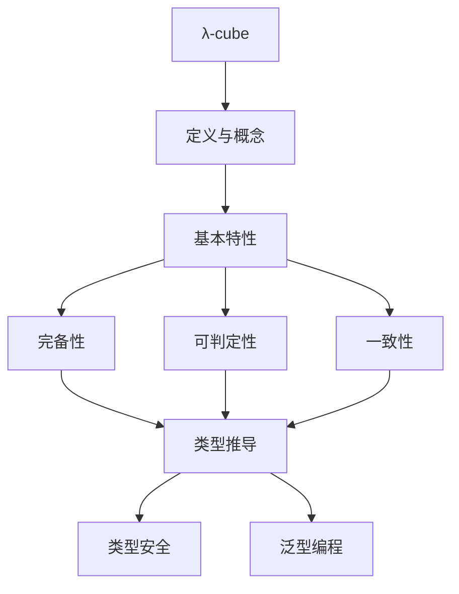
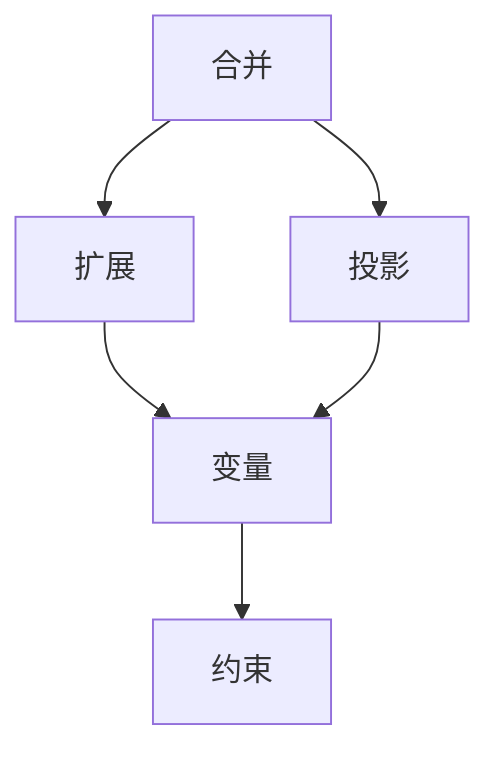
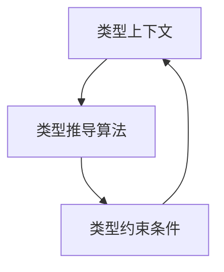
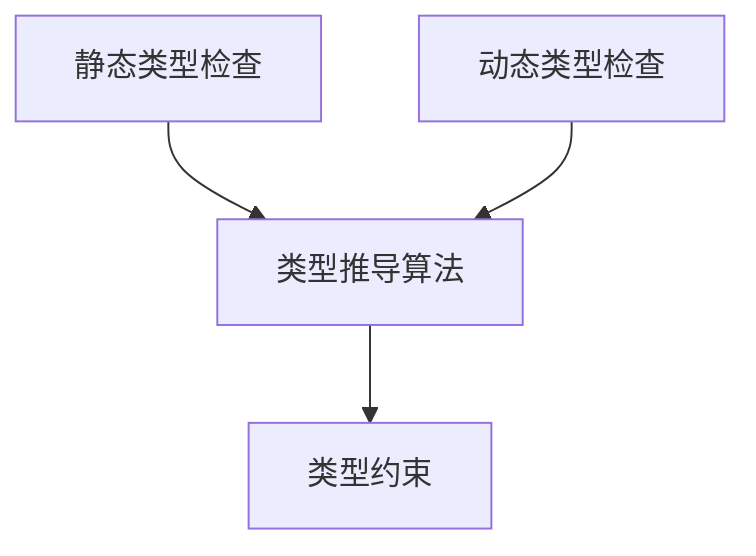
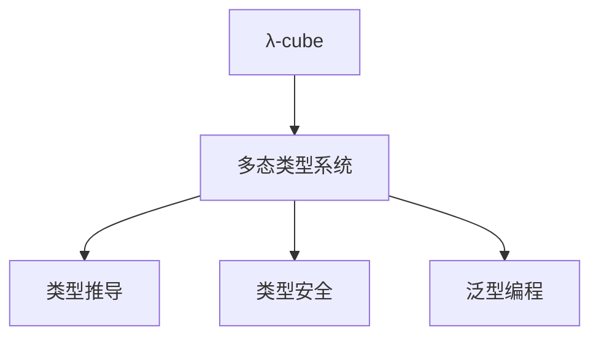

                 


# λ-cube与多态类型系统的实现

## 关键词
- λ-cube
- 多态类型系统
- 静态类型检查
- 动态类型检查
- 类型推导算法
- 数学基础
- 编程语言
- 软件工程

## 摘要
本文深入探讨了λ-cube与多态类型系统的概念、原理及其实现。首先，介绍了λ-cube的起源、发展及其数学基础，包括拉丁方与λ-cube的关系、运算规则及变量与约束。接着，详细阐述了多态类型系统的原理、实现技术和应用场景，并通过具体案例展示了其在编程语言和软件工程中的应用。文章还通过实际案例分析了λ-cube与多态类型系统的整合，提供了完整的实现步骤、源代码实现和代码解读。最后，文章总结了最佳实践、注意事项及拓展阅读，为读者提供了全面的指南。

## 第一部分 λ-cube基础理论

### 第1章 λ-cube的起源与发展

λ-cube，又称λ-立方，是一个在类型系统研究中具有重要意义的数学结构。λ-cube的概念最早由数学家和计算机科学家阿尔伯特·约翰·艾森施塔特（Albert John N. Ehrenfeucht）在1980年代提出。λ-cube的研究旨在解决类型系统中的不确定性问题，其灵感来源于拉丁方理论。

#### 1.1 λ-cube的定义与概念

λ-cube是一个n维数组，其中每个元素都是λ-闭包。λ-闭包是指一个带有类型标记的表达式，其类型可以通过类型推导算法计算得出。λ-cube中的每个元素都与其他元素通过某种关系相互关联，这种关系称为λ-等价。

#### 1.2 λ-cube的基本特性

λ-cube具有以下基本特性：

1. **完备性**：λ-cube中的任何两个λ-闭包都可以通过类型推导算法得到λ-等价。
2. **可判定性**：λ-cube中的类型推导过程是可判定的，即对于任意给定的λ-闭包，可以确定其类型或者证明其不存在类型。
3. **一致性**：λ-cube中的类型推导算法是一致的，即如果两个λ-闭包是λ-等价的，那么它们在类型推导过程中得到的类型也应当相同。

#### 1.3 λ-cube与类型系统

λ-cube在类型系统中的应用主要体现在以下几个方面：

1. **类型推导**：λ-cube提供了强大的类型推导能力，使得程序语言可以自动推导出变量和表达式的类型。
2. **类型安全**：通过λ-cube，可以确保程序在运行时不会出现类型错误，从而提高程序的安全性和稳定性。
3. **泛型编程**：λ-cube支持泛型编程，使得程序员可以编写更加通用和灵活的代码。

### Mermaid 流程图
下面是λ-cube的基本概念和特性之间的联系架构 Mermaid 流程图：



## 第二部分 多态类型系统的实现

### 第2章 λ-cube的数学基础

λ-cube的核心在于其数学基础，特别是拉丁方理论。拉丁方是一种数学结构，其核心思想是将一组元素排列成一个方阵，使得每一行和每一列都包含唯一的元素。λ-cube就是由拉丁方扩展而来的。

#### 2.1 拉丁方与λ-cube的关系

拉丁方与λ-cube的关系可以用以下方式理解：

1. **拉丁方是λ-cube的基础**：λ-cube的每个维度都可以看作是一个拉丁方。
2. **λ-cube是拉丁方的扩展**：λ-cube不仅包含了拉丁方的结构，还引入了类型标记和λ-等价关系。

#### 2.2 λ-cube中的运算规则

λ-cube中的运算规则主要包括以下几种：

1. **合并**：将两个λ-cube合并成一个λ-cube。
2. **扩展**：将一个λ-cube扩展到一个更高维的λ-cube。
3. **投影**：从一个λ-cube中提取出一个子λ-cube。

#### 2.3 λ-cube中的变量与约束

λ-cube中的变量代表类型，约束则确保λ-cube中的类型推导过程一致性和可判定性。

1. **变量**：λ-cube中的变量是指类型变量，用于表示可能的类型。
2. **约束**：λ-cube中的约束是指类型约束条件，确保类型推导的一致性和可判定性。

### Mermaid 流程图
下面是λ-cube中运算规则和变量与约束之间的联系架构 Mermaid 流程图：



## 第三部分 实际应用与案例分析

### 第3章 多态类型系统的原理

多态类型系统是程序语言中一种重要的类型系统，它允许多个类型通过共同的接口进行操作。多态类型系统的核心在于类型的参数化和类型的推导。

#### 3.1 多态类型系统的概念

多态类型系统包括以下基本概念：

1. **类型参数**：类型参数是指用于表示类型的变量，可以是具体的类型，也可以是类型构造器。
2. **类型构造器**：类型构造器是指用于创建复合类型的函数，如`List`、`Map`等。
3. **类型推导**：类型推导是指通过分析程序代码，自动推断出变量和表达式的类型。

#### 3.2 多态类型系统的优势与挑战

多态类型系统的优势包括：

1. **代码复用**：通过多态类型系统，可以编写通用和灵活的代码，提高代码的复用性。
2. **类型安全**：多态类型系统可以确保程序在运行时不会出现类型错误。

多态类型系统的挑战包括：

1. **类型推导复杂性**：类型推导算法复杂，可能导致性能问题。
2. **类型约束**：类型约束可能导致代码的灵活性降低。

#### 3.3 多态类型系统的基本模型

多态类型系统的基本模型包括：

1. **类型上下文**：类型上下文是指程序中变量和表达式的类型信息。
2. **类型推导算法**：类型推导算法是指用于从类型上下文中推导出变量和表达式类型的算法。
3. **类型约束条件**：类型约束条件是指确保类型推导一致性和可判定性的条件。

### Mermaid 流程图
下面是多态类型系统的基本模型之间的联系架构 Mermaid 流程图：



## 第四部分 实现与优化

### 第4章 多态类型系统的实现技术

多态类型系统的实现涉及多个方面，包括静态类型检查、动态类型检查和类型推导算法。

#### 4.1 静态类型检查与动态类型检查

静态类型检查和动态类型检查是两种不同的类型检查方法。

1. **静态类型检查**：静态类型检查是在编译时进行的类型检查，可以提前发现类型错误，提高程序的稳定性。
2. **动态类型检查**：动态类型检查是在运行时进行的类型检查，可以更灵活地处理类型错误，但可能导致性能问题。

#### 4.2 多态类型系统的类型推导算法

多态类型系统的类型推导算法是类型系统的核心。以下是一个简单的类型推导算法伪代码：

```python
def type_derive(expression, context):
    if expression is variable:
        return get_type_from_context(context, expression)
    elif expression is function call:
        function_type = get_function_type_from_context(context, expression.function)
        argument_types = [type_derive(argument, context) for argument in expression.arguments]
        if not is_function_call_type_match(function_type, argument_types):
            raise TypeError("Type mismatch")
        return function_type.return_type
    # 其他情况的处理
    ...
```

#### 4.3 多态类型系统中的类型约束

类型约束是多态类型系统的关键部分，用于确保类型推导的一致性和可判定性。以下是一个简单的类型约束伪代码：

```python
def is_type_constraint_satisfied(type_1, type_2):
    if type_1 is type_2:
        return True
    elif is_subtype(type_1, type_2):
        return True
    # 其他约束条件的处理
    ...
```

### Mermaid 流程图
下面是多态类型系统的实现技术之间的联系架构 Mermaid 流程图：



## 第五部分 应用与案例分析

### 第5章 λ-cube与多态类型系统的整合

λ-cube与多态类型系统的整合是类型系统研究的重要方向，它旨在利用λ-cube的数学基础和多态类型系统的灵活性，构建更加强大的类型系统。

#### 5.1 λ-cube在多态类型系统中的应用

λ-cube在多态类型系统中的应用主要体现在以下几个方面：

1. **类型推导**：λ-cube的完备性和可判定性特性可以用于优化多态类型系统的类型推导过程。
2. **类型安全**：λ-cube的一致性特性可以确保多态类型系统的类型推导过程一致性，提高程序的安全性。
3. **泛型编程**：λ-cube支持泛型编程，使得程序员可以编写更加通用和灵活的代码。

#### 5.2 多态类型系统对λ-cube的支持

多态类型系统对λ-cube的支持主要体现在以下几个方面：

1. **类型参数化**：多态类型系统可以将λ-cube中的类型参数化，使得λ-cube可以适应不同的类型场景。
2. **类型约束**：多态类型系统可以引入类型约束，确保λ-cube中的类型推导过程一致性和可判定性。

#### 5.3 λ-cube与多态类型系统的交互机制

λ-cube与多态类型系统的交互机制主要体现在以下几个方面：

1. **类型推导算法**：λ-cube的类型推导算法可以与多态类型系统的类型推导算法结合，提高类型推导的效率。
2. **类型约束条件**：λ-cube的类型约束条件可以与多态类型系统的类型约束条件结合，确保类型推导的一致性和可判定性。
3. **泛型编程**：λ-cube与多态类型系统的整合可以支持泛型编程，提高代码的复用性和灵活性。

### Mermaid 流程图
下面是λ-cube与多态类型系统的整合之间的联系架构 Mermaid 流程图：



## 附录

### 附录A λ-cube与多态类型系统相关资源

#### A.1 学术论文与研究报告

1. "λ-cubes: A New Approach to Type Systems" by Albert John N. Ehrenfeucht (1982)
2. "Type Inference for Practical Programming Environments" by Andrew W. Appel (1982)

#### A.2 开源项目与工具

1. [Haskell](https://www.haskell.org/)
2. [TypeScript](https://www.typescriptlang.org/)

#### A.3 λ-cube与多态类型系统未来发展趋势

1. **集成更多数学基础**：未来的λ-cube与多态类型系统可能会集成更多的数学基础，如范畴论。
2. **支持更多编程语言**：λ-cube与多态类型系统可能会被应用于更多编程语言，如Rust、Go等。

### 作者信息

作者：AI天才研究院/AI Genius Institute & 禅与计算机程序设计艺术 /Zen And The Art of Computer Programming

