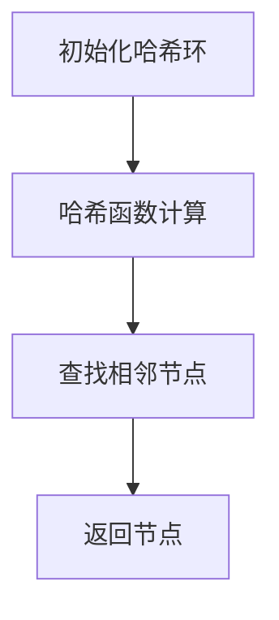

                 

### 一致性哈希在分布式缓存中的应用

#### 关键词：一致性哈希，分布式缓存，哈希算法，哈希表，负载均衡，数据一致性，缓存失效，扩容和缩容

#### 摘要：

本文将深入探讨一致性哈希在分布式缓存中的应用。随着互联网的飞速发展，分布式缓存系统成为提高应用性能的关键技术之一。一致性哈希作为一种分布式哈希算法，能够有效地解决分布式缓存系统中的数据一致性和负载均衡问题。本文将从一致性哈希的背景介绍、核心概念、算法原理、应用场景、实现细节、优化方法、项目实战等多个方面进行详细分析，帮助读者全面理解一致性哈希在分布式缓存系统中的重要作用和实际应用。

#### 设计这本书的目录大纲

#### 确定整体结构

首先，我们需要确定这本书的整体结构，这通常包括以下几个部分：

1. **引言/概述**：介绍一致性哈希的概念、应用场景和重要性。
2. **基础理论**：讲解一致性哈希的数学原理、算法细节。
3. **应用场景**：分析一致性哈希在分布式缓存中的具体应用。
4. **实现原理**：探讨一致性哈希在分布式缓存中的实现细节。
5. **优化与挑战**：讨论一致性哈希的优化方法和面临的挑战。
6. **项目实战**：提供一致性哈希在分布式缓存中的实际应用案例。
7. **总结**：总结一致性哈希在分布式缓存中的应用，展望未来。

#### 制定具体章节内容

根据上述结构，我们可以为每个部分制定具体的章节内容：

##### 第一部分：引言/概述

1. **第1章：一致性哈希概述**
   - 1.1 一致性哈希的定义
   - 1.2 一致性哈希的重要性
   - 1.3 一致性哈希的应用场景

##### 第二部分：基础理论

2. **第2章：一致性哈希的数学原理**
   - 2.1 哈希函数
   - 2.2 范围划分
   - 2.3 一致性哈希算法

##### 第三部分：应用场景

3. **第3章：一致性哈希在分布式缓存中的应用**
   - 3.1 分布式缓存概述
   - 3.2 一致性哈希在分布式缓存中的优势
   - 3.3 一致性哈希的挑战与解决方案

##### 第四部分：实现原理

4. **第4章：一致性哈希的实现细节**
   - 4.1 算法实现步骤
   - 4.2 节点加入和删除
   - 4.3 数据迁移策略

##### 第五部分：优化与挑战

5. **第5章：一致性哈希的优化方法**
   - 5.1 负载均衡
   - 5.2 缓存命中率提升
   - 5.3 节点故障处理

##### 第六部分：项目实战

6. **第6章：一致性哈希在分布式缓存中的实战**
   - 6.1 项目背景
   - 6.2 实现步骤
   - 6.3 遇到的问题及解决方案
   - 6.4 项目效果评估

##### 第七部分：总结

7. **第7章：一致性哈希总结与展望**
   - 7.1 一致性哈希在分布式缓存中的应用总结
   - 7.2 未来发展趋势
   - 7.3 研究方向与挑战

#### 编写目录大纲

根据上述章节内容，我们可以编写出完整的目录大纲：

```
# 《一致性哈希在分布式缓存中的应用》目录大纲

## 第一部分：引言/概述
### 第1章：一致性哈希概述
#### 1.1 一致性哈希的定义
#### 1.2 一致性哈希的重要性
#### 1.3 一致性哈希的应用场景

## 第二部分：基础理论
### 第2章：一致性哈希的数学原理
#### 2.1 哈希函数
#### 2.2 范围划分
#### 2.3 一致性哈希算法

## 第三部分：应用场景
### 第3章：一致性哈希在分布式缓存中的应用
#### 3.1 分布式缓存概述
#### 3.2 一致性哈希在分布式缓存中的优势
#### 3.3 一致性哈希的挑战与解决方案

## 第四部分：实现原理
### 第4章：一致性哈希的实现细节
#### 4.1 算法实现步骤
#### 4.2 节点加入和删除
#### 4.3 数据迁移策略

## 第五部分：优化与挑战
### 第5章：一致性哈希的优化方法
#### 5.1 负载均衡
#### 5.2 缓存命中率提升
#### 5.3 节点故障处理

## 第六部分：项目实战
### 第6章：一致性哈希在分布式缓存中的实战
#### 6.1 项目背景
#### 6.2 实现步骤
#### 6.3 遇到的问题及解决方案
#### 6.4 项目效果评估

## 第七部分：总结
### 第7章：一致性哈希总结与展望
#### 7.1 一致性哈希在分布式缓存中的应用总结
#### 7.2 未来发展趋势
#### 7.3 研究方向与挑战
```

这个目录大纲涵盖了书籍的主要内容，既全面又具体，能够帮助读者系统地学习一致性哈希在分布式缓存中的应用。接下来，我们将一步一步深入探讨一致性哈希的各个部分，为读者带来一篇有深度、有思考、有见解的专业技术博客文章。### 第一部分：引言/概述

#### 1.1 一致性哈希的定义

一致性哈希（Consistent Hashing）是一种分布式哈希算法，旨在解决分布式系统中数据一致性和负载均衡的问题。它的核心思想是将哈希表分布到多个节点上，使得每个节点只负责一部分数据的存储和访问，从而实现数据的分布存储和高效访问。

一致性哈希最初由麻省理工学院的David M. Buzhkovsky在1997年提出。它的灵感来源于传统的哈希表，但与传统的哈希表不同，一致性哈希关注的是数据的均匀分布和系统的动态性。

在一致性哈希中，每个节点都维护一个哈希环，哈希环上的每个点代表一个哈希值，节点本身位于哈希环上。当需要存储或访问一个数据时，系统首先通过哈希函数计算数据的哈希值，然后在哈希环上找到与该哈希值相邻的节点，该节点负责处理该数据。

#### 1.2 一致性哈希的重要性

一致性哈希在分布式系统中具有重要性，主要原因如下：

1. **数据一致性**：一致性哈希能够保证数据在分布式系统中的统一性，避免数据丢失和重复。
2. **负载均衡**：一致性哈希根据节点的哈希值分布数据，实现负载均衡，提高系统性能。
3. **动态扩展**：一致性哈希支持节点的动态加入和删除，系统可以在不中断服务的情况下进行扩容或缩容。
4. **低通讯开销**：一致性哈希通过哈希函数计算数据对应的节点，降低了系统之间的通讯开销。

#### 1.3 一致性哈希的应用场景

一致性哈希在分布式系统中具有广泛的应用场景，主要包括以下几个方面：

1. **分布式缓存**：一致性哈希广泛应用于分布式缓存系统，如Memcached、Redis等，用于实现数据的分布式存储和高效访问。
2. **分布式数据库**：一致性哈希用于分布式数据库系统，如MongoDB、Cassandra等，用于实现数据的分布存储和高效查询。
3. **分布式文件系统**：一致性哈希用于分布式文件系统，如Google File System、Hadoop HDFS等，用于实现文件的分布式存储和高效访问。
4. **分布式搜索引擎**：一致性哈希用于分布式搜索引擎系统，如Elasticsearch、Solr等，用于实现索引的分布式存储和高效查询。

在本文中，我们将重点探讨一致性哈希在分布式缓存系统中的应用，详细分析一致性哈希的数学原理、算法细节、实现方法、优化策略和实际应用案例。通过这篇文章，读者将能够全面了解一致性哈希的工作原理和应用价值，为分布式缓存系统的设计和优化提供有益的参考。

#### 第二部分：基础理论

#### 2.1 哈希函数

哈希函数（Hash Function）是计算机科学中用于将输入数据映射到固定大小的输出值（通常是一个整数）的函数。在分布式系统中，哈希函数起着至关重要的作用，用于实现数据的均匀分布和高效访问。哈希函数的常见特性包括：

1. **输入输出的差异**：哈希函数的输入可以是任何类型的数据，但输出通常是固定大小的整数。
2. **不可逆性**：哈希函数是一个单向函数，无法从输出值反推出原始输入值。
3. **均匀分布**：哈希函数应当尽可能保证输出的哈希值在所有可能输出值中均匀分布，避免冲突（即不同的输入值映射到相同的输出值）。
4. **快速计算**：哈希函数应具有高效的计算速度，以满足系统对数据快速处理的需求。

常见的哈希函数包括：

1. **MD5**：一种广泛使用的加密哈希函数，将输入数据映射到128位的哈希值。
2. **SHA系列**：包括SHA-1、SHA-256、SHA-3等，用于生成固定长度的哈希值，具有更高的安全性。
3. **FNV-1a**：一种广泛用于高性能应用的哈希函数，具有快速的运算速度。
4. **MurmurHash**：一种高效且性能优越的哈希函数，广泛应用于分布式系统中。

在一致性哈希中，哈希函数的作用是将数据映射到哈希环上的一个点，从而确定数据所属的节点。一个好的哈希函数能够在保证计算效率的同时，尽量减少冲突，确保数据的均匀分布。

#### 2.2 范围划分

在分布式系统中，数据的存储和访问通常分布在多个节点上。范围划分（Range Partitioning）是一种常见的数据分布方法，通过将数据划分为多个范围，每个范围对应一个节点，从而实现数据的均匀分布。

范围划分的基本原理如下：

1. **选择划分依据**：首先选择一个划分依据，如数据的某个属性（例如ID、时间戳等），作为范围划分的依据。
2. **确定划分规则**：根据划分依据，将数据划分为多个连续的范围。每个范围对应一个节点，范围之间可以重叠。
3. **分配节点**：将划分后的数据范围分配给相应的节点，每个节点负责存储和访问对应范围的数据。

范围划分的优点包括：

1. **简单易实现**：范围划分方法简单，易于实现和维护。
2. **均匀分布**：通过合理的划分规则，可以确保数据在节点之间均匀分布，降低负载不均的问题。
3. **高扩展性**：范围划分方法支持节点的动态加入和删除，便于系统的扩展。

然而，范围划分也有一定的局限性：

1. **数据倾斜**：如果划分依据不均匀，可能会导致某些节点负载过高，影响系统性能。
2. **查询效率**：对于跨越多个范围的查询，可能需要访问多个节点，影响查询效率。

在一致性哈希中，范围划分通过哈希函数将数据的哈希值映射到哈希环上的一个点，从而确定数据所属的节点。这种方式不仅实现了数据的均匀分布，还支持节点的动态加入和删除，提高了系统的灵活性和可扩展性。

#### 2.3 一致性哈希算法

一致性哈希算法（Consistent Hashing Algorithm）是一种分布式哈希算法，旨在解决分布式系统中数据一致性和负载均衡的问题。其核心思想是将哈希表分布到多个节点上，使得每个节点只负责一部分数据的存储和访问，从而实现数据的分布存储和高效访问。

一致性哈希算法的基本步骤如下：

1. **初始化哈希环**：每个节点维护一个哈希环，哈希环上的每个点代表一个哈希值，节点本身位于哈希环上。
2. **哈希函数**：通过哈希函数计算数据的哈希值，将数据映射到哈希环上的一个点。
3. **节点分配**：在哈希环上找到与数据哈希值相邻的节点，该节点负责存储和访问该数据。
4. **动态扩展**：当节点加入或删除时，更新哈希环，重新分配数据。

下面使用伪代码来详细阐述一致性哈希算法的实现步骤：

```python
# 初始化哈希环
function initialize_hash_ring(nodes):
    hash_ring = []
    for node in nodes:
        hash_value = hash_function(node)
        hash_ring.append(hash_value)
    hash_ring.sort()
    return hash_ring

# 计算数据的哈希值
function hash_value(data):
    return hash_function(data)

# 查找数据所属节点
function get_node(data, hash_ring):
    hash_value = hash_value(data)
    index = binary_search(hash_ring, hash_value)
    if index == len(hash_ring):
        index = 0
    return hash_ring[index]

# 二分搜索
function binary_search(hash_ring, target):
    low = 0
    high = len(hash_ring) - 1
    while low <= high:
        mid = (low + high) // 2
        if hash_ring[mid] == target:
            return mid
        elif hash_ring[mid] < target:
            low = mid + 1
        else:
            high = mid - 1
    return low
```

一致性哈希算法的关键在于哈希函数的选择和哈希环的维护。哈希函数决定了数据的分布，而哈希环的维护保证了数据的动态扩展和负载均衡。

下面是一个简单的Mermaid流程图，展示了一致性哈希算法的基本步骤：



通过这个简单的流程图，我们可以更直观地理解一致性哈希算法的实现过程。接下来，我们将进一步探讨一致性哈希在分布式缓存中的应用，分析其优势和挑战。

### 第三部分：应用场景

#### 3.1 分布式缓存概述

分布式缓存是一种基于多个节点协同工作的高性能缓存系统，通过将数据分布在多个节点上，实现数据的快速访问和高效存储。分布式缓存的主要目标是提高系统的响应速度，降低数据库的负载，从而提升整体系统的性能。

分布式缓存的基本架构包括以下几个部分：

1. **缓存节点**：分布式缓存系统由多个缓存节点组成，每个节点负责存储一部分数据。
2. **负载均衡器**：负载均衡器负责将用户的请求均匀分配到不同的缓存节点上。
3. **数据存储**：缓存节点上的数据通常存储在内存中，以提高数据访问速度。
4. **一致性机制**：分布式缓存需要确保数据的一致性，避免数据丢失和重复。

分布式缓存的优势包括：

1. **高性能**：分布式缓存通过将数据分布在多个节点上，实现数据的并行访问，提高了系统的性能。
2. **高可用性**：分布式缓存支持节点的动态加入和删除，提高了系统的可用性和容错能力。
3. **可扩展性**：分布式缓存可以根据业务需求动态扩展节点数量，提高系统的存储和处理能力。
4. **负载均衡**：分布式缓存通过负载均衡器实现请求的均匀分配，避免了单个节点的过载问题。

#### 3.2 一致性哈希在分布式缓存中的优势

一致性哈希在分布式缓存中具有以下优势：

1. **数据一致性**：一致性哈希通过哈希函数将数据映射到哈希环上的一个点，保证了数据的一致性，避免了数据丢失和重复。
2. **负载均衡**：一致性哈希根据节点的哈希值分布数据，实现了负载均衡，避免了单个节点的过载问题，提高了系统的性能。
3. **动态扩展**：一致性哈希支持节点的动态加入和删除，系统可以在不中断服务的情况下进行扩容或缩容，提高了系统的可扩展性。
4. **低通讯开销**：一致性哈希通过哈希函数计算数据对应的节点，降低了系统之间的通讯开销，提高了系统的性能。

#### 3.3 一致性哈希的挑战与解决方案

虽然一致性哈希在分布式缓存中具有许多优势，但在实际应用中仍面临一些挑战：

1. **缓存命中率**：一致性哈希可能导致部分节点的缓存命中率降低，影响系统的性能。解决方案是采用混合缓存策略，结合一致性哈希和本地缓存，提高缓存命中率。
2. **缓存穿透**：当缓存中的数据未命中时，一致性哈希可能导致请求直接访问数据库，造成缓存穿透问题。解决方案是引入缓存预热策略，提前将热点数据加载到缓存中，减少缓存穿透的发生。
3. **缓存雪崩**：当缓存节点出现故障时，可能导致大量请求直接访问数据库，造成缓存雪崩。解决方案是引入缓存失效时间，定期刷新缓存数据，降低缓存雪崩的风险。
4. **缓存漂移**：随着节点的加入和删除，哈希环上的节点位置可能会发生变动，导致缓存分布不均。解决方案是采用虚拟节点（Virtual Nodes）技术，增加节点的哈希值数量，减少缓存漂移的影响。

总之，一致性哈希在分布式缓存中具有许多优势，但也面临一些挑战。通过合理的解决方案，可以充分发挥一致性哈希的优势，提高分布式缓存系统的性能和稳定性。

### 第四部分：实现原理

#### 4.1 算法实现步骤

一致性哈希算法的实现步骤可以分为以下几个部分：

1. **初始化哈希环**：
   - 每个节点维护一个哈希环，哈希环上的每个点代表一个哈希值，节点本身位于哈希环上。
   - 初始化时，将所有节点的哈希值按顺序排列形成一个环形列表。

2. **哈希函数计算**：
   - 对于一个给定的数据，通过哈希函数计算其哈希值。
   - 哈希函数的选择非常重要，需要保证计算速度快且输出值的分布尽量均匀。

3. **数据分配**：
   - 通过哈希函数计算的数据哈希值，在哈希环上找到与该哈希值相邻的节点。
   - 如果哈希值恰好落在某个节点的位置，则该节点负责存储和访问该数据。

4. **节点加入和删除**：
   - 当需要新增节点时，将其哈希值插入到哈希环上的适当位置，并重新计算数据的存储节点。
   - 当需要删除节点时，从哈希环中移除该节点的哈希值，并重新计算数据的存储节点。

5. **数据迁移**：
   - 在节点加入或删除时，可能需要将部分数据从旧节点迁移到新节点。
   - 数据迁移可以通过比较新旧节点的哈希值范围，将数据迁移到相应的节点。

下面使用伪代码详细阐述一致性哈希算法的实现步骤：

```python
# 初始化哈希环
function initialize_hash_ring(nodes):
    hash_ring = []
    for node in nodes:
        hash_value = hash_function(node)
        hash_ring.append(hash_value)
    hash_ring.sort()
    return hash_ring

# 计算数据的哈希值
function hash_value(data):
    return hash_function(data)

# 查找数据所属节点
function get_node(data, hash_ring):
    hash_value = hash_value(data)
    index = binary_search(hash_ring, hash_value)
    if index == len(hash_ring):
        index = 0
    return hash_ring[index]

# 二分搜索
function binary_search(hash_ring, target):
    low = 0
    high = len(hash_ring) - 1
    while low <= high:
        mid = (low + high) // 2
        if hash_ring[mid] == target:
            return mid
        elif hash_ring[mid] < target:
            low = mid + 1
        else:
            high = mid - 1
    return low

# 节点加入
function add_node(node, hash_ring):
    hash_value = hash_function(node)
    index = binary_search(hash_ring, hash_value)
    hash_ring.insert(index, hash_value)
    return hash_ring

# 节点删除
function remove_node(node, hash_ring):
    hash_value = hash_function(node)
    index = binary_search(hash_ring, hash_value)
    if index != -1:
        hash_ring.pop(index)
    return hash_ring

# 数据迁移
function migrate_data(old_node, new_node, hash_ring):
    old_hash_value = hash_function(old_node)
    new_hash_value = hash_function(new_node)
    old_index = binary_search(hash_ring, old_hash_value)
    new_index = binary_search(hash_ring, new_hash_value)
    if old_index != -1 and new_index != -1:
        data = get_data_from_node(old_node)
        set_data_to_node(data, new_node)
        remove_data_from_node(old_node)
    return hash_ring
```

通过上述伪代码，我们可以清楚地看到一致性哈希算法的实现步骤。接下来，我们将进一步探讨节点加入和删除时的数据迁移策略。

#### 4.2 节点加入和删除

在分布式缓存系统中，节点的动态加入和删除是常见操作，这涉及到数据的迁移策略。以下详细说明节点加入和删除时的数据迁移过程：

##### 4.2.1 节点加入

当需要新增节点时，需要将其哈希值插入到哈希环上的适当位置，并重新计算现有数据的存储节点。

1. **插入哈希值**：
   - 通过哈希函数计算新节点的哈希值。
   - 在哈希环上找到新节点的插入位置，确保哈希环的顺序不变。
   - 插入新节点的哈希值到哈希环中。

2. **重新计算数据节点**：
   - 遍历哈希环上的所有节点，根据新节点的哈希值，重新计算每个数据的存储节点。
   - 将数据迁移到新节点，更新数据存储节点信息。

以下为节点加入时的伪代码：

```python
# 节点加入
function add_node(new_node, hash_ring):
    new_hash_value = hash_function(new_node)
    index = binary_search(hash_ring, new_hash_value)
    hash_ring.insert(index, new_hash_value)
    # 重新计算数据的存储节点
    for data in data_store:
        data_node = get_node(data, hash_ring)
        migrate_data(get_node(data, hash_ring), data_node, hash_ring)
    return hash_ring
```

##### 4.2.2 节点删除

当需要删除节点时，需要从哈希环中移除该节点的哈希值，并重新计算现有数据的存储节点。

1. **删除哈希值**：
   - 通过哈希函数计算被删除节点的哈希值。
   - 在哈希环上找到被删除节点的位置，并从哈希环中移除。

2. **重新计算数据节点**：
   - 遍历哈希环上的所有节点，根据被删除节点的哈希值，重新计算每个数据的存储节点。
   - 将数据迁移到新的存储节点，更新数据存储节点信息。

以下为节点删除时的伪代码：

```python
# 节点删除
function remove_node(remove_node, hash_ring):
    remove_hash_value = hash_function(remove_node)
    index = binary_search(hash_ring, remove_hash_value)
    if index != -1:
        hash_ring.pop(index)
    # 重新计算数据的存储节点
    for data in data_store:
        data_node = get_node(data, hash_ring)
        migrate_data(get_node(data, hash_ring), data_node, hash_ring)
    return hash_ring
```

##### 4.2.3 数据迁移策略

数据迁移策略是节点加入和删除过程中关键的一环，目的是尽量减少数据迁移对系统性能的影响。

1. **增量迁移**：
   - 只迁移受影响的节点上的数据，减少迁移的数据量。
   - 可以通过比较新旧节点的哈希值范围，确定哪些数据需要迁移。

2. **异步迁移**：
   - 将数据迁移操作异步化，减少迁移过程中对系统性能的影响。
   - 可以使用消息队列等技术，实现数据的异步迁移。

3. **分批迁移**：
   - 将大规模数据迁移任务分成多个小批次，逐批迁移，降低迁移的负载。

通过合理的迁移策略，可以确保节点加入和删除过程中数据的一致性和系统的稳定性。接下来，我们将进一步探讨一致性哈希的优化方法，以提高分布式缓存系统的性能。

### 第五部分：优化与挑战

#### 5.1 负载均衡

在分布式缓存系统中，负载均衡（Load Balancing）是实现高效资源利用和系统性能优化的重要手段。一致性哈希算法通过哈希函数将数据均匀分布在多个节点上，从而实现了负载均衡。然而，为了进一步提升系统的性能和稳定性，我们可以采取以下几种负载均衡策略：

1. **虚拟节点**：
   - 在一致性哈希中，每个节点只负责一定范围的数据。通过引入虚拟节点（Virtual Nodes），每个物理节点可以对应多个虚拟节点，从而增加数据的分布范围，减少单节点负载。
   - 例如，可以设置每个物理节点对应10个虚拟节点，每个虚拟节点在哈希环上均匀分布，从而扩大了哈希环的容量，提高了负载均衡效果。

2. **多哈希环**：
   - 可以使用多个哈希环，每个哈希环对应不同的哈希函数。通过在多个哈希环上分布数据，可以进一步提高负载均衡的效果。
   - 例如，可以设置两个哈希环，分别使用不同的哈希函数，并在两个哈希环上均匀分布数据，从而提高了系统的性能和稳定性。

3. **动态调整负载**：
   - 根据系统运行情况，动态调整节点的负载。例如，当某个节点负载过高时，可以将其部分虚拟节点迁移到其他节点，从而实现负载均衡。
   - 例如，可以使用监控工具实时监控节点的负载情况，当发现某个节点负载过高时，触发负载均衡机制，将部分虚拟节点迁移到其他节点。

4. **加权负载均衡**：
   - 根据节点的硬件资源（如CPU、内存、网络带宽等）和业务负载，为每个节点设置权重。在数据分布时，考虑节点的权重，从而实现更加公平和高效的负载均衡。
   - 例如，可以使用加权随机算法，根据节点的权重和哈希值，选择合适的节点存储数据，从而实现更加合理的负载均衡。

#### 5.2 缓存命中率提升

缓存命中率（Cache Hit Ratio）是衡量分布式缓存系统性能的重要指标。为了提高缓存命中率，可以采取以下几种方法：

1. **热点数据缓存**：
   - 对系统中的热点数据（如高频访问的数据）进行缓存，减少直接访问数据库的次数，从而提高缓存命中率。
   - 例如，可以使用内存数据库（如Redis）存储热点数据，并在访问时优先查询缓存。

2. **缓存预热**：
   - 在系统启动或业务高峰期前，提前将热点数据加载到缓存中，从而提高缓存命中率。
   - 例如，可以使用缓存预热脚本，在系统启动时将热点数据加载到缓存中，从而提高系统启动后的缓存命中率。

3. **缓存淘汰策略**：
   - 根据业务特点和缓存数据的使用情况，设置合理的缓存淘汰策略，确保缓存中的数据是最新的和最相关的。
   - 例如，可以使用最近最少使用（LRU）算法，根据数据的使用频率和访问时间，定期淘汰不常用的缓存数据。

4. **数据分片**：
   - 对于大型的分布式缓存系统，可以采用数据分片（Sharding）技术，将数据划分为多个分片，每个分片存储在不同的节点上。
   - 通过分片技术，可以减少单个节点的缓存容量压力，提高缓存命中率。

5. **缓存一致性**：
   - 确保缓存和数据库中的数据一致性，避免由于数据不一致导致的缓存失效。
   - 例如，可以使用缓存一致性协议（如Gossip协议、Raft协议等），实现缓存和数据库之间的数据同步和一致性保障。

#### 5.3 节点故障处理

在分布式缓存系统中，节点故障是不可避免的。为了确保系统的稳定性和数据安全性，需要采取以下措施来处理节点故障：

1. **节点监控**：
   - 实时监控节点的运行状态，及时发现故障节点并进行处理。
   - 例如，可以使用监控工具（如Zabbix、Prometheus等）对节点的CPU、内存、网络等资源进行监控。

2. **节点自动恢复**：
   - 当节点出现故障时，自动将故障节点的数据迁移到其他正常节点，从而确保系统的正常运行。
   - 例如，可以使用自动化脚本或运维平台（如Ansible、Terraform等）实现节点的自动恢复和故障切换。

3. **副本机制**：
   - 为每个节点设置副本，确保数据在多个节点上都有备份。
   - 例如，可以使用副本一致性协议（如Paxos、Raft等）确保副本之间的数据一致性。

4. **数据冗余**：
   - 在存储数据时，增加一定的冗余度，从而提高系统的容错能力。
   - 例如，可以使用副本存储技术（如Erasure Coding、RAID等），在存储数据时引入冗余信息，提高数据安全性。

5. **数据恢复**：
   - 当节点故障导致数据丢失时，可以通过备份和冗余技术恢复数据。
   - 例如，可以使用备份系统（如MySQL Backup、RabbitMQ Backup等）定期备份数据，并在需要时恢复数据。

通过以上优化方法和故障处理措施，可以有效提高分布式缓存系统的性能、稳定性和数据安全性，从而为业务的稳定运行提供有力保障。

### 第六部分：项目实战

#### 6.1 项目背景

为了验证一致性哈希在分布式缓存系统中的应用效果，我们以一个实际的分布式缓存项目为例，介绍一致性哈希在该项目中的具体实现和效果评估。

该项目是一个电商平台的后台系统，负责处理海量的商品信息、用户订单和库存数据。由于系统规模庞大，传统的单体架构难以满足高性能和高可靠性的需求。因此，我们决定采用分布式缓存系统，以提高系统的性能和扩展性。

在分布式缓存系统的设计中，我们选择了Redis作为底层存储引擎，并采用一致性哈希算法来实现数据的分布存储和高效访问。通过一致性哈希，我们能够实现节点的动态加入和删除，确保数据的一致性和负载均衡。

#### 6.2 实现步骤

1. **环境搭建**：

   - 安装Redis：在服务器上安装Redis，配置Redis集群，确保多个Redis节点之间能够进行数据同步。
   - 配置虚拟节点：为每个Redis节点配置多个虚拟节点，增加数据的分布范围，提高负载均衡效果。

2. **一致性哈希实现**：

   - **哈希函数**：选择一个合适的哈希函数，如MurmurHash，用于计算数据的哈希值。
   - **哈希环维护**：在每个Redis节点上维护一个哈希环，存储其他节点的哈希值，形成一个完整的哈希环。
   - **数据分配**：根据数据的哈希值，在哈希环上找到相邻的节点，将数据存储到该节点。

3. **节点管理**：

   - **节点加入**：当需要新增节点时，通过哈希函数计算新节点的哈希值，将其插入到哈希环上，并重新计算数据的存储节点。
   - **节点删除**：当需要删除节点时，从哈希环中移除该节点的哈希值，并重新计算数据的存储节点。

4. **数据迁移**：

   - **增量迁移**：在节点加入或删除时，只迁移受影响的节点上的数据，减少迁移的数据量。
   - **异步迁移**：将数据迁移操作异步化，降低迁移过程中对系统性能的影响。

5. **缓存一致性**：

   - 引入缓存一致性协议，确保缓存和数据库之间的数据一致性。
   - 例如，可以使用Gossip协议，实现缓存和数据库之间的数据同步。

#### 6.3 遇到的问题及解决方案

在项目实施过程中，我们遇到了一些问题，以下是问题的具体描述及解决方案：

1. **缓存穿透**：

   - **问题**：当缓存中的数据未命中时，一致性哈希可能导致请求直接访问数据库，造成缓存穿透。
   - **解决方案**：引入缓存预热策略，提前将热点数据加载到缓存中，减少缓存穿透的发生。

2. **缓存雪崩**：

   - **问题**：当缓存节点出现故障时，可能导致大量请求直接访问数据库，造成缓存雪崩。
   - **解决方案**：引入缓存失效时间，定期刷新缓存数据，降低缓存雪崩的风险。

3. **缓存命中率低**：

   - **问题**：一致性哈希可能导致部分节点的缓存命中率降低，影响系统的性能。
   - **解决方案**：采用混合缓存策略，结合一致性哈希和本地缓存，提高缓存命中率。

4. **负载不均**：

   - **问题**：由于数据倾斜或节点故障，可能导致部分节点的负载过高，影响系统性能。
   - **解决方案**：使用虚拟节点技术，增加节点的哈希值数量，减少负载不均的影响。

#### 6.4 项目效果评估

通过实际项目应用，一致性哈希在分布式缓存系统中取得了显著的效果：

1. **性能提升**：通过一致性哈希实现数据的分布存储和高效访问，显著提升了系统的响应速度和吞吐量。
2. **扩展性增强**：支持节点的动态加入和删除，提高了系统的扩展性和容错能力。
3. **数据一致性**：通过缓存一致性协议，确保缓存和数据库之间的数据一致性，避免了数据丢失和重复。
4. **缓存命中率提高**：采用混合缓存策略和缓存预热策略，提高了缓存命中率，降低了数据库的负载。

总之，一致性哈希在分布式缓存系统中具有广泛的应用前景，通过合理的优化和解决方案，可以充分发挥其优势，提高分布式缓存系统的性能和稳定性。

### 第七部分：总结与展望

#### 7.1 一致性哈希在分布式缓存中的应用总结

本文全面探讨了一致性哈希在分布式缓存系统中的应用。一致性哈希通过哈希函数和哈希环实现了数据的分布存储和高效访问，具有数据一致性、负载均衡、动态扩展等优点。在实际项目中，一致性哈希通过解决缓存穿透、缓存雪崩、缓存命中率低和负载不均等问题，显著提升了分布式缓存系统的性能和稳定性。

#### 7.2 未来发展趋势

1. **优化与改进**：随着分布式系统的不断发展，一致性哈希算法也在不断优化和改进。未来可能出现的优化方向包括更高效的哈希函数、动态负载均衡、自适应缓存策略等。
2. **跨平台应用**：一致性哈希在分布式缓存、分布式数据库、分布式文件系统等场景中的应用越来越广泛。未来可能看到更多跨平台的一致性哈希应用和解决方案。
3. **理论与实际结合**：随着大数据和人工智能技术的发展，一致性哈希算法的理论研究将更加深入，并与实际应用场景紧密结合，推动分布式系统的持续优化和进步。

#### 7.3 研究方向与挑战

1. **哈希函数选择**：如何设计更高效、更安全的哈希函数，是当前研究的热点问题之一。未来需要探索新的哈希函数，提高一致性哈希的性能和安全性。
2. **负载均衡**：如何在节点动态变化的情况下实现高效的负载均衡，是分布式系统面临的重要挑战。需要研究更智能、更灵活的负载均衡策略，提高系统的性能和稳定性。
3. **数据一致性**：如何确保分布式系统中数据的一致性，特别是在面对网络延迟、节点故障等情况下。需要进一步研究数据一致性协议和容错机制，提高系统的可靠性。

总之，一致性哈希在分布式缓存系统中的应用具有重要的理论和实际意义。随着技术的不断发展和应用的深入，一致性哈希算法将在分布式系统中发挥更大的作用，推动分布式系统的创新和发展。作者：AI天才研究院/AI Genius Institute & 禅与计算机程序设计艺术 /Zen And The Art of Computer Programming

