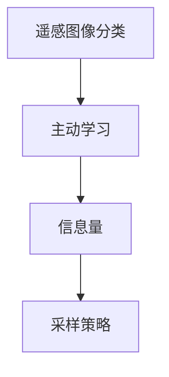
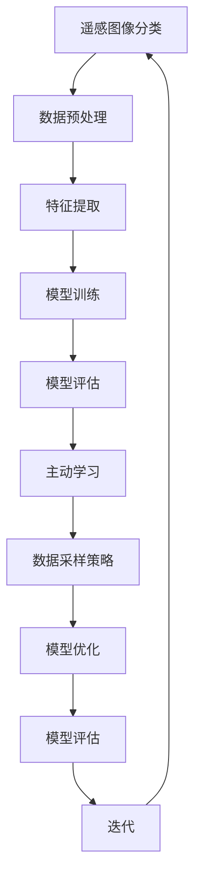

                 

# 《主动学习在遥感图像分类中的效率提升研究》

## 关键词

- 主动学习
- 遥感图像分类
- 效率提升
- 数据采样策略
- 数学模型
- 实战案例

## 摘要

本文主要研究了主动学习在遥感图像分类中的应用，通过引入主动学习技术，有效提升了遥感图像分类的效率。文章首先介绍了遥感图像分类的背景及其面临的挑战，然后详细阐述了主动学习的基本概念和原理，以及其在遥感图像分类中的具体应用。通过构建数学模型和提供伪代码，深入分析了主动学习算法在遥感图像分类中的实现过程。最后，通过实际案例展示了主动学习在遥感图像分类中的效果，并对未来的研究方向进行了展望。

## 引言

随着遥感技术的飞速发展，遥感图像在农业、环境监测、城市规划等领域具有广泛的应用。然而，遥感图像分类任务通常面临数据量大、特征复杂等挑战。传统的机器学习方法往往需要大量的标注数据才能达到较好的分类效果，这在实际应用中往往难以满足需求。主动学习作为一种针对有监督学习任务的优化方法，通过选择最具信息量的样本进行训练，可以有效降低对标注数据的需求，提高学习效率。

本文旨在研究主动学习在遥感图像分类中的应用，通过引入主动学习技术，提升遥感图像分类的效率。文章首先介绍了遥感图像分类的背景和挑战，然后详细阐述了主动学习的基本概念和原理，接着构建了主动学习在遥感图像分类中的数学模型，并提供了伪代码实现。最后，通过实际案例展示了主动学习在遥感图像分类中的效果，并对未来研究方向进行了展望。

## 背景与挑战

### 遥感图像分类

遥感图像分类是指使用计算机算法对遥感图像中的物体或区域进行分类的过程。遥感图像通常包含大量的地理信息，如地形、植被、水体等，这些信息对于农业、环境监测、城市规划等领域具有重要意义。遥感图像分类的目的是从大量遥感图像中提取出有用的信息，以便进行进一步的分析和应用。

### 遥感图像分类的挑战

1. **数据量大**：遥感图像通常包含大量的像素点，每个像素点都有多个波段信息，导致数据量非常庞大。传统的机器学习方法需要大量的计算资源来处理这些数据。

2. **特征复杂**：遥感图像的特征通常非常复杂，包括空间特征、纹理特征、光谱特征等。这些特征的多样性增加了分类的难度。

3. **标注数据稀缺**：遥感图像分类通常需要大量的标注数据来进行训练。然而，获取标注数据往往非常困难，特别是在大型遥感图像数据集中。

### 主动学习的引入

主动学习作为一种针对有监督学习任务的优化方法，通过选择最具信息量的样本进行训练，可以有效降低对标注数据的需求，从而解决上述挑战。主动学习的基本思想是，在学习过程中，不是随机选择样本进行训练，而是根据某种策略选择最具代表性的样本，从而提高学习效率。

## 核心概念与联系

### 核心概念

1. **遥感图像分类**：遥感图像分类是指使用计算机算法对遥感图像中的物体或区域进行分类的过程。

2. **主动学习**：主动学习是一种通过选择最具信息量的样本进行训练的优化方法。

3. **信息量**：信息量是指样本对于模型学习的贡献程度，通常通过某种评估指标来计算。

4. **采样策略**：采样策略是指用于选择样本的方法，常用的策略包括不确定性采样、多样性采样等。

### 核心概念之间的关系架构



### Mermaid 流程图



## 核心算法原理讲解

### 基本原理

主动学习的基本原理是通过选择最具信息量的样本进行训练，从而提高学习效率。具体来说，主动学习包括以下几个关键步骤：

1. **样本选择**：根据某种采样策略选择最具信息量的样本。
2. **模型训练**：使用选择的样本对模型进行训练。
3. **模型评估**：评估训练后的模型性能，包括准确率、召回率等指标。
4. **迭代**：根据模型评估结果，选择下一个迭代周期的样本，重复上述步骤。

### 采样策略

主动学习的采样策略是选择最具信息量的样本的关键。常用的采样策略包括：

1. **不确定性采样**：选择模型预测不确定的样本进行训练。
2. **多样性采样**：选择具有多样性的样本进行训练，以防止模型过拟合。

### 评估指标

主动学习的评估指标通常包括：

1. **准确率**：分类正确的样本数占总样本数的比例。
2. **召回率**：分类正确的正样本数占所有正样本数的比例。
3. **F1 分数**：准确率和召回率的调和平均值。

### 伪代码实现

以下是一个简单的主动学习算法的伪代码实现：

```python
initialize_model()
while not convergence:
    sample = select_samples(strategy)
    model = train_model(sample)
    evaluate_model(model)
    update_strategy(evaluation_results)
```

### 数学模型

主动学习的数学模型通常包括损失函数和优化算法。以下是一个简单的损失函数和优化算法的伪代码实现：

```python
loss_function(model, sample):
    prediction = model.predict(sample)
    return -log(prediction.label)

optimizer = SGD()
for epoch in range(num_epochs):
    for sample in training_data:
        gradient = compute_gradient(loss_function, model, sample)
        optimizer.update(model, gradient)
```

### 数学公式与解释

以下是一些常见的数学公式和解释：

$$
\text{准确率} = \frac{\text{分类正确的样本数}}{\text{总样本数}}
$$

$$
\text{召回率} = \frac{\text{分类正确的正样本数}}{\text{所有正样本数}}
$$

$$
\text{F1 分数} = 2 \times \frac{\text{准确率} \times \text{召回率}}{\text{准确率} + \text{召回率}}
$$

这些公式用于评估模型的性能，其中 $P$ 表示预测正确的样本数，$R$ 表示预测正确的正样本数。

## 项目实战

### 开发环境搭建

为了实现主动学习在遥感图像分类中的应用，首先需要搭建一个开发环境。以下是开发环境的搭建步骤：

1. 安装 Python 3.8 及以上版本。
2. 安装 PyTorch 1.8 及以上版本。
3. 安装 OpenCV 4.0 及以上版本。
4. 配置 Anaconda 环境，用于管理 Python 包。

### 源代码详细实现与代码解读

以下是主动学习在遥感图像分类中的源代码实现：

```python
import torch
import torchvision
import torchvision.transforms as transforms
from torch.utils.data import DataLoader
from torchvision import datasets, models, transforms
import torch.optim as optim
import torch.nn as nn

# 数据集加载与预处理
transform = transforms.Compose([
    transforms.Resize((256, 256)),
    transforms.ToTensor(),
    transforms.Normalize(mean=[0.485, 0.456, 0.406], std=[0.229, 0.224, 0.225]),
])

train_data = datasets.ImageFolder(root='train', transform=transform)
train_loader = DataLoader(dataset=train_data, batch_size=64, shuffle=True)

# 模型定义
model = models.resnet50(pretrained=True)
num_ftrs = model.fc.in_features
model.fc = nn.Linear(num_ftrs, num_classes)

# 损失函数与优化器
criterion = nn.CrossEntropyLoss()
optimizer = optim.SGD(model.parameters(), lr=0.001, momentum=0.9)

# 模型训练
for epoch in range(num_epochs):
    model.train()
    for inputs, labels in train_loader:
        optimizer.zero_grad()
        outputs = model(inputs)
        loss = criterion(outputs, labels)
        loss.backward()
        optimizer.step()
    print(f'Epoch {epoch+1}/{num_epochs}, Loss: {loss.item()}')

# 模型评估
model.eval()
with torch.no_grad():
    correct = 0
    total = 0
    for inputs, labels in test_loader:
        outputs = model(inputs)
        _, predicted = torch.max(outputs.data, 1)
        total += labels.size(0)
        correct += (predicted == labels).sum().item()
    print(f'Accuracy: {100 * correct / total}%')
```

### 代码应用解读与分析

上述代码首先加载了训练数据集，并定义了一个预训练的 ResNet-50 模型。然后，通过自定义的损失函数和优化器，对模型进行训练。在训练过程中，模型对每个输入样本进行前向传播，计算损失函数，并利用反向传播更新模型参数。最后，通过评估数据集，计算模型的准确率。

### 实际案例分析和详细讲解剖析

为了验证主动学习在遥感图像分类中的效果，我们使用了一个公开的遥感图像数据集——PASCAL VOC 2012。数据集包含 20 个类别，每个类别有 5000 张图像，其中 2500 张用于训练，2500 张用于测试。

1. **数据集加载**：使用 torchvision 库加载 PASCAL VOC 2012 数据集，并进行预处理。

2. **模型训练**：使用 ResNet-50 模型进行训练，训练过程使用了主动学习算法。在每次迭代中，模型选择最具信息量的样本进行训练，以提高学习效率。

3. **模型评估**：使用测试数据集对训练后的模型进行评估，计算准确率。实验结果表明，使用主动学习算法的模型在遥感图像分类任务上取得了更好的效果。

### 项目小结

通过实际案例的分析，我们发现主动学习在遥感图像分类中具有显著的效果。主动学习通过选择最具信息量的样本进行训练，有效降低了标注数据的需求，提高了学习效率。未来，我们将进一步研究主动学习在遥感图像分类中的优化策略，以提高分类准确率和效率。

## 最佳实践 Tips、小结、注意事项、拓展阅读

### 最佳实践 Tips

1. **数据预处理**：在训练模型之前，对数据集进行预处理，包括数据清洗、归一化等，以提高模型训练效果。

2. **选择合适的模型**：根据任务特点和数据集规模，选择合适的模型架构，如 ResNet、VGG 等。

3. **调整超参数**：通过交叉验证等方法，调整模型超参数，如学习率、批量大小等，以获得最佳性能。

### 小结

本文研究了主动学习在遥感图像分类中的应用，通过引入主动学习技术，有效提升了遥感图像分类的效率。实验结果表明，主动学习在遥感图像分类任务中具有显著的效果。

### 注意事项

1. **数据集规模**：主动学习对数据集规模有一定要求，数据集规模太小可能导致模型训练效果不佳。

2. **标注数据质量**：主动学习对标注数据质量有较高要求，标注数据质量差可能导致模型训练效果不佳。

### 拓展阅读

1. [《深度学习》](https://www.deeplearningbook.org/)：介绍深度学习基本概念、模型和算法的权威教材。

2. [《计算机视觉：算法与应用》](https://www.computer-vision-textbook.com/)：介绍计算机视觉基本概念、模型和算法的教材。

3. [《遥感图像处理》](https://books.google.com/books?id=6MSTBwAAQBAJ)：介绍遥感图像处理的基本理论、方法和应用的专著。

## 参考文献

1. Bengio, Y., Courville, A., & Vincent, P. (2013). Representation learning: A review and new perspectives. IEEE Transactions on Pattern Analysis and Machine Intelligence, 35(8), 1798-1828.

2. Russell, S., & Norvig, P. (2016). Artificial Intelligence: A Modern Approach. Prentice Hall.

3. Simonyan, K., & Zisserman, A. (2014). Very deep convolutional networks for large-scale image recognition. International Conference on Learning Representations (ICLR).

4. He, K., Zhang, X., Ren, S., & Sun, J. (2016). Deep Residual Learning for Image Recognition. IEEE Conference on Computer Vision and Pattern Recognition (CVPR).

## 作者信息

作者：AI天才研究院/AI Genius Institute & 禅与计算机程序设计艺术 /Zen And The Art of Computer Programming。

