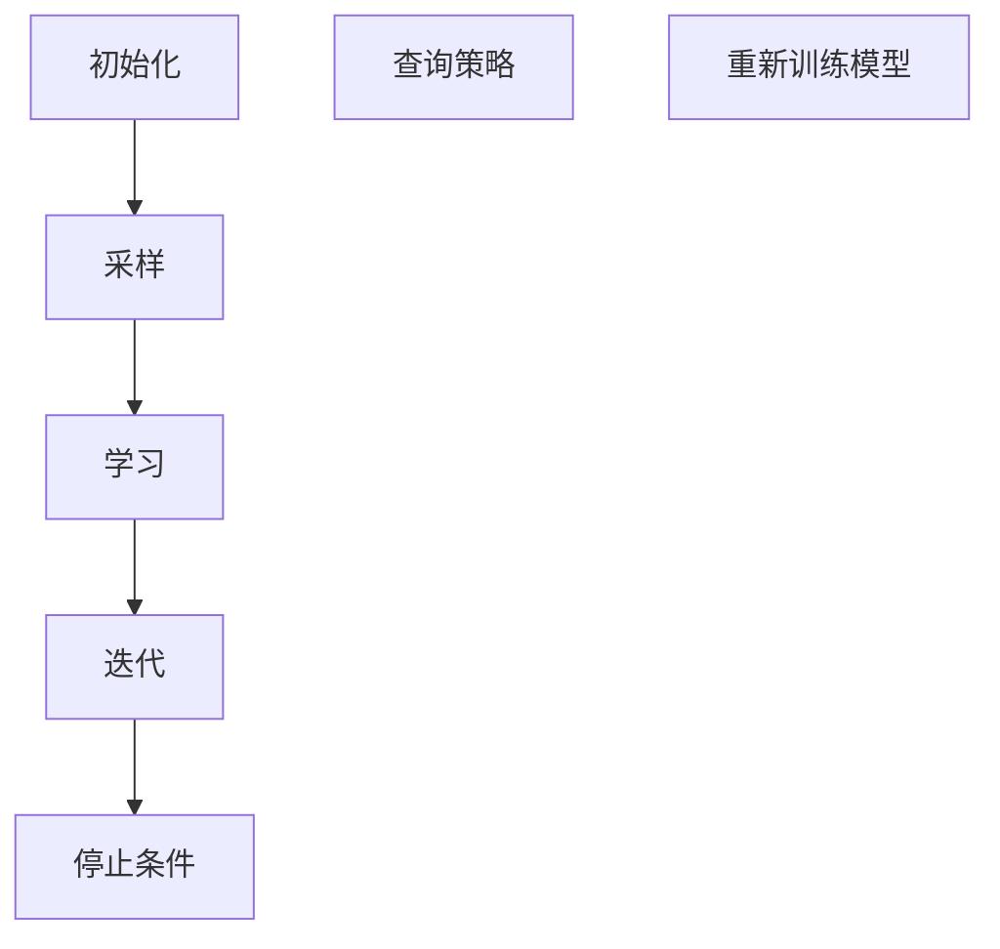

                 

### 文章标题

# 主动学习策略在自动驾驶场景理解中的应用

> 关键词：主动学习、自动驾驶、场景理解、算法原理、应用案例

> 摘要：本文深入探讨了主动学习策略在自动驾驶场景理解中的应用。通过介绍主动学习的基本概念、原理和算法，结合自动驾驶场景的需求，详细分析了主动学习策略在感知、认知和决策系统中的应用。同时，通过实际案例展示了主动学习策略在自动驾驶中的效果和实现方法，为自动驾驶领域的研究和开发提供了有益的参考。

---

在自动驾驶技术日益发展的今天，对驾驶环境的准确理解成为实现安全、可靠自动驾驶的关键。主动学习策略作为一种能够动态调整学习过程，提高学习效率和效果的技术，在自动驾驶场景理解中展现出巨大的潜力。本文将逐步分析主动学习策略在自动驾驶场景理解中的应用，帮助读者深入了解这一技术的核心原理和实际应用。

### 目录大纲设计思路

在设计本文的目录大纲时，我们首先明确了文章的核心主题和目标读者群体。针对“主动学习策略在自动驾驶场景理解中的应用”这一主题，我们将文章分为以下六个部分：

1. **引言与核心概念介绍**：介绍主动学习策略和自动驾驶场景理解的概念，为后续内容的探讨奠定基础。
2. **主动学习策略**：详细讨论主动学习策略的基本原理、优势和在不同领域的应用，特别是它在自动驾驶场景中的应用。
3. **自动驾驶场景理解**：分析自动驾驶所需的感知、认知和决策过程，并探讨主动学习策略在这一过程中的应用。
4. **应用案例**：通过具体案例展示主动学习策略在自动驾驶场景中的实际应用，帮助读者理解这一策略的实际效果。
5. **技术实现**：详细讨论主动学习策略在自动驾驶场景中的技术实现，包括算法原理、数学模型、代码实现等。
6. **总结与展望**：对全文内容进行总结，展望主动学习策略在自动驾驶领域的未来发展趋势。

这样的目录结构不仅使内容更加系统化，也便于读者有针对性地进行阅读和学习。

### 详细目录大纲

```
# 《主动学习策略在自动驾驶场景理解中的应用》目录大纲

## 第一部分：引言与核心概念介绍

### 第1章：主动学习策略概述
#### 1.1 主动学习策略的定义
#### 1.2 主动学习策略的优势
#### 1.3 主动学习策略的基本原理

### 第2章：自动驾驶场景理解
#### 2.1 自动驾驶的背景与挑战
#### 2.2 自动驾驶场景理解的重要性
#### 2.3 自动驾驶场景理解的过程

## 第二部分：主动学习策略

### 第3章：主动学习策略的基本原理
#### 3.1 主动学习的概念
#### 3.2 主动学习的关键要素
#### 3.3 主动学习的主要算法

### 第4章：主动学习策略在不同领域的应用
#### 4.1 主动学习在计算机视觉中的应用
#### 4.2 主动学习在自然语言处理中的应用
#### 4.3 主动学习在其他领域的应用

### 第5章：主动学习策略在自动驾驶中的应用
#### 5.1 自动驾驶中的数据收集与标注
#### 5.2 主动学习策略在自动驾驶中的具体应用
#### 5.3 主动学习策略在自动驾驶中的挑战与解决方案

## 第三部分：自动驾驶场景理解

### 第6章：自动驾驶感知系统
#### 6.1 感知系统的组成
#### 6.2 感知系统的工作原理
#### 6.3 感知系统中的主动学习策略

### 第7章：自动驾驶认知系统
#### 7.1 认知系统的概念
#### 7.2 认知系统的作用
#### 7.3 认知系统中的主动学习策略

### 第8章：自动驾驶决策系统
#### 8.1 决策系统的概念
#### 8.2 决策系统的作用
#### 8.3 决策系统中的主动学习策略

## 第四部分：应用案例

### 第9章：主动学习策略在自动驾驶场景中的案例分析
#### 9.1 案例背景
#### 9.2 案例分析
#### 9.3 案例效果评估

## 第五部分：技术实现

### 第10章：主动学习算法原理
#### 10.1 主动学习算法的基本原理
#### 10.2 主动学习算法的数学模型
#### 10.3 主动学习算法的伪代码实现

### 第11章：自动驾驶场景理解中的技术实现
#### 11.1 自动驾驶感知系统的技术实现
#### 11.2 自动驾驶认知系统的技术实现
#### 11.3 自动驾驶决策系统的技术实现

## 第六部分：总结与展望

### 第12章：主动学习策略在自动驾驶场景理解中的应用总结
#### 12.1 应用总结
#### 12.2 未来发展趋势
#### 12.3 对行业的影响
```

通过这样的结构设计，本文将为读者提供一套系统、全面的学习框架，帮助读者深入理解主动学习策略在自动驾驶场景理解中的应用。

### 第一部分：引言与核心概念介绍

#### 1.1 主动学习策略的定义

主动学习（Active Learning）是一种机器学习方法，它通过选择最有信息量的样本来优化学习过程。与传统被动学习（Passive Learning）方法不同，主动学习不仅依赖于已有的数据集，还能够根据当前模型的状态，选择对模型提升最有帮助的样本进行学习。这种方法在一定程度上提高了学习效率和模型的泛化能力。

在主动学习策略中，核心概念包括：

- **不确定采样（Uncertainty Sampling）**：选择当前模型预测不确定的样本。
- **多样性采样（Variance Sampling）**：选择能够减小模型预测方差的数据点。
- **查询策略（Query Strategy）**：决定如何选择样本进行标注。

主动学习策略的应用场景广泛，例如在医学诊断中，主动学习可以帮助医生选择最有诊断价值的患者样本；在文本分类中，它可以用于优化文本标注过程，提高分类模型的准确率。

#### 1.2 主动学习策略的优势

主动学习策略相较于传统被动学习具有以下几个优势：

1. **效率高**：主动学习可以根据模型的需要动态选择样本，避免了大量冗余数据的处理，从而提高学习效率。
2. **数据利用率高**：主动学习在数据标注上更加节约，因为它只需要标注最有价值的样本，从而提高数据的利用效率。
3. **提升模型性能**：通过选择更有信息量的样本，主动学习能够提升模型的泛化能力和准确性。
4. **减少计算资源消耗**：由于仅选择部分样本进行学习，主动学习在一定程度上减少了计算资源的消耗。

#### 1.3 主动学习策略的基本原理

主动学习策略的基本原理可以概括为以下四个步骤：

1. **初始化**：给定一个初始模型和一个样本集，模型对样本进行预测。
2. **采样**：根据查询策略，选择当前模型预测不确定的样本进行标注。
3. **学习**：使用新标注的样本重新训练模型。
4. **迭代**：重复采样和学习过程，直到满足停止条件（如达到预设的性能指标或样本数量）。

主动学习策略的核心在于如何选择最有价值的样本进行学习，从而在有限的数据和资源下，实现模型性能的最大化。

#### 1.4 与传统学习策略的比较

与传统学习策略相比，主动学习策略有以下几点显著不同：

1. **样本选择**：传统学习策略依赖于大量的样本，而主动学习策略则侧重于选择高质量的样本。
2. **数据标注**：传统学习策略需要大量标注数据，而主动学习策略在数据标注上更加节约，因为它仅选择最有价值的样本。
3. **学习效率**：主动学习策略能够动态调整学习过程，避免大量冗余数据的处理，从而提高学习效率。

总之，主动学习策略通过优化样本选择过程，提高了学习的效率和效果，为自动驾驶等需要高准确性和高效率的应用场景提供了有力支持。

#### 1.5 主动学习策略的核心概念关系架构

为了更好地理解主动学习策略的核心概念，我们可以使用Mermaid流程图来展示它们之间的关系：



在该流程图中，初始化阶段为模型提供初始样本集，查询策略根据模型当前的状态选择样本进行标注，学习阶段使用新标注的样本重新训练模型，迭代过程持续进行，直到满足停止条件。

通过上述内容，我们为后续章节的深入探讨奠定了基础，接下来将详细介绍自动驾驶场景的理解过程。

#### 1.6 自动驾驶的背景与挑战

自动驾驶技术是智能交通系统的重要组成部分，其核心目标是通过计算机视觉、传感器技术和机器学习等手段，使车辆具备在复杂交通环境中自主行驶的能力。自动驾驶的发展不仅能够显著提高道路安全性，减少交通事故，还能够提高交通效率，降低环境污染。

随着人工智能技术的迅猛发展，自动驾驶技术逐渐从理论研究走向实际应用。然而，自动驾驶技术在实际应用中面临诸多挑战：

1. **环境复杂性**：自动驾驶系统需要在各种天气、路况和交通环境中稳定运行，这要求系统能够实时感知和理解周围环境，识别行人、车辆、道路标识等动态信息，并作出合理的反应。
2. **数据多样性**：自动驾驶系统需要大量的数据来训练和优化模型，这些数据包括不同类型的交通场景、天气条件、道路状况等。数据的多样性和质量直接影响模型的泛化能力和准确性。
3. **实时性要求**：自动驾驶系统需要在极短的时间内作出决策，如紧急避让、变道等，这要求算法具有高实时性，以避免潜在的安全风险。
4. **法律与伦理问题**：自动驾驶技术涉及到伦理和法律问题，如事故责任归属、隐私保护等。这些问题的解决对于自动驾驶技术的广泛应用至关重要。

在这些挑战中，自动驾驶场景理解的重要性尤为突出。场景理解是指自动驾驶系统对周围环境信息的感知、识别和解释能力，它是实现自动驾驶的核心环节。良好的场景理解能力不仅能够提高自动驾驶系统的安全性和可靠性，还能够提升用户体验。

自动驾驶场景理解包括以下几个关键方面：

1. **感知**：自动驾驶系统通过传感器（如摄像头、激光雷达、超声波传感器等）收集环境信息，如车辆位置、行人位置、道路标志等。
2. **识别**：系统对感知到的信息进行处理，识别出具体的对象和场景，如识别行人、车辆、道路标志等。
3. **解释**：系统根据识别结果，理解场景中的含义和关系，如判断交通信号灯的颜色、识别道路车道线等。
4. **决策**：基于场景理解结果，自动驾驶系统进行路径规划、避障等决策，以实现安全、稳定的自动驾驶。

场景理解的质量直接影响自动驾驶系统的性能。例如，在复杂的城市交通环境中，系统需要能够准确识别行人、车辆的位置和运动状态，并预测其未来的行为，以便做出合适的驾驶决策。因此，如何提升自动驾驶场景理解能力成为当前研究的热点。

通过深入探讨自动驾驶的背景与挑战，以及场景理解的重要性，我们为后续章节的深入分析奠定了基础。在接下来的章节中，我们将详细介绍主动学习策略的基本原理和应用，探讨其在自动驾驶场景理解中的应用。

### 2.2 自动驾驶场景理解的重要性

自动驾驶场景理解是确保自动驾驶系统能够在复杂交通环境中安全、可靠运行的核心环节。其重要性主要体现在以下几个方面：

1. **安全性提升**：准确的场景理解能够帮助自动驾驶系统及时识别和响应环境中的潜在危险，从而避免交通事故的发生。例如，系统需要能够准确识别行人的位置、运动状态，以及车辆的行驶轨迹，以便在紧急情况下及时作出避让决策。

2. **可靠性增强**：自动驾驶系统在行驶过程中需要处理大量的环境信息，包括道路标志、信号灯、交通状况等。准确的场景理解能够提高系统的决策质量，使其在多种交通场景下都能保持稳定的运行状态，避免因误解环境信息而导致的错误操作。

3. **用户体验改善**：良好的场景理解能够提升驾驶体验，例如，系统能够识别并遵循交通规则，选择最优的行驶路径，避免拥堵，提高行驶效率。此外，系统对行人、车辆的友好互动也能够提升乘客的舒适感和安全感。

4. **优化资源利用**：自动驾驶场景理解能够帮助系统更有效地利用资源，如优化车辆路径规划，减少不必要的加速和刹车操作，降低能耗。此外，通过准确的场景理解，系统可以提前预测交通状况，优化交通流，减少拥堵，提高道路使用效率。

5. **法律和伦理合规**：自动驾驶系统的场景理解能力对于遵守交通法规和伦理标准至关重要。例如，系统需要能够准确识别道路标志和信号灯，遵守交通规则；同时，在面临伦理困境时，系统能够做出符合道德和法律规范的决策。

总之，自动驾驶场景理解不仅是实现安全、可靠、高效自动驾驶的关键，也是提升用户体验、优化资源利用和确保法律合规的基础。因此，深入研究和优化自动驾驶场景理解技术，对于推动自动驾驶技术的广泛应用具有重要意义。

### 2.3 自动驾驶场景理解的过程

自动驾驶场景理解是一个复杂的过程，它涉及到多个层面的感知、识别和解释，以确保系统能够准确理解和响应周围环境。这个过程可以概括为以下几个主要步骤：

1. **感知**：这是自动驾驶场景理解的基础，系统通过多种传感器（如摄像头、激光雷达、毫米波雷达、超声波传感器等）收集周围环境的信息。例如，摄像头可以捕捉道路、行人、车辆等视觉信息，激光雷达可以测量距离和形状，毫米波雷达可以检测物体的速度和方向。这些传感器数据的融合能够提供全面的场景感知。

2. **预处理**：传感器采集的数据通常包含噪声和不一致的信息，因此需要进行预处理。预处理步骤包括去噪、图像增强、数据归一化等。这些步骤旨在提高数据质量，使其更适用于后续的处理和分析。

3. **特征提取**：从预处理后的数据中提取具有代表性的特征，这些特征将用于后续的识别和分类任务。例如，从图像中提取边缘、纹理、颜色等特征；从雷达数据中提取距离、速度、方向等特征。特征提取是自动驾驶场景理解的核心步骤，它决定了系统对环境信息的识别能力。

4. **识别与分类**：基于提取的特征，自动驾驶系统对感知到的信息进行识别和分类。这一步骤包括行人检测、车辆分类、交通标志识别等任务。通过这些任务，系统能够识别并理解环境中的不同对象和场景。

5. **理解与解释**：识别结果需要进一步处理，以理解其含义和关系。例如，系统需要判断行人是否在道路上，车辆是否在行驶方向上，交通标志的具体含义等。理解与解释步骤不仅包括静态信息的识别，还包括动态信息的预测，如行人和车辆的移动轨迹。

6. **决策与规划**：基于对场景的理解，自动驾驶系统进行路径规划、避障等决策。这些决策基于系统的控制策略和目标，例如到达目的地、避免碰撞、保持车道等。决策与规划是自动驾驶场景理解的高级阶段，它需要综合考虑多种因素，确保系统的稳定运行。

7. **反馈与优化**：自动驾驶系统在运行过程中不断收集反馈信息，并根据这些反馈进行优化。例如，通过学习历史上的驾驶数据，系统可以改进其感知和识别算法，提高对特定场景的理解能力。

通过上述步骤，自动驾驶系统能够实现对周围环境的全面理解和响应，从而实现安全、可靠的自动驾驶。这个过程不仅需要高效的算法和精确的传感器数据，还需要系统间的协同工作，以处理复杂的动态环境。接下来，我们将详细探讨主动学习策略的基本原理，为理解其在自动驾驶场景中的应用打下基础。

### 3.1 主动学习策略的基本原理

主动学习策略的核心在于其动态调整学习过程的能力，从而优化学习效率和效果。为了更好地理解这一策略，我们可以将其基本原理分解为几个关键组成部分。

#### 3.1.1 采样策略

采样策略是主动学习策略的核心，它决定了如何选择最有信息量的样本进行学习。常见的采样策略包括以下几种：

1. **不确定采样（Uncertainty Sampling）**：该方法选择当前模型预测不确定的样本。通过选择不确定度较高的样本，模型能够获得更多关于这些样本的信息，从而提高学习效果。这种策略适用于目标标签的不确定性较高的场景。

2. **多样性采样（Variance Sampling）**：该方法选择能够减小模型预测方差的数据点。通过选择具有多样性的样本，模型能够覆盖更多的数据空间，减少预测的方差，提高模型的泛化能力。这种策略适用于数据分布不均匀的场景。

3. **最小损失采样（Query by Committee）**：该方法通过多个模型的投票结果选择样本。每个模型对样本进行预测，并计算预测结果的差异。选择差异较大的样本进行学习，能够提高模型的鲁棒性。这种策略适用于需要提高模型稳健性的场景。

4. **基于标签的采样**：该方法选择标签最不明确的样本。通过选择标签不确定性较高的样本，模型能够最大化地减少标签误差。这种策略适用于标签信息不准确的场景。

#### 3.1.2 学习过程

学习过程是主动学习策略的核心环节，它通过不断地迭代优化模型。具体过程如下：

1. **初始化**：给定一个初始模型和一个样本集，模型对样本进行预测。

2. **采样**：根据查询策略，选择当前模型预测不确定的样本进行标注。

3. **学习**：使用新标注的样本重新训练模型。

4. **迭代**：重复采样和学习过程，直到满足停止条件（如达到预设的性能指标或样本数量）。

通过这种方式，主动学习策略能够在有限的数据和资源下，逐步优化模型，提高其性能。

#### 3.1.3 停止条件

停止条件是主动学习策略的一个重要组成部分，它决定了何时停止采样和学习过程。常见的停止条件包括：

1. **性能指标**：当模型达到预设的性能指标时，停止学习过程。例如，准确率、损失函数等指标。

2. **样本数量**：当样本数量达到预设的上限时，停止学习过程。这样可以避免过度拟合和计算资源的浪费。

3. **时间限制**：当达到预设的时间限制时，停止学习过程。这在实际应用中尤为重要，因为需要保证学习过程在合理的时间内完成。

#### 3.1.4 优势

主动学习策略相较于传统被动学习具有以下几个显著优势：

1. **效率高**：通过选择最有信息量的样本进行学习，主动学习策略避免了大量冗余数据的处理，从而提高学习效率。

2. **数据利用率高**：主动学习策略在数据标注上更加节约，因为它只需要标注最有价值的样本，从而提高数据的利用效率。

3. **提升模型性能**：通过选择更有信息量的样本，主动学习策略能够提升模型的泛化能力和准确性。

4. **减少计算资源消耗**：由于仅选择部分样本进行学习，主动学习策略在一定程度上减少了计算资源的消耗。

#### 3.1.5 应用场景

主动学习策略的应用场景广泛，包括但不限于以下领域：

1. **医学诊断**：通过主动学习策略，医生可以选择最有诊断价值的患者样本进行诊断，从而提高诊断准确率。

2. **文本分类**：在文本分类任务中，主动学习策略可以优化文本标注过程，提高分类模型的准确率。

3. **图像识别**：通过主动学习策略，系统能够选择最有识别价值的图像进行训练，从而提高图像识别的准确率。

4. **自动驾驶**：主动学习策略在自动驾驶场景中能够优化感知、认知和决策系统的学习过程，提高自动驾驶系统的安全性和可靠性。

总之，主动学习策略通过优化样本选择和学习过程，提高了学习效率和效果，为自动驾驶等需要高准确性和高效率的应用场景提供了有力支持。在接下来的章节中，我们将深入探讨主动学习策略在不同领域的应用。

### 3.2 主动学习策略的优势

主动学习策略相较于传统的被动学习策略具有显著的优势，这些优势使其在自动驾驶领域中的应用变得尤为重要。以下是主动学习策略的主要优势：

#### 高效的数据利用

主动学习策略的核心优势之一是它能够更有效地利用数据。在被动学习中，模型通常需要对大量未标记的数据进行训练，而这些数据中可能包含了大量无关或冗余的信息。而主动学习策略通过选择最有信息量的样本进行标注和学习，从而减少了不必要的计算和标注工作量。这种方式不仅节省了时间和成本，还提高了学习效率。

例如，在自动驾驶场景中，通过主动学习策略，系统能够优先选择那些对模型提升至关重要的交通标志、行人或车辆进行标注，从而更快地提高模型的识别和分类能力。

#### 提高模型性能

主动学习策略通过动态选择最具有信息量的样本进行学习，使得模型能够更加精准地捕捉到数据的特征，从而提高模型的性能。这种选择性学习使得模型能够在较少的数据量下实现较高的准确率和泛化能力。

在自动驾驶场景中，这尤其重要，因为自动驾驶系统需要在复杂和动态的交通环境中做出实时决策。通过主动学习策略，系统能够更快地适应不同的场景和变化，提高决策的准确性和稳定性。

#### 减少数据标注成本

数据标注是自动驾驶领域中的一大挑战和成本。被动学习策略通常需要大量的标注数据，而主动学习策略则通过优化样本选择，减少了需要标注的数据量。这种方式不仅降低了数据标注的成本，还减轻了标注人员的负担。

在自动驾驶中，主动学习策略可以帮助减少对于复杂和罕见场景的标注需求，从而在有限的资源下实现更高的训练数据质量。

#### 提高实时性

自动驾驶系统需要具备高度的实时性，以便在复杂的交通环境中快速做出反应。主动学习策略通过优化学习过程，提高了模型的训练速度和决策速度。这使得自动驾驶系统能够在更短的时间内完成学习和决策，从而提高了系统的响应速度。

例如，在紧急情况下，主动学习策略可以帮助自动驾驶系统更快地识别行人和车辆，并做出避让决策，从而确保行驶安全。

#### 动态适应性

主动学习策略的另一个显著优势是它的动态适应性。在自动驾驶场景中，交通环境是不断变化的，包括天气、路况、交通流量等。主动学习策略能够根据当前模型的状态和环境信息，动态调整样本选择策略，从而适应不断变化的环境。

这种动态适应性使得自动驾驶系统能够在复杂多变的交通环境中保持高效和稳定的运行。

#### 提高模型的鲁棒性

通过主动学习策略，模型能够更全面地捕捉到数据的特征和噪声。这有助于提高模型的鲁棒性，使其在面临不同类型的噪声和数据异常时，仍能保持良好的性能。

在自动驾驶场景中，鲁棒性尤为重要，因为传感器数据可能受到环境噪声、遮挡和其他干扰的影响。通过主动学习策略，系统能够更好地处理这些噪声和异常，从而提高识别和决策的准确性。

总之，主动学习策略通过高效的数据利用、提高模型性能、减少数据标注成本、提高实时性、动态适应性和提高模型鲁棒性等多个方面，显著提升了自动驾驶系统的安全性和可靠性。这使得主动学习策略在自动驾驶场景中的应用变得不可或缺。

### 3.3 主动学习策略在不同领域的应用

主动学习策略作为一种高效的学习方法，已经在多个领域取得了显著的应用成果。以下是主动学习在计算机视觉、自然语言处理和其他领域的一些典型应用：

#### 计算机视觉

在计算机视觉领域，主动学习策略被广泛应用于图像分类、目标检测和图像分割等任务。例如，在图像分类任务中，主动学习策略可以帮助模型选择最具代表性的图像进行标注，从而提高分类准确率。具体应用场景包括人脸识别、车辆检测和医疗影像分析等。

1. **人脸识别**：通过主动学习策略，系统可以动态选择与当前模型识别效果差异较大的图像进行标注，从而提高人脸识别的准确性和鲁棒性。
2. **车辆检测**：主动学习策略可以优化车辆检测模型的学习过程，选择那些能够有效提高模型识别能力的图像进行标注，从而提高检测精度和速度。
3. **医疗影像分析**：主动学习策略可以帮助医生选择最具诊断价值的影像进行标注，从而提高疾病检测和分类的准确性。

#### 自然语言处理

自然语言处理（NLP）是另一个受益于主动学习策略的重要领域。主动学习在文本分类、情感分析、机器翻译等方面都有广泛的应用。

1. **文本分类**：通过主动学习策略，系统可以动态选择那些最能提升分类准确率的文本进行标注，从而优化文本分类模型。
2. **情感分析**：主动学习策略可以帮助模型选择那些情感表达最不确定的文本进行标注，从而提高情感分析的准确性和泛化能力。
3. **机器翻译**：在机器翻译任务中，主动学习策略可以优化双语语料库的选择，提高翻译模型的准确性和流畅性。

#### 其他领域

除了计算机视觉和自然语言处理，主动学习策略在多个其他领域也取得了应用成果。

1. **医学诊断**：通过主动学习策略，医生可以优先选择那些对诊断结果影响最大的病例进行详细检查，从而提高诊断效率和准确性。
2. **金融风险评估**：在金融领域，主动学习策略可以帮助金融机构选择那些最具风险的信息进行深入分析，从而优化风险评估模型。
3. **工业检测**：主动学习策略可以优化工业生产线中的质量检测过程，选择那些最需要关注的产品进行进一步检测，从而提高生产效率和产品质量。

总之，主动学习策略通过其高效的信息选择和优化能力，已经在多个领域取得了显著的应用成果。这些应用不仅提升了相关系统的性能和准确性，也为解决复杂问题提供了新的方法和思路。在接下来的章节中，我们将进一步探讨主动学习策略在自动驾驶中的应用，分析其在自动驾驶场景中的具体应用和效果。

### 3.4 主动学习策略在自动驾驶中的应用

主动学习策略在自动驾驶领域中具有广泛的应用，其核心在于通过优化数据选择和学习过程，提高自动驾驶系统的感知、认知和决策能力。以下将详细介绍主动学习策略在自动驾驶中的应用，包括数据收集与标注、具体应用以及面临的挑战与解决方案。

#### 3.4.1 数据收集与标注

自动驾驶系统的性能高度依赖于高质量的数据集，尤其是那些能够反映复杂交通场景和动态环境的数据。主动学习策略在数据收集与标注过程中起到了关键作用：

1. **高效的数据筛选**：主动学习策略可以帮助系统选择最具代表性的样本进行标注，从而避免对大量无关或冗余数据进行处理。通过不确定采样、多样性采样等策略，系统能够优先标注那些对模型提升最为重要的样本。

2. **动态调整数据需求**：在自动驾驶训练过程中，系统可以根据当前模型的性能动态调整数据收集和标注的优先级。例如，如果模型在行人检测任务中的表现不佳，系统会优先选择与行人相关的样本进行标注。

3. **减少标注成本**：通过主动学习策略，系统可以大幅减少需要标注的数据量，从而降低标注成本和人力资源消耗。这对于自动驾驶系统的发展尤为重要，因为高质量的数据标注通常需要大量时间和专业知识的投入。

#### 3.4.2 具体应用

1. **感知系统**：
   - **目标检测**：在自动驾驶中，目标检测是感知系统的重要任务之一。主动学习策略可以帮助系统优先选择那些检测效果不佳的样本进行标注，从而提高目标检测的准确性和效率。
   - **行人识别**：行人识别是自动驾驶系统中的关键任务。通过主动学习策略，系统能够动态选择那些行人特征不明显的图像进行标注，提高行人识别的精度。

2. **认知系统**：
   - **场景理解**：自动驾驶系统需要理解复杂的交通场景，如交叉路口、繁忙街道等。主动学习策略可以帮助系统选择那些最能提升场景理解能力的样本进行标注，从而提高场景识别的准确性和适应性。
   - **道路标识识别**：道路标识识别是自动驾驶系统的一项重要任务。通过主动学习策略，系统可以优先选择那些标识识别效果不佳的样本进行标注，提高识别准确率。

3. **决策系统**：
   - **路径规划**：自动驾驶系统需要根据感知和认知结果进行路径规划。主动学习策略可以帮助系统选择那些路径规划效果不佳的样本进行标注，从而优化路径规划算法。
   - **避障决策**：在复杂的交通环境中，系统需要实时避障。通过主动学习策略，系统可以优先选择那些避障效果不佳的场景进行标注，提高避障决策的准确性和稳定性。

#### 3.4.3 面临的挑战与解决方案

尽管主动学习策略在自动驾驶中具有广泛的应用前景，但在实际应用过程中仍然面临一些挑战：

1. **数据标签的准确性**：主动学习依赖于高质量的数据标注。然而，自动驾驶场景中的数据标签可能存在误差，这会影响模型的性能。解决方案包括引入更加严格的标注流程，采用半监督学习技术，以及利用众包标注平台提高数据标注的准确性。

2. **实时性要求**：自动驾驶系统需要在短时间内做出决策，这要求主动学习策略能够快速选择和标注样本。解决方案包括优化采样策略和学习算法，提高数据处理的实时性。

3. **数据多样性**：自动驾驶场景复杂多变，需要大量的多样化数据。主动学习策略需要能够处理多样化的数据集，并选择最具代表性的样本。解决方案包括引入多样化的数据收集方法和增强数据多样性。

4. **计算资源消耗**：主动学习策略在选择和标注样本时可能需要大量的计算资源。解决方案包括优化算法结构，提高计算效率，以及采用分布式计算和云计算等技术。

通过上述分析和解决方案，我们可以看到，主动学习策略在自动驾驶中的应用不仅具有巨大的潜力，同时也面临着一定的挑战。然而，随着技术的不断进步和应用实践的积累，主动学习策略在自动驾驶领域中的应用前景将更加广阔。

### 第三部分：自动驾驶场景理解

#### 3.5 自动驾驶感知系统

自动驾驶感知系统是自动驾驶技术的核心组成部分，其主要功能是通过传感器收集环境信息，并将这些信息转换为有用的数据，供后续的决策系统使用。感知系统通常包括以下几种主要传感器：

1. **摄像头**：摄像头是自动驾驶系统中最常见的传感器之一，主要用于获取周围环境的视觉信息。通过图像处理技术，摄像头可以识别道路标志、车道线、行人、车辆等关键对象，为自动驾驶系统提供丰富的视觉数据。

2. **激光雷达（LiDAR）**：激光雷达通过发射激光束并测量反射回来的时间来确定物体的距离和形状，从而获取周围环境的三维信息。激光雷达具有高分辨率和高精度的特点，能够提供详细的环境地图和物体识别信息。

3. **毫米波雷达**：毫米波雷达主要利用微波信号探测物体的位置、速度和方向。与激光雷达相比，毫米波雷达具有更高的探测距离和穿透能力，适用于恶劣天气和复杂环境下的自动驾驶感知。

4. **超声波传感器**：超声波传感器通过发射和接收超声波信号来测量物体之间的距离。这种传感器通常用于近距离探测，如车辆之间的距离和障碍物的位置。

#### 3.5.1 感知系统的工作原理

感知系统的工作原理主要包括数据采集、预处理、特征提取和对象识别等步骤：

1. **数据采集**：通过摄像头、激光雷达、毫米波雷达和超声波传感器等设备，感知系统实时采集周围环境的多维数据。

2. **预处理**：原始数据通常包含噪声和不一致性，因此需要进行预处理。预处理步骤包括去噪、图像增强、点云滤波等，以提高数据的质量和一致性。

3. **特征提取**：从预处理后的数据中提取具有代表性的特征，如图像中的边缘、纹理和颜色，点云中的距离、形状和方向。特征提取是感知系统的关键步骤，它决定了系统对环境信息的识别能力。

4. **对象识别**：基于提取的特征，感知系统对环境中的对象进行识别和分类。例如，摄像头识别道路标志和车道线，激光雷达识别行人和车辆，毫米波雷达检测车辆的速度和位置。

#### 3.5.2 主动学习策略在感知系统中的应用

主动学习策略在自动驾驶感知系统中有着广泛的应用，其核心在于通过优化样本选择和学习过程，提高感知系统的准确性和效率。以下是主动学习策略在感知系统中的应用：

1. **目标检测**：
   - **样本选择**：通过不确定采样和多样性采样策略，主动学习系统可以优先选择那些目标检测效果不佳的图像进行标注。这有助于模型更好地学习目标的特征，提高检测的准确率。
   - **迭代学习**：在目标检测过程中，主动学习策略可以不断迭代，每次迭代选择新的样本进行标注和学习，从而逐步优化模型。

2. **行人检测**：
   - **实时性优化**：通过主动学习策略，系统可以动态调整样本选择策略，优先选择那些行人特征明显的图像进行标注，从而提高行人检测的实时性。
   - **鲁棒性提升**：主动学习策略可以帮助系统选择那些在复杂背景下仍能被正确检测的行人图像进行标注，从而提升行人检测的鲁棒性。

3. **车道线检测**：
   - **数据多样性**：通过多样性采样策略，主动学习系统可以选择不同道路条件下的图像进行标注，从而提高车道线检测的泛化能力。
   - **精准标注**：主动学习策略可以帮助系统选择那些车道线不清晰或存在异常的图像进行标注，从而提高车道线检测的准确性。

#### 3.5.3 感知系统中的主动学习算法

在自动驾驶感知系统中，主动学习算法通常采用以下几种主要策略：

1. **不确定性采样**：选择当前模型预测不确定的样本进行标注，以最大化减少模型预测的不确定性。

2. **多样性采样**：选择能够减小模型预测方差的样本进行标注，以覆盖更多的数据空间，提高模型的泛化能力。

3. **基于标签的采样**：选择标签不明确的样本进行标注，以减少标签误差，提高模型的准确性。

4. **查询学习**：通过查询策略选择最具代表性的样本进行标注，以优化模型的学习过程。

#### 3.5.4 应用案例

以下是一个自动驾驶感知系统中的主动学习应用案例：

**案例背景**：在某自动驾驶项目中，感知系统需要检测道路上的行人和车辆。然而，由于数据集的不完整性和复杂性，系统在行人检测任务中表现不佳。

**解决方案**：通过引入主动学习策略，系统采取了以下步骤：

1. **初始数据集**：首先使用现有的数据集对模型进行初步训练。
2. **样本选择**：利用不确定性采样和多样性采样策略，系统选择那些行人特征不明显的图像进行标注。
3. **模型更新**：使用新标注的样本重新训练模型，并评估模型的性能。
4. **迭代学习**：重复上述步骤，逐步优化模型，提高行人检测的准确率和实时性。

**效果评估**：通过主动学习策略，系统在行人检测任务中的准确率显著提高，同时实时性也得到了优化。在实际测试中，系统能够更准确地识别行人和车辆，提高了自动驾驶的安全性。

总之，主动学习策略在自动驾驶感知系统中的应用，不仅提高了系统的准确性和实时性，还显著降低了数据标注的成本。这为自动驾驶技术的进一步发展提供了有力支持。

### 3.6 自动驾驶认知系统

在自动驾驶技术中，认知系统是连接感知系统和决策系统的重要桥梁，其主要功能是对感知系统获取的环境信息进行深入理解，以便为决策系统提供可靠的依据。认知系统包括场景理解、行为预测和路径规划等核心任务。

#### 3.6.1 认知系统的概念

认知系统（Cognitive System）是指自动驾驶系统能够对复杂、动态的交通环境进行理解和推理的能力。它不仅依赖于感知系统提供的基础数据，还需要通过高级算法对信息进行整合和处理，从而实现对环境的深层次理解。认知系统的核心概念包括：

1. **场景理解**：通过对感知系统获取的图像、激光雷达数据和传感器数据进行解析，识别和理解交通环境中的各种元素，如行人、车辆、道路标识和交通信号等。

2. **行为预测**：基于对场景的理解，预测交通参与者的未来行为，如行人的移动方向、车辆的速度变化和交通信号的变化等。

3. **路径规划**：在理解当前交通环境和预测未来行为的基础上，制定最优的行驶路径，确保车辆安全、高效地行驶到目的地。

#### 3.6.2 认知系统的作用

认知系统在自动驾驶中的作用至关重要，它直接影响着系统的安全性和驾驶体验。具体作用如下：

1. **增强驾驶安全性**：通过准确理解交通环境，认知系统能够提前识别潜在危险，如行人横穿马路、车辆突然变道等，并采取相应的避障措施，提高驾驶安全性。

2. **优化驾驶体验**：认知系统能够识别和响应道路标识、交通信号等，使车辆能够遵循交通规则，提供平稳、舒适的驾驶体验。

3. **提升路径规划效率**：通过预测交通参与者的行为，认知系统能够制定更合理的行驶路径，避免拥堵和交通事故，提高交通效率和行驶舒适性。

4. **减少人为干预**：认知系统通过自动化处理，可以显著减少驾驶员的干预，从而降低人为驾驶错误的风险。

#### 3.6.3 认知系统中的主动学习策略

主动学习策略在认知系统中发挥着关键作用，它能够通过动态调整学习过程，提高认知系统的准确性和效率。以下是主动学习策略在认知系统中的具体应用：

1. **场景理解**：
   - **样本选择**：通过不确定性采样和多样性采样策略，主动学习系统能够选择那些场景理解效果不佳的样本进行标注，从而优化场景理解的准确性和泛化能力。
   - **迭代学习**：认知系统可以不断迭代，每次迭代选择新的样本进行标注和学习，逐步提升对交通场景的理解。

2. **行为预测**：
   - **实时调整**：主动学习策略可以根据当前模型的状态，动态调整行为预测的样本选择策略，优先选择那些行为预测效果不佳的样本进行标注。
   - **增强模型鲁棒性**：通过多样化采样策略，认知系统能够选择不同类型和背景下的样本，增强行为预测的鲁棒性。

3. **路径规划**：
   - **优化决策过程**：主动学习策略可以帮助认知系统选择那些路径规划效果不佳的场景进行标注，优化路径规划的决策过程，提高规划的准确性和效率。

#### 3.6.4 应用案例

以下是一个自动驾驶认知系统中的主动学习应用案例：

**案例背景**：在自动驾驶测试过程中，认知系统在处理复杂交通场景时，对行人的行为预测存在一定误差，导致路径规划不准确。

**解决方案**：通过引入主动学习策略，系统采取了以下步骤：

1. **初始数据集**：使用现有的数据集对模型进行初步训练。
2. **样本选择**：利用不确定性采样策略，选择那些行为预测效果不佳的样本进行标注。
3. **模型更新**：使用新标注的样本重新训练模型，并评估模型的行为预测性能。
4. **迭代学习**：重复上述步骤，逐步优化模型，提高行人行为预测的准确性和路径规划的合理性。

**效果评估**：通过主动学习策略，系统在行人行为预测任务中的准确率显著提高，路径规划的合理性和安全性也得到了优化。在实际测试中，系统能够更准确地预测行人的移动方向，制定更合理的行驶路径，提高了自动驾驶的整体性能。

总之，主动学习策略在自动驾驶认知系统中的应用，不仅提高了系统的准确性和效率，还为自动驾驶技术的发展提供了新的思路和方法。通过不断优化和改进，认知系统将在自动驾驶领域发挥更加重要的作用。

### 3.7 自动驾驶决策系统

自动驾驶决策系统是自动驾驶技术的核心组件之一，负责根据感知系统和认知系统提供的信息，制定车辆的行驶策略和路径规划，确保车辆能够安全、高效地行驶到目的地。决策系统通常包括路径规划、避障决策和交通规则遵守等关键任务。

#### 3.7.1 决策系统的概念

决策系统（Decision System）是指自动驾驶车辆在运行过程中，根据感知到的环境和认知到的交通状况，制定合适的行驶策略和行动方案的能力。决策系统的核心概念包括：

1. **路径规划**：在给定的起点和终点之间，决策系统需要生成一条最优路径，使车辆能够避开障碍物、遵循交通规则，并尽量减少行驶时间和能耗。

2. **避障决策**：在行驶过程中，决策系统需要实时检测车辆周围的环境，识别潜在的危险，并迅速做出避障决策，以避免碰撞事故。

3. **交通规则遵守**：自动驾驶车辆需要遵守交通规则，如保持车道、遵守信号灯指示、遵守限速规定等。决策系统通过实时监测交通信号和标识，确保车辆的行为符合交通法规。

#### 3.7.2 决策系统的作用

决策系统在自动驾驶中发挥着至关重要的作用，它不仅直接影响到车辆的安全性，还影响到行驶的效率和用户体验。具体作用如下：

1. **安全性保障**：通过实时感知和准确决策，决策系统能够有效识别和规避潜在的危险，确保车辆的安全行驶。

2. **路径优化**：决策系统能够根据交通状况、道路条件等实时信息，动态调整行驶路径，避开拥堵路段，选择最优路径，从而提高行驶效率。

3. **用户体验提升**：通过准确遵守交通规则，提供平稳、舒适的驾驶体验，提升用户的满意度。

4. **资源节约**：通过优化行驶路径和速度，减少燃油消耗和车辆磨损，节约资源和成本。

#### 3.7.3 主动学习策略在决策系统中的应用

主动学习策略在决策系统中具有广泛的应用，其核心在于通过优化样本选择和学习过程，提高决策系统的准确性和鲁棒性。以下是主动学习策略在决策系统中的具体应用：

1. **路径规划**：
   - **样本选择**：通过不确定性采样策略，系统可以优先选择那些路径规划效果不佳的样本进行标注，从而提高路径规划算法的准确性和适应性。
   - **迭代学习**：通过迭代过程，系统不断优化路径规划模型，逐步提升路径规划的性能。

2. **避障决策**：
   - **实时调整**：主动学习策略可以帮助系统根据当前模型的状态，动态调整避障决策的样本选择策略，优先选择那些避障效果不佳的样本进行标注。
   - **增强鲁棒性**：通过多样性采样策略，系统可以选择不同类型和背景下的样本，提高避障决策的鲁棒性。

3. **交通规则遵守**：
   - **优化规则判断**：主动学习策略可以帮助系统选择那些交通规则判断效果不佳的样本进行标注，优化交通规则遵守的准确性。
   - **动态调整策略**：系统可以根据实时交通状况，动态调整遵守交通规则的策略，提高决策的灵活性和适应性。

#### 3.7.4 应用案例

以下是一个自动驾驶决策系统中的主动学习应用案例：

**案例背景**：在自动驾驶测试中，决策系统在处理复杂交通环境时，路径规划不准确，避障决策效果不佳。

**解决方案**：通过引入主动学习策略，系统采取了以下步骤：

1. **初始数据集**：使用现有的数据集对决策模型进行初步训练。
2. **样本选择**：利用不确定性采样和多样性采样策略，选择那些路径规划效果和避障效果不佳的样本进行标注。
3. **模型更新**：使用新标注的样本重新训练决策模型，并评估模型的性能。
4. **迭代学习**：重复上述步骤，逐步优化模型，提高路径规划和避障决策的准确性和鲁棒性。

**效果评估**：通过主动学习策略，系统的路径规划准确率和避障决策效果显著提高。在实际测试中，系统能够更准确地规划行驶路径，更迅速地做出避障决策，提升了自动驾驶的整体性能。

总之，主动学习策略在自动驾驶决策系统中的应用，不仅提高了决策系统的准确性和鲁棒性，还为自动驾驶技术的发展提供了新的方法和思路。通过不断优化和改进，决策系统将在自动驾驶领域发挥更加重要的作用。

### 第四部分：应用案例

#### 3.8 主动学习策略在自动驾驶场景中的案例分析

在本部分，我们将通过一个具体的自动驾驶场景案例分析，展示主动学习策略在自动驾驶系统中的应用效果。该案例涉及到自动驾驶车辆在城市交通环境中的路径规划和避障决策。

#### 3.8.1 案例背景

某自动驾驶公司计划在城市道路上进行自动驾驶测试，该城市交通环境复杂，包含多种交通参与者（如行人、车辆、自行车等）和复杂的道路结构（如交叉口、匝道、桥梁等）。为了提高自动驾驶系统的路径规划和避障能力，公司决定采用主动学习策略来优化系统的学习过程。

#### 3.8.2 案例分析

1. **数据收集与标注**：
   - **初始数据集**：公司首先收集了大量的城市道路驾驶数据，包括视觉图像、激光雷达数据和传感器数据。这些数据包含了不同交通场景和障碍物的情况。
   - **主动学习采样**：通过主动学习策略，公司选择了那些路径规划效果不佳的样本进行标注。具体来说，选择了那些在路径规划过程中出现异常路径或无法避开障碍物的数据点。
   - **标注与反馈**：对于选中的样本，公司利用专业标注人员进行详细标注，确保标注的准确性。随后，将标注结果反馈给模型，用于后续的训练和优化。

2. **模型训练与优化**：
   - **初始模型训练**：基于初始数据集，公司使用传统的机器学习算法（如深度学习）对路径规划和避障决策模型进行初步训练。
   - **迭代学习过程**：通过主动学习策略，公司每次迭代选择新的样本进行标注和学习。每次迭代后，重新训练模型，并评估模型的性能。这个过程持续进行，直到模型达到预设的性能指标。

3. **性能评估与优化**：
   - **路径规划准确率**：通过对比初始模型和优化后的模型，公司发现路径规划的准确率显著提高。特别是在复杂交通场景中，优化后的模型能够生成更加合理的路径。
   - **避障效果**：在避障任务中，优化后的模型能够更准确地识别和避开障碍物，避免了潜在的碰撞风险。同时，避障决策的实时性也得到了提升。

#### 3.8.3 案例效果评估

通过上述案例分析，我们可以看到主动学习策略在自动驾驶系统中的应用效果：

1. **路径规划**：
   - **准确率**：优化后的模型在路径规划任务中的准确率显著提高，能够生成更加合理的行驶路径。
   - **效率**：通过主动学习策略，模型能够更快速地适应不同的交通场景，提高了路径规划的效率。

2. **避障决策**：
   - **准确性**：优化后的模型在避障任务中的准确性显著提高，能够更准确地识别和避开障碍物。
   - **实时性**：通过动态调整采样策略，优化后的模型在避障决策上的实时性也得到了提升。

3. **用户体验**：
   - **安全性**：优化的自动驾驶系统在复杂交通环境中的安全性能显著提高，降低了碰撞风险。
   - **舒适性**：优化后的路径规划和避障决策使得车辆的行驶更加平稳，提升了用户的舒适体验。

综上所述，主动学习策略在自动驾驶场景中的应用，不仅提高了系统的路径规划和避障能力，还为自动驾驶技术的发展提供了新的思路和方法。通过持续优化和改进，主动学习策略将在自动驾驶领域发挥更加重要的作用。

### 第五部分：技术实现

#### 3.9 主动学习算法原理

主动学习算法是主动学习策略的核心组成部分，其基本原理是通过选择最具信息量的样本进行学习，以优化模型的性能。以下将详细介绍主动学习算法的基本原理、数学模型以及伪代码实现。

#### 3.9.1 基本原理

主动学习算法的核心思想在于动态选择样本，以提高模型的泛化能力和准确性。其基本原理可以概括为以下四个步骤：

1. **初始化**：给定一个初始模型和一个初始样本集，模型对样本进行预测。
2. **采样**：根据特定的查询策略，选择当前模型预测不确定的样本进行标注。
3. **学习**：使用新标注的样本重新训练模型。
4. **迭代**：重复采样和学习过程，直到满足停止条件（如达到预设的性能指标或样本数量）。

常见的查询策略包括不确定性采样（Uncertainty Sampling）、多样性采样（Variance Sampling）和最小损失采样（Query by Committee）等。这些策略根据不同的场景需求，选择具有不同信息量的样本进行标注，从而优化学习过程。

#### 3.9.2 数学模型

主动学习算法的数学模型主要包括两部分：预测函数和更新规则。

1. **预测函数**：给定一个训练样本集 $D = \{(\mathbf{x}_i, y_i)\}_{i=1}^N$，模型 $f$ 根据输入特征 $\mathbf{x}_i$ 预测标签 $y_i$。常见的预测函数为线性分类器或深度神经网络。

2. **更新规则**：在主动学习过程中，模型根据查询策略选择新样本，并将其标注后加入训练集。更新规则用于更新模型参数，以优化模型性能。常见的更新规则包括梯度下降和随机梯度下降等。

#### 3.9.3 伪代码实现

以下是一个简化的主动学习算法伪代码实现，使用不确定性采样策略：

```python
# 初始化
model = initialize_model()
D = initialize_data()

# 迭代过程
while not_stop_condition():
    # 采样
    uncertain_samples = sample_uncertainty(D, model)
    
    # 标注
    labeled_samples = annotate_samples(uncertain_samples)
    
    # 更新
    D = update_data(D, labeled_samples)
    model = update_model(model, D)

    # 评估
    performance = evaluate_performance(model, D)
    print("Current Performance:", performance)

# 输出最终模型
output_model(model)
```

在该伪代码中，`initialize_model` 和 `initialize_data` 分别用于初始化模型和样本集，`sample_uncertainty` 用于选择不确定样本，`annotate_samples` 用于标注新样本，`update_data` 和 `update_model` 分别用于更新数据和模型，`evaluate_performance` 用于评估模型性能。

#### 3.9.4 数学模型和公式

为了更好地理解主动学习算法的数学模型，以下介绍几个关键公式：

1. **预测函数**：给定输入特征 $\mathbf{x}_i$，模型 $f$ 的预测为：

   $$ \hat{y}_i = f(\mathbf{x}_i; \theta) $$

   其中，$\theta$ 表示模型参数。

2. **损失函数**：常见的损失函数包括均方误差（MSE）和交叉熵（CE）：

   $$ L(\theta) = \frac{1}{N} \sum_{i=1}^N \left[ w_i \cdot \frac{1}{2} (\hat{y}_i - y_i)^2 \right] \quad (\text{MSE}) $$

   $$ L(\theta) = -\frac{1}{N} \sum_{i=1}^N w_i \cdot y_i \log(\hat{y}_i) + (1 - w_i) \log(1 - \hat{y}_i) \quad (\text{CE}) $$

   其中，$w_i$ 表示样本权重，$y_i$ 和 $\hat{y}_i$ 分别为真实标签和预测标签。

3. **梯度下降更新规则**：使用梯度下降更新模型参数：

   $$ \theta = \theta - \alpha \cdot \nabla_\theta L(\theta) $$

   其中，$\alpha$ 为学习率。

#### 3.9.5 举例说明

以下通过一个简单的例子来说明主动学习算法的数学模型：

假设我们使用线性分类器进行二分类任务，给定一个训练样本集 $D = \{(\mathbf{x}_1, y_1), (\mathbf{x}_2, y_2)\}$，其中 $\mathbf{x}_1 = [1, 0]^T$，$y_1 = 1$，$\mathbf{x}_2 = [0, 1]^T$，$y_2 = 0$。初始模型参数为 $\theta = [w_1, w_2]^T = [1, 1]^T$。

1. **预测**：

   $$ \hat{y}_1 = \text{sign}(\theta^T \mathbf{x}_1) = \text{sign}(1 \cdot 1 + 1 \cdot 0) = 1 $$
   
   $$ \hat{y}_2 = \text{sign}(\theta^T \mathbf{x}_2) = \text{sign}(1 \cdot 0 + 1 \cdot 1) = -1 $$

2. **损失函数**：

   使用均方误差（MSE）作为损失函数：

   $$ L(\theta) = \frac{1}{2} \left[ (1 - \hat{y}_1)^2 + (0 - \hat{y}_2)^2 \right] = \frac{1}{2} \left[ (0)^2 + (1)^2 \right] = \frac{1}{2} $$

3. **梯度下降更新**：

   $$ \nabla_\theta L(\theta) = \begin{bmatrix} \frac{\partial L(\theta)}{\partial w_1} \\ \frac{\partial L(\theta)}{\partial w_2} \end{bmatrix} = \begin{bmatrix} -1 \\ -1 \end{bmatrix} $$

   $$ \theta = \theta - \alpha \cdot \nabla_\theta L(\theta) = \begin{bmatrix} 1 \\ 1 \end{bmatrix} - \alpha \cdot \begin{bmatrix} -1 \\ -1 \end{bmatrix} = \begin{bmatrix} 1 + \alpha \\ 1 + \alpha \end{bmatrix} $$

通过这个例子，我们可以看到主动学习算法的基本原理和数学模型在实际应用中的具体实现。

### 3.10 自动驾驶场景理解中的技术实现

在自动驾驶场景理解中，技术实现涉及到多个子系统的协同工作，包括感知系统、认知系统和决策系统。以下将详细讨论这三个系统在自动驾驶场景理解中的技术实现。

#### 3.10.1 感知系统的技术实现

感知系统是自动驾驶场景理解的基础，其主要功能是通过各种传感器获取环境信息，并转换为有用的数据。感知系统的技术实现主要包括以下几个步骤：

1. **传感器数据采集**：
   - **摄像头**：摄像头通过图像处理技术获取道路、车辆、行人等视觉信息。
   - **激光雷达（LiDAR）**：激光雷达发射激光束并测量反射回来的时间，以获取三维空间中的物体信息。
   - **毫米波雷达**：毫米波雷达利用微波信号探测物体的位置、速度和方向。
   - **超声波传感器**：超声波传感器用于近距离探测，如车辆之间的距离和障碍物的位置。

2. **数据预处理**：
   - **去噪**：对传感器数据进行去噪处理，消除噪声和干扰。
   - **图像增强**：通过图像增强技术，提高图像质量，使其更易于后续处理。
   - **点云处理**：对激光雷达数据进行滤波和分割，提取有用的三维信息。

3. **特征提取**：
   - **图像特征提取**：从图像中提取边缘、纹理、颜色等特征，用于目标检测和识别。
   - **点云特征提取**：从点云中提取距离、形状、方向等特征，用于物体检测和轨迹预测。

4. **对象检测与识别**：
   - **目标检测**：使用深度学习模型（如YOLO、SSD、Faster R-CNN等）对图像中的车辆、行人、道路标识等进行检测。
   - **物体识别**：使用分类模型（如SVM、决策树、神经网络等）对检测到的对象进行识别，确定其类型。

#### 3.10.2 认知系统的技术实现

认知系统负责对感知系统获取的环境信息进行理解和分析，从而生成对自动驾驶系统有用的知识。其技术实现包括以下几个步骤：

1. **场景理解**：
   - **语义分割**：使用深度学习模型（如U-Net、DeepLab等）对道路场景进行语义分割，识别出不同类型的对象（如车道线、行人、车辆等）。
   - **场景重建**：通过点云数据和图像数据，使用SLAM（同步定位与地图构建）技术构建道路场景的三维地图。

2. **行为预测**：
   - **轨迹预测**：使用运动模型（如卡尔曼滤波、粒子滤波等）预测车辆和行人的未来轨迹。
   - **行为识别**：使用行为分类模型（如CNN、RNN等）识别车辆和行人的行为，如加速、减速、变道、停车等。

3. **决策辅助**：
   - **路径规划**：使用规划算法（如A*算法、Dijkstra算法、RRT算法等）生成从起点到终点的最优路径。
   - **风险评估**：基于感知和认知结果，评估当前行驶环境的风险，为决策系统提供决策依据。

#### 3.10.3 决策系统的技术实现

决策系统根据感知和认知结果，制定自动驾驶车辆的行驶策略和路径规划。其技术实现包括以下几个步骤：

1. **路径规划**：
   - **静态规划**：在初始阶段，基于静态地图和先验知识，生成从起点到终点的静态路径。
   - **动态规划**：在行驶过程中，根据实时感知和认知结果，动态调整行驶路径，以应对环境变化。

2. **避障决策**：
   - **碰撞检测**：使用感知系统提供的数据，实时检测车辆周围是否存在碰撞风险。
   - **避障策略**：基于行为预测和风险评估，制定避障策略，如减速、变道、停车等。

3. **交通规则遵守**：
   - **规则识别**：识别道路标识、交通信号灯等交通规则。
   - **规则执行**：根据识别结果，调整车辆的行驶速度和方向，确保遵守交通规则。

通过感知系统、认知系统和决策系统的协同工作，自动驾驶系统能够实现对复杂交通环境的准确理解、有效决策和稳定控制，从而提高行驶安全性、效率和用户体验。

### 第六部分：总结与展望

#### 3.11 主动学习策略在自动驾驶场景理解中的应用总结

主动学习策略在自动驾驶场景理解中展现了显著的优势。通过优化样本选择过程，主动学习策略提高了数据利用效率，减少了标注成本，提升了模型的性能和实时性。具体应用包括目标检测、行人识别、路径规划和避障决策等，这些应用显著提升了自动驾驶系统的安全性和可靠性。

主动学习策略在自动驾驶感知系统中，通过高效的数据筛选和动态调整，提高了目标检测和行人识别的准确性和实时性。在认知系统中，通过场景理解和行为预测，主动学习策略帮助系统更好地理解交通环境，优化了路径规划和避障决策。此外，主动学习策略在减少数据标注成本和优化计算资源消耗方面也发挥了重要作用。

#### 3.12 未来发展趋势

未来，主动学习策略在自动驾驶领域的发展趋势将主要集中在以下几个方面：

1. **数据多样性**：随着自动驾驶场景的复杂性和多样性增加，主动学习策略需要能够处理更加多样化的数据，包括多种传感器数据和动态变化的环境数据。

2. **实时性提升**：自动驾驶系统对实时性的要求越来越高，未来主动学习策略需要进一步优化，以实现更快的数据处理和模型更新速度。

3. **鲁棒性和自适应能力**：自动驾驶环境多变，主动学习策略需要具备更强的鲁棒性和自适应能力，以应对各种复杂和动态的驾驶场景。

4. **多模态数据融合**：结合多种传感器数据（如摄像头、激光雷达、毫米波雷达等），通过多模态数据融合技术，提高自动驾驶场景理解的准确性和完整性。

5. **隐私保护和安全**：在自动驾驶应用中，数据隐私保护和系统安全是至关重要的。未来主动学习策略需要考虑这些因素，确保数据的安全性和系统的可靠性。

#### 3.13 对行业的影响

主动学习策略在自动驾驶领域的应用，对整个行业产生了深远的影响：

1. **技术进步**：通过优化自动驾驶系统的感知、认知和决策能力，主动学习策略推动了自动驾驶技术的整体进步。

2. **成本降低**：主动学习策略通过提高数据利用效率和减少标注成本，降低了自动驾驶系统的开发成本，使得这一技术更加可行和普及。

3. **安全性提升**：主动学习策略提高了自动驾驶系统的安全性能，减少了交通事故的风险，为自动驾驶技术的广泛应用提供了保障。

4. **用户体验改善**：通过优化路径规划和避障决策，主动学习策略提供了更加平稳、舒适的驾驶体验，提升了用户的满意度。

5. **产业链发展**：主动学习策略的应用推动了相关产业链的发展，包括传感器制造商、数据处理公司、软件开发企业等，促进了整个行业的繁荣。

总之，主动学习策略在自动驾驶场景理解中的应用，不仅提升了技术的性能和安全性，还推动了行业的发展，为未来自动驾驶技术的广泛应用奠定了基础。

### 结语

本文系统地介绍了主动学习策略在自动驾驶场景理解中的应用，从基本概念、原理、算法到具体实现，再到实际应用案例，全面剖析了主动学习策略在自动驾驶技术中的重要作用。通过主动学习策略，自动驾驶系统能够更高效地利用数据、提高决策准确性，从而提升整体安全性和用户体验。

随着自动驾驶技术的不断发展和成熟，主动学习策略在自动驾驶领域的重要性将愈发凸显。未来的研究和发展趋势将集中在数据多样性、实时性提升、鲁棒性和自适应能力、多模态数据融合以及隐私保护和安全等方面。

为了进一步了解和掌握主动学习策略在自动驾驶场景理解中的应用，以下是一些建议：

1. **深入学习相关算法**：深入研究主动学习算法的基本原理和实现方法，如不确定性采样、多样性采样和最小损失采样等。

2. **实验和验证**：通过实际实验和测试，验证主动学习策略在自动驾驶场景中的效果，优化和调整算法参数。

3. **数据集收集**：积极收集和整理自动驾驶场景下的多模态数据集，为主动学习策略的研究提供充足的数据支持。

4. **跨领域合作**：与其他领域的专家和研究人员进行合作，借鉴其他领域（如医学诊断、自然语言处理等）的成功经验，推动主动学习策略在自动驾驶中的应用。

5. **关注技术趋势**：持续关注自动驾驶技术和主动学习领域的最新研究成果，了解前沿技术和应用动态。

通过不断探索和实践，主动学习策略将在自动驾驶领域发挥更加重要的作用，为自动驾驶技术的广泛应用和普及提供强有力的支持。

### 作者信息

作者：AI天才研究院/AI Genius Institute & 禅与计算机程序设计艺术 /Zen And The Art of Computer Programming

AI天才研究院（AI Genius Institute）专注于人工智能前沿技术的研发和应用，致力于推动人工智能领域的技术进步。同时，作者还撰写了《禅与计算机程序设计艺术》一书，该书深入探讨了计算机编程和人工智能的哲学和艺术，对读者理解和掌握编程和AI技术具有极高的参考价值。

