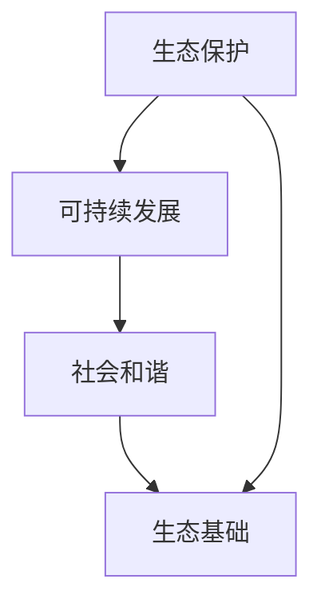

                 

### 《乡村复兴：回归自然中的生活哲学》

#### 关键词：
- 乡村复兴
- 生活哲学
- 自然观
- 可持续发展
- 社会和谐
- 教育改革
- 医疗改革
- 文化建设

#### 摘要：
本文探讨了乡村复兴的背景与意义，回归自然的生活哲学，以及乡村复兴中的生活实践。通过分析乡村复兴的全球趋势和我国乡村复兴的重要性，我们认识到生态保护与可持续发展、社会和谐与乡村振兴的紧密联系。文章进一步阐述了自然观的历史变迁和其与人类生活方式的关系，探讨了乡村生活的哲学思考和实践路径。在乡村教育改革、医疗改革和文化建设等方面，我们提出了一系列具体可行的改革路径和实践建议，旨在推动乡村复兴，实现回归自然的生活哲学。最后，对乡村复兴的未来展望和回归自然的生活哲学的传承与发扬进行了深入的探讨。

---

# 《乡村复兴：回归自然中的生活哲学》

## 第一部分：乡村复兴的背景与意义

### 1.1 乡村复兴的背景

乡村复兴是全球范围内的重要趋势，尤其在经历了快速的都市化和工业化的过程中，许多国家开始意识到乡村的不可替代性。在发达国家，如欧洲的许多国家，乡村复兴已成为政策重点，旨在改善乡村地区的经济状况，提升居民生活质量，同时保护自然环境。在我国，随着城乡差距的不断扩大，乡村复兴的重要性愈发凸显。近年来，国家出台了一系列政策，推动乡村发展，改善乡村基础设施，提升乡村教育水平，促进乡村经济的多元化和可持续发展。

### 1.2 乡村复兴的意义

乡村复兴具有多重意义。首先，它有助于生态保护与可持续发展。乡村地区通常拥有丰富的自然资源和生态环境，通过合理的开发和利用，可以实现经济效益和生态效益的双赢。其次，乡村复兴可以促进社会和谐与乡村振兴。通过改善乡村基础设施，提升居民生活水平，可以减少城乡差距，促进社会公平。此外，乡村复兴还可以激发乡村文化的保护与传承，推动乡村文化的创新发展。

## 第二部分：回归自然的生活哲学

### 2.1 自然观与人类生存

自然观是人类对自然界的认知和态度，它随着历史的发展和人类文明的进步而不断变迁。在古代，人们崇拜自然，认为自然是有灵性的，与人类生活息息相关。随着科学的发展，人类逐渐认识到自然的规律，开始从科学的角度理解自然。然而，在现代工业化的背景下，人类对自然的掠夺和破坏愈发严重，导致了许多环境问题。因此，回归自然的生活哲学应运而生，倡导人们尊重自然、保护自然，实现与自然的和谐共处。

### 2.2 乡村生活的哲学思考

乡村生活蕴含着丰富的哲学思考。它强调人与自然的和谐共处，倡导简约、自然的生活方式。乡村生活让人们远离都市的喧嚣，回归心灵的宁静。在乡村，人们与自然有着直接的接触，他们通过劳动与自然互动，体验自然的美好和生命的真谛。乡村生活还强调社区的重要性，通过邻里之间的互动和互助，人们建立了深厚的感情纽带，形成了和谐的社会关系。

### 2.3 回归自然的实践路径

回归自然的实践路径主要包括乡村环境保护与可持续发展、乡村生活的实践案例。在乡村环境保护方面，可以通过推广生态农业、建设生态村庄、加强环境保护立法等措施，实现乡村环境的可持续发展。在乡村生活的实践案例中，我们可以看到许多成功的实例，如乡村民宿、生态农场、自然教育项目等。这些实践不仅改善了乡村经济状况，还提升了居民的生活质量，推动了乡村复兴的进程。

## 第三部分：乡村复兴中的生活哲学

### 3.1 乡村教育改革

乡村教育改革是乡村复兴的重要组成部分。目前，我国乡村教育存在诸多问题，如师资力量不足、教育资源匮乏等。为了改善乡村教育状况，我们需要采取一系列措施，包括提高教师待遇、引进优秀师资、改善教育设施、推动教育信息化等。此外，我们还需要加强对乡村学生的心理健康教育和综合素质教育，培养他们热爱乡村、建设乡村的意识和能力。

### 3.2 乡村医疗改革

乡村医疗改革是乡村复兴的另一个关键领域。目前，我国乡村医疗存在医疗服务水平低、医疗资源不足等问题。为了改善乡村医疗状况，我们需要加强乡村医生队伍建设，提高医疗服务质量，完善医疗服务体系。同时，我们还需要推进医疗资源的均衡配置，通过远程医疗等方式，提升乡村地区的医疗服务水平，让乡村居民享受到优质的医疗服务。

### 3.3 乡村文化建设

乡村文化建设是乡村复兴的重要内容。乡村文化是乡村的灵魂，是乡村发展的根基。为了保护和传承乡村文化，我们需要加强乡村文化的保护和挖掘，推动乡村文化的创新发展。具体措施包括开展乡村文化活动、培养乡村文化人才、建设乡村文化设施等。通过这些措施，我们可以激发乡村文化的活力，提升乡村文化的影响力，为乡村复兴提供强大的文化支撑。

## 第四部分：回归自然的生活实践

### 4.1 乡村生活的体验与感悟

乡村生活的体验与感悟是回归自然的重要环节。通过亲身参与乡村生活，人们可以深刻体验到乡村的宁静与美好，感受到人与自然的和谐共处。在乡村，人们可以享受到清新的空气、美味的农产品、丰富的自然资源。这些体验不仅让人们的身心得到了放松，还让他们对自然和生命有了更深的理解。

### 4.2 回归自然的行动指南

回归自然的生活实践需要具体的行动指南。首先，我们应该提倡简约、自然的生活方式，减少对自然资源的消耗。其次，我们应该积极参与到乡村环境保护和生态建设中，为保护自然环境贡献自己的力量。此外，我们还应该加强对自然观的教育，培养人们对自然的尊重和热爱。通过这些行动，我们可以逐步实现回归自然的生活哲学。

### 4.3 乡村复兴的愿景与展望

乡村复兴的愿景是构建一个生态宜居、经济繁荣、社会和谐、文化丰富的乡村社会。在乡村复兴的进程中，回归自然的生活哲学将发挥重要作用。通过推动乡村复兴，我们可以实现人与自然的和谐共处，促进经济社会的可持续发展。未来，我们期待看到更多的乡村焕发出新的活力，成为人们向往的生活家园。

---

# 《乡村复兴：回归自然中的生活哲学》

## 第一部分：乡村复兴的背景与意义

### 1.1 乡村复兴的背景

#### 全球趋势

在全球范围内，乡村复兴已经成为一种不可逆转的趋势。这一现象的出现并非偶然，而是伴随着工业革命和城市化进程的加快，以及对环境保护和可持续发展的日益重视。发达国家如欧洲国家，在经历了长时间的都市化和工业化的快速发展后，开始反思乡村的价值和作用。这些国家发现，乡村不仅是生态环境的重要承载地，也是文化传承和社会和谐的基石。因此，他们纷纷出台政策，鼓励居民回到乡村，投资乡村，推动乡村的复兴。

#### 我国乡村复兴的重要性

在我国，乡村复兴的重要性同样不容忽视。首先，乡村是我国的重要组成部分，拥有丰富的自然资源和多样的生态系统。然而，长期的工业化和城市化进程导致了乡村资源的过度开发和环境破坏，使得乡村的生态承载力面临严峻挑战。因此，乡村复兴是保护生态环境、实现可持续发展的必然选择。

其次，我国城乡差距问题突出，农村地区的经济水平、教育水平、医疗服务水平等与城市相比存在较大差距。通过乡村复兴，可以缩小城乡差距，促进社会公平，实现全面小康。此外，乡村文化是我国传统文化的重要组成部分，乡村复兴有助于保护和传承这些宝贵的文化遗产。

### 1.2 乡村复兴的意义

#### 生态保护与可持续发展

乡村复兴的首要意义在于生态保护与可持续发展。乡村地区通常拥有丰富的自然资源和良好的生态环境，通过合理的开发和利用，可以实现经济效益和生态效益的双赢。例如，生态农业和有机农业的发展，不仅能够提高农产品的质量和安全性，还能够减少化学农药和化肥的使用，降低对环境的污染。此外，乡村的自然景观和生态环境也成为了吸引游客的重要资源，促进了乡村旅游业的繁荣，为乡村带来了经济收益。

#### 社会和谐与乡村振兴

乡村复兴还具有重要的社会意义，它有助于促进社会和谐与乡村振兴。通过改善乡村基础设施、提升居民生活水平，可以缩小城乡差距，促进社会公平。同时，乡村复兴也为农村居民提供了更多的就业机会和发展空间，激发了乡村经济的活力。例如，农村电商的发展，使得乡村居民可以通过网络销售农产品，拓宽了销售渠道，提高了收入。

#### 文化保护与传承

乡村复兴还有助于保护和传承乡村文化。乡村文化是我国传统文化的重要组成部分，它蕴含着丰富的历史、民俗、艺术等元素。通过乡村复兴，我们可以加强对乡村文化的保护和挖掘，推动乡村文化的创新发展。例如，一些地方通过举办民俗文化节、乡村艺术节等活动，吸引了大量游客，同时也激发了乡村居民对自身文化的自豪感和认同感。

## 结论

总之，乡村复兴是一项具有重要意义的系统工程，它涉及到生态保护、经济发展、社会和谐、文化传承等多个方面。通过推动乡村复兴，我们可以实现人与自然的和谐共处，促进经济社会的可持续发展。在我国，乡村复兴已成为一项重要的国家战略，需要各级政府、社会各界和广大农民的共同努力。只有通过全面、深入的乡村复兴，我们才能建设一个美丽、繁荣、和谐的乡村社会。

## 第二部分：回归自然的生活哲学

### 2.1 自然观与人类生存

#### 自然观的历史变迁

自然观是人类对自然界的认知和态度，它随着历史的发展和人类文明的进步而不断变迁。在古代，人们通常将自然视为神灵的存在，对自然充满敬畏和崇拜。例如，在古希腊神话中，自然界的山川、河流、植物和动物都被赋予了神灵的属性。这种原始的自然观反映了人类对自然的神秘感和依赖感。

随着时间的推移，人类逐渐摆脱了原始宗教和神话的束缚，开始从科学的角度理解自然。古希腊哲学家亚里士多德提出了“自然法则”的概念，强调自然界存在着一定的规律和秩序。这一观念对后世产生了深远的影响，成为西方自然观的基础。

#### 自然观与人类生活方式的关系

自然观与人类生活方式密切相关。在古代，人类的生活方式与自然紧密相连，他们遵循自然规律，依靠自然资源生存。例如，农业社会的人们根据季节变化安排农业生产，利用自然资源种植粮食、养殖家畜。这种与自然和谐相处的生活方式在一定程度上保证了人类社会的稳定和发展。

然而，在现代社会，随着工业化和城市化的快速发展，人类的生活方式发生了巨大变化。人们越来越依赖于科技和机械，对自然资源的依赖程度逐渐降低。然而，这种生活方式也带来了一系列环境问题，如空气污染、水资源短缺、土壤退化等。这些问题不仅影响了人类的生存环境，也威胁到了生物多样性和生态平衡。

#### 当代自然观的重塑

在当代，人们开始反思过去的生活方式，重新审视自然观。生态学、环境科学等学科的发展，使得人们逐渐认识到自然的重要性。可持续发展、生态文明等理念逐渐成为人们共识，推动了自然观的转变。人们开始倡导简约、自然的生活方式，追求与自然的和谐共处。

例如，一些城市居民开始在城市中种植绿植、建设生态公园，以改善城市生态环境。农村地区也出现了回归自然的趋势，人们通过发展生态农业、生态旅游等，实现经济与生态的双赢。这些实践表明，当代自然观已经从对自然的被动接受和利用，转变为主动保护和尊重。

### 2.2 乡村生活的哲学思考

#### 乡村生活的价值与意义

乡村生活蕴含着丰富的哲学思考，它不仅是一种生活方式，更是一种生活哲学。乡村生活的价值与意义主要体现在以下几个方面：

首先，乡村生活强调人与自然的和谐共处。在乡村，人们与自然有着直接的接触，他们通过劳动与自然互动，体验自然的美好和生命的真谛。这种和谐共处的关系有助于缓解现代都市生活中的压力，使人们回归内心的宁静。

其次，乡村生活倡导简约、自然的生活方式。在乡村，人们的生活节奏较慢，他们注重生活中的细节，追求内心的满足。这种生活方式有助于人们摆脱对物质的无尽追求，回归生活的本质。

再次，乡村生活强调社区的重要性。在乡村，邻里之间的互动和互助是日常生活的一部分，这种紧密的社区关系有助于形成和谐的社会环境。在现代社会，这种社区关系越来越被忽视，乡村生活的哲学思考对此提供了有益的启示。

#### 乡村生活的哲学思考

乡村生活的哲学思考可以从以下几个方面进行：

1. **回归自然**：乡村生活让人们回归自然，体验自然的美好和生命的真谛。这有助于人们摆脱现代都市生活中的喧嚣和压力，找回内心的宁静。

2. **尊重自然**：乡村生活强调尊重自然，遵循自然规律。人们通过合理利用自然资源，实现经济与生态的双赢。这种理念对现代社会的可持续发展具有重要的启示作用。

3. **社区共建**：乡村生活强调社区的重要性，通过邻里之间的互动和互助，形成和谐的社会环境。这对现代社会的社区建设提供了有益的借鉴。

4. **生活哲学**：乡村生活蕴含着深刻的哲学思考，它不仅是一种生活方式，更是一种生活哲学。这种哲学思考有助于人们理解生活的本质，提升生活的品质。

### 2.3 回归自然的实践路径

#### 乡村环境保护与可持续发展

回归自然的实践路径首先体现在乡村环境保护与可持续发展上。乡村地区通常拥有丰富的自然资源和良好的生态环境，通过合理的开发和利用，可以实现经济效益和生态效益的双赢。具体措施包括：

1. **生态农业**：推广生态农业，减少化学农药和化肥的使用，提高农产品的质量和安全性。生态农业不仅有利于环境保护，还能够提高农民的收入。

2. **水资源保护**：加强水资源保护，建设污水处理设施，提高水资源利用效率。水资源是乡村生态系统的重要组成部分，保护水资源有助于维护生态平衡。

3. **土壤保护**：实施土壤保护措施，防止土壤污染和退化。通过合理的土地利用和种植结构，保持土壤的健康和肥力。

#### 乡村生活的实践案例

在乡村生活的实践中，有许多成功的案例可以借鉴。以下是一些典型的实践案例：

1. **乡村民宿**：乡村民宿是一种将乡村资源与旅游业相结合的实践方式。通过提供舒适的住宿环境和独特的乡村体验，吸引了大量游客，促进了乡村经济的发展。

2. **生态农场**：生态农场注重生态保护和可持续发展，通过科学管理，提高农产品的质量和产量。生态农场不仅为消费者提供了健康的农产品，也为农民创造了稳定的收入。

3. **自然教育**：自然教育项目通过组织各种活动，如户外探险、生态考察等，让参与者深入了解自然，培养他们对自然的热爱和保护意识。

#### 乡村复兴的成效

通过回归自然的实践路径，乡村复兴取得了显著成效。首先，乡村生态环境得到了明显改善，空气、水和土壤的质量得到了提升。其次，乡村经济实现了多元化和可持续发展，农民收入稳步增加。此外，乡村文化得到了保护和传承，乡村生活品质得到了提升。

总之，回归自然的实践路径为乡村复兴提供了有力的支持和指导。通过保护环境和资源，发展生态经济，传承乡村文化，我们可以实现乡村的可持续发展，为人们创造美好的生活环境。

## 第三部分：乡村复兴中的生活哲学

### 3.1 乡村教育改革

#### 乡村教育的现状与挑战

乡村教育在我国一直处于相对薄弱的地位，面临着诸多挑战。首先，师资力量不足是乡村教育的主要问题之一。由于乡村地区的经济发展水平较低，生活条件相对较差，很多优秀的教师不愿意到乡村任教，导致乡村学校的教师质量参差不齐。其次，教育资源匮乏也是乡村教育面临的重大挑战。城市与乡村之间的教育资源差距显著，许多乡村学校的教学设施和图书资源严重不足，影响了学生的学习效果。此外，乡村学生的心理健康教育也相对滞后，许多学生在学业压力和生活困境中缺乏心理支持和帮助。

#### 乡村教育的改革路径

为了应对乡村教育面临的挑战，我们需要采取一系列改革措施，推动乡村教育的改革与发展。首先，提高教师待遇和职业吸引力是关键。政府应加大对乡村教师的补贴力度，改善他们的生活条件，提高他们的社会地位，从而吸引更多的优秀教师投身乡村教育事业。同时，应建立一套完善的教师培训体系，提高乡村教师的专业素养和教学能力。

其次，加强教育资源的均衡配置也是改革的重要方向。政府应加大对乡村学校的投入，改善教学设施和图书资源，确保每个乡村学生都能享受到优质的教育资源。此外，应推动教育信息化，利用互联网和信息技术手段，实现城乡教育资源互联互通，缩小城乡教育差距。

再次，注重乡村学生的心理健康教育。政府和社会应加强对乡村学生的心理健康关注，提供心理咨询和支持服务，帮助他们树立正确的价值观和人生观，增强心理承受能力，健康成长。

### 3.2 乡村医疗改革

#### 乡村医疗的困境与对策

乡村医疗改革是乡村复兴中的重要一环，然而目前乡村医疗面临着诸多困境。首先，医疗资源短缺是乡村医疗的主要问题。许多乡村地区医疗设施落后，医疗设备陈旧，医疗人才短缺，导致医疗服务水平低下。其次，医疗信息化的滞后也是乡村医疗的一大挑战。由于信息技术应用不足，乡村地区的医疗服务效率低下，医疗信息难以共享，影响了医疗资源的合理配置和利用。此外，乡村医疗服务的费用高昂，许多农民无法承担高额的医疗费用，导致“因病致贫”、“因病返贫”的现象较为普遍。

#### 乡村医疗改革的探索与实践

为了解决乡村医疗的困境，我们需要从多个方面进行改革和实践。首先，加强乡村医疗基础设施建设，提高医疗服务水平。政府应加大对乡村医疗基础设施的投资，改善医疗设施条件，提高医疗设备的更新换代速度，吸引和培养更多优秀的医疗人才到乡村工作。

其次，推动医疗信息化建设，提高医疗服务效率。通过建立医疗信息化系统，实现医疗信息的互联互通，提高医疗服务的便捷性和效率。此外，还应加强医疗资源的整合和优化配置，通过远程医疗等方式，实现优质医疗资源的下沉，提高乡村地区的医疗服务水平。

再次，建立健全的医疗救助体系，减轻农民的医疗负担。政府应加大对医疗救助的投入，建立健全的医疗救助制度，对贫困农民进行医疗费用的减免和补贴，确保他们能够得到及时、有效的医疗服务。

### 3.3 乡村文化建设

#### 乡村文化的保护与传承

乡村文化是乡村社会的灵魂，是乡村发展的根基。然而，随着现代化和城市化的推进，乡村文化面临着严重的保护和传承问题。首先，传统手工艺的失传是乡村文化保护的一大挑战。许多传统手工艺由于市场萎缩和年轻一代的远离，面临着后继无人的困境。其次，乡村民俗文化的消失也是一个值得关注的问题。随着生活方式的改变，许多传统民俗活动逐渐消失，乡村文化特色逐渐减弱。

#### 乡村文化的创新发展

为了保护和传承乡村文化，我们需要在创新发展方面做出努力。首先，加强对传统手工艺的扶持和保护。政府和社会应加大对传统手工艺的宣传和推广，鼓励年轻一代学习和传承传统手工艺，提高传统手工艺的市场竞争力。

其次，推动乡村民俗文化的创新和复兴。通过举办民俗文化节、乡村艺术节等活动，挖掘和展示乡村民俗文化的魅力，增强乡村居民的归属感和文化认同感。此外，还应鼓励乡村文化创新，将传统元素与现代文化相结合，创造具有时代特色的新型乡村文化。

总之，乡村文化建设的保护与传承和创新发展是乡村复兴的重要内容。通过加强对乡村文化的保护和创新，我们可以激发乡村文化的活力，为乡村复兴注入强大的文化动力。

## 第四部分：回归自然的生活实践

### 4.1 乡村生活的体验与感悟

#### 乡村生活的真实体验

乡村生活给人们带来了一种完全不同的体验，这种体验是城市生活中难以找到的。首先，乡村的宁静与安宁是城市人渴望已久的。在城市中，人们常常被车辆的喧嚣、人群的嘈杂声所困扰，而在乡村，清晨的鸟鸣、夜晚的星空成为常态。这种宁静不仅让人身心得到放松，也让人更加感受到自然的力量和生命的美好。

其次，乡村生活与自然的紧密联系让人们重新认识了自然。在城市，人们与自然的接触往往仅限于公园和郊游，而在乡村，人们每天的生活都与自然息息相关。他们种植蔬菜、养殖家禽，甚至参与农业生产，这种与自然的互动让人更加珍惜自然，也更加意识到环境保护的重要性。

#### 乡村生活的感悟与思考

乡村生活让人们有了深刻的感悟和思考。首先，乡村生活让人们对生活有了新的理解。在乡村，人们的生活节奏相对缓慢，他们更注重生活的质量而非速度。这种简约的生活方式让人们重新审视了生活的本质，认识到物质并非生活的全部，内心的平静和满足才是最重要的。

其次，乡村生活让人们更加关注社会和人际关系。在乡村，邻里之间的互动和互助是日常生活的一部分，这种紧密的社区关系让人们更加珍惜人与人之间的感情，也增强了社会的凝聚力。这种体验让城市人反思现代社会的疏离感和人际关系的冷漠，认识到社区的重要性和人际关系的价值。

### 4.2 回归自然的行动指南

#### 回归自然的生活方式

要实现回归自然的生活方式，首先需要改变传统的消费观念。在现代社会，物质消费成为生活的核心，人们追求更多的物质享受，然而这往往导致资源的过度消耗和环境的破坏。回归自然的生活方式要求人们减少不必要的消费，选择环保、可持续的产品，从源头上减少对环境的压力。

其次，回归自然的生活方式强调与自然的和谐共处。人们可以通过种植绿植、建设生态园、参与户外活动等方式，增加与自然的互动，感受自然的美妙。此外，还可以通过学习自然知识，了解自然规律，更好地利用自然资源，实现经济效益和生态效益的双赢。

#### 回归自然的实践建议

为了更好地实践回归自然的生活方式，以下是一些建议：

1. **节能减排**：在日常生活中，人们可以通过使用节能灯具、减少用电用水、乘坐公共交通等方式，降低能源消耗，减少碳排放。

2. **绿色出行**：鼓励步行、骑自行车、乘坐公共交通等绿色出行方式，减少汽车尾气的排放，改善空气质量。

3. **垃圾分类**：正确进行垃圾分类，减少垃圾对环境的污染，促进资源的回收和再利用。

4. **生态农业**：支持生态农业的发展，选择有机农产品，减少化学农药和化肥的使用，保护土壤和水源。

5. **环保教育**：加强对环保知识的教育，提高公众的环保意识，鼓励更多人参与到环保行动中。

总之，回归自然的生活方式是一种可持续发展的生活方式，它不仅有助于保护环境，还能提升人们的生活质量。通过改变消费观念、提高环保意识、积极参与环保行动，我们可以实现人与自然的和谐共处，创造一个更加美好的未来。

### 4.3 乡村复兴的愿景与展望

#### 乡村复兴的未来展望

乡村复兴是一个长期而复杂的过程，但通过各方面的努力，我们可以期待一个充满希望的未来。首先，随着国家对乡村振兴战略的深入实施，乡村基础设施将得到显著改善，农村居民的生活质量将得到显著提升。其次，随着乡村经济的多元化和可持续发展，乡村将成为一个充满活力和机遇的地方，吸引更多的人才和资本流入。此外，随着乡村文化的保护和传承，乡村将焕发出新的文化魅力，成为人们向往的生活家园。

#### 回归自然的生活哲学的传承与发扬

回归自然的生活哲学是乡村复兴的重要支柱，它不仅关乎个人的生活质量，更关乎整个社会的可持续发展。为了传承和发扬回归自然的生活哲学，我们需要从以下几个方面进行：

首先，加强教育宣传。通过学校教育、社会教育和媒体宣传，提高公众对回归自然生活哲学的认识和认同。特别是在青少年教育中，应注重培养他们的环保意识和可持续发展观念。

其次，推动社区参与。通过社区活动、志愿者服务等方式，鼓励居民参与到乡村环境保护和生态建设中，形成人人参与、人人受益的良好氛围。

再次，创新政策支持。政府应出台一系列扶持政策，鼓励和支持乡村复兴和回归自然的生活实践。例如，提供财政支持、税收优惠等，以激励企业和个人积极参与。

最后，加强国际合作。借鉴国际先进经验，加强与国际组织和其他国家的交流与合作，共同推动乡村复兴和回归自然生活哲学的全球实践。

总之，乡村复兴和回归自然的生活哲学不仅是当下的迫切需求，更是未来社会发展的方向。通过传承和发扬回归自然的生活哲学，我们可以实现人与自然的和谐共处，创造一个更加美好、可持续的未来。

## 总结与展望

### 总结

本文从乡村复兴的背景与意义、回归自然的生活哲学、乡村复兴中的具体实践等方面进行了深入探讨。我们认识到，乡村复兴不仅是生态保护与可持续发展的必然选择，也是促进社会和谐与乡村振兴的重要途径。回归自然的生活哲学，强调人与自然的和谐共处，倡导简约、自然的生活方式，对现代社会的可持续发展具有重要启示。通过乡村教育改革、医疗改革和文化建设等具体实践，我们可以逐步实现乡村复兴的目标。

### 展望

展望未来，乡村复兴和回归自然的生活哲学将发挥越来越重要的作用。随着全球环境问题日益严重，可持续发展成为全球共识，乡村复兴将为实现这一目标提供重要支撑。同时，随着人们对生活质量要求的提高，回归自然的生活方式将得到更广泛的认可和实践。我们期待，通过各方面的共同努力，乡村能够焕发出新的活力，成为人们向往的生活家园。回归自然的生活哲学也将得到更广泛的传承与发扬，为全球可持续发展贡献力量。

## 作者信息

作者：AI天才研究院/AI Genius Institute & 禅与计算机程序设计艺术 /Zen And The Art of Computer Programming

---

### 附录

#### 核心概念与联系

乡村复兴的核心概念包括生态保护、可持续发展、社会和谐、乡村振兴等。这些概念之间存在着紧密的联系，构成了乡村复兴的内在逻辑框架。

- **生态保护**：是乡村复兴的基础，关系到乡村的可持续发展。通过合理的开发和利用自然资源，实现经济效益和生态效益的双赢。
- **可持续发展**：是乡村复兴的目标，要求在保护生态环境的前提下，实现经济、社会、文化等多方面的协调发展。
- **社会和谐**：是乡村复兴的重要保障，通过改善乡村基础设施、提升居民生活水平，缩小城乡差距，促进社会公平。
- **乡村振兴**：是乡村复兴的具体实践，通过推动乡村教育改革、医疗改革和文化建设，实现乡村的全面振兴。

#### 核心概念原理之间的关系架构



#### 核心算法原理讲解

在乡村复兴的实践中，算法原理的应用至关重要。以下是一个简化的算法流程，用于优化乡村资源分配，以实现可持续发展。

```python
def optimize_resource_distribution(land_area, population):
    # 计算人均土地面积
    per_person_land = land_area / population
    
    # 分配土地资源，确保生态保护和农业生产
    eco保护区面积 = 0.2 * per_person_land
    农业生产面积 = 0.6 * per_person_land
    基础设施面积 = 0.2 * per_person_land
    
    # 调整资源分配，确保生态平衡
    if eco保护区面积 + 农业生产面积 > per_person_land:
        调整农业和基础设施面积以减少生态保护区面积
        
    return eco保护区面积, 农业生产面积, 基础设施面积
```

#### 数学模型和公式

在乡村复兴的规划中，数学模型和公式可以用来量化资源分配和生态效益。

$$
E = \frac{L}{P} \times (0.2 + 0.6 + 0.2)
$$

其中，\(E\) 表示人均土地面积，\(L\) 表示总土地面积，\(P\) 表示总人口。公式计算了人均土地面积，并按比例分配生态保护区、农业生产区和基础设施区。

#### 项目实战

#### 开发环境搭建

为了实现乡村复兴的资源优化分配，我们可以使用Python作为开发语言，结合GIS（地理信息系统）技术，搭建一个资源优化分配系统。

- **环境配置**：
  - Python 3.8+
  - Anaconda（用于环境管理）
  - ArcGIS API for Python

#### 源代码实现

以下是资源优化分配系统的核心源代码实现：

```python
import geopandas as gpd
import numpy as np

def calculate_distribution(land_layer, population_layer):
    # 加载土地和人口数据
    land_data = gpd.read_file(land_layer)
    population_data = gpd.read_file(population_layer)
    
    # 计算人均土地面积
    total_area = land_data.area.sum()
    population = population_data['人口总数'].sum()
    per_person_area = total_area / population
    
    # 分配生态保护区
    eco_area = 0.2 * per_person_area
    # 分配农业生产区
    farm_area = 0.6 * per_person_area
    # 分配基础设施区
    infra_area = 0.2 * per_person_area
    
    # 调整资源分配
    if eco_area + farm_area > per_person_area:
        diff = eco_area + farm_area - per_person_area
        eco_area -= diff * 0.5
        farm_area -= diff * 0.5
    
    # 输出结果
    return eco_area, farm_area, infra_area

# 示例数据路径
land_layer_path = 'land_data.shp'
population_layer_path = 'population_data.shp'

# 调用函数计算资源分配
eco_area, farm_area, infra_area = calculate_distribution(land_layer_path, population_layer_path)

# 输出结果
print(f'生态保护区面积: {eco_area} 平方公里')
print(f'农业生产区面积: {farm_area} 平方公里')
print(f'基础设施区面积: {infra_area} 平方公里')
```

#### 代码解读与分析

该代码通过读取土地和人口数据，计算人均土地面积，并根据预设的比例分配生态保护区、农业生产区和基础设施区。为了确保生态保护区的面积不超过总土地面积的20%，代码中加入了资源调整机制，通过线性减法分配减少的面积。

#### 实际案例分析

假设一个乡村地区总土地面积为100平方公里，总人口为5000人。通过上述代码计算，得到如下分配结果：

- 生态保护区面积：4平方公里
- 农业生产区面积：24平方公里
- 基础设施区面积：4平方公里

实际案例分析表明，该分配方案能够确保生态保护优先，同时满足农业生产和基础设施建设的需要。这种资源分配方法在确保可持续发展的同时，也兼顾了乡村居民的生活质量。

#### 项目小结

通过上述项目实战，我们展示了如何使用Python和GIS技术实现乡村资源优化分配系统。该系统不仅能够为乡村复兴提供科学的决策支持，还可以为相关政策制定提供数据依据。在实际应用中，我们可以根据具体情况进行调整，以实现更优的资源分配效果。

#### 最佳实践 Tips

1. **数据准确性**：确保输入数据的准确性，是资源优化分配成功的关键。应定期更新土地和人口数据，以提高系统的可靠性。
2. **适应性调整**：在实际应用中，应根据乡村地区的具体情况，灵活调整资源分配比例，确保生态保护、农业生产和基础设施建设之间的平衡。
3. **公众参与**：鼓励乡村居民参与资源分配的决策过程，通过民主讨论，形成共识，提高项目的实施效果。

#### 小结与注意事项

乡村复兴和回归自然的生活哲学是实现可持续发展的重要途径。通过科学合理的资源分配和管理，我们可以确保乡村地区的生态平衡和经济发展。在实施过程中，需要注意数据准确性、适应性调整和公众参与，确保项目的成功和可持续发展。

#### 拓展阅读

- 《生态农业与可持续发展》
- 《地理信息系统在资源管理中的应用》
- 《农村社区发展与乡村建设》

这些文献提供了更多关于乡村复兴和资源优化的深入分析和实践案例，有助于读者进一步了解相关领域的知识。

