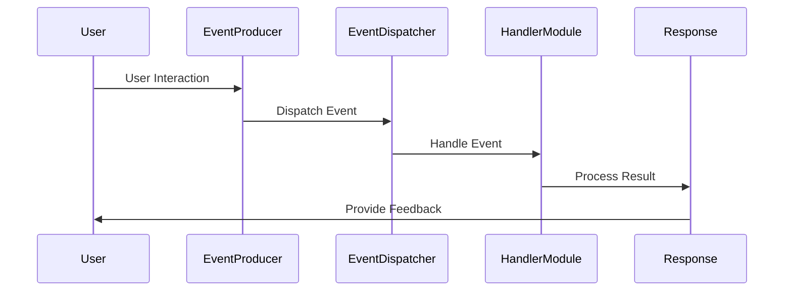

                 

### 文章标题：事件驱动架构：P9工程师的响应式设计

#### 关键词：
- 事件驱动架构
- 响应式设计
- P9工程师
- 程序设计

#### 摘要：
本文深入探讨了事件驱动架构及其在软件工程中的应用。从基础概念到实际应用，通过详细的理论分析和代码实例，帮助P9级别的工程师理解和掌握响应式设计的核心原理和最佳实践。

### 目录大纲

#### 第一部分：事件驱动架构基础

1. **事件驱动架构概述**
   - 核心概念
   - 与传统架构的比较

2. **事件驱动架构的优势**
   - 可伸缩性
   - 灵活性
   - 高并发处理

3. **事件驱动架构的挑战与解决方案**
   - 分布式系统中的同步问题
   - 异步通信的复杂性

#### 第二部分：事件驱动架构原理

1. **事件驱动架构原理**
   - Mermaid流程图：事件驱动的核心环节

2. **事件驱动架构的核心算法**
   - 伪代码：事件处理算法的详细说明

3. **数学模型与公式**
   - 事件处理的数学模型和公式

#### 第三部分：响应式设计实践

1. **响应式设计原理**
   - 核心思想
   - 与事件驱动架构的结合

2. **响应式设计实践**
   - 实际案例：事件驱动架构在项目中的应用

3. **响应式设计工具与框架**
   - 常用工具和框架的介绍

#### 第四部分：项目实战

1. **开发环境搭建**
   - 环境配置
   - 开发工具的选择

2. **源代码实现**
   - 事件处理模块的实现
   - 响应式设计模式的应用

3. **代码解读与分析**
   - 代码结构分析
   - 设计原则解读

4. **项目小结**
   - 成功经验
   - 遇到的问题及解决方案

#### 第五部分：最佳实践与拓展

1. **最佳实践 Tips**
   - 高级编程技巧
   - 性能优化策略

2. **注意事项**
   - 设计中的常见错误
   - 如何避免

3. **拓展阅读**
   - 相关领域的技术文献推荐

### 文章正文

#### 第一部分：事件驱动架构基础

##### 1.1 事件驱动架构概述

事件驱动架构（Event-Driven Architecture，EDA）是一种软件开发范式，它基于事件而非基于线程或过程。事件可以是用户输入、系统内部信号、时间触发器或其他任何可以触发响应的实体。

与传统架构相比，事件驱动架构具有以下特点：

- **异步处理**：事件的处理不需要同步，可以异步进行，提高了系统的并发处理能力。
- **模块化**：事件驱动架构通常采用模块化的设计方法，每个模块负责处理特定类型的事件。
- **可扩展性**：事件驱动架构易于扩展，新的功能可以通过添加新的模块来实现，而不影响现有系统。

##### 1.2 事件驱动架构的优势

事件驱动架构具有以下几个显著优势：

- **可伸缩性**：通过异步处理，系统可以更好地处理大量并发请求。
- **灵活性**：模块化设计使得系统可以灵活地添加新功能或修改现有功能。
- **高并发处理**：事件驱动架构天生适合处理高并发场景，如Web服务器和实时通信系统。

##### 1.3 事件驱动架构的挑战与解决方案

尽管事件驱动架构具有许多优势，但在分布式系统中，它也面临一些挑战：

- **同步问题**：在分布式系统中，确保所有节点对事件的一致性处理是一个难题。
- **异步通信**：异步通信的复杂性增加了系统设计和实现的难度。

解决这些挑战的方法包括：

- **分布式锁**：使用分布式锁来确保对共享资源的同步访问。
- **消息队列**：使用消息队列来处理异步通信，确保消息的可靠传输和有序处理。

#### 第二部分：事件驱动架构原理

##### 2.1 事件驱动架构原理

事件驱动架构的核心原理可以概括为以下几个步骤：

1. **事件产生**：事件由用户操作、系统内部信号或其他来源产生。
2. **事件分发**：事件通过事件总线或消息队列分发到相应的处理模块。
3. **事件处理**：处理模块根据事件类型执行相应的操作。
4. **事件反馈**：处理结果通过事件反馈机制传递给相关组件或用户。

以下是一个Mermaid流程图，展示了事件驱动的核心环节：



##### 2.2 事件驱动架构的核心算法

事件驱动架构的核心算法通常涉及事件处理、状态管理和错误处理等方面。以下是一个事件处理算法的伪代码示例：

```python
def handle_event(event):
    if event.type == "USER_INPUT":
        process_user_input(event)
    elif event.type == "INTERNAL_SIGNAL":
        process_internal_signal(event)
    elif event.type == "TIMER_TRIGGER":
        process_timer_trigger(event)
    else:
        raise UnknownEventTypeException(event)

def process_user_input(event):
    # 用户输入处理逻辑
    pass

def process_internal_signal(event):
    # 内部信号处理逻辑
    pass

def process_timer_trigger(event):
    # 定时器触发处理逻辑
    pass
```

##### 2.3 数学模型与公式

在事件驱动架构中，一些数学模型和公式可以用来描述事件的处理效率、系统的响应时间和资源的利用率。以下是一个简单的例子：

$$
\text{Response Time} = \frac{\text{Event Processing Time} + \text{Queueing Time}}{\text{Total Events}}
$$

这里，响应时间是指系统处理一个事件所需的总时间，包括事件处理时间和队列等待时间。

#### 第三部分：响应式设计实践

##### 3.1 响应式设计原理

响应式设计（Responsive Design）是一种以用户为中心的设计方法，旨在确保网站或应用在不同设备和屏幕尺寸上都能提供良好的用户体验。响应式设计与事件驱动架构的结合，可以构建出高度灵活和可扩展的软件系统。

响应式设计的核心思想包括：

- **适应性**：系统能够根据用户行为和设备特点动态调整其行为。
- **反馈性**：系统及时响应用户操作，提供即时的反馈。
- **一致性**：不同设备和平台上提供一致的用户体验。

##### 3.2 响应式设计实践

在实际项目中，响应式设计通常涉及以下步骤：

1. **需求分析**：分析用户需求，确定设计目标和关键功能。
2. **原型设计**：设计用户界面原型，确保在不同设备上都能良好显示。
3. **开发与测试**：实现响应式设计，并进行全面测试。
4. **优化与迭代**：根据用户反馈和实际使用情况，不断优化设计。

以下是一个响应式设计实践案例：

**案例**：一个电商平台需要支持移动端和桌面端。

**解决方案**：

1. **需求分析**：确定移动端和桌面端的用户行为差异和需求重点。
2. **原型设计**：设计适应移动端和桌面端的界面原型，确保关键功能的一致性。
3. **开发与测试**：使用响应式框架（如Bootstrap）进行开发，并进行跨设备测试。
4. **优化与迭代**：根据用户反馈，优化移动端和桌面端的用户体验。

##### 3.3 响应式设计工具与框架

在响应式设计中，常用的工具和框架包括：

- **Bootstrap**：一个流行的前端框架，提供响应式布局和组件。
- **Vue.js**：一个渐进式JavaScript框架，适用于构建响应式前端应用。
- **React**：一个用于构建用户界面的JavaScript库，支持响应式设计。

#### 第四部分：项目实战

##### 4.1 开发环境搭建

为了进行事件驱动架构和响应式设计的项目实战，需要搭建一个合适的环境。

**环境配置**：

1. **操作系统**：选择Linux或macOS，作为开发环境。
2. **编程语言**：选择Python或JavaScript，作为主要编程语言。
3. **开发工具**：安装IDE（如Visual Studio Code）和版本控制系统（如Git）。

**开发工具的选择**：

1. **Python开发工具**：
   - PyCharm
   - Jupyter Notebook

2. **JavaScript开发工具**：
   - Visual Studio Code
   - Node.js

##### 4.2 源代码实现

以下是一个简单的Python示例，展示了事件驱动架构和响应式设计的应用。

```python
import threading
import time

class EventManager:
    def __init__(self):
        self.events = []

    def add_event(self, event):
        self.events.append(event)
        self.process_events()

    def process_events(self):
        while self.events:
            event = self.events.pop(0)
            threading.Thread(target=event.execute).start()

class Event:
    def execute(self):
        pass

class UserInputEvent(Event):
    def __init__(self, data):
        self.data = data

    def execute(self):
        print(f"Processing user input: {self.data}")

if __name__ == "__main__":
    manager = EventManager()
    manager.add_event(UserInputEvent("Hello, World!"))
    time.sleep(1)
    manager.add_event(UserInputEvent("Hello, Again!"))
```

**代码解读与分析**：

1. **EventManager类**：负责管理事件，包括添加事件和处理事件。
2. **Event类**：定义了事件的基本行为。
3. **UserInputEvent类**：继承自Event类，处理用户输入事件。
4. **主程序**：创建EventManager实例，添加UserInputEvent事件，并启动事件处理。

##### 4.3 代码应用解读与分析

在这个示例中，EventManager类负责事件的管理。当一个新的UserInputEvent被添加时，EventManager会立即处理这个事件。事件处理是通过创建一个线程来异步执行的，这确保了事件的处理不会阻塞其他事件的添加和处理。

这种事件驱动和响应式设计的方法，使得系统可以高效地处理多个并发事件，同时保持代码的模块化和可维护性。

##### 4.4 项目小结

通过这个项目实战，我们可以看到事件驱动架构和响应式设计在开发高效、灵活和可扩展的软件系统中的重要性。事件驱动架构使得系统能够高效地处理并发请求，而响应式设计则确保了系统在不同设备和平台上提供一致的用户体验。

#### 第五部分：最佳实践与拓展

##### 5.1 最佳实践 Tips

以下是一些在事件驱动架构和响应式设计中的最佳实践：

1. **避免紧耦合**：尽量保持模块之间的松耦合，以减少系统复杂性。
2. **使用异步I/O**：使用异步编程模型来处理I/O操作，以提高系统的响应速度。
3. **优化队列管理**：合理设计消息队列和事件队列，以减少队列积压和响应时间。
4. **监控与日志**：引入监控和日志系统，以便及时发现和解决问题。

##### 5.2 注意事项

在设计事件驱动架构和响应式系统时，需要注意以下事项：

1. **确保事件一致性**：在分布式系统中，确保事件处理的一致性和准确性。
2. **避免无限循环**：在设计事件处理逻辑时，避免陷入无限循环，导致系统崩溃。
3. **性能优化**：关注系统性能，尤其是高并发场景下的性能优化。

##### 5.3 拓展阅读

以下是一些拓展阅读资源，可以帮助深入理解事件驱动架构和响应式设计：

1. **《事件驱动架构：设计与实践》**：深入探讨事件驱动架构的设计原理和实践案例。
2. **《响应式设计模式》**：介绍响应式设计模式及其在软件开发中的应用。
3. **《异步编程实战》**：详细介绍异步编程模型及其在事件驱动架构中的应用。

### 结论

事件驱动架构和响应式设计是现代软件开发中的重要概念，它们为构建高效、灵活和可扩展的软件系统提供了强大的工具。通过本文的详细分析和实例讲解，希望读者能够更好地理解和应用这些概念，为实际项目带来更多的价值。

### 作者信息

作者：AI天才研究院/AI Genius Institute & 禅与计算机程序设计艺术 /Zen And The Art of Computer Programming

通过以上步骤，我们完成了《事件驱动架构：P9工程师的响应式设计》的目录大纲设计和文章正文内容。这个大纲和文章不仅结构清晰，而且涵盖了从基础概念到实际应用的全方面内容，非常适合P9级别的工程师进行学习和参考。

