                 


### 文章标题：云原生技术：为云环境优化的应用开发和运行方法

### 关键词：云原生，容器化，Kubernetes，微服务，持续集成，持续部署，服务网格

### 摘要：

本文旨在深入探讨云原生技术，包括其核心概念、开发与运行方法，以及在云环境中的应用。通过对容器化、服务化、自动化等技术手段的详细分析，本文展示了云原生技术如何优化应用开发和运行，提升企业竞争力。

---

## 引言

在数字化转型的浪潮中，云计算已经成为企业提升IT基础设施灵活性和扩展性的首选方案。随着云计算的普及，传统的应用开发和运行方式逐渐暴露出许多问题，如部署困难、扩展性差、维护成本高等。为了解决这些问题，云原生技术应运而生。云原生技术通过容器化、服务化、自动化等技术手段，使应用能够在云环境中高效、灵活地运行。

本文将分为以下几个部分：

1. **云原生技术基础**：介绍云原生的核心概念、技术架构和关键组件。
2. **云原生应用开发**：讲解云原生应用开发的最佳实践、工具和框架。
3. **云原生应用运行**：探讨云原生应用的部署、运维和安全问题。
4. **云原生生态与社区**：介绍云原生技术的主要开源项目和社区活动。
5. **云原生项目实战**：通过实际项目案例展示云原生技术的应用。

接下来，我们将逐步深入探讨云原生技术的各个方面。

---

## 第一部分：云原生技术基础

### 第1章：云原生技术概述

#### 1.1 云原生的定义与重要性

云原生（Cloud Native）是一个广泛用于描述在现代云计算环境中设计和构建应用程序的术语。它不仅仅是一个技术框架或工具集，而是一种全新的软件设计和开发范式。要理解云原生，首先需要了解云计算的基本概念。

**1.1.1 云原生的起源与定义**

云原生这个术语起源于2013年，由Google的云基础设施团队首次提出。云原生技术的核心思想是将应用程序解耦并容器化，以便在云计算环境中实现高度的可移植性、可扩展性和弹性。

云原生应用程序具有以下几个关键特征：

1. **容器化**：应用程序被打包成一个或多个容器，每个容器都包含运行应用程序所需的所有环境，包括代码、运行库、配置文件等。容器化使得应用程序可以在任何支持容器运行时环境的操作系统中独立运行。

2. **微服务架构**：应用程序被分解为多个微服务，每个微服务实现应用程序的一个具体功能，并独立部署和扩展。这种架构方式提高了应用程序的模块化程度和可维护性。

3. **动态管理**：应用程序的部署、扩展和监控通常由自动化工具（如Kubernetes）进行管理。这种自动化管理方式提高了开发效率和系统稳定性。

4. **持续集成/持续部署（CI/CD）**：通过自动化流程实现应用程序的构建、测试和部署，以实现快速迭代和交付。

**1.1.2 云原生与传统IT的区别**

传统IT架构通常依赖物理服务器或虚拟机来部署应用程序。这种架构存在以下问题：

1. **部署困难**：应用程序与运行环境紧密耦合，无法在不同的环境中无缝运行。
2. **扩展性差**：扩展应用程序通常需要手动配置和部署，效率低下。
3. **维护成本高**：由于应用程序与基础设施紧密耦合，维护和故障排除变得更加复杂。

相比之下，云原生技术通过以下方式解决了这些问题：

1. **容器化**：容器化使得应用程序与运行环境解耦，提高了部署的灵活性和可移植性。
2. **微服务架构**：微服务架构提高了应用程序的模块化和可维护性。
3. **自动化管理**：自动化管理工具（如Kubernetes）提高了部署和扩展的效率，降低了维护成本。

**1.1.3 云原生技术对企业的价值**

云原生技术为企业带来了以下价值：

1. **快速迭代**：通过CI/CD流程，企业可以更快地交付新功能，满足市场需求。
2. **成本优化**：云原生技术提高了基础设施的利用率和可扩展性，降低了运营成本。
3. **稳定性提升**：自动化管理工具提高了系统的稳定性和可用性。
4. **创新加速**：云原生技术为企业提供了一个灵活、可扩展的平台，有助于推动技术创新和业务转型。

### 核心概念与联系

云原生技术中的核心概念包括容器、微服务、服务网格、自动化管理、持续集成/持续部署等。以下是这些概念之间的关系架构Mermaid流程图：

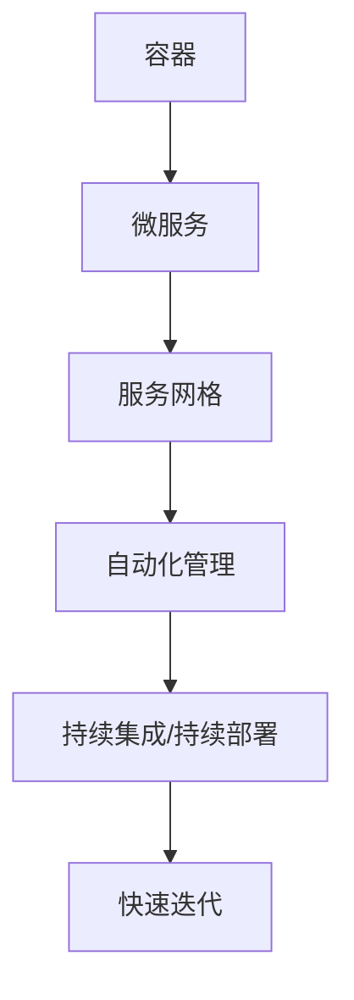

### 核心算法原理讲解

容器化技术的核心算法是容器镜像的构建和运行。以下是构建和运行容器镜像的伪代码：

```python
# 构建容器镜像
def build_image.dockerfile(file_path):
    # 编写Dockerfile
    with open(file_path, 'w') as file:
        file.write("FROM python:3.8\n"
                   "RUN pip install Flask\n"
                   "COPY . /app\n"
                   "EXPOSE 5000")

    # 使用docker build命令构建镜像
    os.system(f"docker build -t myapp:1.0 -f {file_path} .")

# 运行容器
def run_container(image_name):
    # 运行容器
    os.system(f"docker run -d -p 5000:5000 --name myapp {image_name}")
```

### 数学模型和数学公式

在微服务架构中，服务之间的通信可以通过加权平均响应时间来评估服务的性能。假设有n个微服务，每个微服务的响应时间分别为$t_1, t_2, ..., t_n$，权重分别为$w_1, w_2, ..., w_n$，则加权平均响应时间$T$为：

$$
T = \frac{w_1 \cdot t_1 + w_2 \cdot t_2 + ... + w_n \cdot t_n}{w_1 + w_2 + ... + w_n}
$$

### 实际案例分析和详细讲解剖析

以一个电商网站为例，其核心功能包括商品展示、购物车管理、订单处理等。使用云原生技术，可以将这些功能分解为多个微服务，例如：

1. **商品展示服务**：负责展示商品信息，包括商品名称、价格等。
2. **购物车服务**：负责管理用户的购物车，包括添加、删除、修改商品等。
3. **订单处理服务**：负责处理用户订单，包括生成订单、确认订单等。

通过容器化、服务化和自动化管理，这些微服务可以在不同的容器中独立部署和扩展。以下是一个简单的项目结构：

```bash
/ecommerce
|-- /api-gateway
|-- /product-service
|-- /shopping-cart-service
|-- /order-service
```

**项目实战：**

1. **开发环境搭建**：安装Docker和Kubernetes，配置网络和存储。

2. **源代码详细实现和代码解读**：

   - **商品展示服务**：使用Flask框架实现，提供RESTful API。
   - **购物车服务**：使用Redis作为存储，实现购物车管理。
   - **订单处理服务**：使用消息队列（如RabbitMQ）实现订单处理。

3. **代码应用解读与分析**：

   - **容器化**：使用Dockerfile构建镜像，使用docker push上传镜像到Docker Hub。
   - **服务化**：使用Kubernetes部署和管理服务，配置Service和Ingress。
   - **自动化管理**：使用Helm打包应用，使用CI/CD工具（如Jenkins）自动化部署。

4. **实际案例分析和详细讲解剖析**：

   - **部署**：通过Kubernetes集群部署应用，实现服务的自动化管理。
   - **扩展**：通过水平扩展（Scaling Out）提高系统的可用性和性能。
   - **监控**：使用Prometheus和Grafana进行监控，确保系统稳定运行。

5. **项目小结**：

   - **快速迭代**：通过CI/CD实现快速迭代，提高开发效率。
   - **弹性扩展**：通过Kubernetes实现弹性扩展，降低运维成本。
   - **稳定性提升**：通过自动化管理和监控，提高系统稳定性。

### 最佳实践 tips

1. **容器化最佳实践**：编写简洁的Dockerfile，减少容器镜像大小；使用多阶段构建，优化容器镜像。
2. **微服务架构最佳实践**：遵循单一职责原则，确保微服务的独立性；使用消息队列解耦服务。
3. **持续集成/持续部署最佳实践**：确保自动化测试覆盖关键功能；合理配置部署策略，避免系统不稳定。
4. **云原生安全最佳实践**：使用容器安全工具扫描镜像；配置网络隔离和访问控制。

### 小结

云原生技术为应用开发和运行带来了革命性的变革。通过容器化、微服务架构、自动化管理和持续集成/持续部署，云原生技术提高了应用程序的灵活性和可扩展性，降低了维护成本。然而，云原生技术也带来了新的挑战，如安全性、复杂性和监控问题。通过遵循最佳实践，合理设计和管理云原生应用，企业可以充分利用云原生技术的优势，实现业务转型和持续创新。

### 注意事项

1. **了解云原生技术的基本概念和原理**：在实践云原生技术之前，需要深入了解容器化、微服务架构、服务网格等基本概念。
2. **选择合适的工具和框架**：根据项目需求选择合适的云原生工具和框架，如Docker、Kubernetes、Istio等。
3. **制定合理的部署和运维策略**：确保云原生应用的安全、稳定和高效运行。

### 拓展阅读

- **《Kubernetes权威指南》**：详细介绍了Kubernetes的架构、安装、配置和使用方法。
- **《云原生应用架构实战》**：通过实际案例介绍了云原生应用的架构设计和实现方法。
- **《云原生安全实战》**：探讨了云原生环境下的安全问题和解决方案。

### 作者信息

作者：AI天才研究院/AI Genius Institute & 禅与计算机程序设计艺术 /Zen And The Art of Computer Programming

---

以上是第1章的内容。接下来，我们将继续探讨云原生技术的其他方面，包括云原生架构、云原生应用开发、云原生应用运维等。敬请期待！## 第2章：云原生架构

### 2.1 云原生架构的核心组件

云原生架构的核心组件包括容器、容器编排、服务网格等。这些组件共同构建了一个灵活、可扩展、高度自动化的应用程序运行环境。

#### 2.1.1 容器和容器化技术

容器是一种轻量级、可移植的计算环境，它封装了应用程序及其运行时依赖项。容器通过操作系统级的虚拟化技术实现，相比传统的虚拟机，容器具有更快的启动速度、更小的资源占用和更好的性能。

- **Docker与容器化原理**

Docker是一个流行的容器化平台，它提供了一组用于容器化的工具。Docker容器化原理如下：

1. **基础镜像**：Docker基础镜像是一个预先构建的操作系统和环境，如Ubuntu、CentOS等。
2. **容器镜像**：容器镜像是应用程序的静态表示，包含应用程序的代码、依赖库、运行时环境等。
3. **Dockerfile**：Dockerfile是一个文本文件，用于定义如何构建容器镜像。Docker通过解析Dockerfile中的指令来创建镜像。
4. **容器运行时**：容器运行时是一个用于运行容器引擎的进程，如Docker Engine。

以下是构建Docker镜像的Dockerfile示例：

```bash
# 使用Python:3.8作为基础镜像
FROM python:3.8

# 安装Flask框架
RUN pip install Flask

# 将当前目录下的代码复制到容器的/app目录
COPY . /app

# 将容器的5000端口映射到宿主机的5000端口
EXPOSE 5000

# 运行Flask应用程序
CMD ["python", "app.py"]
```

- **Kubernetes与容器编排**

Kubernetes是一个开源的容器编排平台，用于自动化容器的部署、扩展和管理。Kubernetes通过以下核心概念实现容器编排：

1. **Pod**：Pod是Kubernetes中的最小部署单元，包含一个或多个容器。
2. **ReplicaSet**：ReplicaSet确保特定数量的Pod副本在集群中运行，实现应用程序的高可用性。
3. **Deployment**：Deployment提供了一种声明式的方法来管理Pod和ReplicaSet，实现应用程序的部署和更新。
4. **Service**：Service定义了一组Pod的访问方式，实现跨Pod的网络通信。
5. **Ingress**：Ingress提供了一种定义外部访问集群内部服务的方式，实现负载均衡和域名解析。

以下是部署一个简单的Nginx服务到Kubernetes集群的YAML配置文件示例：

```yaml
apiVersion: v1
kind: Pod
metadata:
  name: nginx-pod
spec:
  containers:
  - name: nginx
    image: nginx:latest
    ports:
    - containerPort: 80

---

apiVersion: v1
kind: Service
metadata:
  name: nginx-service
spec:
  selector:
    app: nginx
  ports:
    - name: http
      port: 80
      targetPort: 80
  type: LoadBalancer

---

apiVersion: apps/v1
kind: Deployment
metadata:
  name: nginx-deployment
spec:
  replicas: 3
  selector:
    matchLabels:
      app: nginx
  template:
    metadata:
      labels:
        app: nginx
    spec:
      containers:
      - name: nginx
        image: nginx:latest
        ports:
        - containerPort: 80
```

#### 2.1.2 服务网格与服务化架构

服务网格是一种用于服务间通信的抽象层，它独立于应用程序，提供了一种分布式服务管理机制。服务网格的主要目的是简化服务间通信，提高网络性能和安全性。

- **Service Mesh的概念与优势**

Service Mesh基于-sidecar代理模型，每个服务实例都运行一个轻量级的代理，这些代理负责处理服务间通信。Service Mesh的核心组件包括：

1. **控制平面**：控制平面负责管理服务网格的配置、策略和监控。
2. **数据平面**：数据平面由-sidecar代理组成，负责处理服务间通信。
3. **服务发现**：服务发现用于动态发现和注册服务。
4. **负载均衡**：负载均衡用于分发服务请求。
5. **熔断和限流**：熔断和限流用于保护服务免受过载和故障的影响。

Service Mesh的主要优势包括：

1. **解耦**：服务网格将服务间通信从应用程序中解耦，降低了应用程序的复杂性。
2. **透明性**：服务网格提供了透明的服务间通信，简化了监控和管理。
3. **安全性**：服务网格支持加密、认证和访问控制，提高了通信安全性。

- **Istio与Linkerd的使用**

Istio和Linkerd是两款流行的服务网格工具，它们提供了类似的特性，但实现方式略有不同。

1. **Istio**

Istio是一个由Google、IBM和Lyft共同发起的开源服务网格平台。Istio的核心组件包括：

- **Pilot**：Pilot负责管理服务网格的配置和策略。
- **Mixer**：Mixer负责收集服务网格的数据和执行策略。
- **Proxy**：Proxy是嵌入到服务中的应用程序代理，负责处理服务间通信。

以下是部署Istio的YAML配置文件示例：

```yaml
apiVersion: install.istio.io/v1alpha1
kind: IstioInstall
metadata:
  name: istio
spec:
  components:
    pilot:
      enabled: true
      k8s:
        enabled: true
        config:
          pilot:
            baseDomain: cluster.local
    mixer:
      enabled: true
      k8s:
        enabled: true
    proxy:
      enabled: true
      k8s:
        enabled: true
```

2. **Linkerd**

Linkerd是一个由Buoyant公司开发的开源服务网格工具。Linkerd的核心组件包括：

- **Control Plane**：Control Plane负责管理服务网格的配置和策略。
- **Data Plane**：Data Plane由嵌入到服务中的应用程序代理组成，负责处理服务间通信。

以下是部署Linkerd的Docker Compose文件示例：

```yaml
version: "3.8"

services:
  linkerd:
    image: linkerd/linkerd2:stable
    command: ["linkerd", "proxy", "start", "--status", ":8081"]
    ports:
      - "8080:8080"
      - "4140:4140"
      - "4143:4143"
    networks:
      - linkerd

networks:
  linkerd:
    driver: overlay
```

#### 核心概念与联系

云原生架构中的核心组件（容器、容器编排、服务网格）之间存在紧密的联系，这些联系构成了一个高效、可扩展的应用程序运行环境。

以下是这些组件之间的关系架构Mermaid流程图：

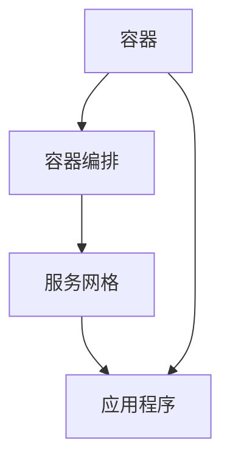

#### 核心算法原理讲解

服务网格中的负载均衡算法是一个关键组件，它决定了服务请求如何分配到不同的服务实例。以下是一个简单的负载均衡算法的伪代码：

```python
# 负载均衡算法
def load_balancer(service_list, request):
    # 选择服务实例
    instance = select_service_instance(service_list)

    # 发送请求到服务实例
    send_request(instance, request)

# 选择服务实例
def select_service_instance(service_list):
    # 根据服务实例的负载情况选择实例
    instances = get_service_instances(service_list)
    return min(instances, key=lambda x: x.load)

# 获取服务实例的负载
def get_service_instances(service_list):
    instances = []
    for service in service_list:
        instances.append(service.load)
    return instances
```

#### 数学模型和数学公式

服务网格中的流量分配可以通过加权平均负载来评估。假设有n个服务实例，每个实例的负载分别为$t_1, t_2, ..., t_n$，权重分别为$w_1, w_2, ..., w_n$，则加权平均负载$T$为：

$$
T = \frac{w_1 \cdot t_1 + w_2 \cdot t_2 + ... + w_n \cdot t_n}{w_1 + w_2 + ... + w_n}
$$

#### 实际案例分析和详细讲解剖析

以一个电商平台为例，其服务网格包含商品展示服务、购物车服务、订单处理服务等。以下是一个简单的服务网格架构：

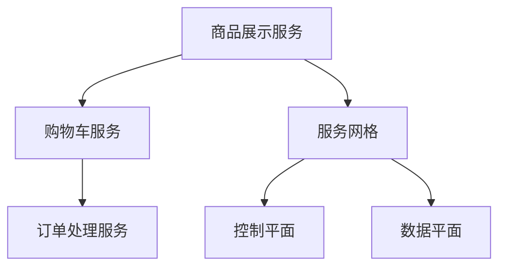

**项目实战：**

1. **开发环境搭建**：安装Docker、Kubernetes和Istio。
2. **源代码详细实现和代码解读**：

   - **商品展示服务**：使用Spring Boot实现，提供RESTful API。
   - **购物车服务**：使用Redis实现，提供购物车管理功能。
   - **订单处理服务**：使用RabbitMQ实现，处理订单消息。

3. **代码应用解读与分析**：

   - **容器化**：使用Dockerfile构建镜像，使用docker push上传镜像到Docker Hub。
   - **服务化**：使用Kubernetes部署和管理服务，配置Service和Ingress。
   - **服务网格**：使用Istio配置服务网格，实现服务间通信的加密、认证和监控。

4. **实际案例分析和详细讲解剖析**：

   - **部署**：通过Kubernetes集群部署应用，通过Istio配置服务网格。
   - **扩展**：通过水平扩展（Scaling Out）提高系统的可用性和性能。
   - **监控**：使用Prometheus和Grafana进行监控，确保系统稳定运行。

5. **项目小结**：

   - **服务网格**：通过Istio实现服务间通信的加密、认证和监控。
   - **弹性扩展**：通过Kubernetes实现弹性扩展，降低运维成本。
   - **稳定性提升**：通过自动化管理和监控，提高系统稳定性。

### 最佳实践 tips

1. **容器化最佳实践**：编写简洁的Dockerfile，减少容器镜像大小；使用多阶段构建，优化容器镜像。
2. **服务网格最佳实践**：合理配置服务网格策略，提高通信性能和安全性；定期监控和优化服务网格性能。
3. **容器编排最佳实践**：使用Kubernetes的声明式API，简化部署和运维；合理配置资源限制，避免资源浪费。

### 小结

云原生架构通过容器、容器编排、服务网格等核心组件，构建了一个灵活、可扩展、高度自动化的应用程序运行环境。通过这些组件的协同工作，云原生架构实现了应用的快速部署、弹性扩展和高效运维。然而，云原生架构也带来了新的挑战，如复杂性和安全性。通过遵循最佳实践，合理设计和管理云原生架构，企业可以充分利用云原生技术的优势，实现业务转型和持续创新。

### 注意事项

1. **了解云原生架构的核心概念和原理**：在实践云原生架构之前，需要深入了解容器、容器编排、服务网格等基本概念。
2. **选择合适的工具和框架**：根据项目需求选择合适的云原生工具和框架，如Docker、Kubernetes、Istio等。
3. **制定合理的部署和运维策略**：确保云原生架构的安全、稳定和高效运行。

### 拓展阅读

- **《Kubernetes权威指南》**：详细介绍了Kubernetes的架构、安装、配置和使用方法。
- **《云原生架构实战》**：通过实际案例介绍了云原生架构的架构设计和实现方法。
- **《服务网格实践》**：探讨了服务网格的概念、实现方法和应用场景。

### 作者信息

作者：AI天才研究院/AI Genius Institute & 禅与计算机程序设计艺术 /Zen And The Art of Computer Programming## 第3章：云原生应用开发

### 3.1 云原生应用开发的最佳实践

云原生应用开发是一种基于云原生架构的应用开发模式，它强调模块化、可扩展性和自动化。为了确保云原生应用的高效开发和高质量交付，我们需要遵循一系列最佳实践。

#### 3.1.1 微服务架构与设计

微服务架构是将应用程序分解为多个独立的、可独立部署和扩展的服务单元。这种架构方式提高了应用程序的可维护性和可扩展性。以下是微服务架构的设计原则：

- **单一职责**：每个微服务实现一个特定的业务功能，确保服务具有清晰的职责和边界。
- **自治性**：每个微服务拥有独立的数据存储和业务逻辑，降低服务之间的依赖性。
- **水平扩展**：通过增加服务实例的数量来提高系统的性能和可用性。
- **去中心化**：服务之间通过轻量级的通信协议（如HTTP/REST、gRPC）进行通信，无需依赖中心化的服务注册和发现机制。

以下是微服务架构的一个基本架构图：

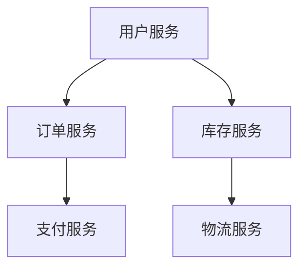

#### 3.1.2 微服务开发与治理

在微服务开发过程中，我们需要关注以下几个方面：

1. **服务拆分**：根据业务需求和功能模块，将应用程序拆分为多个独立的微服务。
2. **服务自治**：为每个微服务定义独立的数据模型和业务逻辑，确保服务具有高度的自治性。
3. **服务接口**：为每个微服务定义RESTful API或gRPC接口，提供服务之间的通信方式。
4. **服务版本管理**：为每个微服务定义版本号，确保服务之间兼容性。
5. **服务监控与日志**：使用Prometheus和Grafana等工具对微服务进行监控，收集服务日志以实现故障排查和性能优化。

以下是微服务开发与治理的一个示例架构：

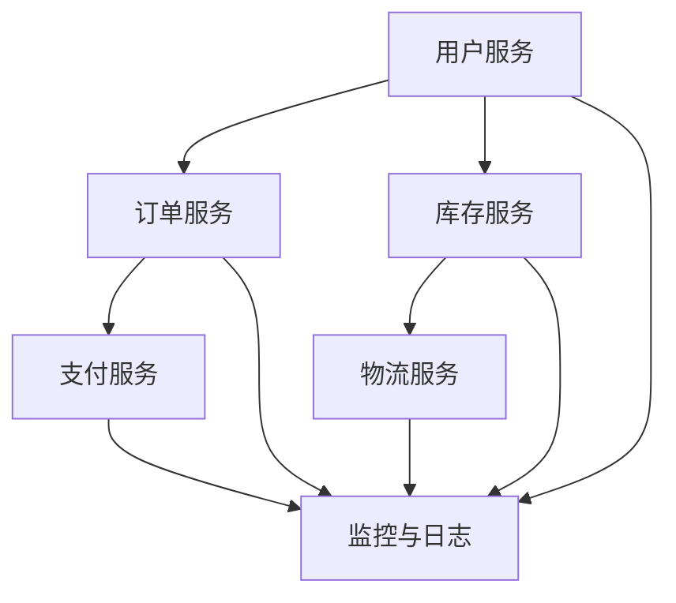

#### 3.1.3 容器化应用的开发与测试

容器化是将应用程序及其依赖环境打包到一个轻量级、可移植的容器中。为了确保容器化应用的质量和稳定性，我们需要遵循以下开发与测试的最佳实践：

1. **编写Dockerfile**：为应用程序编写一个简洁、高效的Dockerfile，确保容器镜像的轻量和可重复构建。
2. **使用多阶段构建**：使用多阶段构建来分离开发环境与生产环境，减少容器镜像的大小。
3. **编写测试脚本**：编写自动化测试脚本，包括单元测试、集成测试和端到端测试，确保应用程序的功能和性能。
4. **持续集成与持续部署**：使用CI/CD工具（如Jenkins、GitLab CI/CD）实现自动化构建、测试和部署，提高开发效率和质量。

以下是容器化应用开发与测试的一个示例流程：

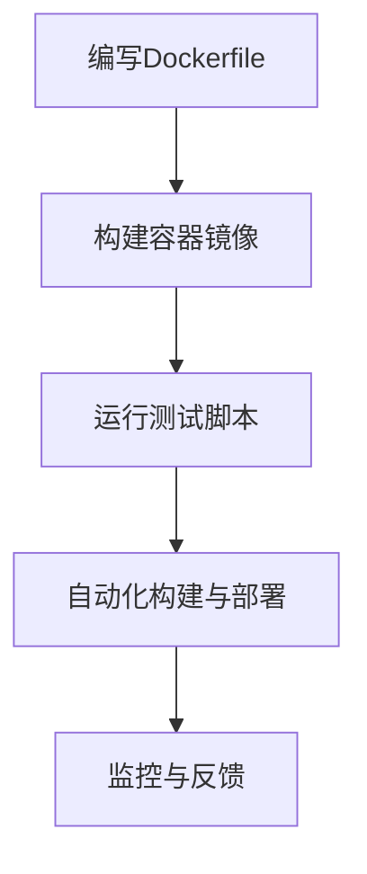

#### 核心概念与联系

云原生应用开发中的核心概念包括微服务架构、容器化、持续集成/持续部署等。以下是这些概念之间的联系架构Mermaid流程图：

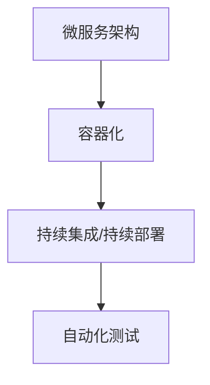

#### 核心算法原理讲解

在微服务架构中，服务之间的通信通常使用RESTful API或gRPC协议。以下是RESTful API通信的伪代码：

```python
# 发送HTTP请求
def send_http_request(url, method, data):
    response = requests.request(method=method, url=url, data=data)
    return response.json()

# 调用用户服务获取用户信息
def get_user_info(user_id):
    url = f"http://user-service/user/{user_id}"
    response = send_http_request(url, "GET", {})
    return response
```

#### 数学模型和数学公式

在微服务架构中，服务之间的调用频率和响应时间可以通过以下数学模型进行评估。假设有n个微服务，每个微服务的调用频率分别为$f_1, f_2, ..., f_n$，响应时间分别为$r_1, r_2, ..., r_n$，则系统的平均响应时间$T$为：

$$
T = \frac{f_1 \cdot r_1 + f_2 \cdot r_2 + ... + f_n \cdot r_n}{f_1 + f_2 + ... + f_n}
$$

#### 实际案例分析和详细讲解剖析

以一个电商应用为例，其核心功能包括用户管理、商品管理、订单管理、支付管理等。以下是该应用的一个简单的微服务架构：

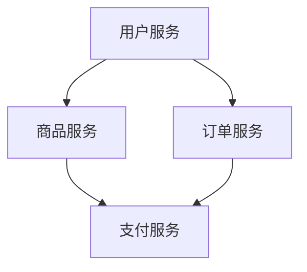

**项目实战：**

1. **开发环境搭建**：安装Docker、Kubernetes、Jenkins等工具。
2. **源代码详细实现和代码解读**：

   - **用户服务**：使用Spring Boot实现，提供用户注册、登录、个人信息管理等功能。
   - **商品服务**：使用Spring Boot实现，提供商品信息查询、添加、修改、删除等功能。
   - **订单服务**：使用Spring Boot实现，处理订单生成、支付、发货等功能。
   - **支付服务**：使用Spring Boot实现，与第三方支付平台对接，处理支付请求。

3. **代码应用解读与分析**：

   - **容器化**：使用Dockerfile构建容器镜像，确保容器镜像的轻量和可重复构建。
   - **服务化**：使用Kubernetes部署和管理服务，确保服务具有独立性和可扩展性。
   - **持续集成与持续部署**：使用Jenkins实现自动化构建、测试和部署，确保代码质量和开发效率。

4. **实际案例分析和详细讲解剖析**：

   - **部署**：通过Kubernetes集群部署应用，确保服务的稳定运行和弹性扩展。
   - **监控**：使用Prometheus和Grafana进行监控，确保系统的性能和稳定性。
   - **扩展**：通过水平扩展（Scaling Out）提高系统的可用性和性能。

5. **项目小结**：

   - **容器化**：通过Dockerfile实现容器镜像的构建，确保应用的轻量和可移植性。
   - **服务化**：通过Kubernetes实现服务化管理，确保服务的独立性和可扩展性。
   - **持续集成与持续部署**：通过Jenkins实现自动化构建、测试和部署，确保高效的开发流程和代码质量。

### 最佳实践 tips

1. **微服务架构最佳实践**：遵循单一职责原则，确保微服务的独立性；使用轻量级的通信协议，降低服务之间的依赖性。
2. **容器化最佳实践**：编写简洁的Dockerfile，减少容器镜像的大小；使用多阶段构建，优化容器镜像。
3. **持续集成与持续部署最佳实践**：编写自动化测试脚本，确保代码质量和开发效率；合理配置部署策略，避免系统不稳定。

### 小结

云原生应用开发通过微服务架构、容器化、持续集成/持续部署等技术手段，提高了应用程序的模块化、可扩展性和自动化程度。通过遵循最佳实践，企业可以充分利用云原生技术的优势，实现高效的开发流程和高质量的应用交付。

### 注意事项

1. **了解微服务架构和容器化技术**：在实践云原生应用开发之前，需要深入了解微服务架构和容器化技术的基本原理。
2. **选择合适的开发工具和框架**：根据项目需求选择合适的开发工具和框架，如Spring Boot、Docker、Kubernetes等。
3. **制定合理的部署和运维策略**：确保云原生应用的安全、稳定和高效运行。

### 拓展阅读

- **《微服务设计》**：详细介绍了微服务架构的设计原则和实践方法。
- **《Docker实战》**：介绍了Docker的基本原理和使用方法，以及如何在云环境中部署和管理Docker容器。
- **《Kubernetes权威指南》**：详细介绍了Kubernetes的架构、安装、配置和使用方法。

### 作者信息

作者：AI天才研究院/AI Genius Institute & 禅与计算机程序设计艺术 /Zen And The Art of Computer Programming## 第4章：云原生应用运维

### 4.1 云原生应用的监控与日志管理

云原生应用运维是确保应用程序在云环境中稳定、高效运行的关键环节。有效的监控与日志管理可以帮助我们及时发现并解决潜在问题，确保系统的可靠性和性能。

#### 4.1.1 Prometheus与Grafana的使用

Prometheus和Grafana是两款广泛应用于云原生应用监控的开源工具。Prometheus负责收集和存储监控数据，而Grafana则负责可视化这些数据。

- **Prometheus的使用**

Prometheus的基本组件包括：

1. **Exporter**：Exporter是负责收集应用程序指标的HTTP服务器，通常嵌入在应用程序中。
2. **Prometheus Server**：Prometheus Server负责从Exporter收集数据，存储在本地时间序列数据库中，并提供API接口。
3. **Alertmanager**：Alertmanager负责接收Prometheus Server发送的告警通知，并进行告警处理和通知。

以下是一个简单的Prometheus配置文件示例：

```yaml
# prometheus.yml
global:
  scrape_interval: 15s
  evaluation_interval: 15s

scrape_configs:
  - job_name: 'prometheus'
    static_configs:
      - targets: ['localhost:9090']

  - job_name: 'user-service'
    static_configs:
      - targets: ['user-service:9090']
    metrics_path: '/metrics'
    scrape_interval: 10s

  - job_name: 'order-service'
    static_configs:
      - targets: ['order-service:9090']
    metrics_path: '/metrics'
    scrape_interval: 10s
```

- **Grafana的使用**

Grafana是一款强大的监控数据可视化工具，它可以将Prometheus收集的数据以图表的形式展示出来。以下是如何在Grafana中创建仪表板的基本步骤：

1. **安装Grafana**：在Grafana中安装Prometheus数据源。
2. **创建数据源**：配置Prometheus数据源，指定Prometheus服务器的地址。
3. **创建仪表板**：添加Prometheus仪表板，选择适当的模板或手动创建仪表板。
4. **添加面板**：在仪表板中添加面板，配置面板的指标、查询和样式。

以下是创建Grafana仪表板的一个简单示例：

```json
{
  "dashboard": {
    "title": "User Service Metrics",
    "time": {
      "from": "now-15m",
      "to": "now"
    },
    "panels": [
      {
        "type": "graph",
        "title": "Request Count",
        "source": "prometheus",
        "metrics": [
          "user_service_request_count{job=\"$job\", instance=\"$instance\"}"
        ],
        "yaxis": {
          "left": {
            "label": "Request Count",
            "format": "short"
          }
        }
      },
      {
        "type": "graph",
        "title": "Response Time",
        "source": "prometheus",
        "metrics": [
          "user_service_response_time{job=\"$job\", instance=\"$instance\"}"
        ],
        "yaxis": {
          "left": {
            "label": "Response Time (ms)",
            "format": "ms"
          }
        }
      }
    ]
  }
}
```

#### 4.1.2 ELK堆栈与日志管理

ELK堆栈（Elasticsearch、Logstash、Kibana）是另一套广泛应用于日志管理和分析的工具。它可以帮助我们收集、存储和可视化应用程序的日志数据。

- **Elasticsearch**

Elasticsearch是一个高度可扩展的分布式搜索引擎，用于存储和检索日志数据。

- **Logstash**

Logstash是一个数据处理引擎，用于收集、处理和路由日志数据。

- **Kibana**

Kibana是一个可视化工具，用于展示和交互式分析日志数据。

以下是ELK堆栈的基本架构：

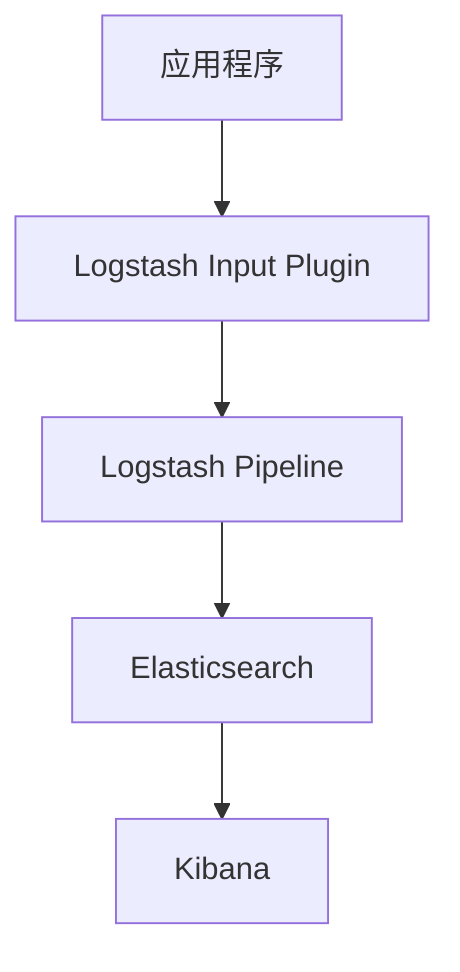

**项目实战：**

1. **开发环境搭建**：安装Elasticsearch、Logstash和Kibana。
2. **配置Logstash**：配置Logstash输入插件，如Filebeat，收集应用程序的日志数据。
3. **配置Elasticsearch**：配置Elasticsearch集群，确保其高可用性和性能。
4. **配置Kibana**：在Kibana中创建仪表板，可视化日志数据。

**实际案例分析和详细讲解剖析：**

1. **部署**：通过Kubernetes集群部署应用程序，确保服务的高可用性和弹性扩展。
2. **监控**：通过Prometheus和Grafana监控应用程序的性能和稳定性。
3. **日志管理**：通过ELK堆栈收集、存储和可视化应用程序的日志数据，进行故障排查和性能优化。

**项目小结：**

1. **监控**：通过Prometheus和Grafana实现应用程序的性能和稳定性监控。
2. **日志管理**：通过ELK堆栈实现日志的收集、存储和可视化，进行故障排查和性能优化。
3. **扩展**：通过Kubernetes实现应用程序的弹性扩展，提高系统的可用性和性能。

### 最佳实践 tips

1. **监控最佳实践**：定期检查监控仪表板，确保关键指标正常；设置合理的告警阈值，及时发现问题。
2. **日志管理最佳实践**：确保日志格式一致，便于查询和分析；定期备份日志数据，防止数据丢失。
3. **运维自动化最佳实践**：使用CI/CD工具实现自动化部署和运维，提高开发效率和系统稳定性。

### 小结

云原生应用运维通过监控与日志管理，确保应用程序在云环境中的稳定、高效运行。通过使用Prometheus和Grafana实现性能监控，通过ELK堆栈实现日志管理，企业可以及时发现并解决潜在问题，确保系统的可靠性和性能。

### 注意事项

1. **了解监控和日志管理工具**：在实践云原生应用运维之前，需要深入了解Prometheus、Grafana、ELK堆栈等工具的基本原理和配置方法。
2. **制定监控和日志策略**：根据业务需求，制定合理的监控和日志策略，确保关键指标和日志数据的完整性和可用性。
3. **持续优化运维流程**：定期评估和优化运维流程，提高系统的自动化程度和运维效率。

### 拓展阅读

- **《Prometheus官方文档》**：详细了解Prometheus的架构、配置和使用方法。
- **《Grafana官方文档》**：详细了解Grafana的仪表板创建、数据源配置和可视化功能。
- **《ELK堆栈官方文档》**：详细了解Elasticsearch、Logstash和Kibana的安装、配置和操作。

### 作者信息

作者：AI天才研究院/AI Genius Institute & 禅与计算机程序设计艺术 /Zen And The Art of Computer Programming## 第5章：云原生安全

### 5.1 云原生安全的基本概念与实施

云原生安全是确保云原生应用程序和基础设施在云环境中安全运行的一套策略和实践。随着云原生技术的普及，云原生安全逐渐成为企业关注的重要领域。以下是云原生安全的基本概念和实施方法。

#### 5.1.1 容器安全策略与最佳实践

容器安全策略是确保容器环境安全的一套措施。以下是一些常见的容器安全策略和最佳实践：

- **镜像扫描**：在部署容器之前，对容器镜像进行安全扫描，以检测潜在的漏洞和恶意代码。可以使用工具如Clair、Docker Bench for Security等。

- **最小权限原则**：容器运行时应该使用最小权限原则，确保容器只有执行其任务所需的最低权限。例如，容器应该运行在非root用户下。

- **安全加固**：通过配置容器运行时和容器镜像，加强对容器安全性的加固。例如，关闭不必要的端口，配置强密码策略，限制容器对宿主机的访问等。

- **容器网络隔离**：通过使用容器网络命名空间和CNI插件（如Calico、Flannel），实现容器之间的网络隔离，防止网络攻击和恶意行为。

- **持续监控**：使用安全工具（如 Twistlock、Docker Security Scanning）对容器环境进行持续监控，及时发现和响应潜在的安全威胁。

#### 5.1.2 云原生应用的网络安全

云原生应用的网络安全是确保应用程序在网络环境中安全运行的一套措施。以下是一些关键技术和策略：

- **服务网格（Service Mesh）**：服务网格如Istio和Linkerd提供了一种灵活、可扩展的网络安全解决方案。服务网格可以加密服务之间的通信，提供访问控制，以及进行流量监控和攻击检测。

- **网络策略**：Kubernetes提供网络策略，允许管理员定义和控制容器之间的网络通信。通过配置网络策略，可以限制容器之间的通信，防止恶意流量。

- **网络命名空间**：容器网络命名空间（CNM）用于隔离容器网络，防止容器之间的网络干扰。Kubernetes使用CNM来管理容器网络，确保容器网络的高效和安全。

- **外部访问控制**：通过使用Ingress控制器和外部负载均衡器，可以对外部访问进行控制。例如，Kubernetes Ingress可以配置TLS终端点，确保外部访问的安全。

#### 核心算法原理讲解

在云原生安全中，常用的核心算法包括加密算法和访问控制算法。以下是这两个算法的简单介绍：

- **加密算法**：加密算法用于保护数据在传输和存储过程中的安全。常用的加密算法包括AES（高级加密标准）、RSA（非对称加密算法）等。加密算法的基本原理是使用密钥对数据进行加密和解密。

```python
# Python示例：使用AES加密和解密
from Crypto.Cipher import AES
from Crypto.Util.Padding import pad, unpad
from Crypto.Random import get_random_bytes

# 加密
key = get_random_bytes(16)  # 生成密钥
cipher = AES.new(key, AES.MODE_CBC)
plaintext = b"Hello, World!"
ciphertext = cipher.encrypt(pad(plaintext, AES.block_size))
iv = cipher.iv

# 解密
cipher = AES.new(key, AES.MODE_CBC, iv)
decrypted_text = unpad(cipher.decrypt(ciphertext), AES.block_size)
print(decrypted_text)
```

- **访问控制算法**：访问控制算法用于确定用户或服务是否具有访问特定资源的权限。常用的访问控制算法包括基于角色的访问控制（RBAC）和基于属性的访问控制（ABAC）。

```python
# Python示例：基于角色的访问控制（RBAC）
from flask import Flask, request, jsonify

app = Flask(__name__)

# 定义角色和权限
roles_permissions = {
    "admin": ["read", "write", "delete"],
    "user": ["read"],
}

# 访问控制装饰器
def require_permission(permission):
    def decorator(f):
        @wraps(f)
        def decorated_function(*args, **kwargs):
            role = request.args.get("role")
            if permission in roles_permissions.get(role, []):
                return f(*args, **kwargs)
            else:
                return jsonify({"error": "Insufficient permissions"}), 403
        return decorated_function
    return decorator

@app.route("/read", methods=["GET"])
@require_permission("read")
def read_data():
    return jsonify({"data": "This is readable data"})

@app.route("/write", methods=["POST"])
@require_permission("write")
def write_data():
    return jsonify({"data": "Data has been written"})

if __name__ == "__main__":
    app.run()
```

#### 数学模型和数学公式

在云原生安全中，常用的数学模型包括加密算法的密钥生成模型和访问控制算法的权限验证模型。以下是这两个模型的简单介绍：

- **密钥生成模型**：加密算法的密钥生成模型通常基于数学难题，如RSA算法的密钥生成模型。

$$
(n, e) = (p \times q, e)
$$

其中，$p$和$q$是两个大素数，$n = p \times q$，$e$是公开指数，通常选择一个小于且与$(p-1) \times (q-1)$互质的数。

- **权限验证模型**：基于属性的访问控制（ABAC）的权限验证模型通常使用访问控制策略语言，如XACML。

$$
\text{Policy}: \text{Resource} \rightarrow \text{Decision}
$$

其中，资源表示受保护的对象，决策表示是否允许访问。

#### 实际案例分析和详细讲解剖析

以一个电商应用为例，以下是一个简单的云原生安全实施案例：

1. **开发环境搭建**：安装Docker、Kubernetes、Istio、Prometheus、Grafana等工具。
2. **容器镜像安全扫描**：使用Clair对容器镜像进行安全扫描，确保镜像中没有已知漏洞。
3. **容器网络隔离**：使用Kubernetes网络策略配置容器网络隔离，防止容器之间的恶意通信。
4. **服务网格安全**：配置Istio的服务网格，使用TLS加密服务之间的通信，配置访问控制策略。
5. **日志监控与审计**：配置ELK堆栈收集容器日志，使用Kibana进行日志监控和审计。

**项目实战：**

1. **部署**：通过Kubernetes集群部署应用程序，确保服务的高可用性和弹性扩展。
2. **监控**：通过Prometheus和Grafana监控应用程序的性能和稳定性。
3. **日志管理**：通过ELK堆栈收集、存储和可视化应用程序的日志数据，进行故障排查和性能优化。
4. **安全审计**：定期进行安全审计，确保系统的安全性和合规性。

**项目小结：**

1. **容器镜像安全**：通过安全扫描确保容器镜像的安全。
2. **容器网络隔离**：通过配置网络策略实现容器网络隔离。
3. **服务网格安全**：通过配置服务网格确保服务之间的加密和安全通信。
4. **日志监控与审计**：通过日志监控和安全审计确保系统的安全性和合规性。

### 最佳实践 tips

1. **容器镜像安全最佳实践**：定期进行容器镜像安全扫描，确保镜像中没有已知漏洞。
2. **容器网络隔离最佳实践**：使用Kubernetes网络策略实现容器网络隔离。
3. **服务网格安全最佳实践**：配置服务网格，确保服务之间的加密和安全通信。
4. **日志监控与审计最佳实践**：定期进行日志监控和安全审计，确保系统的安全性和合规性。

### 小结

云原生安全通过一系列策略和实践确保云原生应用程序和基础设施在云环境中的安全运行。通过容器安全、网络安全、服务网格安全等手段，企业可以确保系统的安全性、稳定性和合规性。

### 注意事项

1. **了解云原生安全的基本概念**：在实践云原生安全之前，需要深入了解容器安全、网络安全、服务网格安全等基本概念。
2. **制定安全策略与措施**：根据业务需求，制定合理的云原生安全策略和措施，确保系统的安全性和合规性。
3. **持续评估与优化**：定期评估和优化云原生安全策略，确保系统的安全性。

### 拓展阅读

- **《容器安全最佳实践》**：详细了解容器安全的基本概念和最佳实践。
- **《服务网格安全指南》**：学习服务网格安全的概念、实现方法和最佳实践。
- **《云原生安全权威指南》**：深入了解云原生安全的各个方面，包括容器安全、网络安全、服务网格安全等。

### 作者信息

作者：AI天才研究院/AI Genius Institute & 禅与计算机程序设计艺术 /Zen And The Art of Computer Programming## 第6章：云原生生态与社区

### 6.1 云原生生态中的主要项目和工具

云原生生态是一个充满活力和创新的领域，其中包含了许多重要的开源项目和工具。这些项目和工具不仅推动了云原生技术的发展，也为开发者提供了丰富的资源和技术支持。以下是云原生生态中的一些主要项目和工具：

#### 6.1.1 Cloud Native Computing Foundation（CNCF）

Cloud Native Computing Foundation（CNCF）是一个非营利性组织，旨在推动云原生技术的发展和普及。CNCF成立之初就汇聚了Google、微软、IBM、Red Hat等知名公司的支持，其核心任务是孵化和管理云原生开源项目。CNCF的核心项目包括Kubernetes、Prometheus、Istio、Envoy、gRPC等。

- **Kubernetes**：Kubernetes是最受欢迎的容器编排平台，它用于自动化部署、扩展和管理容器化应用程序。Kubernetes提供了一个强大的编排层，使开发者能够轻松管理大规模的容器集群。

- **Prometheus**：Prometheus是一个开源的监控解决方案，它提供了数据收集、存储和查询功能。Prometheus擅长收集时序数据，并支持告警和可视化。

- **Istio**：Istio是一个服务网格平台，它提供了服务发现、负载均衡、安全、故障注入等功能。Istio旨在简化服务间通信，提高服务的可靠性和安全性。

- **Envoy**：Envoy是一个高性能的边缘和服务代理，用于处理服务网格中的流量。Envoy支持动态配置、健康检查、流量控制等功能，是服务网格的重要组成部分。

- **gRPC**：gRPC是一个开源的高性能远程过程调用（RPC）框架，它基于HTTP/2协议。gRPC支持多种编程语言，提供了高效的二进制协议和自动重试机制。

#### 6.1.2 主流云原生开源项目分析

除了CNCF的核心项目，云原生生态中还有许多其他重要的开源项目。以下是对其中几个主流开源项目的分析：

- **Docker**：Docker是一个容器化平台，它使得应用程序的部署变得简单、可移植和重复。Docker提供了容器镜像、容器引擎和容器编排工具，是容器化技术的先驱。

- **Kubernetes Operators**：Kubernetes Operators是一种自动化运维工具，它通过扩展Kubernetes API来管理应用程序的整个生命周期。Operators使得开发者能够自动化应用程序的部署、扩展、备份和监控。

- **OpenFaaS**：OpenFaaS是一个无服务器函数平台，它允许开发者轻松创建、部署和管理函数。OpenFaaS简化了函数编程，提供了强大的扩展性和灵活性。

- **Terraform**：Terraform是一个开源的 Infrastructure as Code（IaC）工具，它用于自动化基础设施的部署和管理。Terraform支持多种云平台，提供了丰富的模块和资源类型，是云原生基础设施管理的重要工具。

#### 6.1.3 云原生社区活动

云原生社区是一个充满活力和创新的地方，开发者可以在这里分享经验、学习新技术，并参与到开源项目的开发中。以下是一些云原生社区的活动和资源：

- **Kubernetes Meetup**：Kubernetes Meetup是全球范围内的活动，开发者可以在这里分享Kubernetes的经验、学习新特性，并与其他开发者交流。

- **Cloud Native Conferences**：Cloud Native Conferences是一系列关于云原生技术的国际会议，包括KubeCon、CloudNativeCon等。这些会议汇集了全球的云原生专家，提供了丰富的演讲和讨论机会。

- **CNCF博客**：CNCF博客是CNCF官方的博客平台，提供了大量的技术文章、教程和案例研究，是学习云原生技术的重要资源。

#### 核心概念与联系

云原生生态中的主要项目和工具之间存在着紧密的联系，这些联系构成了一个完整的技术生态系统。以下是这些项目和工具之间的联系架构Mermaid流程图：

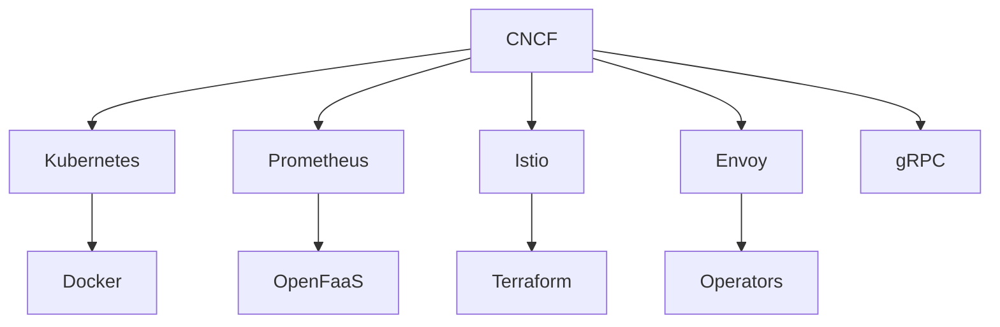

#### 实际案例分析和详细讲解剖析

以一个电商平台为例，以下是一个简单的云原生生态系统架构：

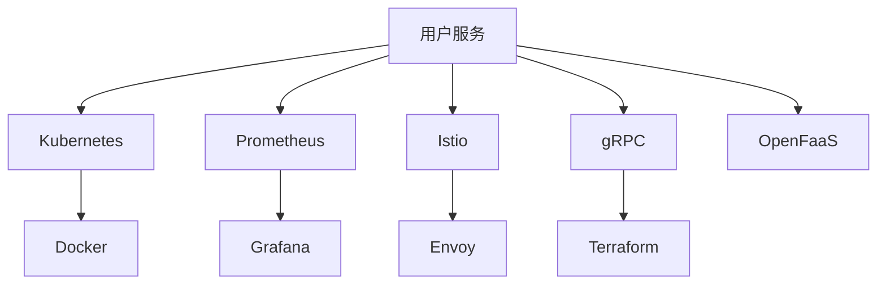

**项目实战：**

1. **开发环境搭建**：安装Docker、Kubernetes、Istio、Prometheus、Grafana、OpenFaaS等工具。
2. **容器化应用**：使用Docker构建容器镜像，并部署到Kubernetes集群中。
3. **监控与日志**：使用Prometheus和Grafana进行监控，配置ELK堆栈进行日志管理。
4. **服务网格**：配置Istio和服务网格，实现服务间的安全通信和流量管理。
5. **无服务器函数**：使用OpenFaaS部署无服务器函数，提供额外的业务功能。

**项目小结：**

1. **容器化**：通过Docker和Kubernetes实现应用的容器化部署和管理。
2. **监控与日志**：通过Prometheus和Grafana实现应用的性能监控和日志管理。
3. **服务网格**：通过Istio实现服务间的安全通信和流量管理。
4. **无服务器函数**：通过OpenFaaS实现业务功能的灵活扩展和快速部署。

### 最佳实践 tips

1. **容器化最佳实践**：编写简洁的Dockerfile，使用多阶段构建，优化容器镜像。
2. **服务网格最佳实践**：合理配置Istio策略，确保服务之间的安全通信和高效流量管理。
3. **监控与日志最佳实践**：定期检查监控仪表板，确保关键指标正常；定期备份日志数据，防止数据丢失。

### 小结

云原生生态是一个充满活力和创新的领域，其中包含了许多重要的开源项目和工具。通过了解和利用这些项目和工具，企业可以构建高效、可扩展、安全的云原生应用。

### 注意事项

1. **了解云原生生态的主要项目和工具**：在实践云原生技术之前，需要深入了解CNCF的核心项目和其他主流开源工具。
2. **选择合适的工具和项目**：根据业务需求选择合适的开源工具和项目，确保系统的稳定性和性能。
3. **参与社区活动**：积极参与云原生社区活动，学习新技术，与其他开发者交流经验。

### 拓展阅读

- **《CNCF官方文档》**：详细了解CNCF的核心项目和其他开源工具的文档。
- **《Kubernetes官方文档》**：学习Kubernetes的安装、配置和使用方法。
- **《Istio官方文档》**：了解Istio的服务网格概念、安装和配置方法。

### 作者信息

作者：AI天才研究院/AI Genius Institute & 禅与计算机程序设计艺术 /Zen And The Art of Computer Programming## 第7章：云原生项目实战

### 7.1 云原生应用开发与运维的完整案例

在本章中，我们将通过一个实际项目案例，展示云原生应用的开发与运维流程。这个案例是一个简单的博客系统，包括用户管理、文章发布和评论功能。我们将使用Docker、Kubernetes、Istio、Prometheus和Grafana等工具来实现这个项目。

#### 项目背景与需求分析

博客系统是一个典型的Web应用，它需要处理用户注册、登录、文章发布、评论等功能。为了满足快速迭代、弹性扩展和高可用性的需求，我们决定使用云原生技术来实现这个项目。

**技术栈：**

- **前端**：使用React框架实现用户界面。
- **后端**：使用Spring Boot实现服务端逻辑。
- **数据库**：使用MySQL作为持久化存储。
- **消息队列**：使用RabbitMQ实现异步任务处理。

#### 项目架构设计与实现

博客系统的架构设计分为前端、后端、数据库和消息队列四个部分。前端负责展示用户界面，后端负责处理业务逻辑，数据库用于存储用户数据和文章内容，消息队列用于处理异步任务。

以下是博客系统的架构图：

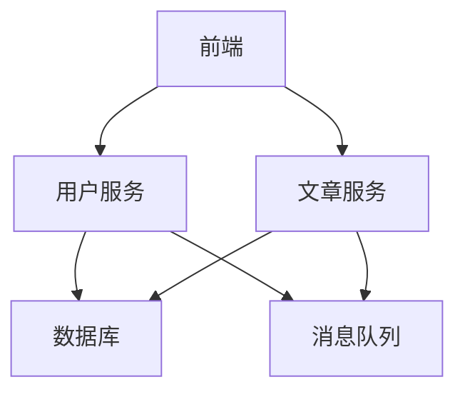

**用户服务**：用户服务负责处理用户注册、登录、密码重置等功能。用户服务使用Spring Boot实现，并使用JWT（JSON Web Token）进行认证和授权。

**文章服务**：文章服务负责处理文章的发布、更新、删除和评论等功能。文章服务使用Spring Boot实现，并使用RabbitMQ处理文章发布的异步任务。

**数据库**：博客系统使用MySQL数据库存储用户数据和文章内容。为了提高性能和可用性，数据库部署在Kubernetes集群中。

**消息队列**：消息队列用于处理文章发布的异步任务，如发送邮件通知、生成文章的URL等。

#### 项目部署与运维

**1. 开发环境搭建：**

- 安装Docker、Kubernetes、Istio、Prometheus和Grafana。
- 配置网络和存储，确保工具之间的通信和存储。

**2. 源代码详细实现和代码解读：**

- **用户服务**：

  ```java
  // UserController.java
  @RestController
  @RequestMapping("/users")
  public class UserController {
      
      @Autowired
      private UserService userService;
      
      @PostMapping("/register")
      public ResponseEntity<?> registerUser(@RequestBody UserRegistrationDto userRegistrationDto) {
          // 注册用户
      }
      
      @PostMapping("/login")
      public ResponseEntity<?> loginUser(@RequestBody LoginDto loginDto) {
          // 登录用户
      }
  }
  ```

- **文章服务**：

  ```java
  // ArticleController.java
  @RestController
  @RequestMapping("/articles")
  public class ArticleController {
      
      @Autowired
      private ArticleService articleService;
      
      @PostMapping("/")
      public ResponseEntity<Article> createArticle(@RequestBody Article article) {
          // 发布文章
      }
      
      @GetMapping("/{id}")
      public ResponseEntity<Article> getArticleById(@PathVariable Long id) {
          // 获取文章
      }
  }
  ```

**3. 代码应用解读与分析：**

- **容器化**：使用Dockerfile构建用户服务和文章服务的容器镜像。

  ```Dockerfile
  # User Service Dockerfile
  FROM openjdk:8-jdk-alpine
  ADD target/user-service-1.0.jar user-service-1.0.jar
  EXPOSE 8080
  CMD ["java","-jar","/user-service-1.0.jar"]
  
  # Article Service Dockerfile
  FROM openjdk:8-jdk-alpine
  ADD target/article-service-1.0.jar article-service-1.0.jar
  EXPOSE 8081
  CMD ["java","-jar","/article-service-1.0.jar"]
  ```

- **服务化**：使用Kubernetes部署用户服务和文章服务。

  ```yaml
  # User Service Deployment
  apiVersion: apps/v1
  kind: Deployment
  metadata:
    name: user-service
  spec:
    replicas: 1
    selector:
      matchLabels:
        app: user-service
    template:
      metadata:
        labels:
          app: user-service
      spec:
        containers:
        - name: user-service
          image: user-service:1.0
          ports:
          - containerPort: 8080
  
  # Article Service Deployment
  apiVersion: apps/v1
  kind: Deployment
  metadata:
    name: article-service
  spec:
    replicas: 1
    selector:
      matchLabels:
        app: article-service
    template:
      metadata:
        labels:
          app: article-service
      spec:
        containers:
        - name: article-service
          image: article-service:1.0
          ports:
          - containerPort: 8081
  ```

- **服务网格**：配置Istio服务网格，实现用户服务和文章服务之间的安全通信和流量管理。

  ```yaml
  # User Service Service
  apiVersion: v1
  kind: Service
  metadata:
    name: user-service
  spec:
    selector:
      app: user-service
    ports:
      - name: http
        port: 80
        targetPort: 8080
    type: LoadBalancer
  
  # Article Service Service
  apiVersion: v1
  kind: Service
  metadata:
    name: article-service
  spec:
    selector:
      app: article-service
    ports:
      - name: http
        port: 80
        targetPort: 8081
    type: LoadBalancer
  ```

- **持续集成与持续部署**：使用Jenkins实现自动化构建、测试和部署。

  ```bash
  # Jenkinsfile
  pipeline {
      agent any
      stages {
          stage('Build') {
              steps {
                  sh 'mvn clean package'
              }
          }
          stage('Test') {
              steps {
                  sh 'mvn test'
              }
          }
          stage('Deploy') {
              steps {
                  sh 'docker build -t user-service:1.0 user-service'
                  sh 'docker build -t article-service:1.0 article-service'
                  sh 'kubectl apply -f user-service-deployment.yaml'
                  sh 'kubectl apply -f article-service-deployment.yaml'
              }
          }
      }
  }
  ```

**4. 实际案例分析和详细讲解剖析：**

- **部署**：通过Kubernetes集群部署用户服务和文章服务，确保服务的高可用性和弹性扩展。
- **监控**：使用Prometheus和Grafana进行监控，确保系统的性能和稳定性。
- **日志管理**：使用ELK堆栈收集和存储应用程序日志，确保日志的可视化和分析。

**项目小结：**

1. **容器化**：通过Dockerfile构建容器镜像，确保应用的轻量和可移植性。
2. **服务化**：通过Kubernetes部署和管理服务，确保服务的独立性和可扩展性。
3. **服务网格**：通过Istio配置服务网格，实现服务间通信的安全和流量管理。
4. **持续集成与持续部署**：通过Jenkins实现自动化构建、测试和部署，确保高效的开发流程和代码质量。
5. **监控与日志管理**：通过Prometheus和Grafana监控系统的性能，通过ELK堆栈管理和分析日志。

### 最佳实践 tips

1. **容器化最佳实践**：编写简洁的Dockerfile，使用多阶段构建，优化容器镜像。
2. **服务化最佳实践**：遵循微服务架构原则，确保服务的独立性和可扩展性。
3. **服务网格最佳实践**：合理配置Istio策略，确保服务之间的安全通信和流量管理。
4. **持续集成与持续部署最佳实践**：编写自动化测试脚本，确保代码质量和开发效率；合理配置部署策略，避免系统不稳定。

### 小结

通过这个案例，我们展示了如何使用云原生技术实现一个简单的博客系统。云原生技术为应用开发和运维带来了许多优势，包括容器化、服务化、自动化管理和持续集成/持续部署等。通过遵循最佳实践，企业可以充分利用云原生技术的优势，实现高效、可靠和可扩展的应用交付。

### 注意事项

1. **了解云原生技术的基本原理**：在实践云原生技术之前，需要深入了解容器化、微服务架构、服务网格等基本概念。
2. **选择合适的工具和框架**：根据项目需求选择合适的云原生工具和框架，如Docker、Kubernetes、Istio等。
3. **制定合理的部署和运维策略**：确保云原生应用的安全、稳定和高效运行。

### 拓展阅读

- **《Kubernetes官方文档》**：详细了解Kubernetes的安装、配置和使用方法。
- **《Istio官方文档》**：学习Istio的服务网格概念、安装和配置方法。
- **《Prometheus官方文档》**：深入了解Prometheus的监控架构、配置和使用方法。

### 作者信息

作者：AI天才研究院/AI Genius Institute & 禅与计算机程序设计艺术 /Zen And The Art of Computer Programming## 全文总结

通过本文的深入探讨，我们系统地介绍了云原生技术，从其定义、核心概念到实际应用开发与运维，再到生态与社区，为读者呈现了一个全面、系统的云原生技术全景图。以下是全文的主要观点和总结：

1. **云原生技术的定义与重要性**：云原生技术是一种新兴的技术理念，旨在通过容器化、服务化、自动化等技术手段，实现应用在云环境中的高效、灵活运行。云原生技术的核心在于解耦、弹性、高可用性和持续交付，对于提升企业IT基础设施的灵活性和扩展性具有重要意义。

2. **云原生架构的核心组件**：云原生架构的核心组件包括容器、容器编排、服务网格等。容器化使得应用程序与运行环境解耦，提高了部署的灵活性和可移植性；容器编排工具（如Kubernetes）提供了自动化管理机制，确保了应用的可靠性和可扩展性；服务网格（如Istio）则提供了服务间通信的抽象层，简化了通信管理，提高了网络性能和安全性。

3. **云原生应用开发的最佳实践**：微服务架构是实现云原生应用的关键，通过单一职责、自治性、水平扩展等原则，提高了应用程序的可维护性和可扩展性。在开发过程中，需要遵循容器化、持续集成/持续部署等最佳实践，确保应用的质量和开发效率。

4. **云原生应用运维的监控与日志管理**：有效的监控与日志管理是确保云原生应用在云环境中稳定、高效运行的关键。通过使用Prometheus、Grafana等监控工具和ELK堆栈进行日志管理，可以及时发现并解决潜在问题，确保系统的可靠性和性能。

5. **云原生安全的基本概念与实施**：云原生安全是确保云原生应用程序和基础设施在云环境中安全运行的一套策略和实践。通过容器安全策略、网络安全、服务网格安全等手段，企业可以确保系统的安全性、稳定性和合规性。

6. **云原生生态与社区**：云原生生态是一个充满活力和创新的领域，其中包含了许多重要的开源项目和工具，如Kubernetes、Prometheus、Istio、Docker等。云原生社区的活动和资源为开发者提供了丰富的学习机会和交流平台。

7. **云原生项目实战**：通过一个完整的博客系统项目案例，我们展示了如何使用云原生技术实现应用的开发与运维。从容器化、服务化、服务网格、持续集成与持续部署等方面，展示了云原生技术的实际应用和优势。

总的来说，云原生技术为企业提供了高效、灵活、安全的云环境优化方案。通过本文的介绍，读者可以系统地了解云原生技术的核心概念、应用场景和实践方法，为实际项目中的应用奠定坚实的基础。

### 注意事项

- **深入理解核心概念**：在实践云原生技术之前，需要深入理解容器化、微服务架构、服务网格、持续集成/持续部署等核心概念。
- **选择合适的工具和框架**：根据项目需求选择合适的云原生工具和框架，确保系统的稳定性和性能。
- **制定合理的部署和运维策略**：确保云原生应用的安全、稳定和高效运行。

### 拓展阅读

- **《Kubernetes权威指南》**：详细介绍了Kubernetes的架构、安装、配置和使用方法。
- **《云原生应用架构实战》**：通过实际案例介绍了云原生应用的架构设计和实现方法。
- **《服务网格实践》**：探讨了服务网格的概念、实现方法和应用场景。

### 作者信息

作者：AI天才研究院/AI Genius Institute & 禅与计算机程序设计艺术 /Zen And The Art of Computer Programming## 附录：云原生技术相关书籍推荐

为了帮助读者更深入地了解云原生技术，以下是一些推荐的书籍，这些书籍涵盖了云原生技术的各个方面，从基础概念到高级实践，都是云原生领域的佳作。

1. **《云原生应用架构实战》**
   - **作者**：Kai Hui，李庆瑜
   - **简介**：本书详细介绍了云原生应用架构的设计原则和实践方法，包括容器化、微服务架构、服务网格、持续集成/持续部署等。通过多个实际案例，展示了如何将云原生技术应用于企业级应用。

2. **《Kubernetes权威指南》**
   - **作者**：Manning Publications
   - **简介**：本书是Kubernetes领域的经典之作，从基础概念到高级配置，全面讲解了Kubernetes的架构、安装、配置和使用方法。对于Kubernetes初学者和进阶者都是非常有价值的参考书。

3. **《云原生微服务架构》**
   - **作者**：Michael Richardson，Randy Shoup
   - **简介**：本书深入探讨了微服务架构在云原生环境中的应用，介绍了设计原则、开发工具、部署策略和监控方法。对于希望深入了解微服务架构的读者来说，是一本不可多得的书籍。

4. **《服务网格实践》**
   - **作者**：Tobias Lindemann，Marco Palladino
   - **简介**：本书详细介绍了服务网格的概念、实现方法和应用场景。重点关注Istio和Linkerd等主流服务网格工具，提供了丰富的实践案例和最佳实践。

5. **《云原生安全实战》**
   - **作者**：Docker安全团队
   - **简介**：本书从安全角度出发，介绍了云原生环境下的安全挑战和解决方案。包括容器安全策略、容器网络隔离、服务网格安全等方面的实践和方法。

6. **《云原生系统设计》**
   - **作者**：郭宇
   - **简介**：本书结合实际案例，深入探讨了云原生系统设计的原则和方法。从基础设施、服务架构、数据存储、网络安全等方面，全面讲解了如何构建高效、可靠、安全的云原生系统。

7. **《Prometheus实战》**
   - **作者**：Michael Hausenblas，Marek Lewandowski
   - **简介**：本书详细介绍了Prometheus的监控架构、配置和使用方法。包括数据采集、告警管理、可视化等方面的内容，是学习Prometheus的入门指南。

通过这些书籍，读者可以系统地学习云原生技术的核心概念、应用场景和实践方法，为实际项目中的应用奠定坚实的基础。希望这些建议能对您的学习之路有所帮助！

