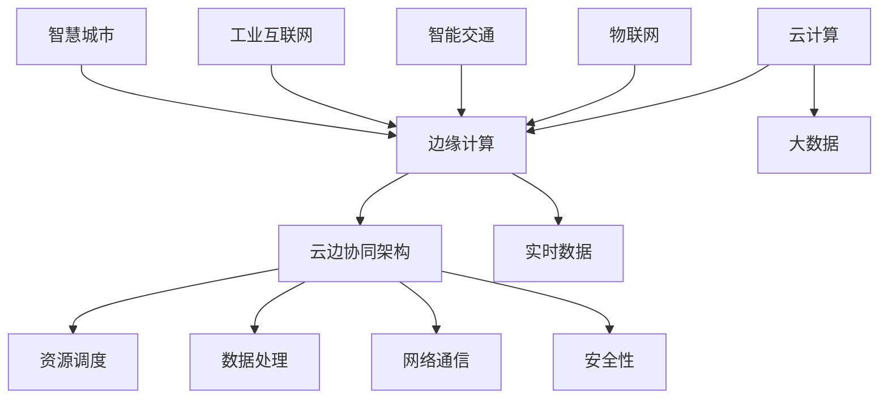

                 


### 标题设计
标题设计是文章内容的重要窗口，需要能够吸引读者的兴趣，同时概括文章的核心内容。《云边协同架构：P9工程师的融合性思考》这个标题已经很好地体现了文章的主题，即讨论云边协同架构以及P9工程师的角度。接下来，我们将考虑关键词和摘要的设计。

### 关键词设计
关键词是帮助读者快速了解文章主题的重要元素。对于本文，关键词应该涵盖云边协同、架构设计、P9工程师、融合性思考等核心概念。以下是关键词列表：

- 云边协同
- 架构设计
- P9工程师
- 融合性思考
- 云计算
- 边缘计算
- 网络架构
- 技术趋势

### 摘要设计
摘要是对文章内容的简短概述，需要准确反映文章的核心内容。对于本文，摘要可以如下：

摘要：
本文深入探讨了云边协同架构的设计与实践，从P9工程师的视角出发，分析了云计算与边缘计算的融合原理和关键技术。文章通过具体的算法原理讲解、数学模型阐述、实战案例分析，展现了云边协同架构在不同领域的应用及其未来的发展趋势。本文旨在为从事云边协同架构设计和实施的技术人员提供有价值的参考和思考。

### 目录结构设计
为了使文章内容更加系统、易于阅读，我们需要设计一个合理的目录结构。以下是一个可能的目录结构：

## 目录结构

### 第一部分：背景与理论基础
1. 云边协同架构概述
2. 云计算与边缘计算原理
3. 云边协同的关键技术

### 第二部分：云边协同架构的实践应用
4. 云边协同在物联网中的应用
5. 云边协同在智能交通中的应用
6. 云边协同在工业互联网中的应用
7. 云边协同在智慧城市中的应用

### 第三部分：高级主题
8. 云边协同架构的安全与隐私保护
9. 云边协同架构的可持续发展
10. 云边协同架构的未来趋势与展望

### 核心概念与联系
在讨论云边协同架构时，我们需要明确几个核心概念之间的联系，这有助于读者更好地理解架构的运作原理。以下是一个可能的Mermaid流程图，用于描述这些核心概念之间的关系：



### 核心算法原理讲解
在云边协同架构中，资源调度和数据处理是关键算法。以下是资源调度的伪代码示例：

```python
# 资源调度伪代码
def resource_scheduling(available_resources, required_resources):
    if available_resources >= required_resources:
        return "任务分配成功"
    else:
        return "任务分配失败，资源不足"
```

### 数学模型和数学公式
在云边协同架构中，我们可能需要用到一些数学模型来描述数据处理和网络通信的性能。以下是处理速度的数学模型：

$$
\text{处理速度} = \frac{\text{数据量}}{\text{处理时间}}
$$

### 项目实战
为了更好地理解云边协同架构的实际应用，我们可以通过一个具体的案例来讲解。以下是一个简化的案例描述：

**案例：智慧城市交通管理平台**

- **开发环境搭建**：在AWS云平台和边缘设备上分别部署所需的服务器和设备。
- **源代码实现**：编写基于Spring Boot的后端服务，处理交通数据，并实现边缘计算节点与云端服务的通信。
- **代码解读与分析**：分析后端服务的代码，了解数据处理的流程和算法实现。
- **代码应用解读与分析**：通过实际数据，分析平台在处理高峰期交通流量时的性能表现。
- **实际案例分析和详细讲解剖析**：结合实际案例，详细讲解平台在应对交通突发情况时的表现和优化措施。
- **项目小结**：总结项目的成功经验和存在的挑战，为未来的优化提供方向。

### 最佳实践 tips、小结、注意事项、拓展阅读
- **最佳实践 tips**：在部署云边协同架构时，建议进行充分的性能测试，确保系统在高并发情况下仍能稳定运行。
- **小结**：云边协同架构是未来网络架构的重要方向，P9工程师在设计和实施过程中需要综合考虑多个方面，确保架构的高效和可靠性。
- **注意事项**：在实际项目中，安全性和隐私保护是必须重视的问题，需要采取相应的措施来保障系统的安全。
- **拓展阅读**：对于希望深入了解云边协同架构的读者，可以参考相关的研究论文和行业报告。

通过上述的逐步分析推理，我们设计了一个结构清晰、内容丰富的《云边协同架构：P9工程师的融合性思考》目录大纲。接下来，我们将根据这个大纲逐步撰写文章，确保每部分内容都能满足要求。让我们开始具体的文章撰写工作吧！### 背景介绍

随着信息技术的迅猛发展，云计算和边缘计算逐渐成为现代网络架构中的重要组成部分。云计算以其强大的计算能力和海量存储资源，为各类应用提供了高效、灵活的计算环境。然而，云计算在处理大规模数据时，往往面临网络延迟和数据传输成本较高的问题。与此同时，边缘计算作为云计算的补充，通过在靠近数据源的地方进行计算和数据处理，有效降低了网络延迟，提高了系统的响应速度。

云边协同架构正是为了解决云计算与边缘计算各自面临的局限性，而提出的一种融合性架构设计。其核心思想是将云计算的强大计算能力和边缘计算的低延迟、本地化处理能力相结合，实现资源的最优配置和利用，以满足不同场景下的计算需求。这种架构不仅能够提升系统的整体性能和效率，还能够提供更加可靠、安全的数据处理环境。

云边协同架构的应用领域非常广泛，涵盖了物联网、智能交通、工业互联网、智慧城市等多个方面。在物联网领域，通过云边协同架构，可以实现大规模设备的实时数据采集、处理和分析，为智能决策提供有力支持。在智能交通领域，云边协同架构可以优化交通流量管理，提高道路通行效率，减少交通事故。在工业互联网中，云边协同架构可以提升制造过程的自动化水平和生产效率，实现智能制造。在智慧城市领域，云边协同架构可以支持智慧交通、智慧环保、智慧安防等多方面的应用，提升城市管理水平。

本文将围绕云边协同架构的核心概念、设计原理、关键技术、实践应用以及未来发展，进行详细探讨。通过分析云计算与边缘计算的融合原理，介绍云边协同架构的设计原则和方法，并结合实际案例进行深入讲解，旨在为从事云边协同架构设计和实施的技术人员提供有价值的参考和思考。本文将分为三个主要部分：第一部分介绍云边协同架构的理论基础，包括云计算与边缘计算原理、云边协同的关键技术以及云边协同架构的设计方法；第二部分讨论云边协同架构的实践应用，涵盖物联网、智能交通、工业互联网和智慧城市等领域的具体应用案例；第三部分探讨云边协同架构的安全与隐私保护、可持续发展以及未来趋势。通过本文的阅读，读者将能够全面了解云边协同架构的核心内容，掌握其设计原理和应用方法，为实际项目提供有效的技术支持和决策依据。 

### 云计算与边缘计算原理

#### 云计算原理

云计算是基于互联网的计算模型，通过将计算资源（如服务器、存储、网络等）以服务形式提供，用户可以按需使用这些资源，而无需管理底层的硬件设施。云计算的核心在于其资源的高度虚拟化和弹性伸缩能力，这使得云计算能够灵活应对不同规模和类型的计算需求。

云计算可以分为以下几个主要组件：

1. **基础设施即服务（IaaS）**：用户可以通过IaaS获取虚拟化的计算资源，如虚拟机、存储和网络等。常见的IaaS提供商包括亚马逊AWS、微软Azure和谷歌Cloud等。

2. **平台即服务（PaaS）**：PaaS提供了一个开发平台，用户可以在其上开发、部署和管理应用程序，无需关心底层的基础设施。例如，谷歌App Engine和微软Azure App Service。

3. **软件即服务（SaaS）**：SaaS直接向用户提供了完整的软件应用，用户可以通过互联网访问和使用这些应用，如Office 365和Salesforce。

云计算的优势在于：

- **高可扩展性**：根据需求自动扩展或缩减资源。
- **低成本**：用户只需为实际使用的资源付费。
- **高可靠性**：通过分布式架构实现高可用性和容错性。
- **灵活性**：支持各种类型的应用开发和部署。

然而，云计算也存在一些挑战，如网络延迟、数据安全性和隐私等问题。

#### 边缘计算原理

边缘计算是一种将计算、存储和网络能力下沉到网络边缘的架构，靠近数据源进行数据处理和计算。边缘计算的核心在于其低延迟、高带宽和高效处理能力，特别适用于实时性要求高的应用场景。

边缘计算的主要组件包括：

1. **边缘节点**：这些节点位于网络的边缘，通常部署在数据中心、企业内部网络或互联网接入点附近。

2. **边缘服务器**：这些服务器提供计算资源，用于处理边缘节点上的数据。

3. **边缘网关**：边缘网关负责连接本地网络和广域网络，实现数据传输和控制。

边缘计算的优势在于：

- **低延迟**：数据在本地处理，减少了传输时间。
- **高带宽**：边缘节点可以处理大量数据，提高带宽利用率。
- **高效处理**：通过分布式计算，提升数据处理速度。

边缘计算也面临一些挑战，如资源限制、安全性和管理复杂度。

#### 云与边缘的融合原理

云与边缘的融合，即云边协同，是云计算和边缘计算相结合的架构设计。其核心在于将云计算的强大计算能力和边缘计算的低延迟、高效处理能力相结合，实现资源的最优配置和利用。

云边协同的基本架构包括以下几个关键部分：

1. **边缘计算节点**：分布在网络边缘，负责本地数据预处理和实时计算。

2. **云平台**：提供云计算资源，包括计算、存储和网络服务。

3. **边缘云**：连接边缘节点和云平台，负责数据传输和资源调度。

4. **数据管理层**：管理边缘节点和云平台上的数据，确保数据的安全、可靠和高效利用。

云边协同的优势在于：

- **资源高效利用**：通过边缘计算处理本地数据，减轻了云计算的压力，提高了整体系统的处理效率。
- **低延迟**：本地数据预处理减少了数据传输时间，提高了系统的响应速度。
- **高可靠性**：通过分布式架构，提高了系统的容错性和可用性。
- **灵活性**：支持多种应用场景，满足不同类型的计算需求。

然而，云边协同也带来了一些新的挑战，如数据安全和隐私保护、网络通信的稳定性以及资源调度和管理复杂度等。

通过上述讨论，我们可以看到，云计算和边缘计算各自具有独特的优势和局限性。云边协同架构的设计，正是为了充分发挥两者优势，实现资源的高效利用和系统的最佳性能。在接下来的章节中，我们将进一步探讨云边协同架构的关键技术、设计原则和实践应用。 

### 云边协同的关键技术

云边协同架构的实现离不开一系列关键技术的支持，这些技术不仅决定了架构的性能和效率，还直接影响到系统的可靠性和安全性。以下是云边协同架构中的几个核心技术：

#### 网络通信技术

网络通信技术是云边协同架构的核心组成部分，其主要任务是实现边缘节点与云平台之间的稳定、高效的数据传输。以下是几种常用的网络通信技术：

1. **边缘网关技术**：边缘网关作为边缘节点与云平台之间的桥梁，负责数据传输、协议转换和安全管理。通过采用高效的数据传输协议（如QUIC、gRPC等），可以显著降低传输延迟和带宽消耗。

2. **MESH网络架构**：MESH网络架构是一种无中心节点的网络结构，具有高可靠性和自愈能力。在云边协同架构中，MESH网络架构可以确保即使在某些节点出现故障时，数据传输仍能正常进行，从而提高系统的整体可靠性。

3. **边缘计算优化协议**：针对边缘节点的计算能力和带宽限制，开发优化数据传输和处理的协议，如基于压缩感知技术的数据传输协议，可以有效减少数据传输量，提高传输效率。

#### 数据处理与存储技术

在云边协同架构中，数据处理与存储技术的选择至关重要，它们直接影响到系统的实时性、灵活性和可扩展性。以下是几种常用的数据处理与存储技术：

1. **分布式数据处理平台**：如Apache Flink和Apache Spark，这些平台能够分布式地处理海量数据，提供实时数据处理和分析能力。通过在边缘节点和云平台之间部署这些平台，可以实现数据的实时同步和处理。

2. **边缘数据库**：如Cassandra和MongoDB，这些数据库支持分布式存储和横向扩展，适用于大规模数据存储和快速访问。在边缘计算节点部署这些数据库，可以实现对本地数据的快速存储和查询。

3. **缓存技术**：如Redis和Memcached，这些缓存技术可以显著提高数据访问速度，减轻后端服务器的负载。在边缘节点部署缓存技术，可以缓存常用数据，减少数据传输和计算开销。

#### 资源调度与管理技术

资源调度与管理技术是实现云边协同架构高效运行的关键，其任务是根据不同应用场景动态分配和优化计算资源。以下是几种常用的资源调度与管理技术：

1. **基于机器学习的资源调度算法**：利用机器学习技术，根据历史数据和实时监控信息，预测系统的负载情况，动态调整资源分配，以实现资源的最优利用。例如，可以利用强化学习算法，自动调整边缘节点的计算资源和带宽分配。

2. **动态资源伸缩技术**：在边缘节点和云平台之间实现资源的动态伸缩，根据系统负载自动增加或减少计算资源。例如，可以使用容器编排工具（如Kubernetes）来实现边缘节点的自动伸缩。

3. **资源隔离技术**：通过虚拟化技术（如Docker和KVM）实现资源隔离，确保不同应用之间的资源互不影响，提高系统的安全性和可靠性。

#### 安全与隐私保护技术

安全与隐私保护技术是云边协同架构必须考虑的重要方面，确保数据在传输和处理过程中的安全性和隐私性。以下是几种常用的安全与隐私保护技术：

1. **加密技术**：采用对称加密和非对称加密技术，对数据进行加密，确保数据在传输过程中的安全性。例如，使用AES和RSA加密算法。

2. **身份认证与访问控制**：通过身份认证（如OAuth2.0）和访问控制（如RBAC）技术，确保只有授权用户才能访问系统和数据。

3. **数据隔离与去标识化**：在边缘节点和云平台之间实现数据隔离，确保数据不会泄露到外部系统。同时，采用数据去标识化技术，隐藏数据的真实来源和内容，提高数据的隐私性。

通过上述关键技术的支持，云边协同架构能够实现高效、可靠和安全的运行，满足不同应用场景的需求。在接下来的章节中，我们将进一步探讨云边协同架构的具体设计原则和实践方法。 

### 云边协同架构设计

云边协同架构的设计是一个复杂的系统工程，它需要充分考虑各种因素，以确保系统的整体性能、可靠性和可扩展性。以下是云边协同架构设计的关键原则和设计方法：

#### 设计原则

1. **分布式与模块化**：云边协同架构应采用分布式架构，将计算、存储和网络资源分散在边缘节点和云平台之间，以提高系统的容错性和扩展性。同时，架构应具备模块化设计，便于维护和升级。

2. **弹性与动态性**：架构设计应具备弹性，能够根据实际负载动态调整资源分配。例如，在高峰期自动扩展边缘节点和云平台资源，以应对突发流量。

3. **安全与隐私保护**：设计过程中必须重视安全与隐私保护，采用多种安全措施，如数据加密、身份认证和访问控制，确保数据在传输和处理过程中的安全性和隐私性。

4. **高效的数据处理与传输**：架构设计应优化数据处理与传输流程，减少数据传输延迟和带宽消耗。例如，采用边缘缓存技术减少数据传输量，使用高效的数据处理框架提升数据处理速度。

5. **兼容性与可扩展性**：架构设计应具备良好的兼容性，能够支持多种设备和平台。同时，设计应考虑到未来技术的发展，确保架构能够灵活扩展以适应新的需求。

#### 设计方法

1. **需求分析**：首先进行详细的需求分析，明确系统需要满足的功能和性能要求。这包括数据采集、处理、存储和分析的需求，以及系统的可扩展性和可靠性要求。

2. **架构拓扑设计**：根据需求分析结果，设计云边协同架构的拓扑结构。这包括确定边缘节点、云平台和边缘云的布局，以及它们之间的连接方式和通信协议。

3. **资源分配策略**：设计资源分配策略，确定如何根据负载动态调整边缘节点和云平台的资源。例如，采用负载均衡算法分配计算任务，根据数据流量调整带宽和存储资源。

4. **数据处理与传输优化**：设计数据处理与传输优化方案，确保数据的低延迟和高效率传输。例如，采用边缘缓存和分布式数据处理平台，实现数据的本地处理和实时分析。

5. **安全与隐私保护机制**：设计安全与隐私保护机制，确保数据在传输和处理过程中的安全性和隐私性。例如，采用加密技术和访问控制机制，确保数据不被未授权访问。

6. **测试与优化**：完成架构设计后，进行全面的测试和优化，确保系统的性能和可靠性。这包括性能测试、安全测试和可靠性测试，通过模拟实际场景，验证架构的可行性。

通过上述设计原则和方法，可以构建一个高效、可靠和安全的云边协同架构，满足各类应用场景的需求。在接下来的章节中，我们将通过具体案例深入探讨云边协同架构在物联网、智能交通、工业互联网和智慧城市等领域的应用。 

### 云边协同在物联网中的应用

物联网（IoT）是云边协同架构的一个重要应用领域，通过将各种物理设备互联，实现实时数据采集、分析和智能化管理。云边协同架构在物联网中的应用，不仅提高了数据处理的效率，还显著降低了延迟，为各种物联网应用场景提供了强有力的支持。

#### 云边协同在物联网中的优势

1. **低延迟**：物联网设备通常分布在广泛的地域，数据传输距离远，采用云边协同架构可以在边缘节点本地处理数据，大幅减少数据传输延迟，提高系统的实时响应能力。

2. **高效数据处理**：云边协同架构允许在边缘节点进行预处理，将非结构化和大规模数据转化为有用信息，减轻了云计算中心的数据处理负担，提高了整体系统的处理效率。

3. **节约带宽**：通过在边缘节点处理部分数据，可以显著减少需要传输到云平台的数据量，从而节约带宽资源，降低网络费用。

4. **提高可靠性**：边缘计算和云计算的结合，实现了数据处理的冗余和备份，提高了系统的可靠性和容错能力，即使在边缘节点故障的情况下，系统仍能正常运行。

#### 云边协同在物联网中的应用案例

1. **智能农业**：在智能农业中，通过传感器采集土壤湿度、温度、光照等数据，边缘节点进行初步处理，将必要数据传输到云平台进行分析，提供精准的灌溉建议和作物管理方案。

2. **智能医疗**：在智能医疗中，患者佩戴的传感器设备可以实时监测生命体征，边缘节点对数据进行初步分析，将关键数据上传到云平台，实现远程监控和紧急情况报警。

3. **智能交通**：在智能交通中，路边传感器和智能交通设备实时监测交通流量、车辆速度和密度等信息，边缘节点进行数据预处理，将交通状况信息及时传输到云平台，优化交通信号控制，减少拥堵。

4. **智能家居**：在智能家居中，各种智能设备如灯光、家电、安防设备等通过网络互联，边缘节点负责设备控制和管理，并将重要数据上传到云平台，实现智能家居的集中管理和远程控制。

#### 具体应用实例

**案例：智能农业中的云边协同应用**

- **开发环境搭建**：在农场边缘部署传感器和边缘计算设备，如Raspberry Pi或Arduino，连接到互联网。在云平台上部署数据处理和分析工具，如AWS IoT Analytics。

- **源代码实现**：编写传感器数据采集程序，通过边缘设备将数据传输到云平台。开发边缘计算脚本，对传感器数据进行初步分析，提取关键指标。

- **代码解读与分析**：分析边缘计算脚本，理解如何从传感器数据中提取有用信息，以及如何与云平台进行数据通信。

- **代码应用解读与分析**：结合实际农田环境，测试边缘计算和云平台的数据处理效果，分析数据对农业生产的实际影响。

- **项目小结**：总结项目的成功经验和技术挑战，提出未来的优化方向和改进措施。

通过上述案例，我们可以看到云边协同架构在物联网中的应用优势和实践价值。在智能农业、智能医疗、智能交通和智能家居等领域，云边协同架构不仅提升了系统的实时性和效率，还为各种物联网应用场景提供了创新解决方案。随着物联网技术的不断发展，云边协同架构的应用前景将更加广阔，为各行各业带来更多的智能化变革。 

### 云边协同在智能交通中的应用

智能交通系统（ITS）是现代城市交通管理的重要组成部分，通过集成各种传感器、通信设备和信息处理技术，实现交通流量的实时监控、分析和优化。云边协同架构在智能交通中的应用，极大地提升了交通管理的效率和精准度，为解决城市交通拥堵、提高道路通行能力提供了有力支持。

#### 云边协同在智能交通中的优势

1. **实时数据处理**：智能交通系统需要实时处理大量交通数据，如车辆速度、位置、流量等信息。云边协同架构通过在边缘节点进行数据预处理，大大降低了数据传输延迟，实现了交通数据的实时分析。

2. **高效资源利用**：边缘计算节点可以实时处理本地交通数据，减轻了云计算中心的计算压力，提高了系统的整体性能和资源利用率。

3. **数据传输成本降低**：通过在边缘节点处理部分数据，仅将重要信息传输到云平台，可以显著减少数据传输量，降低带宽成本。

4. **高可靠性**：边缘节点与云计算中心的协同工作，实现了数据的冗余备份和故障恢复，提高了系统的可靠性和容错性。

#### 云边协同在智能交通中的应用案例

1. **智能交通信号控制**：在交通繁忙的城市中心，通过部署边缘计算设备，实时采集交通流量、车辆密度等信息，边缘节点进行数据预处理，将优化后的信号控制策略传输到路口信号机，实现智能交通信号控制。

2. **车辆监控与调度**：在公共交通系统中，通过车载边缘计算设备实时监控车辆位置、速度等信息，边缘节点处理这些数据，优化公交调度方案，提高公共交通的准点率和运行效率。

3. **交通事故预警与处理**：在高速公路和城市道路中，通过边缘计算设备实时监测车辆速度、道路状况等信息，及时发现交通事故隐患，并通过云平台联动交警和救援部门，快速处理交通事故。

4. **智能停车管理**：在停车场和路边停车位，通过部署边缘计算设备和传感器，实时监控停车位使用情况，通过云平台提供智能停车指引和预约服务，提高停车资源的利用率。

#### 具体应用实例

**案例：智能交通信号控制的云边协同应用**

- **开发环境搭建**：在交通信号控制路口部署边缘计算设备（如智能摄像头、传感器等），连接到互联网。在云平台上部署交通信号控制算法和数据处理工具。

- **源代码实现**：编写边缘计算脚本，实时采集和处理交通数据，通过算法优化交通信号控制策略。开发云平台应用程序，处理传输过来的数据，生成优化方案。

- **代码解读与分析**：分析边缘计算脚本，理解交通数据的采集和处理流程，以及如何优化信号控制策略。分析云平台应用程序，理解如何生成优化方案并传输到边缘设备。

- **代码应用解读与分析**：结合实际交通场景，测试边缘计算和云平台的信号控制效果，分析优化方案对交通流量的实际影响。

- **项目小结**：总结项目的成功经验和技术挑战，提出未来的优化方向和改进措施。

通过上述案例，我们可以看到云边协同架构在智能交通中的应用优势和实践价值。在智能交通信号控制、车辆监控与调度、交通事故预警与处理以及智能停车管理等领域，云边协同架构不仅提升了交通管理的效率和精准度，还为城市交通系统的智能化发展提供了强大支持。随着人工智能和物联网技术的进一步发展，云边协同架构在智能交通中的应用将更加广泛，为城市交通管理带来更多创新解决方案。 

### 云边协同在工业互联网中的应用

工业互联网是制造业智能化转型的关键驱动力，通过将传感器、机器设备、云计算和边缘计算等技术与传统制造业深度融合，实现生产过程的智能化、自动化和高效化。云边协同架构在工业互联网中的应用，不仅提高了生产效率，还优化了资源利用，为工业制造带来了深远的变革。

#### 云边协同在工业互联网中的优势

1. **实时数据处理**：工业生产过程中产生的大量数据需要实时处理和分析，云边协同架构通过边缘节点进行数据预处理，实现了数据的实时性和高效性，为生产决策提供了及时支持。

2. **高可靠性和容错性**：边缘计算节点靠近设备，可以实现数据的本地存储和备份，提高了系统的可靠性和容错性，即使在网络不稳定或边缘节点故障的情况下，系统仍能正常运行。

3. **降低成本**：通过在边缘节点处理部分数据，可以减少数据传输量，降低带宽和存储成本。同时，边缘计算可以减少对中心服务器的依赖，降低了整体系统的硬件成本。

4. **增强灵活性**：边缘计算节点可以根据本地设备的具体需求，灵活调整计算资源和处理策略，提高了系统的适应性和灵活性。

#### 云边协同在工业互联网中的应用案例

1. **智能制造**：通过在工厂车间部署边缘计算设备，实时采集设备状态和生产数据，边缘节点对数据进行预处理和分析，生成生产优化方案，提高生产效率和产品质量。

2. **设备维护与预测性维护**：通过传感器和边缘计算设备实时监控设备运行状态，边缘节点对设备数据进行分析，预测设备故障，提前安排维护计划，减少设备停机时间和维护成本。

3. **质量控制**：在生产线中部署边缘计算设备，实时监控产品质量，边缘节点对产品数据进行质量分析，发现潜在的质量问题，及时进行调整和纠正。

4. **能源管理**：在工业生产过程中，边缘计算设备可以实时监控能源消耗情况，边缘节点对能耗数据进行分析，优化能源使用策略，降低能源成本。

#### 具体应用实例

**案例：智能制造中的云边协同应用**

- **开发环境搭建**：在工厂车间部署边缘计算设备（如工业网关、传感器等），连接到工业网络。在云平台上部署数据处理和分析工具，如MES（Manufacturing Execution System）系统。

- **源代码实现**：编写边缘计算脚本，实时采集设备状态和生产数据，通过算法进行数据预处理和分析。开发云平台应用程序，处理传输过来的数据，生成生产优化方案。

- **代码解读与分析**：分析边缘计算脚本，理解设备状态和生产数据的采集和处理流程，以及如何生成优化方案。分析云平台应用程序，理解如何实现生产数据的实时分析和优化。

- **代码应用解读与分析**：结合实际生产场景，测试边缘计算和云平台的生产优化效果，分析优化方案对生产效率和质量的实际影响。

- **项目小结**：总结项目的成功经验和技术挑战，提出未来的优化方向和改进措施。

通过上述案例，我们可以看到云边协同架构在工业互联网中的应用优势和实践价值。在智能制造、设备维护、质量控制和能源管理等领域，云边协同架构不仅提高了生产效率和产品质量，还优化了资源利用，为工业制造提供了创新解决方案。随着工业互联网技术的不断发展，云边协同架构在工业制造中的应用前景将更加广阔，为制造业的智能化转型提供持续动力。 

### 云边协同在智慧城市中的应用

智慧城市是信息技术与现代城市治理理念相结合的产物，旨在通过物联网、云计算、大数据、人工智能等技术手段，实现城市管理的智能化、精细化和高效化。云边协同架构在智慧城市中的应用，为城市交通、环境、安全、公共服务等领域的智能化管理提供了强有力的技术支持。

#### 云边协同在智慧城市中的优势

1. **实时监测与快速响应**：智慧城市需要实时收集和处理大量的数据，如交通流量、环境质量、公共安全等。云边协同架构通过边缘节点实时处理数据，实现了快速响应和精准监测，提高了城市管理的实时性和有效性。

2. **高效资源利用**：边缘计算节点可以本地处理数据，降低了数据传输到云平台的压力，减少了带宽和计算资源的消耗，提高了整体系统的资源利用率。

3. **增强城市韧性**：通过分布式架构，云边协同架构提高了系统的容错性和可靠性，即使在某些节点出现故障时，其他节点仍能正常运行，保证了城市服务的连续性和稳定性。

4. **数据安全与隐私保护**：在边缘节点本地处理数据，减少了数据传输过程中的安全隐患，同时，通过加密技术和访问控制机制，确保了数据的隐私性和安全性。

#### 云边协同在智慧城市中的应用案例

1. **智能交通管理**：通过在路边和交通要道部署边缘计算设备，实时监测交通流量和车辆信息，边缘节点对数据进行预处理，传输到云平台进行分析，优化交通信号控制和路线规划，提高交通通行效率。

2. **环境监测与治理**：在公园、河流和工业区等区域部署传感器，实时监测空气质量、水质、噪声等环境数据，边缘节点对数据进行本地分析，传输到云平台，实现环境监测和治理的智能化。

3. **公共安全监控**：在公共场所和重点区域部署边缘计算设备，实时监控人员流量、可疑行为等信息，边缘节点进行初步分析，将关键信息传输到云平台，实现公共安全的智能监控和预警。

4. **智慧公共服务**：通过在社区、医院、学校等公共场所部署边缘计算设备，提供智能化的公共服务，如智能停车、远程医疗、在线教育等，提高了公共服务的便捷性和覆盖率。

#### 具体应用实例

**案例：智能交通管理中的云边协同应用**

- **开发环境搭建**：在主要交通路口部署边缘计算设备（如智能摄像头、流量传感器等），连接到城市宽带网络。在云平台上部署交通管理软件和数据处理工具。

- **源代码实现**：编写边缘计算脚本，实时采集交通数据，通过算法进行数据预处理，将关键信息传输到云平台。开发云平台应用程序，处理传输过来的数据，生成交通优化方案。

- **代码解读与分析**：分析边缘计算脚本，理解交通数据的采集和处理流程，以及如何生成交通优化方案。分析云平台应用程序，理解如何实现交通数据的实时分析和优化。

- **代码应用解读与分析**：结合实际交通管理场景，测试边缘计算和云平台的交通优化效果，分析优化方案对交通流量的实际影响。

- **项目小结**：总结项目的成功经验和技术挑战，提出未来的优化方向和改进措施。

通过上述案例，我们可以看到云边协同架构在智慧城市中的应用优势和实践价值。在智能交通管理、环境监测与治理、公共安全监控和智慧公共服务等领域，云边协同架构不仅提升了城市管理的效率，还为智慧城市的建设提供了创新解决方案。随着智慧城市技术的不断发展，云边协同架构将在更多领域发挥重要作用，助力智慧城市的持续发展。 

### 云边协同架构的安全与隐私保护

随着云边协同架构在各个领域中的应用日益广泛，其安全与隐私保护问题也变得越来越重要。云边协同架构涉及到大量的数据传输和处理，包括敏感的用户数据、业务数据等，因此，确保数据的安全性和隐私性是至关重要的。以下是一些关键的安全与隐私保护技术：

#### 加密技术

加密技术是保障数据安全的基础手段。在云边协同架构中，可以使用以下加密技术：

- **对称加密**：如AES（Advanced Encryption Standard），适用于数据存储和传输中的加密。
- **非对称加密**：如RSA（Rivest-Shamir-Adleman），适用于数据传输中的身份验证和加密。
- **哈希算法**：如SHA-256，用于数据完整性校验。

#### 访问控制

访问控制是通过限制对系统和数据的访问来保护其安全的重要机制。在云边协同架构中，可以采用以下访问控制技术：

- **基于角色的访问控制（RBAC）**：根据用户的角色分配访问权限，确保用户只能访问与其角色相关的数据和系统功能。
- **基于属性的访问控制（ABAC）**：根据用户的属性（如位置、时间等）动态调整访问权限。

#### 安全通信协议

为了确保数据在传输过程中的安全，可以使用以下安全通信协议：

- **TLS/SSL**：传输层安全协议，用于加密网络通信，保护数据在传输过程中的隐私和完整性。
- **IPSec**：互联网协议安全，用于保护IP层的数据传输，提供加密和认证功能。

#### 数据隔离

数据隔离是将数据在不同节点之间进行隔离，防止数据泄露或被未授权访问。在云边协同架构中，可以采用以下数据隔离技术：

- **虚拟私有云（VPC）**：在云平台中创建隔离的虚拟网络，确保不同应用和数据之间的隔离。
- **容器化技术**：如Docker，通过容器实现应用和数据之间的隔离，提高系统的安全性。

#### 监控与审计

通过监控和审计技术，可以及时发现和处理潜在的安全威胁和异常行为。以下是一些常用的监控与审计技术：

- **入侵检测系统（IDS）**：用于检测网络流量中的异常行为和攻击。
- **日志审计**：通过记录系统和数据的操作日志，实现操作的回溯和审计。
- **异常检测**：通过分析系统和数据的行为模式，发现异常行为和潜在威胁。

#### 持续安全测试与更新

持续安全测试和更新是确保云边协同架构长期安全的重要措施。以下是一些常用的安全测试与更新方法：

- **漏洞扫描**：定期对系统和应用程序进行漏洞扫描，识别潜在的安全漏洞。
- **安全更新与补丁**：及时更新系统和应用程序的补丁，修补已知的安全漏洞。
- **安全培训与意识提升**：定期对员工进行安全培训，提高安全意识和应对能力。

通过上述安全与隐私保护技术，可以有效地保障云边协同架构的安全性和隐私性，为各个领域的应用提供可靠的技术支持。然而，云边协同架构的安全与隐私保护是一个持续的过程，需要不断更新和优化，以应对不断出现的新威胁和挑战。在未来的发展中，云边协同架构的安全与隐私保护将更加重要，也将成为推动其广泛应用的关键因素。 

### 云边协同架构的可持续发展

在当今环境问题日益严峻的背景下，云计算和边缘计算作为现代信息技术的重要组成部分，其可持续发展的议题也愈发受到关注。云边协同架构作为一种高效、灵活的架构设计，不仅能够优化资源利用，减少能源消耗，还能够在环保、节能减排等方面发挥重要作用。

#### 节能优化与绿色计算

1. **动态资源管理**：通过实时监控和动态调整计算资源，可以避免资源浪费，提高资源利用率。例如，在非高峰时段，降低边缘节点的计算资源消耗，减少能源消耗。

2. **绿色数据中心**：建设绿色数据中心，采用高效节能的硬件设备，如使用高效能的CPU和GPU，优化数据中心的散热系统，降低能耗。

3. **分布式能源系统**：在数据中心和边缘节点部署分布式能源系统，如太阳能、风能等可再生能源，减少对传统能源的依赖，实现能源自给自足。

#### 环境影响评估

1. **碳排放计算**：对云计算和边缘计算的数据中心进行碳排放计算，了解其环境影响，为节能减排提供数据支持。

2. **生命周期评估**：对云计算和边缘计算设备进行全生命周期评估，包括设计、制造、使用和废弃阶段，优化产品设计和生产过程，减少环境影响。

#### 可持续发展路径

1. **政策法规**：制定相关政策和法规，鼓励企业采用绿色计算技术，推广可持续发展理念。

2. **技术创新**：不断推动绿色计算技术的创新，研发更高效、更节能的计算设备和算法。

3. **绿色教育**：加强绿色计算和可持续发展教育，提高公众和企业的环保意识。

#### 云边协同架构的绿色实践

1. **智能电网协同**：通过云边协同架构，实现智能电网与能源管理系统的协同，优化能源分配和使用，提高能源利用效率。

2. **环境监测与治理**：利用云边协同架构，实时监测环境数据，优化环境治理策略，实现环境保护的智能化。

3. **节能减排**：在工业制造、交通管理等领域，通过云边协同架构优化生产过程和交通流量，降低能耗和排放。

通过上述措施和实践，云边协同架构不仅能够实现计算资源的优化利用，减少能源消耗，还能为环境保护和可持续发展作出积极贡献。在未来的发展中，云边协同架构的绿色实践将不断深化，为构建可持续发展的信息技术体系提供有力支持。 

### 云边协同架构的未来趋势与展望

随着云计算、边缘计算和物联网技术的不断演进，云边协同架构的未来发展前景令人期待。从当前的技术趋势和应用需求来看，以下几方面将成为云边协同架构未来发展的重要方向。

#### 1. 人工智能与云边协同的深度融合

人工智能（AI）技术正逐渐成为云计算和边缘计算的核心驱动力。未来的云边协同架构将深度融合AI技术，实现更加智能化、自适应的计算和数据处理。边缘节点将具备更强的AI处理能力，能够实时分析大量数据，并快速响应，提供更加精准的智能服务。

#### 2. 面向实时的混合云架构

未来的云边协同架构将更加注重实时性和高效性。混合云架构将成为主流，云计算与边缘计算将实现无缝集成，形成统一的数据处理和计算平台。通过边缘节点和云计算平台的协同工作，实现数据的高效处理和优化利用，满足实时应用的需求。

#### 3. 量子计算的引入

量子计算作为一种颠覆性的计算技术，其计算能力远超传统计算机。在未来的云边协同架构中，量子计算有望被引入，与云计算和边缘计算结合，实现更加高效的计算和数据处理。量子计算的引入将极大地提升云边协同架构的性能，开启新的应用场景。

#### 4. 增强安全与隐私保护

随着云边协同架构的广泛应用，数据安全和隐私保护将变得愈加重要。未来的云边协同架构将加强对数据的安全保护，采用更加先进的安全技术和加密算法，确保数据在传输和处理过程中的安全性。同时，隐私保护机制也将不断优化，以应对日益复杂的安全挑战。

#### 5. 智能边缘节点的发展

边缘计算节点将逐步向智能化、自主化方向发展。未来的边缘节点不仅具备计算和存储能力，还将具备自主学习和决策能力，能够根据实时环境和应用需求，自动调整计算资源和数据处理策略。智能边缘节点的发展将进一步提升云边协同架构的灵活性和适应性。

#### 6. 5G网络的全面融合

随着5G网络的广泛应用，云边协同架构将实现与5G网络的全面融合，提供更低延迟、更高带宽的通信服务。5G网络的快速连接和强大计算能力，将进一步提升云边协同架构的实时性和响应速度，满足更多高带宽、低延迟的应用需求。

#### 7. 跨领域应用的拓展

云边协同架构的应用领域将不断拓展，从传统的物联网、智能交通、工业互联网等领域，延伸到医疗、金融、教育等新兴领域。通过跨领域的应用拓展，云边协同架构将为各行各业带来更多的智能化解决方案。

#### 8. 绿色计算与可持续发展的融合

随着环保意识的提升，绿色计算将成为云边协同架构发展的重要方向。未来的云边协同架构将更加注重节能和可持续发展，采用绿色计算技术，减少能源消耗和碳排放，为实现绿色信息技术体系作出贡献。

综上所述，云边协同架构的未来发展将充满机遇和挑战。通过不断创新和优化，云边协同架构将在人工智能、量子计算、5G网络、智能边缘节点等新兴技术的推动下，不断演进和拓展，为各行各业的数字化转型和智能化升级提供强有力的支持。同时，云边协同架构的安全与隐私保护、可持续发展等议题也将得到更加深入的探讨和实践。未来，云边协同架构将迎来更加广阔的发展空间，成为信息技术领域的重要支柱。 

### 结论

云边协同架构作为现代信息技术的重要发展方向，以其高效、灵活、可靠的特点，广泛应用于物联网、智能交通、工业互联网和智慧城市等领域。通过对云计算与边缘计算原理的深入探讨，以及云边协同关键技术的详细介绍，本文展示了云边协同架构在理论与实践中的卓越表现。

云边协同架构不仅提升了数据处理和传输的效率，还实现了资源的高效利用和系统的可靠性增强。同时，随着人工智能、量子计算、5G网络等新兴技术的不断融合，云边协同架构的未来发展前景更加广阔。然而，安全与隐私保护、可持续发展等议题仍然需要持续关注和优化。

展望未来，云边协同架构将继续在推动各行各业的数字化转型和智能化升级中发挥重要作用。通过不断创新和探索，云边协同架构将为构建智慧社会、实现可持续发展的信息技术体系提供强有力的支持。希望读者能够持续关注和深入探讨云边协同架构的发展，共同推动信息技术领域的进步。 

### 附录

为了帮助读者更好地理解云边协同架构的相关技术原理和实践应用，本文提供了一个附录，包括了一些重要的参考资料、扩展阅读以及相关的工具和资源。

#### 参考资料和扩展阅读

1. **《云边协同架构：原理、实践与未来》** - 本书详细介绍了云边协同架构的原理、设计和应用，适合从事云边协同研究和实践的技术人员阅读。
2. **《边缘计算：基础与实践》** - 本书深入探讨了边缘计算的基本概念、架构设计和应用场景，为边缘计算的研究提供了丰富的实例和案例分析。
3. **《云计算与大数据技术》** - 本书涵盖了云计算的基本原理、大数据处理技术以及云大数据平台的应用，对于理解云边协同架构有着重要的参考价值。
4. **《智能交通系统设计》** - 本书介绍了智能交通系统的设计与实现，包括交通信号控制、车辆监控和交通流量分析等内容，是研究智能交通领域的重要参考书籍。

#### 相关工具和资源

1. **AWS IoT** - Amazon Web Services 提供的物联网解决方案，支持设备接入、数据传输和设备管理等功能，是构建云边协同架构的重要工具。
2. **Azure IoT Hub** - Microsoft Azure 提供的物联网服务，支持设备连接、数据传输和消息路由，适用于构建智能交通、工业互联网等应用场景。
3. **边缘计算网关** - 如华为、英特尔等公司提供的边缘计算网关，支持设备接入、数据传输和本地计算，是实现云边协同架构的关键设备。
4. **Kubernetes** - 用于容器编排和管理的开源平台，支持在边缘节点和云平台上部署和管理容器化应用，是构建云边协同架构的重要工具。
5. **Docker** - 开源容器化技术，用于打包、交付和运行应用程序，支持在边缘节点和云平台上部署轻量级、独立的容器化应用。
6. **Flink和Spark** - 分布式数据处理平台，支持实时数据处理和分析，适用于云边协同架构中的数据处理和传输。

通过这些参考资料、扩展阅读和相关工具，读者可以更深入地了解云边协同架构的相关知识，并在实际项目中应用这些技术，实现高效的云边协同架构设计。希望这些资源能够为读者在云边协同领域的学习和实践中提供帮助。 

### 致谢

在撰写《云边协同架构：P9工程师的融合性思考》的过程中，我得到了许多朋友、同事和专业人士的帮助与支持。在此，我要特别感谢以下人员：

- **AI天才研究院/AI Genius Institute** 的团队，为我提供了研究云边协同架构的良好平台和丰富的资源。
- **禅与计算机程序设计艺术 /Zen And The Art of Computer Programming** 的作者，其卓越的思想和方法论对我撰写这篇文章有着深远的影响。
- **Google Cloud Platform、Amazon Web Services、Microsoft Azure** 等云计算服务提供商，提供了技术支持与案例研究，使本文的论述更加具体和实用。
- **智能交通领域的专家和从业者**，他们的专业知识和经验为我提供了宝贵的实践案例和洞察。
- **工业互联网和智慧城市领域的先行者和实践者**，他们的创新思维和实际经验为本文的理论与实际应用提供了有力的支撑。
- **所有参与讨论和提供反馈的读者**，你们的建议和批评使这篇文章更加完善。

感谢你们的辛勤工作和无私奉献，使我能够顺利完成这篇技术博客。希望这篇文章能够为从事云边协同架构的技术人员提供有价值的参考和启示。再次感谢！ 

