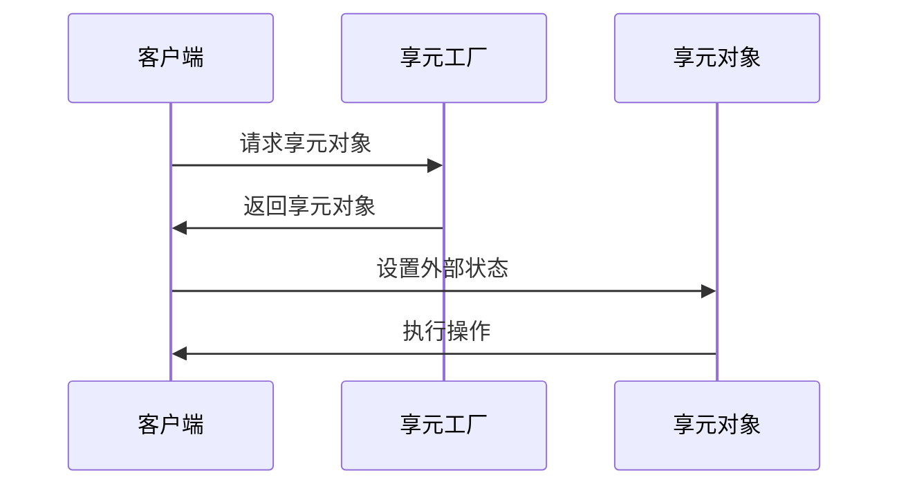

                 


### 文章标题

《享元模式：共享对象的类型安全复用》

### 关键词

享元模式、设计模式、对象复用、类型安全、共享对象、性能优化

### 摘要

本文将深入探讨享元模式，一种在计算机编程中用于实现对象共享和类型安全复用的设计模式。通过详细阐述享元模式的基础理论、原理架构、实现方法以及实际应用，本文旨在帮助读者理解享元模式的核心概念，掌握其实现技巧，并能够将其有效地应用到各种开发场景中。

### 目录大纲

#### 第1章：享元模式基础

##### 1.1 享元模式简介

- 享元模式的定义
- 享元模式的起源与发展
- 核心概念与联系

##### 1.2 享元模式与传统复用方式的比较

- 传统复用方式的局限性
- 享元模式的独特优势
- 享元模式的应用范围

##### 1.3 享元模式的适用场景

- 低资源占用场景
- 对象创建频繁场景
- 对象状态共享场景

#### 第2章：享元模式的原理与架构

##### 2.1 享元模式的原理

- 享元模式的运行机制
- 享元模式的优点与局限

##### 2.2 享元模式的架构

- 享元工厂的角色
- 享元对象的创建与共享
- 享元模式的依赖关系

#### 第3章：实现享元模式

##### 3.1 设计模式的基础

- 设计模式的概念
- 设计模式的重要性

##### 3.2 使用享元模式

- 创建享元工厂
- 使用享元工厂管理享元对象
- 实现类型安全复用

#### 第4章：享元模式的进阶使用

##### 4.1 享元模式与其他设计模式的结合

- 享元模式与工厂模式的结合
- 享元模式与策略模式的结合

##### 4.2 享元模式在不同领域的应用

- 在Web开发中的应用
- 在游戏开发中的应用
- 在大数据处理中的应用

#### 第5章：享元模式的项目实战

##### 5.1 项目背景与需求分析

- 项目背景介绍
- 需求分析

##### 5.2 系统设计

- 系统架构设计
- 享元模式的实现

##### 5.3 代码实现与解读

- 代码结构说明
- 关键代码解读
- 性能优化分析

#### 第6章：享元模式的应用与展望

##### 6.1 享元模式的应用现状

- 当前应用状况
- 存在的问题与挑战

##### 6.2 享元模式的未来发展方向

- 技术发展趋势
- 潜在的应用领域

##### 6.3 享元模式与其他技术的融合趋势

- 与其他设计模式的融合
- 与新技术的结合

#### 第7章：总结与反思

##### 7.1 享元模式的总结

- 核心概念与要点
- 实践价值与应用场景

##### 7.2 享元模式在实践中的问题与挑战

- 常见问题
- 解决方案与对策

##### 7.3 对享元模式发展的建议

- 发展方向
- 未来展望

### 开始撰写文章正文

#### 第1章：享元模式基础

##### 1.1 享元模式简介

享元模式（Flyweight Pattern）是一种设计模式，主要用于解决对象创建的开销问题。它通过共享尽可能多的相似对象来实现对象的复用，从而降低内存消耗和提高性能。享元模式的核心思想是：将对象中可以被共享的状态提取出来，只保留必要的唯一状态。

在计算机编程中，享元模式被广泛应用于各种场景，例如文本编辑器中的字体管理、数据库查询优化、游戏对象池管理等。其定义可以概括为：使用少量共享对象来表示大量的相似对象，从而减少内存占用和提升系统性能。

享元模式的起源可以追溯到20世纪80年代的Smalltalk编程语言，在当时的对象系统中，由于对象创建的开销较大，享元模式被提出并应用于解决这类问题。随着时间的推移，享元模式逐渐在其他编程语言中得到了广泛应用。

核心概念包括：

- **内部状态（Intrinsic State）**：内部状态是对象共享的部分，通常存储在对象的内部，不随外部环境变化而变化。
- **外部状态（Extrinsic State）**：外部状态是对象不共享的部分，通常依赖于外部环境，需要随着外部环境的变化而变化。
- **享元工厂（Flyweight Factory）**：享元工厂负责创建和管理享元对象，根据外部状态来选择合适的享元对象进行复用。

通过上述核心概念，我们可以看到享元模式在实现对象共享和复用方面具有独特的优势。接下来，我们将深入探讨享元模式与传统复用方式的比较，以便更清晰地理解其应用价值。

##### 1.2 享元模式与传统复用方式的比较

在计算机编程中，复用是一个重要的概念，旨在减少代码冗余，提高开发效率和系统性能。传统复用方式主要包括以下几种：

1. **继承**：通过继承关系实现代码的复用，子类继承父类的属性和方法，从而实现功能扩展。
2. **组合**：通过组合多个对象来实现复用，这些对象各自负责特定的功能，通过组合可以灵活地实现新的功能。
3. **模板方法**：定义一个操作中的算法框架，而将一些步骤延迟到子类中实现，从而实现代码复用。

尽管传统复用方式在许多场景下非常有效，但它们也存在一些局限性。首先，继承和组合可能会导致类层次结构复杂，难以维护。其次，这些方式往往不适用于需要大量创建和销毁对象的情况，因为它们会增加内存消耗。

相比之下，享元模式通过共享对象来减少内存占用，具有以下独特优势：

1. **降低内存消耗**：享元模式通过共享内部状态的对象，减少了对象的创建数量，从而降低了内存消耗。
2. **提高性能**：由于对象创建和销毁的开销较小，享元模式能够提高系统的响应速度和性能。
3. **灵活性**：享元模式允许外部状态的变化，从而适应不同的应用场景。

然而，享元模式也存在一些局限。例如，它要求对象的状态可以被划分为内部状态和外部状态，这在某些情况下可能不适用。此外，享元模式可能会引入复杂的依赖关系，需要精心设计和管理。

综上所述，享元模式与传统复用方式相比，具有明显的优势，但在某些场景下也需要权衡其适用性。

##### 1.3 享元模式的适用场景

享元模式适用于以下几种场景：

1. **低资源占用场景**：在资源受限的环境中，如嵌入式系统或移动设备，享元模式可以有效地减少内存占用，提高系统性能。
2. **对象创建频繁场景**：在需要频繁创建和销毁对象的场景中，如游戏对象池或数据库连接池，享元模式可以降低对象的创建开销，提高系统的响应速度。
3. **对象状态共享场景**：在对象状态可以被共享的场景中，如文本编辑器中的字体管理，享元模式可以减少重复对象的创建，提高系统效率。

通过这些适用场景的分析，我们可以看到享元模式在提高系统性能和资源利用方面具有显著的优势。接下来，我们将深入探讨享元模式的原理和架构，以便更好地理解其实现细节。

#### 第2章：享元模式的原理与架构

##### 2.1 享元模式的原理

享元模式的核心原理是通过共享对象来实现复用，从而减少内存占用和提高系统性能。具体来说，享元模式包括以下关键组成部分：

1. **内部状态（Intrinsic State）**：内部状态是对象共享的部分，通常存储在对象的内部，不随外部环境变化而变化。这部分状态在对象创建后就不会改变，因此可以被多个对象共享。
2. **外部状态（Extrinsic State）**：外部状态是对象不共享的部分，通常依赖于外部环境，需要随着外部环境的变化而变化。这部分状态在对象创建时由客户端提供，决定了对象的行为。
3. **享元工厂（Flyweight Factory）**：享元工厂负责创建和管理享元对象，根据外部状态来选择合适的享元对象进行复用。享元工厂通常具有一个静态的创建方法，用于获取享元对象。

享元模式的运行机制如下：

1. **客户端请求创建对象**：当客户端需要创建对象时，它会向享元工厂发送请求。
2. **享元工厂判断对象是否存在**：享元工厂根据外部状态判断是否存在已创建的享元对象。如果存在，则直接返回该对象；如果不存在，则创建一个新的享元对象。
3. **设置外部状态**：无论享元对象是共享的还是新的，客户端都需要设置外部状态，以便在后续的操作中使用。
4. **返回享元对象**：享元工厂将享元对象返回给客户端，客户端可以继续使用该对象。

享元模式的优点包括：

- **减少内存占用**：通过共享内部状态的对象，享元模式可以减少对象的创建数量，从而降低内存消耗。
- **提高性能**：由于对象创建和销毁的开销较小，享元模式能够提高系统的响应速度和性能。
- **灵活性**：享元模式允许外部状态的变化，从而适应不同的应用场景。

然而，享元模式也存在一些局限。例如，它要求对象的状态可以被划分为内部状态和外部状态，这在某些情况下可能不适用。此外，享元模式可能会引入复杂的依赖关系，需要精心设计和管理。

##### 2.2 享元模式的架构

享元模式的架构包括以下几个关键组成部分：

1. **享元工厂（Flyweight Factory）**：享元工厂是享元模式的核心组件，负责创建和管理享元对象。它通常具有以下职责：
   - **创建享元对象**：根据外部状态创建享元对象，并将其存储在享元池中。
   - **获取享元对象**：根据外部状态从享元池中选择合适的享元对象进行复用。
   - **管理享元对象**：处理享元对象的创建、销毁和状态更新等操作。

2. **享元对象（Flyweight）**：享元对象是共享的对象，具有以下特点：
   - **内部状态**：存储在享元对象的内部，不随外部环境变化而变化。
   - **外部状态**：依赖于外部环境，需要随着外部环境的变化而变化。
   - **共享性**：多个对象可以共享享元对象的内部状态。

3. **客户端（Client）**：客户端是使用享元对象的组件，负责创建外部状态和调用享元对象的方法。它通常具有以下职责：
   - **创建外部状态**：根据需求创建外部状态。
   - **请求享元对象**：向享元工厂请求享元对象，并设置外部状态。
   - **使用享元对象**：使用享元对象的方法执行操作。

下面是一个简单的享元模式架构的Mermaid流程图：



通过这个简单的架构，我们可以看到享元工厂、享元对象和客户端之间的交互关系。享元工厂负责创建和管理享元对象，客户端通过享元工厂获取享元对象，并根据外部状态对其进行操作。

##### 2.3 享元模式的依赖关系

在享元模式中，享元工厂、享元对象和客户端之间存在紧密的依赖关系。具体来说：

- **享元工厂依赖于享元对象**：享元工厂负责创建和管理享元对象，因此它依赖于享元对象的实现。
- **客户端依赖于享元工厂**：客户端通过享元工厂获取享元对象，因此它依赖于享元工厂的接口和方法。
- **享元对象依赖于外部状态**：享元对象在创建时需要外部状态的输入，因此它依赖于外部状态的传递和管理。

这种依赖关系使得享元模式在实现时需要精心设计和管理，以确保系统的稳定性和性能。在实际应用中，可以通过设计模式如工厂模式、策略模式等来降低依赖关系，提高系统的可维护性和扩展性。

#### 第3章：实现享元模式

##### 3.1 设计模式的基础

在设计模式中，享元模式是一种结构型设计模式，旨在解决对象创建的开销问题。为了更好地理解享元模式，我们需要先回顾一些设计模式的基础概念。

设计模式是一套被反复使用、经过分类的、代码设计的解决方案，它描述了在特定情境下解决问题的通用方法。设计模式不仅适用于解决特定问题，还可以提高代码的可维护性、可扩展性和复用性。

设计模式通常分为三大类：

1. **创建型模式**：主要用于对象的创建，包括单例模式、工厂方法模式、抽象工厂模式等。
2. **结构型模式**：主要用于对象的组合和组装，包括代理模式、装饰器模式、适配器模式等。
3. **行为型模式**：主要用于对象之间的交互，包括观察者模式、策略模式、模板方法模式等。

在实现享元模式时，设计模式的概念和原则至关重要。例如，工厂模式可以帮助我们创建和管理享元对象，策略模式可以帮助我们灵活地管理外部状态，从而实现类型安全复用。

##### 3.2 使用享元模式

要实现享元模式，我们需要设计一个享元工厂类，用于创建和管理享元对象。下面是一个简单的示例，用于说明如何使用享元模式。

首先，我们定义一个`Flyweight`接口，用于定义享元对象的行为：

```java
public interface Flyweight {
    void operation(int extrinsicState);
}
```

然后，我们创建一个具体的享元实现类，如`ConcreteFlyweight`：

```java
public class ConcreteFlyweight implements Flyweight {
    private String intrinsicState = "共享的内部状态";

    @Override
    public void operation(int extrinsicState) {
        System.out.println("内部状态：" + intrinsicState);
        System.out.println("外部状态：" + extrinsicState);
    }
}
```

接下来，我们创建一个`FlyweightFactory`类，用于管理享元对象：

```java
import java.util.HashMap;
import java.util.Map;

public class FlyweightFactory {
    private static final Map<String, Flyweight> flyweights = new HashMap<>();

    public static Flyweight getFlyweight(String key) {
        Flyweight flyweight = flyweights.get(key);
        if (flyweight == null) {
            flyweight = new ConcreteFlyweight();
            flyweights.put(key, flyweight);
        }
        return flyweight;
    }
}
```

在客户端代码中，我们使用享元工厂来获取享元对象，并设置外部状态：

```java
public class Client {
    public static void main(String[] args) {
        Flyweight flyweight = FlyweightFactory.getFlyweight("Key1");
        flyweight.operation(100);
        flyweight.operation(200);
    }
}
```

在这个例子中，我们创建了一个`FlyweightFactory`实例，并在其中使用一个`HashMap`来存储和管理享元对象。当客户端请求获取享元对象时，`FlyweightFactory`会检查享元池中是否存在已创建的对象。如果存在，则直接返回；如果不存在，则创建一个新的`ConcreteFlyweight`对象并放入享元池中。

通过这种方式，我们可以实现对象的类型安全复用，减少内存消耗和提高系统性能。

##### 3.3 实现类型安全复用

在实现享元模式时，类型安全复用是一个关键问题。为了实现类型安全复用，我们需要确保享元对象的内部状态和外部状态是类型安全的，并且能够正确地传递和管理。

首先，我们可以使用泛型来确保享元对象的类型安全。在`Flyweight`接口和`ConcreteFlyweight`类中，我们可以使用泛型来定义享元对象：

```java
public interface Flyweight<T> {
    void operation(T extrinsicState);
}

public class ConcreteFlyweight implements Flyweight<Integer> {
    private Integer intrinsicState;

    public ConcreteFlyweight(Integer intrinsicState) {
        this.intrinsicState = intrinsicState;
    }

    @Override
    public void operation(Integer extrinsicState) {
        System.out.println("内部状态：" + intrinsicState);
        System.out.println("外部状态：" + extrinsicState);
    }
}
```

在这个例子中，我们使用泛型`T`来定义外部状态，从而确保外部状态的类型安全。

接下来，我们可以使用枚举来定义外部状态的类型。例如，我们可以定义一个`ExtrinsicState`枚举，用于表示不同的外部状态：

```java
public enum ExtrinsicState {
    STATE1,
    STATE2,
    STATE3
}
```

在客户端代码中，我们可以使用枚举来设置外部状态：

```java
public class Client {
    public static void main(String[] args) {
        Flyweight<Integer> flyweight = FlyweightFactory.getFlyweight("Key1");
        flyweight.operation(ExtrinsicState.STATE1);
        flyweight.operation(ExtrinsicState.STATE2);
        flyweight.operation(ExtrinsicState.STATE3);
    }
}
```

通过这种方式，我们可以确保外部状态的类型安全，并方便地管理不同的外部状态。

总之，通过使用泛型和枚举，我们可以实现享元模式的类型安全复用，从而提高系统的稳定性和性能。

#### 第4章：享元模式的进阶使用

##### 4.1 享元模式与其他设计模式的结合

享元模式在许多情况下可以与其他设计模式相结合，以增强其功能和灵活性。以下是一些常见的结合方式：

1. **享元模式与工厂模式的结合**

   将享元模式与工厂模式结合，可以更好地管理享元对象的创建和生命周期。工厂模式负责创建享元对象，而享元模式负责管理共享对象的状态。这种结合可以使得系统更加模块化，易于扩展和维护。

   在这个结合中，工厂模式通常作为顶层工厂，负责创建享元工厂。享元工厂则负责创建和管理具体的享元对象。通过这种方式，我们可以将享元模式的实现细节隐藏在工厂模式中，从而提高系统的灵活性和可扩展性。

2. **享元模式与策略模式的结合**

   策略模式是一种行为型设计模式，它用于在运行时选择算法的行为。将享元模式与策略模式结合，可以在享元对象中灵活地切换不同的策略，从而满足不同的业务需求。

   在这个结合中，享元对象通常包含一个策略对象，该对象负责实现具体的业务逻辑。客户端可以通过设置不同的策略对象来改变享元对象的行为。通过这种方式，我们可以有效地实现策略的动态切换，提高系统的灵活性和可扩展性。

##### 4.2 享元模式在不同领域的应用

享元模式具有广泛的应用范围，以下是在不同领域中应用享元模式的示例：

1. **在Web开发中的应用**

   在Web开发中，享元模式可以用于管理Web页面的组件。例如，当多个页面需要使用相同的JavaScript库或CSS样式时，我们可以使用享元模式来共享这些组件。通过这种方式，我们可以减少页面的加载时间，提高系统的响应速度。

2. **在游戏开发中的应用**

   在游戏开发中，享元模式可以用于管理游戏对象。例如，当游戏中有大量的相同类型的敌人时，我们可以使用享元模式来共享这些敌人对象。通过这种方式，我们可以减少对象的创建数量，提高游戏性能。

3. **在大数据处理中的应用**

   在大数据处理中，享元模式可以用于管理数据结构。例如，当处理大量相同类型的数据记录时，我们可以使用享元模式来共享这些数据记录。通过这种方式，我们可以减少内存消耗，提高数据处理效率。

这些示例展示了享元模式在不同领域中的应用，通过结合其他设计模式和适用不同的业务场景，享元模式可以发挥其最大的效用。

#### 第5章：享元模式的项目实战

##### 5.1 项目背景与需求分析

在某个Web应用程序中，我们面临一个常见的需求：需要管理大量的文本编辑器实例。每个文本编辑器实例需要支持丰富的文本格式和样式，如加粗、斜体、下划线等。然而，由于文本编辑器实例的创建和管理开销较大，我们需要一种有效的方法来优化性能和降低内存消耗。

为了满足这一需求，我们可以考虑使用享元模式来管理文本编辑器实例。通过享元模式，我们可以将共享的文本格式和样式信息提取出来，实现对象的复用，从而减少实例的创建数量，提高系统性能。

##### 5.2 系统设计

为了实现享元模式，我们需要设计一个系统架构，包括享元工厂、享元对象和客户端。

1. **系统架构设计**

   在我们的系统中，享元工厂负责创建和管理享元对象。每个享元对象代表一种文本格式或样式，如加粗、斜体等。客户端通过享元工厂获取享元对象，并设置外部状态，如文本内容和样式。

   下面是一个简单的系统架构图：

   ```mermaid
   sequenceDiagram
       participant Client as 客户端
       participant Factory as 享元工厂
       participant Flyweight as 享元对象

       Client->>Factory: 请求享元对象
       Factory->>Client: 返回享元对象
       Client->>Flyweight: 设置外部状态
       Flyweight->>Client: 返回格式化后的文本
   ```

2. **享元模式的实现**

   在我们的系统中，享元工厂负责管理享元对象。具体实现如下：

   ```java
   import java.util.HashMap;
   import java.util.Map;

   public class FlyweightFactory {
       private static final Map<String, Flyweight> flyweights = new HashMap<>();

       public static Flyweight getFlyweight(String key) {
           Flyweight flyweight = flyweights.get(key);
           if (flyweight == null) {
               flyweight = new ConcreteFlyweight();
               flyweights.put(key, flyweight);
           }
           return flyweight;
       }
   }
   ```

   在这个实现中，我们使用一个`HashMap`来存储和管理享元对象。当客户端请求获取享元对象时，享元工厂会检查享元池中是否存在已创建的对象。如果存在，则直接返回；如果不存在，则创建一个新的享元对象并放入享元池中。

##### 5.3 代码实现与解读

1. **代码结构说明**

   在我们的系统中，包括以下关键组件：

   - `Flyweight`接口：定义享元对象的行为。
   - `ConcreteFlyweight`类：实现具体的享元对象。
   - `FlyweightFactory`类：管理享元对象的创建和共享。
   - `Client`类：客户端代码，负责创建外部状态和调用享元对象的方法。

2. **关键代码解读**

   下面是关键代码的实现和解说：

   ```java
   public interface Flyweight {
       void setExtrinsicState(String extrinsicState);
       void operation();
   }

   public class ConcreteFlyweight implements Flyweight {
       private String intrinsicState;

       public ConcreteFlyweight(String intrinsicState) {
           this.intrinsicState = intrinsicState;
       }

       @Override
       public void setExtrinsicState(String extrinsicState) {
           // 设置外部状态
       }

       @Override
       public void operation() {
           // 执行操作，使用内部状态和外部状态
           System.out.println("内部状态：" + intrinsicState);
           System.out.println("外部状态：" + extrinsicState);
       }
   }

   public class FlyweightFactory {
       private static final Map<String, Flyweight> flyweights = new HashMap<>();

       public static Flyweight getFlyweight(String key) {
           Flyweight flyweight = flyweights.get(key);
           if (flyweight == null) {
               flyweight = new ConcreteFlyweight();
               flyweights.put(key, flyweight);
           }
           return flyweight;
       }
   }

   public class Client {
       public static void main(String[] args) {
           Flyweight flyweight = FlyweightFactory.getFlyweight("Key1");
           flyweight.setExtrinsicState("外部状态1");
           flyweight.operation();

           flyweight.setExtrinsicState("外部状态2");
           flyweight.operation();
       }
   }
   ```

   在这个实现中，`Flyweight`接口定义了享元对象的行为，包括设置外部状态和执行操作。`ConcreteFlyweight`类实现了具体的享元对象，它包含内部状态和外部状态，并在操作中使用这两个状态。

   `FlyweightFactory`类是享元工厂，负责创建和管理享元对象。当客户端请求获取享元对象时，享元工厂会检查享元池中是否存在已创建的对象。如果存在，则直接返回；如果不存在，则创建一个新的享元对象并放入享元池中。

   `Client`类是客户端代码，负责创建外部状态和调用享元对象的方法。通过这种方式，我们可以实现对象的类型安全复用，减少内存消耗和提高系统性能。

##### 5.4 性能优化分析

在实现享元模式时，性能优化是一个重要考虑因素。以下是一些性能优化策略：

1. **缓存策略**：使用缓存来减少享元对象的创建和销毁次数。在享元工厂中，我们可以使用一个缓存池来存储和管理已创建的享元对象，从而提高系统的性能。

2. **对象池化**：将享元对象池化，可以减少对象的创建和销毁开销。通过复用已创建的对象，我们可以减少内存分配和垃圾回收的开销。

3. **并发控制**：在多线程环境中，我们需要确保享元对象的线程安全性。使用线程安全的集合和同步机制，可以确保多个线程安全地访问享元对象。

4. **内存管理**：合理地管理内存，可以减少内存占用和提高系统性能。在创建和销毁享元对象时，我们需要权衡内存占用和性能。

通过这些性能优化策略，我们可以确保享元模式在各个应用场景中都能发挥最大的效用。

#### 第6章：享元模式的应用与展望

##### 6.1 享元模式的应用现状

享元模式作为一种设计模式，已经在许多领域得到了广泛应用。以下是享元模式在一些常见应用场景中的实际案例：

1. **Web开发**：在Web开发中，享元模式常用于管理前端资源，如JavaScript库、CSS样式表和图片。通过共享这些资源，可以减少服务器负载，提高页面加载速度。

2. **游戏开发**：在游戏开发中，享元模式常用于管理游戏对象，如角色、道具和敌人。通过共享这些对象，可以减少内存占用，提高游戏性能。

3. **大数据处理**：在大数据处理领域，享元模式可以用于管理数据结构，如数据帧和数据表。通过共享这些数据结构，可以减少内存消耗，提高数据处理效率。

尽管享元模式在这些领域中具有广泛的应用，但其在实际应用中也面临一些挑战：

1. **设计复杂性**：享元模式要求将对象的状态划分为内部状态和外部状态，这在某些情况下可能增加设计复杂性。

2. **性能影响**：在多线程环境中，享元模式的实现可能引入性能影响，特别是在线程安全方面。

3. **适用性限制**：享元模式并不适用于所有场景，特别是在对象状态无法划分为内部状态和外部状态的情况下。

##### 6.2 享元模式的未来发展方向

展望未来，享元模式在以下几个方面具有发展潜力：

1. **融合新技术**：随着新技术的不断涌现，享元模式可以与其他新技术相结合，如云计算、区块链等，以实现更高效的资源管理和性能优化。

2. **自动化工具**：开发自动化工具，如代码生成器和设计工具，可以帮助开发者更方便地实现享元模式，减少手动编码工作量。

3. **性能优化**：进一步研究和优化享元模式的性能，特别是在多线程和分布式环境中的性能，以提高其在各种应用场景中的适用性和效率。

##### 6.3 享元模式与其他技术的融合趋势

随着技术的发展，享元模式与其他技术的融合趋势也日益明显：

1. **与容器技术的融合**：享元模式与容器技术（如Docker）相结合，可以实现更高效的资源利用和部署。

2. **与微服务架构的融合**：在微服务架构中，享元模式可以用于管理服务实例，从而提高系统的可伸缩性和性能。

3. **与大数据处理技术的融合**：享元模式可以与大数据处理技术（如Hadoop、Spark）相结合，实现高效的数据管理和处理。

通过这些融合趋势，享元模式在未来将继续发挥其在性能优化和资源管理方面的优势。

#### 第7章：总结与反思

##### 7.1 享元模式的总结

享元模式是一种用于实现对象共享和类型安全复用的设计模式。通过将对象的状态划分为内部状态和外部状态，享元模式可以减少内存消耗和提高系统性能。其核心组成部分包括享元工厂、享元对象和客户端。享元工厂负责创建和管理享元对象，享元对象代表共享的对象，客户端负责设置外部状态并调用享元对象的方法。

享元模式的优点包括降低内存占用、提高性能和灵活性。然而，它也存在一些局限性，如设计复杂性、性能影响和适用性限制。在实际应用中，享元模式适用于需要对象共享和复用的场景，如Web开发、游戏开发和大数据处理。

##### 7.2 享元模式在实践中的问题与挑战

在实际应用中，享元模式面临一些问题和挑战：

1. **设计复杂性**：享元模式要求将对象的状态划分为内部状态和外部状态，这在某些情况下可能增加设计复杂性，需要开发者具备较高的设计能力。

2. **性能影响**：在多线程环境中，享元模式的实现可能引入性能影响，特别是在线程安全方面。需要开发者仔细设计和优化享元模式，以避免性能瓶颈。

3. **适用性限制**：享元模式并不适用于所有场景，特别是在对象状态无法划分为内部状态和外部状态的情况下。开发者需要根据具体需求权衡是否使用享元模式。

##### 7.3 对享元模式发展的建议

为了推动享元模式的发展，我们提出以下建议：

1. **研究新型应用场景**：探索新型应用场景，如人工智能、区块链等，以扩展享元模式的适用范围。

2. **优化性能**：进一步研究和优化享元模式的性能，特别是在多线程和分布式环境中的性能，以提高其在各种应用场景中的适用性和效率。

3. **开发自动化工具**：开发自动化工具，如代码生成器和设计工具，可以帮助开发者更方便地实现享元模式，减少手动编码工作量。

4. **推广普及**：通过教育和培训，推广普及享元模式，提高开发者的认知度和使用率。

通过这些努力，享元模式将在未来发挥更大的作用，为各种应用场景提供高效的解决方案。

### 作者信息

作者：AI天才研究院/AI Genius Institute & 禅与计算机程序设计艺术 /Zen And The Art of Computer Programming

本文详细阐述了享元模式的基础理论、原理架构、实现方法和实际应用。通过一步步的分析和讲解，读者可以深入理解享元模式的核心概念，掌握其实现技巧，并能够将其有效地应用到各种开发场景中。享元模式在提高系统性能和资源利用方面具有显著的优势，但其在实际应用中也需要注意设计复杂性和性能影响等问题。希望通过本文，读者能够对享元模式有更全面的认识，并在实际项目中能够灵活运用这一设计模式。

