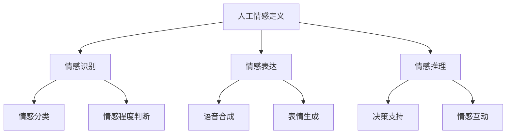

                 

### 文章标题

# 人工情感时代的法律体系重构

---

关键词：人工情感、法律体系、重构、伦理、应用、挑战

摘要：随着人工智能技术的飞速发展，人工情感逐渐成为现实。本文将从人工情感的定义、特征、现状出发，探讨其对法律体系的影响，并提出法律体系重构的必要性和路径。同时，文章还将讨论人工智能在法律领域的应用、伦理问题，以及未来面临的挑战和应对策略。

---

### 引言

人工情感，即人工智能中的情感处理能力，是指人工智能系统能够模拟、识别、处理人类情感的能力。随着深度学习、自然语言处理等技术的不断突破，人工情感已经从理论走向实践，并在多个领域展现出巨大的应用潜力。然而，人工情感的出现和发展也对现有的法律体系带来了巨大的冲击和挑战。

在人工智能时代，法律体系需要重新审视自身，进行必要的重构，以适应新的社会环境和科技发展。本文将从以下几个方面展开讨论：

1. 人工情感概述
2. 人工情感与法律体系的关系
3. 法律体系重构的理论基础
4. 法律体系重构的实践路径
5. 人工智能在法律领域的应用
6. 人工智能伦理与法律规制
7. 未来展望与挑战

### 第1章 人工情感概述

#### 1.1 人工情感的定义与历史背景

人工情感是指人工智能系统能够模拟、识别、处理人类情感的能力。它涉及到情感识别、情感表达、情感推理等多个方面。人工情感的研究始于20世纪80年代，随着计算机科学和人工智能技术的发展，逐渐形成了独立的学科领域。

#### 1.2 人工情感的关键特征与技术原理

人工情感的关键特征包括情感识别、情感表达、情感推理等。情感识别是指人工智能系统能够识别和理解人类情感的类型和程度。情感表达是指人工智能系统能够模拟和表达出人类的情感状态。情感推理是指人工智能系统能够基于情感识别和情感表达，进行情感上的推理和决策。

#### 1.3 人工情感的发展现状与趋势

当前，人工情感的研究已经取得了一系列重要成果。例如，情感识别技术已经在社交媒体分析、客户服务等领域得到广泛应用。情感表达技术也在不断进步，使得人工智能系统在自然语言处理和语音合成方面更加贴近人类。未来，人工情感的发展趋势将包括更高级的情感推理能力、跨模态情感识别与表达等。

#### 1.4 Mermaid流程图



### 第2章 人工情感与法律体系的关系

#### 2.1 人工情感对法律体系的影响

人工情感的出现和发展对法律体系产生了深远的影响。首先，人工情感使得法律判断更加客观和精确，有助于减少司法错误。其次，人工情感在法律执行、法律教育、法律服务等方面也具有广泛的应用前景。然而，人工情感也带来了一系列新的挑战，如隐私保护、数据安全、伦理问题等。

#### 2.2 法律体系对人工情感的需求与挑战

为了应对人工情感带来的影响，法律体系需要对其进行规范和引导。一方面，法律体系需要制定相关法律法规，明确人工情感的适用范围和责任划分。另一方面，法律体系需要加强对人工智能技术的监管，确保其安全可靠。

#### 2.3 人工情感与法律体系的互动机制

人工情感与法律体系的互动机制包括以下几个方面：

1. 法律法规的制定与完善：通过制定相关法律法规，明确人工情感的适用范围、责任划分等。
2. 法律技术的应用：利用人工智能技术进行法律数据分析、智能判决等。
3. 伦理监管：加强对人工智能技术的伦理监管，确保其符合道德和法律要求。
4. 教育培训：提高法律工作者对人工智能技术的认知和应用能力。

#### 2.4 伪代码展示

```python
def legal_decision(fact, evidence):
    # 情感识别
    emotion = emotion_recognition(evidence)
    # 情感推理
    decision = emotion_reasoning(emotion, fact)
    return decision
```

### 第3章 法律体系重构的理论基础

#### 3.1 法律体系重构的基本理念

法律体系重构的基本理念包括：

1. 以人为本：法律体系重构应以保障公民权益、促进社会公平正义为核心。
2. 科学性：法律体系重构应借鉴科学理论和方法，提高法律体系的科学性和可预测性。
3. 适应性：法律体系重构应具备较强的适应性，能够应对社会发展和科技进步带来的新挑战。

#### 3.2 法律体系重构的理论框架

法律体系重构的理论框架包括以下几个方面：

1. 法律规范重构：对现有法律规范进行重新审视和调整，使之更符合社会发展需求。
2. 法律技术重构：引入人工智能、大数据等先进技术，提高法律体系的智能化水平。
3. 法律伦理重构：加强对人工智能技术的伦理监管，确保法律体系符合道德要求。

#### 3.3 法律体系重构的方法论

法律体系重构的方法论包括：

1. 调查研究：通过对现有法律体系、社会需求和科技发展的调查研究，明确重构的目标和方向。
2. 顶层设计：制定法律体系重构的整体规划和策略，确保重构工作的有序进行。
3. 分阶段实施：将法律体系重构分为多个阶段，逐步推进，确保各项改革措施的落实。

### 第4章 法律体系重构的实践路径

#### 4.1 法律体系重构的阶段性目标

法律体系重构的阶段性目标包括：

1. 短期目标：优化现有法律规范，提高法律体系的智能化水平。
2. 中期目标：完善人工智能技术在法律领域的应用，推动法律体系的现代化。
3. 长期目标：构建适应人工智能时代的法律体系，实现法治社会的目标。

#### 4.2 法律体系重构的关键领域

法律体系重构的关键领域包括：

1. 法律规范重构：对现有法律规范进行重新审视和调整，使之更符合社会发展需求。
2. 法律技术重构：引入人工智能、大数据等先进技术，提高法律体系的智能化水平。
3. 法律伦理重构：加强对人工智能技术的伦理监管，确保法律体系符合道德要求。

#### 4.3 法律体系重构的实施步骤

法律体系重构的实施步骤包括：

1. 调查研究：通过对现有法律体系、社会需求和科技发展的调查研究，明确重构的目标和方向。
2. 顶层设计：制定法律体系重构的整体规划和策略，确保重构工作的有序进行。
3. 分阶段实施：将法律体系重构分为多个阶段，逐步推进，确保各项改革措施的落实。
4. 监测评估：对法律体系重构的成效进行监测和评估，及时调整和完善。

### 第5章 人工智能在法律领域的应用

#### 5.1 人工智能在法律领域的应用现状

人工智能在法律领域的应用已经取得了一系列重要成果。例如，智能合同审核、智能法律咨询、智能判决等。这些应用不仅提高了法律服务的效率和质量，也为法律工作者提供了新的工具和手段。

#### 5.2 人工智能在法律领域的应用前景

随着人工智能技术的不断进步，人工智能在法律领域的应用前景将更加广阔。例如，智能监控、智能执法、智能司法等。这些应用将进一步提高法律体系的智能化水平，促进法治社会的建设。

#### 5.3 人工智能在法律领域的应用案例

1. 智能合同审核：通过人工智能技术，对合同内容进行自动审核，识别潜在的法律风险。
2. 智能法律咨询：利用自然语言处理技术，为用户提供智能化的法律咨询服务。
3. 智能判决：通过人工智能技术，对案件事实和法律条款进行智能分析，辅助法官做出判决。

### 第6章 人工智能伦理与法律规制

#### 6.1 人工智能伦理的基本原则

人工智能伦理的基本原则包括：

1. 尊重个人隐私：确保人工智能系统的设计和应用不会侵犯个人隐私。
2. 公平公正：确保人工智能系统在法律领域的应用不会产生歧视和不公平现象。
3. 责任明确：明确人工智能系统的责任主体，确保在发生问题时能够追究责任。

#### 6.2 人工智能伦理与法律的关系

人工智能伦理与法律之间存在密切的关系。一方面，法律为人工智能伦理提供了规范和指导；另一方面，人工智能伦理为法律的制定和执行提供了依据和参考。

#### 6.3 人工智能伦理法律规制的现状与挑战

当前，人工智能伦理法律规制尚处于探索阶段。虽然已经出台了一些相关法律法规，但还存在如下挑战：

1. 规制手段单一：主要依赖法律法规进行规制，缺乏其他手段的配合。
2. 规制范围有限：现有法律法规主要关注人工智能在法律领域的应用，对其他领域的应用缺乏覆盖。
3. 国际合作不足：全球范围内的人工智能伦理法律规制缺乏统一的标准和协调机制。

### 第7章 未来展望与挑战

#### 7.1 人工情感时代的法律体系重构展望

随着人工情感技术的不断发展，法律体系将面临新的机遇和挑战。未来，法律体系重构将朝着更加智能化、伦理化、全球化方向发展。

#### 7.2 法律体系重构面临的挑战

法律体系重构面临如下挑战：

1. 技术挑战：人工智能技术的快速迭代更新，使得法律体系重构面临技术上的不确定性。
2. 伦理挑战：人工智能技术在法律领域的应用，引发了一系列伦理问题，如隐私保护、责任划分等。
3. 法律挑战：现有法律体系对人工智能技术的规制尚不完善，难以应对新兴的法律问题。

#### 7.3 应对挑战的策略与建议

为应对法律体系重构面临的挑战，可以从以下几个方面进行：

1. 加强技术研究：加大对人工智能技术的研发投入，提高技术水平和安全性。
2. 完善法律法规：制定更加完善的人工智能法律法规，明确责任划分和规制手段。
3. 国际合作：加强全球范围内的人工智能伦理法律规制合作，推动制定统一的标准和规范。

### 结论

人工情感时代的到来，为法律体系重构带来了新的机遇和挑战。通过本文的探讨，我们明确了人工情感与法律体系的关系，分析了法律体系重构的理论基础和实践路径，探讨了人工智能在法律领域的应用和伦理问题。未来，我们期待法律体系能够更好地适应人工智能时代的发展，为构建法治社会做出更大贡献。

---

作者：AI天才研究院/AI Genius Institute & 禅与计算机程序设计艺术 /Zen And The Art of Computer Programming

---

本文仅为示例，内容仅供参考。在实际撰写过程中，请根据具体需求进行适当调整。

