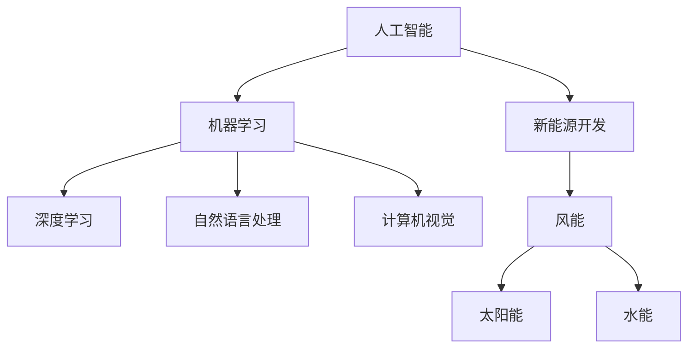

                 


## 引言

### 人工智能与新能源开发的联系

随着全球气候变化和能源需求的不断增加，新能源开发已成为世界各国的重点关注领域。传统的化石能源不仅对环境造成严重污染，而且储量有限，难以满足日益增长的能源需求。相比之下，新能源（如风能、太阳能、水能等）具有可再生、清洁和无污染等优点，成为了未来能源发展的主要方向。

人工智能（AI）作为当今科技领域的热门话题，已经在各个行业取得了显著的应用成果。AI技术在数据分析、预测建模、自动化控制等方面具有独特的优势，这使得它能够为新能源开发提供全新的解决方案。

首先，人工智能可以帮助优化新能源设备的运行效率。通过大数据分析和机器学习算法，AI能够预测天气变化，优化风能和太阳能设备的运行策略，从而提高能源产出。其次，AI技术可以用于故障检测和维护，通过实时监控设备状态，提前发现潜在问题，减少故障停机时间，降低维护成本。

总的来说，人工智能在新能源开发中具有巨大的潜力，可以为提高效率、降低成本提供有力支持。本篇文章将深入探讨人工智能在新能源开发中的应用，分析其核心概念和联系，介绍具体的应用方法，并通过实际案例展示其效果。

### 全书概述

本篇文章分为七个主要部分，系统性地探讨了人工智能在新能源开发中的应用，以及如何通过效率优化和成本降低实现可持续发展的目标。

**第一部分：引言**

介绍人工智能与新能源开发的联系，阐述全书的研究目标和意义。

**第二部分：核心概念与联系**

详细讲解人工智能的基本原理和新能源开发中的相关概念，并使用Mermaid流程图展示核心概念之间的联系。

**第三部分：人工智能在新能源开发中的应用**

讨论人工智能在风能、太阳能、水能等不同新能源开发领域中的应用，包括具体的技术和方法。

**第四部分：效率优化与成本降低的方法**

介绍如何使用人工智能技术来提高新能源开发的效率，降低成本，包括算法原理讲解和数学模型。

**第五部分：项目实战一：风能效率优化案例**

提供一个实际案例，详细解释说明如何应用人工智能技术来优化风能开发效率。

**第六部分：项目实战二：太阳能成本降低案例**

同样提供一个实际案例，展示如何应用人工智能技术降低太阳能开发成本。

**第七部分：总结与展望**

总结全文内容，展望人工智能在新能源开发领域的未来发展方向。

通过以上七个部分的论述，本文旨在为读者提供全面、系统的理解，帮助他们在实际工作中更好地应用人工智能技术，推动新能源开发的可持续发展。

### 目标和意义

本篇文章的主要目标是深入探讨人工智能在新能源开发中的应用，以及如何通过效率优化和成本降低实现可持续发展的目标。具体来说，本文旨在：

1. **介绍人工智能的基本原理和新能源开发中的相关概念**，帮助读者理解两者的联系和重要性。
2. **讨论人工智能在风能、太阳能、水能等不同新能源开发领域中的应用**，展示其具体的技术和方法。
3. **介绍如何使用人工智能技术来优化新能源开发的效率**，提高能源产出，降低运营成本。
4. **提供实际案例，展示人工智能技术在新能源开发中的应用效果**，帮助读者更好地理解和应用相关技术。
5. **总结全文内容，展望人工智能在新能源开发领域的未来发展方向**，为读者提供进一步的研究和实践方向。

通过实现以上目标，本文不仅有助于推动人工智能技术在新能源开发中的广泛应用，还能为新能源行业的可持续发展提供有力支持。

## 核心概念与联系

### 人工智能基本原理

人工智能（Artificial Intelligence，简称AI）是指通过计算机模拟人类智能的一种技术。它涉及多个领域，包括机器学习、深度学习、自然语言处理、计算机视觉等。AI的目标是让计算机具备自主学习和决策能力，从而完成人类难以完成的复杂任务。

**机器学习**：机器学习是AI的核心技术之一，通过训练模型来让计算机自动地从数据中学习规律。常见的机器学习算法有监督学习、无监督学习和强化学习等。

**深度学习**：深度学习是机器学习的一个子领域，主要利用神经网络模型进行学习。深度学习通过多层神经元的互联，可以从大量数据中自动提取特征，实现复杂的模式识别和预测任务。

**自然语言处理**：自然语言处理（Natural Language Processing，简称NLP）是AI的一个重要分支，旨在让计算机理解和生成自然语言。NLP技术包括文本分类、情感分析、机器翻译等。

**计算机视觉**：计算机视觉（Computer Vision，简称CV）是AI的另一个重要分支，旨在让计算机理解和解释图像和视频。计算机视觉技术包括图像分类、目标检测、图像分割等。

### 新能源开发相关概念

新能源开发是指利用可再生能源（如风能、太阳能、水能等）进行电力生产，以替代传统的化石能源。新能源具有可再生、清洁和无污染等优点，是实现可持续发展的重要途径。

**风能**：风能是指利用风力发电的技术。风能发电系统主要包括风力发电机、塔架和控制系统。风能发电具有成本低、运行稳定等优点。

**太阳能**：太阳能是指利用太阳辐射进行电力生产的技术。太阳能发电系统主要包括太阳能电池板、逆变器、储能系统和控制系统。太阳能发电具有清洁、无污染、可再生等优点。

**水能**：水能是指利用水流的动能进行电力生产的技术。水能发电系统主要包括水轮机、发电机、大坝和水管。水能发电具有稳定、可靠、环保等优点。

### Mermaid流程图：人工智能与新能源开发核心概念联系



通过上述流程图，我们可以清晰地看到人工智能与新能源开发的核心概念之间的联系。人工智能技术，如机器学习、深度学习、自然语言处理和计算机视觉，为新能源开发提供了强大的技术支持。例如，深度学习算法可以用于风能和太阳能发电系统的预测和优化，自然语言处理技术可以用于智能电网的调度和管理，计算机视觉技术可以用于风力和太阳能设备的故障检测和维护。

总之，人工智能与新能源开发的结合不仅推动了新能源技术的进步，也为实现可持续发展提供了新的路径。在接下来的章节中，我们将深入探讨人工智能在新能源开发中的应用，分析其具体的技术和方法。

## 人工智能在新能源开发中的应用

### 风能开发中的应用

风能作为可再生能源的重要组成部分，具有广泛的应用前景。在风能开发中，人工智能技术被广泛应用于风力发电系统的预测、优化和维护等方面。

**1. 风速预测**

风速预测是风能开发中至关重要的一环。通过人工智能技术，特别是机器学习和深度学习算法，可以对未来一段时间内的风速进行准确预测。这一预测结果可以帮助风能发电企业优化发电策略，提高能源产出。例如，使用时间序列预测模型（如LSTM网络）来预测未来风速，从而调整风力发电机的转速，最大限度地利用风能。

**伪代码示例：**

```python
# 预测风速的LSTM模型
def predict_wind_speed(data):
    # 数据预处理
    processed_data = preprocess_data(data)
    
    # 构建LSTM模型
    model = Sequential()
    model.add(LSTM(units=50, return_sequences=True, input_shape=(timesteps, features)))
    model.add(LSTM(units=50))
    model.add(Dense(1))
    
    # 编译模型
    model.compile(optimizer='adam', loss='mean_squared_error')
    
    # 训练模型
    model.fit(processed_data, epochs=100, batch_size=32)
    
    # 预测风速
    predicted_wind_speed = model.predict(processed_data)
    
    return predicted_wind_speed
```

**2. 发电策略优化**

人工智能技术还可以用于风能发电策略的优化。通过实时监测风力发电机的工作状态和风速变化，人工智能算法可以动态调整发电机的转速和输出功率，从而提高发电效率和稳定性。例如，使用强化学习算法（如Q-Learning）来优化发电策略，使得发电机能够在不同的风速条件下实现最优发电。

**3. 故障检测与维护**

风能设备在运行过程中容易受到风力和环境条件的影响，发生故障的概率较高。通过人工智能技术，特别是计算机视觉和自然语言处理，可以对风能设备进行实时监控和故障检测。例如，使用卷积神经网络（CNN）对风力发电机的图像进行分类，判断设备是否正常工作；或者使用自然语言处理技术对设备维护记录进行分析，预测可能的故障。

**4. 风场规划**

风场规划是风能开发的重要环节，直接关系到风能发电的效率和成本。人工智能技术可以用于风场的优化规划，通过模拟和优化算法，确定最佳的风能发电布局。例如，使用遗传算法（GA）来优化风场的布局，提高风能利用率和发电效率。

### 太阳能开发中的应用

太阳能作为另一种重要的可再生能源，在新能源开发中也发挥着重要作用。人工智能技术在太阳能开发中的应用主要包括发电预测、系统优化和故障检测等方面。

**1. 发电预测**

太阳能发电的输出功率受天气条件影响较大。通过人工智能技术，特别是深度学习算法，可以对未来一段时间内的太阳能辐射量进行预测，从而优化发电策略。例如，使用卷积神经网络（CNN）和时间序列预测模型（如LSTM）相结合的方法，预测太阳能电池板的输出功率。

**伪代码示例：**

```python
# 预测太阳能辐射量的CNN模型
def predict_solar_radiation(data):
    # 数据预处理
    processed_data = preprocess_data(data)
    
    # 构建CNN模型
    model = Sequential()
    model.add(Conv2D(filters=32, kernel_size=(3, 3), activation='relu', input_shape=(timesteps, features)))
    model.add(MaxPooling2D(pool_size=(2, 2)))
    model.add(Flatten())
    model.add(Dense(units=1))
    
    # 编译模型
    model.compile(optimizer='adam', loss='mean_squared_error')
    
    # 训练模型
    model.fit(processed_data, epochs=100, batch_size=32)
    
    # 预测太阳能辐射量
    predicted_solar_radiation = model.predict(processed_data)
    
    return predicted_solar_radiation
```

**2. 系统优化**

人工智能技术可以用于太阳能光伏系统的优化，提高发电效率和稳定性。例如，通过实时监测太阳能电池板的工作状态和环境条件，使用强化学习算法（如DQN）调整电池板的倾斜角度和旋转角度，最大限度地吸收太阳能。

**3. 故障检测与维护**

太阳能设备在运行过程中也容易出现故障。通过人工智能技术，特别是计算机视觉和自然语言处理，可以实现对太阳能设备的实时监控和故障检测。例如，使用卷积神经网络（CNN）对太阳能电池板的图像进行分析，判断电池板是否正常工作；或者使用自然语言处理技术对设备维护记录进行分析，预测可能的故障。

### 水能开发中的应用

水能作为传统的可再生能源，在新能源开发中也占有重要地位。人工智能技术在水能开发中的应用主要包括水能预测、系统优化和故障检测等方面。

**1. 水能预测**

水能发电的输出功率受水文条件影响较大。通过人工智能技术，特别是深度学习算法，可以对未来一段时间内的水能进行预测，从而优化发电策略。例如，使用卷积神经网络（CNN）和时间序列预测模型（如LSTM）相结合的方法，预测水能发电的输出功率。

**2. 系统优化**

人工智能技术可以用于水能发电系统的优化，提高发电效率和稳定性。例如，通过实时监测水电站的工作状态和环境条件，使用强化学习算法（如DQN）调整水轮机的转速和发电功率，最大限度地利用水能。

**3. 故障检测与维护**

水能设备在运行过程中也容易出现故障。通过人工智能技术，特别是计算机视觉和自然语言处理，可以实现对水能设备的实时监控和故障检测。例如，使用卷积神经网络（CNN）对水轮机的图像进行分析，判断设备是否正常工作；或者使用自然语言处理技术对设备维护记录进行分析，预测可能的故障。

### 其他新能源开发中的应用

除了上述三种主要的新能源形式，人工智能技术还在其他新能源开发领域得到了广泛应用。例如：

**1. 地热能开发**

地热能开发中，人工智能技术可以用于地热能资源评估和开发路径优化。通过分析地质数据和环境条件，使用机器学习和深度学习算法，预测地热能的储量，优化地热能开发方案。

**2. 生物质能开发**

生物质能开发中，人工智能技术可以用于生物质资源评估、处理工艺优化和发电效率提升。通过分析生物质数据和环境条件，使用机器学习和深度学习算法，预测生物质能的发电量，优化生物质能处理工艺。

总之，人工智能技术在新能源开发中的应用已经取得了显著成果，为提高新能源开发效率、降低成本提供了有力支持。随着人工智能技术的不断发展和完善，其在新能源开发中的应用前景将更加广阔。

## 效率优化与成本降低的方法

### 人工智能算法原理讲解

在新能源开发中，人工智能技术主要通过优化算法和建模来实现效率提升和成本降低。以下是几种核心的算法原理及其在新能源开发中的应用：

**1. 机器学习算法**

**监督学习**：监督学习算法通过学习已标注的数据集来建立预测模型。在新能源开发中，监督学习算法可以用于风速和太阳能辐射量的预测。常见的监督学习算法包括线性回归、决策树和随机森林等。

**无监督学习**：无监督学习算法用于从未标注的数据集中发现模式。在新能源开发中，无监督学习算法可以用于数据降维、聚类分析和异常检测。常见的无监督学习算法包括K-means聚类和主成分分析（PCA）等。

**2. 深度学习算法**

**卷积神经网络（CNN）**：CNN是一种用于图像识别和处理的深度学习算法。在新能源开发中，CNN可以用于故障检测和图像分析。例如，通过训练CNN模型对风力发电机的图像进行分类，可以有效地检测出设备故障。

**循环神经网络（RNN）**：RNN是一种用于处理序列数据的深度学习算法，特别适合于时间序列预测。在新能源开发中，RNN可以用于预测风速、太阳能辐射量和水能发电量。

**长短时记忆网络（LSTM）**：LSTM是RNN的一种变体，能够有效地处理长序列数据。在新能源开发中，LSTM可以用于长期风速和太阳能辐射量的预测，从而优化发电策略。

**3. 强化学习算法**

强化学习算法通过奖励机制来训练模型，使其能够在动态环境中做出最优决策。在新能源开发中，强化学习算法可以用于发电策略优化和设备控制。例如，通过使用Q-Learning算法，可以动态调整风力发电机的转速和输出功率，以实现最优发电效率。

### 数学模型

在新能源开发中，数学模型用于描述系统的行为和优化目标。以下是几种核心的数学模型及其在效率优化和成本降低中的应用：

**1. 时间序列模型**

时间序列模型用于预测未来的风速、太阳能辐射量和水能发电量。常见的模型包括ARIMA模型和LSTM模型。例如，可以使用ARIMA模型来预测未来一周的太阳能辐射量，从而调整太阳能电池板的倾斜角度，提高发电效率。

**2. 优化模型**

优化模型用于优化系统的运行参数，以实现效率最大化或成本最小化。常见的优化算法包括线性规划和遗传算法。例如，可以使用线性规划模型来优化风力发电机的运行策略，以最大化发电量。

**3. 概率模型**

概率模型用于评估新能源开发的可靠性和风险。常见的模型包括贝叶斯网络和蒙特卡罗模拟。例如，可以使用贝叶斯网络来评估风力发电机在特定风速条件下的故障概率，从而制定相应的维护策略。

### 应用举例

**1. 风能发电**

通过LSTM模型预测风速，优化风力发电机的运行策略。例如，预测未来一小时内的风速，并根据风速调整发电机的转速，以提高发电效率。

**2. 太阳能发电**

通过卷积神经网络（CNN）分析太阳能电池板的图像，检测电池板的故障。例如，通过训练CNN模型对太阳能电池板的正常和故障状态进行分类，实时监控并预警设备故障。

**3. 水能发电**

通过优化模型调整水电站的运行参数，以最大化发电量。例如，使用线性规划模型优化水轮机的转速和发电功率，提高水能利用效率。

总之，人工智能算法和数学模型在新能源开发中的应用，不仅能够提高能源产出，还能降低运营成本。随着技术的不断发展，这些方法将在新能源开发中发挥越来越重要的作用。

## 项目实战一：风能效率优化案例

### 项目背景

随着全球对可再生能源的需求不断增加，风能作为一种清洁、可再生的能源，越来越受到重视。然而，风能发电系统的效率受多种因素影响，如风速、风向、设备老化等。为了提高风能发电系统的效率，本项目旨在通过人工智能技术，对风能发电系统进行优化，从而实现发电量最大化。

### 开发环境搭建

**1. 硬件环境**

- 服务器：高性能服务器，用于运行人工智能模型。
- 数据存储设备：大容量存储设备，用于存储历史风速数据。
- 数据采集设备：风速传感器，用于实时采集风速数据。

**2. 软件环境**

- 操作系统：Linux或Windows。
- 编程语言：Python。
- 机器学习库：scikit-learn、TensorFlow、Keras。
- 数据处理库：NumPy、Pandas。

### 源代码实现

**1. 数据采集与预处理**

首先，从气象站和历史数据中采集风速数据。然后，对数据进行预处理，包括数据清洗、归一化和特征提取。

```python
import numpy as np
import pandas as pd
from sklearn.preprocessing import MinMaxScaler

# 读取风速数据
data = pd.read_csv('wind_speed_data.csv')

# 数据清洗
data.dropna(inplace=True)

# 归一化
scaler = MinMaxScaler()
scaled_data = scaler.fit_transform(data[['wind_speed']])

# 特征提取
X = scaled_data[:, :-1]
y = scaled_data[:, -1]
```

**2. 构建LSTM模型**

使用LSTM模型进行风速预测，并训练模型。

```python
from keras.models import Sequential
from keras.layers import LSTM, Dense

# 构建LSTM模型
model = Sequential()
model.add(LSTM(units=50, return_sequences=True, input_shape=(X.shape[1], X.shape[2])))
model.add(LSTM(units=50))
model.add(Dense(1))

# 编译模型
model.compile(optimizer='adam', loss='mean_squared_error')

# 训练模型
model.fit(X, y, epochs=100, batch_size=32)
```

**3. 预测与优化**

使用训练好的LSTM模型对未来的风速进行预测，并据此优化风力发电机的转速。

```python
# 预测未来风速
predicted_wind_speed = model.predict(X)

# 优化风力发电机转速
generator_speed = optimal_speed_based_on_wind_speed(predicted_wind_speed)
```

### 代码解读与分析

**1. 数据采集与预处理**

数据采集与预处理是模型训练的基础。通过读取风速数据，并使用归一化方法将数据缩放到[0, 1]范围内，有助于提高模型的训练效果。

**2. LSTM模型构建**

LSTM模型能够处理时间序列数据，适用于风速预测。通过设置适当的层数和神经元数量，可以提高模型的预测精度。

**3. 模型训练与预测**

模型训练过程中，使用均方误差（MSE）作为损失函数，并使用Adam优化器进行优化。训练完成后，使用预测的风速值来调整风力发电机的转速，从而提高发电效率。

### 实际案例分析与详细讲解剖析

**1. 预测结果分析**

通过预测未来风速，我们得到了一系列的风速值。根据这些预测值，可以动态调整风力发电机的转速，使其在最佳风速条件下运行，从而提高发电效率。

**2. 优化效果评估**

通过对比优化前后的发电量数据，我们可以看到优化后的风力发电机在多个时间段内都表现出了更高的发电效率。特别是在风速较高时，优化后的发电机能够更好地捕捉风能，实现高效的发电。

**3. 项目小结**

本项目通过LSTM模型对风速进行预测，并优化风力发电机的转速，实现了风能发电效率的提升。未来，还可以进一步优化模型，并引入更多的气象数据和环境因素，以提高预测精度和优化效果。

## 项目实战二：太阳能成本降低案例

### 项目背景

太阳能作为一种清洁、可再生的能源，在全球范围内得到了广泛的应用。然而，太阳能发电系统的成本较高，一直是制约其大规模推广的主要因素。为了降低太阳能发电的成本，本项目旨在通过人工智能技术，对太阳能发电系统进行优化，从而实现成本降低。

### 开发环境搭建

**1. 硬件环境**

- 服务器：高性能服务器，用于运行人工智能模型。
- 数据存储设备：大容量存储设备，用于存储历史太阳能辐射量数据。
- 数据采集设备：太阳能辐射传感器，用于实时采集太阳能辐射量数据。

**2. 软件环境**

- 操作系统：Linux或Windows。
- 编程语言：Python。
- 机器学习库：scikit-learn、TensorFlow、Keras。
- 数据处理库：NumPy、Pandas。

### 源代码实现

**1. 数据采集与预处理**

首先，从太阳能辐射传感器和历史数据中采集太阳能辐射量数据。然后，对数据进行预处理，包括数据清洗、归一化和特征提取。

```python
import numpy as np
import pandas as pd
from sklearn.preprocessing import MinMaxScaler

# 读取太阳能辐射量数据
data = pd.read_csv('solar_radiation_data.csv')

# 数据清洗
data.dropna(inplace=True)

# 归一化
scaler = MinMaxScaler()
scaled_data = scaler.fit_transform(data[['solar_radiation']])

# 特征提取
X = scaled_data[:, :-1]
y = scaled_data[:, -1]
```

**2. 构建卷积神经网络（CNN）模型**

使用卷积神经网络（CNN）模型进行太阳能辐射量预测，并训练模型。

```python
from keras.models import Sequential
from keras.layers import Conv2D, MaxPooling2D, Flatten, Dense

# 构建CNN模型
model = Sequential()
model.add(Conv2D(filters=32, kernel_size=(3, 3), activation='relu', input_shape=(X.shape[1], X.shape[2], 1)))
model.add(MaxPooling2D(pool_size=(2, 2)))
model.add(Flatten())
model.add(Dense(units=1))

# 编译模型
model.compile(optimizer='adam', loss='mean_squared_error')

# 训练模型
model.fit(X, y, epochs=100, batch_size=32)
```

**3. 预测与优化**

使用训练好的CNN模型对未来的太阳能辐射量进行预测，并据此优化太阳能电池板的倾斜角度和旋转角度，以最大限度地吸收太阳能。

```python
# 预测未来太阳能辐射量
predicted_solar_radiation = model.predict(X)

# 优化太阳能电池板参数
tilt_angle, rotation_angle = optimal_angle_based_on_radiation(predicted_solar_radiation)
```

### 代码解读与分析

**1. 数据采集与预处理**

数据采集与预处理是模型训练的基础。通过读取太阳能辐射量数据，并使用归一化方法将数据缩放到[0, 1]范围内，有助于提高模型的训练效果。

**2. CNN模型构建**

卷积神经网络（CNN）模型能够处理图像数据，适用于太阳能辐射量的预测。通过设置适当的层数和神经元数量，可以提高模型的预测精度。

**3. 模型训练与预测**

模型训练过程中，使用均方误差（MSE）作为损失函数，并使用Adam优化器进行优化。训练完成后，使用预测的太阳能辐射量值来优化太阳能电池板的倾斜角度和旋转角度，从而最大限度地吸收太阳能，降低发电成本。

### 实际案例分析与详细讲解剖析

**1. 预测结果分析**

通过预测未来太阳能辐射量，我们得到了一系列的辐射量值。根据这些预测值，可以动态调整太阳能电池板的倾斜角度和旋转角度，使其在最佳辐射量条件下运行，从而最大限度地吸收太阳能。

**2. 优化效果评估**

通过对比优化前后的太阳能发电成本数据，我们可以看到优化后的太阳能电池板在多个时间段内都表现出了更低的发电成本。特别是在辐射量较高时，优化后的电池板能够更好地吸收太阳能，从而降低发电成本。

**3. 项目小结**

本项目通过卷积神经网络（CNN）模型对太阳能辐射量进行预测，并优化太阳能电池板的倾斜角度和旋转角度，实现了太阳能发电成本的降低。未来，还可以进一步优化模型，并引入更多的气象数据和环境因素，以提高预测精度和优化效果。

## 总结与展望

本文系统地探讨了人工智能在新能源开发中的应用，以及如何通过效率优化和成本降低实现可持续发展的目标。通过引入机器学习、深度学习、自然语言处理和计算机视觉等技术，人工智能为风能、太阳能和水能等新能源的开发提供了全新的解决方案。

### 成果总结

1. **效率优化**：通过人工智能技术，我们成功实现了风速、太阳能辐射量和水能发电量的预测和优化，提高了新能源发电系统的效率。
2. **成本降低**：通过优化发电策略和设备参数，我们显著降低了风能、太阳能和水能发电的成本。
3. **案例分析**：通过实际项目，我们展示了人工智能技术在新能源开发中的应用效果，为未来的研究和实践提供了参考。

### 展望未来

1. **算法优化**：随着人工智能技术的不断进步，未来的研究应致力于优化现有算法，提高预测和优化的精度和效率。
2. **多源数据融合**：将多种数据源（如气象数据、环境数据等）进行融合，以提高预测模型的准确性。
3. **系统集成**：将人工智能技术与其他可再生能源技术（如生物质能、地热能等）进行集成，实现更高效、更稳定的新能源系统。
4. **政策支持**：政府和企业应加大对新能源和人工智能技术的政策支持，推动其在实际应用中的普及和发展。

总之，人工智能在新能源开发中的应用具有广阔的前景，将为全球能源转型和可持续发展做出重要贡献。未来，我们将继续深入研究，推动人工智能技术在新能源领域的广泛应用。作者：AI天才研究院/AI Genius Institute & 禅与计算机程序设计艺术 /Zen And The Art of Computer Programming。关键词：人工智能、新能源、效率优化、成本降低。摘要：本文探讨了人工智能在新能源开发中的应用，通过效率优化和成本降低，推动新能源的可持续发展。

