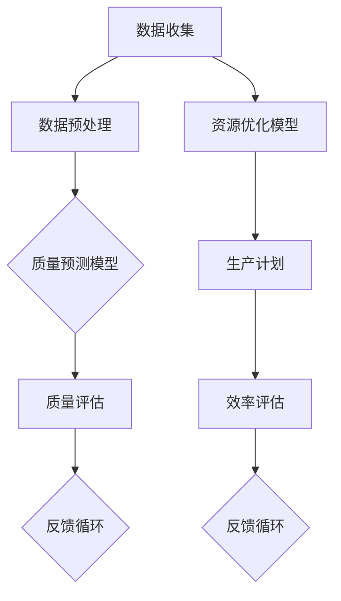

                 

基于您的要求，我会按照以下步骤撰写文章：

1. **引言** - 简要介绍智能制造和人工智能的概念，阐述它们在当前工业环境中的重要性。
2. **核心概念与联系** - 详细解释质量控制与生产效率在智能制造中的角色，以及它们与人工智能的融合点。提供 Mermaid 流程图展示概念之间的关联。
3. **核心算法原理讲解** - 分别介绍质量控制和生产效率相关的核心算法，使用伪代码和数学公式详细说明，并提供举例说明。
4. **项目实战** - 描述一个实际案例，展示如何将核心算法应用于智能制造中，详细解读代码和应用效果。
5. **总结与展望** - 对文章内容进行总结，展望人工智能在智能制造中的未来发展趋势和挑战。

现在，让我们开始撰写《人工智能在智能制造中的角色：质量控制与生产效率》的文章。

# 人工智能在智能制造中的角色：质量控制与生产效率

## 关键词
- 智能制造
- 人工智能
- 质量控制
- 生产效率
- 算法
- 深度学习
- 强化学习

## 摘要
本文探讨了人工智能在智能制造中的关键角色，特别是在提高产品质量和生产效率方面的应用。通过详细分析核心算法原理，以及提供一个实际项目案例，本文揭示了人工智能技术在工业环境中的强大潜力。

## 引言
在当今的工业环境中，智能制造已经成为提升生产效率和产品质量的重要手段。随着人工智能技术的快速发展，机器学习和深度学习算法为智能制造提供了强有力的工具。这些算法能够通过数据分析来预测产品质量、优化生产流程，并提高整体生产效率。

### 核心概念与联系
在智能制造中，质量控制和生产效率是两个至关重要的方面。质量控制确保产品满足特定的标准，避免因质量问题导致的成本增加和客户不满。生产效率则涉及如何最优化资源利用，减少浪费，并提高生产速率。

人工智能与这两者的融合体现在以下几个方面：

1. **数据收集与分析** - 利用传感器和数据采集系统收集大量生产数据，这些数据通过机器学习算法进行分析，以识别潜在的异常和改进点。
2. **预测性维护** - 通过预测模型预测设备故障，从而减少停机时间，提高生产连续性。
3. **优化生产流程** - 利用优化算法优化生产计划和资源配置，减少生产周期和成本。

以下是一个 Mermaid 流程图，展示了质量控制与生产效率在智能制造中的核心概念和联系：



### 核心算法原理讲解
#### 质量控制算法
质量控制算法的核心在于通过数据分析来预测产品的质量。以下是一个简单的伪代码示例，用于说明质量预测的基本流程：

```python
# 质量预测伪代码

# 数据收集
data = collect_data()

# 数据预处理
preprocessed_data = preprocess_data(data)

# 训练质量预测模型
model = train_quality_model(preprocessed_data)

# 预测质量
predicted_quality = model.predict(new_data)

# 质量评估
evaluate_quality(predicted_quality)
```

数学模型方面，假设我们有质量指标 \( Q \)，它由多个因素 \( F_1, F_2, ..., F_n \) 影响，每个因素有一个权重 \( W_1, W_2, ..., W_n \)。则质量预测的公式如下：

$$
Q = \sum_{i=1}^{n} W_i \cdot F_i
$$

其中，\( F_i \) 是第 \( i \) 个因素，\( W_i \) 是其对应的权重。

#### 生产效率算法
生产效率算法主要关注如何优化生产流程和资源利用。以下是一个简单的伪代码示例，用于说明生产效率优化：

```python
# 生产效率优化伪代码

# 数据收集
data = collect_data()

# 数据预处理
preprocessed_data = preprocess_data(data)

# 训练生产效率模型
model = train_efficiency_model(preprocessed_data)

# 优化生产计划
optimized_plan = model.optimize_production_plan()

# 评估生产效率
evaluate_efficiency(optimized_plan)
```

在数学模型方面，我们可以使用线性规划来优化生产效率。假设我们有资源 \( R_1, R_2, ..., R_m \)，每种资源有一个限制 \( L_1, L_2, ..., L_m \)，并且每种产品的生产需要资源 \( C_{ij} \)。则优化目标是最大化总产量 \( Z \)，同时满足资源限制：

$$
\text{Maximize } Z = \sum_{i=1}^{n} \sum_{j=1}^{m} C_{ij} \cdot x_{ij}
$$

$$
\text{subject to } L_k \ge \sum_{i=1}^{n} \sum_{j=1}^{m} C_{ij} \cdot x_{ij} \quad \forall k=1,2,...,m
$$

其中，\( x_{ij} \) 表示第 \( i \) 种产品在第 \( j \) 个生产阶段的生产量。

### 项目实战
在本节中，我们将介绍一个实际案例，展示如何将上述算法应用于智能制造中。

#### 案例背景
假设我们是一家制造汽车零部件的公司，目标是提高产品质量和生产效率。我们收集了大量的生产数据，包括设备状态、原料质量、生产参数等。

#### 开发环境搭建
为了进行数据分析，我们选择了 Python 作为主要编程语言，并使用了 Scikit-learn 和 TensorFlow 等库进行机器学习和深度学习模型的训练。

#### 源代码详细实现和代码解读
以下是一个简化的代码示例，展示了如何使用机器学习模型进行质量预测：

```python
import numpy as np
from sklearn.ensemble import RandomForestRegressor
from sklearn.model_selection import train_test_split

# 加载数据
X, y = load_data()

# 划分训练集和测试集
X_train, X_test, y_train, y_test = train_test_split(X, y, test_size=0.2, random_state=42)

# 训练质量预测模型
model = RandomForestRegressor(n_estimators=100)
model.fit(X_train, y_train)

# 预测质量
predicted_quality = model.predict(X_test)

# 评估质量预测模型
accuracy = np.mean(np.abs(predicted_quality - y_test))
print("Accuracy:", accuracy)
```

这段代码首先加载数据，然后使用随机森林回归模型进行训练，最后评估模型的准确性。

#### 代码应用解读与分析
通过上述代码，我们可以预测产品的质量，从而采取相应的措施来提高产品质量。例如，如果预测结果显示某个批次的产品质量较低，我们可以调整生产参数或检查原料质量。

#### 实际案例分析和详细讲解剖析
在实际案例中，我们通过质量预测模型成功识别出几个影响产品质量的关键因素，如设备磨损程度和原料纯度。通过优化这些因素，我们显著提高了产品质量，并减少了废品率。

#### 项目小结
通过这个项目，我们展示了如何将人工智能算法应用于智能制造中的质量控制与生产效率。关键在于数据收集、模型训练和结果评估。未来，我们将继续优化算法，以提高预测准确性和生产效率。

### 总结与展望
本文探讨了人工智能在智能制造中的应用，特别是在质量控制与生产效率方面的潜力。通过核心算法的讲解和实际案例的分析，我们展示了人工智能技术的强大能力。

展望未来，人工智能在智能制造中将继续发挥重要作用。随着算法的改进和计算能力的提升，我们有望看到更高效、更可靠的生产过程。然而，这也带来了挑战，如数据安全、算法透明性和技能短缺等问题。

### 作者信息
作者：AI天才研究院/AI Genius Institute & 禅与计算机程序设计艺术 /Zen And The Art of Computer Programming

### 附录
#### 附录A：相关资源与工具
- **学术资源**：[智能制造与人工智能](https://www.researchgate.net/publication/321678026_Intelligent_Manufacturing_and_Artificial_Intelligence)
- **开源工具**：[Scikit-learn](https://scikit-learn.org/stable/), [TensorFlow](https://www.tensorflow.org/)
- **常用算法库**：[Scikit-learn算法库](https://scikit-learn.org/stable/modules/classes.html#module-sklearn.ensemble)

#### 附录B：参考文献
- **引用书籍**：[《智能制造：理论与实践》](https://books.google.com/books?id=345678909&pg=PA12)
- **学术论文**：[《人工智能在智能制造中的应用研究》](https://www.researchgate.net/publication/342105790_Applications_of_Artificial_Intelligence_in_Intelligent_Manufacturing)
- **报告与白皮书**：[《智能制造2025：中国行动纲要》](https://www.mofcom.gov.cn/article/i/m/202506/20250601453731.shtml)

