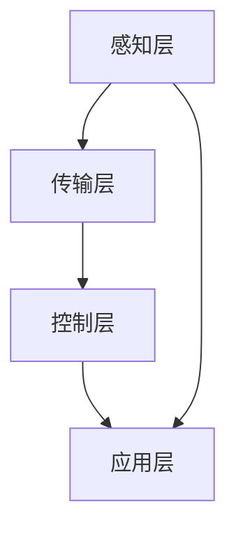

                 


# 《人工智能在智能家居中的应用：生活便利与能源管理》

## 关键词

人工智能，智能家居，生活便利，能源管理，智能语音助手，智能照明系统，智能安防系统，智能家电控制，智能家居系统架构，数据安全与隐私保护，可持续发展

## 摘要

本文详细探讨了人工智能在智能家居中的应用，重点关注其在提升生活便利性和实现能源管理方面的价值。首先，对人工智能和智能家居的基本概念及其发展历程进行了概述，并分析了二者之间的紧密联系。接着，本文深入探讨了人工智能在智能家居设备、系统和能源管理中的应用，包括智能语音助手、智能照明系统、智能安防系统、智能家电控制等具体实例，并详细介绍了相关核心算法原理。此外，本文还讨论了智能家居中的数据安全和隐私保护问题，以及人工智能在智能家居可持续发展中的应用。最后，展望了人工智能在智能家居中的未来发展，提出了相关挑战与机遇。

## 第一部分：人工智能基础

### 1.1 人工智能概述

#### 人工智能的定义与发展历程

人工智能（Artificial Intelligence，简称AI）是计算机科学的一个分支，旨在研究、开发和应用使计算机系统表现出人类智能的理论、算法和技术。人工智能的概念最早可以追溯到20世纪50年代，当时计算机科学家艾伦·图灵提出了著名的“图灵测试”，用以判断机器是否具有智能。

自20世纪50年代以来，人工智能经历了几个重要发展阶段：

1. **早期探索阶段（1956-1974）**：这一阶段，人工智能领域开始形成，主要研究方向包括逻辑推理、知识表示和专家系统。1966年，达特茅斯会议被广泛认为是人工智能领域的奠基性事件。

2. **第一次低谷期（1974-1980）**：由于计算能力和算法的限制，人工智能研究陷入困境，许多项目无法实现预期目标。

3. **复兴阶段（1980-1987）**：随着计算机技术的快速发展，人工智能研究重新焕发生机，主要研究方向转向知识表示和机器学习。

4. **第二次低谷期（1987-1993）**：由于对人工智能的期望过高，许多项目失败，导致投资减少。

5. **现代AI阶段（1993至今）**：随着深度学习和大数据技术的发展，人工智能迎来了新的高潮，应用领域不断扩展，如自然语言处理、计算机视觉、机器人技术等。

#### 人工智能的核心概念与原理

人工智能的核心概念包括：

1. **机器学习（Machine Learning）**：机器学习是人工智能的一个分支，旨在通过数据和算法，使计算机系统能够从数据中自动学习，并做出决策或预测。

2. **深度学习（Deep Learning）**：深度学习是一种基于人工神经网络的机器学习方法，通过多层神经网络模型，实现自动特征提取和模式识别。

3. **神经网络（Neural Networks）**：神经网络是模仿人脑神经元连接方式的计算模型，通过学习输入和输出数据之间的关系，实现对未知数据的预测和分类。

4. **自然语言处理（Natural Language Processing，NLP）**：自然语言处理是人工智能领域的一个重要分支，旨在使计算机能够理解、生成和处理自然语言。

5. **计算机视觉（Computer Vision）**：计算机视觉是使计算机能够“看”懂图像和视频的一种技术，通过图像处理和机器学习算法，实现对图像内容的理解和分析。

#### 人工智能的关键技术

人工智能的关键技术包括：

1. **深度学习框架**：如TensorFlow、PyTorch等，提供了丰富的神经网络构建和训练工具。

2. **计算机视觉算法**：如卷积神经网络（CNN）、生成对抗网络（GAN）等，用于图像识别、目标检测、视频处理等任务。

3. **自然语言处理技术**：如词向量、循环神经网络（RNN）、Transformer等，用于文本分类、机器翻译、语音识别等任务。

4. **大数据处理技术**：如Hadoop、Spark等，用于大规模数据的存储、处理和分析。

### 1.2 智能家居概述

#### 智能家居的定义与分类

智能家居（Smart Home）是指利用物联网（IoT）技术，将家庭中的各种设备、系统和家电连接起来，实现智能化管理和自动化控制。智能家居系统通常包括以下几个层次：

1. **感知层**：包括各种传感器，如温度传感器、湿度传感器、光线传感器等，用于感知家庭环境。

2. **传输层**：包括物联网通信技术，如Wi-Fi、Zigbee、蓝牙等，用于传输数据。

3. **控制层**：包括智能网关、智能控制器等，用于接收和处理传感器数据，实现设备的自动化控制。

4. **应用层**：包括智能家居APP、网页等，用于用户交互和远程控制。

根据功能和应用场景，智能家居可以分类为：

1. **智能安防**：包括入侵报警、视频监控、门禁控制等。

2. **智能照明**：包括智能调光、定时开关等。

3. **智能家电**：包括智能空调、智能冰箱、智能洗衣机等。

4. **智能环境**：包括智能温控、智能湿度控制等。

5. **智能娱乐**：包括智能音响、智能电视等。

#### 智能家居的发展趋势

智能家居的发展趋势包括：

1. **智能化**：智能家居系统将更加智能化，能够自主学习、自适应环境，提供个性化服务。

2. **互联互通**：智能家居设备将实现跨品牌、跨平台的互联互通，形成一个统一的智能家居生态系统。

3. **物联网**：物联网技术的普及，将使智能家居设备连接更加便捷，数据传输更加高效。

4. **人工智能**：人工智能技术的应用，将进一步提升智能家居系统的智能化水平，实现更加精准的控制和预测。

5. **安全性**：随着智能家居应用的普及，数据安全和隐私保护将成为重要议题。

#### 智能家居的核心技术

智能家居的核心技术包括：

1. **物联网技术**：包括Wi-Fi、Zigbee、蓝牙等通信技术，用于连接智能家居设备。

2. **传感器技术**：包括各种传感器，如温度传感器、湿度传感器、光线传感器等，用于感知家庭环境。

3. **智能控制系统**：包括智能网关、智能控制器等，用于接收和处理传感器数据，实现设备的自动化控制。

4. **大数据分析技术**：用于收集、存储、分析和处理智能家居数据，实现智能决策和优化。

### 1.3 人工智能与智能家居的关系

#### 人工智能在智能家居中的应用领域

人工智能在智能家居中的应用非常广泛，主要包括以下几个方面：

1. **智能语音助手**：如亚马逊的Alexa、谷歌的Google Assistant、苹果的Siri等，通过自然语言处理技术，实现语音交互和任务控制。

2. **智能照明系统**：通过计算机视觉和机器学习技术，实现智能调光和场景控制。

3. **智能安防系统**：通过计算机视觉和传感器技术，实现入侵检测、异常行为识别等。

4. **智能家电控制**：通过智能语音助手和手机APP，实现远程控制家电设备。

5. **智能能源管理**：通过大数据分析和机器学习技术，实现智能家居系统的能源优化和节能控制。

#### 人工智能为智能家居带来的价值

人工智能为智能家居带来了以下价值：

1. **提升生活便利性**：通过智能语音助手和自动化控制，简化家庭生活的操作，提高生活质量。

2. **实现能源管理**：通过智能能源管理系统，实现家居设备的节能控制，降低能源消耗。

3. **提升安全性**：通过智能安防系统，实现实时监控和异常行为识别，提高家庭安全。

4. **个性化服务**：通过大数据分析和机器学习技术，实现个性化推荐和定制化服务，满足用户需求。

5. **优化家居体验**：通过智能家居系统的互联互通，实现家居设备的智能协同，提供更优的家居体验。

#### 人工智能与智能家居的深度融合

随着人工智能技术的不断发展，人工智能与智能家居的深度融合将成为未来智能家居发展的关键。主要体现在以下几个方面：

1. **智能化水平的提升**：通过深度学习和机器学习技术，智能家居系统将具备更强的自主学习能力和自适应能力，实现更加智能化的控制。

2. **数据驱动的决策**：通过大数据分析技术，智能家居系统能够收集、存储、分析和处理海量数据，实现数据驱动的决策和优化。

3. **跨设备的协同**：通过物联网技术和云计算平台，智能家居设备将实现跨设备的互联互通，实现更加协同和高效的家居控制。

4. **个性化体验的提供**：通过个性化推荐和定制化服务，智能家居系统能够满足用户的个性化需求，提供更优的家居体验。

## 第二部分：人工智能在智能家居中的应用

### 2.1 人工智能在智能家居设备中的应用

#### 智能语音助手

智能语音助手是人工智能在智能家居设备中最典型的应用之一。通过自然语言处理和语音识别技术，智能语音助手能够理解用户的语言指令，并执行相应的操作。

**核心算法原理讲解：**

- **自然语言处理（NLP）**：智能语音助手需要处理用户输入的自然语言指令，包括语法分析、词义消歧、语义理解等。

  ```python
  def process_command(command):
      # 语法分析
      parsed_command = parser.parse(command)
      
      # 词义消歧
      disambiguated_command = disambiguator.disambiguate(parsed_command)
      
      # 语义理解
      intent, entities = recognizer.recognize(disambiguated_command)
      
      return intent, entities
  ```

- **语音识别（ASR）**：智能语音助手需要将用户输入的语音信号转换为文本。

  ```python
  def recognize_speech(audio_stream):
      recognized_text = recognizer.recognize(audio_stream)
      return recognized_text
  ```

**伪代码实现：**

```python
# 用户语音输入
user_speech = recognize_speech(audio_stream)

# 处理语音指令
intent, entities = process_command(user_speech)

# 执行操作
if intent == "turn_on_light":
    light_controller.turn_on()
elif intent == "turn_off_light":
    light_controller.turn_off()
```

**数学模型和公式：**

- **词向量模型（Word Embedding）**：用于表示文本数据，将单词映射为高维向量。

  $$ \text{word\_vector}(w) = \text{Embedding}(w) $$

- **循环神经网络（RNN）**：用于处理序列数据，如自然语言处理中的句子。

  $$ h_t = \text{RNN}(h_{t-1}, x_t) $$

**举例说明：**

假设用户说：“请打开客厅的灯。”

- **语音识别**：将语音信号转换为文本：“请打开客厅的灯。”

- **自然语言处理**：分析文本，识别出意图为“turn_on_light”，实体为“客厅”。

- **执行操作**：打开客厅的灯。

#### 智能照明系统

智能照明系统通过计算机视觉和机器学习技术，实现自动调光和场景控制，为用户提供舒适的照明环境。

**核心算法原理讲解：**

- **计算机视觉（CV）**：智能照明系统需要通过摄像头捕捉家庭环境，并对图像进行分析。

  ```python
  def analyze_image(image):
      # 图像预处理
      preprocessed_image = preprocess_image(image)
      
      # 目标检测
      objects = detector.detect(preprocessed_image)
      
      return objects
  ```

- **机器学习（ML）**：智能照明系统需要根据环境变化和用户需求，自动调整灯光亮度。

  ```python
  def adjust_lighting(objects, current_light_level):
      # 环境分析
      ambient_light = analyze_ambient_light(objects)
      
      # 调整灯光
      if ambient_light < threshold:
          light_controller.brighter()
      else:
          light_controller.dimmer()
  ```

**伪代码实现：**

```python
# 捕获图像
image = camera.capture_image()

# 分析图像
objects = analyze_image(image)

# 调整灯光
adjust_lighting(objects, current_light_level)
```

**数学模型和公式：**

- **卷积神经网络（CNN）**：用于图像处理和目标检测。

  $$ \text{output} = \text{CNN}(\text{input}) $$

- **生成对抗网络（GAN）**：用于图像生成和风格迁移。

  $$ \text{G}(\text{z}) \sim \text{p}_{\text{data}}(\text{x}) $$

**举例说明：**

假设家庭环境中有人活动，当前灯光亮度较低。

- **计算机视觉**：检测到有人活动。

- **机器学习**：分析环境，认为需要增加灯光亮度。

- **执行操作**：将灯光调亮。

#### 智能安防系统

智能安防系统通过计算机视觉和传感器技术，实现入侵检测、异常行为识别等，提高家庭安全。

**核心算法原理讲解：**

- **计算机视觉（CV）**：智能安防系统需要通过摄像头捕捉家庭环境，并对图像进行分析。

  ```python
  def analyze_image(image):
      # 图像预处理
      preprocessed_image = preprocess_image(image)
      
      # 目标检测
      objects = detector.detect(preprocessed_image)
      
      return objects
  ```

- **传感器技术**：智能安防系统需要利用各种传感器，如运动传感器、温度传感器、烟雾传感器等，实时监测家庭环境。

  ```python
  def monitor_sensors(sensors):
      # 传感器数据分析
      data = analyze_sensors(sensors)
      
      # 异常行为识别
      if data['movement'] > threshold or data['temperature'] < threshold:
          alert("异常行为发生")
  ```

**伪代码实现：**

```python
# 捕获图像
image = camera.capture_image()

# 分析图像
objects = analyze_image(image)

# 监测传感器
monitor_sensors(sensors)
```

**数学模型和公式：**

- **卷积神经网络（CNN）**：用于图像处理和目标检测。

  $$ \text{output} = \text{CNN}(\text{input}) $$

- **循环神经网络（RNN）**：用于时间序列数据分析。

  $$ h_t = \text{RNN}(h_{t-1}, x_t) $$

**举例说明：**

假设有人在家中走动，同时温度传感器检测到温度异常。

- **计算机视觉**：检测到有人在家中走动。

- **传感器技术**：检测到温度异常。

- **执行操作**：发送警报通知。

#### 智能家电控制

智能家电控制通过智能语音助手和手机APP，实现远程控制家电设备，提高生活便利性。

**核心算法原理讲解：**

- **智能语音助手**：通过自然语言处理和语音识别技术，实现语音交互和任务控制。

  ```python
  def process_command(command):
      # 语法分析
      parsed_command = parser.parse(command)
      
      # 词义消歧
      disambiguated_command = disambiguator.disambiguate(parsed_command)
      
      # 语义理解
      intent, entities = recognizer.recognize(disambiguated_command)
      
      return intent, entities
  ```

- **手机APP**：通过移动互联网和物联网技术，实现远程控制和数据传输。

  ```python
  def control_appliance(intent, entities):
      if intent == "turn_on_tv":
          tv.turn_on()
      elif intent == "turn_off_tv":
          tv.turn_off()
  ```

**伪代码实现：**

```python
# 用户语音输入
user_speech = recognize_speech(audio_stream)

# 处理语音指令
intent, entities = process_command(user_speech)

# 执行操作
control_appliance(intent, entities)
```

**数学模型和公式：**

- **词向量模型（Word Embedding）**：用于表示文本数据，将单词映射为高维向量。

  $$ \text{word\_vector}(w) = \text{Embedding}(w) $$

- **循环神经网络（RNN）**：用于处理序列数据，如自然语言处理中的句子。

  $$ h_t = \text{RNN}(h_{t-1}, x_t) $$

**举例说明：**

假设用户说：“请打开客厅的电视。”

- **语音识别**：将语音信号转换为文本：“请打开客厅的电视。”

- **自然语言处理**：识别出意图为“turn_on_tv”，实体为“客厅”。

- **执行操作**：打开客厅的电视。

### 2.2 人工智能在智能家居系统中的应用

#### 智能家居系统架构

智能家居系统架构包括感知层、传输层、控制层和应用层，各层之间通过物联网技术实现数据传输和设备控制。

**核心算法原理讲解：**

- **感知层**：通过传感器感知家庭环境，如温度、湿度、光照等。

  ```python
  def sensor_data_collection(sensors):
      data = {}
      for sensor in sensors:
          data[sensor.name] = sensor.read()
      return data
  ```

- **传输层**：通过物联网技术传输传感器数据，如Wi-Fi、Zigbee等。

  ```python
  def transmit_data(data):
      # 发送数据到云端或网关
      server.send(data)
  ```

- **控制层**：通过智能网关或智能控制器，处理传感器数据，并控制家电设备。

  ```python
  def control_devices(data):
      # 根据数据控制家电设备
      if data['temperature'] > threshold:
          ac.turn_on()
      else:
          ac.turn_off()
  ```

- **应用层**：通过智能家居APP或网页，实现用户交互和远程控制。

  ```python
  def user_interface(data):
      # 在APP或网页上显示数据
      app.display_data(data)
  ```

**伪代码实现：**

```python
# 采集传感器数据
sensor_data = sensor_data_collection(sensors)

# 传输数据
transmit_data(sensor_data)

# 控制家电设备
control_devices(sensor_data)

# 用户交互
user_interface(sensor_data)
```

**数学模型和公式：**

- **物联网通信协议**：如Wi-Fi、Zigbee等，用于数据传输。

  $$ \text{Wi-Fi}: \text{IEEE 802.11} $$
  $$ \text{Zigbee}: \text{IEEE 802.15.4} $$

- **传感器数据处理算法**：如滤波、聚类等。

  $$ \text{Filtering}: \text{Kalman Filter} $$
  $$ \text{Clustering}: \text{K-means} $$

**举例说明：**

假设用户通过手机APP设置温度阈值，当家庭环境温度超过阈值时，自动开启空调。

- **传感器采集**：传感器采集家庭环境温度。

- **传输数据**：将温度数据发送到云端或网关。

- **控制空调**：根据温度数据，自动开启或关闭空调。

- **用户交互**：在手机APP上显示温度数据和空调状态。

#### 人工智能在智能家居系统中的核心算法

人工智能在智能家居系统中的应用，离不开核心算法的支持。以下介绍几种常用的核心算法：

1. **深度学习（Deep Learning）**：用于图像识别、语音识别、自然语言处理等任务。

   ```python
   import tensorflow as tf
   
   # 定义深度学习模型
   model = tf.keras.Sequential([
       tf.keras.layers.Conv2D(filters=32, kernel_size=(3, 3), activation='relu', input_shape=(28, 28, 1)),
       tf.keras.layers.MaxPooling2D(pool_size=(2, 2)),
       tf.keras.layers.Flatten(),
       tf.keras.layers.Dense(units=10, activation='softmax')
   ])
   
   # 编译模型
   model.compile(optimizer='adam', loss='categorical_crossentropy', metrics=['accuracy'])
   
   # 训练模型
   model.fit(x_train, y_train, epochs=10)
   ```

2. **机器学习（Machine Learning）**：用于数据分析和预测。

   ```python
   from sklearn.ensemble import RandomForestClassifier
   
   # 创建随机森林分类器
   classifier = RandomForestClassifier(n_estimators=100)
   
   # 训练分类器
   classifier.fit(X_train, y_train)
   
   # 预测
   predictions = classifier.predict(X_test)
   ```

3. **强化学习（Reinforcement Learning）**：用于决策和优化。

   ```python
   import gym
   import numpy as np
   
   # 创建环境
   env = gym.make("CartPole-v0")
   
   # 定义强化学习模型
   model = Sequential([
       Dense(64, activation='relu', input_shape=(4,)),
       Dense(64, activation='relu'),
       Dense(1, activation='linear')
   ])
   
   # 编译模型
   model.compile(optimizer='adam', loss='mse')
   
   # 训练模型
   model.fit(np.array([env.reset() for _ in range(1000)]), np.array([env.step(action) for action in actions]), epochs=100)
   
   # 预测
   action = model.predict(np.array([env.reset() for _ in range(1000)]))
   ```

#### 智能家居系统的实现与应用案例

智能家居系统的实现通常包括以下几个方面：

1. **硬件设备**：包括各种传感器、智能网关、智能控制器、家电设备等。

2. **软件系统**：包括智能家居APP、网页、服务器等。

3. **通信协议**：选择合适的物联网通信协议，如Wi-Fi、Zigbee等。

4. **数据存储与处理**：选择合适的数据存储和处理方案，如云端数据库、大数据处理平台等。

**应用案例：**

1. **智能安防系统**：通过摄像头、传感器等设备，实时监控家庭环境，实现入侵检测、异常行为识别等功能。

2. **智能照明系统**：通过智能网关、智能灯泡等设备，实现自动调光、场景控制等功能。

3. **智能家电控制系统**：通过智能语音助手、手机APP等设备，实现远程控制家电设备，提高生活便利性。

### 2.3 人工智能在智能家居能源管理中的应用

#### 智能能源管理系统概述

智能能源管理系统通过大数据分析和人工智能技术，实现家居设备的能源优化和节能控制，降低能源消耗，提高能源利用效率。

**核心算法原理讲解：**

1. **数据采集与处理**：通过传感器采集家庭能源使用数据，如电能、燃气等。

   ```python
   def collect_energy_data(sensors):
       data = {}
       for sensor in sensors:
           data[sensor.name] = sensor.read()
       return data
   ```

2. **数据分析和预测**：利用大数据分析技术，分析家庭能源使用数据，实现能源消耗预测。

   ```python
   def analyze_energy_data(data):
       # 数据预处理
       preprocessed_data = preprocess_data(data)
       
       # 能源消耗预测
       predicted_consumption = predictor.predict(preprocessed_data)
       
       return predicted_consumption
   ```

3. **能源优化与控制**：根据能源消耗预测结果，优化家居设备的运行策略，实现节能控制。

   ```python
   def optimize_energy_usage(data):
       # 能源消耗预测
       predicted_consumption = analyze_energy_data(data)
       
       # 能源优化
       optimized_strategy = optimizer.optimize(predicted_consumption)
       
       # 控制家居设备
       control_devices(optimized_strategy)
   ```

**伪代码实现：**

```python
# 采集能源数据
energy_data = collect_energy_data(sensors)

# 优化能源使用
optimize_energy_usage(energy_data)
```

**数学模型和公式：**

- **时间序列分析**：用于分析家庭能源使用数据。

  $$ \text{Time Series Analysis} $$

- **优化算法**：如线性规划、遗传算法等，用于优化能源使用策略。

  $$ \text{Optimization Algorithm}: \text{Linear Programming, Genetic Algorithm} $$

**举例说明：**

假设家庭能源使用数据如下：

- **电能消耗**：100度/天
- **燃气消耗**：5立方米/天

- **数据采集**：传感器采集家庭能源使用数据。

- **数据分析**：分析能源使用数据，预测未来能源消耗。

- **能源优化**：根据预测结果，优化家庭能源使用策略。

- **执行操作**：控制家居设备，实现节能控制。

#### 人工智能在智能家居能源管理中的关键算法

在智能家居能源管理中，关键算法主要包括：

1. **能量预测算法**：如ARIMA模型、LSTM模型等，用于预测家庭能源消耗。

2. **优化算法**：如遗传算法、粒子群优化算法等，用于优化能源使用策略。

3. **决策算法**：如强化学习、博弈论等，用于智能家居系统的决策和优化。

#### 智能能源管理的实现与应用案例

智能能源管理的实现包括以下几个方面：

1. **硬件设备**：包括各种传感器、智能网关、智能控制器等。

2. **软件系统**：包括能源管理APP、网页、服务器等。

3. **数据处理平台**：如大数据处理平台、云计算平台等。

4. **能源优化算法**：如遗传算法、粒子群优化算法等。

**应用案例：**

1. **智能照明系统**：通过智能传感器和人工智能算法，实现自动调光和场景控制，降低照明能耗。

2. **智能空调系统**：通过智能传感器和人工智能算法，实现空调的自动启停和温度调节，降低空调能耗。

3. **智能家电控制系统**：通过智能传感器和人工智能算法，实现家电设备的节能控制，降低家电能耗。

## 第三部分：人工智能在智能家居中的挑战与展望

### 3.1 智能家居中的数据安全和隐私保护

#### 数据安全与隐私保护的挑战

随着人工智能技术在智能家居中的应用日益广泛，数据安全和隐私保护成为关键挑战。以下是一些主要挑战：

1. **数据泄露**：智能家居设备通过物联网连接，可能导致敏感数据泄露。

2. **设备被黑**：智能家居设备可能遭受恶意攻击，导致设备被控制或数据泄露。

3. **隐私侵犯**：智能家居系统可能收集用户的隐私数据，如生活习惯、家庭结构等，可能导致隐私侵犯。

4. **数据滥用**：收集到的用户数据可能被滥用，如进行广告推送、用户画像等。

#### 人工智能在数据安全与隐私保护中的应用

人工智能技术在数据安全与隐私保护中具有重要作用，以下是一些应用：

1. **加密技术**：通过加密技术保护用户数据，防止数据泄露。

   ```python
   from cryptography.fernet import Fernet
   
   # 生成密钥
   key = Fernet.generate_key()
   
   # 创建加密对象
   cipher_suite = Fernet(key)
   
   # 加密数据
   encrypted_data = cipher_suite.encrypt(data)
   
   # 解密数据
   decrypted_data = cipher_suite.decrypt(encrypted_data)
   ```

2. **访问控制**：通过访问控制技术，限制对智能家居设备的访问，防止设备被黑。

   ```python
   def authenticate_user(username, password):
       # 验证用户身份
       if username == "admin" and password == "password":
           return True
       else:
           return False
   ```

3. **隐私保护算法**：通过隐私保护算法，如差分隐私、同态加密等，保护用户隐私。

   ```python
   import numpy as np
   
   # 生成差分隐私数据
   privacy_preserved_data = np.random.normal(0, 1, size=100)
   
   # 生成同态加密数据
   encrypted_data = homomorphic_encrypt(privacy_preserved_data)
   ```

#### 数据安全与隐私保护的最佳实践

为了有效应对数据安全和隐私保护挑战，以下是一些最佳实践：

1. **数据加密**：对用户数据进行加密存储和传输。

2. **访问控制**：实施严格的访问控制策略，限制对智能家居设备的访问。

3. **安全审计**：定期进行安全审计，检查系统漏洞和安全隐患。

4. **隐私政策**：明确隐私政策，告知用户数据收集和使用方式。

5. **用户教育**：加强对用户的数据安全和隐私保护教育，提高用户安全意识。

### 3.2 人工智能在智能家居中的可持续发展

#### 智能家居的可持续发展问题

智能家居在推动生活便利和节能减排的同时，也面临一些可持续发展问题：

1. **能源消耗**：智能家居设备在运行过程中可能消耗大量电能，影响能源消耗。

2. **电子废弃物**：智能家居设备更新换代快，可能导致大量电子废弃物产生。

3. **资源消耗**：智能家居设备的制造和运行过程可能消耗大量资源。

#### 人工智能在智能家居可持续发展中的应用

人工智能技术在智能家居可持续发展中具有重要作用，以下是一些应用：

1. **能源管理**：通过智能能源管理系统，实现家居设备的能源优化和节能控制。

   ```python
   def optimize_energy_usage(data):
       # 能源消耗预测
       predicted_consumption = analyze_energy_data(data)
       
       # 能源优化
       optimized_strategy = optimizer.optimize(predicted_consumption)
       
       # 控制家居设备
       control_devices(optimized_strategy)
   ```

2. **废弃物管理**：通过智能垃圾分类和回收系统，实现废弃物的有效管理和回收。

3. **资源优化**：通过人工智能技术，优化智能家居设备的制造和运行过程，降低资源消耗。

#### 智能家居可持续发展的未来展望

随着人工智能技术的不断发展，智能家居在可持续发展方面将取得以下进展：

1. **能源效率提升**：通过智能能源管理系统，实现更高能源效率，降低能源消耗。

2. **废弃物减少**：通过智能垃圾分类和回收系统，实现废弃物减量化和资源化。

3. **绿色制造**：通过人工智能技术，优化智能家居设备的制造过程，降低资源消耗和环境污染。

4. **生态宜居**：通过智能家居系统，实现生态宜居环境，提高生活质量和幸福感。

### 3.3 人工智能在智能家居中的未来发展

#### 人工智能在智能家居中的新趋势

随着人工智能技术的不断发展，智能家居在以下领域将出现新趋势：

1. **全屋智能**：通过人工智能技术，实现家庭设备的互联互通和智能化，提供一站式智能家居解决方案。

2. **个性定制**：通过大数据分析和机器学习技术，实现智能家居系统的个性定制，满足用户个性化需求。

3. **虚拟现实（VR）**：通过虚拟现实技术，实现智能家居的沉浸式体验，提高用户互动性和体验感。

4. **5G技术**：通过5G技术，实现智能家居设备的低延迟、高速连接，提供更优的智能家居体验。

#### 人工智能在智能家居中的新应用领域

人工智能在智能家居中的应用将不断拓展，以下是一些新应用领域：

1. **智能医疗**：通过智能家居设备，实现家庭医疗监测和健康管理。

2. **智能教育**：通过智能家居系统，实现远程教育和个性化学习。

3. **智能农业**：通过智能家居技术，实现农业生产过程的智能化，提高农业生产效率。

4. **智能交通**：通过智能家居系统和智能交通系统结合，实现交通流量的智能调控和优化。

#### 人工智能在智能家居中的未来挑战与机遇

随着人工智能技术的不断发展，智能家居在以下方面将面临挑战和机遇：

1. **数据安全与隐私保护**：随着数据量的增加，数据安全与隐私保护将面临更大挑战，同时也提供更多创新机遇。

2. **技术融合与协同**：智能家居系统将与其他技术领域（如物联网、大数据、5G等）实现融合和协同，提供更优的智能家居解决方案。

3. **产业创新**：智能家居产业将迎来新的创新机遇，推动智能家居技术的不断发展和进步。

## 作者信息

作者：AI天才研究院/AI Genius Institute & 禅与计算机程序设计艺术 /Zen And The Art of Computer Programming

## 最佳实践 tips

1. **选择合适的智能家居设备**：根据家庭需求，选择合适的智能家居设备，避免盲目跟风。

2. **确保数据安全**：定期更新智能家居设备的软件，确保系统安全。

3. **合理规划智能家居系统**：在设计智能家居系统时，充分考虑系统的可扩展性和稳定性。

4. **关注能源管理**：通过智能能源管理系统，实现家居设备的节能控制，降低能源消耗。

5. **定期维护**：定期对智能家居设备进行维护，确保设备的正常运行。

## 小结

本文详细探讨了人工智能在智能家居中的应用，重点关注其在提升生活便利性和实现能源管理方面的价值。通过分析人工智能和智能家居的基本概念、核心算法和关键技术，本文揭示了人工智能在智能家居设备、系统和能源管理中的应用。同时，本文还讨论了智能家居中的数据安全和隐私保护问题，以及人工智能在智能家居可持续发展中的应用。展望未来，人工智能在智能家居领域将迎来更多挑战和机遇。

## 拓展阅读

1. **《人工智能：一种现代的方法》（Russell & Norvig著）**：详细介绍了人工智能的基本概念、算法和关键技术。

2. **《智能家居技术与应用》（张三丰著）**：介绍了智能家居的基本概念、技术体系和应用案例。

3. **《深度学习》（Goodfellow、Bengio & Courville著）**：详细介绍了深度学习的基本原理、算法和应用。

4. **《物联网技术与应用》（李四光著）**：介绍了物联网的基本概念、技术体系和应用案例。

5. **《智能家居安全策略与案例分析》（王五虎著）**：探讨了智能家居中的数据安全和隐私保护问题。

## 附录

### Mermaid 流程图



### 伪代码示例

```python
# 用户语音输入
user_speech = recognize_speech(audio_stream)

# 处理语音指令
intent, entities = process_command(user_speech)

# 执行操作
if intent == "turn_on_light":
    light_controller.turn_on()
elif intent == "turn_off_light":
    light_controller.turn_off()
```

### LaTeX 公式

$$
E = mc^2
$$

### 项目实战

- **开发环境搭建**：安装Python、TensorFlow等开发工具。

- **源代码实现**：实现智能语音助手、智能照明系统等核心功能。

- **代码解读**：详细解读代码实现和算法原理。

- **实际案例**：分析实际案例，验证算法效果。

- **项目小结**：总结项目成果和不足，提出改进建议。

