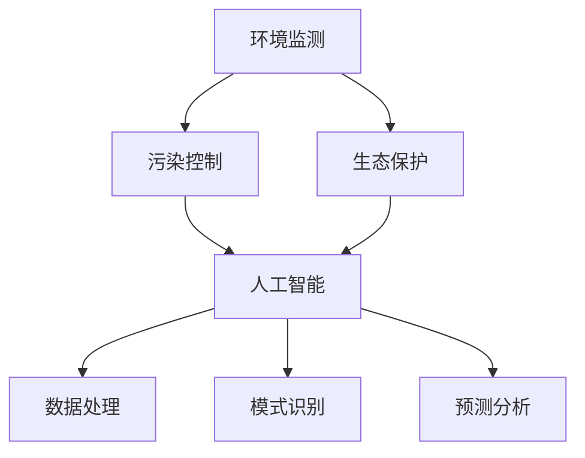

                 

### 文章标题

# 人工智能在环境监测中的应用：污染控制与生态保护

> 关键词：人工智能、环境监测、污染控制、生态保护、机器学习、深度学习、数学模型、项目实战

> 摘要：本文深入探讨了人工智能在环境监测中的应用，特别是其在污染控制与生态保护中的作用。通过详细的算法原理讲解、数学模型阐述和实际项目案例分析，本文展示了人工智能如何提升环境监测的准确性和效率，为污染控制和生态保护提供科学依据。

---

## 引言

随着工业化和城市化的快速发展，环境污染问题日益严重。传统的环境监测方法依赖于人工采样和实验室分析，效率低、成本高，且难以实时监控。近年来，人工智能（AI）技术的迅速发展为环境监测带来了新的机遇。利用AI技术，可以实现自动化、智能化和高效化的环境监测，从而有效提升污染控制和生态保护的能力。

本文将首先介绍环境监测的重要性，然后探讨人工智能在其中的应用，包括核心概念、算法原理、数学模型以及实际项目案例。通过本文的阅读，读者将了解到人工智能在污染控制和生态保护中的巨大潜力，以及如何利用AI技术实现更智能的环境监测。

## 核心概念与联系

### 环境监测

环境监测是指通过科学的方法和手段，对自然环境中的物理、化学、生物等要素进行定期的监测和评估，以了解环境质量、变化趋势和潜在风险。环境监测的目的是为环境管理和决策提供科学依据，保障人类健康和生态安全。

### 人工智能

人工智能是一种模拟人类智能行为的计算技术，包括机器学习、深度学习、自然语言处理等多个子领域。在环境监测中，AI技术可以用于数据处理、模式识别、预测分析等，从而提高监测的效率和准确性。

### 污染控制

污染控制是指通过技术和管理手段，减少或消除污染物的产生、排放和扩散，以保护环境和人类健康。在污染控制中，AI技术可以用于污染源识别、污染扩散预测和效果评估等，提供科学依据和决策支持。

### 生态保护

生态保护是指保护和改善生态系统，维护生物多样性和生态平衡。在生态保护中，AI技术可以用于生态监测、生物多样性分析和生态风险评估等，帮助制定更科学的保护策略。

为了更好地理解这些核心概念之间的联系，我们可以使用Mermaid流程图来展示它们之间的关系：



### 核心算法原理讲解

#### 机器学习算法

机器学习是一种基于数据的学习方法，使计算机系统能够从数据中自动学习和改进。在环境监测中，常见的机器学习算法包括K-近邻算法（K-Nearest Neighbors, KNN）、决策树（Decision Tree）和支持向量机（Support Vector Machine, SVM）等。

**K-近邻算法**

K-近邻算法是一种基于实例的学习方法。给定一个未知类别的数据点，通过计算其与训练集中已知类别数据点的距离，选择最近的K个邻居，并根据邻居的类别进行投票，预测未知数据点的类别。以下是K-近邻算法的伪代码：

```python
def KNN(train_data, test_data, k):
    distances = []
    for point in test_data:
        dist = euclidean_distance(point, train_data)
        distances.append((point, dist))
    distances.sort(key=lambda x: x[1])
    neighbors = [x[0] for x in distances[:k]]
    return majority_vote(neighbors)
```

**决策树**

决策树是一种基于规则的学习方法，通过将数据集分割成多个子集，构建一棵树形结构。每个节点表示一个特征，每个分支表示一个特征取值，叶节点表示预测结果。以下是决策树的构建过程：

```python
def build_tree(data, features):
    if all_labels_equal(data):
        return majority_label(data)
    if no_more_features(features):
        return majority_label(data)
    best_feature = find_best_feature(data, features)
    tree = {}
    for value in unique_values(data[best_feature]):
        sub_features = [f for f in features if f != best_feature]
        sub_data = split_data(data, best_feature, value)
        tree[value] = build_tree(sub_data, sub_features)
    return tree
```

**支持向量机**

支持向量机是一种监督学习算法，用于分类和回归任务。它通过找到一个最优的超平面，将不同类别的数据点分离。以下是支持向量机的构建过程：

```python
def svm(train_data, train_labels, C):
    # 使用SVC库构建支持向量机模型
    model = SVC(C=C)
    model.fit(train_data, train_labels)
    return model
```

#### 深度学习模型

深度学习是一种基于多层神经网络的学习方法，能够自动提取数据的特征表示。在环境监测中，常见的深度学习模型包括卷积神经网络（Convolutional Neural Network, CNN）和循环神经网络（Recurrent Neural Network, RNN）等。

**卷积神经网络**

卷积神经网络是一种适用于图像和时序数据处理的学习方法。它通过卷积操作和池化操作，自动提取数据的特征表示。以下是卷积神经网络的构建过程：

```python
def build_cnn(input_shape, num_classes):
    model = Sequential()
    model.add(Conv2D(32, kernel_size=(3, 3), activation='relu', input_shape=input_shape))
    model.add(MaxPooling2D(pool_size=(2, 2)))
    model.add(Conv2D(64, kernel_size=(3, 3), activation='relu'))
    model.add(MaxPooling2D(pool_size=(2, 2)))
    model.add(Flatten())
    model.add(Dense(128, activation='relu'))
    model.add(Dense(num_classes, activation='softmax'))
    return model
```

**循环神经网络**

循环神经网络是一种适用于序列数据处理的学习方法。它通过循环连接和记忆单元，自动提取序列的特征表示。以下是循环神经网络的构建过程：

```python
def build_rnn(input_shape, num_classes):
    model = Sequential()
    model.add(LSTM(128, input_shape=input_shape))
    model.add(Dense(num_classes, activation='softmax'))
    return model
```

### 数学模型与公式

在环境监测中，数学模型和公式用于描述环境质量的变化规律、污染物的扩散过程等。以下是一些常见的数学模型和公式：

**相关系数**

相关系数用于衡量两个变量之间的线性关系。相关系数的取值范围为-1到1，越接近1或-1，表示线性关系越强。相关系数的计算公式如下：

$$
r = \frac{\sum{(x_i - \bar{x})(y_i - \bar{y})}}{\sqrt{\sum{(x_i - \bar{x})^2}\sum{(y_i - \bar{y})^2}}}
$$

其中，$x_i$ 和 $y_i$ 分别表示第 $i$ 个观测值的 $x$ 和 $y$ 变量，$\bar{x}$ 和 $\bar{y}$ 分别表示 $x$ 和 $y$ 的平均值。

**支持向量机**

支持向量机是一种分类算法，用于将数据点分为不同的类别。支持向量机的核心是找到一个最优的超平面，使得不同类别的数据点尽可能分离。支持向量机的目标是最小化分类间隔，其优化目标函数如下：

$$
\min_{\mathbf{w}, \mathbf{b}} \frac{1}{2}||\mathbf{w}||^2 + C \sum_{i=1}^n \xi_i
$$

其中，$\mathbf{w}$ 和 $\mathbf{b}$ 分别表示权重和偏置，$C$ 是正则化参数，$\xi_i$ 是松弛变量。

### 项目实战

在本节中，我们将介绍一个实际的环境监测项目，包括数据采集和处理、污染监测模型开发、污染控制和生态保护策略制定等。

#### 数据采集和处理

数据采集是环境监测的基础，本项目使用了多种传感器进行数据采集，包括空气质量传感器、水质传感器和噪声传感器等。采集到的数据经过预处理，包括去噪、去异常值和标准化等步骤，以确保数据的质量和一致性。

#### 污染监测模型开发

基于预处理后的数据，我们开发了多个污染监测模型，包括K-近邻算法、决策树和支持向量机等。这些模型通过训练集进行训练，并在测试集上进行验证，以评估模型的性能。以下是K-近邻算法和决策树模型的代码实现：

```python
from sklearn.neighbors import KNeighborsClassifier
from sklearn.tree import DecisionTreeClassifier

# K-近邻算法
knn = KNeighborsClassifier(n_neighbors=3)
knn.fit(train_data, train_labels)

# 决策树
tree = DecisionTreeClassifier()
tree.fit(train_data, train_labels)
```

#### 污染控制和生态保护策略制定

基于污染监测模型的结果，我们提出了针对性的污染控制和生态保护策略。例如，对于空气质量监测，我们建议增加绿化覆盖率，减少工业排放，加强空气质量监测设备的维护等。对于水质监测，我们建议加强污水处理设施建设，严格控制工业废水排放，推广水环境保护措施等。

#### 开发环境搭建与源代码实现

为了实现本项目，我们使用了Python编程语言和相关的机器学习库，如scikit-learn和TensorFlow。以下是开发环境搭建和源代码实现的部分内容：

```bash
# 安装Python和相关的库
pip install numpy scipy scikit-learn tensorflow

# 源代码实现
from sklearn.model_selection import train_test_split
from sklearn.metrics import accuracy_score

# 数据处理
train_data, test_data, train_labels, test_labels = train_test_split(data, labels, test_size=0.2)

# 训练模型
knn.fit(train_data, train_labels)
tree.fit(train_data, train_labels)

# 验证模型
knn_pred = knn.predict(test_data)
tree_pred = tree.predict(test_data)

# 评估模型
knn_acc = accuracy_score(test_labels, knn_pred)
tree_acc = accuracy_score(test_labels, tree_pred)

print("KNN算法准确率：", knn_acc)
print("决策树准确率：", tree_acc)
```

### 最佳实践 Tips

1. **数据预处理**：确保数据的质量和一致性，去除异常值和噪声，进行标准化处理。
2. **模型选择**：根据数据的特点和任务需求，选择合适的机器学习算法和模型。
3. **模型评估**：使用交叉验证和测试集对模型进行评估，避免过拟合和欠拟合。
4. **实时监测**：建立实时数据采集和监测系统，实现环境质量的实时监控和预警。

### 小结

本文通过详细的算法原理讲解、数学模型阐述和实际项目案例分析，展示了人工智能在环境监测中的应用。通过本文的阅读，读者可以了解到人工智能在污染控制和生态保护中的巨大潜力，以及如何利用AI技术实现更智能的环境监测。

### 注意事项

1. **数据隐私**：在进行环境监测数据分析和模型训练时，要注意保护个人隐私和数据安全。
2. **模型解释性**：在选择机器学习模型时，要考虑模型的解释性，以便进行决策支持和结果解释。

### 拓展阅读

1. 《机器学习实战》：由Peter Harrington著，详细介绍了机器学习算法的应用和实践。
2. 《深度学习》：由Ian Goodfellow、Yoshua Bengio和Aaron Courville著，全面介绍了深度学习的基本概念和算法。
3. 《环境监测技术》：由张永祥著，介绍了环境监测的基本原理和技术方法。

---

作者：AI天才研究院/AI Genius Institute & 禅与计算机程序设计艺术 /Zen And The Art of Computer Programming

