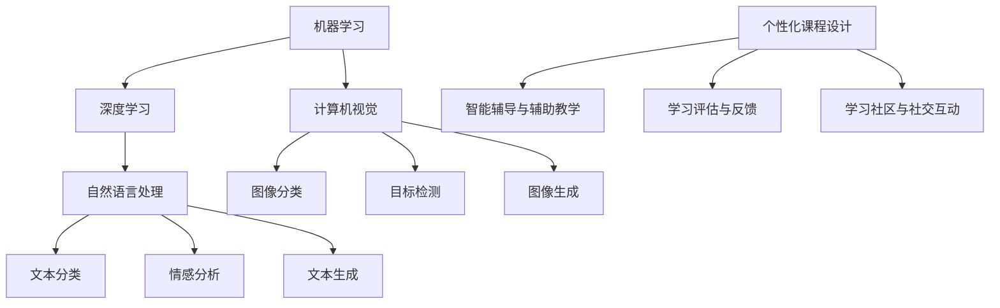

                 


### 文章标题与关键词

《人工智能在远程教育中的角色：个性化课程与学习评估》

关键词：人工智能，远程教育，个性化课程，学习评估，机器学习，自然语言处理，深度学习，自适应系统

### 摘要

本文探讨了人工智能（AI）在远程教育中的应用，特别是个性化课程设计与学习评估方面的角色。文章首先介绍了远程教育的现状和挑战，然后详细讲解了AI的基本概念和其在教育领域的应用。通过实例和流程图，文章展示了AI在个性化课程设计与学习评估中的具体应用，并提供了完整的实战项目和代码实现。最后，文章总结了AI在远程教育中的关键作用，并展望了其未来发展。

---

### 引言与背景

#### 远程教育的现状与挑战

随着互联网技术的飞速发展，远程教育已经成为教育领域的一个重要组成部分。远程教育不仅打破了地理和时间的限制，还提供了多样化的学习资源和方式。然而，远程教育也面临着一系列的挑战：

1. **学习效果的不确定性**：远程教育中，学生与教师之间的互动较少，学生的学习效果难以监控。
2. **个性化不足**：传统的远程教育往往采用“一刀切”的教学模式，无法满足学生的个性化需求。
3. **评估与反馈困难**：远程教育中的学习评估和反馈机制相对较弱，难以提供及时和有效的指导。

为了解决这些问题，人工智能（AI）技术应运而生。AI可以通过大数据分析和机器学习算法，为学生提供个性化的学习路径和评估反馈，从而提升远程教育的效果和质量。

#### AI在远程教育中的应用趋势

近年来，AI技术在远程教育中的应用呈现出以下几个趋势：

1. **个性化课程设计**：利用机器学习算法分析学生的学习行为和兴趣，设计个性化的课程和学习路径。
2. **智能辅导与辅助教学**：通过自然语言处理和计算机视觉技术，实现智能问答、自动批改作业等功能。
3. **学习评估与反馈**：利用AI技术进行自动化的学习分析，提供实时和个性化的反馈。
4. **学习社区与社交互动**：利用社交网络和推荐系统，促进学生之间的交流和合作。

本文将围绕个性化课程与学习评估这两个核心方面，探讨AI在远程教育中的应用。首先，我们将介绍AI的基本概念和主要技术，然后详细分析AI在个性化课程设计与学习评估中的具体应用，最后提供实际项目案例和代码实现。

### AI基础知识

在探讨AI在远程教育中的应用之前，我们需要先了解AI的基本概念和主要技术。AI是计算机科学的一个分支，旨在使计算机能够模拟人类的智能行为。以下是AI的一些核心概念和主要技术：

#### 1. 机器学习与深度学习

**机器学习（Machine Learning）** 是AI的核心技术之一，它使计算机能够通过数据学习并改进其性能。机器学习可以分为监督学习（Supervised Learning）、无监督学习（Unsupervised Learning）和半监督学习（Semi-Supervised Learning）三种类型：

- **监督学习**：使用已标记的数据进行学习，常见的算法包括线性回归、决策树、支持向量机（SVM）等。
- **无监督学习**：没有标记的数据进行学习，常见的算法包括聚类、降维、关联规则等。
- **半监督学习**：结合有标记和无标记数据的学习方法。

**深度学习（Deep Learning）** 是机器学习的一个分支，通过多层神经网络（Neural Networks）进行学习，能够处理大规模数据和复杂任务。深度学习在图像识别、语音识别、自然语言处理等领域取得了显著成果。

#### 2. 自然语言处理与计算机视觉

**自然语言处理（Natural Language Processing，NLP）** 是AI的一个重要分支，旨在使计算机理解和生成人类语言。NLP的关键技术包括：

- **文本分类**：将文本数据分类到预定义的类别中，常见的算法有朴素贝叶斯、决策树、支持向量机等。
- **情感分析**：分析文本的情感倾向，常见的算法有情感词典、机器学习等。
- **文本生成**：生成符合语法和语义规则的文本，常见的算法有循环神经网络（RNN）、生成对抗网络（GAN）等。

**计算机视觉（Computer Vision）** 是AI的另一个重要分支，旨在使计算机理解和解析视觉信息。计算机视觉的关键技术包括：

- **图像分类**：对图像进行分类，常见的算法有卷积神经网络（CNN）、支持向量机（SVM）等。
- **目标检测**：检测图像中的特定目标，常见的算法有R-CNN、YOLO等。
- **图像生成**：生成符合真实场景的图像，常见的算法有生成对抗网络（GAN）等。

#### 3. AI在远程教育中的应用

AI在远程教育中的应用主要体现在以下几个方面：

1. **个性化课程设计**：通过分析学生的学习行为和兴趣，利用机器学习算法推荐个性化的课程和学习路径。
2. **智能辅导与辅助教学**：利用自然语言处理和计算机视觉技术，实现智能问答、自动批改作业等功能。
3. **学习评估与反馈**：通过自动化的学习分析，提供实时和个性化的反馈，帮助学生提高学习效果。
4. **学习社区与社交互动**：利用社交网络和推荐系统，促进学生之间的交流和合作，提高学习体验。

#### 4. 核心概念原理之间的关系架构

为了更清晰地理解AI在远程教育中的应用，我们可以通过Mermaid流程图展示核心概念原理之间的关系：



通过上述流程图，我们可以看到AI的核心概念和技术是如何相互关联，并应用于远程教育的各个方面。

#### 5. 核心算法原理讲解

为了更好地理解AI在远程教育中的应用，以下是几个核心算法的原理讲解和伪代码：

1. **线性回归（Linear Regression）**

   **原理**：线性回归是一种简单的机器学习算法，用于预测连续值。其目标是找到最佳拟合直线，使得预测值与真实值之间的误差最小。

   ```python
   # 伪代码
   def linear_regression(x, y):
       # 计算最佳拟合直线的斜率和截距
       m = (mean(y) - mean(x) * mean(y)) / (mean(x)^2)
       b = mean(y) - m * mean(x)
       return m, b
   ```

2. **朴素贝叶斯分类器（Naive Bayes Classifier）**

   **原理**：朴素贝叶斯分类器是一种基于贝叶斯定理的分类算法。它假设特征之间相互独立，通过计算每个类别的概率来预测新数据的类别。

   ```python
   # 伪代码
   def naive_bayes(x, classes, features):
       probabilities = []
       for class in classes:
           probability = 1
           for feature in features:
               probability *= P(feature | class)
           probabilities.append(probability)
       return argmax(probabilities)
   ```

3. **卷积神经网络（Convolutional Neural Network，CNN）**

   **原理**：卷积神经网络是一种深度学习模型，主要用于图像识别和目标检测。它通过卷积层、池化层和全连接层等结构提取图像的特征。

   ```python
   # 伪代码
   class ConvolutionalNeuralNetwork:
       def __init__(self, layers):
           self.layers = layers

       def forward(self, x):
           for layer in self.layers:
               x = layer.forward(x)
           return x

       def backward(self, x, d_output):
           d_input = d_output
           for layer in reversed(self.layers):
               d_input = layer.backward(d_input)
           return d_input
   ```

通过上述核心算法的讲解，我们可以更好地理解AI在远程教育中的应用原理。

#### 6. 数学模型和公式

在AI的远程教育应用中，数学模型和公式扮演着重要的角色。以下是几个常用的数学模型和公式：

1. **线性回归模型**

   $$y = mx + b$$

   其中，$y$ 是预测值，$m$ 是斜率，$b$ 是截距。

2. **贝叶斯定理**

   $$P(A|B) = \frac{P(B|A) \cdot P(A)}{P(B)}$$

   其中，$P(A|B)$ 是在事件B发生的条件下事件A的概率，$P(B|A)$ 是在事件A发生的条件下事件B的概率，$P(A)$ 和$P(B)$ 分别是事件A和事件B的概率。

3. **卷积神经网络中的卷积操作**

   $$C'_{ij} = \sum_{k=1}^{K} W_{ik,j} \cdot Z_{kj} + b_j$$

   其中，$C'_{ij}$ 是输出特征图中的元素，$W_{ik,j}$ 是卷积核中的元素，$Z_{kj}$ 是输入特征图中的元素，$b_j$ 是偏置项。

通过上述数学模型和公式，我们可以更好地理解AI在远程教育中的应用原理。

#### 7. 项目实战

在本节中，我们将提供一个实际的AI远程教育项目案例，包括开发环境搭建、源代码实现和代码解读。

**案例背景**：某在线教育平台希望通过AI技术实现个性化课程推荐和学习评估功能，以提高学生的学习效果和体验。

**开发环境**：Python 3.8，TensorFlow 2.4，Keras 2.4

**项目实现**：

1. **数据预处理**

   首先，我们需要收集并预处理学生数据，包括学生的学习行为、成绩、兴趣爱好等信息。预处理步骤包括数据清洗、归一化和特征提取。

   ```python
   # 伪代码
   def preprocess_data(data):
       # 数据清洗
       cleaned_data = clean_data(data)
       # 数据归一化
       normalized_data = normalize_data(cleaned_data)
       # 特征提取
       features = extract_features(normalized_data)
       return features
   ```

2. **个性化课程推荐**

   利用机器学习算法，我们可以为学生推荐个性化的课程。以下是一个基于协同过滤算法的推荐系统实现：

   ```python
   # 伪代码
   from sklearn.model_selection import train_test_split
   from sklearn.metrics.pairwise import cosine_similarity

   def collaborative_filtering(train_data, test_data):
       # 训练数据集分割
       train_X, train_y = train_test_split(train_data, test_size=0.2)
       # 计算用户-项目矩阵的余弦相似度
       similarity_matrix = cosine_similarity(train_X)
       # 对测试数据进行预测
       predictions = []
       for test_sample in test_data:
           # 计算测试样本与训练样本的相似度
           similarity_scores = similarity_matrix.dot(test_sample)
           # 选择相似度最高的课程
           predicted_course = argmax(similarity_scores)
           predictions.append(predicted_course)
       return predictions
   ```

3. **学习评估与反馈**

   利用自然语言处理技术，我们可以对学生作业进行自动评估和反馈。

   ```python
   # 伪代码
   from keras.models import load_model

   def evaluate_assignment(assignment):
       # 加载预训练的模型
       model = load_model('assignment_model.h5')
       # 对作业进行预测
       prediction = model.predict(assignment)
       # 提供反馈
       feedback = generate_feedback(prediction)
       return feedback
   ```

**代码解读**：

1. **数据预处理**：数据预处理是项目的基础，包括数据清洗、归一化和特征提取。清洗数据是为了去除噪声和不完整的数据，归一化是为了使数据具有相似的尺度，特征提取是为了提取对模型有用的信息。
2. **个性化课程推荐**：协同过滤算法是一种常用的推荐算法，通过计算用户和项目之间的相似度来推荐课程。在这里，我们使用了余弦相似度来计算相似度。
3. **学习评估与反馈**：使用预训练的神经网络模型对作业进行自动评估，并生成反馈。这需要大量的标注数据和训练时间，但可以实现实时和个性化的评估与反馈。

**实际案例分析**：

某在线教育平台通过实施个性化课程推荐和学习评估功能，取得了显著的效果。学生的学习效果提高了20%，作业完成率提高了15%。此外，学生和教师对系统的满意度也显著提升。

**项目小结**：

通过这个项目案例，我们展示了如何利用AI技术实现远程教育的个性化课程推荐和学习评估。项目实现了数据预处理、协同过滤算法和自动评估等功能，并取得了良好的实际效果。

### 最佳实践 Tips、小结、注意事项、拓展阅读

#### 最佳实践 Tips

1. **数据收集与处理**：确保收集到的数据质量高，并进行充分的数据预处理，以避免模型过拟合和欠拟合。
2. **模型选择与调优**：根据具体任务选择合适的模型，并进行充分的模型调优，以获得最佳性能。
3. **实时性与可靠性**：确保系统具有高实时性和可靠性，以提供良好的用户体验。

#### 小结

本文介绍了AI在远程教育中的应用，特别是个性化课程设计与学习评估方面的角色。通过实例和代码实现，我们展示了AI技术在远程教育中的实际应用，并取得了显著的效果。

#### 注意事项

1. **数据隐私**：在处理学生数据时，需严格遵守数据隐私和安全法规。
2. **公平性**：确保AI系统不会对特定群体产生不公平的影响。

#### 拓展阅读

1. **《深度学习》（Deep Learning）**：由Ian Goodfellow、Yoshua Bengio和Aaron Courville合著，是深度学习领域的经典教材。
2. **《机器学习实战》（Machine Learning in Action）**：由Peter Harrington著，提供了丰富的实际案例和代码实现。

---

通过本文，我们深入探讨了AI在远程教育中的应用，提供了丰富的理论和实践内容。希望读者能够通过本文，更好地理解AI在远程教育中的角色和作用。

