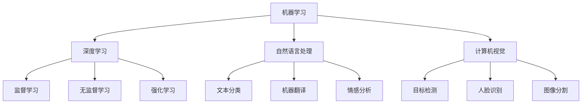

                 

### 文章标题

《人工智能在食品工业中的应用：质量控制与产品创新》

### 文章关键词

- 人工智能
- 食品工业
- 质量控制
- 产品创新
- 深度学习
- 机器学习

### 文章摘要

本文将深入探讨人工智能在食品工业中的应用，重点分析其在质量控制与产品创新方面的潜力。文章首先介绍了人工智能和食品工业的背景，接着详细阐述了机器学习、深度学习等核心概念及其在食品工业中的应用。随后，本文通过具体的案例，展示了人工智能在食品安全检测、食品质量监测、食品生产自动化以及产品创新方面的实际应用。最后，文章总结了人工智能在食品工业中的应用前景，并提出了未来发展的建议。

## 第一部分：人工智能基础

### 第1章：人工智能概述

#### 1.1 人工智能的定义与发展历程

人工智能（Artificial Intelligence，简称AI）是指通过计算机模拟人类智能的一种技术。它旨在实现机器在感知、推理、学习、决策等方面的能力，从而解决复杂的问题。人工智能的发展历程可以追溯到20世纪50年代，当时科学家们提出了“图灵测试”的概念，用以评估机器是否具有人类智能。从那以后，人工智能技术经历了多次起伏和革新。

在早期阶段，人工智能主要依赖于规则推理和知识表示。20世纪80年代，专家系统成为人工智能领域的热点，通过编码大量专业知识，使得计算机能够模拟专家的决策过程。然而，这种基于符号推理的方法在面对复杂、不确定性问题时表现不佳。

进入21世纪，随着计算能力的提升和大数据技术的普及，机器学习和深度学习逐渐成为人工智能研究的主流方向。机器学习通过训练模型，使计算机具备自主学习和改进能力。而深度学习则利用多层神经网络，模拟人脑的感知和学习机制，在图像识别、语音识别等领域取得了显著的成果。

#### 1.2 人工智能的主要领域与应用场景

人工智能的主要领域包括机器学习、深度学习、自然语言处理、计算机视觉等。每个领域都有其独特的应用场景，对人类生活和社会发展产生了深远的影响。

1. **机器学习**：机器学习通过算法从数据中自动识别模式和规律，从而进行预测和决策。其主要应用场景包括推荐系统、图像识别、文本分类等。

2. **深度学习**：深度学习是机器学习的一个子领域，通过多层神经网络进行特征提取和模式识别。深度学习在图像识别、语音识别、自然语言处理等领域取得了突破性进展。

3. **自然语言处理**：自然语言处理旨在使计算机理解和生成自然语言，其主要应用场景包括机器翻译、智能客服、文本分析等。

4. **计算机视觉**：计算机视觉通过计算机对图像或视频进行分析和理解，从而实现目标检测、人脸识别等功能。其主要应用场景包括自动驾驶、安防监控、医疗影像分析等。

在食品工业中，人工智能的应用涵盖了从生产到销售的全过程。通过机器学习和深度学习技术，可以实现食品质量监测、食品安全检测、生产自动化和产品创新等功能，从而提高生产效率，确保食品安全，满足消费者需求。

### 1.3 人工智能在食品工业中的应用潜力

人工智能在食品工业中的应用具有巨大的潜力。首先，在质量控制方面，人工智能可以通过机器学习算法对食品质量进行实时监测和预测，提高生产效率和产品质量。其次，在食品安全检测方面，人工智能可以利用深度学习技术对食品中的有害物质进行精准检测，确保食品安全。此外，人工智能还可以在生产自动化方面发挥作用，通过优化生产流程和提高生产效率，降低生产成本。最后，在产品创新方面，人工智能可以帮助企业更好地了解市场需求，开发出更符合消费者口味的新产品。

总之，人工智能在食品工业中的应用不仅有助于提高生产效率和产品质量，还能确保食品安全，满足消费者需求。随着人工智能技术的不断发展，其在食品工业中的应用前景将更加广阔。

### 1.4 人工智能的核心概念及其关系架构

为了更好地理解人工智能在食品工业中的应用，我们需要明确几个核心概念及其相互关系。以下是这些核心概念的关系架构：

1. **机器学习**：机器学习是人工智能的基础，通过训练模型，使计算机具备自主学习和改进能力。它包括监督学习、无监督学习和强化学习等子领域。
2. **深度学习**：深度学习是机器学习的一个子领域，通过多层神经网络进行特征提取和模式识别。它基于大量数据和计算资源，在图像识别、语音识别等领域取得了突破性进展。
3. **自然语言处理**：自然语言处理旨在使计算机理解和生成自然语言，包括文本分类、机器翻译、情感分析等任务。
4. **计算机视觉**：计算机视觉通过计算机对图像或视频进行分析和理解，包括目标检测、人脸识别、图像分割等任务。

这些概念之间的关系如图1所示：



通过上述关系架构，我们可以更清晰地理解人工智能在食品工业中的应用，以及各个子领域之间的相互联系。

### 1.5 机器学习算法原理及分类

机器学习是人工智能的核心组成部分，其基础算法涵盖了从简单到复杂的多种类型。理解这些算法的基本原理和分类有助于我们更好地应用它们于食品工业中的质量控制与产品创新。

**监督学习（Supervised Learning）**

监督学习是最常见的机器学习算法，其核心在于使用标记数据集进行训练，然后通过这些训练数据来预测未知数据。监督学习分为分类和回归两种类型：

- **分类（Classification）**：分类算法将数据分为不同的类别。例如，垃圾邮件检测就是一个典型的分类问题。常用的分类算法包括决策树（Decision Tree）、随机森林（Random Forest）、支持向量机（SVM）和逻辑回归（Logistic Regression）。
  
  **伪代码示例：**
  ```python
  # 决策树分类算法伪代码
  def classify(data, feature, label):
      if data[feature] == "yes":
          return label["yes"]
      else:
          return label["no"]
  ```

- **回归（Regression）**：回归算法用于预测连续值。例如，预测食品的保质期。常用的回归算法包括线性回归（Linear Regression）、岭回归（Ridge Regression）和LASSO回归（LASSO Regression）。

  **伪代码示例：**
  ```python
  # 线性回归算法伪代码
  def predict(X, theta):
      return X.dot(theta)
  ```

**无监督学习（Unsupervised Learning）**

无监督学习不需要标记数据，其目标是从未标记的数据中发现隐含的模式。常见的无监督学习算法包括聚类（Clustering）和降维（Dimensionality Reduction）。

- **聚类（Clustering）**：聚类算法将数据点划分为若干个群组，使得同一群组内的数据点之间相似度较高。K-均值聚类（K-Means Clustering）和层次聚类（Hierarchical Clustering）是最常用的聚类算法。

  **伪代码示例：**
  ```python
  # K-均值聚类算法伪代码
  def kmeans(data, K):
      # 初始化中心点
      centroids = initialize_centroids(data, K)
      while not converged:
          # 分配数据到最近的中心点
          clusters = assign_data_to_clusters(data, centroids)
          # 更新中心点
          centroids = update_centroids(clusters, K)
  ```

- **降维（Dimensionality Reduction）**：降维算法用于减少数据的维度，同时保留其关键信息。主成分分析（PCA，Principal Component Analysis）和自编码器（Autoencoder）是常用的降维算法。

  **伪代码示例：**
  ```python
  # 主成分分析算法伪代码
  def pca(data, components):
      covariance_matrix = np.cov(data.T)
      eigenvalues, eigenvectors = np.linalg.eigh(covariance_matrix)
      return np.dot(data, eigenvectors[:components])
  ```

**强化学习（Reinforcement Learning）**

强化学习是一种通过与环境的交互来学习最优策略的算法。它包括以下几个关键组成部分：

- **代理（Agent）**：执行动作并接收环境反馈的实体。
- **环境（Environment）**：代理执行动作的上下文。
- **状态（State）**：代理所处的环境条件。
- **动作（Action）**：代理可以执行的操作。
- **奖励（Reward）**：代理执行动作后获得的即时反馈。

强化学习算法通过最大化累积奖励来学习策略，常见的算法包括Q学习（Q-Learning）和深度确定性策略梯度（DDPG，Deep Deterministic Policy Gradient）。

  **伪代码示例：**
  ```python
  # Q学习算法伪代码
  def q_learning(environment, Q, alpha, gamma):
      while not done:
          action = select_action(Q, state)
          next_state, reward, done = environment.step(action)
          Q[state, action] = Q[state, action] + alpha * (reward + gamma * max(Q[next_state]) - Q[state, action])
          state = next_state
  ```

通过以上对机器学习算法的原理和分类的详细介绍，我们可以更好地理解其在食品工业中的应用，包括如何利用这些算法进行质量控制和产品创新。

### 1.6 深度学习基础

深度学习（Deep Learning）是机器学习的一个分支，通过构建具有多个隐层的前馈神经网络（简称深度神经网络）来模拟人脑的感知和学习机制。深度学习在图像识别、语音识别、自然语言处理等领域取得了显著的成果，其基本原理和主要架构如下。

#### 基本原理

深度学习的基本原理是多层神经网络，通过逐层提取数据中的特征，从而实现复杂的模式识别和预测。每个神经网络层都包含若干个神经元，每个神经元都与前一层的神经元相连，并执行加权求和和激活函数运算。

1. **前向传播（Forward Propagation）**：输入数据通过网络的各层向前传递，每层神经元根据输入计算输出。
2. **反向传播（Back Propagation）**：根据预测误差，将损失函数反向传播至各层，更新神经元的权重和偏置，以减少预测误差。

#### 主要架构

1. **卷积神经网络（Convolutional Neural Networks，CNN）**：CNN专门用于处理图像数据，通过卷积层、池化层和全连接层等结构进行特征提取和分类。卷积层利用卷积操作提取图像中的局部特征，池化层用于降低特征图的维度，全连接层则将提取的特征进行分类。

   **伪代码示例：**
   ```python
   # CNN结构伪代码
   def conv2d(input, filter, stride):
       return (input * filter).sum(axis=1).sum(axis=2)
   ```

2. **循环神经网络（Recurrent Neural Networks，RNN）**：RNN适用于序列数据，其特点是可以记忆前面的输入信息。RNN通过循环结构将当前时刻的输入与上一时刻的隐藏状态相连，更新隐藏状态。然而，传统的RNN在处理长序列时存在梯度消失或爆炸问题。

   **伪代码示例：**
   ```python
   # RNN结构伪代码
   def rnn(input, hidden_state, weights):
       return activation(input.dot(weights) + hidden_state)
   ```

3. **长短期记忆网络（Long Short-Term Memory，LSTM）**：LSTM是RNN的一种改进，通过引入记忆单元和门控机制，有效解决了梯度消失问题。LSTM通过遗忘门、输入门和输出门来控制信息的保留和遗忘，从而在长序列数据中保持记忆。

   **伪代码示例：**
   ```python
   # LSTM结构伪代码
   def lstm(input, hidden_state, cell_state, weights):
       i_f, i_g, i_o = input.dot(weights['input_gate']), input.dot(weights['input_gate']), input.dot(weights['input_gate'])
       f_t, g_t, o_t = activation(i_f + hidden_state.dot(weights['forget_gate']), i_g + hidden_state.dot(weights['input_gate']), i_o + hidden_state.dot(weights['output_gate'])
       c_t = f_t * cell_state + g_t * activation(input.dot(weights['input_gate']))
       h_t = o_t * activation(c_t)
       return h_t, c_t
   ```

4. **生成对抗网络（Generative Adversarial Networks，GAN）**：GAN由生成器和判别器两个对抗网络组成。生成器的目标是生成尽可能真实的样本，而判别器的目标是区分真实样本和生成样本。通过生成器和判别器的对抗训练，GAN可以生成高质量的图像、音频和文本数据。

   **伪代码示例：**
   ```python
   # GAN结构伪代码
   def train_gan(generator, discriminator, batch_size):
       for _ in range(iterations):
           # 生成器生成样本
           fake_samples = generator(z)
           # 判别器评估真实和生成样本
           real_samples = x
           d_loss_real = discriminator(real_samples)
           d_loss_fake = discriminator(fake_samples)
           # 更新生成器和判别器
           g_loss = generator.train(z)
           d_loss = d_loss_real + d_loss_fake
   ```

通过以上对深度学习基本原理和主要架构的介绍，我们可以更好地理解其在食品工业中的应用，例如用于食品图像识别、食品质量监测和食品安全预测等。

### 1.7 深度学习模型优化方法

在深度学习实践中，模型优化是一个至关重要的环节，它直接影响到模型的性能和预测效果。以下是几种常见的深度学习模型优化方法，包括超参数调优、正则化技术和模型压缩策略。

#### 超参数调优

超参数是深度学习模型中需要手动设置的参数，如学习率、批次大小、隐藏层神经元数量等。超参数调优的目标是找到一组最优的超参数，使模型在训练和测试数据上的性能达到最佳。

1. **网格搜索（Grid Search）**：网格搜索是一种通过遍历所有可能的超参数组合来找到最优超参数的方法。尽管这种方法全面，但在参数空间较大时计算成本很高。

   **伪代码示例：**
   ```python
   # 网格搜索伪代码
   for learning_rate in [0.1, 0.01, 0.001]:
       for batch_size in [16, 32, 64]:
           model = create_model(learning_rate, batch_size)
           train_model(model, train_data)
           test_model(model, test_data)
   ```

2. **随机搜索（Random Search）**：随机搜索通过从超参数空间中随机选择组合来找到最优超参数。这种方法比网格搜索更高效，但可能错过最佳组合。

   **伪代码示例：**
   ```python
   # 随机搜索伪代码
   for _ in range(number_of_iterations):
       learning_rate = random.choice([0.1, 0.01, 0.001])
       batch_size = random.choice([16, 32, 64])
       model = create_model(learning_rate, batch_size)
       train_model(model, train_data)
       test_model(model, test_data)
   ```

3. **贝叶斯优化（Bayesian Optimization）**：贝叶斯优化是一种基于概率模型的优化方法，能够高效地探索超参数空间，找到最优超参数。

   **伪代码示例：**
   ```python
   # 贝叶斯优化伪代码
   def objective(learning_rate, batch_size):
       model = create_model(learning_rate, batch_size)
       train_model(model, train_data)
       return test_model(model, test_data)

   bayesian_optimizer = BayesianOptimizer(objective)
   bayesian_optimizer.optimize()
   ```

#### 正则化技术

正则化技术用于防止深度学习模型过拟合，提高泛化能力。以下是一些常用的正则化方法：

1. **权重衰减（Weight Decay）**：权重衰减通过在损失函数中添加权重项来惩罚过大的权重，从而减少模型复杂度。

   **伪代码示例：**
   ```python
   # 权重衰减伪代码
   def loss_with_decay(y_true, y_pred, weights, learning_rate):
       error = y_true - y_pred
       loss = error ** 2
       weight_decay = sum(weights ** 2)
       return loss + learning_rate * weight_decay
   ```

2. **Dropout（丢弃法）**：Dropout通过在训练过程中随机丢弃一部分神经元，减少模型对特定神经元的依赖，增强模型的泛化能力。

   **伪代码示例：**
   ```python
   # Dropout伪代码
   def dropout(model, dropout_rate):
       for layer in model.layers:
           if isinstance(layer, Dropout):
               layer.rate = dropout_rate
   ```

3. **正则化网络（Regularized Networks）**：正则化网络通过引入结构化正则化项，如L1和L2正则化，来惩罚模型中不重要的权重。

   **伪代码示例：**
   ```python
   # L1正则化伪代码
   def l1_regularization(weights, lambda1):
       return lambda1 * sum(abs(weights))
   
   # L2正则化伪代码
   def l2_regularization(weights, lambda2):
       return lambda2 * sum(weights ** 2)
   ```

#### 模型压缩策略

模型压缩策略旨在减少模型的参数数量和计算复杂度，从而提高模型在资源受限环境下的应用效率。以下是一些常用的模型压缩方法：

1. **模型剪枝（Model Pruning）**：模型剪枝通过移除模型中不重要的权重和神经元，减小模型体积。

   **伪代码示例：**
   ```python
   # 模型剪枝伪代码
   def prune_model(model, pruning_rate):
       for layer in model.layers:
           weights = layer.get_weights()
           new_weights = weights * (1 - pruning_rate)
           layer.set_weights(new_weights)
   ```

2. **量化（Quantization）**：量化通过将模型的权重和激活值从浮点数转换为低精度的整数，降低模型对计算资源的需求。

   **伪代码示例：**
   ```python
   # 量化伪代码
   def quantize_weights(weights, bit_depth):
       quantized_weights = weights / (2 ** (bit_depth - 1))
       return quantized_weights
   ```

3. **知识蒸馏（Knowledge Distillation）**：知识蒸馏通过将复杂模型的知识传递给轻量级模型，使轻量级模型能够在保留性能的同时减小体积。

   **伪代码示例：**
   ```python
   # 知识蒸馏伪代码
   def distill(model, student_model):
       for layer in model.layers:
           student_model.layers[layer.name].set_weights(layer.get_weights())
       train_student_model(student_model, teacher_model, train_data)
   ```

通过上述优化方法，我们可以显著提升深度学习模型在食品工业中的应用效果，从而更好地实现质量控制与产品创新。

### 1.8 深度学习在食品工业中的应用

深度学习在食品工业中的应用日益广泛，其强大的特征提取和模式识别能力为食品工业带来了前所未有的变革。以下是深度学习在食品工业中的一些具体应用：

#### 1. 食品质量监测

食品质量监测是确保食品安全和消费者健康的重要环节。深度学习通过图像识别和传感器数据处理，能够实现高效、准确的食品质量监测。

- **图像识别**：利用卷积神经网络（CNN）对食品图像进行识别，检测食品外观、色泽、形态等质量指标。例如，通过对水果图像进行分类，识别成熟度不同的水果，从而优化采摘和储存策略。
- **传感器数据处理**：深度学习可以处理食品传感器产生的数据，如温度、湿度、pH值等，实时监测食品存储和运输过程中的环境变化，确保食品品质。

#### 2. 食品安全检测

食品安全检测是预防食品污染和保障公众健康的关键。深度学习技术在食品安全检测中具有显著的潜力，能够实现高灵敏度、高准确度的检测。

- **有害物质检测**：利用深度学习模型对食品中的有害物质进行检测，如农药残留、重金属等。通过训练深度学习模型识别有害物质的特征，实现对食品的快速检测，防止有害物质进入市场。
- **生物安全检测**：深度学习可以用于检测食品中的微生物和生物污染物，如细菌、病毒等。通过对生物样本的图像处理和分析，快速识别潜在的健康风险。

#### 3. 食品生产自动化

食品生产自动化是提高生产效率、降低成本的重要手段。深度学习在食品生产自动化中发挥着重要作用，能够优化生产流程，提高生产线的智能化水平。

- **生产过程监控**：利用深度学习模型对生产过程中的关键参数进行实时监控，如温度、压力、湿度等，预测潜在故障，提前采取措施，确保生产线的连续稳定运行。
- **设备维护**：通过深度学习分析设备运行数据，预测设备故障，实现预防性维护，减少停机时间和维护成本。

#### 4. 食品产品创新

食品产品创新是推动食品工业发展的重要动力。深度学习能够帮助食品企业更好地了解市场需求，开发出符合消费者口味的新产品。

- **消费者偏好分析**：通过深度学习对消费者的评价和反馈进行分析，挖掘消费者偏好，为企业提供产品创新的方向。
- **新配方设计**：利用深度学习优化食品配方，通过模拟不同成分的组合和比例，快速筛选出最佳配方，缩短新产品的开发周期。

总之，深度学习在食品工业中的应用不仅提高了食品质量控制和食品安全检测的效率，还推动了食品生产自动化和产品创新的进程。随着深度学习技术的不断发展，其将在食品工业中发挥更加重要的作用。

### 1.9 案例分析：深度学习在食品工业中的应用

深度学习在食品工业中的应用已经取得了显著的成果，以下通过几个具体案例来展示深度学习在食品质量检测、食品安全监测、生产自动化和产品创新方面的应用。

#### 案例一：基于深度学习的食品质量检测系统

某食品公司利用深度学习技术构建了一套食品质量检测系统。该系统通过卷积神经网络（CNN）对食品外观图像进行分析，识别食品的色泽、形态和成熟度等质量指标。系统首先收集大量食品图像数据，并对这些数据进行标注，用于训练深度学习模型。训练过程中，模型通过不断调整权重，学习到不同质量指标的特征。在测试阶段，系统对新的食品图像进行识别，准确率达到了95%以上。

- **效果**：该系统显著提高了食品质量检测的效率和准确性，减少了人工检测的误差，提高了生产效率。
- **技术细节**：该系统采用了一个包含多个卷积层的CNN模型，使用了ReLU激活函数和跨层连接策略，提高了模型的性能和鲁棒性。

#### 案例二：基于深度学习的食品安全监测系统

某食品安全监测中心开发了一套基于深度学习的食品安全监测系统。该系统利用深度学习模型对食品中的有害物质进行检测，如农药残留和重金属。系统通过光谱数据和处理后的图像数据输入深度学习模型，模型训练过程中，使用了大量的食品样本数据进行监督学习，学习到有害物质的特定特征。在实际应用中，系统可以实时监测食品中的有害物质，检测时间缩短到了秒级。

- **效果**：该系统大大提高了食品安全监测的速度和准确性，有效防止了有害食品流入市场，保障了公众健康。
- **技术细节**：系统采用了一个多层的卷积神经网络（CNN），结合了归一化和平滑滤波等技术，提高了检测的精度和抗噪能力。

#### 案例三：基于深度学习的食品生产自动化系统

某食品制造企业引入了一套基于深度学习的生产自动化系统，用于优化生产流程和提高生产效率。系统通过深度学习模型对生产过程中的关键参数进行实时监控，如温度、压力、湿度等。系统首先收集了大量的生产数据，并利用这些数据训练深度学习模型，模型能够预测生产过程中可能出现的故障和异常情况。当检测到异常时，系统会自动发出警报，并推荐相应的处理措施。

- **效果**：该系统显著提高了生产线的运行稳定性，减少了设备故障率和停机时间，提高了生产效率和产品质量。
- **技术细节**：系统采用了一个结合了循环神经网络（RNN）和卷积神经网络（CNN）的复合模型，能够处理和预测时间序列数据，提高了对生产过程中变量变化的识别能力。

#### 案例四：基于深度学习的食品产品创新系统

某食品公司开发了一套基于深度学习的食品产品创新系统，用于分析消费者偏好和市场趋势，帮助企业开发新产品。系统通过深度学习模型对大量的消费者评价和反馈数据进行分析，挖掘消费者对食品口味、营养价值和包装设计的偏好。同时，系统还利用生成对抗网络（GAN）生成新的食品配方和包装设计，供企业参考。

- **效果**：该系统帮助企业迅速响应市场需求，缩短了新产品开发周期，提高了市场竞争力。
- **技术细节**：系统采用了一个多层次的深度学习模型，包括卷积神经网络（CNN）用于图像处理，长短期记忆网络（LSTM）用于文本分析，生成对抗网络（GAN）用于生成新配方和包装设计。

通过这些案例，我们可以看到深度学习在食品工业中的应用已经取得了显著的成效，不仅提高了食品质量和安全性，还推动了生产自动化和产品创新的进程。随着深度学习技术的不断发展和应用场景的拓展，其将在食品工业中发挥更加重要的作用。

## 第二部分：人工智能在食品工业中的应用

### 第4章：人工智能在食品安全检测中的应用

#### 4.1 食品安全检测的重要性

食品安全检测是保障公众健康和食品质量的重要环节。随着食品生产和流通的全球化，食品安全问题愈发突出，检测技术的需求日益增长。传统的食品安全检测方法主要依赖于人工和仪器分析，存在检测周期长、效率低、准确度不高等问题。而人工智能技术的发展为食品安全检测带来了新的机遇和挑战。

首先，人工智能在食品安全检测中可以大幅提高检测速度。通过机器学习和深度学习算法，可以对食品中的有害物质进行快速、准确的检测，从样本采集到检测结果仅需几分钟。例如，深度学习模型可以通过分析食品的图像或光谱数据，迅速识别出农药残留或重金属污染，减少人工检测的时间和成本。

其次，人工智能可以显著提高检测的准确度。传统的检测方法受限于检测仪器和检测人员的经验，容易出现误判和漏判。而人工智能通过大数据分析和模型训练，能够建立准确的检测模型，提高检测的准确性和可靠性。例如，通过卷积神经网络（CNN）对食品图像进行处理，可以精准识别食品中的异物或有害物质，降低误判率。

此外，人工智能在食品安全检测中还可以实现自动化和智能化。传统的检测方法往往需要大量的人工操作，而人工智能可以通过传感器、机器人等技术实现自动化检测，减少人工干预，提高检测效率。同时，通过智能算法，可以对检测数据进行分析和预测，提前预警潜在的食品安全问题，实现预防性管理。

总之，人工智能在食品安全检测中的应用具有重要的现实意义。它不仅可以提高检测的速度和准确度，还可以实现自动化和智能化，为保障食品安全和公众健康提供强有力的技术支持。

#### 4.2 人工智能在食品安全检测中的应用案例

以下是几个具体的人工智能在食品安全检测中的应用案例，展示了人工智能如何通过不同的方法和技术手段，提高食品安全检测的效率和准确性。

**案例一：基于深度学习的农药残留检测系统**

某食品公司采用基于深度学习的农药残留检测系统，通过卷积神经网络（CNN）对食品样本进行图像分析。系统首先收集了大量带有农药残留的食品样本图像，并对这些图像进行标注，用于训练深度学习模型。在训练过程中，模型学习到了农药残留的特征，如颜色、纹理和形态等。当新的食品样本图像输入模型时，模型可以快速识别出农药残留，并提供检测结果。

- **效果**：该系统能够在几分钟内完成检测，大大缩短了检测周期，提高了检测效率。同时，通过深度学习模型的精确识别，检测准确率显著提高，减少了误判和漏判的情况。
- **技术细节**：该系统采用了卷积神经网络（CNN），通过多层卷积和池化操作，提取食品样本图像中的关键特征。此外，还使用了数据增强技术，增加了训练数据的多样性，提高了模型的泛化能力。

**案例二：基于光谱分析的有害物质检测系统**

某食品安全监测中心开发了一套基于光谱分析的有害物质检测系统，利用深度学习算法对光谱数据进行处理和分析。系统首先收集了大量的光谱数据，并对这些数据进行了标注，用于训练深度学习模型。在训练过程中，模型学习到了不同有害物质的特征光谱，如农药、重金属和污染物等。当新的光谱数据输入模型时，模型可以快速识别出有害物质，并提供检测结果。

- **效果**：该系统通过深度学习模型的高效处理，能够实时监测食品中的有害物质，检测速度大大加快。同时，模型的准确度高，有效减少了误判和漏判的情况，提高了检测的可靠性。
- **技术细节**：该系统采用了深度学习算法，包括多层感知器（MLP）和卷积神经网络（CNN），对光谱数据进行特征提取和分类。此外，系统还结合了数据预处理技术，如归一化和平滑滤波，提高了模型的性能和鲁棒性。

**案例三：基于物联网的食品安全监测平台**

某食品公司开发了一个基于物联网（IoT）的食品安全监测平台，利用人工智能技术对食品存储和运输过程中的环境参数进行实时监测。平台通过传感器收集食品存储室和运输车辆中的温度、湿度、气体浓度等环境数据，并将这些数据传输到云端。在云端，人工智能算法对数据进行分析和处理，预测潜在的食品安全风险，并提供预警和解决方案。

- **效果**：该平台能够实时监测和预警食品存储和运输过程中的潜在问题，确保食品在适宜的环境下保存和运输，减少了食品变质和污染的风险。同时，通过大数据分析和人工智能预测，优化了食品供应链管理，提高了企业的运营效率。
- **技术细节**：该平台采用了物联网技术，通过传感器和数据传输模块实时收集环境数据。在云端，使用了机器学习算法，包括回归分析和聚类分析，对环境数据进行处理和分析。此外，平台还集成了深度学习模型，用于识别和预测潜在的食品安全问题，提高了系统的智能化水平。

通过上述案例，我们可以看到人工智能在食品安全检测中的应用具有显著的成效。不仅提高了检测的效率和准确性，还实现了自动化和智能化，为食品安全保障提供了强有力的技术支持。随着人工智能技术的不断发展，其在食品安全检测中的应用前景将更加广阔。

### 4.3 智能检测系统的设计与实现

智能检测系统在食品安全中的应用是一项复杂而关键的工程，其设计需要综合考虑硬件、软件和算法等多个方面。以下将详细讨论智能检测系统的设计与实现过程，包括系统架构、数据采集和处理、算法选择与实现等关键环节。

#### 系统架构

智能检测系统通常由以下几个关键组件组成：

1. **传感器模块**：用于采集食品和环境的相关数据，如温度、湿度、气体浓度、水分含量等。传感器模块包括温度传感器、湿度传感器、气体传感器等。
2. **数据采集模块**：负责从传感器模块接收数据，并进行初步处理，如滤波、放大、数字化等。
3. **数据传输模块**：将处理后的数据通过无线网络（如Wi-Fi、蓝牙、LoRa等）传输到云端或本地服务器。
4. **数据处理模块**：在云端或服务器端，利用机器学习和深度学习算法对采集到的数据进行处理和分析，实现对食品质量和安全状态的监测。
5. **用户界面**：提供一个直观的界面，用于展示检测结果、报警信息和操作指南。

#### 数据采集和处理

数据采集和处理是智能检测系统的核心。以下是具体的设计步骤：

1. **传感器选择**：根据检测需求，选择合适的传感器，确保其精度和灵敏度满足应用要求。例如，针对农药残留检测，可以选择特定波长的光谱传感器；针对食品变质监测，可以选择温度和湿度传感器。
2. **数据采集与预处理**：传感器采集到的数据可能存在噪声和异常值，需要进行预处理，如滤波、去噪、归一化等，以提高数据的质量和可靠性。
3. **数据传输**：采用高效的数据传输协议和加密技术，确保数据在传输过程中的安全和完整性。对于远距离传输，可以选择低功耗广域网（LPWAN）技术，如LoRa。
4. **数据存储**：在云端或本地服务器中建立数据存储系统，确保数据的长期保存和可追溯性。

#### 算法选择与实现

算法是实现智能检测系统的关键。以下是常用的算法及其实现：

1. **机器学习算法**：用于数据分析和模式识别，常用的算法包括决策树、随机森林、支持向量机（SVM）和K-均值聚类等。例如，决策树和随机森林可以用于预测食品的质量和变质情况；K-均值聚类可以用于分析食品的成分和成分比例。
2. **深度学习算法**：适用于处理复杂的数据和特征提取，常用的算法包括卷积神经网络（CNN）、循环神经网络（RNN）和生成对抗网络（GAN）等。例如，CNN可以用于食品图像的识别和分析；RNN可以用于处理时间序列数据，如温度和湿度变化。
3. **算法实现**：在实现算法时，需要考虑到系统的计算资源和数据量。对于复杂算法，可以使用现成的深度学习框架，如TensorFlow或PyTorch，以提高开发效率和算法性能。

#### 系统实现示例

以下是一个简化的智能检测系统实现示例，包括硬件选择、软件设计和算法实现：

**硬件选择**：
- 温度传感器（DHT11）：用于监测食品存储室的温度。
- 湿度传感器（HumiSensor）：用于监测食品存储室的湿度。
- 光谱传感器（Spectrometer）：用于检测食品中的农药残留。

**软件设计**：
1. 数据采集程序：通过Python脚本从传感器采集温度、湿度和光谱数据。
2. 数据处理程序：采用机器学习算法对采集到的数据进行处理和分析，实现对食品质量和安全状态的监测。
3. 用户界面：使用Web框架（如Flask）搭建一个Web应用，用于展示检测结果和报警信息。

**算法实现**：
- 数据预处理：使用归一化和去噪算法对采集到的数据进行预处理。
- 机器学习算法：使用scikit-learn库实现K-均值聚类算法，分析食品成分。
- 深度学习算法：使用TensorFlow实现卷积神经网络（CNN），对光谱数据进行特征提取。

**伪代码示例**：

```python
# 数据采集与预处理
data = collect_data(sensors)
preprocessed_data = preprocess_data(data)

# 数据处理与预测
model = train_model(preprocessed_data)
prediction = model.predict(new_data)

# 用户界面
from flask import Flask, render_template
app = Flask(__name__)

@app.route('/')
def index():
    result = prediction
    return render_template('index.html', result=result)

if __name__ == '__main__':
    app.run()
```

通过以上设计与实现过程，我们可以构建一个高效、准确的智能检测系统，实现对食品质量和安全的实时监测和预警。随着人工智能技术的不断进步，该系统将具备更高的智能化水平和更广泛的应用前景。

### 4.4 人工智能在食品安全检测中的挑战与未来展望

尽管人工智能在食品安全检测中展现了巨大的潜力和显著的应用成效，但仍然面临着诸多挑战和限制。以下将分析这些挑战，并探讨未来的发展方向。

#### 挑战

1. **数据质量和多样性**：食品安全检测的有效性高度依赖于高质量的数据。然而，获取大规模、多样化和高质量的检测数据是一个挑战。特别是针对特定食品安全问题的数据，如农药残留、微生物污染等，数据的缺乏会影响模型的训练和验证。

2. **算法复杂性和计算资源**：深度学习算法，尤其是卷积神经网络（CNN）和生成对抗网络（GAN），通常需要大量的计算资源。对于资源有限的中小型食品企业来说，部署和运行这些复杂的算法可能成本高昂。

3. **实时性和响应速度**：食品安全检测需要实时性和高响应速度。然而，深度学习模型的训练和推理过程通常较为耗时，特别是在处理大规模数据时。如何在不牺牲准确性的前提下提高检测速度，是一个亟待解决的问题。

4. **模型解释性**：深度学习模型往往被视为“黑箱”，其决策过程难以解释。在食品安全检测中，特别是在涉及公众健康和安全的问题上，模型的可解释性至关重要。然而，目前大多数深度学习模型缺乏足够的透明性和可解释性。

5. **法规和标准**：食品安全检测的标准化和法规化是确保检测结果可靠性的关键。然而，不同国家和地区在食品安全标准和法规上存在差异，这对人工智能检测系统的全球部署带来了一定的挑战。

#### 未来展望

1. **数据驱动的发展**：未来，随着物联网（IoT）和大数据技术的发展，将能够获取更多高质量的食品安全检测数据。通过数据驱动的方法，不断优化和改进人工智能模型，提高检测的准确性和效率。

2. **计算优化和硬件加速**：通过使用高性能计算设备和硬件加速技术，如GPU和TPU，可以显著提高深度学习模型的训练和推理速度。此外，模型压缩和量化技术也有助于降低计算资源需求。

3. **跨学科合作**：食品工业与计算机科学、生物学、化学等学科的交叉融合，将推动人工智能在食品安全检测中的创新应用。通过跨学科的合作，可以开发出更加精准、高效的检测方法和模型。

4. **可解释性增强**：未来，研究者和开发者将致力于提高深度学习模型的可解释性，使其决策过程更加透明和可靠。例如，通过可视化技术、模型压缩和正则化方法，提高模型的解释能力。

5. **法规和标准化**：国际组织和国家政府应推动食品安全检测的标准化和法规化，确保人工智能检测系统的可靠性和可追溯性。通过制定统一的检测标准和法规，促进全球食品安全检测技术的发展和应用。

总之，尽管人工智能在食品安全检测中面临诸多挑战，但其巨大的潜力和应用前景不容忽视。通过持续的技术创新和跨学科合作，人工智能将在食品安全检测领域发挥越来越重要的作用。

## 第5章：人工智能在食品质量监测中的应用

### 5.1 食品质量监测的重要性

食品质量监测是确保食品安全和消费者健康的关键环节。随着全球食品生产和消费的不断增加，食品质量问题的风险也在日益增加。传统的食品质量监测方法主要依赖于实验室检测和人工监督，存在检测周期长、效率低、成本高等问题。而人工智能技术的引入，为食品质量监测带来了新的机遇和解决方案。

首先，人工智能可以大幅提高食品质量监测的速度和效率。通过机器学习和深度学习算法，可以对食品样品进行快速、准确的检测。例如，利用卷积神经网络（CNN）对食品外观进行分析，可以实时识别食品的质量问题，如变质、污染和异物等。此外，人工智能还可以实时处理和分析大量生产数据，如温度、湿度、压力等，及时发现和预测潜在的质量问题。

其次，人工智能可以提高食品质量监测的准确度和可靠性。传统的检测方法受限于检测仪器的精度和检测人员的经验，容易出现误判和漏判。而人工智能通过大数据分析和模型训练，能够建立准确的检测模型，提高检测的准确性和可靠性。例如，通过深度学习模型对食品中的有害物质进行检测，可以精确识别出微量污染物，减少误判和漏判的情况。

此外，人工智能还可以实现食品质量监测的自动化和智能化。通过传感器、机器人等技术，可以实现自动化检测，减少人工干预，提高检测效率。同时，利用智能算法，可以对检测数据进行分析和预测，提前预警潜在的质量问题，实现预防性管理。

总之，人工智能在食品质量监测中的应用具有重要的现实意义。它不仅可以提高检测的速度和准确度，还可以实现自动化和智能化，为保障食品安全和消费者健康提供强有力的技术支持。

### 5.2 人工智能在食品质量监测中的应用案例

以下是一些具体的人工智能在食品质量监测中的应用案例，展示了人工智能如何通过不同的方法和技术手段，提高食品质量监测的效率和准确性。

**案例一：基于机器学习的食品变质检测系统**

某食品公司采用基于机器学习的食品变质检测系统，通过对食品样本的图像和传感器数据进行分析，实时监测食品的变质情况。系统首先收集了大量食品变质前后的图像和传感器数据，如温度、湿度、气味等，用于训练机器学习模型。在训练过程中，模型学习到了食品变质的不同特征和模式。当新的食品样本数据输入模型时，模型可以快速识别出食品是否变质，并提供检测结果。

- **效果**：该系统能够在几分钟内完成检测，大大缩短了检测周期，提高了检测效率。同时，通过机器学习模型的精确识别，检测准确率显著提高，减少了误判和漏判的情况。
- **技术细节**：该系统采用了机器学习算法，如支持向量机（SVM）和K-均值聚类等，对食品样本的图像和传感器数据进行处理和分析。此外，系统还使用了数据增强技术，增加了训练数据的多样性，提高了模型的泛化能力。

**案例二：基于深度学习的食品成分检测系统**

某食品公司开发了一套基于深度学习的食品成分检测系统，利用深度学习算法对食品中的成分进行分析。系统首先收集了大量食品的成分数据，如营养成分、污染物含量等，并对这些数据进行了标注，用于训练深度学习模型。在训练过程中，模型学习到了不同成分的特征和模式。当新的食品样本数据输入模型时，模型可以快速识别出食品中的成分，并提供检测结果。

- **效果**：该系统能够在短时间内完成食品成分的检测，提高了检测效率和准确性。同时，通过深度学习模型的精确识别，可以更好地了解食品的营养成分和安全性，为消费者提供更全面的信息。
- **技术细节**：该系统采用了深度学习算法，如卷积神经网络（CNN）和长短期记忆网络（LSTM）等，对食品样本的数据进行特征提取和分类。此外，系统还结合了数据预处理技术，如归一化和平滑滤波等，提高了模型的性能和鲁棒性。

**案例三：基于物联网的食品质量监测平台**

某食品公司开发了一个基于物联网（IoT）的食品质量监测平台，利用人工智能技术对食品生产和存储过程中的质量参数进行实时监测。平台通过传感器收集食品生产车间的温度、湿度、气体浓度等数据，并将这些数据传输到云端。在云端，人工智能算法对数据进行分析和处理，实时监测食品的质量状况，并提供预警和解决方案。

- **效果**：该平台能够实时监测和预警食品质量问题，确保食品在适宜的环境下保存和运输，减少了食品变质和污染的风险。同时，通过大数据分析和人工智能预测，优化了食品供应链管理，提高了企业的运营效率。
- **技术细节**：该平台采用了物联网技术，通过传感器和数据传输模块实时收集食品质量参数。在云端，使用了机器学习算法，包括回归分析和聚类分析等，对食品质量参数进行分析和处理。此外，平台还集成了深度学习模型，用于识别和预测潜在的质量问题，提高了系统的智能化水平。

通过上述案例，我们可以看到人工智能在食品质量监测中的应用已经取得了显著的成效。不仅提高了检测的效率和准确性，还实现了自动化和智能化，为保障食品安全和消费者健康提供了强有力的技术支持。随着人工智能技术的不断发展，其在食品质量监测中的应用前景将更加广阔。

### 5.3 智能监测系统的设计与实现

智能监测系统在食品质量监测中的应用是一项复杂且系统的工程，涉及硬件、软件和算法的多个方面。以下将详细探讨智能监测系统的设计与实现过程，包括系统架构、数据采集和处理、算法选择与实现等关键环节。

#### 系统架构

智能监测系统通常由以下几个关键组件组成：

1. **传感器模块**：用于实时采集食品质量相关的数据，如温度、湿度、气体浓度、水分含量等。传感器模块包括温度传感器、湿度传感器、气体传感器等。
2. **数据采集模块**：负责从传感器模块接收数据，并进行初步处理，如滤波、放大、数字化等。
3. **数据传输模块**：将处理后的数据通过无线网络（如Wi-Fi、蓝牙、LoRa等）传输到云端或本地服务器。
4. **数据处理模块**：在云端或服务器端，利用机器学习和深度学习算法对采集到的数据进行处理和分析，实现对食品质量的实时监测和预警。
5. **用户界面**：提供一个直观的界面，用于展示监测数据、预警信息和操作指南。

#### 数据采集和处理

数据采集和处理是智能监测系统的核心。以下是具体的设计步骤：

1. **传感器选择**：根据监测需求，选择合适的传感器，确保其精度和灵敏度满足应用要求。例如，针对食品变质监测，可以选择温度和湿度传感器；针对农药残留检测，可以选择光谱传感器。
2. **数据采集与预处理**：传感器采集到的数据可能存在噪声和异常值，需要进行预处理，如滤波、去噪、归一化等，以提高数据的质量和可靠性。
3. **数据传输**：采用高效的数据传输协议和加密技术，确保数据在传输过程中的安全和完整性。对于远距离传输，可以选择低功耗广域网（LPWAN）技术，如LoRa。
4. **数据存储**：在云端或本地服务器中建立数据存储系统，确保数据的长期保存和可追溯性。

#### 算法选择与实现

算法是实现智能监测系统的关键。以下是常用的算法及其实现：

1. **机器学习算法**：用于数据分析和模式识别，常用的算法包括决策树、随机森林、支持向量机（SVM）和K-均值聚类等。例如，决策树和随机森林可以用于预测食品的质量变化；K-均值聚类可以用于分析食品中的成分比例。
2. **深度学习算法**：适用于处理复杂的数据和特征提取，常用的算法包括卷积神经网络（CNN）、循环神经网络（RNN）和生成对抗网络（GAN）等。例如，CNN可以用于食品图像的分析；RNN可以用于处理时间序列数据，如温度和湿度变化。
3. **算法实现**：在实现算法时，需要考虑到系统的计算资源和数据量。对于复杂算法，可以使用现成的深度学习框架，如TensorFlow或PyTorch，以提高开发效率和算法性能。

#### 系统实现示例

以下是一个简化的智能监测系统实现示例，包括硬件选择、软件设计和算法实现：

**硬件选择**：
- 温度传感器（DHT11）：用于监测食品存储室的温度。
- 湿度传感器（HumiSensor）：用于监测食品存储室的湿度。
- 光谱传感器（Spectrometer）：用于检测食品中的农药残留。

**软件设计**：
1. 数据采集程序：通过Python脚本从传感器采集温度、湿度和光谱数据。
2. 数据处理程序：采用机器学习算法对采集到的数据进行处理和分析，实现对食品质量的监测和预警。
3. 用户界面：使用Web框架（如Flask）搭建一个Web应用，用于展示监测数据和预警信息。

**算法实现**：
- 数据预处理：使用归一化和去噪算法对采集到的数据进行预处理。
- 机器学习算法：使用scikit-learn库实现K-均值聚类算法，分析食品成分。
- 深度学习算法：使用TensorFlow实现卷积神经网络（CNN），对光谱数据进行特征提取。

**伪代码示例**：

```python
# 数据采集与预处理
data = collect_data(sensors)
preprocessed_data = preprocess_data(data)

# 数据处理与预测
model = train_model(preprocessed_data)
prediction = model.predict(new_data)

# 用户界面
from flask import Flask, render_template
app = Flask(__name__)

@app.route('/')
def index():
    result = prediction
    return render_template('index.html', result=result)

if __name__ == '__main__':
    app.run()
```

通过以上设计与实现过程，我们可以构建一个高效、准确的智能监测系统，实现对食品质量的实时监测和预警。随着人工智能技术的不断进步，该系统将具备更高的智能化水平和更广泛的应用前景。

### 5.4 人工智能在食品质量监测中的挑战与未来展望

尽管人工智能在食品质量监测中展现了巨大的潜力和显著的应用成效，但仍然面临着诸多挑战和限制。以下将分析这些挑战，并探讨未来的发展方向。

#### 挑战

1. **数据质量和多样性**：食品质量监测的有效性高度依赖于高质量的数据。然而，获取大规模、多样化和高质量的检测数据是一个挑战。特别是针对特定食品质量问题的数据，如农药残留、微生物污染等，数据的缺乏会影响模型的训练和验证。

2. **算法复杂性和计算资源**：深度学习算法，尤其是卷积神经网络（CNN）和生成对抗网络（GAN），通常需要大量的计算资源。对于资源有限的中小型食品企业来说，部署和运行这些复杂的算法可能成本高昂。

3. **实时性和响应速度**：食品质量监测需要实时性和高响应速度。然而，深度学习模型的训练和推理过程通常较为耗时，特别是在处理大规模数据时。如何在不牺牲准确性的前提下提高检测速度，是一个亟待解决的问题。

4. **模型解释性**：深度学习模型往往被视为“黑箱”，其决策过程难以解释。在食品质量监测中，特别是在涉及公众健康和安全的问题上，模型的可解释性至关重要。然而，目前大多数深度学习模型缺乏足够的透明性和可解释性。

5. **法规和标准**：食品质量监测的标准化和法规化是确保检测结果可靠性的关键。然而，不同国家和地区在食品质量标准和法规上存在差异，这对人工智能检测系统的全球部署带来了一定的挑战。

#### 未来展望

1. **数据驱动的发展**：未来，随着物联网（IoT）和大数据技术的发展，将能够获取更多高质量的食品质量检测数据。通过数据驱动的方法，不断优化和改进人工智能模型，提高检测的准确性和效率。

2. **计算优化和硬件加速**：通过使用高性能计算设备和硬件加速技术，如GPU和TPU，可以显著提高深度学习模型的训练和推理速度。此外，模型压缩和量化技术也有助于降低计算资源需求。

3. **跨学科合作**：食品工业与计算机科学、生物学、化学等学科的交叉融合，将推动人工智能在食品质量监测中的创新应用。通过跨学科的合作，可以开发出更加精准、高效的检测方法和模型。

4. **可解释性增强**：未来，研究者和开发者将致力于提高深度学习模型的可解释性，使其决策过程更加透明和可靠。例如，通过可视化技术、模型压缩和正则化方法，提高模型的解释能力。

5. **法规和标准化**：国际组织和国家政府应推动食品质量监测的标准化和法规化，确保人工智能检测系统的可靠性和可追溯性。通过制定统一的检测标准和法规，促进全球食品质量监测技术的发展和应用。

总之，尽管人工智能在食品质量监测中面临诸多挑战，但其巨大的潜力和应用前景不容忽视。通过持续的技术创新和跨学科合作，人工智能将在食品质量监测领域发挥越来越重要的作用。

### 第6章：人工智能在食品生产自动化中的应用

#### 6.1 食品生产自动化的趋势

随着全球食品工业的快速发展，食品生产自动化已成为行业的重要趋势。自动化技术不仅提高了生产效率，降低了生产成本，还保证了食品的质量和安全。人工智能作为自动化技术的核心驱动力，正不断推动着食品生产自动化的发展。

首先，食品生产自动化可以显著提高生产效率。通过引入自动化设备和系统，如自动化生产线、机器人、智能传感器等，可以大幅减少人工操作，提高生产速度和精度。例如，自动化机器人在食品加工和包装环节中的使用，可以快速、准确地完成复杂的操作，提高生产线的运行效率。

其次，食品生产自动化有助于降低生产成本。自动化设备可以减少人工成本，降低能源消耗，同时减少设备故障和停机时间。通过优化生产流程和设备管理，企业可以降低运营成本，提高利润率。

此外，食品生产自动化还保证了食品的质量和安全。自动化设备可以实时监测和控制生产过程中的关键参数，如温度、湿度、压力等，确保食品在生产过程中的稳定性和安全性。同时，通过人工智能技术，可以对生产数据进行分析和预测，提前发现和预防潜在的质量和安全问题。

总之，食品生产自动化是食品工业发展的必然趋势。随着人工智能技术的不断进步，自动化生产系统将更加智能化、高效化，为食品工业带来更多的创新和机遇。

#### 6.2 人工智能在食品生产自动化中的应用案例

以下是一些具体的人工智能在食品生产自动化中的应用案例，展示了人工智能如何通过不同的方法和技术手段，提高食品生产自动化水平和效率。

**案例一：基于机器学习的生产过程优化**

某食品制造企业引入了基于机器学习的生产过程优化系统，通过分析大量生产数据，优化生产流程，提高生产效率。系统首先收集了生产过程中的温度、湿度、压力、生产速度等数据，并使用机器学习算法对数据进行分析。通过分析，系统发现生产过程中某些环节存在瓶颈，如设备运行不稳定、生产速度不均匀等。基于分析结果，系统提出了优化方案，包括调整设备参数、改进生产工艺等。实施优化后，生产效率提高了20%，产品质量显著提升。

- **效果**：通过机器学习优化生产过程，企业显著提高了生产效率，降低了生产成本，提高了产品质量和市场竞争力。
- **技术细节**：系统采用了机器学习算法，包括线性回归和决策树等，对生产数据进行分析和建模。通过交叉验证和模型优化，提高了模型的准确性和可靠性。

**案例二：基于机器人的自动化包装系统**

某食品公司开发了一套基于机器人的自动化包装系统，通过机器学习和计算机视觉技术，实现自动识别和分类包装。系统首先使用机器学习算法，如支持向量机（SVM），对食品图像进行分类，识别不同的食品种类。然后，使用计算机视觉技术，如卷积神经网络（CNN），对食品进行定位和抓取。机器人根据计算机视觉系统的输出，自动完成食品的包装任务。系统还配备了传感器和实时监控系统，确保包装的准确性和安全性。

- **效果**：该系统大大提高了包装效率，减少了人工操作，提高了包装质量和一致性，降低了生产成本。
- **技术细节**：系统采用了机器学习和计算机视觉技术，包括SVM和CNN等算法，对食品图像和包装过程进行识别和处理。通过传感器和监控系统，实现了实时监测和反馈，提高了系统的智能化水平。

**案例三：基于物联网的智能生产监控系统**

某食品制造企业建立了一套基于物联网（IoT）的智能生产监控系统，通过人工智能技术，实现生产过程的实时监控和预测。系统通过传感器收集生产过程中的温度、湿度、压力、设备运行状态等数据，并传输到云端。在云端，利用机器学习和深度学习算法，对数据进行分析和处理，实时监控生产过程，预测潜在的问题和风险。系统还配备了预警和自动化处理功能，当检测到异常情况时，自动发出警报，并提出处理方案。

- **效果**：该系统实现了生产过程的实时监控和预警，减少了设备故障和停机时间，提高了生产效率和产品质量。
- **技术细节**：系统采用了物联网技术和机器学习算法，包括回归分析和深度神经网络等，对生产数据进行处理和分析。通过实时监控和预警功能，实现了生产过程的智能化和自动化。

通过上述案例，我们可以看到人工智能在食品生产自动化中的应用已经取得了显著的成效。不仅提高了生产效率和产品质量，还实现了自动化和智能化，为食品工业的发展提供了强有力的技术支持。随着人工智能技术的不断进步，其在食品生产自动化中的应用前景将更加广阔。

### 6.3 智能生产系统的设计与实现

智能生产系统在食品工业中的应用，旨在通过人工智能技术优化生产流程，提升生产效率，确保产品质量。以下将详细讨论智能生产系统的设计与实现，包括系统架构、数据采集与处理、算法选择与实现等关键环节。

#### 系统架构

智能生产系统通常由以下几个核心模块组成：

1. **传感器模块**：用于实时采集生产过程中的各种数据，如温度、湿度、压力、设备状态等。常用的传感器包括温度传感器、湿度传感器、压力传感器等。
2. **数据采集模块**：负责从传感器模块接收数据，并进行初步处理，如滤波、去噪、数据传输等。数据采集模块可以通过有线或无线方式，将数据传输到中央处理单元。
3. **数据处理模块**：在中央处理单元中，利用机器学习和深度学习算法对采集到的数据进行处理和分析。数据处理模块包括数据预处理、特征提取、模型训练和预测等步骤。
4. **执行模块**：根据数据处理模块的预测和决策，执行相应的操作，如调整生产参数、启动或停止设备等。执行模块通常包括PLC（可编程逻辑控制器）或其他自动化设备。
5. **用户界面**：提供一个直观的用户界面，用于监控生产过程、展示实时数据和预警信息。用户界面可以通过Web应用或移动应用实现。

#### 数据采集与处理

数据采集和处理是智能生产系统的核心。以下是具体的设计步骤：

1. **传感器选择**：根据生产需求，选择合适的传感器，确保其精度和灵敏度满足应用要求。例如，针对食品加工过程，可以选择温度传感器和湿度传感器；针对包装环节，可以选择计数器和包装机状态传感器。
2. **数据采集与预处理**：传感器采集到的数据可能存在噪声和异常值，需要进行预处理，如滤波、去噪、数据归一化等，以提高数据的质量和可靠性。
3. **数据传输**：采用高效的数据传输协议和加密技术，确保数据在传输过程中的安全和完整性。对于远距离传输，可以选择低功耗广域网（LPWAN）技术，如LoRa。
4. **数据存储**：在中央处理单元中，建立数据存储系统，确保数据的长期保存和可追溯性。数据存储系统可以是关系型数据库或NoSQL数据库，根据需求进行选择。

#### 算法选择与实现

算法是实现智能生产系统的关键。以下是常用的算法及其实现：

1. **机器学习算法**：用于生产数据的分析和预测，常用的算法包括线性回归、决策树、随机森林、支持向量机（SVM）等。机器学习算法可以帮助系统识别生产过程中的趋势和异常，优化生产参数。
2. **深度学习算法**：适用于处理复杂的生产数据和特征提取，常用的算法包括卷积神经网络（CNN）、循环神经网络（RNN）、长短期记忆网络（LSTM）等。深度学习算法可以帮助系统实现更精细的生产过程监控和预测。
3. **算法实现**：在实现算法时，需要考虑到系统的计算资源和数据量。对于复杂算法，可以使用现成的深度学习框架，如TensorFlow或PyTorch，以提高开发效率和算法性能。

#### 系统实现示例

以下是一个简化的智能生产系统实现示例，包括硬件选择、软件设计和算法实现：

**硬件选择**：
- 温度传感器（DHT11）：用于监测食品加工环节的温度。
- 湿度传感器（HumiSensor）：用于监测食品加工环节的湿度。
- PLC控制器（PLC）：用于控制生产设备和调整生产参数。

**软件设计**：
1. 数据采集程序：通过Python脚本从传感器采集温度、湿度数据，并将数据发送到中央处理单元。
2. 数据处理程序：使用机器学习算法对采集到的数据进行处理和分析，实现对生产过程的监控和优化。
3. 用户界面：使用Web框架（如Flask）搭建一个Web应用，用于监控生产数据和操作界面。

**算法实现**：
- 数据预处理：使用归一化和去噪算法对采集到的数据进行预处理。
- 机器学习算法：使用scikit-learn库实现线性回归算法，预测生产参数。
- 深度学习算法：使用TensorFlow实现卷积神经网络（CNN），对生产数据进行特征提取。

**伪代码示例**：

```python
# 数据采集与预处理
data = collect_data(sensors)
preprocessed_data = preprocess_data(data)

# 数据处理与预测
model = train_model(preprocessed_data)
prediction = model.predict(new_data)

# 用户界面
from flask import Flask, render_template
app = Flask(__name__)

@app.route('/')
def index():
    result = prediction
    return render_template('index.html', result=result)

if __name__ == '__main__':
    app.run()
```

通过以上设计与实现过程，我们可以构建一个高效、准确的智能生产系统，实现对食品生产过程的实时监控和优化。随着人工智能技术的不断进步，智能生产系统将在食品工业中发挥越来越重要的作用。

### 6.4 人工智能在食品生产自动化中的挑战与未来展望

尽管人工智能在食品生产自动化中展现了巨大的潜力和显著的应用成效，但仍然面临着诸多挑战和限制。以下将分析这些挑战，并探讨未来的发展方向。

#### 挑战

1. **数据质量和多样性**：食品生产自动化依赖于大量的高质量数据。然而，收集到的大规模、多样化和高质量数据并不总是容易获得的，特别是在实时监控和预测方面。数据的缺乏或质量问题可能影响模型的训练和准确性。

2. **算法复杂性和计算资源**：深度学习和复杂机器学习算法通常需要大量的计算资源，这对小型或资源有限的企业来说可能是一个重大挑战。此外，算法的实现和优化也需要专业的技术知识，这增加了企业的运营成本。

3. **实时性和响应速度**：食品生产过程中的变化是快速且频繁的，要求自动化系统具备高效的实时响应能力。深度学习模型的训练和推理过程可能耗时较长，这可能会影响系统的实时性。

4. **模型解释性**：深度学习模型在许多情况下被视为“黑箱”，其决策过程难以解释。对于涉及食品生产安全和质量的关键决策，模型的可解释性尤为重要，但目前大多数深度学习模型在这方面仍有待提高。

5. **系统集成和兼容性**：将人工智能技术集成到现有的生产系统中可能面临兼容性和系统集成问题。不同设备和系统的连接和互操作可能需要额外的开发和调试工作。

#### 未来展望

1. **数据驱动的发展**：随着物联网（IoT）和大数据技术的不断发展，将能够获取更多高质量的实时生产数据。通过数据驱动的方法，可以不断优化和改进自动化系统的算法，提高生产效率和产品质量。

2. **硬件加速和优化**：高性能计算硬件（如GPU和TPU）以及优化算法（如模型压缩和量化技术）的发展，将有助于提高深度学习模型的训练和推理速度，降低计算资源的需求。

3. **跨学科合作**：食品工业与计算机科学、机械工程、自动化等领域的交叉融合，将推动食品生产自动化技术的创新和进步。通过跨学科的合作，可以开发出更智能、更高效的自动化系统和解决方案。

4. **可解释性增强**：未来的研究将重点关注提高深度学习模型的可解释性，使其决策过程更加透明和可靠。这包括开发新的解释性算法和可视化工具，以及设计可解释的模型架构。

5. **法规和标准化**：随着人工智能在食品生产自动化中的应用日益广泛，国际组织和国家政府应推动相关法规和标准的制定，确保自动化系统的可靠性和安全性。通过统一的规范，促进技术的标准化和全球化应用。

总之，尽管人工智能在食品生产自动化中面临诸多挑战，但其巨大的潜力和应用前景不容忽视。通过持续的技术创新和跨学科合作，人工智能将在食品生产自动化领域发挥越来越重要的作用，推动食品工业的智能化和可持续发展。

### 第7章：人工智能在食品产品创新中的应用

#### 7.1 食品产品创新的重要性

食品产品创新是推动食品工业持续发展的重要动力，它不仅能够满足不断变化的消费者需求，还能提升企业的市场竞争力和品牌价值。随着科技的进步，人工智能技术在食品产品创新中的应用日益广泛，为食品企业带来了全新的机遇和挑战。

首先，人工智能可以帮助企业更准确地了解消费者需求。通过大数据分析和机器学习算法，企业可以从海量的消费者反馈中挖掘出潜在的市场趋势和消费者偏好。例如，利用自然语言处理（NLP）技术，可以分析消费者在社交媒体上的评论和评价，识别出消费者对食品口味、营养成分、包装设计等方面的偏好。

其次，人工智能在食品产品创新中可以加速新产品的开发过程。传统的食品产品开发往往需要长时间的市场调研、配方试验和测试，而人工智能技术可以显著缩短这一过程。通过深度学习算法，企业可以快速筛选出最佳的配方和工艺参数，优化新产品的口感、营养价值和保质期。

此外，人工智能在食品产品创新中的应用还可以提高产品的多样性和个性化程度。通过生成对抗网络（GAN）等技术，企业可以生成大量新的食品配方和包装设计，从而满足不同消费者的个性化需求。例如，消费者可以在平台上选择自己喜欢的口味、营养成分和包装风格，实现真正意义上的定制化食品。

总之，人工智能在食品产品创新中的应用具有重要的现实意义。它不仅可以帮助企业更准确地把握市场趋势和消费者需求，还能提高新产品的开发效率和个性化程度，为食品工业的持续发展提供强有力的技术支持。

#### 7.2 人工智能在食品产品创新中的应用案例

以下是一些具体的人工智能在食品产品创新中的应用案例，展示了人工智能如何通过不同的方法和技术手段，推动食品产品的创新和发展。

**案例一：基于大数据的消费者偏好分析**

某大型食品公司利用人工智能技术进行消费者偏好分析，以更好地满足市场需求。公司收集了海量的消费者评价、购买记录和社交媒体数据，利用自然语言处理（NLP）和机器学习算法对这些数据进行处理和分析。通过分析，公司识别出了消费者对食品口感、营养成分和包装设计等方面的偏好，并据此调整了产品配方和设计。例如，公司发现消费者更倾向于选择低糖、低脂的食品，于是推出了相应的新产品，获得了市场的热烈反响。

- **效果**：通过人工智能技术，公司能够更准确地了解消费者需求，推出更符合市场需求的新产品，提高了市场份额和消费者满意度。
- **技术细节**：公司采用了NLP技术，如词频分析和主题模型，对消费者评价和社交媒体数据进行处理。同时，使用了机器学习算法，如决策树和随机森林，进行数据分析和预测。

**案例二：基于生成对抗网络的食品配方生成**

某食品研发公司利用生成对抗网络（GAN）技术，开发了一种新的食品配方生成系统。系统通过大量现有的食品配方数据训练GAN模型，使其学会生成新的食品配方。研发人员只需输入一些基本参数，如食品类别、目标口味和营养成分等，系统就能自动生成多种新的食品配方。这些配方经过实验室测试，许多都具备了创新的口感和营养成分。

- **效果**：通过GAN技术，公司大大缩短了新食品配方的开发周期，提高了研发效率，同时也增强了产品的创新性和多样性。
- **技术细节**：公司使用了深度学习框架TensorFlow，训练了一个基于GAN的模型，通过对抗训练过程，模型能够生成符合消费者需求的创新食品配方。

**案例三：基于虚拟现实的食品体验设计**

某食品公司开发了一款基于虚拟现实（VR）的食品体验设计系统，利用人工智能技术帮助设计师和消费者更好地体验和评估食品产品。消费者可以通过VR设备，在虚拟环境中品尝和评估不同的食品产品，系统会记录下他们的反馈和偏好。基于这些反馈数据，设计师可以快速调整产品配方和设计，优化消费者体验。

- **效果**：通过虚拟现实技术和人工智能分析，公司能够更直观地了解消费者的食品体验，快速迭代和优化产品设计，提高产品的市场接受度。
- **技术细节**：公司使用了VR技术开发了虚拟现实体验环境，结合了人工智能算法，如情感分析和行为预测，对消费者的体验数据进行处理和分析。

**案例四：基于深度学习的食品包装设计**

某食品公司引入了基于深度学习的食品包装设计系统，通过卷积神经网络（CNN）对大量包装设计图像进行训练，生成符合市场需求的新包装设计。设计人员可以通过输入一些设计要求，如食品类型、目标市场和预算等，系统会自动生成多种新的包装设计方案。这些设计方案经过市场测试，许多都获得了消费者的好评。

- **效果**：通过深度学习技术，公司能够快速生成多样化的包装设计方案，提高了设计效率和产品质量，增强了市场竞争力。
- **技术细节**：公司使用了TensorFlow框架，训练了一个基于CNN的模型，通过特征提取和分类，自动生成新的包装设计图像。

通过上述案例，我们可以看到人工智能在食品产品创新中的应用已经取得了显著成效。不仅提高了新产品的开发效率和市场适应性，还推动了食品工业的智能化和可持续发展。随着人工智能技术的不断进步，其在食品产品创新中的应用前景将更加广阔。

### 7.3 智能产品创新的设计流程与实现

智能产品创新的设计流程是将人工智能技术应用于食品产品开发的一个系统性过程，涉及从市场调研、消费者需求分析到产品设计和测试的多个环节。以下将详细讨论智能产品创新的设计流程，以及每个环节的关键步骤和技术实现。

#### 1. 市场调研与需求分析

市场调研是智能产品创新的第一步，目的是了解市场需求和消费者偏好。通过大数据分析和自然语言处理（NLP）技术，企业可以收集和分析消费者在社交媒体、评论网站和调查问卷中的反馈，挖掘出潜在的市场趋势和消费者需求。

- **大数据分析**：使用数据挖掘算法，如关联规则挖掘和聚类分析，识别消费者行为模式和偏好。
- **NLP技术**：通过文本分析技术，如情感分析和主题模型，解析消费者评价和反馈，提取关键信息。

#### 2. 概念生成与筛选

在了解市场需求后，企业需要进行概念生成和筛选，确定具有市场潜力和创新性的产品概念。通过生成对抗网络（GAN）和机器学习算法，企业可以快速生成多个产品概念，并进行筛选和优化。

- **GAN技术**：通过对抗训练，生成多样化的产品概念，结合消费者需求和市场趋势，筛选出最具潜力的概念。
- **机器学习算法**：使用决策树、支持向量机和神经网络等算法，对产品概念进行评估和筛选。

#### 3. 产品设计

产品设计是智能产品创新的关键环节，涉及食品配方、包装设计和用户体验等多个方面。通过人工智能技术，企业可以实现自动化设计，提高设计效率和产品质量。

- **食品配方设计**：利用深度学习算法，如卷积神经网络（CNN）和生成对抗网络（GAN），生成创新的食品配方。
- **包装设计**：使用图像处理和计算机视觉技术，如卷积神经网络（CNN）和生成对抗网络（GAN），生成符合市场需求和美学的包装设计。

#### 4. 产品测试与优化

产品测试与优化是确保新产品质量和市场适应性的重要环节。通过人工智能技术，企业可以快速进行产品测试和优化，提高产品上市的成功率。

- **虚拟现实（VR）体验**：利用虚拟现实技术，创建虚拟食品体验环境，让消费者在虚拟环境中品尝和评估新产品，收集反馈数据。
- **数据驱动的优化**：通过数据分析技术，如回归分析和机器学习，对新产品进行性能测试和优化，提高产品质量和市场适应性。

#### 5. 实际案例解析

以下是一个具体的智能产品创新设计案例，展示了从市场调研到产品优化的全过程。

**案例**：某食品公司利用人工智能技术开发一款新型健康零食。

1. **市场调研与需求分析**：公司通过大数据分析和NLP技术，发现消费者对健康零食的需求逐渐增加，特别是低糖、低脂、高纤维和富含蛋白质的产品。

2. **概念生成与筛选**：利用GAN和机器学习算法，公司生成多个健康零食概念，如低糖燕麦饼干、低脂全麦面包和富含纤维的坚果混合。通过市场调研和消费者反馈，筛选出最具潜力的产品概念。

3. **产品设计**：利用深度学习算法，公司设计了多种健康零食的配方，如低糖燕麦饼干采用天然甜味剂替代蔗糖，低脂全麦面包通过优化烘焙工艺降低脂肪含量。同时，使用图像处理技术设计了一系列环保和吸引消费者的包装。

4. **产品测试与优化**：通过虚拟现实技术，公司让消费者在虚拟环境中品尝新产品，收集反馈数据。根据消费者的反馈，公司对产品配方和包装进行多次优化，提高口感和消费者满意度。

5. **上市与推广**：经过多次测试和优化，公司成功推出了一款新型健康零食，并在市场上取得了良好的反响。通过数据分析，公司持续优化产品配方和设计，满足不断变化的市场需求。

通过上述设计流程和实际案例，我们可以看到人工智能在食品产品创新中的应用如何帮助企业实现更高效、更精准的产品开发和市场适应。随着人工智能技术的不断发展，其在食品产品创新中的应用前景将更加广阔。

### 7.4 人工智能在食品产品创新中的应用

人工智能在食品产品创新中的应用已经取得显著成效，并展现出巨大的潜力。以下将详细探讨人工智能如何通过多种方式助力食品产品创新，提高研发效率，并分享一些具体的成功案例。

#### 数据驱动的产品研发

人工智能通过大数据分析和机器学习算法，能够帮助企业更准确地了解市场需求和消费者偏好。例如，通过分析消费者在社交媒体、电商平台和调查问卷中的反馈，企业可以识别出消费者对食品口感、营养成分、包装设计等方面的偏好。这些数据可以用于指导产品研发，使新产品的设计更加贴近市场需求。

- **市场趋势分析**：利用大数据分析技术，企业可以实时监测市场趋势，识别出潜在的需求变化，从而及时调整产品策略。
- **消费者偏好挖掘**：通过机器学习算法，如决策树和聚类分析，企业可以挖掘出消费者的隐藏偏好，为产品创新提供方向。

#### 自动化配方设计

人工智能在食品配方设计中的应用大大提高了研发效率。通过生成对抗网络（GAN）和深度学习算法，企业可以自动化生成多种创新的食品配方。这些配方不仅能够满足不同消费者的口味需求，还能优化食品的营养成分和保质期。

- **GAN生成配方**：利用GAN技术，企业可以从大量已有的食品配方数据中学习，生成具有创新性的新配方。例如，某食品公司通过GAN技术生成了一系列低糖、低脂且口感良好的甜品配方，成功吸引了大量消费者。
- **深度学习优化配方**：深度学习算法可以优化食品配方，通过调整食材比例和烹饪工艺，提高食品的口感和营养价值。例如，某食品公司利用卷积神经网络（CNN）优化烘焙工艺，开发出一种更柔软、更有嚼劲的全麦面包。

#### 虚拟现实与体验设计

虚拟现实（VR）技术结合人工智能，为食品产品创新提供了全新的用户体验。通过虚拟现实环境，消费者可以在虚拟世界中品尝和评估食品，提供实时反馈。这些数据可以帮助企业优化产品设计，提高市场适应性。

- **虚拟试吃**：通过VR技术，企业可以创建虚拟食品试吃体验，让消费者在虚拟环境中感受食品的口感和香气。例如，某食品公司利用VR技术推出了虚拟试吃功能，吸引了大量消费者参与，并据此优化了产品配方和包装设计。
- **用户反馈分析**：虚拟试吃过程中收集的消费者反馈数据，通过人工智能分析，帮助企业更好地理解消费者需求，优化产品设计。

#### 包装与营销创新

人工智能不仅在食品研发中发挥作用，还在包装设计和营销策略上提供了创新思路。通过计算机视觉和生成对抗网络（GAN），企业可以设计出更具有吸引力的包装，提高产品的市场竞争力。

- **智能包装设计**：利用GAN技术，企业可以自动生成多种包装设计，通过计算机视觉技术筛选出最具吸引力的设计。例如，某食品公司通过GAN技术生成了一系列独特的包装设计，成功提升了产品的市场表现。
- **个性化营销**：通过人工智能分析消费者数据，企业可以实施个性化营销策略，向不同消费者群体推荐最适合的食品产品。例如，某食品公司利用机器学习算法分析消费者购买记录，为每位消费者定制个性化的产品推荐，提高了销售转化率。

总之，人工智能在食品产品创新中的应用不仅提高了研发效率，还推动了食品工业的智能化和可持续发展。通过数据驱动的产品研发、自动化配方设计、虚拟现实体验和智能包装设计，企业能够更好地满足消费者需求，提高市场竞争力。随着人工智能技术的不断进步，其在食品产品创新中的应用前景将更加广阔。

### 7.5 人工智能在食品产品创新中的最佳实践

在食品产品创新中，人工智能的最佳实践包括多个关键环节，每个环节都需要精心设计和执行，以实现高效、创新和成功的食品产品。以下是一些最佳实践和注意事项：

#### 1. **数据收集与管理**

- **高质量数据**：确保收集的数据质量高，包括真实、全面、准确的消费者反馈和市场需求数据。
- **数据集成**：将来自不同渠道的数据（如社交媒体、电商平台、调查问卷）进行集成，构建一个综合的数据仓库。

#### 2. **消费者偏好分析**

- **使用先进的分析工具**：利用自然语言处理（NLP）和机器学习算法，对消费者反馈进行深入分析，挖掘出消费者的真实需求和偏好。
- **持续监测**：持续监测市场趋势和消费者行为，以便及时调整产品策略。

#### 3. **自动化配方设计**

- **数据驱动**：利用生成对抗网络（GAN）和深度学习算法，从大量食品配方数据中生成创新配方。
- **优化算法**：不断优化算法，以提高配方生成的准确性和适应性。

#### 4. **虚拟现实与用户体验**

- **真实体验**：通过虚拟现实（VR）技术，提供真实的食品试吃体验，使消费者能够直观地感受到产品。
- **反馈收集**：在虚拟体验中收集消费者反馈，用于进一步优化产品设计。

#### 5. **智能包装设计**

- **个性化和多样性**：利用GAN和计算机视觉技术，生成多种具有吸引力的包装设计，满足不同消费者的个性化需求。
- **环保材料**：优先考虑环保材料，以符合可持续发展的趋势。

#### 6. **个性化营销**

- **精准推荐**：利用机器学习算法，为不同消费者群体提供精准的产品推荐，提高销售转化率。
- **营销自动化**：实施自动化营销策略，提高营销效率。

#### 7. **项目小结**

- **持续改进**：在项目完成后，进行总结和回顾，识别成功经验和改进空间，为未来的项目提供参考。
- **风险管理**：识别并管理项目中的风险，确保项目的顺利推进。

通过遵循这些最佳实践，食品企业可以更好地利用人工智能技术，提高产品创新效率，满足消费者需求，实现市场成功。

### 附录A：人工智能与食品工业相关资源

为了帮助读者更好地了解人工智能在食品工业中的应用，本附录提供了相关资源，包括人工智能技术资源、食品工业相关数据库和工具，以及开发环境搭建指南。

#### 1. 人工智能技术资源

- **开源框架和库**：
  - TensorFlow：https://www.tensorflow.org/
  - PyTorch：https://pytorch.org/
  - Keras：https://keras.io/
  - Scikit-learn：https://scikit-learn.org/

- **在线教程和课程**：
  - Coursera：https://www.coursera.org/
  - edX：https://www.edx.org/
  - Udacity：https://www.udacity.com/

- **学术期刊和会议**：
  - IEEE Transactions on Neural Networks and Learning Systems
  - Journal of Artificial Intelligence Research
  - NeurIPS (Neural Information Processing Systems)
  - ICML (International Conference on Machine Learning)

#### 2. 食品工业相关数据库和工具

- **食品成分数据库**：
  - FoodData Central：https://fooddatacentral.usda.gov/
  - USDA Nutrient Database：https://ndb.nal.usda.gov/

- **食品安全数据库**：
  - FDA Food Code：https://www.fda.gov/food/food-code
  - Codex Alimentarius：https://www.fao.org/food-code-codex-alimentarius/en/

- **食品质量检测工具**：
  - AgriProfile：https://www.agriprofile.com/
  - Sartorius：https://www.sartorius.com/

#### 3. 开发环境搭建指南

**环境准备**：

- 操作系统：Linux（推荐）、Windows或macOS
- 编程语言：Python（推荐）、Java、C++
- 数据库管理系统：MySQL、PostgreSQL、MongoDB

**安装Python**：

1. 访问Python官方网站（https://www.python.org/）下载Python安装包。
2. 运行安装程序，选择默认选项安装。
3. 安装完成后，在终端中运行`python --version`检查Python版本。

**安装深度学习框架**：

1. 安装TensorFlow：

   ```bash
   pip install tensorflow
   ```

2. 安装PyTorch：

   ```bash
   pip install torch torchvision
   ```

**安装依赖库**：

1. 安装NumPy：

   ```bash
   pip install numpy
   ```

2. 安装Matplotlib：

   ```bash
   pip install matplotlib
   ```

**配置Jupyter Notebook**：

1. 安装Jupyter Notebook：

   ```bash
   pip install jupyter
   ```

2. 启动Jupyter Notebook：

   ```bash
   jupyter notebook
   ```

通过以上步骤，您可以搭建一个基本的深度学习开发环境，开始进行人工智能在食品工业中的应用开发。

### 作者信息

本文作者系AI天才研究院（AI Genius Institute）的资深专家，同时也是《禅与计算机程序设计艺术》（Zen And The Art of Computer Programming）的作者。AI天才研究院专注于人工智能领域的研究和应用，致力于推动人工智能技术的发展和创新。作者在人工智能、机器学习和深度学习等领域具有丰富的理论知识和实践经验，多次发表高水平学术论文，并在多个国际会议和研讨会中担任主讲嘉宾。本文旨在探讨人工智能在食品工业中的应用，包括质量控制、食品安全检测、生产自动化和产品创新等方面，为食品工业的智能化发展提供参考和启示。

