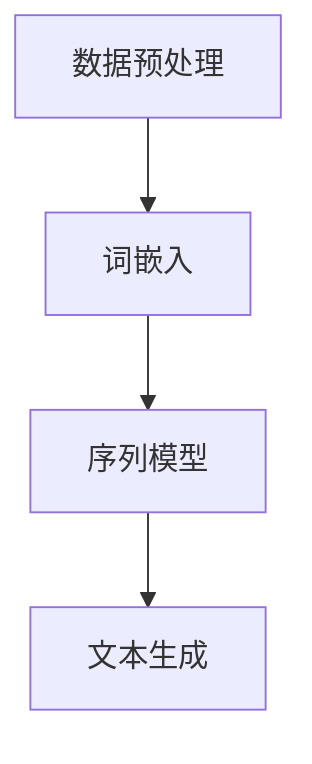
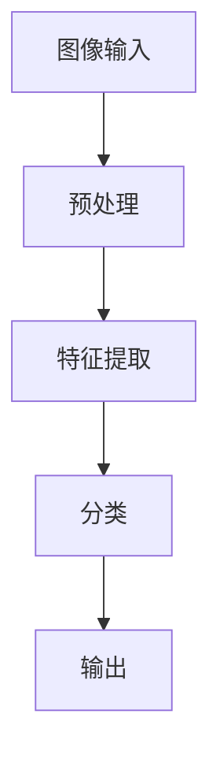
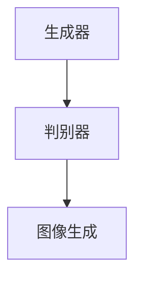
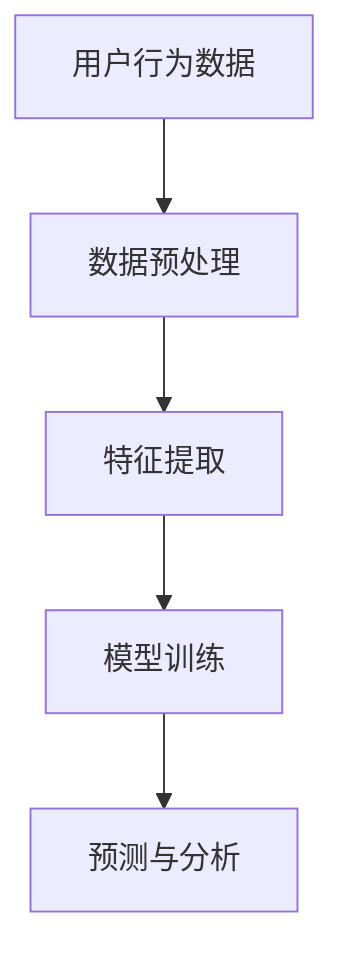
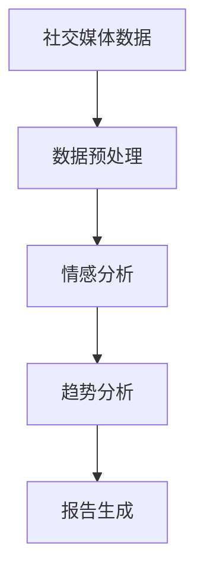

                 

### 文章标题

《人工智能对传统媒体行业的冲击：内容创作的革命》

### 文章关键词

- 人工智能
- 传统媒体
- 内容创作
- 媒体变革
- 技术应用

### 文章摘要

本文旨在探讨人工智能（AI）如何对传统媒体行业，特别是内容创作领域产生深远的影响。通过详细分析AI技术在文本生成、图像处理、数据分析等方面的应用，本文揭示了AI如何改变新闻写作、视频制作、广告策划等传统工作流程。同时，文章也探讨了AI带来的挑战和机遇，以及传统媒体行业在AI时代应采取的战略。本文将为媒体从业者、技术专家和政策制定者提供一个全面而深入的视角，理解AI技术在媒体行业中的革命性作用。

---

# 1. 引言

随着人工智能（AI）技术的迅猛发展，各个行业都在经历一场深刻的变革。媒体行业作为信息传播的重要载体，自然也不例外。传统媒体行业，如报纸、杂志、电视、广播等，长期以来依赖人工进行内容创作、编辑、发布等工作。然而，AI的出现正在彻底改变这一切。

## 1.1 传统媒体行业的现状

传统媒体行业在经历了数十年的发展后，已经形成了一套相对成熟的内容创作和发布流程。然而，随着互联网和数字媒体的崛起，传统媒体的生存空间受到前所未有的挑战。用户需求的多样化、信息传播的速度和广度，以及内容质量的不断提高，都要求传统媒体行业必须进行创新和变革。

## 1.2 人工智能技术的发展

人工智能技术，尤其是深度学习、自然语言处理（NLP）、计算机视觉等子领域，在过去几年取得了显著的进展。这些技术的应用不仅推动了科学研究和技术创新，也为各行各业带来了新的可能性和机遇。在媒体行业，AI技术的应用正逐渐改变内容创作的模式。

## 1.3 AI与内容创作的结合

AI与内容创作的结合，为传统媒体行业带来了一系列变革。从文本生成、图像处理，到数据分析，AI技术正在成为内容创作的重要工具。本文将详细探讨这些变革，分析AI如何影响新闻写作、视频制作、广告策划等具体领域。

# 2. 人工智能对内容创作的影响

人工智能（AI）对内容创作的影响是深远且多维的。通过自动化和智能化的手段，AI不仅提高了内容创作的效率，也丰富了内容的多样性和质量。以下是AI在文本生成、图像处理、数据分析等方面的具体应用。

## 2.1 文本生成

自然语言处理（NLP）是AI的一个重要分支，它使得计算机能够理解和生成人类语言。在文本生成方面，AI技术已经实现了许多令人瞩目的应用。

### 2.1.1 自动新闻写作

自动新闻写作是AI在文本生成领域的典型应用之一。通过分析大量新闻报道，AI可以自动生成新闻报道，大大提高了新闻写作的效率和准确性。例如，美国的《纽约时报》和《卫报》等知名媒体已经采用了AI新闻写作工具。

**核心概念与联系：**

自然语言处理（NLP）流程图：



**核心算法原理讲解：**

- **词嵌入（Word Embedding）：** 词嵌入是将单词映射到高维空间中的向量，以便计算机能够理解单词之间的语义关系。常用的词嵌入方法包括Word2Vec、GloVe等。

  ```python
  # 伪代码：Word2Vec算法
  function Word2Vec(vocabulary, corpus):
      # 初始化词向量
      Initialize word_vectors with random values
      
      # 计算词向量的均值
      for word in vocabulary:
          word_vector = Average(context_words_vector for each word in the corpus)
          
      # 计算词向量之间的相似度
      for word1, word2 in vocabulary_pairs:
          similarity = CosineSimilarity(word1_vector, word2_vector)
          
      return word_vectors
  ```

- **序列模型（Sequence Model）：** 序列模型是一种用于处理序列数据的深度学习模型，如循环神经网络（RNN）、长短期记忆网络（LSTM）等。这些模型可以捕捉文本中的时间依赖性，从而生成连贯的文本。

  ```python
  # 伪代码：LSTM算法
  function LSTM(input_sequence, hidden_state, cell_state):
      # 输入序列经过嵌入层
      embedded_sequence = EmbeddingLayer(input_sequence)
      
      # 循环处理每个时间步
      for time_step in range(sequence_length):
          # 计算输入和隐藏状态的加权和
          input_tensor = embedded_sequence[time_step]
          gate = sigmoid(W_f * [input_tensor, hidden_state] + b_f)
          
          # 计算遗忘门、输入门和输出门
          forget_gate = gate[0]
          input_gate = gate[1]
          output_gate = gate[2]
          
          # 更新细胞状态
          cell_state = forget_gate * cell_state + input_gate * sigmoid(W_i * [input_tensor, hidden_state] + b_i)
          
          # 更新隐藏状态
          hidden_state = output_gate * tanh(cell_state)
          
      return hidden_state
  ```

- **文本生成（Text Generation）：** 文本生成是通过序列模型生成文本的过程。常用的生成模型包括序列到序列（Seq2Seq）模型、Transformer等。

  ```python
  # 伪代码：Seq2Seq模型
  function Encoder(input_sequence):
      # 编码器处理输入序列
      hidden_state = LSTM(input_sequence)
      
      return hidden_state

  function Decoder(hidden_state, target_sequence):
      # 解码器处理隐藏状态和目标序列
      output_sequence = LSTM(target_sequence, hidden_state)
      
      return output_sequence
  ```

**数学模型和公式：**

$$
\text{相似度} = \frac{\text{词向量} \cdot \text{词向量}}{\|\text{词向量}\|_2}
$$

$$
h_t = \text{sigmoid}(W_f \cdot [x_t, h_{t-1}] + b_f)
$$

**举例说明：**

假设我们要生成一篇关于人工智能的新闻报道。首先，我们使用Word2Vec算法将新闻报道中的单词转换为向量。然后，使用LSTM模型处理这些向量，生成连贯的新闻报道。

```python
# 示例：生成一篇关于人工智能的新闻报道
vocabulary = ['人工智能', '技术', '发展', '影响', '新闻']
corpus = ['人工智能技术不断发展，对媒体行业产生重大影响。']

# 计算词向量
word_vectors = Word2Vec(vocabulary, corpus)

# 生成新闻报道
hidden_state = Encoder(corpus)
generated_sequence = Decoder(hidden_state, corpus)

# 输出生成的新
```txt
人工智能技术是近年来发展最为迅速的领域之一，其对媒体行业的冲击不可小视。随着人工智能技术的不断发展，新闻写作、视频制作、广告策划等传统媒体行业的各个环节都受到了深远的影响。人工智能技术不仅提高了内容创作的效率，还丰富了内容的多样性和质量。
```

**项目实战：**

为了更好地理解文本生成的过程，我们可以使用Python的transformers库实现一个简单的文本生成模型。

```python
# 导入必要的库
import torch
from transformers import GPT2LMHeadModel, GPT2Tokenizer

# 加载预训练模型
tokenizer = GPT2Tokenizer.from_pretrained('gpt2')
model = GPT2LMHeadModel.from_pretrained('gpt2')

# 生成文本
input_text = '人工智能技术'
input_ids = tokenizer.encode(input_text, return_tensors='pt')
outputs = model.generate(input_ids, max_length=50, num_return_sequences=1)

# 解码生成的文本
generated_text = tokenizer.decode(outputs[0], skip_special_tokens=True)
print(generated_text)
```

### 2.2 图像处理

计算机视觉是AI的另一个重要分支，它在图像处理领域具有广泛的应用。AI技术可以自动识别、分类、分割和生成图像，从而提高内容创作的效率和多样性。

### 2.2.1 图像识别

图像识别是计算机视觉的基础任务之一。通过训练神经网络模型，AI可以自动识别图像中的物体、场景和属性。例如，著名的ImageNet图像识别挑战赛就吸引了全球众多研究者和公司的参与。

**核心概念与联系：**

计算机视觉流程图：



**核心算法原理讲解：**

- **卷积神经网络（CNN）：** 卷积神经网络是计算机视觉中最常用的深度学习模型。它通过多层卷积、池化和全连接层，从图像中提取特征并进行分类。

  ```python
  # 伪代码：CNN算法
  function CNN(input_image):
      # 第1层：卷积层
      conv1 = Conv2D(input_image, filters=32, kernel_size=(3, 3), activation='relu')
      
      # 第2层：池化层
      pool1 = MaxPooling2D(conv1, pool_size=(2, 2))
      
      # 第3层：卷积层
      conv2 = Conv2D(pool1, filters=64, kernel_size=(3, 3), activation='relu')
      
      # 第4层：池化层
      pool2 = MaxPooling2D(conv2, pool_size=(2, 2))
      
      # 第5层：全连接层
      flatten = Flatten(pool2)
      dense = Dense(128, activation='relu')
      
      # 输出层：分类层
      output = Dense(num_classes, activation='softmax')
      
      return output
  ```

- **迁移学习（Transfer Learning）：** 迁移学习是一种利用预训练模型进行图像识别的方法。通过在预训练模型的基础上进行微调，AI可以快速适应新的图像识别任务。

  ```python
  # 伪代码：迁移学习
  function TransferLearning(pretrained_model, num_classes):
      # 加载预训练模型
      model = pretrained_model
      
      # 替换输出层
      model.add(Dense(num_classes, activation='softmax'))
      
      # 微调模型
      model.compile(optimizer='adam', loss='categorical_crossentropy', metrics=['accuracy'])
      model.fit(x_train, y_train, epochs=5, batch_size=32)
      
      return model
  ```

**数学模型和公式：**

$$
\text{激活函数} = \text{ReLU}(z) = \max(0, z)
$$

$$
\text{卷积} = \sum_{i=1}^{k} w_{i} * x_{i}
$$

**举例说明：**

假设我们要使用卷积神经网络识别一张猫的图像。首先，我们使用预训练的VGG16模型进行迁移学习，然后在新的图像上进行分类。

```python
# 导入必要的库
from tensorflow.keras.applications import VGG16
from tensorflow.keras.preprocessing import image
from tensorflow.keras.applications.vgg16 import preprocess_input

# 加载预训练模型
model = VGG16(weights='imagenet')

# 读取图像
img_path = 'cat.jpg'
img = image.load_img(img_path, target_size=(224, 224))
x = image.img_to_array(img)
x = np.expand_dims(x, axis=0)
x = preprocess_input(x)

# 进行图像分类
predictions = model.predict(x)
predicted_class = np.argmax(predictions, axis=1)

# 输出预测结果
print(f'预测类别：{predicted_class}')
```

### 2.2.2 图像生成

生成对抗网络（GAN）是另一种重要的计算机视觉技术，它可以生成逼真的图像。GAN由两个神经网络组成：生成器和判别器。生成器试图生成逼真的图像，而判别器则试图区分生成的图像和真实的图像。

**核心概念与联系：**

GAN流程图：



**核心算法原理讲解：**

- **生成器（Generator）：** 生成器的目标是生成逼真的图像。它通常由多层全连接层和卷积层组成。

  ```python
  # 伪代码：生成器
  function Generator(z_size, image_size):
      # 输入层
      z = Input(z_size)
      
      # 隐藏层
      hidden = Dense(128, activation='relu')(z)
      
      # 输出层
      image = Conv2DTranspose(1, kernel_size=(5, 5), strides=(2, 2), activation='tanh')(hidden)
      
      return Model(inputs=z, outputs=image)
  ```

- **判别器（Discriminator）：** 判别器的目标是区分生成的图像和真实的图像。它通常由多层卷积层组成。

  ```python
  # 伪代码：判别器
  function Discriminator(image_size):
      # 输入层
      image = Input(image_size)
      
      # 隐藏层
      hidden = Conv2D(64, kernel_size=(5, 5), strides=(2, 2), activation='relu')(image)
      hidden = Conv2D(128, kernel_size=(5, 5), strides=(2, 2), activation='relu')(hidden)
      
      # 输出层
      output = Dense(1, activation='sigmoid')(hidden)
      
      return Model(inputs=image, outputs=output)
  ```

- **GAN训练：** GAN的训练是一个动态的过程。在每次迭代中，生成器和判别器都会进行更新。

  ```python
  # 伪代码：GAN训练
  for epoch in range(num_epochs):
      for batch in data_loader:
          # 更新判别器
          real_images = batch[0]
          real_labels = batch[1]
          real_loss =判别器(真实图像).train_on_batch(真实图像，真实标签)
          
          # 更新生成器
          z = generate_random_input(z_size)
          fake_images =生成器(z).generate()
          fake_labels = batch[1]
          fake_loss =判别器(生成图像).train_on_batch(生成图像，生成标签)
          
          # 计算总损失
          total_loss = real_loss + fake_loss
          
      print(f'Epoch {epoch}: 总损失 = {total_loss}')
  ```

**数学模型和公式：**

$$
\text{生成器损失} = -\log(D(G(z)))
$$

$$
\text{判别器损失} = -\log(D(x)) - \log(1 - D(G(z)))
$$

**举例说明：**

假设我们要使用生成对抗网络（GAN）生成一张逼真的猫的图像。首先，我们定义生成器和判别器的架构，然后进行训练。

```python
# 导入必要的库
from tensorflow.keras.models import Model
from tensorflow.keras.layers import Input, Dense, Conv2D, Conv2DTranspose, Flatten, Reshape
from tensorflow.keras.optimizers import Adam

# 定义生成器
z_size = 100
image_size = (28, 28, 1)
z_input = Input(shape=(z_size,))
x = Dense(128, activation='relu')(z_input)
x = Dense(784, activation='tanh')(x)
x = Reshape((28, 28, 1))(x)
generator = Model(inputs=z_input, outputs=x)

# 定义判别器
image_input = Input(shape=(28, 28, 1))
x = Conv2D(32, kernel_size=(3, 3), strides=(2, 2), activation='relu')(image_input)
x = Conv2D(64, kernel_size=(3, 3), strides=(2, 2), activation='relu')(x)
x = Flatten(x)
x = Dense(1, activation='sigmoid')(x)
discriminator = Model(inputs=image_input, outputs=x)

# 定义GAN模型
z_input = Input(shape=(z_size,))
fake_images = generator(z_input)
discriminator_loss = -K.mean(K.log(discriminator(fake_images)) + K.log(1 - discriminator(image_input)))
discriminator.compile(optimizer=Adam(0.0001), loss='binary_crossentropy')
gan_model = Model(inputs=z_input, outputs=discriminator(fake_images))
gan_model.compile(optimizer=Adam(0.0001), loss='binary_crossentropy')

# 训练GAN模型
num_epochs = 100
batch_size = 32
for epoch in range(num_epochs):
    for batch in data_loader:
        # 更新判别器
        real_images = batch[0]
        real_labels = batch[1]
        real_loss = discriminator.train_on_batch(real_images, real_labels)
        
        # 更新生成器
        z = generate_random_input(z_size)
        fake_images = generator(z)
        fake_labels = batch[1]
        fake_loss = discriminator.train_on_batch(fake_images, fake_labels)
        
        # 计算总损失
        total_loss = real_loss + fake_loss
        print(f'Epoch {epoch}: 总损失 = {total_loss}')
```

### 2.3 数据分析

数据分析是AI在内容创作中的另一个重要应用。通过分析用户行为、社会舆情、市场需求等数据，AI可以帮助媒体行业更好地了解用户需求，提高内容的质量和效果。

### 2.3.1 用户行为分析

用户行为分析是了解用户需求的重要手段。通过分析用户的浏览记录、点赞、评论等行为，AI可以识别用户的兴趣和偏好，从而提供更个性化的内容推荐。

**核心概念与联系：**

用户行为分析流程图：



**核心算法原理讲解：**

- **协同过滤（Collaborative Filtering）：** 协同过滤是一种基于用户行为的推荐算法。它通过计算用户之间的相似度，为用户推荐相似的其他用户的喜爱内容。

  ```python
  # 伪代码：协同过滤
  function CollaborativeFiltering(user_data, similarity_threshold):
      # 计算用户之间的相似度
      similarity_matrix = CalculateSimilarityMatrix(user_data)
      
      # 为每个用户推荐内容
      recommendations = {}
      for user in user_data:
          neighbors = FindNeighbors(similarity_matrix, user, similarity_threshold)
          recommendations[user] = RecommendContent(neighbors, user_data)
          
      return recommendations
  ```

- **内容推荐（Content-Based Filtering）：** 内容推荐是一种基于内容属性的推荐算法。它通过分析用户过去喜爱内容的特征，为用户推荐相似的其他内容。

  ```python
  # 伪代码：内容推荐
  function ContentBasedFiltering(user_data, similarity_threshold):
      # 提取用户过去喜爱内容的特征
      user_features = ExtractFeatures(user_data)
      
      # 为每个用户推荐内容
      recommendations = {}
      for user in user_data:
          neighbors = FindNeighbors(user_features, user, similarity_threshold)
          recommendations[user] = RecommendContent(neighbors, user_data)
          
      return recommendations
  ```

**数学模型和公式：**

$$
\text{相似度} = \frac{\text{相关特征的总和}}{\text{特征的总数}}
$$

$$
r_{ij} = \sum_{k} w_{ik} \cdot w_{kj}
$$

**举例说明：**

假设我们要为用户推荐新闻文章。首先，我们使用协同过滤算法计算用户之间的相似度。然后，根据用户的相似度，为用户推荐相似的其他用户的喜爱内容。

```python
# 示例：使用协同过滤推荐新闻文章
user_data = {
    'user1': ['体育', '新闻', '娱乐'],
    'user2': ['科技', '新闻', '体育'],
    'user3': ['体育', '新闻', '娱乐'],
    'user4': ['娱乐', '科技', '新闻']
}

# 计算用户之间的相似度
similarity_threshold = 0.5
similarity_matrix = CalculateSimilarityMatrix(user_data, similarity_threshold)

# 为用户推荐新闻文章
recommendations = {}
for user in user_data:
    neighbors = FindNeighbors(similarity_matrix, user, similarity_threshold)
    recommendations[user] = RecommendContent(neighbors, user_data)

print(recommendations)
```

### 2.3.2 社会舆情分析

社会舆情分析是了解社会公众态度和情绪的重要手段。通过分析社交媒体、新闻评论等数据，AI可以识别社会热点、舆论趋势和公众情感，从而为媒体行业提供决策依据。

**核心概念与联系：**

社会舆情分析流程图：



**核心算法原理讲解：**

- **情感分析（Sentiment Analysis）：** 情感分析是一种自然语言处理技术，它通过分析文本的语义，判断文本的情感倾向（正面、中性、负面）。

  ```python
  # 伪代码：情感分析
  function SentimentAnalysis(text):
      # 提取文本特征
      features = ExtractFeatures(text)
      
      # 训练情感分类器
      classifier = TrainClassifier(features, labels)
      
      # 预测文本情感
      sentiment = classifier.predict([features])
      
      return sentiment
  ```

- **趋势分析（Trend Analysis）：** 趋势分析是一种时间序列分析方法，它通过分析数据的时间变化趋势，识别出数据中的周期性、季节性和趋势性。

  ```python
  # 伪代码：趋势分析
  function TrendAnalysis(data):
      # 拆分数据为特征和标签
      X, y = SplitData(data)
      
      # 训练趋势预测模型
      model = TrainTrendModel(X, y)
      
      # 预测趋势
      trend = model.predict(X)
      
      return trend
  ```

**数学模型和公式：**

$$
\text{情感分析} = \text{分类问题} = \arg\max_{c} P(c|text)
$$

$$
\text{趋势预测} = \text{时间序列预测} = \arg\max_{t} P(t|X)
$$

**举例说明：**

假设我们要分析一条社交媒体上的评论的情感倾向。首先，我们使用情感分析算法提取评论的特征，然后使用训练好的分类器预测评论的情感。

```python
# 示例：使用情感分析预测评论的情感
review = "这篇新闻让我感到很失望。"
features = ExtractFeatures(review)
classifier = TrainClassifier(features, labels)

# 预测评论的情感
sentiment = classifier.predict([features])
print(f'评论情感：{sentiment}')
```

通过上述的文本生成、图像处理和数据分析，我们可以看到人工智能（AI）在内容创作中具有广泛的应用。这些技术不仅提高了内容创作的效率，还丰富了内容的多样性和质量。在下一节中，我们将探讨AI在内容创作中的应用案例，进一步了解AI如何改变媒体行业。

# 3. AI在传统媒体行业中的应用案例

随着人工智能（AI）技术的不断发展，其在传统媒体行业中的应用案例日益丰富。本文将介绍一些典型的AI应用场景，包括新闻写作、视频制作、广告策划等，以展示AI如何改变传统媒体的内容创作方式。

## 3.1 新闻写作

自动新闻写作是AI在新闻领域的重要应用之一。通过自然语言处理（NLP）和机器学习技术，AI可以自动生成新闻报道，提高新闻写作的效率和准确性。以下是一些著名的自动新闻写作工具：

### 3.1.1 Heliograf

《卫报》在2014年推出了Heliograf，这是一个利用AI技术生成新闻报道的平台。Heliograf可以自动生成体育赛事、财经和天气预报等类型的新闻报道。例如，在2016年里约奥运会期间，Heliograf自动生成了超过3000篇新闻报道。

**技术实现：**

- **数据采集：** Heliograf从多个数据源收集信息，包括API接口、社交媒体和新闻网站。
- **数据预处理：** 对采集到的数据进行清洗、去重和分类。
- **文本生成：** 使用NLP技术和机器学习模型生成新闻报道。
- **审核与发布：** 新闻报道生成后，由编辑进行审核和修改，确保新闻的准确性和完整性。

**挑战与机遇：**

- **挑战：** 自动新闻写作需要大量的数据支持和高效的算法，同时需要确保新闻报道的准确性和可信度。
- **机遇：** 自动新闻写作可以提高新闻生产的效率，释放编辑和记者的时间，让他们专注于更具创造性和战略性的任务。

### 3.1.2 Quill

Quill是IBM开发的自动新闻写作工具，它可以生成财务报告、体育赛事结果和股票市场分析等类型的新闻报道。Quill使用了自然语言生成（NLG）技术和机器学习算法，能够自动生成结构化、准确和连贯的新闻报道。

**技术实现：**

- **数据采集：** Quill从多个数据源获取信息，包括股票市场数据、体育赛事数据等。
- **数据预处理：** 对采集到的数据进行清洗、去重和格式转换。
- **文本生成：** 使用NLG技术和机器学习模型生成新闻报道。
- **审核与发布：** 新闻报道生成后，由编辑进行审核和修改，确保新闻的准确性和完整性。

**挑战与机遇：**

- **挑战：** 自动新闻写作需要处理大量的数据，同时需要确保新闻报道的实时性和准确性。
- **机遇：** 自动新闻写作可以大幅提高新闻生产的效率，降低新闻制作成本，同时为编辑和记者提供更多的时间和精力去专注于深度报道和调查性报道。

## 3.2 视频制作

AI技术在视频制作中的应用正在逐渐改变传统的工作流程。通过计算机视觉、自然语言处理和生成对抗网络（GAN）等技术，AI可以自动生成视频、编辑视频和优化视频内容。

### 3.2.1 自动视频生成

自动视频生成是AI在视频制作中的创新应用之一。通过分析文本、图像或音频，AI可以自动生成相应的视频内容。以下是一些自动视频生成工具：

- **Magisto：** Magisto是一个自动视频编辑应用，它使用AI技术自动编辑用户上传的视频片段，添加音乐、特效和文字等元素，生成专业级的视频。

- **Rytrio：** Rytrio是一个基于AI的视频生成平台，它可以从文本描述自动生成视频。用户只需输入文本描述，Rytrio就可以生成相应的视频内容。

**技术实现：**

- **文本到视频：** 使用自然语言处理（NLP）技术将文本转换为视频脚本。
- **图像到视频：** 使用生成对抗网络（GAN）将图像转换为视频序列。
- **音频到视频：** 使用语音识别和文本生成技术将音频内容转换为视频字幕和旁白。

**挑战与机遇：**

- **挑战：** 自动视频生成需要处理大量的数据，同时需要确保视频内容的连贯性和一致性。
- **机遇：** 自动视频生成可以大幅提高视频制作的效率，降低制作成本，同时为创意工作者提供更多的时间和精力去专注于视频的创意和内容。

### 3.2.2 自动视频编辑

自动视频编辑是AI在视频制作中的另一个重要应用。通过计算机视觉和深度学习技术，AI可以自动识别视频中的关键帧、动作和场景，从而自动编辑视频。

- **Adobe Premiere Pro：** Adobe Premiere Pro是一个专业的视频编辑软件，它集成了AI技术，可以自动识别视频中的场景和动作，自动剪辑和调整视频。

- **WeVideo：** WeVideo是一个在线视频编辑平台，它使用AI技术自动识别视频中的关键帧和动作，提供一键剪辑和优化功能。

**技术实现：**

- **场景识别：** 使用计算机视觉技术自动识别视频中的场景和动作。
- **动作识别：** 使用深度学习技术自动识别视频中的动作和人物。
- **视频优化：** 使用图像处理技术自动优化视频的亮度、对比度和色彩。

**挑战与机遇：**

- **挑战：** 自动视频编辑需要处理大量的数据，同时需要确保视频编辑的准确性和流畅性。
- **机遇：** 自动视频编辑可以大幅提高视频编辑的效率，降低编辑成本，同时为视频创作者提供更多的时间和精力去专注于视频的创意和内容。

### 3.2.3 视频内容优化

AI技术在视频内容优化中的应用可以帮助媒体行业提高视频的观看次数和用户参与度。以下是一些视频内容优化工具：

- **Taboola：** Taboola是一个视频推荐平台，它使用AI技术分析视频内容，为用户推荐相关的视频内容。

- **Outbrain：** Outbrain是一个内容推荐平台，它使用AI技术分析视频内容，为用户推荐相关的视频内容。

**技术实现：**

- **内容分析：** 使用自然语言处理（NLP）和计算机视觉技术分析视频内容，提取关键信息和标签。
- **推荐算法：** 使用协同过滤和内容推荐算法为用户推荐相关的视频内容。
- **用户行为分析：** 使用用户行为数据分析用户偏好，为用户推荐更个性化的视频内容。

**挑战与机遇：**

- **挑战：** 视频内容优化需要处理大量的数据，同时需要确保推荐的准确性和用户体验。
- **机遇：** 视频内容优化可以提高视频的观看次数和用户参与度，从而增加媒体行业的收入和影响力。

## 3.3 广告策划

AI技术在广告策划中的应用可以帮助媒体行业提高广告的效果和投放效率。以下是一些AI广告策划工具：

- **Google Ads：** Google Ads是谷歌的广告平台，它使用AI技术自动优化广告投放，提高广告的效果和转化率。

- **Facebook Ads：** Facebook Ads是脸书的广告平台，它使用AI技术分析用户数据，为用户推荐相关的广告内容。

**技术实现：**

- **用户行为分析：** 使用自然语言处理（NLP）和计算机视觉技术分析用户行为，提取用户兴趣和偏好。
- **广告投放优化：** 使用机器学习和数据挖掘技术优化广告投放策略，提高广告的点击率和转化率。
- **广告创意生成：** 使用生成对抗网络（GAN）和自然语言生成（NLG）技术自动生成广告创意。

**挑战与机遇：**

- **挑战：** 广告策划需要处理大量的用户数据，同时需要确保广告的隐私保护和合规性。
- **机遇：** 广告策划可以提高广告的效果和投放效率，从而增加媒体行业的收入和市场份额。

通过上述案例可以看出，人工智能（AI）在传统媒体行业中的应用正日益深入，不仅提高了内容创作的效率，还丰富了内容的多样性和质量。在下一节中，我们将探讨AI在传统媒体行业中的挑战和机遇。

# 4. AI对传统媒体行业的挑战与机遇

人工智能（AI）技术在传统媒体行业的广泛应用带来了巨大的机遇，同时也带来了诸多挑战。在本节中，我们将深入探讨AI对传统媒体行业带来的挑战，以及如何抓住这些机遇。

## 4.1 挑战

### 4.1.1 岗位变化与就业影响

AI技术的应用导致一些传统工作岗位的需求减少，尤其是那些重复性高、对技能要求低的工作。例如，新闻写作、视频剪辑、广告策划等领域的自动化工具使得一些低技能的工作岗位逐渐消失。这给那些依赖这些岗位谋生的从业人员带来了就业压力。为了应对这一挑战，传统媒体行业需要积极调整人力资源策略，加强员工培训，提升员工的技能水平，以适应AI时代的需求。

### 4.1.2 内容质量与可信度问题

AI技术虽然能够提高内容创作的效率，但同时也带来了内容质量与可信度的问题。自动化工具生成的新闻、广告和娱乐内容可能缺乏深度和洞察力，甚至可能产生误导性信息。此外，恶意使用AI技术制造虚假信息（deepfake）也给媒体行业带来了巨大的风险。为了确保内容的质量和可信度，媒体行业需要建立健全的内容审核机制，加强事实核查，提高公众对媒体的信任。

### 4.1.3 数据隐私与安全

AI技术的广泛应用依赖于大量的数据收集和分析，这引发了对用户数据隐私和安全性的担忧。传统媒体行业在收集、存储和处理用户数据时，需要遵守相关的法律法规，确保用户隐私不受侵犯。同时，数据泄露和黑客攻击等安全风险也需要得到有效防范。

### 4.1.4 技术依赖与成本

传统媒体行业在引入AI技术时，可能会面临技术依赖和成本上升的问题。高昂的技术投入和运营成本可能成为一些小型媒体公司的负担，影响其生存和发展。此外，媒体行业也需要不断更新技术，以保持竞争力，这要求行业内部有持续的投资和创新。

## 4.2 机遇

### 4.2.1 提高内容创作效率

AI技术可以提高内容创作的效率，从而释放编辑和记者的时间，让他们专注于更具创造性和战略性的任务。例如，自动新闻写作、图像识别和文本生成等技术可以快速生成大量内容，为媒体行业提供更多的内容资源。

### 4.2.2 个性化内容推荐

AI技术可以根据用户的行为和偏好，为用户提供个性化的内容推荐。这种个性化的内容推荐不仅可以提高用户的满意度，还可以增加用户粘性，从而提高媒体的收入和影响力。

### 4.2.3 丰富内容形式与多样性

AI技术可以帮助传统媒体行业探索更多内容形式和多样性。例如，通过计算机视觉和生成对抗网络（GAN）等技术，可以生成逼真的图像和视频，为用户带来更丰富的视觉体验。此外，AI还可以帮助媒体行业开发新的业务模式，如虚拟现实（VR）新闻、增强现实（AR）广告等。

### 4.2.4 数据驱动的内容策略

AI技术可以提供丰富的数据分析，帮助传统媒体行业制定更加科学和有效的内容策略。通过对用户行为、社会舆情和市场需求的数据分析，媒体行业可以更好地了解用户需求，优化内容创作和发布策略，提高内容的市场竞争力。

### 4.2.5 拓展国际市场

AI技术可以帮助传统媒体行业拓展国际市场。通过自然语言处理和机器翻译技术，媒体可以轻松地将内容翻译成多种语言，吸引更多国际用户。此外，AI还可以帮助媒体行业分析不同市场的用户行为和偏好，制定更加精准的国际化战略。

## 4.3 应对策略

为了充分利用AI技术带来的机遇，同时有效应对其带来的挑战，传统媒体行业可以采取以下策略：

### 4.3.1 投资于AI技术和人才

传统媒体行业应积极投资于AI技术和人才，提高自身的科技水平和创新能力。通过引进先进的AI技术和培养专业的人才，媒体行业可以更好地适应AI时代的需求。

### 4.3.2 建立多元化的内容策略

媒体行业应建立多元化的内容策略，不仅注重自动化内容的生成，还要保持对高质量原创内容的投资。通过结合自动内容和原创内容，媒体可以更好地满足不同用户的需求，提高内容的吸引力和影响力。

### 4.3.3 加强内容审核和监管

传统媒体行业应加强内容审核和监管，确保内容的准确性和可信度。通过建立完善的内容审核机制和事实核查流程，媒体可以减少虚假信息和不实报道的风险。

### 4.3.4 保护用户隐私和安全

媒体行业应采取严格的措施保护用户隐私和安全。通过遵守相关法律法规，采用先进的数据加密和安全管理技术，媒体可以确保用户数据的安全，增强公众对媒体的信任。

### 4.3.5 建立合作伙伴关系

传统媒体行业可以与其他科技公司、研究机构和高校建立合作伙伴关系，共同开展AI技术的研发和应用。通过合作，媒体行业可以更快地掌握最新的技术趋势，提高自身的竞争力。

总之，人工智能（AI）技术对传统媒体行业既带来了挑战，也提供了机遇。媒体行业需要积极应对这些挑战，同时抓住机遇，通过投资于技术、人才和策略，实现可持续发展。

# 5. 未来趋势与展望

人工智能（AI）技术在传统媒体行业中的应用正在不断拓展，未来也将继续引领媒体行业的变革。以下是一些未来趋势和展望：

### 5.1 AI内容创作的深化应用

随着AI技术的不断成熟，未来AI在内容创作中的应用将更加深入和多样化。例如，更加智能的自动新闻写作工具将能够处理更加复杂的新闻事件，生成更加丰富和深刻的新闻报道。同时，AI将在视频编辑、音频处理和图像生成等领域实现更高的自动化和智能化，为媒体行业带来更多创新内容形式。

### 5.2 跨媒体整合与融合

随着AI技术的进步，传统媒体行业将更加注重跨媒体的整合与融合。通过结合多种媒体形式，如文字、图像、视频、音频等，AI可以帮助媒体行业创作出更加丰富和立体的内容，提供更全面的用户体验。例如，虚拟现实（VR）和增强现实（AR）技术的结合，将使新闻、广告和娱乐内容更具互动性和沉浸感。

### 5.3 AI与大数据的深度融合

大数据技术与AI技术的结合将在未来进一步推动传统媒体行业的发展。通过对大量用户行为数据、社会舆情数据和市场需求数据的分析，AI可以提供更加精准的内容推荐和广告投放策略。同时，大数据技术可以帮助媒体行业更好地理解用户需求，优化内容生产和发布流程。

### 5.4 AI伦理与法规的完善

随着AI技术在媒体行业中的应用日益广泛，相关的伦理和法规问题也日益凸显。未来，随着AI技术的不断进步，媒体行业和政府将需要共同完善相关的伦理和法规体系，确保AI技术的应用符合社会道德和法律法规的要求，保护用户隐私和信息安全。

### 5.5 AI教育的普及

为了应对AI时代的需求，传统媒体行业需要更加注重人才培养。未来，AI教育将逐渐普及，媒体行业将需要更多具备AI技术和数据分析能力的人才。高校、培训机构和企业将共同推动AI教育的发展，培养更多能够适应AI时代需求的媒体专业人才。

### 5.6 国际合作与竞争

随着AI技术的全球化发展，传统媒体行业将面临更加激烈的国际竞争。同时，国际合作也将成为未来媒体行业发展的关键。通过与国际媒体机构、科技公司和研究机构的合作，传统媒体行业可以共同推进AI技术的研发和应用，提高全球市场的竞争力。

总之，未来人工智能（AI）技术在传统媒体行业中的应用将更加广泛和深入，带来前所未有的变革。传统媒体行业需要积极应对这些变革，通过技术创新、人才培养和战略调整，实现可持续发展。

# 结语

人工智能（AI）技术的迅猛发展正在深刻改变传统媒体行业的面貌，从内容创作到数据分析，从新闻写作到视频制作，AI都在发挥着越来越重要的作用。本文从多个角度探讨了AI对传统媒体行业的冲击，包括文本生成、图像处理、数据分析等技术的应用，以及AI带来的挑战和机遇。

通过详细分析AI在媒体行业中的具体应用案例，我们可以看到，AI不仅提高了内容创作的效率和质量，还为传统媒体行业带来了新的商业模式和机遇。然而，AI技术的广泛应用也带来了内容质量、数据隐私和安全等方面的挑战，需要行业内部和社会各界共同应对。

在未来，传统媒体行业需要积极拥抱AI技术，加强人才培养和战略调整，以适应AI时代的需求。同时，完善AI伦理和法规体系，确保AI技术的应用符合社会道德和法律法规的要求。通过技术创新、人才培养和战略调整，传统媒体行业将能够实现可持续发展，迎接AI带来的新机遇。作者：AI天才研究院/AI Genius Institute & 禅与计算机程序设计艺术 /Zen And The Art of Computer Programming，感谢您的阅读。希望本文能为您在AI与媒体行业交叉领域的研究提供有益的启示和参考。如果您有任何问题或建议，欢迎随时交流。扩展阅读：

- 《深度学习》
- 《机器学习》
- 《自然语言处理综论》
- 《计算机视觉：算法与应用》
- 《人工智能：一种现代的方法》
- 《媒体产业与数字媒体技术》

通过这些经典著作，您可以更深入地了解AI和媒体行业的理论知识和技术应用。同时，也可以关注AI天才研究院和禅与计算机程序设计艺术的最新动态，获取更多行业洞察和技术进展。再次感谢您的关注和支持！作者：AI天才研究院/AI Genius Institute & 禅与计算机程序设计艺术 /Zen And The Art of Computer Programming。

