                 

### 文章标题

《人工智能对传统教育模式的挑战：在线学习与适应性教育》

### 关键词

- 人工智能
- 传统教育模式
- 在线学习
- 适应性教育
- 教育技术

### 摘要

本文深入探讨了人工智能对传统教育模式的挑战，特别是在线学习和适应性教育的兴起。通过对人工智能与传统教育模式的现状分析，本文详细介绍了在线学习和适应性教育的核心概念和算法原理。随后，文章通过数学模型和公式的讲解，提供了对教育领域技术应用的深刻理解。最后，通过实际项目和案例分析，本文展示了人工智能在教育中的实际应用，并提出了未来发展的趋势和挑战。

---

### 引言

在21世纪的今天，人工智能（AI）已经成为科技创新的前沿领域。从自动驾驶汽车到智能家居，AI正在改变我们的生活方式。然而，AI的应用并不局限于这些领域，它对教育模式的冲击也愈发显著。传统教育模式往往以教师为中心，注重知识传授和统一教学。而随着在线学习和适应性教育的兴起，教育模式正逐渐从“以教师为中心”转向“以学生为中心”。

在线学习利用互联网技术，打破了时间和空间的限制，使学生能够自主选择学习内容和学习方式。而适应性教育则通过分析学生的学习数据，提供个性化的学习方案，从而提高学习效果。人工智能作为这些新兴教育模式的核心驱动力，正在对传统教育模式进行深刻的变革。

本文将首先介绍人工智能与传统教育模式的现状，探讨在线学习和适应性教育的核心概念及其关联。随后，文章将深入讲解核心算法原理，包括在线学习算法和适应性教育算法的数学模型。接着，通过实际项目和案例分析，本文将展示人工智能在教育中的实际应用。最后，本文将总结人工智能对教育模式的影响，并提出未来的发展趋势和挑战。

### 核心概念与联系

#### 1. 人工智能与传统教育模式的现状

人工智能（AI）是计算机科学的一个分支，旨在使机器能够执行通常需要人类智能才能完成的任务。在教育领域，AI的应用已经逐渐成为现实。例如，智能辅导系统（Intelligent Tutoring Systems，ITS）通过模拟人类教师的教学方法，为学生提供个性化的辅导。此外，学习分析（Learning Analytics）利用大数据技术，分析学生的学习行为和成绩，为教育工作者提供决策支持。

传统教育模式以教师为中心，强调知识传授和标准化测试。然而，随着时代的发展，这种模式逐渐显露出其局限性。首先，传统教育模式难以满足学生多样化的学习需求。其次，教师的工作负担沉重，难以对每个学生进行个性化的关注。此外，标准化测试虽然能够衡量学生的学习成果，但往往忽视了学生的个体差异。

#### 2. 在线学习与适应性教育的定义

在线学习是指通过互联网和数字技术，使学生能够自主选择学习内容和学习方式。它打破了传统教育的时空限制，使学习变得更加灵活和便捷。在线学习平台如Coursera、edX等，为学生提供了丰富的课程资源，让他们可以随时随地学习。

适应性教育则是一种基于数据驱动的教育方法，旨在为学生提供个性化的学习体验。它利用人工智能技术，分析学生的学习数据，包括学习进度、学习风格、知识掌握程度等，从而生成个性化的学习方案。适应性教育可以通过调整学习内容、教学方法和学习节奏，提高学生的学习效果。

#### 3. 人工智能与在线学习、适应性教育的关联

人工智能为在线学习和适应性教育提供了强有力的技术支持。首先，智能推荐系统可以利用机器学习算法，分析学生的兴趣和学习历史，推荐合适的课程和学习资源。其次，学习分析技术可以通过数据挖掘和模式识别，揭示学生的学习规律和需求，为教育工作者提供决策支持。

此外，自然语言处理（NLP）技术在在线学习中的应用，可以自动化评估学生的作业和考试，节省教师的工作量。智能辅导系统则可以模拟人类教师的教学方法，为学生提供个性化的辅导，提高学习效果。

总之，人工智能与在线学习、适应性教育的结合，不仅提升了教育质量，也促进了教育公平。然而，这种变革也带来了一系列挑战，如数据隐私保护、技术依赖等问题。在接下来的章节中，我们将深入探讨这些核心算法原理，以更好地理解人工智能在教育中的应用。

### 核心概念原理之间的关系架构 Mermaid 流程图

```mermaid
graph TD
    A[人工智能] --> B[在线学习]
    A --> C[适应性教育]
    B --> D[智能推荐系统]
    B --> E[学习分析]
    C --> F[个性化学习]
    C --> G[自然语言处理]
    D --> H[机器学习算法]
    E --> I[数据挖掘]
    F --> J[教学个性化]
    G --> K[作业评估]
    A --> B --> C --> D --> E --> F --> G
```



在这个流程图中，人工智能（A）作为核心驱动力，推动了在线学习（B）和适应性教育（C）的发展。在线学习中的智能推荐系统（D）和学习分析（E）分别利用机器学习和数据挖掘技术（H和I），为个性化学习（F）提供支持。适应性教育中的自然语言处理（G）则通过作业评估（K）和教学个性化（J），进一步提升学习效果。

### 核心算法原理讲解

#### 1. 在线学习算法

在线学习算法是人工智能在教育资源分配和学习路径规划中的重要应用。以下是一个基本的在线学习算法的伪代码示例：

```python
# 在线学习算法伪代码

def online_learning(course_list, student_preferences):
    """
    给定课程列表和学生偏好，返回最佳学习路径
    """
    student_profile = build_student_profile(student_preferences)
    recommendation_system = build_recommendation_system(course_list, student_profile)
    learning_path = []

    for course in course_list:
        if recommendation_system.recommend(course, student_profile):
            learning_path.append(course)

    return learning_path

def build_student_profile(preferences):
    """
    根据学生偏好构建学生档案
    """
    # 这里可以包括兴趣、先修课程、学习速度等
    profile = {}
    for preference in preferences:
        profile[preference] = 1
    return profile

def build_recommendation_system(course_list, student_profile):
    """
    根据课程列表和学生档案构建推荐系统
    """
    # 这里可以使用协同过滤、基于内容的推荐等技术
    system = RecommendationSystem(course_list, student_profile)
    return system
```

在这个算法中，`build_student_profile` 函数用于构建学生的个性化档案，而 `build_recommendation_system` 函数则负责根据课程列表和学生档案构建推荐系统。`online_learning` 函数则根据推荐系统的建议，生成最佳的学习路径。

#### 2. 适应性教育算法

适应性教育算法的核心在于根据学生的学习行为和成绩动态调整学习内容和方法。以下是一个简化的适应性教育算法的伪代码示例：

```python
# 适应性教育算法伪代码

def adaptive_education(student_data, course_content):
    """
    根据学生学习数据，动态调整学习内容和方法
    """
    student_profile = build_student_profile(student_data)
    learning_plan = build_initial_learning_plan(course_content, student_profile)
    for session in student_data['sessions']:
        adjust_learning_plan(learning_plan, session['performance'])
    return learning_plan

def build_student_profile(student_data):
    """
    根据学生学习数据构建学生档案
    """
    profile = {}
    profile['knowledge_level'] = student_data['knowledge_level']
    profile['learning_style'] = student_data['learning_style']
    return profile

def build_initial_learning_plan(course_content, student_profile):
    """
    根据课程内容和学生档案构建初始学习计划
    """
    plan = {}
    for topic in course_content['topics']:
        plan[topic] = course_content['topics'][topic]
    return plan

def adjust_learning_plan(learning_plan, session_performance):
    """
    根据学习进度和表现调整学习计划
    """
    for topic, content in learning_plan.items():
        if session_performance['topic'][topic] < threshold:
            learning_plan[topic] = content + additional_content
```

在这个算法中，`build_student_profile` 函数用于创建学生的个性化档案，`build_initial_learning_plan` 函数则基于课程内容和学生档案生成初始学习计划。`adjust_learning_plan` 函数则根据每次学习的表现动态调整学习计划。

#### 3. 在线学习与适应性教育算法的数学模型

在线学习算法和适应性教育算法的核心在于如何有效地利用学生的偏好和学习数据。以下是一个简化的数学模型示例：

```latex
$$
\text{Learning\_Path}(s, c) = R(c, \text{StudentProfile}(s)) \\
\text{StudentProfile}(s) = \text{KnowledgeLevel}(s) \times \text{LearningStyle}(s)
$$

$$
\text{AdaptiveLearningPlan}(s, c) = \text{InitialLearningPlan}(c, \text{StudentProfile}(s)) \times \text{AdjustmentFactor}(\text{Performance}(s))
$$
```

在这个模型中，`Learning_Path(s, c)` 表示基于学生偏好（s）和课程内容（c）生成的学习路径。`StudentProfile(s)` 则是学生的知识水平和学习风格的组合。`R(c, \text{StudentProfile}(s))` 是推荐系统，它根据课程内容和学生档案推荐最佳学习路径。

适应性教育模型中的 `AdaptiveLearningPlan(s, c)` 则表示基于初始学习计划和学生表现动态调整后的学习计划。`InitialLearningPlan(c, \text{StudentProfile}(s))` 是基于课程内容和学生档案的初始学习计划，而 `AdjustmentFactor(\text{Performance}(s))` 是根据学生每次学习的表现调整学习计划的因素。

通过这些核心算法原理和数学模型，人工智能能够为在线学习和适应性教育提供有效的技术支持，从而提升教育质量和学习效果。

### 数学模型与公式详细讲解与举例说明

在线学习和适应性教育算法的核心在于如何根据学生的偏好和表现动态调整学习内容和路径。以下我们将详细讲解这些算法中的数学模型和公式，并通过具体例子来说明其应用。

#### 1. 在线学习算法数学模型

在线学习算法的核心是推荐系统，它通过分析学生的偏好和学习历史，推荐适合的课程。以下是一个简化的推荐系统模型：

**公式：**
$$
\text{Recommendation}(s, c) = \sum_{i \in \text{History}(s)} w_i \times \text{CosineSimilarity}(\text{Profile}(s), \text{Content}(c))
$$

**解释：**
- $\text{Recommendation}(s, c)$ 表示对课程 $c$ 的推荐分数。
- $w_i$ 是历史课程 $i$ 的权重，反映了学生对该课程的熟悉程度。
- $\text{Profile}(s)$ 是学生的偏好向量。
- $\text{Content}(c)$ 是课程内容的向量。
- $\text{CosineSimilarity}(\text{Profile}(s), \text{Content}(c))$ 是学生偏好向量和课程内容向量之间的余弦相似度。

**示例：**
假设一个学生 $s$ 之前学习了三门课程，分别是“线性代数”、“微积分”和“概率论”。现在系统需要推荐一门适合的课程。学生的偏好向量和每门课程的内容向量如下：

$$
\text{Profile}(s) = [0.4, 0.3, 0.3]
$$

$$
\text{Content}(\text{线性代数}) = [0.5, 0.3, 0.2]
$$

$$
\text{Content}(\text{微积分}) = [0.3, 0.5, 0.2]
$$

$$
\text{Content}(\text{概率论}) = [0.2, 0.2, 0.6]
$$

计算每门课程的推荐分数：

$$
\text{Recommendation}(\text{线性代数}) = 0.4 \times \text{CosineSimilarity}([0.4, 0.3, 0.3], [0.5, 0.3, 0.2]) = 0.4 \times 0.5 = 0.2
$$

$$
\text{Recommendation}(\text{微积分}) = 0.3 \times \text{CosineSimilarity}([0.4, 0.3, 0.3], [0.3, 0.5, 0.2]) = 0.3 \times 0.5 = 0.15
$$

$$
\text{Recommendation}(\text{概率论}) = 0.3 \times \text{CosineSimilarity}([0.4, 0.3, 0.3], [0.2, 0.2, 0.6]) = 0.3 \times 0.4 = 0.12
$$

根据推荐分数，系统将推荐“线性代数”作为下一门课程。

#### 2. 适应性教育算法数学模型

适应性教育算法的核心是动态调整学习计划，以适应学生的学习进度和表现。以下是一个简化的适应性教育模型：

**公式：**
$$
\text{LearningPlan}(t) = \text{InitialPlan}(t) + \text{Adjustment}(t, \text{Performance}(t))
$$

**解释：**
- $\text{LearningPlan}(t)$ 是时间 $t$ 时的学习计划。
- $\text{InitialPlan}(t)$ 是初始学习计划。
- $\text{Adjustment}(t, \text{Performance}(t))$ 是根据学生表现 $t$ 调整的学习计划。

**示例：**
假设一个学生在第一天的学习计划是学习两个单元的“线性代数”和“微积分”。学生的初始学习计划如下：

$$
\text{InitialPlan} = \{\text{"线性代数单元1": 1, "微积分单元1": 1}\}
$$

第二天，系统根据学生的表现（例如，通过测验得分）调整学习计划。如果学生在“线性代数”单元1上的表现较好，而在“微积分”单元1上的表现较差，则调整后的学习计划如下：

$$
\text{Adjustment} = \{\text{"线性代数单元2": 1, "微积分单元2": 1.5}\}
$$

$$
\text{LearningPlan} = \text{InitialPlan} + \text{Adjustment} = \{\text{"线性代数单元1": 1, "微积分单元1": 1, "线性代数单元2": 1, "微积分单元2": 1.5}\}
$$

通过这种方式，适应性教育算法可以确保学生始终在学习适合自己的内容，从而提高学习效果。

### 项目实战

#### 开发环境搭建

在开始项目实战之前，我们需要搭建一个合适的开发环境。以下是所需的工具和步骤：

1. **工具准备**：
   - Python 3.x
   - Jupyter Notebook 或 PyCharm
   - 爬虫工具（如 Scrapy 或 BeautifulSoup）
   - 数据库（如 SQLite 或 PostgreSQL）
   - 机器学习库（如 scikit-learn）

2. **安装步骤**：
   - 安装 Python 和相关库：使用 `pip` 命令安装所需库。
     ```bash
     pip install numpy pandas scikit-learn scipy matplotlib
     ```
   - 配置数据库：创建数据库并设置用户权限。
   - 安装爬虫工具：根据需要选择合适的爬虫工具并安装。

#### 源代码详细实现

以下是一个简单的在线学习系统实现，包括推荐系统和适应性教育算法的代码实现。

```python
# 导入必要的库
import pandas as pd
from sklearn.feature_extraction.text import TfidfVectorizer
from sklearn.metrics.pairwise import cosine_similarity

# 假设我们有一个课程数据库和学生的偏好数据库
course_data = pd.DataFrame({
    'course_id': [1, 2, 3],
    'course_name': ['线性代数', '微积分', '概率论'],
    'course_content': ['线性代数内容', '微积分内容', '概率论内容']
})

student_preferences = pd.DataFrame({
    'student_id': [1],
    'preference_list': [['线性代数', '概率论']]
})

# 构建推荐系统
def build_recommendation_system(course_data, student_preferences):
    """
    构建推荐系统，返回推荐课程列表
    """
    # 将课程内容和偏好转换为文本向量
    vectorizer = TfidfVectorizer()
    course_vectors = vectorizer.fit_transform(course_data['course_content'])
    preference_vectors = vectorizer.transform(student_preferences['preference_list'])

    # 计算相似度
    similarity_scores = cosine_similarity(preference_vectors, course_vectors)

    # 根据相似度推荐课程
    recommendation_scores = pd.Series(similarity_scores[0]).sort_values(ascending=False)
    recommended_courses = recommendation_scores.index[0:3]

    return recommended_courses

# 构建适应性教育算法
def adaptive_education(student_preferences, course_data, performance_data):
    """
    根据学生偏好和表现，动态调整学习计划
    """
    # 假设表现数据是每次学习单元的得分
    performance_scores = performance_data['score']

    # 根据得分调整学习计划
    adjustment_factors = {}
    for unit, score in performance_scores.items():
        if score < 70:
            adjustment_factors[unit] = 1.5
        else:
            adjustment_factors[unit] = 1

    # 应用调整因子
    adjusted_plan = course_data.copy()
    for unit in adjusted_plan.index:
        if unit in adjustment_factors:
            adjusted_plan.at[unit, 'time'] = adjusted_plan.at[unit, 'time'] * adjustment_factors[unit]

    return adjusted_plan

# 测试推荐系统
recommended_courses = build_recommendation_system(course_data, student_preferences)
print("推荐的课程：", recommended_courses)

# 测试适应性教育算法
performance_data = pd.DataFrame({
    'unit': ['线性代数单元1', '微积分单元1'],
    'score': [75, 50]
})
adjusted_plan = adaptive_education(student_preferences, course_data, performance_data)
print("调整后的学习计划：", adjusted_plan)
```

#### 代码解读与分析

1. **推荐系统实现**：
   - 使用 `TfidfVectorizer` 将文本转换为向量。
   - 使用 `cosine_similarity` 计算学生偏好与课程内容之间的相似度。
   - 根据相似度分数推荐课程。

2. **适应性教育算法实现**：
   - 根据学习单元的得分动态调整学习计划。
   - 使用调整因子乘以每个学习单元的时间，以增加或减少学习量。

#### 实际案例分析与详细讲解剖析

假设有一个学生，他在学习“线性代数”和“微积分”时表现良好，但在“概率论”上遇到了困难。以下是对该学生的实际案例分析：

1. **推荐系统**：
   - 学生偏好：[线性代数，概率论]
   - 推荐课程：线性代数（最高相似度），微积分（次高相似度），概率论（最低相似度）
   - 推荐理由：学生更喜欢线性代数和概率论，但微积分也是重要的基础课程。

2. **适应性教育算法**：
   - 表现数据：线性代数单元1得分90，微积分单元1得分85，概率论单元1得分60
   - 调整后的学习计划：线性代数单元1保持不变，微积分单元1保持不变，概率论单元1增加50%的时间

通过这个案例，我们可以看到推荐系统和适应性教育算法如何结合使用，为学生提供个性化的学习体验。

### 项目小结

通过本项目的实战，我们成功搭建了一个简单的在线学习系统，实现了推荐系统和适应性教育算法。这些技术不仅提高了学习效果，还为教育工作者提供了有力工具。然而，项目的局限性在于数据量和算法的复杂性。未来，可以通过增加数据来源和优化算法来进一步提高系统的性能。

### 最佳实践 Tips

- **数据质量**：确保推荐系统和适应性教育算法的质量，首先需要高质量的学习数据。
- **用户反馈**：收集用户反馈，不断调整和优化算法。
- **个性化调整**：根据学生的具体需求和表现，灵活调整学习计划。

### 小结

本文通过详细的案例分析，展示了人工智能如何对传统教育模式进行变革。在线学习和适应性教育不仅提升了教育质量，还为个性化学习提供了可能。然而，这些技术也带来了数据隐私保护、技术依赖等挑战。未来，我们需要在技术发展和教育公平之间找到平衡。

### 注意事项

- **技术发展**：保持对人工智能最新技术的关注，以不断提升教育系统的性能。
- **教育资源**：确保教育资源分配的公平性，避免因技术优势导致的教育不平等。

### 拓展阅读

- **推荐系统**：《推荐系统实践》（周志华著）
- **适应性教育**：《个性化学习与适应性教育》（艾伦·加纳著）
- **人工智能与教育**：《人工智能在教育中的应用》（威廉·阿瑟著）

### 作者信息

作者：AI天才研究院/AI Genius Institute & 禅与计算机程序设计艺术 /Zen And The Art of Computer Programming

