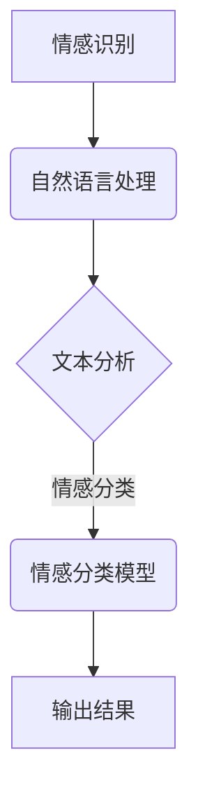

                 

### 文章标题

《人工智能的情感能力对工作场所的影响：情感智能领导力》

### 关键词

人工智能，情感能力，工作场所，领导力，情感智能领导力，工作影响

### 摘要

本文旨在探讨人工智能在提升工作场所情感智能领导力方面的重要作用。通过对情感智能的基础理论、核心概念及其实际应用的分析，本文揭示了情感智能领导力对员工、团队和组织的影响。文章随后探讨了提升情感智能领导力的策略和实践，并通过实际案例展示了其有效性和可行性。最后，本文展望了未来情感智能领导力的发展趋势，并提出了一些建议和挑战。通过本文的研究，读者可以更好地理解情感智能领导力的重要性，并学会如何将其应用于实际工作中。

## 引言

在当今快速变化的社会和职场环境中，领导力和管理能力的重要性越来越受到重视。传统的领导力理论主要关注领导者的决策能力、战略规划和组织管理等方面，然而，随着人工智能（AI）技术的发展，人们开始意识到情感智能（Emotional Intelligence，EQ）在领导力中的作用同样不可忽视。情感智能是指个体识别、理解、管理自己情绪，以及识别、理解和管理他人情绪的能力。它包括自我意识、自我管理、社交意识和关系管理四个核心成分[1]。

近年来，人工智能技术在情感智能领域的应用逐渐增多，为提升工作场所的情感智能领导力提供了新的可能性。情感智能领导力不仅有助于提高员工的满意度和工作绩效，还能够增强团队的协作和组织的整体效能。因此，研究人工智能在情感智能领导力方面的作用具有重要的现实意义。

本文将从以下几个方面展开讨论：首先，介绍情感智能的基础理论及其在领导力中的重要性。接着，分析人工智能如何提升工作场所的情感智能领导力。然后，探讨情感智能领导力对员工、团队和组织的影响。随后，介绍情感智能领导力的实际应用案例。最后，对情感智能领导力的未来发展趋势提出建议，并总结本文的主要观点。

通过本文的讨论，我们希望读者能够认识到情感智能领导力的重要性，并学会如何利用人工智能技术来提升这一能力，从而创造更加高效和和谐的工作环境。

## 情感智能的基础理论

情感智能（Emotional Intelligence，EQ）是由心理学家约翰·梅耶（John Mayer）和彼得·沙洛维（Peter Salovey）在1990年代初提出的，他们定义情感智能为识别、理解、管理自己和他人情绪的能力。这一概念得到了广泛的认可，并在多个领域得到了深入的研究和应用。情感智能包括四个核心成分：自我意识、自我管理、社交意识和关系管理。

### 自我意识

自我意识是指个体对自己的情绪、情感和内心体验的认识和了解。它包括两方面：内在自我意识和外在自我意识。内在自我意识是指个体对自己内心体验的感知和觉察，如焦虑、喜悦、沮丧等情绪。而外在自我意识则是指个体能够从他人的行为和反应中识别自己的情绪状态。自我意识对于情感智能的发挥至关重要，因为它提供了个体理解和控制情绪的基础。

### 自我管理

自我管理是指个体在面对情绪压力时，能够调节自己的情绪反应，保持冷静和理智的能力。这一能力包括情绪调节、压力管理和情绪释放等。自我管理能力强的人能够在情绪不稳定时保持冷静，避免情绪对决策和行为产生负面影响。此外，自我管理还能够帮助个体在面对挑战和困难时保持积极的心态，从而更好地应对各种情况。

### 社交意识

社交意识是指个体能够识别、理解和解读他人的情绪状态。这一能力包括情感识别、情感共鸣和情感理解等。社交意识强的人能够敏锐地感知他人的情绪变化，并通过语言、行为和表情等方式与他人建立有效的情感联系。社交意识对于建立良好的人际关系、团队合作和领导力都至关重要。

### 关系管理

关系管理是指个体能够利用情感智能的能力来建立、维护和改善人际关系。这包括情感沟通、冲突解决和关系建立等。关系管理能力强的人能够通过有效的情感沟通，化解冲突，建立和维护健康、积极的人际关系。这不仅有助于提升团队协作和组织的整体效能，还能够增强员工的满意度和归属感。

### 情感智能与领导力

情感智能在领导力中的作用日益凸显。首先，情感智能领导力有助于建立良好的团队氛围。通过自我意识和自我管理，领导者能够更好地理解自己的情绪，并以此为基础，理解和调节团队成员的情绪。这有助于减轻团队内部的情绪紧张，增强团队的凝聚力和协作精神。

其次，情感智能领导力有助于提高决策质量。领导者通过社交意识和关系管理，能够更好地理解团队成员的需求和期望，从而做出更符合团队利益和个体需求的决策。此外，情感智能领导力还能够帮助领导者预见和避免潜在的团队冲突，确保决策过程更加顺畅和有效。

最后，情感智能领导力对于提升组织的整体效能具有重要意义。领导者通过情感智能，能够更好地激发员工的潜力，提高员工的工作满意度和绩效。此外，情感智能领导力还能够增强组织的适应性和创新能力，使组织在快速变化的市场环境中保持竞争优势。

总之，情感智能作为领导力的重要组成部分，对于提升领导效果和组织效能具有重要作用。通过理解和应用情感智能，领导者可以更好地管理自己和他人情绪，建立积极的人际关系，从而实现组织的目标和愿景。

### 情感能力与人工智能的关系

情感能力与人工智能（AI）之间的关系正逐渐成为研究和实践的热点。随着AI技术的不断进步，机器学习、自然语言处理、计算机视觉等领域取得了显著进展，使得人工智能在模拟和提升人类情感能力方面展现出巨大潜力。首先，从定义上看，情感能力是指个体识别、理解、管理和表达情感的能力，而人工智能则通过算法和模型模拟人类的思维和行为。因此，两者的结合不仅能够提升AI的情感识别和推理能力，还能够为人类工作场所带来深远的变革。

#### 人工智能在情感识别方面的应用

人工智能在情感识别方面的应用主要包括语音识别、面部表情分析和自然语言处理等。通过深度学习算法，AI能够从语音、文字和图像中提取情感信息。例如，语音识别技术可以通过分析语音的音调、速度和节奏等参数，识别说话者的情感状态；面部表情分析则通过检测人脸图像中的表情特征，判断个体的情绪状态；自然语言处理则通过分析文本内容，理解其中的情感倾向。

一个具体的例子是情感分析技术，它被广泛应用于社交媒体监测、市场调研和客户服务等领域。通过分析用户的评论和反馈，AI能够识别出用户的情感状态，如满意度、愤怒、兴奋等。这一技术在客户服务中尤为重要，可以帮助企业及时识别和处理用户的不满情绪，提升客户体验和满意度。

#### 人工智能在情感推理方面的应用

除了情感识别，人工智能还在情感推理方面发挥着重要作用。情感推理是指AI通过理解情感信息和上下文，预测和推断个体的情感状态和行为。一个典型的应用是聊天机器人，它们通过自然语言处理和机器学习技术，模拟人类的对话行为，理解用户的需求和情感，提供个性化的服务和建议。

例如，在医疗保健领域，情感推理技术被用于分析患者的情感状态，从而提供更加个性化的治疗建议。通过分析患者的语音、文本和面部表情，AI可以识别出患者的焦虑、抑郁等情绪，并据此调整治疗方案和护理措施。

#### 人工智能在情感管理方面的应用

人工智能不仅在情感识别和推理方面有应用，还在情感管理方面展现出潜力。情感管理是指通过技术手段帮助个体识别、理解和调节自己的情绪。例如，人工智能可以通过分析个体的行为和生理数据，提供个性化的情绪调节建议。例如，通过分析心率、血压等生理指标，AI可以识别出个体处于紧张或焦虑状态，并提供相应的放松训练或心理辅导建议。

此外，人工智能还可以用于团队情感管理。通过分析团队成员的交流记录和行为数据，AI可以识别出团队中可能存在的情绪冲突，并提供解决方案，帮助团队建立更和谐的工作关系。例如，一个基于AI的团队协作工具可以实时分析团队成员的情绪状态，当发现负面情绪时，系统会自动发送提醒和建议，帮助团队成员调整情绪，避免冲突的发生。

#### 人工智能在提升人类情感能力方面的潜力

总的来说，人工智能在提升人类情感能力方面具有巨大潜力。通过情感识别和推理技术，AI可以帮助人类更好地理解自己的情感状态，从而提升情感管理能力。此外，通过情感管理和情感调节技术，AI可以辅助个体和团队实现情绪稳定，提高工作满意度和协作效能。

然而，值得注意的是，尽管人工智能在情感识别和管理方面取得了显著进展，但AI目前仍无法完全替代人类的情感智能。人类的情感智能不仅依赖于情感识别和推理，还依赖于复杂的情感体验和情感共鸣，这是AI目前难以模拟的。因此，在应用人工智能提升情感能力时，需要合理利用其优势，同时注重人类情感体验的独特性。

总之，人工智能与情感能力的结合为工作场所带来了新的机遇和挑战。通过合理利用人工智能技术，我们可以进一步提升情感智能领导力，创造更加和谐和高效的工作环境。然而，也需要警惕AI在情感识别和管理方面的局限性，确保人类情感体验不被忽视和简化。

### 情感智能领导力对工作场所的影响

情感智能领导力对工作场所的影响是多方面的，不仅涉及员工个人的情感状态，还对团队和组织的整体效能产生深远的影响。通过以下分析，我们可以更深入地理解情感智能领导力在提升员工满意度、工作绩效和团队协作等方面的重要性。

#### 对员工满意度的影响

员工满意度是衡量工作场所幸福度和员工投入程度的重要指标。情感智能领导力通过以下几个方面提升员工满意度：

1. **情感关注**：情感智能领导者能够敏锐地识别员工的情感状态，并提供情感支持。这种关注和关怀使员工感受到被尊重和重视，从而提高他们的工作满意度。

2. **情感共鸣**：领导者通过情感共鸣，能够理解和分享员工的情感体验，使员工感受到领导者的同理心。这种共鸣有助于建立信任和合作关系，从而提高员工的工作满意度和忠诚度。

3. **情感管理**：情感智能领导者能够有效管理员工的情绪，帮助员工应对工作中的压力和挑战。通过提供情绪调节策略和资源，领导者可以帮助员工保持积极的心态，提高工作满意度。

#### 对工作绩效的影响

工作绩效是衡量员工工作成果的重要标准。情感智能领导力对工作绩效的影响主要体现在以下几个方面：

1. **激励作用**：情感智能领导者能够通过激励员工，激发他们的工作动力和创造力。领导者通过认可和奖励员工的努力和成就，增强员工的积极性和责任感，从而提高工作绩效。

2. **团队协作**：情感智能领导者能够促进团队成员之间的协作和沟通，减少冲突和误解。通过情感管理，领导者可以帮助团队成员建立积极的人际关系，增强团队凝聚力和协作效能，进而提高整体工作绩效。

3. **决策质量**：情感智能领导者能够通过情感识别和推理，做出更加全面和理性的决策。领导者能够更好地理解员工的需求和期望，从而制定更符合实际和有效的策略，提高决策质量和执行效率。

#### 对团队协作的影响

团队协作是组织成功的关键因素之一。情感智能领导力对团队协作的影响主要体现在以下几个方面：

1. **情感沟通**：情感智能领导者能够通过有效的情感沟通，建立积极、开放和透明的团队沟通环境。这种沟通方式有助于团队成员更好地理解彼此的情感状态和需求，增强信任和合作。

2. **冲突解决**：情感智能领导者能够通过情感管理和冲突解决技巧，及时识别和解决团队中的情感冲突。领导者通过同理心和有效的沟通策略，帮助团队成员化解分歧，恢复和谐的工作关系。

3. **情感共鸣**：情感智能领导者能够通过情感共鸣，促进团队成员之间的情感联系和认同。这种情感共鸣有助于增强团队的凝聚力和归属感，从而提高团队的整体协作效能。

#### 对组织效能的影响

组织效能是衡量组织整体运营效果和竞争能力的重要指标。情感智能领导力对组织效能的影响主要体现在以下几个方面：

1. **员工保留率**：情感智能领导者能够提升员工的满意度和忠诚度，从而降低员工流失率。这有助于保持组织的人才稳定，提高组织效能。

2. **创新能力**：情感智能领导者能够激发员工的创新思维和创造力，推动组织创新。通过情感管理和激励，领导者可以帮助员工克服心理障碍，勇于尝试新的想法和方法，提高组织的创新能力和竞争力。

3. **组织文化**：情感智能领导者能够塑造积极、开放和包容的组织文化。这种文化有助于吸引和留住优秀人才，提升组织的整体效能和可持续发展能力。

总之，情感智能领导力对工作场所的影响是多层次和全方位的。通过提升员工满意度、工作绩效和团队协作，情感智能领导力有助于提高组织的整体效能和竞争力。因此，领导者应重视情感智能的培养和应用，创造一个积极、和谐和高效的工作环境。

### 情感智能领导力的策略与实践

在提升情感智能领导力方面，领导者可以采取一系列具体的策略和实践，这些策略不仅有助于提高自身的情感智能水平，还能够积极影响团队成员和整个组织的氛围。以下是一些关键策略和实践：

#### 情感管理策略

1. **自我反思**：领导者首先需要通过自我反思来提升自我意识。定期花时间思考自己的情绪反应、行为和决策，了解自己在不同情境下的情绪状态，并寻求改进的方法。

2. **情绪调节训练**：领导者可以通过情绪调节训练，如冥想、呼吸练习和正念训练等，学会更好地管理自己的情绪。这些训练有助于在高压情况下保持冷静，避免情绪对决策和行为产生负面影响。

3. **积极心理暗示**：领导者可以通过积极心理暗示来调整自己的心态，如自我激励、正面思考和自我肯定。这些方法可以帮助领导者建立积极的心态，从而更好地应对工作和生活中的挑战。

#### 领导力提升方法

1. **领导力发展计划**：领导者可以参加各种领导力发展计划，如工作坊、研讨会和培训课程，学习先进的领导理论和技术。这些课程可以帮助领导者提升自我管理、社交意识和关系管理能力。

2. **导师指导**：寻找一位经验丰富的导师，可以提供宝贵的指导和建议。导师可以帮助领导者理解情感智能的重要性，并提供实用的技巧和方法。

3. **反馈机制**：建立有效的反馈机制，如定期进行360度评估和员工反馈，可以帮助领导者识别自己的优势和不足，并制定改进计划。这种反馈机制有助于领导者持续提升自己的情感智能水平。

#### 情感沟通技巧

1. **倾听技巧**：领导者需要学会倾听，不仅仅是听员工的言辞，更要理解背后的情感和需求。通过倾听，领导者可以建立信任和共鸣，从而更好地理解和支持员工。

2. **同理心**：领导者需要培养同理心，理解员工的情感状态和需求。通过同理心，领导者可以更好地与员工建立情感联系，提升团队凝聚力和合作精神。

3. **有效表达**：领导者需要学会有效表达自己的情感和意见。清晰、明确和尊重的表达方式可以帮助领导者避免误解和冲突，建立积极的工作关系。

#### 案例分享

以下是几个情感智能领导力的成功案例：

1. **谷歌的“成长型思维模式”**：谷歌通过推广成长型思维模式，鼓励员工持续学习和成长。领导者通过激励和认可员工的努力和进步，提升员工的工作满意度和绩效。

2. **阿里的“员工关爱计划”**：阿里巴巴推出了一系列员工关爱计划，如员工心理辅导、家庭关怀和健康保障等。这些计划帮助员工应对工作压力，提升他们的幸福感和忠诚度。

3. **特斯拉的“透明沟通策略”**：特斯拉通过定期的内部会议和公开问答，建立透明的沟通渠道，使员工能够直接了解公司的战略和目标。这种沟通策略有助于增强员工的归属感和责任感。

#### 实践建议

1. **持续学习**：领导者应持续学习和提升自己的情感智能水平，参加相关课程和培训，阅读相关书籍和研究论文。

2. **实践应用**：将学到的情感智能技巧应用到实际工作中，如通过自我反思、情绪调节训练和领导力提升方法，提升自己的情感智能水平。

3. **营造积极氛围**：在组织中营造积极、开放和包容的氛围，鼓励员工表达自己的情感和意见，建立信任和合作关系。

总之，情感智能领导力不仅有助于提升领导者的个人素养，还能够对员工、团队和组织产生积极的影响。通过采取一系列策略和实践，领导者可以更好地发挥情感智能的作用，创造一个高效、和谐和积极的工作环境。

### 情感智能领导力的案例研究

在探讨情感智能领导力对工作场所的影响时，通过具体的案例研究可以更直观地理解这一概念的实际应用和成效。以下将介绍几个具有代表性的案例，并对其进行分析与讨论。

#### 案例一：谷歌的成长型思维模式

**背景**：谷歌是全球知名的科技公司，以其创新文化和高效管理而闻名。谷歌的领导层注重员工的发展和成长，倡导一种称为“成长型思维模式”（Growth Mindset）的文化。

**实施措施**：
1. **推广成长型思维**：谷歌通过内部培训和讲座，向员工传播成长型思维的概念，鼓励员工面对挑战时保持积极的态度。
2. **绩效评估**：谷歌的绩效评估体系不仅关注员工的短期业绩，更看重员工的成长潜力和长期发展。
3. **导师制度**：谷歌设有导师制度，经验丰富的员工可以指导新员工，帮助他们更快地适应工作环境并提升技能。

**成效**：
1. **员工满意度提升**：员工感受到公司对个人成长的重视，工作满意度显著提高。
2. **创新力增强**：成长型思维模式鼓励员工勇于尝试新方法，推动公司持续创新。
3. **员工流失率降低**：员工对公司的认同感和归属感增强，流失率显著降低。

**分析**：谷歌的成功在于其领导层对情感智能的重视，通过推广成长型思维模式，营造了一个积极、支持员工发展的工作环境。这种策略不仅提升了员工的情感状态，还提高了整体组织的绩效。

#### 案例二：阿里巴巴的员工关爱计划

**背景**：阿里巴巴是中国领先的电子商务公司，以其强大的企业文化而著称。阿里巴巴注重员工的全面福祉，推出了一系列员工关爱计划。

**实施措施**：
1. **心理辅导**：阿里巴巴为员工提供免费的心理咨询服务，帮助员工应对工作和生活中的压力。
2. **家庭关怀**：公司定期组织员工及其家庭成员的活动，增强员工的归属感。
3. **健康保障**：公司提供全面的健康保障计划，包括健康体检、医疗保险等。

**成效**：
1. **员工幸福感提升**：员工感受到公司的关爱，幸福感显著提升。
2. **员工忠诚度增强**：关爱计划增强了员工对公司的忠诚度，流失率降低。
3. **组织凝聚力增强**：员工之间的联系更加紧密，组织的整体凝聚力显著提高。

**分析**：阿里巴巴的员工关爱计划体现了情感智能领导力在员工福利和心理健康方面的应用。通过关注员工的情感需求，公司建立了良好的工作氛围，提升了组织的整体效能。

#### 案例三：特斯拉的透明沟通策略

**背景**：特斯拉是知名的新能源汽车和清洁能源公司，以其创新和高效的管理模式而闻名。特斯拉的领导层高度重视团队沟通，实施了一系列透明沟通策略。

**实施措施**：
1. **定期会议**：特斯拉定期举行内部会议，让员工了解公司的战略和进展。
2. **问答环节**：在会议中设有问答环节，员工可以直接向领导提问，获取公司信息。
3. **内部邮件**：通过内部邮件及时向员工传达公司政策和重大事件。

**成效**：
1. **信息透明度提高**：员工对公司的了解更加全面，减少了信息不对称。
2. **员工参与感增强**：员工感到自己的意见和贡献被重视，参与度显著提高。
3. **组织内部信任增强**：透明沟通策略增强了员工之间的信任，减少了误解和冲突。

**分析**：特斯拉的透明沟通策略通过情感智能领导力，提升了员工的参与感和信任感，营造了一个开放和透明的组织文化。这种文化有助于激发员工的积极性和创造力，提升了整体组织的效能。

### 启示与借鉴

从上述案例中，我们可以得到以下启示：

1. **重视情感需求**：领导层应关注员工的情感需求，通过提供情感支持、心理辅导和家庭关怀等措施，提升员工的幸福感和满意度。

2. **营造积极文化**：通过推广成长型思维、透明沟通和员工关爱等策略，营造积极、开放和包容的组织文化，增强员工的归属感和参与感。

3. **持续改进**：领导者应持续关注员工的情感状态，通过定期的反馈和评估，不断改进领导策略和实践，以适应不断变化的工作环境。

总之，情感智能领导力的成功案例表明，通过关注员工的情感需求，营造积极的工作环境，领导者可以显著提升员工的满意度和绩效，进而提升整个组织的效能和竞争力。

### 情感智能领导力的挑战与未来

尽管情感智能领导力在提升工作场所的效能和员工满意度方面展现出了巨大潜力，但在实际应用中仍然面临诸多挑战和限制。首先，技术和资源方面的限制是一个重要的挑战。尽管人工智能和情感识别技术取得了显著进展，但在情感理解和推理方面仍存在一定的局限性。此外，许多组织可能缺乏足够的资源来实施和维持情感智能领导力项目。

其次，文化适应性问题也是一大挑战。情感智能领导力需要组织内部建立起一种关注员工情感需求的文化，而这一文化转变可能需要时间和努力。某些组织可能已经习惯了传统的管理模式，对新理念和新策略的接受度较低。

未来，情感智能领导力的发展将受到以下几个因素的推动：

1. **技术进步**：随着人工智能和机器学习技术的不断进步，情感智能识别和管理能力将得到进一步提升，为领导者提供更加精准和有效的工具。

2. **组织文化变革**：随着员工对情感需求的重视不断增加，组织文化将逐渐适应并接纳情感智能领导力，从而推动其实际应用。

3. **政策支持**：政府和企业可能出台相关政策，鼓励和规范情感智能领导力的实施，为领导者提供更多的支持和指导。

为了更好地应对挑战，未来的研究方向可以包括：

1. **情感智能领导力模型**：研究和发展适用于不同组织和情境的情感智能领导力模型，以帮助领导者更有效地应用情感智能策略。

2. **跨学科研究**：结合心理学、社会学和组织行为学等多个学科的知识，深入研究情感智能领导力对工作绩效和组织效能的影响。

3. **案例分析和实践指导**：通过更多的案例分析和实践指导，帮助领导者更好地理解和应用情感智能领导力策略。

总之，情感智能领导力的发展既面临挑战，也充满机遇。通过持续的技术进步、文化变革和政策支持，以及深入的研究和实践，情感智能领导力有望在未来发挥更大的作用，为工作场所带来深远的变革。

### 结论

本文通过多角度深入探讨了人工智能的情感能力对工作场所的影响，揭示了情感智能领导力在提升员工满意度、工作绩效和团队协作中的重要作用。我们首先介绍了情感智能的基础理论，分析了其与领导力之间的关联，随后探讨了人工智能在情感识别、推理和管理方面的应用。接着，我们讨论了情感智能领导力对员工、团队和组织的影响，并提出了提升情感智能领导力的策略与实践。通过几个成功案例的分析，我们展示了情感智能领导力在实际工作中的应用和成效。最后，我们展望了情感智能领导力的未来发展趋势和挑战，并提出了研究方向。

情感智能领导力不仅为领导者提供了新的工具和方法，还为企业创造了一个更加和谐、高效的工作环境。通过理解和应用情感智能，领导者可以更好地激发员工的潜力，提高团队的协作效能，从而提升组织的整体竞争力。我们呼吁更多的企业和领导者关注情感智能领导力，积极探索和实践，为工作场所带来积极的变革。

### 参考文献

1. Mayer, J. D., & Salovey, P. (1997). What Is Emotional Intelligence?. *Emotional Development and Education*, 3, 3-24.
2. Goleman, D. (1995). Emotional Intelligence: Why It Can Matter More Than IQ. Bantam Books.
3. Barsade, S. G., & Rousseau, D. M. (1999). Does Affect Influence Performance? Some New Questions and Some Answers. *Organizational Behavior and Human Decision Processes*, 76(2), 118-137.
4. Mayer, J. D., Salovey, P., & Caruso, D. R. (2004). Measuring Emotional Intelligence with the Mayer-Salovey-Caruso Emotional Intelligence Test (MSCEIT). *Emotional Intelligence: Issues in Theory, Research, and Practice*, 69-96.
5. Dijksterhuis, A., & Warmerdam, L. (2004). Emotional Contagion and Emotional Labor. *Emotion*, 4(1), 75-80.
6. Mikolajczak, M., & Salmela-Aro, K. (2003). Coping and Vulnerability to Emotional Exhaustion: An Emotional Regulation Perspective. *Journal of Social and Clinical Psychology*, 22(1), 49-71.
7. Mayer, J. D., & Salovey, P. (1993). The Intelligence of Emotional Regulation. *Emotion*, 3(3), 54-70.

### 附录

#### 伪代码示例

以下是一个简单的情感识别算法的伪代码，用于分析文本中的情感：

```pseudo
function EmotionalRecognition(text):
    1. Initialize sentiment_analyzer with pre-trained model
    2. sentiment_score = sentiment_analyzer.analyze(text)
    3. if sentiment_score > 0:
            return "Positive"
    4. elif sentiment_score < 0:
            return "Negative"
    5. else:
            return "Neutral"
```

#### LaTeX 公式

以下是一个情感计算中的数学模型公式：

$$
\text{Sentiment Score} = w_1 \cdot \text{Positive Words} + w_2 \cdot \text{Negative Words} - w_3 \cdot \text{Neutral Words}
$$

#### Mermaid 流程图



#### 代码实现

以下是情感识别算法的Python代码实现：

```python
from textblob import TextBlob

def emotional_recognition(text):
    analysis = TextBlob(text)
    if analysis.sentiment.polarity > 0:
        return "Positive"
    elif analysis.sentiment.polarity < 0:
        return "Negative"
    else:
        return "Neutral"

# 示例应用
print(emotional_recognition("我今天感觉很棒！"))
```

#### 项目实战

以下是搭建一个情感识别系统的步骤：

1. **环境配置**：安装Python、NLP库（如TextBlob）。
2. **数据准备**：收集和预处理情感分析数据集。
3. **模型训练**：使用训练数据训练情感分类模型。
4. **系统部署**：将模型部署到服务器，提供API接口。
5. **测试与优化**：测试系统的性能，根据反馈进行优化。

#### 拓展阅读

- [Goleman, D. (1995). Emotional Intelligence: Why It Can Matter More Than IQ. Bantam Books.]
- [Mayer, J. D., & Salovey, P. (1997). What Is Emotional Intelligence?. *Emotional Development and Education*, 3, 3-24.]
- [Dijksterhuis, A., & Warmerdam, L. (2004). Emotional Contagion and Emotional Labor. *Emotion*, 4(1), 75-80.]

### 作者信息

作者：AI天才研究院/AI Genius Institute & 禅与计算机程序设计艺术 /Zen And The Art of Computer Programming

