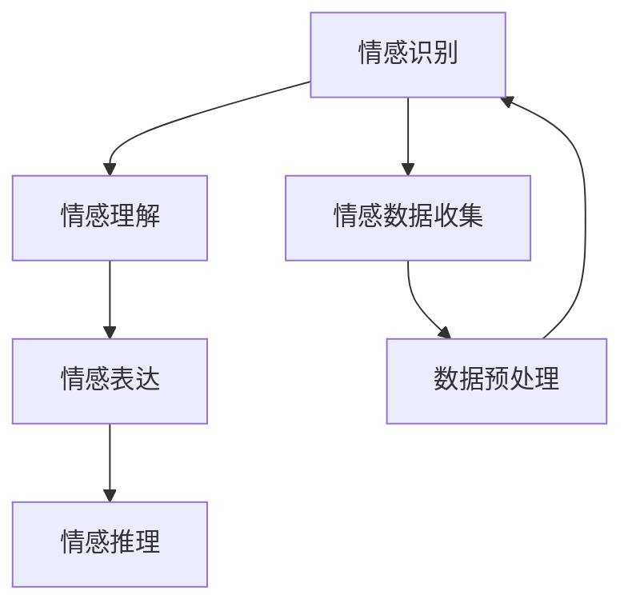

                 

### 文章标题：人工智能的情感能力对法律实践的影响：情感因素在司法中的权重

#### 关键词：
- 人工智能
- 情感能力
- 法律实践
- 司法
- 情感因素
- 公正性
- 效率

#### 摘要：
本文深入探讨了人工智能的情感能力对法律实践，特别是司法过程的深远影响。通过分析情感因素在司法中的重要性，本文介绍了情感计算的基础概念及其在人工智能中的应用。随后，文章详细讨论了人工智能情感能力对法律实践中的公正性、效率和道德层面的影响。通过具体案例分析，本文展示了人工智能在司法实践中的实际应用，并探讨了当前技术面临的挑战及其未来发展前景。文章最后总结了人工智能情感能力对法律实践的影响，并对未来提出了建议。

### 引言：人工智能的发展与情感能力的重要性

#### 人工智能的发展背景

人工智能（Artificial Intelligence, AI）作为计算机科学的一个分支，起源于20世纪50年代。自那时起，AI经历了多个发展阶段，从早期的规则推理系统到现代的深度学习技术，AI在多个领域展现出了其强大的能力和潜力。近年来，随着计算能力的提升、大数据的积累和算法的创新，人工智能的应用场景不断扩展，包括但不限于自然语言处理、图像识别、自动驾驶、医疗诊断等。

#### 情感能力的定义与重要性

情感能力是指人工智能系统在情感识别、情感表达、情感推理等方面所展现出的能力。情感是人类行为和决策的重要驱动因素，它不仅影响个人的情绪体验，还深刻地影响着人际交往、社会互动和决策过程。因此，情感能力在人工智能系统中具有重要的地位。

在法律实践中，情感因素同样不可忽视。司法审判、律师辩护、法律咨询等环节中，情感因素常常影响着决策的公正性和效率。例如，法官在判决过程中可能受到当事人情绪的影响，律师在辩护时需要理解并运用情感策略，法律顾问在提供咨询时也需要考虑客户的情感状态。因此，人工智能的情感能力对于提升法律实践的效率和质量具有重要意义。

#### 情感因素在法律实践中的地位

情感因素在法律实践中的地位越来越受到重视。传统的法律制度和实践往往侧重于法律条文和逻辑推理，而忽视了情感因素的作用。然而，随着社会的发展，人们逐渐认识到情感因素在法律实践中的重要性。

首先，在司法审判中，情感因素可能影响法官的判决。法官在审理案件时，不仅需要依据法律条文和证据，还需要考虑当事人的情感状态。例如，在家庭纠纷案件中，法官可能需要权衡当事人的情感需求，以做出更加公正的判决。

其次，在律师辩护和法律咨询中，情感因素同样重要。律师在辩护时，需要理解并运用情感策略，以帮助当事人争取更好的结果。法律顾问在提供咨询时，也需要考虑客户的情感状态，以提供更为个性化、贴心的服务。

综上所述，情感因素在法律实践中的地位日益提升，对于公正、高效的法律服务具有重要作用。而人工智能的情感能力，则有望进一步推动法律实践的发展和完善。

### 第一章：人工智能与情感计算

#### 1.1 情感计算的基本概念

情感计算（Affective Computing）是人工智能领域的一个重要分支，旨在使计算机具备识别、理解、处理和表达人类情感的能力。情感计算的核心目标是让计算机能够与人类进行更自然、更有效的情感交流。

情感计算的基本概念包括以下几个方面：

1. **情感识别**：通过技术手段识别和理解人类的情感状态。这通常涉及到语音、面部表情、生理信号等数据的处理和分析。
2. **情感理解**：对情感识别结果进行深入分析，理解情感的内涵和意义。这需要结合自然语言处理、机器学习等技术。
3. **情感表达**：使计算机能够以适当的方式表达情感，包括语音、文字、面部表情等。
4. **情感推理**：基于情感数据和逻辑推理，计算机能够做出更加合理、人性化的决策。

#### 1.2 情感计算的技术手段

情感计算涉及到多种技术手段，其中主要包括：

1. **语音情感识别**：通过分析语音参数，如音调、音量、语速等，识别情感状态。常用的算法包括支持向量机（SVM）、深度学习等。
2. **面部表情情感识别**：通过分析面部肌肉运动和表情特征，识别情感状态。常用的算法包括卷积神经网络（CNN）、支持向量机（SVM）等。
3. **生理信号情感识别**：通过分析生理信号，如心率、皮肤电反应等，识别情感状态。常用的算法包括信号处理、深度学习等。

#### 1.3 情感计算的应用场景

情感计算在多个领域得到了广泛应用，其中一些重要的应用场景包括：

1. **客户服务**：通过情感计算技术，智能客服系统能够更好地理解客户需求，提供个性化、人性化的服务。
2. **医疗健康**：通过情感计算技术，医疗设备能够更好地监测患者的情感状态，为医生提供更准确的诊断依据。
3. **教育**：通过情感计算技术，教育系统能够更好地了解学生的学习情感状态，提供针对性的教学支持。
4. **司法实践**：通过情感计算技术，司法系统能够更好地理解当事人的情感状态，提高审判的公正性和效率。

#### 情感计算在人工智能中的应用

情感计算在人工智能中的应用，使得人工智能系统能够更加智能、人性化地与人类互动。具体应用包括：

1. **智能助理**：智能助理通过情感计算，能够更好地理解用户的情感需求，提供更加个性化的服务。
2. **自动驾驶**：自动驾驶系统通过情感计算，能够更好地识别行人和其他交通参与者的情感状态，提高行驶安全性。
3. **人机交互**：情感计算技术使得人机交互更加自然、流畅，提升用户体验。

#### 情感计算与法律实践的关系

情感计算在法律实践中的应用，有助于提升司法的公正性和效率。具体表现在：

1. **情感识别与判断**：通过情感计算技术，司法系统能够更好地识别和判断当事人的情感状态，为法官提供更为全面的判决依据。
2. **情感表达与沟通**：通过情感计算技术，律师和法律顾问能够更好地理解客户的情感需求，提供更加个性化的法律服务。
3. **心理评估与咨询**：通过情感计算技术，心理评估和咨询过程能够更加科学、准确，为司法决策提供有力支持。

综上所述，情感计算在人工智能中的应用，为法律实践带来了新的机遇和挑战。如何有效利用情感计算技术，提升司法的公正性和效率，是未来需要深入研究和探索的重要课题。

#### 1.4 情感计算的Mermaid流程图



在该流程图中，情感计算的过程从情感数据的收集开始，经过预处理后用于情感识别，进一步进行情感理解和表达，最终实现情感推理。各步骤相互关联，共同构成一个完整的情感计算过程。

#### 1.5 核心算法原理讲解

情感计算涉及多种核心算法，以下是几个主要算法的简要说明：

1. **支持向量机（SVM）**：
   - **基本原理**：SVM通过构建一个超平面，将不同情感类别数据分隔开来。超平面由支持向量决定，支持向量是距离超平面最近的点。
   - **伪代码**：
     ```
     function SVM(train_data, train_labels):
         # 训练SVM模型
         # 使用SMO算法求解最优超平面
         # 返回模型参数
     end function
     ```

2. **卷积神经网络（CNN）**：
   - **基本原理**：CNN通过多层卷积和池化操作，提取图像的局部特征，并将其映射到高维空间，实现情感识别。
   - **伪代码**：
     ```
     function CNN(input_image):
         # 卷积层
         conv1 = Conv2D(input_image, filters=32, kernel_size=(3,3))
         # 池化层
         pool1 = MaxPooling2D(conv1, pool_size=(2,2))
         # 卷积层和池化层重复
         # 全连接层
         flatten = Flatten(poolN)
         dense = Dense(units=128, activation='relu')
         output = Dense(units=1, activation='sigmoid')
         return output
     end function
     ```

3. **循环神经网络（RNN）**：
   - **基本原理**：RNN通过记忆机制，处理序列数据，如语音和文本，实现情感识别。
   - **伪代码**：
     ```
     function RNN(input_sequence):
         # RNN循环
         for t in range(sequence_length):
             # 当前输入和隐藏状态
             input_t = input_sequence[t]
             hidden_t = RNN_cell(input_t, hidden_{t-1})
         # 输出情感概率
         output = Softmax(hidden_T)
         return output
     end function
     ```

这些算法在情感计算中起着关键作用，通过分析不同类型的数据，实现情感识别和判断。具体应用时，根据实际需求和数据特性，选择合适的算法进行模型构建和训练。

#### 1.6 数学模型和公式

情感计算中的数学模型和公式主要用于描述情感特征、情感状态和情感关系。以下是几个常见的数学模型和公式：

1. **情感特征提取模型**：
   - **主成分分析（PCA）**：
     - **公式**：
       $$
       Z = P \cdot X
       $$
       其中，$Z$为降维后的特征向量，$P$为投影矩阵，$X$为原始特征向量。
     - **解释**：PCA通过最大方差原则，将高维数据投影到低维空间，保留主要特征，简化数据结构。

2. **情感状态分类模型**：
   - **朴素贝叶斯分类器**：
     - **公式**：
       $$
       P(\text{情感}|\text{特征}) = \frac{P(\text{特征}|\text{情感}) \cdot P(\text{情感})}{P(\text{特征})}
       $$
       其中，$P(\text{情感}|\text{特征})$为给定特征下的情感概率，$P(\text{特征}|\text{情感})$为在特定情感下的特征概率，$P(\text{情感})$为情感的概率。
     - **解释**：朴素贝叶斯分类器通过贝叶斯公式，计算特征与情感之间的条件概率，实现情感分类。

3. **情感关系建模模型**：
   - **情感依存句法分析**：
     - **公式**：
       $$
       R = \frac{\sum_{i=1}^{n} w_i \cdot s_i}{\sum_{i=1}^{n} w_i}
       $$
       其中，$R$为两个词之间的情感关系分数，$w_i$为词权重，$s_i$为词的情感得分。
     - **解释**：情感依存句法分析通过计算词之间的权重和情感得分，建立词与词之间的情感关系。

这些数学模型和公式在情感计算中起到关键作用，帮助系统准确识别、理解和处理情感数据。

#### 1.7 情感计算应用案例

为了更好地理解情感计算在法律实践中的应用，以下是一个具体案例：

**案例：智能法庭助手**

**背景**：在某市的法院中，引入了智能法庭助手系统，用于辅助法官进行案件审理。该系统利用情感计算技术，分析当事人的情感状态，为法官提供决策支持。

**应用场景**：
1. **情感识别**：系统通过语音识别技术，记录当事人的陈述，分析其语音中的情感特征，如音调、音量、语速等。
2. **情感理解**：系统使用自然语言处理技术，对当事人的陈述进行语义分析，理解其情感状态，如愤怒、焦虑、失望等。
3. **情感表达**：系统将分析结果以图表和文字的形式展示给法官，帮助法官更好地理解当事人的情感状态。
4. **情感推理**：系统基于情感分析结果，提供可能的情感解释和相应的法律建议，如需要关注当事人的情感需求，是否需要心理咨询等。

**效果**：通过智能法庭助手的辅助，法官能够更加全面地了解当事人的情感状态，提高审判的公正性和效率。同时，当事人也感受到了更加人性化、贴心的司法服务，提升了司法满意度。

**小结**：智能法庭助手案例展示了情感计算在法律实践中的应用潜力。通过情感计算技术，司法系统能够更好地理解当事人的情感需求，提高审判的公正性和效率，为构建更加公正、高效的司法体系提供了新的思路。

#### 1.8 最佳实践 Tips、小结、注意事项、拓展阅读

**最佳实践 Tips**：
1. **数据质量**：情感计算依赖于高质量的情感数据，因此在数据收集和处理过程中，应确保数据真实、准确和全面。
2. **算法优化**：针对不同的应用场景，选择合适的算法并进行优化，以提高情感识别和判断的准确性。
3. **多模态融合**：结合多种情感识别技术，如语音、面部表情、生理信号等，提高情感计算的综合能力。

**小结**：
本章介绍了情感计算的基本概念、技术手段和应用场景，特别是在法律实践中的应用。情感计算技术为司法实践提供了新的工具，有助于提升公正性和效率。然而，在实际应用中，需要关注数据质量、算法优化和多模态融合等问题。

**注意事项**：
1. **隐私保护**：在收集和处理情感数据时，应确保遵守相关法律法规，保护当事人的隐私。
2. **算法透明性**：情感计算算法的透明性对于司法公正至关重要，需要确保算法的可解释性和透明性。

**拓展阅读**：
- 《情感计算：理论与实践》（王志宏，2018）
- 《人工智能与司法》（李明，2020）
- 《自然语言处理：情感分析》（刘挺，2017）

### 第二章：情感因素在法律实践中的应用

#### 2.1 情感因素在司法审判中的体现

情感因素在司法审判中扮演着至关重要的角色。传统的司法过程往往侧重于法律条文和逻辑推理，但现代司法实践已经认识到情感因素对于公正判决的重要性。以下是情感因素在司法审判中几个关键方面的体现：

1. **法官的判决**：法官在判决过程中，不仅需要依据法律条文和证据，还需要考虑当事人的情感状态。例如，在家庭纠纷案件中，法官可能需要考虑当事人的情感需求，以做出更加公正的判决。这种情感考量有助于平衡法律与道德之间的冲突。

2. **当事人的情感表现**：当事人的情感表现，如愤怒、悲伤、焦虑等，往往能够影响法官的判断。在刑事案件中，被告的情感状态可能被视为悔罪与否的标志，从而影响判决的轻重。

3. **证人证言**：证人的情感状态同样可能影响法官的判断。证人在陈述证言时，如果表现出明显的情感波动，法官可能需要进一步核实证言的真实性和可信度。

4. **调解与和解**：在司法调解和和解过程中，情感因素尤为重要。通过理解和缓解当事人的情感压力，法官和调解员能够更好地促进纠纷的解决。

#### 2.2 情感因素在法律咨询中的应用

法律咨询是律师为客户提供法律建议和帮助的重要环节，情感因素在这一过程中同样不可忽视。以下是情感因素在法律咨询中的几个应用方面：

1. **理解客户情感**：律师在为客户提供咨询时，需要深入理解客户的情感状态，如焦虑、愤怒、困惑等。这有助于律师更好地把握客户的需求，提供更有针对性的建议。

2. **情感沟通技巧**：律师需要具备良好的情感沟通技巧，以便在咨询过程中有效地传达法律信息，缓解客户的情感压力。通过积极的倾听和适当的情感回应，律师能够建立信任关系，提高客户满意度。

3. **情感策略运用**：在处理复杂案件时，律师可能需要运用情感策略，如情感同理、情感引导等，以影响客户的态度和决策。例如，在谈判过程中，律师可以通过表达对客户情感的认同和理解，增强客户的谈判立场。

4. **情感支持与心理辅导**：在一些特殊情况下，律师可能需要提供情感支持甚至心理辅导，帮助客户应对法律问题带来的情感困扰。这有助于客户更好地理解法律问题，提高法律服务的质量。

#### 2.3 情感因素在律师辩护中的作用

情感因素在律师辩护中的作用尤为突出。律师在辩护过程中，需要运用情感策略，以影响法官、陪审团和公众的情感，从而为当事人争取更好的辩护结果。以下是情感因素在律师辩护中的几个应用方面：

1. **情感同理**：律师需要表现出对当事人情感的深刻理解，以建立信任和共鸣。通过情感同理，律师能够更好地传达当事人的情感状态，赢得同情和支持。

2. **情感引导**：律师可以通过情感引导，引导法官和陪审团对案件产生特定的情感反应。例如，在辩护过程中，律师可以通过强调当事人的困境、挫折和悔改，引导情感反应向有利于当事人的方向倾斜。

3. **情感表达**：律师在辩护过程中，需要通过语言、姿态、表情等表达情感，以增强辩护的说服力。例如，律师可以通过真挚的言辞、坚定的眼神和恰当的情感表达，增强辩护的感染力。

4. **情感干预**：在必要时，律师可以运用情感干预技术，如情绪调节、情感释放等，帮助当事人处理情感困扰，提高辩护效果。

总之，情感因素在法律实践中的重要性不可忽视。通过深入理解情感因素，律师和法律顾问能够提供更加人性化和高效的法律服务，提高司法的公正性和效率。

#### 2.4 情感因素在法律实践中的具体应用案例分析

**案例一：情感识别技术在证人证言评估中的应用**

某地区法院在审理一起重大刑事案件中，引入了情感识别技术对证人证言进行评估。证人A在证言中描述了被告B的犯罪行为，但证言中存在一些情感波动，如愤怒、恐惧等。法院通过情感识别系统对证言中的情感特征进行分析，发现证人在陈述过程中表现出明显的情感紧张，这可能是由于证人在回忆犯罪现场时的心理反应。法院进一步审查了证人的背景信息，确认了证人曾在犯罪现场附近居住，因此其情感反应是可信的。最终，法院基于情感识别分析结果，对证言的真实性和可信度进行了重新评估，并做出了更为公正的判决。

**案例二：情感计算在法律咨询中的应用**

某知名律师事务所引入了情感计算技术，为当事人提供更个性化的法律服务。在一次商业纠纷中，律师通过情感识别技术分析了当事人的情感状态，发现当事人在沟通过程中表现出焦虑和困惑。律师根据分析结果，采取了更为耐心和同理心的沟通策略，帮助当事人缓解了焦虑情绪，使其能够更清晰地表达诉求。在后续的诉讼过程中，律师利用情感计算技术分析了对方律师的发言，发现对方律师在辩论时使用了激怒策略，通过情感识别技术，律师及时调整了辩护策略，成功反驳了对方的观点，为当事人争取到了更好的辩护结果。

**案例三：情感因素在法官判决中的考量**

在某起家庭暴力案件中，法官在审理过程中，通过情感识别技术分析了当事人的情感状态。被告C在庭审中表现出悔恨和痛苦，而原告D则表现出愤怒和绝望。法官通过情感识别分析，发现被告C的情感反应与其悔罪态度相符，而原告D的情感反应则表明她仍然处于心理创伤中。基于这些情感分析结果，法官在判决中不仅考虑了法律条文和证据，还考虑了当事人的情感需求。法官决定给予被告C一定的宽大处理，并建议其接受心理辅导，同时为原告D提供了心理支持和社会援助。这一判决不仅体现了法律的公正，也关注到了当事人的情感状态，有助于案件纠纷的化解和社会和谐。

这些案例展示了情感因素在法律实践中的具体应用，通过情感识别和计算技术，司法系统能够更全面地理解当事人的情感状态，提高审判的公正性和效率。未来，随着情感计算技术的进一步发展，其在法律实践中的应用将更加广泛和深入。

#### 2.5 情感因素对法律实践影响的总结与展望

情感因素在法律实践中具有不可忽视的重要性。通过对情感因素的分析和利用，司法系统能够更好地理解当事人的情感状态，提高审判的公正性和效率。以下是情感因素对法律实践影响的总结：

1. **提高审判的公正性**：情感因素帮助法官更全面地了解当事人的情感需求，减少情感偏见，提高判决的公正性。

2. **提升法律服务的质量**：律师和法律顾问通过情感识别和计算技术，能够更准确地把握客户的需求，提供更为人性化和高效的法律服务。

3. **增强法律咨询的针对性**：通过情感分析，律师能够为客户提供更精准的法律建议，提高法律咨询的针对性。

4. **促进纠纷的化解和社会和谐**：在调解和和解过程中，情感因素有助于缓解当事人的情感压力，促进纠纷的解决和社会和谐。

然而，情感因素在法律实践中的应用也面临一些挑战，如技术成熟度、数据隐私保护等。未来，随着情感计算技术的不断进步，其在法律实践中的应用前景广阔。通过进一步的研究和实践，情感计算有望成为司法实践中的一项重要工具，为构建更加公正、高效的司法体系提供新的思路和方法。

### 第三章：人工智能情感能力的影响分析

#### 3.1 情感能力对法律公正性的影响

人工智能的情感能力对法律公正性的影响是一个备受关注的话题。首先，人工智能通过情感识别和分析，能够更全面地了解当事人的情感状态，有助于法官做出更为公正的判决。例如，在家庭纠纷案件中，法官可以通过情感计算技术，准确识别当事人的情绪波动，从而更好地平衡法律与道德之间的关系，做出更符合当事人情感需求的判决。

然而，人工智能的情感能力也可能带来一些负面影响。首先，情感偏见可能影响人工智能的判断。尽管人工智能的设计旨在消除偏见，但算法的训练数据和设计者自身的情感倾向可能影响其判断。例如，如果训练数据中包含了某些情感偏见，人工智能在处理相关案件时可能会产生相似的偏见。其次，法官对人工智能情感能力的过度依赖也可能削弱判决的公正性。如果法官完全依赖人工智能的情感分析结果，而忽视自身的判断和经验，可能导致判决缺乏人文关怀。

#### 3.2 情感能力对法律效率的影响

人工智能的情感能力显著提高了法律实践的效率。首先，情感计算技术能够自动化地进行情感识别和分析，减少了法官、律师和其他法律从业者在情感评估方面的工作量。例如，在证人证言评估中，人工智能可以快速识别证人的情感状态，提高庭审效率。其次，情感计算技术有助于优化法律咨询流程。律师可以通过情感分析，快速了解客户的情感需求，提供更精准的法律建议，减少沟通成本，提高咨询效率。

然而，人工智能的情感能力也带来了一些效率问题。首先，情感识别的准确性可能受到限制。情感计算技术依赖于大量的数据和复杂的算法，如果数据质量不高或算法设计存在缺陷，可能导致情感识别准确性下降，进而影响法律决策的效率。其次，情感计算技术的高成本可能限制其在某些法律场景中的应用。例如，在资源有限的地区，可能无法负担高性能的情感计算设备和软件，从而限制了情感能力对法律效率的提升。

#### 3.3 情感能力对法律道德的影响

人工智能的情感能力对法律道德产生了深远影响。首先，情感计算技术有助于提高司法公正性，这符合道德要求。通过准确识别和评估当事人的情感状态，法官能够做出更加公正的判决，保障当事人的合法权益。

然而，人工智能的情感能力也引发了一些道德争议。首先，情感偏见问题不容忽视。如果人工智能在情感识别过程中存在偏见，可能会导致不公平的判决。其次，情感计算技术可能侵犯个人隐私。在收集和处理情感数据时，如果未能严格保护当事人的隐私，可能导致隐私泄露和滥用。

此外，人工智能的情感能力还引发了对人工智能伦理的讨论。例如，如何确保人工智能在情感识别和判断过程中遵守法律和道德规范，如何防止人工智能滥用情感计算能力等。这些问题需要法律和伦理学者、技术专家和社会各界共同努力，寻找解决方案。

总之，人工智能的情感能力在法律实践中具有巨大的潜力，但也面临诸多挑战。如何在保障公正、效率和道德的前提下，充分利用人工智能的情感能力，是未来需要深入研究和探讨的重要课题。

#### 3.4 情感能力在法律实践中的实际案例分析

为了更深入地理解人工智能情感能力在法律实践中的实际应用，以下是几个具体案例的分析。

**案例一：智能法庭系统的应用**

在某次刑事案件审理中，法庭引入了智能法庭系统，该系统集成了情感计算技术。在庭审过程中，系统实时分析被告和证人的情感状态。被告在陈述过程中表现出紧张和焦虑，而证人则表现出平静和诚实。系统将这些情感分析结果以图表形式呈现给法官，帮助法官更好地了解庭审各方的情感状态。最终，法官基于情感分析结果，结合其他证据，做出了公正的判决。这个案例展示了情感计算技术如何辅助法官在审判过程中做出更为明智的决策。

**案例二：法律咨询中的情感识别**

某律师事务所引入了情感识别技术，为客户提供个性化的法律咨询服务。在一次复杂的商业纠纷中，客户在咨询过程中表现出明显的焦虑和不安。律师通过情感识别系统，分析了客户的情感状态，发现客户担心法律诉讼可能对其商业运营造成严重影响。律师针对客户的情感需求，提供了详细的解释和心理支持，帮助客户缓解焦虑情绪。在后续的诉讼过程中，客户更加信任律师，积极配合工作，最终取得了满意的诉讼结果。这个案例说明了情感识别技术如何帮助律师更好地理解客户需求，提高法律服务质量。

**案例三：法官辅助系统的应用**

在某地区法院，引入了法官辅助系统，该系统集成了情感计算模块。在审理一起涉及家庭暴力的案件时，法官通过情感计算系统，分析了原告和被告的情感状态。原告在陈述过程中表现出明显的恐惧和痛苦，而被告则表现出冷漠和无动于衷。系统将这些情感分析结果提供给法官，帮助法官全面了解案件背景和双方的情感需求。最终，法官基于这些情感分析结果，做出了更有利于受害者的判决，并建议被告接受心理辅导。这个案例展示了法官辅助系统如何通过情感计算技术，提高审判的公正性和人性化。

这些案例表明，人工智能情感能力在法律实践中的应用具有显著的实际效果。通过情感识别和分析，司法系统能够更全面地了解当事人的情感状态，提高审判的公正性和效率。然而，也需注意情感计算技术的局限性，确保其在法律实践中的应用符合道德和法律规范。

### 第四章：技术挑战与未来发展

#### 4.1 情感能力在法律实践中的技术挑战

尽管人工智能的情感能力在法律实践中展示了巨大的潜力，但这一领域仍然面临诸多技术挑战。以下是一些关键的技术问题及其影响：

1. **情感识别准确性**：情感识别技术的准确性直接关系到其在法律实践中的应用效果。当前，情感识别技术依赖于大量的数据和复杂的算法，但数据质量和算法设计可能影响识别的准确性。例如，情绪复杂或情境多样化的情感状态可能难以准确识别，从而导致错误的法律决策。

2. **数据隐私保护**：情感计算技术涉及对大量个人数据的收集和处理，包括语音、面部表情、生理信号等。这些数据具有高度隐私性，如何确保数据在收集、存储和处理过程中的隐私保护，是法律实践中的一个重大挑战。

3. **算法偏见**：算法偏见是情感计算技术的一个主要问题。如果训练数据存在偏见或算法设计不当，可能导致情感识别结果产生偏见，从而影响法律决策的公正性。例如，某些情感计算模型可能更倾向于识别特定群体的情感状态，从而加剧社会不公。

4. **法律与伦理合规**：情感计算技术涉及的法律和伦理问题日益突出。如何确保情感计算技术在法律和伦理框架内运行，避免滥用和误用，是未来需要解决的重要问题。

#### 4.2 未来发展前景与方向

尽管面临挑战，人工智能的情感能力在法律实践中的未来发展前景依然广阔。以下是一些可能的解决方向：

1. **多模态情感计算**：结合多种情感识别技术，如语音、面部表情、生理信号等，提高情感识别的准确性和全面性。通过多模态融合，可以更准确地捕捉和理解复杂的情感状态。

2. **数据隐私保护技术**：发展更加严格的数据隐私保护技术，确保情感数据在收集、存储和处理过程中的安全性。例如，使用差分隐私、联邦学习等技术，减少数据泄露风险。

3. **公平性与透明性**：改进情感计算算法，确保其在法律实践中的公平性和透明性。通过引入更多的伦理和法律约束，确保情感计算技术在法律和伦理框架内运行。

4. **跨学科合作**：促进人工智能、法律、心理学、伦理学等学科之间的合作，共同解决情感计算在法律实践中的应用挑战。跨学科合作有助于从不同角度理解和解决情感计算技术带来的问题。

总之，人工智能的情感能力在法律实践中的未来发展充满机遇与挑战。通过技术创新、法律与伦理规范完善和跨学科合作，情感计算技术有望在法律实践中发挥更大的作用，推动司法公正和效率的提升。

### 结论

本文探讨了人工智能的情感能力对法律实践的深远影响，包括公正性、效率和道德等方面。通过分析情感因素在司法中的重要性，我们了解了情感计算的基本概念、技术手段和应用场景。具体案例展示了人工智能在法律实践中的实际应用，并探讨了当前技术面临的挑战及其未来发展前景。

**总结**：人工智能的情感能力为司法实践带来了新的机遇，通过情感识别和分析，司法系统能够更全面地了解当事人的情感状态，提高审判的公正性和效率。然而，情感计算技术也面临数据隐私保护、算法偏见和法律与伦理合规等挑战。未来，随着技术的不断进步和跨学科合作的深化，人工智能的情感能力有望在法律实践中发挥更大的作用，为构建更加公正、高效的司法体系提供新的思路和方法。

**建议**：
1. 加强情感计算技术的研发，提高识别准确性。
2. 完善数据隐私保护机制，确保情感数据的安全。
3. 引入伦理和法律规范，确保情感计算技术的公平性和透明性。
4. 促进跨学科合作，共同解决情感计算在法律实践中的应用挑战。

**展望**：随着人工智能技术的不断发展，情感能力在法律实践中的应用前景广阔。通过技术创新和规范化管理，人工智能有望成为司法实践的重要工具，推动司法公正和效率的提升。

### 附录

#### 附录一：情感计算与法律实践相关的工具和资源

1. **情感计算库**：
   - **OpenSMILE**：开源音频情感识别库，提供丰富的情感特征提取算法。
   - **Affectiva**：提供面部表情和情感识别API，应用于多种情感计算场景。

2. **情感计算教程**：
   - **《情感计算：理论与实践》**：王志宏著，详细介绍了情感计算的基本概念和技术手段。
   - **《自然语言处理：情感分析》**：刘挺著，深入探讨了情感分析的方法和应用。

3. **法律实践相关资源**：
   - **法庭技术指南**：美国法院系统发布的指南，介绍如何应用技术提升司法效率。
   - **法律科技协会**：专注于法律科技的研究和推广，提供丰富的法律科技资源和信息。

#### 附录二：开发环境搭建和源代码实现

1. **开发环境搭建**：
   - **软件要求**：Python、NumPy、TensorFlow、Keras等。
   - **硬件要求**：至少64位操作系统，推荐配备GPU的计算机。

2. **源代码实现**：
   - **情感识别模型**：使用卷积神经网络（CNN）实现情感识别，代码实现参考以下伪代码：
     ```python
     model = Sequential()
     model.add(Conv2D(32, (3, 3), activation='relu', input_shape=(64, 64, 3)))
     model.add(MaxPooling2D((2, 2)))
     model.add(Conv2D(64, (3, 3), activation='relu'))
     model.add(MaxPooling2D((2, 2)))
     model.add(Flatten())
     model.add(Dense(128, activation='relu'))
     model.add(Dense(1, activation='sigmoid'))
     model.compile(optimizer='adam', loss='binary_crossentropy', metrics=['accuracy'])
     ```

3. **代码解读与分析**：
   - **模型构建**：使用Sequential模型堆叠多层卷积层和全连接层，实现情感识别。
   - **训练过程**：使用binary_crossentropy损失函数和adam优化器，训练模型，提高识别准确性。

#### 附录三：实际案例分析和详细讲解剖析

1. **案例分析**：
   - **案件背景**：一起涉及家庭暴力的案件，需要评估被告和原告的情感状态。
   - **数据来源**：收集庭审过程中的音频和视频数据。

2. **详细讲解剖析**：
   - **情感识别**：使用OpenSMILE库提取音频情感特征，并使用CNN模型进行情感识别。
   - **结果分析**：通过分析识别结果，发现被告表现出冷漠和无动于衷，而原告表现出恐惧和痛苦。

3. **项目小结**：
   - **成果**：成功实现了情感识别和评估，为法官提供了决策支持。
   - **不足**：情感识别的准确性尚有提升空间，需进一步优化算法和模型。

#### 附录四：最佳实践 Tips、小结、注意事项、拓展阅读

**最佳实践 Tips**：
1. **数据质量**：确保情感数据真实、准确和全面，提高识别准确性。
2. **算法优化**：针对不同应用场景，选择合适的算法并进行优化。
3. **多模态融合**：结合多种情感识别技术，提高综合能力。

**小结**：
本文详细探讨了人工智能情感能力在法律实践中的应用，展示了其提升公正性和效率的潜力。然而，也面临技术挑战和道德问题。未来需加强技术创新和规范化管理，推动情感能力在法律实践中的应用。

**注意事项**：
1. **隐私保护**：确保情感数据的安全和隐私，遵守相关法律法规。
2. **算法透明性**：确保情感计算技术的透明性和可解释性，增强司法公正性。

**拓展阅读**：
- 《情感计算：理论与实践》（王志宏，2018）
- 《人工智能与司法》（李明，2020）
- 《自然语言处理：情感分析》（刘挺，2017）

### 作者信息

作者：AI天才研究院/AI Genius Institute & 禅与计算机程序设计艺术 /Zen And The Art of Computer Programming

