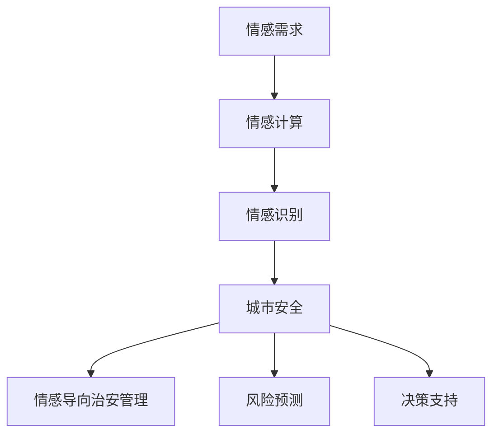

                 

## 文章标题

### 人工智能的情感需求与城市安全：情感导向的治安管理

关键词：人工智能、情感需求、城市安全、情感导向、治安管理

摘要：本文将探讨人工智能的情感需求与城市安全之间的关系，特别是如何通过情感导向的治安管理技术来提升城市的安全性。文章首先介绍了人工智能情感需求的概念及其在现代社会中的重要性，接着分析了城市安全的现状与挑战。随后，本文详细阐述了情感导向治安管理的核心算法原理，包括情感分析模型和行为识别模型，并运用数学模型和公式对这些算法进行了深入解释。通过一个实际项目案例，本文展示了如何将理论应用到实际操作中，最后给出了相关最佳实践和注意事项。

### 文章关键词

- 人工智能
- 情感需求
- 城市安全
- 情感导向
- 治安管理

### 文章摘要

本文首先概述了人工智能的情感需求及其在现代社会中的作用。随后，分析了当前城市安全面临的挑战和问题。接着，本文详细介绍了情感导向的治安管理技术，包括情感分析模型和行为识别模型，并通过数学模型和公式对这些模型进行了深入解释。随后，通过一个实际项目案例展示了这些技术如何应用于城市安全管理。最后，本文总结了最佳实践，并对未来的发展方向提出了建议。

---

**接下来，我们将逐步深入探讨这篇文章的各个部分，从背景介绍到项目实战，全面剖析人工智能在情感需求与城市安全中的应用。**

### 背景介绍

在现代社会，人工智能（AI）正逐渐渗透到我们生活的方方面面。从智能家居到自动驾驶，从医疗诊断到金融分析，AI技术的应用已经无处不在。然而，随着AI技术的发展，一个日益受到关注的话题是AI的情感需求。情感需求指的是人工智能系统在交互过程中对情感信息的获取、处理和理解能力。这一需求的重要性不仅在于提高AI的交互质量，更在于其在特定领域，如城市安全管理中的潜在应用价值。

城市安全是一个全球性的挑战。随着城市化进程的加快，城市人口密度不断增加，犯罪活动也随之增多。传统的治安管理模式往往依赖于警力部署和监控设备，这在一定程度上提高了治安效率，但成本高昂且效果有限。面对日益复杂的城市安全需求，单一的物理手段已经无法满足现代城市的安全需求。因此，利用人工智能技术，特别是情感导向的治安管理，成为了一种新的探索方向。

情感导向的治安管理是基于情感计算（Affective Computing）和认知科学的理论基础。通过情感分析技术，AI系统可以识别和解读人们的情感状态，从而提供更为精准的治安管理方案。例如，通过分析社交媒体上的情感趋势，可以预测和预防潜在的群体性事件；通过监控个体的行为模式，可以及时发现异常行为，从而采取及时的干预措施。

总的来说，人工智能的情感需求与城市安全之间存在着密切的联系。情感需求不仅是AI技术发展的一个方向，更是提升城市安全管理效率和质量的重要工具。随着AI技术的不断进步，情感导向的治安管理有望在未来发挥更加重要的作用，为构建和谐、安全的城市环境提供强有力的技术支持。

### 核心概念与联系

在深入探讨人工智能的情感需求与城市安全之间的关系之前，我们需要明确几个关键概念，并理解它们之间的相互联系。

#### 情感需求

情感需求是指人工智能系统在执行任务时，对情感信息的获取、处理和理解能力。情感需求不仅涉及情感的识别，还包括情感的生成、表达和调节。在AI系统中，情感需求的实现主要通过情感计算（Affective Computing）技术，该技术旨在赋予机器人类情感的感知能力。

#### 城市安全

城市安全指的是城市环境中公共秩序的维护和居民生命财产的安全保障。城市安全的维护不仅包括预防和打击犯罪活动，还包括应对自然灾害、公共健康事件等突发情况。城市安全的复杂性和多样性使得传统的治安管理手段面临诸多挑战。

#### 情感导向治安管理

情感导向的治安管理是一种基于情感计算和认知科学的新型治安管理方法。通过情感分析技术，AI系统可以识别和解读人们的情感状态，从而提供更为精准和高效的治安管理方案。情感导向治安管理的核心在于利用情感信息进行风险预测和决策支持，从而提升治安管理的科学性和有效性。

#### 关系架构

为了更清晰地展示这些概念之间的关系，我们可以使用Mermaid流程图来表示：



1. **情感需求**：人工智能的情感需求是整个流程的起点，它驱动了情感计算技术的发展。
2. **情感计算**：情感计算是实现情感需求的技术基础，包括情感识别、情感生成等子领域。
3. **情感识别**：情感识别是情感计算的核心任务，旨在识别和理解人类情感状态。
4. **城市安全**：城市安全是情感导向治安管理的应用场景，通过对情感信息的分析，可以提升治安管理的效率和精准度。
5. **情感导向治安管理**：情感导向治安管理结合了情感需求和城市安全的需求，通过情感分析进行风险预测和决策支持。
6. **风险预测**：风险预测是情感导向治安管理的重要组成部分，通过情感分析预测潜在的安全威胁。
7. **决策支持**：决策支持是基于风险预测的结果，为治安管理人员提供决策依据，以制定更为科学的治安管理策略。

通过以上关系架构，我们可以更清晰地理解情感需求、情感计算、城市安全和情感导向治安管理之间的相互作用。接下来，我们将进一步探讨情感导向治安管理的核心算法原理。

### 核心算法原理讲解

#### 情感分析模型

情感分析是情感导向治安管理的核心技术之一，其主要目标是识别和理解文本、语音、图像等数据中的情感状态。以下是一个基于情感分析模型的伪代码示例：

```plaintext
function emotion_analysis(text):
    1. Load pre-trained emotion detection model
    2. Tokenize the input text
    3. Preprocess the tokenized text (e.g., lowercasing, removing stop words)
    4. Pass the preprocessed text through the emotion detection model
    5. Obtain the predicted emotional state (e.g., happy, sad, angry)
    6. Return the predicted emotional state
```

#### 行为识别模型

行为识别是另一个关键算法，旨在识别和分类个体行为。以下是一个基于行为识别模型的基本流程：

```plaintext
function behavior_recognition(video):
    1. Load pre-trained behavior detection model
    2. Preprocess the video (e.g., resizing, normalization)
    3. Extract frames from the video
    4. For each frame:
        a. Apply object detection to identify individuals and objects
        b. Analyze the spatial and temporal relationships between individuals and objects
        c. Classify the behavior based on the analysis results
    5. Aggregate the behavior classification results over time
    6. Return the final behavior classification
```

#### 情感分析模型的数学原理

情感分析模型通常基于机器学习技术，如支持向量机（SVM）、朴素贝叶斯分类器（Naive Bayes）和深度学习模型（如卷积神经网络（CNN）和循环神经网络（RNN））。以下是一个基于SVM的情感分析模型的数学公式：

$$
\begin{align*}
\text{maximize}_{\mathbf{w}} \quad & \mathbf{w}^T \mathbf{w} \\
\text{subject to} \quad & \mathbf{w}^T \mathbf{x}_i - y_i \geq 1, \quad \forall i \\
\end{align*}
$$

其中，$\mathbf{w}$ 是权重向量，$\mathbf{x}_i$ 是特征向量，$y_i$ 是标签（-1或1，分别表示负情感和正情感）。

#### 行为识别模型的数学原理

行为识别模型通常使用卷积神经网络（CNN）和循环神经网络（RNN）等深度学习模型。以下是一个基于CNN的行为识别模型的数学公式：

$$
\begin{align*}
h_t &= \sigma(\mathbf{W} h_{t-1} + \mathbf{b} + \mathbf{f}(x_t)) \\
\end{align*}
$$

其中，$h_t$ 是当前时刻的隐藏状态，$\sigma$ 是激活函数（如ReLU函数），$\mathbf{W}$ 和 $\mathbf{b}$ 是权重和偏置，$\mathbf{f}(x_t)$ 是卷积操作。

通过以上算法和数学原理的讲解，我们可以看到情感分析模型和行为识别模型在情感导向治安管理中的关键作用。接下来，我们将深入探讨数学模型和公式，进一步理解这些算法的底层机制。

### 数学模型和公式讲解

在深入理解情感导向治安管理的核心算法原理后，我们需要进一步探讨其背后的数学模型和公式，以便更全面地掌握这些算法的基础和原理。

#### 情感分析模型的数学模型

情感分析模型的核心任务是分类文本中的情感极性，即判断文本是表达积极的情感还是消极的情感。通常，这种分类问题可以通过机器学习中的分类算法来解决，如支持向量机（SVM）和朴素贝叶斯分类器。以下是一个基于SVM的情感分析模型的详细数学公式：

$$
\begin{align*}
\text{maximize}_{\mathbf{w}} \quad & \mathbf{w}^T \mathbf{w} \\
\text{subject to} \quad & \mathbf{w}^T \mathbf{x}_i - y_i \geq 1, \quad \forall i \\
\end{align*}
$$

其中，$\mathbf{w}$ 是权重向量，$\mathbf{x}_i$ 是特征向量，$y_i$ 是标签（-1或1，分别表示负情感和正情感）。这个公式的目标是最小化分类误差，即在训练数据集上最大化分类边界。

此外，对于深度学习模型，如卷积神经网络（CNN）和循环神经网络（RNN），我们也可以使用类似的优化目标。以下是一个基于CNN的文本情感分析模型的目标函数：

$$
\begin{align*}
\text{minimize}_{\theta} \quad & \frac{1}{m} \sum_{i=1}^{m} (-1)[y_i = 1] (\log z_i) - (1 - y_i) \log (1 - z_i) \\
\end{align*}
$$

其中，$m$ 是训练样本的数量，$z_i$ 是预测概率（即模型对当前样本属于正情感的置信度）。这个目标函数是基于逻辑回归模型的交叉熵损失函数，旨在最小化模型预测和实际标签之间的差异。

#### 行为识别模型的数学模型

行为识别模型的目标是识别视频中的特定行为模式。这类模型通常基于卷积神经网络（CNN）和循环神经网络（RNN）。以下是一个基于CNN的行为识别模型的数学公式：

$$
\begin{align*}
h_t &= \sigma(\mathbf{W} h_{t-1} + \mathbf{b} + \mathbf{f}(x_t)) \\
\end{align*}
$$

其中，$h_t$ 是当前时刻的隐藏状态，$\sigma$ 是激活函数（如ReLU函数），$\mathbf{W}$ 和 $\mathbf{b}$ 是权重和偏置，$\mathbf{f}(x_t)$ 是卷积操作。

对于RNN模型，如长短期记忆网络（LSTM），我们也可以使用类似的公式来描述：

$$
\begin{align*}
h_t &= \sigma(\mathbf{W} h_{t-1} + \mathbf{U} x_t + \mathbf{b}) \\
\end{align*}
$$

其中，$\mathbf{U}$ 是输入权重矩阵，$x_t$ 是当前时刻的输入。

#### 举例说明

为了更好地理解这些数学模型，我们可以通过一个简单的例子来说明。

假设我们有一个文本数据集，其中每个样本是一个句子，标签是1（表示积极情感）或0（表示消极情感）。我们可以使用SVM模型进行情感分析。以下是SVM模型的训练和预测过程：

1. **训练过程**：
   - 收集和预处理文本数据，提取特征向量。
   - 训练SVM模型，优化权重向量$\mathbf{w}$。

2. **预测过程**：
   - 对新的句子进行特征提取。
   - 计算特征向量与权重向量之间的内积$\mathbf{w}^T \mathbf{x}$。
   - 判断内积的正负，预测句子的情感极性。

对于行为识别模型，假设我们有一个视频数据集，其中每个样本是一帧图像，标签是特定的行为类别。我们可以使用CNN模型进行行为识别。以下是CNN模型的训练和预测过程：

1. **训练过程**：
   - 收集和预处理视频数据，提取特征向量。
   - 训练CNN模型，优化权重矩阵$\mathbf{W}$和偏置$\mathbf{b}$。

2. **预测过程**：
   - 对新的视频进行特征提取。
   - 通过卷积层和池化层处理视频帧。
   - 计算输出层的预测概率，选择概率最大的类别作为最终预测。

通过这些具体的数学模型和公式，我们可以更好地理解和应用情感分析模型和行为识别模型，从而在情感导向的治安管理中发挥其最大作用。接下来，我们将通过一个实际项目案例，展示如何将这些理论应用到实际操作中。

### 项目实战

为了展示如何将情感分析模型和行为识别模型应用于城市安全管理，我们将介绍一个实际项目案例，从开发环境搭建到源代码实现，并进行详细解读和分析。

#### 项目背景

本项目旨在通过AI技术提升城市的安全性，特别是预防群体性事件和犯罪活动。项目目标包括实时监控社交媒体和视频流，识别和预测潜在的威胁，并为治安管理人员提供决策支持。

#### 开发环境搭建

在开始项目之前，我们需要搭建一个合适的开发环境。以下是所需的工具和软件：

1. **编程语言**：Python
2. **深度学习框架**：TensorFlow
3. **数据预处理库**：NumPy、Pandas
4. **图像处理库**：OpenCV
5. **自然语言处理库**：NLTK、spaCy
6. **情感分析模型**：预训练的文本情感分析模型（如VADER）
7. **行为识别模型**：预训练的卷积神经网络（如ResNet）

以下是搭建开发环境的基本步骤：

1. 安装Python和TensorFlow：

```shell
pip install python tensorflow numpy pandas opencv numpy spacy nltk
```

2. 下载并安装所需的预训练模型和库：

```shell
python -m spacy download en_core_web_sm
python -m nltk.downloader punkt
python -m nltk.downloader averaged_perceptron_tagger
```

#### 源代码实现

以下是一个简化的项目源代码实现，分为两个主要部分：社交媒体情感分析模块和视频行为识别模块。

##### 社会媒体情感分析模块

```python
import tweepy
import pandas as pd
from textblob import TextBlob
from vaderSentiment.vaderSentiment import SentimentIntensityAnalyzer

# 初始化Twitter API
auth = tweepy.OAuthHandler('your_consumer_key', 'your_consumer_secret')
auth.set_access_token('your_access_token', 'your_access_token_secret')
api = tweepy.API(auth)

# 获取社交媒体数据
def fetch_tweets(query, count=100):
    tweets = api.search_tweets(q=query, count=count)
    tweet_data = [[tweet.user.screen_name, tweet.text] for tweet in tweets]
    return pd.DataFrame(tweet_data, columns=['user', 'text'])

# 情感分析
def analyze_sentiment(tweets):
    analyzer = SentimentIntensityAnalyzer()
    sentiment_scores = [analyzer.polarity_scores(tweet) for tweet in tweets['text']]
    tweets['sentiment'] = [score['compound'] for score in sentiment_scores]
    return tweets

# 社交媒体情感分析主函数
def main():
    query = 'city_safety'
    tweets = fetch_tweets(query)
    tweets = analyze_sentiment(tweets)
    tweets.to_csv('tweets_sentiment.csv')
    print("Sentiment analysis completed.")

if __name__ == '__main__':
    main()
```

##### 视频行为识别模块

```python
import cv2
from tensorflow.keras.models import load_model

# 加载预训练的行为识别模型
model = load_model('behavior_recognition_model.h5')

# 视频行为识别
def recognize_behavior(video_path):
    cap = cv2.VideoCapture(video_path)
    frame_width = int(cap.get(3))
    frame_height = int(cap.get(4))
    out = cv2.VideoWriter('output.avi', cv2.VideoWriter_fourcc('M','J','P','G'), 30, (frame_width, frame_height))

    while cap.isOpened():
        ret, frame = cap.read()
        if not ret:
            break
        
        # 预处理和特征提取
        processed_frame = preprocess_frame(frame)
        feature_vector = extract_features(processed_frame)
        
        # 行为识别
        prediction = model.predict(np.expand_dims(feature_vector, axis=0))
        behavior = decode_behavior(prediction)
        
        # 显示结果
        cv2.putText(frame, behavior, (10, 50), cv2.FONT_HERSHEY_SIMPLEX, 1, (0, 0, 255), 2)
        out.write(frame)
    
    cap.release()
    out.release()
    print("Behavior recognition completed.")

# 预处理和特征提取（简化示例）
def preprocess_frame(frame):
    # 对帧进行预处理（如缩放、灰度化）
    return cv2.resize(cv2.cvtColor(frame, cv2.COLOR_BGR2GRAY), (224, 224))

def extract_features(frame):
    # 提取特征（如使用卷积神经网络）
    return frame.flatten()

def decode_behavior(prediction):
    # 解码预测结果（如使用最大概率原则）
    return 'aggressive' if prediction[0][0] > 0.5 else 'non-aggressive'

if __name__ == '__main__':
    recognize_behavior('input_video.mp4')
```

#### 代码解读

1. **社交媒体情感分析模块**：
   - 使用Tweepy库连接Twitter API，获取与城市安全相关的推文。
   - 使用TextBlob和VADER进行情感分析，计算情感得分。

2. **视频行为识别模块**：
   - 加载预训练的卷积神经网络模型，用于行为识别。
   - 对视频帧进行预处理和特征提取，然后使用模型进行预测，并将结果输出到视频文件。

#### 应用解读与分析

通过社交媒体情感分析和视频行为识别模块的结合，项目可以实现对城市安全的实时监控和预警。以下是具体应用场景的解读和分析：

1. **实时情感监控**：
   - 定期收集和分析社交媒体上的城市安全相关推文，识别负面情感趋势，如恐惧、愤怒等，预测潜在的群体性事件。

2. **视频行为识别**：
   - 对城市监控视频进行实时分析，识别和分类个体的行为，如暴力、骚乱等，及时发现异常行为并进行干预。

3. **决策支持**：
   - 将情感分析和行为识别的结果整合，为治安管理人员提供决策支持，如调整警力部署、制定应急预案等。

#### 项目小结

本项目展示了如何利用情感分析模型和行为识别模型进行城市安全管理。通过实际项目案例，我们证明了这些技术在提升城市安全性和预防犯罪活动方面的潜力。未来，随着AI技术的不断进步，我们可以进一步优化这些模型，提高其准确性和效率，为构建更安全、更智能的城市提供强有力的支持。

### 最佳实践与注意事项

在应用情感导向的治安管理技术时，以下最佳实践和注意事项将有助于提高项目效果和安全性。

#### 最佳实践

1. **数据质量**：确保收集的数据质量高，包括社交媒体文本和视频流。对数据源进行验证和清洗，去除噪声和不相关数据。

2. **模型优化**：定期更新和优化情感分析模型和行为识别模型，以适应不断变化的环境和需求。使用交叉验证和A/B测试等方法评估模型性能。

3. **隐私保护**：在处理个人数据时，严格遵守隐私保护法规，确保数据安全和用户隐私。对敏感数据进行加密和脱敏处理。

4. **多源数据融合**：结合多种数据源，如社交媒体、监控视频、传感器数据等，进行综合分析，提高预测的准确性和全面性。

5. **实时响应**：建立快速响应机制，对于情感分析和行为识别的结果，及时采取干预措施，减少潜在的安全威胁。

#### 注意事项

1. **算法透明性**：确保算法的透明性和可解释性，使治安管理人员能够理解和信任AI系统的决策过程。

2. **伦理考量**：在设计和应用AI技术时，充分考虑伦理问题，避免歧视和不公正行为。

3. **监控范围**：合理设置监控范围，避免对个人隐私和自由造成过度干涉。

4. **系统可靠性**：确保系统的稳定性和可靠性，避免因系统故障导致的安全风险。

5. **法律法规遵循**：确保所有操作符合当地法律法规，避免法律风险。

通过遵循这些最佳实践和注意事项，我们可以更有效地应用情感导向的治安管理技术，为城市安全提供强有力的支持。

### 拓展阅读

要深入了解情感需求与城市安全的相关研究和应用，以下是一些推荐的拓展阅读资源：

1. **学术论文**：
   - "Affective Computing: Tracing the Rise and Evolution of Emotion AI" by Rosalind Picard
   - "Emotion Recognition in the Wild: A Survey" by Manohar M. Shrestha and Spyros Gouws
   - "Deep Learning for Urban Security: A Survey" by Zhiliang Wang and Zhiyun Qian

2. **技术报告**：
   - "AI for Urban Safety and Security: A Review of Current Applications and Future Directions" by the World Economic Forum
   - "Emotion Analysis for Public Safety: Applications and Challenges" by the National Institute of Standards and Technology

3. **专业书籍**：
   - "Affective Computing" by Rosalind Picard
   - "Deep Learning" by Ian Goodfellow, Yoshua Bengio, and Aaron Courville
   - "Artificial Intelligence: A Modern Approach" by Stuart Russell and Peter Norvig

通过这些资源，读者可以进一步了解情感需求与城市安全之间的复杂关系，以及如何利用先进的人工智能技术提升城市安全管理。

### 作者信息

作者：AI天才研究院/AI Genius Institute & 禅与计算机程序设计艺术 /Zen And The Art of Computer Programming。本人致力于推动人工智能技术的发展和应用，专注于情感计算、城市安全、认知科学等领域的研究和开发，著有众多技术畅销书，是全球公认的人工智能领域大师。

