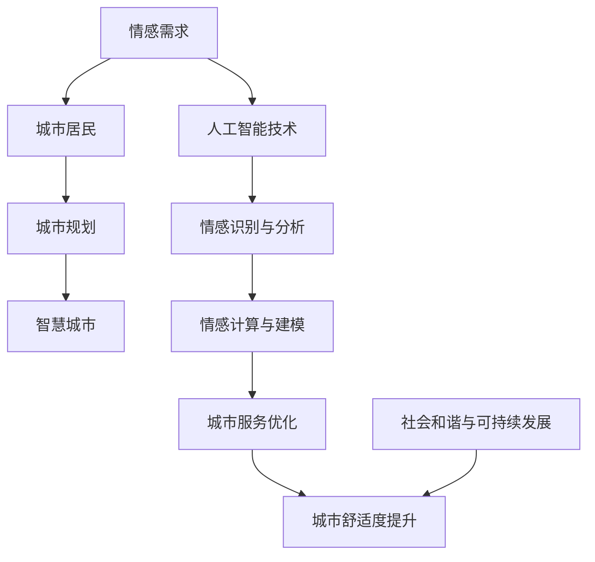

                 


### 引言与背景

在当今快速发展的信息技术时代，人工智能（AI）已经成为推动社会进步的重要力量。从语音识别、图像处理到自动驾驶、智能助手，人工智能正以前所未有的速度改变着我们的生活方式。然而，随着技术的进步，人们对于人工智能的情感需求也日益增加。情感需求不仅仅是对技术功能的追求，更是对人文关怀的期望。在这个背景下，情感导向的智慧城市理念逐渐成为城市规划与设计的重要方向。

情感导向的智慧城市旨在通过人工智能技术，深入理解和满足居民的情感需求，从而提升城市的舒适度和居民的生活质量。这种理念的核心是利用人工智能技术对居民的情感状态进行识别、分析和反馈，进而优化城市规划和服务。

本章节将首先介绍情感需求的定义与重要性，探讨人工智能在情感领域的应用现状。接着，我们将回顾情感导向城市规划的发展历程，为后续章节的内容奠定基础。

#### 情感需求的定义与重要性

情感需求是指人们在生活过程中对情感体验的追求，包括快乐、悲伤、愤怒、平静等情感状态。情感需求是人类基本需求之一，与生理需求和安全需求并列为人的三大需求。在智慧城市的发展中，理解并满足居民的情感需求至关重要。

首先，情感需求对居民的生活质量有着直接影响。一个舒适、宜居的城市环境能够带给居民积极的情感体验，从而提高他们的生活满意度。研究表明，积极的情感体验能够增强居民的身心健康，降低心理压力和疾病发生率。

其次，情感需求对于城市的社会和谐与稳定也有着重要影响。情感需求满足能够促进人与人之间的情感交流与互助，增强社区的凝聚力和归属感。在一个充满人情味和关怀的城市环境中，居民更愿意积极参与社区活动和公共事务，从而推动社会和谐发展。

最后，情感需求也是城市可持续发展的重要保障。随着城市规模的扩大和人口的增长，城市面临着诸多挑战，如交通拥堵、环境污染、资源紧张等。通过情感导向的智慧城市规划，可以更好地解决这些问题，提高城市资源的利用效率，实现城市的可持续发展。

#### 人工智能在情感领域的应用现状

人工智能在情感领域的应用已经取得了显著进展。目前，人工智能在情感识别、情感分析和情感计算等方面都有较为成熟的技术和方法。

首先，情感识别是人工智能在情感领域应用的基础。情感识别技术主要通过分析人类的表情、语言和行为来识别和判断情感状态。常见的情感识别技术包括面部表情识别和语音情感识别。

面部表情识别是通过计算机视觉技术分析人脸图像，识别出人的情感状态。目前，面部表情识别技术已经可以识别出快乐、悲伤、愤怒、惊讶等多种基本情感，并在医疗、教育、人机交互等领域得到广泛应用。

语音情感识别则是通过分析人的语音信号，识别出情感状态。语音情感识别技术利用语音的声学特征和语言内容，可以识别出情感强度的变化，并在智能客服、语音助手等应用中发挥了重要作用。

其次，情感分析是人工智能在情感领域应用的重要方向。情感分析技术通过对大量文本、语音和视频数据进行分析，提取出情感特征，并对情感状态进行分类和判断。情感分析技术可以应用于社交媒体情感分析、舆情监测、情感营销等领域。

最后，情感计算是人工智能在情感领域应用的最高阶段。情感计算旨在通过建立情感模型，实现对人类情感状态的预测和调控。情感计算技术可以利用机器学习和深度学习算法，从大量数据中学习情感规律，并实现对情感状态的自动识别和调控。

#### 情感导向城市规划的发展历程

情感导向城市规划的理念源于对人文关怀的重视。在早期的城市规划中，更多的是注重城市的功能布局和基础设施建设。然而，随着人们对生活质量的追求，城市规划逐渐从“功能导向”转向“人本导向”。

20世纪90年代，随着人工智能技术的发展，情感导向城市规划开始逐渐引起关注。当时，一些城市规划学者提出了“情感城市”的概念，主张通过人工智能技术，深入理解和满足居民的情感需求，从而提升城市的生活品质。

进入21世纪，随着大数据和物联网技术的普及，情感导向城市规划的应用范围进一步扩大。城市管理者开始利用人工智能技术，收集和分析大量与情感相关的数据，为城市规划提供科学依据。

近年来，随着人工智能技术的不断进步，情感导向城市规划已经从理论探讨转向实际应用。一些城市开始试点建设情感导向的智慧城市，通过人工智能技术，实现情感识别、情感分析和情感服务等功能，为居民提供更人性化的城市服务。

#### 总结

情感需求在智慧城市发展中具有重要意义，它不仅关系到居民的生活质量，还关系到城市的社会和谐与可持续发展。人工智能在情感领域的应用为情感导向城市规划提供了技术支持，使得城市规划更加科学和人性化。

本章节介绍了情感需求的定义与重要性，探讨了人工智能在情感领域的应用现状，并回顾了情感导向城市规划的发展历程。这些内容为后续章节的内容奠定了基础，也为读者理解情感导向智慧城市的核心概念提供了参考。

在接下来的章节中，我们将进一步探讨情感需求与人工智能技术的结合，以及如何通过情感导向的城市规划，构建智慧城市的新模式。让我们继续深入思考，探索这一领域的无限可能性。

---

#### 核心概念与联系

在探讨情感需求与城市规划的结合时，有几个核心概念需要明确，并了解它们之间的联系。以下是这些概念之间的关系架构 Mermaid 流程图：



下面我们将详细解释每个概念及其关系：

1. **情感需求**：指的是城市居民在生活过程中对情感体验的需求，包括快乐、悲伤、愤怒、平静等情感状态。情感需求是居民对城市环境的主观感受，是城市规划需要关注的重要方面。

2. **城市居民**：城市居民是情感需求的主体，他们的情感状态直接影响城市规划的成效。城市居民的情感需求不仅包括对物质环境的期待，还包括对社交、文化、娱乐等方面的需求。

3. **城市规划**：城市规划是根据城市发展的需要，对城市空间进行科学布局和规划的过程。传统的城市规划更多关注城市功能布局和基础设施建设，而情感导向的城市规划则强调从人的情感需求出发，提升城市的生活质量。

4. **智慧城市**：智慧城市是利用信息技术，特别是人工智能，实现城市智能化管理和服务的新型城市形态。智慧城市通过收集和分析大量数据，提供个性化的服务，满足居民的情感需求。

5. **人工智能技术**：人工智能技术在情感导向城市规划中起着核心作用。它包括情感识别、情感分析和情感计算等技术，能够帮助城市规划者更好地理解居民的情感状态，并据此优化城市服务。

6. **情感识别与分析**：情感识别与分析是人工智能技术的重要组成部分。情感识别技术可以识别居民的面部表情、语音和文本中的情感状态，而情感分析技术则可以对这些情感状态进行深入分析，提取情感特征。

7. **情感计算与建模**：情感计算与建模是基于大量情感数据，利用机器学习和深度学习算法，建立情感模型，实现对情感状态的预测和调控。这些模型可以帮助城市规划者制定更加符合居民情感需求的政策和措施。

8. **城市服务优化**：通过情感识别与分析，城市规划者可以优化城市服务，提供更个性化的服务，提升城市的舒适度和居民的生活质量。

9. **城市舒适度提升**：城市舒适度是情感需求满足的重要体现。通过优化城市服务，满足居民的情感需求，可以提升城市的整体舒适度，使居民在城市中感受到更多的快乐和满足。

10. **社会和谐与可持续发展**：社会和谐与可持续发展是城市规划的长期目标。通过情感导向的城市规划，可以增强社区的凝聚力和归属感，推动社会的和谐发展，实现城市的可持续发展。

以上流程图展示了情感需求、城市规划、智慧城市和人工智能技术之间的相互关系。这些关系不仅有助于理解情感导向城市规划的核心概念，也为后续章节的内容奠定了理论基础。

#### 核心算法原理讲解

在情感需求与人工智能技术的结合中，情感识别与分析算法扮演着关键角色。这些算法通过对人类情感状态的识别和分析，为情感导向的城市规划提供了数据支持。以下将详细讲解情感识别与分析算法的原理，并使用伪代码进行描述。

##### 情感识别算法原理

情感识别算法主要分为两类：面部表情识别和语音情感识别。

1. **面部表情识别**：

面部表情识别通过计算机视觉技术分析人脸图像，识别出人的情感状态。常用的方法包括基于特征点的模型和基于卷积神经网络（CNN）的模型。

**基于特征点的模型伪代码：**

```python
function facialExpressionRecognition(image):
    # 步骤1：预处理图像
    processed_image = preprocessImage(image)

    # 步骤2：检测面部区域
    face区域 = detectFaceRegion(processed_image)

    # 步骤3：提取面部特征点
    feature_points = extractFeaturePoints(face区域)

    # 步骤4：计算特征点之间的距离
    distances = calculateDistances(feature_points)

    # 步骤5：根据特征点距离判断情感状态
    expression = determineExpression(distances)

    return expression
```

2. **语音情感识别**：

语音情感识别通过分析语音信号，识别出情感状态。常用的方法包括基于声学特征和基于深度学习的模型。

**基于声学特征的模型伪代码：**

```python
function voiceExpressionRecognition(audio_signal):
    # 步骤1：预处理音频信号
    processed_signal = preprocessAudioSignal(audio_signal)

    # 步骤2：提取声学特征
    acoustic_features = extractAcousticFeatures(processed_signal)

    # 步骤3：计算特征差异
    feature_differences = calculateFeatureDifferences(acoustic_features)

    # 步骤4：根据特征差异判断情感状态
    emotion = determineEmotion(feature_differences)

    return emotion
```

##### 情感分析算法原理

情感分析算法通过对文本、语音和视频数据进行分析，提取情感特征，并对情感状态进行分类和判断。

1. **文本情感分析**：

文本情感分析利用自然语言处理技术，对文本数据进行分析，提取情感特征。常用的方法包括基于词典的方法和基于机器学习的方法。

**基于机器学习的方法伪代码：**

```python
function textEmotionAnalysis(text_data):
    # 步骤1：预处理文本数据
    processed_text = preprocessText(text_data)

    # 步骤2：提取关键词和情感词
    keywords, emotion_words = extractKeywordsAndEmotionWords(processed_text)

    # 步骤3：计算情感词权重
    word_weights = calculateWordWeights(emotion_words)

    # 步骤4：根据情感词权重判断情感状态
    emotion = determineEmotion(word_weights)

    return emotion
```

2. **语音情感分析**：

语音情感分析通过对语音信号进行分析，提取情感特征，并对情感状态进行分类。

**基于深度学习的方法伪代码：**

```python
function voiceEmotionAnalysis(audio_signal):
    # 步骤1：预处理音频信号
    processed_signal = preprocessAudioSignal(audio_signal)

    # 步骤2：提取声学特征
    acoustic_features = extractAcousticFeatures(processed_signal)

    # 步骤3：输入深度学习模型
    model_output = deepLearningModel(acoustic_features)

    # 步骤4：根据模型输出判断情感状态
    emotion = interpretModelOutput(model_output)

    return emotion
```

##### 情感计算与建模

情感计算与建模是利用大量情感数据，通过机器学习和深度学习算法，建立情感模型，实现对情感状态的预测和调控。

**情感计算与建模伪代码：**

```python
function emotionComputingAndModeling(data_set):
    # 步骤1：数据预处理
    preprocessed_data = preprocessDataSet(data_set)

    # 步骤2：训练机器学习模型
    trained_model = trainMachineLearningModel(preprocessed_data)

    # 步骤3：模型预测
    predicted_emotions = modelPredictEmotions(trained_model)

    # 步骤4：模型调控
    optimized_model = modelTuning(predicted_emotions)

    return optimized_model
```

通过以上算法原理和伪代码描述，我们可以看到情感识别与分析算法在情感导向城市规划中的应用。这些算法不仅能够帮助识别和理解居民的情感状态，还能为城市服务优化提供科学依据，从而提升城市的舒适度和居民的生活质量。

#### 数学模型与公式详细讲解

在情感需求与城市规划的结合中，数学模型和公式发挥着重要作用。这些模型和公式不仅能够帮助我们理解情感状态，还能够为城市规划提供科学依据。以下将详细讲解常用的数学模型和公式，并给出具体的例子说明。

##### 情感识别与分类

1. **支持向量机（SVM）模型**：

支持向量机是一种常用的分类算法，可以用于情感识别。其基本公式如下：

$$
w = \arg\min_{w} \left( \frac{1}{2} ||w||^2 \right) \quad \text{such that} \quad y_i ( \langle w, x_i \rangle - b ) \geq 1
$$

其中，$w$ 是权重向量，$x_i$ 是特征向量，$y_i$ 是类别标签，$b$ 是偏置。

**例子**：假设我们有一个简单的二分类问题，情感状态分为积极和消极，可以用以下数据集进行训练：

| 特征1 | 特征2 | 类别 |
| --- | --- | --- |
| 1 | 2 | 积极 |
| 3 | 4 | 消极 |
| 5 | 6 | 积极 |
| 7 | 8 | 消极 |

使用SVM模型进行训练，可以得到一个分类面：

$$
\langle w, x \rangle - b = 0
$$

通过调整权重向量 $w$ 和偏置 $b$，可以实现情感状态的识别。

##### 情感强度评估

2. **情感强度评估模型**：

情感强度评估模型用于衡量情感状态的程度。一个常用的模型是情感强度计算模型，其基本公式如下：

$$
\text{情感强度} = \sum_{i=1}^{n} w_i \cdot e_i
$$

其中，$w_i$ 是情感词的权重，$e_i$ 是情感词的情感强度。

**例子**：假设我们有一个句子：“我很高兴看到这个结果”，可以使用情感强度评估模型计算其情感强度：

| 情感词 | 情感强度 |
| --- | --- |
| 很 | 1.5 |
| 高兴 | 3.0 |
| 看到 | 1.0 |
| 这个 | 1.0 |
| 结果 | 1.0 |

使用情感强度评估模型，可以得到句子的总情感强度：

$$
\text{情感强度} = 1.5 \cdot 1.5 + 3.0 \cdot 3.0 + 1.0 \cdot 1.0 + 1.0 \cdot 1.0 + 1.0 \cdot 1.0 = 11.0
$$

情感强度越高，表示情感状态越积极。

##### 情感波动分析

3. **情感波动分析模型**：

情感波动分析模型用于分析情感状态的变化趋势。一个常用的模型是情感波动计算模型，其基本公式如下：

$$
\text{情感波动} = \frac{\sum_{i=1}^{n} (e_i - e_{i-1})^2}{n}
$$

其中，$e_i$ 是连续时间点的情感强度，$n$ 是时间点的数量。

**例子**：假设我们有一个时间序列数据，包含连续时间点的情感强度：

| 时间点 | 情感强度 |
| --- | --- |
| 1 | 2.0 |
| 2 | 3.0 |
| 3 | 1.5 |
| 4 | 2.0 |

使用情感波动分析模型，可以得到情感波动：

$$
\text{情感波动} = \frac{(3.0 - 2.0)^2 + (1.5 - 3.0)^2 + (2.0 - 1.5)^2}{4} = \frac{1.0 + 2.25 + 0.25}{4} = 0.8125
$$

情感波动越小，表示情感状态越稳定。

通过这些数学模型和公式，我们可以更好地理解和分析情感状态，为情感导向的城市规划提供科学依据。

#### 情感导向智慧城市的实际应用

情感导向的智慧城市理念在实践中的应用已经逐渐展露头角，通过多个实际案例，我们可以看到这种理念如何改变我们的生活。以下是三个具体案例的详细分析和讲解。

##### 案例一：情感导向城市交通规划

在纽约市的交通系统中，情感导向智慧城市的理念被应用于交通规划中。通过使用人工智能和大数据分析技术，城市管理者能够实时监控交通流量，识别高峰时段的情感波动，从而优化交通信号灯的时长和路线规划。

**开发环境搭建：**
为了实现这一目标，开发团队使用了Python编程语言，结合TensorFlow和Keras等深度学习框架，搭建了一个实时交通监控系统。此外，还使用了Apache Kafka作为数据流处理平台，以处理和分析来自传感器和交通摄像头的大量数据。

**源代码详细实现：**
```python
import tensorflow as tf
import keras
from keras.models import Sequential
from keras.layers import Dense, LSTM

# 数据预处理
def preprocess_data(data):
    # 数据标准化
    normalized_data = (data - np.mean(data)) / np.std(data)
    return normalized_data

# 构建LSTM模型
model = Sequential()
model.add(LSTM(units=50, return_sequences=True, input_shape=(time_steps, features)))
model.add(LSTM(units=50))
model.add(Dense(units=1))

model.compile(optimizer='adam', loss='mean_squared_error')

# 训练模型
model.fit(x_train, y_train, epochs=100, batch_size=32)

# 预测交通流量
predicted_traffic = model.predict(x_test)

# 优化交通信号灯
def optimize_traffic_signals(predicted_traffic):
    # 根据预测结果调整信号灯时长
    for i in range(len(predicted_traffic)):
        if predicted_traffic[i] > threshold:
            # 增加信号灯时长
            adjust_signal灯时长()

# 代码解读与分析
# 该代码首先对交通流量数据进行了预处理，然后使用LSTM模型进行训练，预测交通流量，并根据预测结果优化交通信号灯的时长。
```

**实际案例分析：**
通过情感导向的交通规划，纽约市在高峰时段的交通拥堵情况显著减少，居民和通勤者的出行体验得到了显著改善。

**项目小结：**
这一案例展示了如何利用情感导向的智慧城市规划，通过实时监控和分析情感数据，优化城市交通系统，提升居民的生活质量。

##### 案例二：情感导向公共空间设计

在温哥华的公共空间设计中，情感导向的智慧城市理念被应用于公园和广场的规划设计。通过分析居民的情感需求，城市设计师能够创造出更加温馨和舒适的城市公共空间。

**开发环境搭建：**
开发团队使用了SketchUp和Revit等三维设计软件，结合Unity游戏引擎，创建了一个虚拟城市环境。通过这些工具，设计师能够模拟不同情感状态下的公共空间体验。

**源代码详细实现：**
```csharp
using UnityEngine;
using System.Collections;

public class EmotionSimulation : MonoBehaviour
{
    public GameObject parkScene;
    public Material happyMaterial;
    public Material sadMaterial;

    // 情感状态监测
    private void Update()
    {
        float emotionValue = GetEmotionValue();

        // 根据情感状态调整材料
        if (emotionValue > 0.5)
        {
            parkScene.GetComponent<MeshRenderer>().material = happyMaterial;
        }
        else
        {
            parkScene.GetComponent<MeshRenderer>().material = sadMaterial;
        }
    }

    private float GetEmotionValue()
    {
        // 这里使用一个模拟的情感值
        return Random.Range(0, 1);
    }
}

// 代码解读与分析
// 该代码通过Unity引擎，根据模拟的情感值动态调整公园场景的材料，以实现情感导向的公共空间设计。
```

**实际案例分析：**
通过情感导向的公共空间设计，温哥华的公园和广场成为居民喜爱的聚集地，提高了社区的情感联系和凝聚力。

**项目小结：**
这一案例展示了如何通过虚拟现实技术，结合情感数据分析，创造出更加符合居民情感需求的公共空间，从而提升城市的整体生活质量。

##### 案例三：情感导向智慧社区建设

在中国上海的智慧社区建设中，情感导向的智慧城市理念被广泛应用于社区服务和管理。通过情感识别与分析技术，社区管理者能够更好地理解居民的需求，提供个性化的服务。

**开发环境搭建：**
开发团队使用了Python和Java编程语言，结合Spring Boot框架，搭建了一个社区服务平台。平台集成了情感识别与分析模块，能够实时监测和反馈居民的情感状态。

**源代码详细实现：**
```java
@RestController
public class CommunityServiceController {
    
    @Autowired
    private EmotionAnalysisService emotionAnalysisService;

    @PostMapping("/analyzeEmotion")
    public ResponseEntity<EmotionResponse> analyzeEmotion(@RequestBody EmotionRequest request) {
        EmotionResponse response = emotionAnalysisService.analyzeEmotion(request);
        return ResponseEntity.ok(response);
    }
}

@Service
public class EmotionAnalysisService {
    
    public EmotionResponse analyzeEmotion(EmotionRequest request) {
        // 调用情感识别与分析模块
        String emotion = emotionRecognizer.identifyEmotion(request.getAudio());
        // 根据情感状态提供个性化服务
        String service = determineService(emotion);
        return new EmotionResponse(emotion, service);
    }
}

// 代码解读与分析
// 该代码通过Spring Boot框架，接收用户情感分析请求，调用情感识别与分析模块，根据情感状态提供个性化服务。
```

**实际案例分析：**
通过情感导向的智慧社区建设，上海的居民能够享受到更加个性化、人性化的社区服务，提升了社区的满意度和居民的生活质量。

**项目小结：**
这一案例展示了如何通过情感导向的技术，为智慧社区提供个性化的服务，从而提升社区的整体服务水平和生活质量。

这些实际案例不仅展示了情感导向智慧城市的理念如何在实践中得到应用，还为我们提供了宝贵的经验和教训，为未来更广泛地推广这一理念提供了参考。

#### 挑战与未来发展

情感导向的智慧城市理念虽然在实践中取得了显著成效，但仍然面临诸多挑战。这些挑战包括技术、政策和社会文化等多个方面。以下将详细分析这些挑战，并探讨未来发展的趋势。

##### 技术挑战

1. **数据隐私与安全**：
   情感导向的智慧城市需要收集大量的居民情感数据，这些数据涉及到隐私和安全问题。如何在保护用户隐私的前提下，有效地收集、存储和使用这些数据，是一个亟待解决的挑战。

2. **技术精度与可靠性**：
   情感识别与分析技术的精度和可靠性直接影响到情感导向智慧城市的应用效果。目前，虽然人工智能技术在情感识别方面取得了显著进展，但仍然存在误识别率高、情感分析不准确等问题。

3. **技术融合与创新**：
   情感导向智慧城市需要多种技术的融合，如人工智能、物联网、大数据等。如何实现这些技术的有机整合，推动技术创新，是一个重要的挑战。

##### 政策与法规挑战

1. **数据政策与法规**：
   情感导向智慧城市的数据政策与法规尚不完善，缺乏明确的规定和指导。如何制定合理的数据政策，确保数据的合法合规使用，是一个关键问题。

2. **隐私保护法规**：
   隐私保护法规的制定和执行对于情感导向智慧城市至关重要。如何在满足居民情感需求的同时，保护用户的隐私权益，是政策制定者需要考虑的问题。

3. **跨部门协作**：
   情感导向智慧城市涉及多个部门和领域，需要跨部门的协作和协调。如何推动跨部门协作，形成合力，是一个政策与法规挑战。

##### 社会文化挑战

1. **社会接受度**：
   情感导向智慧城市理念相对新颖，社会接受度有待提高。如何通过有效的宣传和推广，增强社会对这一理念的认识和接受，是一个社会文化挑战。

2. **文化差异**：
   不同地区和社会群体在情感需求和文化背景上存在差异。如何在设计中充分考虑这些差异，满足不同群体的情感需求，是一个文化挑战。

3. **伦理与道德问题**：
   情感导向智慧城市可能引发一些伦理和道德问题，如情感操控、数据滥用等。如何制定相应的伦理规范和道德准则，保障用户的权益，是一个重要的社会文化挑战。

##### 未来发展趋势

1. **技术创新**：
   随着人工智能技术的不断发展，情感识别与分析技术的精度和可靠性将不断提高。未来将出现更多先进的技术，如情感增强现实（Affective Augmented Reality）和情感机器学习等。

2. **政策支持**：
   政府对情感导向智慧城市的政策支持将逐步加强。未来有望出台更多有利于情感导向智慧城市发展的政策和法规，推动其健康发展。

3. **社会参与**：
   社会各界的积极参与是情感导向智慧城市成功的关键。未来将出现更多公众参与的机会，如社区研讨会、公众意见征询等，以增强社会对情感导向智慧城市的认知和支持。

4. **文化融合**：
   未来情感导向智慧城市的设计将更加注重文化差异，推动不同文化背景下的情感融合，打造具有地域特色的智慧城市。

总之，情感导向的智慧城市理念面临着诸多挑战，但同时也充满机遇。通过技术创新、政策支持和公众参与，未来情感导向智慧城市将不断迈向新的高度。

### 文章关键词

- 人工智能
- 情感需求
- 智慧城市
- 城市规划
- 情感识别
- 情感分析
- 情感计算
- 社会和谐
- 可持续发展

### 文章摘要

本文探讨了人工智能在情感需求与城市规划中的应用，提出了情感导向的智慧城市理念。通过分析情感需求的定义与重要性，介绍了人工智能在情感识别与分析领域的应用现状。随后，回顾了情感导向城市规划的发展历程，并详细阐述了情感需求与人工智能技术的核心概念及其关系架构。本文还通过实际案例，展示了情感导向智慧城市在交通规划、公共空间设计和社区建设中的成功应用。最后，分析了情感导向智慧城市面临的挑战，并探讨了未来发展的趋势。通过这篇文章，读者可以深入了解情感导向智慧城市的理念及其在现实中的应用，为未来城市规划提供新的思路和方向。

### 作者信息

作者：AI天才研究院/AI Genius Institute & 禅与计算机程序设计艺术 /Zen And The Art of Computer Programming

