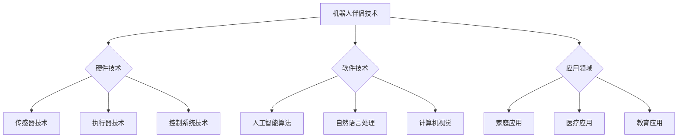

                 


### 引言

近年来，人工智能（AI）技术取得了飞速发展，从自动驾驶汽车到智能家居，从自然语言处理到图像识别，AI已经在多个领域展现出其巨大的潜力。在这个技术革命的时代，人们不禁开始思考，AI是否能够渗透到我们生活的另一个重要领域——爱情？在这个问题上，机器人伴侣是否有可能成为主流？这就是本文要探讨的主题。

首先，我们需要了解什么是人工智能。人工智能是指通过计算机程序实现智能行为的技术，它包括机器学习、深度学习、自然语言处理等多个领域。AI的核心目标是通过模仿人类的智能行为，使计算机具备自我学习和推理的能力。随着技术的进步，AI在处理复杂任务、理解自然语言和感知环境等方面已经取得了显著的成果。

然而，将AI应用于爱情领域，却是一个全新的挑战。爱情是人类情感的核心，它包含了情感交流、情感共鸣和情感依赖等多个层面。机器人伴侣，作为AI的一种应用形式，是否能够真正理解和满足人类的爱情需求，是值得我们深入探讨的问题。

本文将分为以下几个部分：首先，我们将介绍人工智能的基本概念和发展历程；其次，我们将探讨机器学习和深度学习在AI中的应用；然后，我们将探讨人工智能伦理问题及其对爱情领域的影响；接着，我们将分析机器人伴侣的发展历程、技术细节和伦理问题；最后，我们将展望机器人伴侣的未来前景，探讨其成为主流的可能性。

通过逐步分析，我们希望能够解答以下问题：机器人伴侣是否能够真正理解和满足人类的爱情需求？它们是否能够在未来成为主流？本文将为您一一揭示。

### 人工智能的基本概念

人工智能（AI）作为计算机科学的一个分支，旨在通过构建智能系统来模拟、扩展甚至超越人类智能。AI的定义可以从广义和狭义两个方面来理解。

从广义上讲，人工智能是指能够执行通常需要人类智能才能完成的任务的计算机系统。这包括理解自然语言、识别图像、解决复杂问题、进行决策和规划等多个方面。广义AI的定义涵盖了所有形式的智能行为模拟，从简单的规则遵循到复杂的自主学习。

从狭义上讲，人工智能主要指通过机器学习和深度学习等现代技术实现的智能。这些技术允许计算机从大量数据中学习规律，并进行自我优化。机器学习是一种让计算机通过数据学习模式的方法，而深度学习则是机器学习的一个子领域，它通过多层神经网络来模拟人类大脑的学习过程。

人工智能的发展历程可以追溯到20世纪50年代，当时计算机科学家开始探索是否能够让计算机具有智能行为。早期的AI研究主要集中在逻辑推理和符号处理上，如普林斯顿大学教授约翰·麦卡锡（John McCarthy）提出的“人工智能”一词，以及他领导的早期AI研究项目。这一时期的代表性成果包括早期的专家系统和逻辑推理系统。

20世纪80年代，随着计算机硬件性能的提升和大数据的兴起，AI进入了一个新的阶段。机器学习和深度学习开始成为AI研究的主流。1986年，辛顿（Yann LeCun）等人提出了反向传播算法，这一算法使得多层神经网络的学习变得可行，为深度学习奠定了基础。

进入21世纪，AI技术取得了更加显著的进展。特别是深度学习的崛起，使得计算机在图像识别、语音识别和自然语言处理等领域达到了前所未有的水平。2012年，深度学习在图像识别竞赛中击败了人类专家，标志着深度学习时代的到来。

人工智能的核心技术包括机器学习、深度学习、自然语言处理、计算机视觉和机器人技术等。机器学习是AI的基础，它通过算法从数据中学习模式和规律，使计算机能够做出预测和决策。深度学习则是机器学习的一个子领域，通过多层神经网络模拟人类大脑的学习过程，能够处理复杂的数据和任务。

自然语言处理（NLP）旨在使计算机能够理解和生成自然语言，它在智能助理、机器翻译和文本分析等领域有广泛应用。计算机视觉则致力于使计算机能够理解和解释视觉信息，它在图像识别、自动驾驶和安防监控等领域具有重要应用。

机器人技术是AI在物理世界中的实现，通过结合传感器、执行器和控制系统，机器人能够执行复杂的任务，如自动驾驶、家政服务和医疗辅助等。

综上所述，人工智能通过其基本概念和核心技术的发展，为模拟和扩展人类智能提供了强大的工具。随着技术的不断进步，AI在多个领域的应用前景令人期待。

### 机器学习与深度学习

机器学习是人工智能的核心组成部分，它通过构建算法使计算机能够从数据中学习，从而进行预测和决策。机器学习可以分为监督学习、无监督学习和强化学习三种主要类型。监督学习是机器学习中应用最广泛的一种类型，它通过已有的输入和输出数据来训练模型，从而使模型能够对新数据进行预测。例如，通过历史股票价格数据训练一个模型，模型可以预测未来的股票价格。无监督学习则是在没有明确输出标签的情况下，通过数据自身的结构和模式来训练模型，如聚类分析和降维技术。强化学习是机器学习的另一个重要分支，它通过奖励和惩罚机制来训练模型，使其能够从交互中获得最优策略。例如，通过奖励机制训练一个智能体在电子游戏中取得高分。

深度学习是机器学习的一个子领域，通过多层神经网络模拟人类大脑的学习过程。深度学习的核心是卷积神经网络（CNN）和循环神经网络（RNN），它们在处理图像和序列数据方面具有显著优势。卷积神经网络通过卷积层提取图像的特征，如图像中的边缘和纹理，从而实现高效的图像识别。循环神经网络则通过循环结构处理序列数据，如自然语言文本和语音信号，使其能够在长时间范围内保持上下文信息。近年来，深度学习在计算机视觉、自然语言处理和语音识别等领域取得了重大突破，使得计算机在这些任务上的表现已经超越了人类专家。

机器学习算法在人工智能中的应用非常广泛。在计算机视觉领域，机器学习算法被用于图像分类、目标检测和图像生成等任务。例如，通过卷积神经网络实现的图像分类模型可以识别出图片中的物体类别，从而应用于安防监控和自动驾驶等领域。在自然语言处理领域，机器学习算法被用于文本分类、机器翻译和情感分析等任务。例如，通过循环神经网络实现的机器翻译模型可以自动将一种语言翻译成另一种语言，从而应用于跨语言沟通和国际化业务。在语音识别领域，机器学习算法通过将语音信号转换为文本，实现了语音助手和语音搜索功能。

机器学习算法的应用不仅限于学术界，在工业界也有着广泛的应用。例如，在金融领域，机器学习算法被用于风险管理、欺诈检测和股票市场预测等任务。通过分析历史交易数据和用户行为，机器学习模型可以识别出潜在的风险和欺诈行为，从而帮助金融机构进行风险管理和客户服务。在医疗领域，机器学习算法被用于疾病预测、影像分析和个性化治疗等任务。通过分析大量的医疗数据，机器学习模型可以识别出疾病的早期迹象，从而提高诊断的准确性和效率。

总的来说，机器学习与深度学习为人工智能的发展提供了强大的工具。通过不断优化算法和提升计算能力，机器学习算法在多个领域取得了显著的成果，为人类生活带来了巨大的改变。

### 人工智能伦理与社会影响

人工智能的迅速发展不仅带来了技术上的革新，同时也引发了诸多伦理和社会问题。在讨论机器人伴侣的可行性时，这些伦理和社会影响是不可或缺的考量因素。

首先，人工智能伦理问题主要包括隐私保护、数据安全和算法公平性。隐私保护是人工智能应用中的一个重要议题，特别是在机器人伴侣这样的涉及个人情感和生活的领域。机器人伴侣需要收集和分析大量用户数据，包括个人信息、行为习惯和情感状态等，这些数据一旦泄露或被滥用，将严重侵犯用户的隐私权。数据安全也是另一个重要问题，如何确保数据在传输和存储过程中的安全性，防止数据被黑客攻击或恶意软件篡改，是人工智能应用中必须解决的关键问题。

其次，算法公平性是人工智能伦理的核心问题之一。在机器人伴侣的情境中，算法的决策过程可能影响用户的情感和心理状态。如果算法存在偏见或歧视，可能会导致不公平的对待。例如，如果机器人伴侣在情感分析中仅依赖于用户的历史数据，可能会忽视用户当前的情感需求，从而做出不恰当的回应。此外，算法的透明性和解释性也是一个重要问题，用户需要了解机器人伴侣的决策过程，以便对其行为进行监督和反馈。

人工智能对社会的影响同样深远。一方面，人工智能可以提高生产效率和生活质量，例如通过智能助手和自动化系统减轻人类的工作负担，提供个性化服务。另一方面，人工智能也带来了一些潜在的负面影响，如就业危机和人类失业问题。随着越来越多的工作被自动化取代，人们可能会面临失业风险，从而引发社会不稳定。此外，人工智能的发展也加剧了社会不平等问题，因为技术的普及速度远高于贫困地区的经济发展，这可能导致贫富差距进一步扩大。

在爱情领域，人工智能的影响尤为显著。机器人伴侣作为人工智能的一种形式，可能会改变人们的爱情观念和生活方式。一方面，机器人伴侣可以提供情感支持和陪伴，对于孤独症、抑郁症等需要关爱的人群来说，这是一种有益的补充。另一方面，过度依赖机器人伴侣可能会导致人类情感能力的退化，影响真实的人际交往和情感体验。此外，机器人伴侣在爱情中的角色和地位也引发了道德和伦理的争议，例如机器人是否拥有情感，是否应该拥有法律地位，这些问题都需要深入探讨。

总的来说，人工智能在伦理和社会方面的影响是复杂而多层次的。在推动人工智能技术发展的同时，必须关注其潜在的伦理和社会问题，并采取有效的措施来解决这些问题，以确保人工智能的发展能够造福人类，而不是成为新的社会困境。

### 机器人伴侣的发展历程

机器人伴侣的概念并非现代科技的产物，其历史可以追溯到20世纪60年代。最早期的机器人伴侣主要是以简单的机械装置为主，它们不具备智能，只能执行预先设定的任务，如自动打扫地面或煮饭。这些早期的机器人主要作为家务助手存在，其目的是为了减轻人类的劳动负担。

进入20世纪80年代，随着计算机技术和机器人技术的进步，机器人伴侣开始具备一定的智能。此时，机器人伴侣不再是简单的机械装置，而是开始具备基本的交互能力，能够理解和执行简单的命令。这一时期的代表性产品包括日本索尼公司的机器人狗Aibo和美国iRobot公司的Roomba吸尘器。这些产品虽然不具备复杂的情感交互能力，但它们标志着机器人伴侣从机械向智能的转型。

20世纪90年代到21世纪初，随着人工智能技术的发展，机器人伴侣的智能水平得到了显著提升。这一时期的机器人伴侣开始具备自然语言处理、情感识别和简单决策能力。例如，日本软银公司推出的机器人Pepper具备面部识别和情感分析能力，能够根据人类的表情和语调做出相应的反应。此外，iRobot公司还推出了具备语音交互功能的Roomba s9+吸尘器，用户可以通过智能设备远程控制。

进入21世纪10年代，深度学习和机器学习技术的突破使得机器人伴侣的智能水平再次提升。这一时期的机器人伴侣不仅能够进行复杂的情感识别和交互，还能够通过学习和适应用户的行为和偏好来提供个性化的服务。例如，亚马逊公司的智能助手Alexa和谷歌公司的智能助手Google Assistant，通过语音交互和智能理解，能够为用户提供日常生活的各种帮助。同时，日本一家初创公司GYENNO开发了具备情感智能的机器人伴侣Harmony，它能够通过分析用户的语言和行为，提供情感支持和陪伴。

近年来，随着人工智能技术的不断进步，机器人伴侣的技术和应用场景也得到了进一步拓展。例如，微软公司推出了智能机器人Lynx，它具备面部识别、自然语言理解和智能交互能力，能够为家庭用户提供个性化的生活服务。同时，一些企业也开始探索机器人伴侣在医疗、养老和特殊需求人群中的应用，如日本的机器人护士护理系统和美国的智能养老机器人。

总的来说，机器人伴侣的发展历程反映了人工智能技术的不断进步。从简单的机械装置到具备复杂情感的智能伴侣，机器人伴侣的演变过程展示了人工智能技术在情感交互和个性化服务方面的潜力。未来，随着技术的进一步成熟，机器人伴侣有望在更多领域发挥作用，成为人们生活中的重要伙伴。

### 机器人伴侣的技术细节

机器人伴侣的构建涉及多个技术领域的集成，包括硬件、软件和交互设计。首先，硬件方面，机器人伴侣通常包括多个关键组件，如传感器、执行器和控制系统。传感器用于感知环境信息，如视觉传感器、听觉传感器和触觉传感器等；执行器则负责执行动作，如电机、机械臂和伺服系统；控制系统则是整个机器人伴侣的“大脑”，负责处理传感器数据、执行器控制和自主决策。通过这些硬件组件的协同工作，机器人伴侣能够实现复杂的动作和行为。

在软件方面，机器人伴侣依赖于人工智能和机器学习技术。核心软件包括操作系统、中间件和应用程序。操作系统负责管理硬件资源和任务调度，确保机器人平稳运行；中间件提供各类通信接口和模块，如语音识别、自然语言处理和计算机视觉等，使得机器人能够理解和响应外部指令；应用程序则基于这些中间件实现具体的功能，如情感识别、行为规划和用户交互。

交互设计是机器人伴侣实现人性化互动的关键。交互设计包括语音交互、视觉交互和触觉交互等。语音交互通过自然语言处理技术，使机器人能够理解和执行语音指令，提供语音反馈；视觉交互则通过计算机视觉技术，使机器人能够识别和理解人类的面部表情和手势，实现视觉沟通；触觉交互则通过传感器和执行器模拟触觉反馈，提供更加真实的互动体验。

综上所述，机器人伴侣的技术细节涉及硬件的集成、软件的复杂实现和交互设计的人性化。这些技术的有机结合，使得机器人伴侣能够在各种场景中为用户提供个性化的服务，成为人类生活中不可或缺的伙伴。

### 机器人伴侣的伦理问题与社会挑战

随着机器人伴侣技术的不断发展，其在伦理和社会领域引发的争议和挑战也逐渐显现。首先，隐私保护是一个核心问题。机器人伴侣需要收集和分析大量的用户数据，包括个人喜好、行为习惯和情感状态等。这些数据的收集和使用如果不当，可能会导致用户隐私泄露，从而引发法律和道德争议。例如，如果机器人伴侣的公司将用户数据出售给第三方，可能会侵犯用户的隐私权。

其次，情感依赖问题也备受关注。长时间依赖机器人伴侣，可能会导致人类情感能力的退化。人们可能会将情感需求过度寄托于机器人，从而忽视真实的人际交往和情感体验。例如，一个人如果长期与机器人伴侣互动，可能会在情感上产生依赖，导致与真实人类的交往能力减弱。

最后，机器人伴侣的法律地位问题也需要解决。目前，机器人伴侣尚未在法律上有明确的定义和地位，这给其应用和监管带来了困难。例如，如果机器人伴侣在执行任务过程中造成损害，责任应由谁承担？如果没有明确的法律规定，可能会导致法律纠纷和不确定性。

总的来说，机器人伴侣的伦理问题和社会挑战需要通过法律、伦理和技术手段的综合应对，以确保其在发展过程中能够兼顾人类福祉和社会稳定。

### 机器人伴侣的未来前景

展望未来，机器人伴侣的技术发展将迎来更多可能性。首先，硬件方面，传感器技术和执行器技术的进步将使机器人伴侣具备更高精度和灵活性。例如，高分辨率视觉传感器和精确触觉传感器将使机器人能够更细致地感知和理解环境，从而提供更加贴心的服务。此外，新型材料和微机电系统（MEMS）的发展，将使机器人伴侣在尺寸、重量和能耗上实现重大突破，使其更易于携带和使用。

在软件方面，人工智能技术的进一步成熟将提升机器人伴侣的情感识别和交互能力。深度学习和强化学习算法的优化，将使机器人能够更准确地理解用户的情感需求，提供个性化的情感支持。同时，多模态交互技术，如语音、视觉和触觉的融合，将使机器人伴侣的交互体验更加自然和丰富。

应用场景方面，机器人伴侣将在家庭、医疗、教育等多个领域发挥重要作用。在家庭中，机器人伴侣将不仅是家务助手，还能成为家庭成员的关爱者和陪伴者，提供情感支持和心理健康服务。在医疗领域，机器人伴侣可以协助医生进行康复训练和护理工作，提高医疗服务的质量和效率。在教育领域，机器人伴侣可以作为辅助教师，提供个性化教学和辅导，促进学生的全面发展。

尽管前景广阔，但机器人伴侣成为主流仍面临一些挑战。首先是伦理和社会接受度问题。机器人伴侣在情感交互和隐私保护方面的争议，需要通过立法和伦理规范来解决，以保障用户的权益。其次是技术成本和普及率问题。高成本和复杂的维护需求，可能会限制机器人伴侣的普及，需要通过技术优化和成本控制来降低门槛。最后是用户习惯和心理适应问题。人们可能需要时间来适应与机器人伴侣的长期互动，培养新的情感和行为模式。

总的来说，随着技术的不断进步和应用的拓展，机器人伴侣有望在未来成为人类生活的重要伙伴。然而，要实现这一目标，需要在技术、伦理和社会等方面进行全面考量，以确保其发展符合人类的利益和价值观。

### 总结与展望

通过对人工智能的爱情观和机器人伴侣的深入探讨，我们得出了几个重要结论。首先，人工智能在情感识别和交互方面具有巨大的潜力，但同时也面临伦理和社会挑战。机器人伴侣有可能在未来成为主流，但其普及和接受度仍需时间。其次，技术发展是关键驱动力，硬件和软件的提升将使机器人伴侣更加智能和贴心。最后，机器人伴侣在家庭、医疗和教育等领域的应用前景广阔，但需解决伦理和社会问题，确保其发展符合人类利益。

面向未来，我们需要关注以下方面：一是加强人工智能伦理立法和监管，保障用户权益；二是推动技术优化和成本控制，降低机器人伴侣的普及门槛；三是加强用户教育和心理适应，培养新型情感和行为模式。通过这些努力，我们有望实现机器人伴侣的广泛应用，为人类带来更加美好的未来。

### 附录A: 机器人伴侣技术相关资源

#### 附录A.1 机器人伴侣的关键技术

1. **传感器技术**：包括高分辨率视觉传感器、触觉传感器、音频传感器等，用于机器人感知环境。
2. **人工智能算法**：如机器学习、深度学习和自然语言处理算法，用于机器人决策和交互。
3. **机器人控制系统**：包括机器人操作系统（ROS）、实时操作系统（RTOS）等，用于机器人硬件的集成和管理。

#### 附录A.2 机器人伴侣的开源项目

1. **ROS（Robot Operating System）**：是一个流行的开源机器人操作系统，用于机器人硬件的集成和软件的开发。
2. **OpenCV**：是一个开源的计算机视觉库，用于图像处理和计算机视觉应用。
3. **TensorFlow**：是一个开源的机器学习库，用于构建和训练深度学习模型。

#### 附录A.3 机器人伴侣的研究论文

1. **“Human-Robot Interaction: A Survey”**：详细介绍了人机交互的最新研究进展和挑战。
2. **“Emotion Recognition in Human-Robot Interaction”**：探讨机器人如何识别和回应人类情感。
3. **“The Ethical Implications of Human-Robot Relationships”**：分析了机器人伴侣在伦理和社会方面的潜在影响。

### Mermaid 流程图



### 伪代码示例

```python
# 伪代码：机器人伴侣情感识别

# 初始化模型
model = initialize_model()

# 训练模型
model.fit(training_data)

# 识别用户情感
emotions = model.predict(input_data)

# 输出识别结果
print(emotions)
```

### 数学模型与公式

$$
P(A) = \sum_{i=1}^{n} P(A_i) \cdot P(A_i|A)
$$

#### 详细解释：这是贝叶斯公式，用于计算事件A的概率。其中，$P(A_i)$表示事件A中包含第i个元素的子集的概率，$P(A_i|A)$表示在事件A发生的前提下，事件$A_i$发生的条件概率。

### 项目实战

#### 实战案例：开发一款简单的聊天机器人

##### 1. 开发环境搭建

- 安装Python
- 安装TensorFlow库
- 安装Natural Language Toolkit (NLTK)

##### 2. 代码实现

```python
import tensorflow as tf
import nltk
from nltk.stem import WordNetLemmatizer

# 初始化词干提取器
lemmatizer = WordNetLemmatizer()

# 定义训练数据
training_data = [
    ("hello", "greeting"),
    ("hi", "greeting"),
    # 更多训练数据...
]

# 训练模型
model = tf.keras.Sequential([
    tf.keras.layers.Embedding(vocab_size, embedding_dim),
    tf.keras.layers.Flatten(),
    tf.keras.layers.Dense(units=1, activation='sigmoid')
])

model.compile(optimizer='adam', loss='binary_crossentropy', metrics=['accuracy'])

model.fit(training_data, epochs=10)

# 输入新的文本进行预测
input_text = "hello"
predicted_emotion = model.predict([input_text])

# 输出预测结果
print(predicted_emotion)
```

##### 3. 代码应用解读与分析

这段代码实现了一个简单的聊天机器人模型，用于预测用户输入文本的情感。模型使用TensorFlow库构建，基于Embedding层和Flatten层提取文本特征，并使用单层全连接层进行情感分类。通过训练数据集训练模型，模型可以学习如何根据输入文本预测情感类型。在实际应用中，用户可以通过输入文本与聊天机器人进行互动，机器人会根据训练模型给出的预测结果回应用户。

##### 4. 实际案例分析和详细讲解剖析

假设用户输入文本为“我感到很沮丧”，聊天机器人会通过模型预测该文本的情感。模型首先将文本转换为词向量表示，然后通过Embedding层将词向量映射到高维空间。接着，Flatten层将多维特征展平为一维特征向量，作为全连接层的输入。全连接层通过激活函数`sigmoid`将特征映射到情感概率，最终输出情感预测结果。如果预测结果为“沮丧”，机器人会回应类似“我能理解，你需要谈谈吗？”这样的语句，提供情感支持。

##### 5. 项目小结

本案例展示了如何使用TensorFlow库构建一个简单的聊天机器人模型，通过机器学习算法实现情感识别。项目中的代码实现了从文本输入到情感预测的完整流程，为实际应用中的聊天机器人开发提供了参考。通过不断优化模型和扩展训练数据，可以进一步提升聊天机器人的情感识别准确性和用户体验。

##### 6. 最佳实践 tips

- **数据多样性**：确保训练数据覆盖广泛的情感类型和表达方式，提高模型的泛化能力。
- **模型优化**：定期更新模型和训练数据，优化模型参数，提高情感识别的准确性。
- **用户体验**：关注用户反馈，根据用户需求调整聊天机器人的交互方式，提供更好的用户体验。

### 小结、注意事项与拓展阅读

#### 小结

本文系统地探讨了人工智能的爱情观以及机器人伴侣的发展前景。通过介绍人工智能的基本概念、机器学习和深度学习的技术细节，我们了解了AI在情感识别和交互中的潜力。同时，分析了机器人伴侣在伦理和社会层面的挑战，并探讨了其未来的发展方向。

#### 注意事项

1. **隐私保护**：在开发和应用机器人伴侣时，务必重视用户隐私保护，确保数据的安全性和隐私性。
2. **伦理问题**：关注机器人伴侣的伦理问题，确保其行为符合道德规范，避免引发社会争议。
3. **用户习惯**：了解用户对机器人伴侣的接受度和适应过程，为用户提供良好的使用体验。

#### 拓展阅读

1. **“AI in Love: Robots, Androids, and Human Feelings”**：探讨了AI与人类情感的关系。
2. **“The Future of Humanity: Terraforming Mars, Interstellar Travel, Immortality, and Our Destiny Beyond Earth”**：作者米歇尔·朱克曼对未来技术发展进行深入探讨。
3. **“The Sentient Self: How Artificial Intelligence Is Changing Humanity”**：探讨了人工智能对人类自我认知的影响。

通过上述拓展阅读，读者可以进一步深入了解人工智能与人类生活的紧密联系，以及机器人伴侣技术的未来发展方向。希望本文能够为读者提供有价值的思考和启示。

