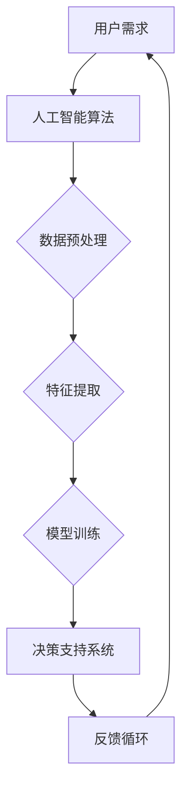

                 

### 1.2 核心概念与联系

#### 人工智能概述

人工智能（Artificial Intelligence, AI）是研究、开发用于模拟、延伸和扩展人类智能的理论、方法、技术及应用系统的综合技术科学。其主要目标是让计算机具备人类智能的某些功能，如学习、推理、规划、感知、理解自然语言等。

- **AI的发展历史**：从20世纪50年代的早期探索，到20世纪80年代的中断期，再到21世纪的复兴，AI经历了多个发展阶段。
- **AI的主要分支**：机器学习、深度学习、自然语言处理、计算机视觉、机器人技术等。

#### 人类智能模型

人类智能模型旨在理解和模拟人类智能的本质。不同的模型试图从不同角度解释人类智能：

- **通用智能模型**：如艾伦·图灵提出的图灵测试，用于评估机器是否具有人类智能。
- **模块化智能模型**：认为人类智能是由多个模块组成的，如视觉模块、听觉模块、语言模块等。

#### 人机协作原理

人机协作是指人类与计算机系统共同完成任务的互动过程。其核心在于如何将人类的创造力和直觉与计算机的高速度、精确性和大量数据处理能力相结合。

- **协作模式**：紧密协作和半自主协作。紧密协作中，计算机充当执行任务的辅助工具；半自主协作中，计算机具有一定的自主决策能力。
- **人机交互**：语音识别、手势识别、虚拟现实等技术在人机协作中的应用。

#### Mermaid流程图

为了更清晰地展示核心概念之间的关系，我们可以使用Mermaid流程图来描述人机协作系统的架构：



#### 伪代码

在描述核心算法原理时，可以使用伪代码来详细阐述：

```plaintext
// 决策树生成算法伪代码
DecisionTreeGenerate(data, target_attribute):
    if data is empty:
        return leaf node with majority class of target_attribute in data
    else if all examples have the same target_attribute value:
        return leaf node with that value
    else:
        // 选择最佳分割属性
        best_attribute, best_value = SelectBestAttribute(data)
        // 创建子节点
        for each value of best_attribute in data:
            subset = {example | example has value of best_attribute = best_value}
            child_tree = DecisionTreeGenerate(subset, target_attribute)
            add child_tree as a child of the current node
        return the current node
```

### 1.3 数学模型与数学公式详细讲解

在描述人机协作系统的数学模型时，需要使用 LaTeX 格式来嵌入数学公式，并给出详细的讲解和举例说明。

#### 优化模型

优化模型用于在给定约束条件下，寻找目标函数的最优解。以下是一个简单的线性优化模型：

$$
\min_{x} c^T x \quad \text{subject to} \quad Ax \leq b
$$

其中，$c$ 是目标函数系数向量，$x$ 是决策变量向量，$A$ 和 $b$ 分别是约束矩阵和约束向量。

#### 控制理论

控制理论中的PID控制器是一个经典的数学模型，用于控制系统的稳定性和响应速度。PID控制器的数学模型如下：

$$
u(t) = K_p e(t) + K_i \int_{0}^{t} e(\tau) d\tau + K_d \frac{d}{dt} e(t)
$$

其中，$u(t)$ 是控制输出，$e(t)$ 是误差信号，$K_p$、$K_i$ 和 $K_d$ 分别是比例、积分和微分系数。

#### 概率论与统计

在机器学习中，概率模型和统计方法是核心。一个简单的贝叶斯分类器可以用以下公式表示：

$$
P(C_k|X) = \frac{P(X|C_k) P(C_k)}{P(X)}
$$

其中，$C_k$ 是类别标签，$X$ 是特征向量，$P(C_k|X)$ 是给定特征向量 $X$ 下类别 $C_k$ 的概率。

### 1.4 项目实战

#### 开发环境搭建

为了实现人机协作系统，需要搭建一个合适的开发环境。以下是常见的开发环境搭建步骤：

1. 安装 Python 3.8 或以上版本。
2. 安装 Jupyter Notebook，用于编写和运行代码。
3. 安装必要的库，如 NumPy、Pandas、Scikit-learn、TensorFlow 等。

#### 源代码实现

以下是一个简单的基于决策树的分类算法的实现示例：

```python
from sklearn.datasets import load_iris
from sklearn.model_selection import train_test_split
from sklearn.tree import DecisionTreeClassifier
import numpy as np

# 载入数据集
iris = load_iris()
X = iris.data
y = iris.target

# 划分训练集和测试集
X_train, X_test, y_train, y_test = train_test_split(X, y, test_size=0.2, random_state=42)

# 创建决策树分类器
clf = DecisionTreeClassifier()

# 训练模型
clf.fit(X_train, y_train)

# 预测
y_pred = clf.predict(X_test)

# 评估模型
accuracy = np.mean(y_pred == y_test)
print(f"Model accuracy: {accuracy:.2f}")
```

#### 代码解读

在上面的代码中，我们首先加载了 Iris 数据集，然后将其划分为训练集和测试集。接下来，我们创建了一个决策树分类器，并使用训练集数据进行训练。最后，我们使用测试集数据进行预测，并评估了模型的准确性。

#### 应用解读与分析

该决策树分类器可以用于预测 Iris 数据集中的花卉种类。在实际应用中，可以通过调整决策树参数来优化模型性能，例如设置最大深度、最小样本分裂等。

#### 实际案例分析和详细讲解剖析

假设我们有一个实际案例，需要根据用户的购买历史数据预测其可能购买的商品。以下是详细讲解和剖析：

1. **数据预处理**：对用户购买历史数据进行清洗，去除缺失值和异常值。
2. **特征提取**：提取关键特征，如购买频率、购买金额、购买时间等。
3. **模型训练**：使用决策树、随机森林等算法训练模型。
4. **模型评估**：使用交叉验证等方法评估模型性能。
5. **模型部署**：将模型部署到线上环境，实时预测用户购买行为。

#### 项目小结

通过该项目实战，我们了解了如何搭建开发环境、实现分类算法、评估模型性能，并部署到实际应用场景中。这为我们进一步研究和开发人机协作系统提供了宝贵的经验。

### 1.5 最佳实践 tips

在实际开发人机协作系统时，以下是一些最佳实践 tips：

1. **需求分析**：明确用户需求，确保系统功能满足用户期望。
2. **数据质量**：确保数据质量，进行数据清洗和预处理。
3. **算法优化**：不断优化算法，提高模型性能。
4. **用户界面**：设计直观易用的用户界面，提高用户体验。
5. **安全性**：保障数据安全和用户隐私。

### 1.6 小结

人机协作系统是人工智能应用的重要领域，通过合理的设计和开发，可以实现人类智能和计算机智能的有机结合。本文从核心概念、算法原理、数学模型、项目实战等方面详细介绍了人机协作系统的开发方法和实践技巧。

### 1.7 注意事项

1. **版本控制**：在开发过程中，要使用版本控制系统，确保代码的可维护性。
2. **测试和调试**：充分测试和调试代码，确保系统的稳定性和可靠性。
3. **文档和注释**：编写详细的文档和注释，便于后续维护和扩展。

### 1.8 拓展阅读

1. **《人工智能：一种现代的方法》**：迈克尔·刘易斯著，详细介绍了人工智能的基本概念和技术。
2. **《机器学习实战》**：Peter Harrington 著，提供了丰富的机器学习实战案例。
3. **《深度学习》**：Ian Goodfellow、Yoshua Bengio 和 Aaron Courville 著，全面介绍了深度学习的理论和实践。

通过阅读这些书籍，可以进一步深入了解人工智能和人机协作系统的相关技术。```markdown

