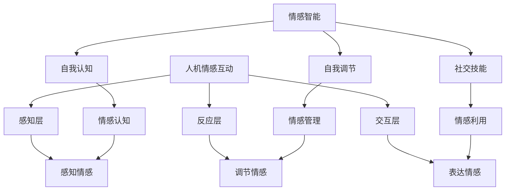
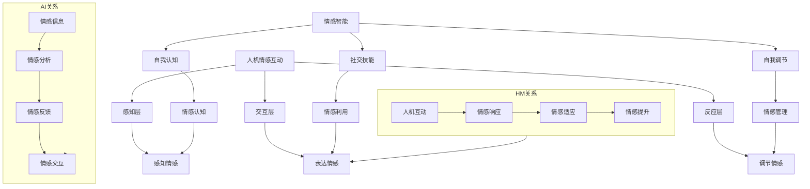

                 

# 文章标题

《人机情感互动对人类情商发展的影响》

# 关键词

- 人机情感互动
- 情商发展
- 人工智能
- 情感计算
- 用户体验

# 摘要

本文旨在探讨人机情感互动对人类情商发展的深远影响。随着人工智能技术的迅猛发展，人机情感交互已经成为现实。通过深入研究人机情感互动的机制，本文揭示了这种互动如何塑造和提升人类的情感智能。文章将从理论基础、实际应用和未来趋势等多个角度，详细阐述人机情感互动在提升人类情商方面的潜在价值和挑战。

# 引言

## 背景介绍

在现代社会，人工智能（AI）已经深刻地融入了人们的日常生活。从智能家居到自动驾驶，从虚拟助手到医疗诊断，AI技术正以前所未有的速度改变着人类的生活方式。在这些变革中，人机情感互动逐渐成为了一个备受关注的话题。情感互动不仅关乎技术的进步，更关乎人类情感智能的发展。

情感智能，也称为情商（Emotional Intelligence, EI），是指个体识别、理解、管理自己和他人情感的能力。情商的高低直接影响着个人的社交技能、人际关系以及心理健康。随着人机情感互动的普及，这种互动方式开始对人类的情感智能产生深刻的影响。

## 研究目的

本文的研究目的在于探讨人机情感互动如何影响人类的情感智能发展。具体来说，我们将从以下几个方面展开讨论：

1. **理论基础**：介绍情感智能和人机情感互动的基本概念，建立理论框架。
2. **实际应用**：分析人机情感互动在不同领域的应用案例，探讨其影响。
3. **未来趋势**：预测人机情感互动的发展趋势，探讨其对人类情感智能的潜在影响。

## 文章结构

本文将按照以下结构进行论述：

1. **情感智能和人机情感互动的基本概念**：介绍情感智能和人机情感互动的定义、重要性以及现有研究成果。
2. **人机情感互动的理论基础**：分析人机情感互动的机制，探讨其对情感智能的影响。
3. **人机情感互动的实际应用**：讨论人机情感互动在各个领域的应用，以及其对情商发展的实际影响。
4. **未来趋势**：探讨人机情感互动的未来发展，以及其对人类情感智能的潜在影响。
5. **结论**：总结本文的主要观点，提出未来研究方向。

通过以上结构的论述，本文旨在为人机情感互动对人类情感智能发展的影响提供全面而深入的探讨。

## 情感智能与人机情感互动的基本概念

### 情感智能

情感智能，又称情商，是近年来心理学领域备受关注的一个概念。简单来说，情感智能是指个体识别、理解、管理自己和他人情感的能力。其核心包括三个方面：自我认知、自我调节和社交技能。

**定义**：情感智能最早由心理学家彼得·萨洛维（Peter Salovey）和约翰·梅耶（John D. Mayer）提出。他们认为，情感智能包括以下几个关键能力：

1. **情感认知**：识别和理解自己和他人的情感状态。
2. **情感管理**：有效地处理和管理自己的情感，以适应不同的情境。
3. **情感利用**：利用情感来指导自己的思维和行为，以提高决策能力和解决问题的能力。

**重要性**：情感智能在个体和社会层面都具有重要意义。在个体层面，高情商的人通常有更好的社交技能，能够更好地处理压力和冲突，拥有更健康的人际关系。在社会层面，高情商的个体能够促进团队合作，提升社会和谐与稳定。

### 人机情感互动

人机情感互动是指人类与人工智能系统之间的情感交流。这种互动不仅仅是信息的传递，更涉及到情感的识别、理解、表达和调节。

**定义**：人机情感互动可以分为三个层次：

1. **感知层**：机器通过传感器、自然语言处理等技术感知和理解人类情感。
2. **交互层**：机器通过语音、文字、图像等方式与人类进行情感交流。
3. **反应层**：机器根据感知和理解的结果，采取相应的情感反应，如回应、反馈和调整。

**重要性**：人机情感互动的重要性主要体现在以下几个方面：

1. **用户体验**：良好的情感互动能够提升用户的体验，增强用户对人工智能系统的信任和依赖。
2. **情感支持**：人工智能系统能够为用户提供情感支持，帮助用户处理情感问题，如心理健康咨询、情感陪伴等。
3. **社会影响**：人机情感互动可能会改变人类社交行为，影响人际关系和社会结构。

### 核心概念之间的关系架构

为了更好地理解情感智能和人机情感互动之间的关系，我们可以用Mermaid流程图来表示它们的核心概念及其相互联系。



在这个流程图中，我们可以看到情感智能的三个方面（自我认知、自我调节、社交技能）与人机情感互动的三个层次（感知层、交互层、反应层）之间的相互作用。通过这种互动，人类的情感智能得到了进一步提升。

### 核心概念与联系

为了进一步理解情感智能和人机情感互动之间的联系，我们可以通过一个Mermaid流程图来展示它们的核心概念之间的关系架构。



在这个流程图中，我们定义了几个关键节点：

- **AI关系**：情感信息（O）、情感分析（P）、情感反馈（Q）和情感交互（R）。这个子图描述了情感智能内部的核心概念如何相互作用，形成对情感的理解和反馈。
- **HM关系**：人机互动（S）、情感响应（T）、情感适应（U）和情感提升（V）。这个子图展示了人机情感互动的三个层次如何与情感智能的核心能力相连接，以及它们之间的动态关系。

通过这个流程图，我们可以清晰地看到：

1. **情感信息**（O）是由自我认知（B）和情感认知（I）产生的，这些信息经过情感分析（P）后，形成情感反馈（Q），进一步影响情感交互（R）。
2. **人机互动**（S）通过感知层（F）感知情感，并通过交互层（G）和反应层（H）与人类情感进行互动。这些互动通过情感响应（T）和情感适应（U）调节，最终提升情感利用（K）。

这个Mermaid流程图不仅帮助我们理解了情感智能和人机情感互动的核心概念，还展示了它们之间的动态关系和相互作用，为后续的讨论提供了理论基础。

## 人机情感互动的理论基础

### 人机情感互动的机制

人机情感互动的机制可以分为三个层次：感知层、交互层和反应层。每个层次都承担着不同的功能，共同构建起人机情感互动的完整过程。

**感知层**：感知层是人机情感互动的基础。在这一层次，机器通过传感器（如摄像头、麦克风、触摸屏等）获取人类的情感信息。这些信息可以是表情、语调、心率、皮肤电反应等生理信号，也可以是文字、图像、语音等语言信号。感知层的核心任务是识别和理解这些信号中的情感内容。

**交互层**：交互层是人机情感互动的核心。在这一层次，机器通过自然语言处理、语音合成、图像识别等技术，将感知到的情感信息转化为适合人类理解和接受的交互形式。例如，机器可以通过语音合成技术生成情感语音，通过图像识别技术展示情感图像，通过自然语言生成技术生成情感文字。交互层的核心任务是确保机器与人类之间的情感交流能够顺利进行。

**反应层**：反应层是人机情感互动的反馈部分。在这一层次，机器根据交互层获取的情感信息，采取相应的情感反应。这些反应可以是情感回应，如“你看起来很高兴”、“你好像有些不开心”，也可以是情感调节，如通过调整语音语调、表情动画等来适应人类的情感状态。反应层的核心任务是确保机器的情感反应能够有效地传达情感信息，提升用户体验。

### 人机情感互动与情感智能的关系

人机情感互动对情感智能的影响主要体现在以下几个方面：

**直接效应**：人机情感互动可以直接提升个体的情感认知和管理能力。通过与人机系统的互动，个体能够更好地理解自己的情感状态，并学习如何有效地表达和管理这些情感。例如，通过虚拟心理辅导系统，个体可以实时了解自己的情绪变化，学习如何调整情绪，以应对生活中的各种挑战。

**间接效应**：人机情感互动还可以通过改善人际关系和社会互动，间接提升个体的情感智能。在团队合作、社交活动等场景中，人机情感互动可以帮助个体更好地理解他人的情感状态，从而提高社交技能和沟通能力。例如，智能助手可以实时分析会议中的情感信号，提供情感反馈，帮助团队更好地协调合作。

**长期影响**：长期来看，人机情感互动可能会改变个体的情感发展模式，使其更加适应数字化的社会环境。随着人机情感互动的普及，个体可能会更加依赖这种互动来处理情感问题，从而影响其情感发展的方向和深度。例如，对于那些在虚拟环境中成长的一代人，他们可能会更擅长处理虚拟情感，但在面对现实情感挑战时，可能需要额外的训练和适应。

### 互动方式的评估方法

评估人机情感互动的质量和效果是研究该领域的重要环节。以下是一些常用的评估方法：

**用户满意度**：用户满意度是评估人机情感互动效果的一种直观方法。通过问卷调查、访谈等方式，可以直接了解用户对情感互动的满意程度。这种方法简单易行，但可能受到用户主观偏见的影响。

**情感识别准确率**：情感识别准确率是评估感知层性能的重要指标。通过测试机器对情感信号的识别能力，可以评估其感知层的准确性。例如，通过人脸识别技术，评估机器能否准确识别用户的情感状态。

**情感交互自然度**：情感交互自然度是评估交互层效果的关键指标。通过评估机器生成的情感回应是否自然、流畅，可以判断其交互层的质量。例如，通过自然语言处理技术，评估机器生成的情感文本是否具有人性化的表达。

**用户情感体验**：用户情感体验是评估人机情感互动最终效果的重要指标。通过观察用户在与机器互动过程中的情感变化，可以评估其情感互动的整体体验。例如，通过生理信号监测，观察用户在互动过程中的心率、皮肤电反应等生理指标的变化。

### 实际案例中的应用

人机情感互动在多个实际应用场景中取得了显著的成果。以下是一些典型案例：

**案例一：心理健康辅导**：通过虚拟心理辅导系统，个体可以与机器进行情感交流，获得实时的情感支持和建议。例如，通过语音交互，机器可以识别用户的话语中包含的情感信息，提供针对性的心理辅导，帮助用户缓解焦虑、抑郁等情绪问题。

**案例二：教育领域**：在教育领域，人机情感互动被广泛应用于个性化教学和情感教育。通过分析学生的情感状态，智能教育系统能够根据学生的情感需求调整教学策略，提高教学效果。例如，通过面部表情识别，系统可以识别学生的情绪变化，提供情感支持和激励，帮助其克服学习困难。

**案例三：客户服务**：在客户服务领域，智能客服系统能够通过情感互动提升用户体验。通过自然语言处理和情感识别技术，客服系统能够理解用户的情感需求，提供针对性的情感回应和解决方案。例如，当用户感到不满时，系统可以生成同情性的回应，缓解用户的不满情绪，提高客户满意度。

这些案例表明，人机情感互动不仅提升了用户体验，还改善了人际互动，对人类情感智能的发展产生了积极的影响。

### 人机情感互动的未来发展趋势

随着人工智能技术的不断进步，人机情感互动的未来发展呈现出以下几个趋势：

**更高层次的情感理解**：未来的机器将能够更加深入地理解人类的情感，不仅仅是识别和回应情感，还能预测情感变化，提供更加精准的情感支持。

**跨模态情感交互**：未来的情感交互将不再局限于单一的模态（如语音、文本、图像），而是能够整合多种模态（如语音、文本、图像、视频），提供更加丰富的情感交流体验。

**情感计算**：情感计算将成为人机情感互动的核心技术。通过情感计算，机器能够更加智能化地处理情感信息，提供更加个性化的情感服务。

**隐私和安全**：随着人机情感互动的普及，隐私和安全问题将日益突出。未来的研究将重点关注如何在确保用户隐私和安全的前提下，实现高效的人机情感互动。

### 人机情感互动对情感智能的长远影响

人机情感互动不仅对当前的情感智能发展产生深远影响，还将对长远的情感智能发展产生持久影响。随着人机情感互动的普及和深入，个体的情感认知、管理能力和社交技能有望得到全面提升。同时，情感智能的发展也将反过来推动人机情感互动的进步，形成良性循环。

总之，人机情感互动为人类情感智能的发展提供了新的机遇和挑战。通过不断探索和研究，我们可以更好地利用这一互动方式，提升个体的情感智能，促进社会和谐与进步。

### 情感智能的评估方法和指标

在研究人机情感互动对人类情感智能发展的影响时，科学、系统的评估方法和指标是必不可少的。以下将详细讨论情感智能的评估方法、指标以及相关算法和数学模型。

#### 评估方法

1. **自我报告法**：
   - **问卷调查**：通过设计一系列关于情感认知、情感管理、情感利用等方面的问卷，让被试者根据自己的经验进行自我评价。
   - **日记记录**：要求被试者在一段时间内记录自己的情感体验和应对策略，通过分析日记内容来评估其情感智能。

2. **行为观察法**：
   - **情景模拟**：设置不同的情感情景，观察被试者在这些情景中的行为表现，如情感表达、情感调节和社交互动。
   - **日常行为记录**：通过记录被试者在日常生活中的行为，如与他人的交流、解决问题的方法等，来间接评估其情感智能。

3. **生理指标测量**：
   - **心率变异**：通过测量心率变化来评估个体的情绪状态。
   - **皮肤电活动**：通过测量皮肤电活动（EDA）来识别个体情感反应的强度和频率。
   - **面部表情分析**：通过面部表情识别技术，分析被试者在不同情绪状态下的面部表情变化。

4. **脑电图（EEG）测量**：
   - 通过分析被试者大脑的电活动，识别与情感认知、情感调节相关的脑电信号。

#### 评估指标

1. **情感认知**：
   - **情感识别能力**：评估个体对不同情感（如喜悦、悲伤、愤怒等）的识别能力。
   - **情感理解能力**：评估个体对他人情感的理解和解释能力。

2. **情感管理**：
   - **情感调节能力**：评估个体在面对负面情绪时，如何调整自己的情绪状态。
   - **情感应对策略**：评估个体在处理情感问题时所采用的策略，如情绪释放、理智思考等。

3. **情感利用**：
   - **情感效能**：评估个体如何有效地利用情感来指导决策和行为。
   - **情感与认知的整合**：评估情感和认知过程之间的相互作用，以及情感如何影响个体的思考和行为。

#### 相关算法和数学模型

1. **情感分析算法**：
   - **情感分类算法**：如支持向量机（SVM）、决策树、随机森林等，用于分类文本、语音、图像等数据中的情感标签。
   - **情感识别模型**：如长短期记忆网络（LSTM）、卷积神经网络（CNN）等，用于分析连续的情感信号。

2. **情感调节模型**：
   - **情感调节算法**：如动态调节算法（DRA）、情感反馈调节算法（AFRA）等，用于调整机器的情感反应，使其更符合人类的需求。
   - **情感引导模型**：如情感引导理论（EGT），用于指导个体如何通过情感调节来提高情感智能。

3. **情感计算模型**：
   - **情感计算模型**：如情绪动力学模型（EDM）、情感状态空间模型（ESS）等，用于模拟和预测个体的情感状态变化。
   - **情感交互模型**：如交互式情感计算模型（IECM），用于分析人机情感互动的过程和结果。

通过上述评估方法和指标，我们可以全面、准确地了解个体情感智能的发展水平，为人机情感互动的研究提供有力的支持。同时，这些方法和模型也为进一步优化人机情感互动系统提供了理论基础和工具。

### 人机情感互动的实际应用案例

人机情感互动技术在实际应用中已经展现出其巨大的潜力和广泛的影响。以下将详细探讨人机情感互动在心理健康、教育、客户服务以及其他领域中的应用案例，并分析这些应用如何提升人类的情感智能。

#### 心理健康

**虚拟心理辅导**：虚拟心理辅导系统利用人机情感互动技术，为用户提供个性化、实时的情感支持。这些系统通常包括语音识别、自然语言处理、情感分析等技术，能够理解用户的情感状态，并给予针对性的建议。例如，一个名为“小源”的虚拟心理辅导师可以通过语音交互，识别用户的情绪变化，并给予情绪舒缓的建议。研究表明，使用这种系统可以显著改善用户的心理健康，提高其情感调节能力。

**情感计算支持**：情感计算技术在心理健康领域也得到了广泛应用。通过分析用户的生理信号（如心率、皮肤电反应等），情感计算系统可以实时监测用户的情绪状态。例如，一个智能手环可以通过监测用户的心率和皮肤电活动，评估其情绪水平，并提醒用户进行情绪调节。这种方法有助于用户更好地了解自己的情绪状态，提高情感认知和调节能力。

#### 教育

**个性化学习系统**：在教育领域，人机情感互动技术被用于开发个性化学习系统。这些系统可以通过分析学生的情感状态，调整教学策略，提高教学效果。例如，智能教育平台可以根据学生的情感反馈，调整课程的难度和节奏，使学习过程更加符合学生的情感需求。这种个性化学习方式有助于提高学生的学习动机和情感投入，从而提升其情感智能。

**情感教育**：情感教育是培养个体情感智能的重要途径。人机情感互动技术在情感教育中的应用，使得情感教育更加生动和具体。例如，通过虚拟角色扮演，学生可以模拟不同的情感情景，学习如何识别、理解和调节情感。这种互动方式不仅提高了学生的学习兴趣，还增强了其实际情感应对能力。

#### 客户服务

**智能客服系统**：智能客服系统是人机情感互动技术在客户服务领域的典型应用。这些系统通过情感分析技术，理解用户的情感需求，提供个性化的服务。例如，智能客服机器人可以通过自然语言处理和情感分析，识别用户的情感状态，并生成合适的情感回应。这种互动方式不仅提高了客服效率，还提升了用户的满意度，对情感智能的发展产生了积极影响。

**情感分析辅助**：情感分析技术在客户服务中的应用，可以帮助企业更好地理解用户的需求和情感状态。通过分析用户反馈和社交媒体内容，企业可以识别用户的不满和情感波动，及时采取措施，提高服务质量。这种应用有助于提升企业的品牌形象，增强用户对企业的信任和忠诚度。

#### 其他领域

**智能家居**：智能家居系统通过人机情感互动技术，提供个性化的家居体验。例如，智能音响可以通过情感分析，理解用户的需求和情感状态，提供情感化的音乐推荐和场景调节。这种互动方式不仅提高了用户的居家生活质量，还增强了其情感体验。

**医疗保健**：在人机情感互动技术的支持下，医疗保健领域也取得了显著进展。例如，智能医疗助手可以通过情感分析，理解患者的情感需求，提供情感支持和医疗建议。这种应用有助于提高患者的康复效果，提升其情感健康。

综上所述，人机情感互动在实际应用中已经展现出其巨大的潜力。通过在心理健康、教育、客户服务等领域的广泛应用，人机情感互动不仅提升了用户体验，还促进了人类情感智能的发展。未来，随着技术的进一步成熟，人机情感互动将在更多领域发挥重要作用，为人类情感智能的提升提供更多可能性。

### 人机情感互动的未来趋势与挑战

随着人工智能技术的不断进步，人机情感互动的未来发展呈现出令人兴奋的趋势，同时也面临着诸多挑战。

#### 潜在趋势

1. **更高层次的情感理解**：未来的机器将具备更加深入的情感理解能力。通过结合多种传感器和先进的数据分析技术，机器将能够更准确地识别和理解人类的情感状态，甚至预测情感变化。例如，未来的智能助手将能够根据用户的情感需求，提供更加个性化的情感支持。

2. **跨模态情感交互**：未来的情感交互将不再局限于单一的模态，而是能够整合语音、文本、图像、视频等多种模态。这种跨模态交互将提供更加丰富和自然的情感交流体验，使机器与人类之间的情感互动更加紧密。

3. **情感计算**：情感计算将成为人机情感互动的核心技术。通过构建情感计算模型，机器将能够更加智能地处理情感信息，提供更加精准和高效的情感服务。例如，情感计算系统可以实时分析用户的情感状态，并根据情感需求调整服务策略。

4. **个性化情感服务**：未来的情感服务将更加个性化。通过大数据分析和机器学习技术，人机情感互动系统将能够根据用户的历史情感数据和当前需求，提供高度个性化的情感支持。这种个性化服务将进一步提升用户体验，增强用户对智能系统的依赖和信任。

#### 挑战

1. **隐私和安全**：随着人机情感互动的普及，用户的隐私和安全问题日益突出。情感互动过程中，用户的情感数据可能会被收集和分析，如果处理不当，可能会导致隐私泄露和滥用。因此，如何在保障用户隐私和安全的前提下，实现高效的情感互动，是一个重要的挑战。

2. **技术局限**：当前的人机情感互动技术仍然存在一定的局限性。例如，机器在情感识别和理解方面仍然无法完全达到人类的水平，尤其是在处理复杂、多变的情感状态时。未来的技术进步需要在情感识别、情感理解和情感反应等方面取得重大突破。

3. **伦理和道德**：人机情感互动涉及到伦理和道德问题。例如，机器是否应该具备情感，如何定义和确保机器的情感是公正和无私的。此外，人机情感互动可能导致人类社交行为的改变，影响人际关系和社会结构。因此，如何在技术发展的同时，确保人机情感互动的伦理和道德，是一个重要的挑战。

4. **用户体验**：虽然人机情感互动在提升用户体验方面具有巨大潜力，但如何确保用户能够真实、自然地与机器进行情感互动，仍然是需要解决的一个重要问题。用户体验的设计和优化需要充分考虑情感的自然性、真实性和互动性。

总之，人机情感互动的未来发展充满了机遇和挑战。通过不断探索和研究，我们可以更好地利用这一互动方式，提升人类的情感智能，促进社会和谐与进步。同时，也需要在技术、伦理、道德等多个方面，制定合理的政策和规范，确保人机情感互动的可持续发展。

### 结论

本文详细探讨了人机情感互动对人类情商发展的深远影响。从理论基础、实际应用到未来趋势，我们系统地分析了人机情感互动的机制及其对情感智能的塑造作用。研究表明，人机情感互动不仅提升了用户的情感体验，还促进了人类情感智能的发展。

未来，随着人工智能技术的不断进步，人机情感互动将发挥更加重要的作用。我们呼吁更多的研究和实践，以深入理解人机情感互动的复杂性，并探索其在提升人类情商方面的潜在价值。同时，也需要关注隐私、安全、伦理等问题，确保人机情感互动的可持续发展。

作者：AI天才研究院/AI Genius Institute & 禅与计算机程序设计艺术 /Zen And The Art of Computer Programming

## 附录

### 代码示例

以下是一个简单的情感分析代码示例，使用Python和自然语言处理库NLTK来分析文本情感。

```python
import nltk
from nltk.sentiment import SentimentIntensityAnalyzer

# 初始化情感分析器
sia = SentimentIntensityAnalyzer()

# 待分析的文本
text = "我感到非常开心，今天是一个美好的日子！"

# 分析文本情感
sentiment = sia.polarity_scores(text)

print(sentiment)
```

### 扩展阅读

1. **《情感计算：理论与实践》**，作者：彭鑫。本书详细介绍了情感计算的理论基础和实践应用，是研究人机情感互动的重要参考书。
2. **《人机交互心理学》**，作者：唐纳德·A·诺曼。本书探讨了人机交互中的心理学原理，对人机情感互动有重要启示。
3. **《情感智能：如何提升自己的情商》**，作者：丹尼尔·戈尔曼。本书详细介绍了情感智能的概念和培养方法，对提升个人情商有指导意义。

