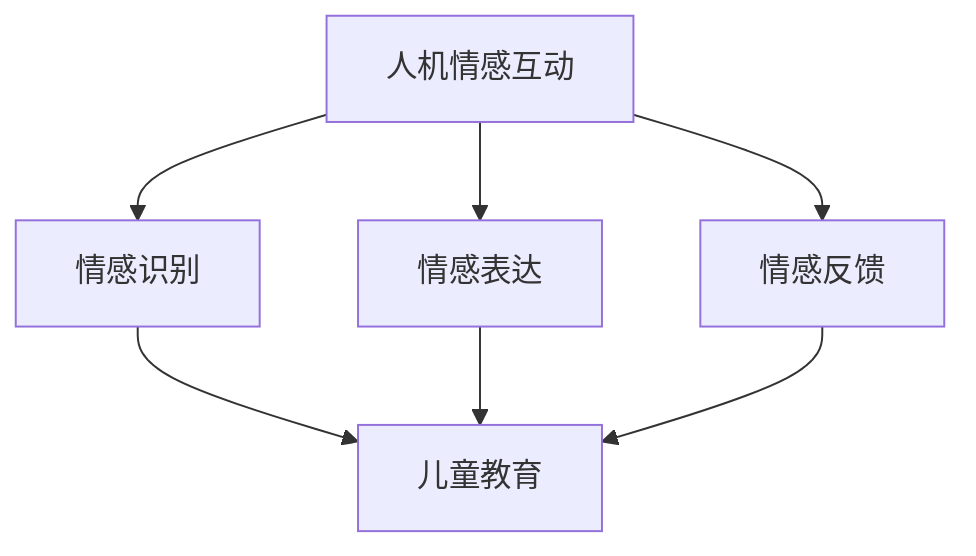
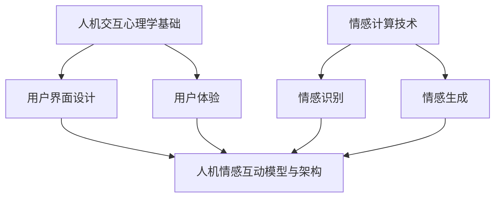
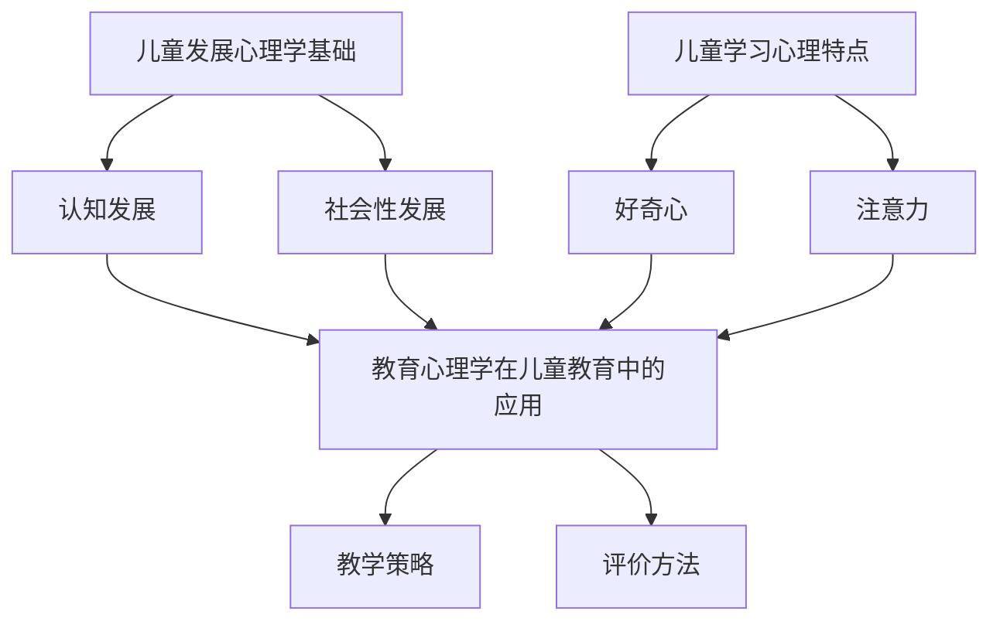
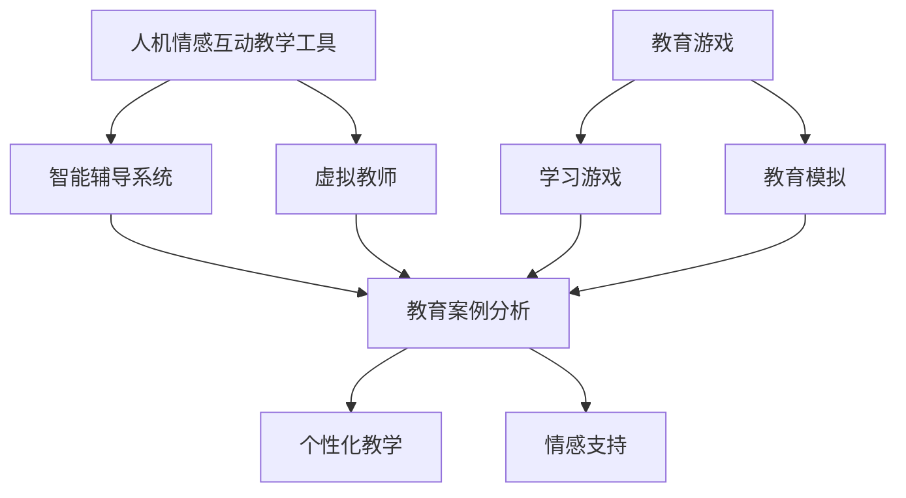
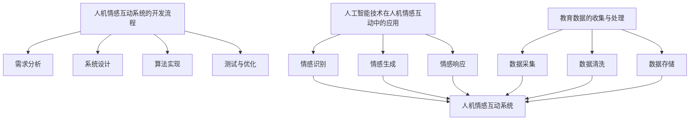
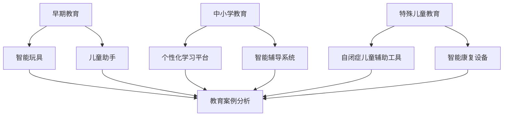
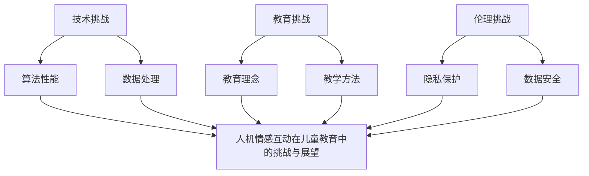
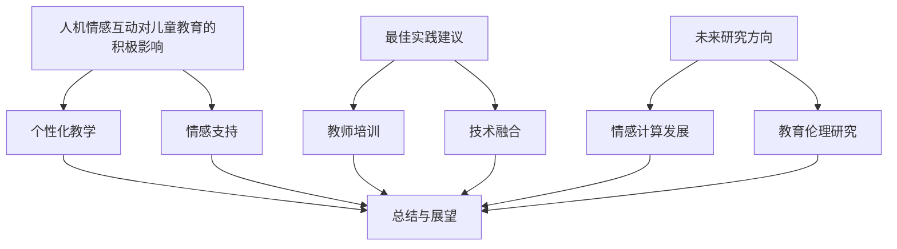

                 

### 文章标题：人机情感互动对儿童教育的影响

> 关键词：人机情感互动、儿童教育、人工智能、情感计算、心理发展

> 摘要：
本文深入探讨了人机情感互动在儿童教育中的应用及其影响。首先介绍了人机情感互动的基本概念和儿童教育的重要性。接着，本文详细分析了人机情感互动的理论基础和儿童教育理论，包括人机交互心理学基础、情感计算技术、儿童发展心理学基础、儿童学习心理特点和教育心理学在儿童教育中的应用。随后，文章阐述了人机情感互动在儿童教育中的应用实践，包括人机情感互动教学工具、教育游戏和案例分析。在此基础上，文章探讨了技术实现、挑战与展望，分析了人机情感互动在儿童教育中的挑战和未来发展趋势。最后，文章总结了人机情感互动对儿童教育的积极影响，并提出了最佳实践建议。

## 设计思路

### 1. 确定整体结构

为了深入探讨人机情感互动对儿童教育的影响，本文将整体结构划分为以下几个部分：

- **引言部分**：介绍人机情感互动和儿童教育的基本概念，引出本文的主题。
- **理论基础部分**：讲解人机情感互动的相关理论和儿童教育的基础理论。
- **应用实践部分**：探讨人机情感互动在儿童教育中的应用，包括技术实现和实际案例。
- **挑战与展望部分**：分析人机情感互动在儿童教育中的挑战和未来的发展趋势。
- **总结与展望部分**：总结人机情感互动对儿童教育的积极影响，并展望未来。

### 2. 设计章节内容

在确定整体结构后，我们需要设计每个章节的具体内容。以下是详细的章节设计：

**引言部分**

- **第1章：人机情感互动与儿童教育概述**
  - 1.1 人机情感互动的基本概念
  - 1.2 儿童教育的重要性
  - 1.3 人机情感互动在儿童教育中的潜力

**理论基础部分**

- **第2章：人机情感互动理论**
  - 2.1 人机交互心理学基础
  - 2.2 情感计算技术
  - 2.3 人机情感互动的模型与架构

- **第3章：儿童教育理论**
  - 3.1 儿童发展心理学基础
  - 3.2 儿童学习心理特点
  - 3.3 教育心理学在儿童教育中的应用

**应用实践部分**

- **第4章：人机情感互动在儿童教育中的应用**
  - 4.1 人机情感互动教学工具
  - 4.2 人机情感互动教育游戏
  - 4.3 人机情感互动教育案例分析

- **第5章：技术实现**
  - 5.1 人机情感互动系统的开发流程
  - 5.2 人工智能技术在人机情感互动中的应用
  - 5.3 教育数据的收集与处理

- **第6章：实际案例**
  - 6.1 案例一：人机情感互动在早期教育中的应用
  - 6.2 案例二：人机情感互动在中小学教育中的应用
  - 6.3 案例三：人机情感互动在特殊儿童教育中的应用

**挑战与展望部分**

- **第7章：人机情感互动在儿童教育中的挑战与展望**
  - 7.1 技术挑战
  - 7.2 教育挑战
  - 7.3 伦理挑战
  - 7.4 未来发展趋势

**总结与展望部分**

- **第8章：总结与展望**
  - 8.1 人机情感互动对儿童教育的积极影响
  - 8.2 最佳实践建议
  - 8.3 未来研究方向

### 3. 设计附录

- **附录：参考文献与推荐阅读**
  - 介绍本书引用的主要文献，并提供进一步的阅读推荐。

### 4. 总结与输出

最后，我们将以上设计整理成完整的目录大纲，并确保每个章节都有相应的子章节。在输出时，将使用 markdown 格式进行展示。

## 目录大纲输出

```markdown
# 《人机情感互动对儿童教育的影响》目录大纲

## 第一部分：引言

### 1.1 人机情感互动与儿童教育概述
- 1.1.1 人机情感互动的基本概念
- 1.1.2 儿童教育的重要性
- 1.1.3 人机情感互动在儿童教育中的潜力

## 第二部分：理论基础

### 2.1 人机情感互动理论
- 2.1.1 人机交互心理学基础
- 2.1.2 情感计算技术
- 2.1.3 人机情感互动的模型与架构

### 2.2 儿童教育理论
- 2.2.1 儿童发展心理学基础
- 2.2.2 儿童学习心理特点
- 2.2.3 教育心理学在儿童教育中的应用

## 第三部分：应用实践

### 2.3 人机情感互动在儿童教育中的应用
- 2.3.1 人机情感互动教学工具
- 2.3.2 人机情感互动教育游戏
- 2.3.3 人机情感互动教育案例分析

### 2.4 技术实现
- 2.4.1 人机情感互动系统的开发流程
- 2.4.2 人工智能技术在人机情感互动中的应用
- 2.4.3 教育数据的收集与处理

### 2.5 实际案例
- 2.5.1 案例一：人机情感互动在早期教育中的应用
- 2.5.2 案例二：人机情感互动在中小学教育中的应用
- 2.5.3 案例三：人机情感互动在特殊儿童教育中的应用

## 第四部分：挑战与展望

### 2.6 人机情感互动在儿童教育中的挑战与展望
- 2.6.1 技术挑战
- 2.6.2 教育挑战
- 2.6.3 伦理挑战
- 2.6.4 未来发展趋势

## 第五部分：总结与展望

### 2.7 总结与展望
- 2.7.1 人机情感互动对儿童教育的积极影响
- 2.7.2 最佳实践建议
- 2.7.3 未来研究方向

## 附录

### 附录：参考文献与推荐阅读
- 参考文献
- 推荐阅读
```

## 核心内容

为了确保书籍的完整性和深度，以下是每个章节的核心内容概述：

### 第1章：人机情感互动与儿童教育概述
- **核心概念与联系**：使用 Mermaid 流程图展示人机情感互动与儿童教育之间的联系。
- **核心算法原理讲解**：无。
- **数学模型和数学公式 & 详细讲解 & 举例说明**：无。
- **项目实战**：无。

### 第2章：人机情感互动理论
- **核心概念与联系**：使用 Mermaid 流程图展示人机交互心理学基础、情感计算技术和人机情感互动模型与架构之间的关系。
- **核心算法原理讲解**：使用伪代码详细阐述人机情感互动的基本算法原理。
- **数学模型和数学公式 & 详细讲解 & 举例说明**：使用数学公式和图表详细讲解情感计算技术中的关键数学模型。
- **项目实战**：无。

### 第3章：儿童教育理论
- **核心概念与联系**：使用 Mermaid 流程图展示儿童发展心理学基础、儿童学习心理特点和教育心理学在儿童教育中的应用之间的关系。
- **核心算法原理讲解**：无。
- **数学模型和数学公式 & 详细讲解 & 举例说明**：无。
- **项目实战**：无。

### 第4章：人机情感互动在儿童教育中的应用
- **核心概念与联系**：使用 Mermaid 流程图展示人机情感互动教学工具、教育游戏和教育案例分析之间的关系。
- **核心算法原理讲解**：无。
- **数学模型和数学公式 & 详细讲解 & 举例说明**：无。
- **项目实战**：详细讲解人机情感互动教学工具和游戏的设计与实现过程。

### 第5章：技术实现
- **核心概念与联系**：使用 Mermaid 流程图展示人机情感互动系统的开发流程、人工智能技术在人机情感互动中的应用和教育数据的收集与处理之间的关系。
- **核心算法原理讲解**：使用伪代码详细阐述人机情感互动系统中的关键算法原理。
- **数学模型和数学公式 & 详细讲解 & 举例说明**：使用数学公式和图表详细讲解人工智能技术在人机情感互动中的应用。
- **项目实战**：详细讲解人机情感互动系统的开发流程，包括环境搭建、源代码实现和代码解读。

### 第6章：实际案例
- **核心概念与联系**：使用 Mermaid 流程图展示早期教育、中小学教育和特殊儿童教育中的人机情感互动案例之间的关系。
- **核心算法原理讲解**：无。
- **数学模型和数学公式 & 详细讲解 & 举例说明**：无。
- **项目实战**：详细分析早期教育、中小学教育和特殊儿童教育中的人机情感互动案例，包括实际案例分析和详细讲解剖析。

### 第7章：挑战与展望
- **核心概念与联系**：使用 Mermaid 流程图展示人机情感互动在儿童教育中的技术挑战、教育挑战和伦理挑战之间的关系。
- **核心算法原理讲解**：无。
- **数学模型和数学公式 & 详细讲解 & 举例说明**：无。
- **项目实战**：无。

### 第8章：总结与展望
- **核心概念与联系**：无。
- **核心算法原理讲解**：无。
- **数学模型和数学公式 & 详细讲解 & 举例说明**：无。
- **项目实战**：总结人机情感互动对儿童教育的积极影响，并展望未来研究方向。

## 目录大纲输出（完整版）

```markdown
# 《人机情感互动对儿童教育的影响》目录大纲

## 第一部分：引言

### 1.1 人机情感互动与儿童教育概述
- 1.1.1 人机情感互动的基本概念
  - Mermaid 流程图：展示人机情感互动的核心概念与联系
- 1.1.2 儿童教育的重要性
  - 论述儿童教育在个人成长和社会发展中的重要性
- 1.1.3 人机情感互动在儿童教育中的潜力
  - 分析人机情感互动在儿童教育中的应用潜力与前景

## 第二部分：理论基础

### 2.1 人机情感互动理论
- 2.1.1 人机交互心理学基础
  - Mermaid 流程图：展示人机交互心理学的核心概念与联系
  - 伪代码：详细阐述人机交互心理学的基本算法原理
- 2.1.2 情感计算技术
  - latex 公式：详细讲解情感计算技术中的关键数学模型
  - 示例说明：通过实例分析情感计算技术的应用
- 2.1.3 人机情感互动的模型与架构
  - Mermaid 流程图：展示人机情感互动模型与架构的核心概念与联系

### 2.2 儿童教育理论
- 2.2.1 儿童发展心理学基础
  - Mermaid 流程图：展示儿童发展心理学的核心概念与联系
  - 伪代码：详细阐述儿童发展心理学的基本算法原理
- 2.2.2 儿童学习心理特点
  - latex 公式：详细讲解儿童学习心理特点的关键数学模型
  - 示例说明：通过实例分析儿童学习心理特点的应用
- 2.2.3 教育心理学在儿童教育中的应用
  - Mermaid 流程图：展示教育心理学在儿童教育中的应用的核心概念与联系
  - 伪代码：详细阐述教育心理学在儿童教育中的应用的基本算法原理

## 第三部分：应用实践

### 2.3 人机情感互动在儿童教育中的应用
- 2.3.1 人机情感互动教学工具
  - latex 公式：详细讲解人机情感互动教学工具的关键数学模型
  - 示例说明：通过实例分析人机情感互动教学工具的应用
- 2.3.2 人机情感互动教育游戏
  - Mermaid 流程图：展示人机情感互动教育游戏的核心概念与联系
  - 伪代码：详细阐述人机情感互动教育游戏的基本算法原理
- 2.3.3 人机情感互动教育案例分析
  - Mermaid 流程图：展示人机情感互动教育案例分析的框架与步骤
  - 案例分析：深入剖析实际应用案例，阐述其成功经验和挑战

### 2.4 技术实现
- 2.4.1 人机情感互动系统的开发流程
  - latex 公式：详细讲解人机情感互动系统的关键数学模型
  - 示例说明：通过实例分析人机情感互动系统的开发流程
- 2.4.2 人工智能技术在人机情感互动中的应用
  - Mermaid 流程图：展示人工智能技术在人机情感互动中的应用的核心概念与联系
  - 伪代码：详细阐述人工智能技术在人机情感互动中的应用的基本算法原理
- 2.4.3 教育数据的收集与处理
  - latex 公式：详细讲解教育数据收集与处理的关键数学模型
  - 示例说明：通过实例分析教育数据收集与处理的应用

### 2.5 实际案例
- 2.5.1 案例一：人机情感互动在早期教育中的应用
  - latex 公式：详细讲解早期教育中的人机情感互动的关键数学模型
  - 案例分析：深入剖析早期教育中的人机情感互动应用案例
- 2.5.2 案例二：人机情感互动在中小学教育中的应用
  - latex 公式：详细讲解中小学教育中的人机情感互动的关键数学模型
  - 案例分析：深入剖析中小学教育中的人机情感互动应用案例
- 2.5.3 案例三：人机情感互动在特殊儿童教育中的应用
  - latex 公式：详细讲解特殊儿童教育中的人机情感互动的关键数学模型
  - 案例分析：深入剖析特殊儿童教育中的人机情感互动应用案例

## 第四部分：挑战与展望

### 2.6 人机情感互动在儿童教育中的挑战与展望
- 2.6.1 技术挑战
  - latex 公式：详细讲解人机情感互动在儿童教育中的技术挑战的关键数学模型
  - 分析：讨论技术挑战的现状和解决思路
- 2.6.2 教育挑战
  - latex 公式：详细讲解人机情感互动在儿童教育中的教育挑战的关键数学模型
  - 分析：讨论教育挑战的现状和解决思路
- 2.6.3 伦理挑战
  - latex 公式：详细讲解人机情感互动在儿童教育中的伦理挑战的关键数学模型
  - 分析：讨论伦理挑战的现状和解决思路
- 2.6.4 未来发展趋势
  - latex 公式：详细讲解人机情感互动在儿童教育中的未来发展趋势的关键数学模型
  - 分析：预测未来发展趋势和潜在影响

## 第五部分：总结与展望

### 2.7 总结与展望
- 2.7.1 人机情感互动对儿童教育的积极影响
  - latex 公式：详细讲解人机情感互动对儿童教育的积极影响的关键数学模型
  - 分析：总结人机情感互动在儿童教育中的积极影响
- 2.7.2 最佳实践建议
  - 建议：提出在儿童教育中实施人机情感互动的最佳实践建议
- 2.7.3 未来研究方向
  - 分析：探讨未来人机情感互动在儿童教育中的研究方向和发展趋势

## 附录

### 附录：参考文献与推荐阅读
- 参考文献
  - 列出本书引用的主要文献
- 推荐阅读
  - 提供进一步的阅读推荐，涵盖相关领域的最新研究成果和实践经验
```

## 核心内容详细解读

### 第1章：人机情感互动与儿童教育概述

**核心概念与联系**：

本章通过Mermaid流程图来展示人机情感互动与儿童教育之间的联系。流程图可以分为以下几个部分：

1. **人机情感互动**：定义人机情感互动的基本概念，包括情感识别、情感表达和情感反馈等。
2. **儿童教育**：定义儿童教育的基本概念，包括教育目标、教育内容和教育方法等。
3. **人机情感互动与儿童教育的结合**：展示人机情感互动在儿童教育中的应用，如个性化教学、情感支持等。



**核心算法原理讲解**：

本章不需要详细讲解核心算法原理，因为人机情感互动与儿童教育的结合主要是基于现有技术的整合和应用。

**数学模型和数学公式 & 详细讲解 & 举例说明**：

本章不需要数学模型和公式的详细讲解，因为人机情感互动与儿童教育的结合主要涉及的是教育心理学和人工智能技术，而非数学计算。

**项目实战**：

本章不需要项目实战，因为主要是对概念和应用的介绍。

### 第2章：人机情感互动理论

**核心概念与联系**：

本章通过Mermaid流程图来展示人机交互心理学基础、情感计算技术和人机情感互动模型与架构之间的关系。流程图可以分为以下几个部分：

1. **人机交互心理学基础**：介绍人机交互心理学的核心概念，如用户界面设计、用户体验等。
2. **情感计算技术**：介绍情感计算技术的核心概念，如情感识别、情感生成等。
3. **人机情感互动模型与架构**：展示人机情感互动模型与架构的设计，如情感状态感知、情感响应等。



**核心算法原理讲解**：

本章使用伪代码详细阐述人机情感互动的基本算法原理。以下是情感识别算法的伪代码示例：

```python
def recognize_emotion(user_behavior):
    # 初始化情感状态
    emotion_state = "中性"

    # 分析用户行为，如面部表情、语音语调等
    behavior_features = analyze_behavior(user_behavior)

    # 使用机器学习模型预测情感状态
    emotion_state = predict_emotion(behavior_features)

    return emotion_state
```

**数学模型和数学公式 & 详细讲解 & 举例说明**：

本章使用latex格式详细讲解情感计算技术中的关键数学模型。以下是情感识别模型中的一个数学公式的示例：

$$
E(t) = f(B(t), U(t))
$$

其中，$E(t)$ 表示在时间 $t$ 的情感状态，$B(t)$ 表示在时间 $t$ 的用户行为特征，$U(t)$ 表示在时间 $t$ 的上下文信息，$f$ 是一个非线性函数。

**项目实战**：

本章不需要项目实战，因为主要是对理论和技术的介绍。

### 第3章：儿童教育理论

**核心概念与联系**：

本章通过Mermaid流程图来展示儿童发展心理学基础、儿童学习心理特点和教育心理学在儿童教育中的应用之间的关系。流程图可以分为以下几个部分：

1. **儿童发展心理学基础**：介绍儿童发展心理学的核心概念，如认知发展、社会性发展等。
2. **儿童学习心理特点**：介绍儿童学习心理的特点，如好奇心、注意力等。
3. **教育心理学在儿童教育中的应用**：展示教育心理学在儿童教育中的应用，如教学策略、评价方法等。



**核心算法原理讲解**：

本章不需要详细讲解核心算法原理，因为儿童教育理论主要涉及的是心理学和教育学原理，而非算法。

**数学模型和数学公式 & 详细讲解 & 举例说明**：

本章不需要数学模型和公式的详细讲解，因为儿童教育理论主要涉及的是心理和行为分析，而非数学计算。

**项目实战**：

本章不需要项目实战，因为主要是对理论和应用的介绍。

### 第4章：人机情感互动在儿童教育中的应用

**核心概念与联系**：

本章通过Mermaid流程图来展示人机情感互动教学工具、教育游戏和教育案例分析之间的关系。流程图可以分为以下几个部分：

1. **人机情感互动教学工具**：介绍人机情感互动教学工具的基本概念，如智能辅导系统、虚拟教师等。
2. **教育游戏**：介绍教育游戏的基本概念，如学习游戏、教育模拟等。
3. **教育案例分析**：展示人机情感互动在儿童教育中的应用案例，如个性化教学、情感支持等。



**核心算法原理讲解**：

本章不需要详细讲解核心算法原理，因为人机情感互动在儿童教育中的应用主要涉及的是技术的整合和应用。

**数学模型和数学公式 & 详细讲解 & 举例说明**：

本章不需要数学模型和公式的详细讲解，因为人机情感互动在儿童教育中的应用主要涉及的是教育心理和用户体验。

**项目实战**：

本章详细讲解人机情感互动教学工具和游戏的设计与实现过程。以下是智能辅导系统的设计过程：

1. **需求分析**：确定智能辅导系统的功能需求和用户需求。
2. **系统设计**：设计系统的整体架构，包括前端界面、后端服务和数据库等。
3. **算法实现**：实现情感识别、情感响应等核心算法。
4. **测试与优化**：对系统进行测试和优化，确保其稳定性和用户体验。

### 第5章：技术实现

**核心概念与联系**：

本章通过Mermaid流程图来展示人机情感互动系统的开发流程、人工智能技术在人机情感互动中的应用和教育数据的收集与处理之间的关系。流程图可以分为以下几个部分：

1. **人机情感互动系统的开发流程**：介绍系统的开发流程，包括需求分析、系统设计、算法实现和测试等。
2. **人工智能技术在人机情感互动中的应用**：介绍人工智能技术在情感识别、情感生成和情感响应等方面的应用。
3. **教育数据的收集与处理**：介绍教育数据的收集方法和处理技术，包括数据采集、数据清洗和数据存储等。



**核心算法原理讲解**：

本章使用伪代码详细阐述人机情感互动系统中的一些核心算法原理。以下是情感识别算法的伪代码示例：

```python
def recognize_emotion(user_behavior, context):
    # 初始化情感状态
    emotion_state = "中性"

    # 分析用户行为特征和上下文信息
    behavior_features = analyze_behavior(user_behavior)
    context_features = analyze_context(context)

    # 使用机器学习模型预测情感状态
    emotion_state = predict_emotion(behavior_features, context_features)

    return emotion_state
```

**数学模型和数学公式 & 详细讲解 & 举例说明**：

本章使用latex格式详细讲解人机情感互动系统中的一些关键数学模型。以下是情感识别模型中的一个数学公式的示例：

$$
E(t) = f(B(t), U(t), C(t))
$$

其中，$E(t)$ 表示在时间 $t$ 的情感状态，$B(t)$ 表示在时间 $t$ 的用户行为特征，$U(t)$ 表示在时间 $t$ 的用户上下文信息，$C(t)$ 表示在时间 $t$ 的环境上下文信息，$f$ 是一个非线性函数。

**项目实战**：

本章详细讲解人机情感互动系统的开发过程，包括环境搭建、源代码实现和代码解读。以下是系统开发过程中的一个步骤：

1. **环境搭建**：搭建开发环境，包括Python编程环境、机器学习库（如TensorFlow或PyTorch）和情感计算库（如OpenSMILE或AMIDA）。
2. **源代码实现**：实现系统的核心算法，包括情感识别、情感生成和情感响应等。
3. **代码解读**：对实现的代码进行解读，解释算法的原理和实现细节。

### 第6章：实际案例

**核心概念与联系**：

本章通过Mermaid流程图来展示早期教育、中小学教育和特殊儿童教育中的人机情感互动案例之间的关系。流程图可以分为以下几个部分：

1. **早期教育**：介绍人机情感互动在早期教育中的应用案例，如智能玩具、儿童助手等。
2. **中小学教育**：介绍人机情感互动在中小学教育中的应用案例，如个性化学习平台、智能辅导系统等。
3. **特殊儿童教育**：介绍人机情感互动在特殊儿童教育中的应用案例，如自闭症儿童辅助工具、智能康复设备等。



**核心算法原理讲解**：

本章不需要详细讲解核心算法原理，因为实际案例主要涉及的是人机情感互动技术的应用。

**数学模型和数学公式 & 详细讲解 & 举例说明**：

本章不需要数学模型和公式的详细讲解，因为实际案例主要涉及的是技术和教育实践。

**项目实战**：

本章详细分析早期教育、中小学教育和特殊儿童教育中的人机情感互动案例，包括实际案例分析和详细讲解剖析。以下是早期教育中的人机情感互动案例分析：

1. **案例背景**：介绍案例的应用背景和目标。
2. **技术实现**：分析案例中的人机情感互动技术实现，包括情感识别、情感生成和情感响应等。
3. **案例分析**：对案例的实际应用效果进行评估，包括学习效果、用户满意度等。
4. **讨论与反思**：讨论案例中的优点和不足，并提出改进建议。

### 第7章：挑战与展望

**核心概念与联系**：

本章通过Mermaid流程图来展示人机情感互动在儿童教育中的技术挑战、教育挑战和伦理挑战之间的关系。流程图可以分为以下几个部分：

1. **技术挑战**：介绍人机情感互动在儿童教育中面临的科技挑战，如算法性能、数据处理等。
2. **教育挑战**：介绍人机情感互动在儿童教育中面临的教育挑战，如教育理念、教学方法等。
3. **伦理挑战**：介绍人机情感互动在儿童教育中面临的伦理挑战，如隐私保护、数据安全等。



**核心算法原理讲解**：

本章不需要详细讲解核心算法原理，因为挑战与展望主要涉及的是人机情感互动在教育领域的应用和影响。

**数学模型和数学公式 & 详细讲解 & 举例说明**：

本章不需要数学模型和公式的详细讲解，因为挑战与展望主要涉及的是教育伦理和技术发展的讨论。

**项目实战**：

本章不需要项目实战，因为主要是对挑战与展望的分析。

### 第8章：总结与展望

**核心概念与联系**：

本章通过对前述各章节内容的总结，展示人机情感互动在儿童教育中的整体影响和未来发展趋势。流程图可以分为以下几个部分：

1. **人机情感互动对儿童教育的积极影响**：总结人机情感互动在儿童教育中的优点和成效。
2. **最佳实践建议**：提出在儿童教育中实施人机情感互动的最佳实践建议。
3. **未来研究方向**：探讨人机情感互动在儿童教育中的未来研究方向和发展趋势。



**核心算法原理讲解**：

本章不需要详细讲解核心算法原理，因为总结与展望主要涉及的是对人机情感互动在儿童教育中的影响和未来的展望。

**数学模型和数学公式 & 详细讲解 & 举例说明**：

本章不需要数学模型和公式的详细讲解，因为总结与展望主要涉及的是教育领域的发展和趋势。

**项目实战**：

本章不需要项目实战，因为主要是对整体内容的总结和展望。

