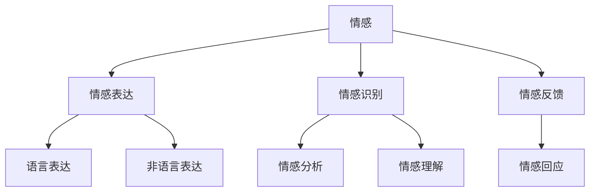
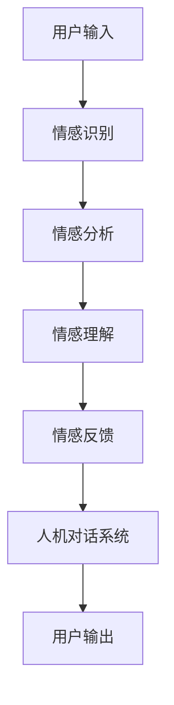
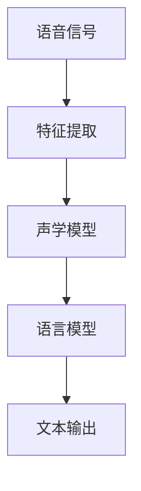
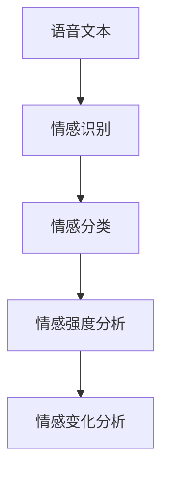
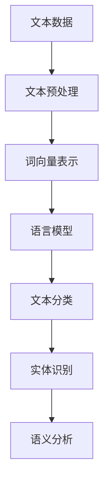
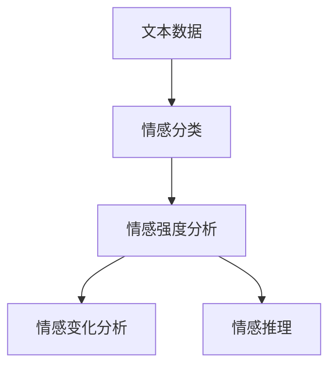
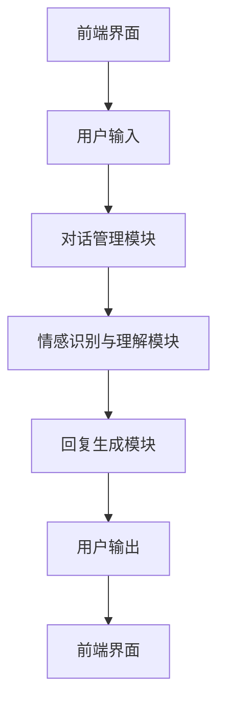
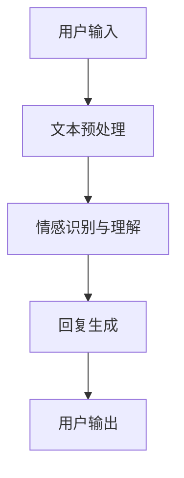

                 

### 文章标题：人机情感互通对语言进化的影响

关键词：人机情感互通、语言进化、情感识别、情感表达、自然语言处理

摘要：本文深入探讨了人机情感互通对语言进化产生的影响。通过分析人机情感互通的基本概念和理论基础，本文进一步探讨了人机情感互通对语言表达、理解和学习的影响，以及其在技术实现中的应用。同时，本文通过具体的案例研究，展示了人机情感互通在现实中的应用场景，为未来人机情感互通与语言进化研究提供了新的视角。

## 引言与背景

在人工智能迅速发展的今天，人机情感互通成为了一个备受关注的研究方向。情感是人类心理活动的重要组成部分，它不仅影响个体的情绪和行为，还对语言、思维和文化等产生深远的影响。因此，人机情感互通的研究不仅有助于我们更好地理解人类情感，也为人工智能的发展提供了新的可能性。

### 相关研究背景

近年来，人机情感互通的研究取得了显著的进展。在情感识别方面，研究者们通过深度学习、自然语言处理等技术，实现了对文本、语音和面部表情等情感信息的准确识别。在情感表达方面，研究者们通过自然语言生成、语音合成等技术，实现了对情感信息的准确表达。然而，当前的人机情感互通研究仍然存在一些挑战，如情感识别的准确率、情感理解的深度和广度等。

### 书籍结构概述

本书旨在系统地探讨人机情感互通对语言进化产生的影响。全书分为七个主要部分：

1. 引言与背景
2. 人机情感互通的概念与理论
3. 语言进化的基础
4. 人机情感互通对语言的影响
5. 人机情感互通的技术实现
6. 案例研究
7. 结论与展望

通过以上结构，本书将为人机情感互通与语言进化研究提供一个全面的视角。

## 人机情感互通的概念与理论

### 情感互通的基本概念

情感互通是指人与人之间或人与机器之间通过情感信息进行交流和理解的过程。情感信息包括情感表达、情感识别和情感反馈等。情感表达是指个体通过语言、表情、动作等方式传递情感信息；情感识别是指个体对他人情感信息的感知和理解；情感反馈是指个体对他人情感信息的回应。

### 人机情感互通的重要性

人机情感互通对于人工智能的发展具有重要意义。首先，情感互通能够提高人工智能的交互体验，使其更接近人类的交流方式。其次，情感互通能够帮助人工智能更好地理解人类的需求和情感，从而提供更个性化的服务。此外，情感互通还能够促进人机之间的合作和协作，为人类带来更多便利。

### 人机情感互通的理论基础

人机情感互通的理论基础主要包括情感理论、认知理论和沟通理论等。情感理论认为，情感是心理活动的重要组成部分，具有认知和动机功能。认知理论则强调情感与认知之间的相互作用，认为情感会影响个体的认知和行为。沟通理论则从交流的角度探讨了情感信息的传递和理解。

以下是情感互通的基本概念与联系的结构图：



### 核心算法原理讲解

在情感互通中，情感识别是一个关键步骤。情感识别通常包括情感分析、情感分类和情感预测等。以下是一个简单的情感识别算法的伪代码：

```plaintext
function 情感识别（文本）{
  // 输入文本，输出情感标签
  1. 预处理文本：去除停用词、分词、词性标注等；
  2. 使用情感分析模型进行情感分类；
  3. 返回情感标签。
}
```

### 数学模型和数学公式

情感识别通常涉及概率模型，如贝叶斯分类器、支持向量机（SVM）等。以下是一个基于贝叶斯分类器的情感识别模型的公式：

$$
P(情感|文本) = \frac{P(文本|情感) \cdot P(情感)}{P(文本)}
$$

其中，$P(情感|文本)$表示在给定文本的情况下，情感为某个特定值的概率；$P(文本|情感)$表示在情感为某个特定值的情况下，文本出现的概率；$P(情感)$表示情感为某个特定值的先验概率；$P(文本)$表示文本出现的概率。

### 举例说明

假设我们有一个文本：“我今天很开心。”，我们想要识别这个文本的情感。

1. 预处理文本：去除停用词、分词、词性标注等。
2. 使用情感分析模型进行情感分类。
3. 根据情感分析模型，我们得出情感标签为“开心”。

### 项目实战

在实际项目中，我们通常需要搭建一个情感识别系统。以下是一个简单的情感识别系统的开发流程：

1. 数据收集与预处理：收集包含情感标注的数据集，并进行预处理。
2. 模型选择与训练：选择合适的情感分析模型，并进行训练。
3. 模型评估与优化：评估模型的性能，并进行优化。
4. 系统部署与测试：部署情感识别系统，并进行测试。

### 最佳实践 tips

1. 数据质量对情感识别模型的性能有重要影响，因此要确保数据的质量和多样性。
2. 情感分析模型的选择应根据具体应用场景进行调整。
3. 在进行模型训练和评估时，要充分考虑数据集的分布和模型的泛化能力。

### 小结

人机情感互通是人工智能领域的一个重要研究方向。通过深入理解情感互通的基本概念、理论和算法，我们可以更好地实现人机情感互通，为人工智能的发展提供新的可能性。

## 语言进化的基础

### 语言进化的历史与现状

语言进化是一个长期而复杂的过程，它源于人类的社交需求和文化传承。从远古时期的简单的声音信号，到现代的丰富多样的语言系统，语言的进化经历了数千年。语言进化不仅受到人类生理结构的影响，还受到文化、社会、环境等多方面因素的影响。

现代语言学的研究表明，语言进化主要表现在以下几个方面：语音变化、词汇扩展、语法规则的变化以及语言结构的演变。语音变化包括音位的消亡、新音位的出现和语音的强弱变化。词汇扩展则表现为新词的产生、旧词的借用和词义的演变。语法规则的变化主要体现在句子结构、时态、语态等方面的调整。而语言结构的演变则是指语言中的层次结构、组合规则和语义关系的演变。

### 语言进化的理论基础

语言进化的理论基础主要包括以下几个部分：

1. **基因语言假说**：这一假说认为，语言的进化可以类比于生物的基因进化。语言中的遗传信息可以类比于基因，语言的变异可以类比于基因突变，而语言的演化过程可以类比于自然选择。这一理论提供了从生物学角度理解语言进化的新视角。

2. **文化传递假说**：这一假说认为，语言是一种文化现象，其进化主要通过文化传递来实现。语言的学习和使用过程类似于文化的传承，语言的变化和演变是在社会互动和文化交流中发生的。

3. **使用与选择假说**：这一假说强调语言的使用对于语言进化的影响。语言中的某些形式或规则可能在特定的使用场景中更为有效，因此会逐渐被选择和保留，而其他形式或规则则可能逐渐被淘汰。

4. **认知假说**：这一假说认为，语言的进化受到人类认知能力的影响。人类认知能力的提升可以促进语言功能的扩展和复杂性的增加，从而推动语言的进化。

### 语言进化的主要驱动因素

语言进化的主要驱动因素包括以下几个方面：

1. **社会需求**：社会需求是推动语言进化的重要动力。随着社会的发展，人类对于语言沟通的需求不断变化，这促使语言不断进化以适应新的沟通需求。

2. **文化传承**：语言是文化的重要组成部分，文化的传承和发展对语言进化有着深远的影响。不同文化之间的交流与融合，可以促进语言结构的多样性和丰富性。

3. **环境变化**：环境变化对语言进化也有重要影响。例如，地理环境的变迁、气候的变化等都可能对语言结构产生直接或间接的影响。

4. **认知发展**：人类认知能力的发展对语言进化有着重要作用。认知能力的提升可以促进语言功能的扩展，从而推动语言的进化。

5. **技术进步**：技术的进步，特别是信息技术的发展，对语言进化产生了巨大的影响。例如，互联网和社交媒体的普及，使得语言交流的方式和内容都发生了显著变化，从而推动了语言的进化。

通过以上对语言进化基础的分析，我们可以看到，语言进化是一个复杂而多元的过程，它受到多种因素的共同作用。理解语言进化的基础，有助于我们更好地理解人机情感互通对语言进化的影响，为未来的研究提供理论基础。

## 人机情感互通对语言表达的影响

### 人机情感互通对语言表达的重要性

人机情感互通对语言表达产生了深远的影响。在传统的语言交流中，情感表达是通过语言、语调、面部表情和身体语言等多种形式实现的。然而，随着人工智能技术的发展，人机情感互通使得机器能够更准确地理解和生成情感表达，从而提高语言交流的效果和体验。

首先，人机情感互通可以帮助机器更好地理解用户的情感需求，从而生成更具情感共鸣的语言表达。例如，在客服机器人中，通过情感识别技术，机器人可以理解用户的情感状态，并调整语言表达以更好地满足用户需求。

其次，人机情感互通可以帮助机器生成更加自然和丰富的语言表达。通过情感理解技术，机器可以识别文本中的情感信息，并在此基础上生成具有情感色彩的语言。例如，在自然语言生成任务中，机器可以通过情感分析模型，识别出文本中的情感词汇和情感强度，从而生成更加自然和情感丰富的文本。

### 人机情感互通对语言表达的具体影响

1. **情感识别与情感生成**：
   - **情感识别**：情感识别是人机情感互通中的关键步骤，它通过分析文本、语音、面部表情等情感信号，识别出用户的情感状态。常用的情感识别方法包括基于规则的方法、机器学习方法以及深度学习方法。例如，在文本情感分析中，可以使用LSTM（长短期记忆网络）或BERT（双向编码表示）等深度学习模型，对文本进行情感分类。
   - **情感生成**：情感生成则是基于情感识别的结果，生成具有相应情感色彩的语言表达。例如，在自然语言生成任务中，可以使用GPT（Generative Pre-trained Transformer）或T5（Text-to-Text Transfer Transformer）等模型，根据情感标签生成相应的文本。

2. **情感增强的语言表达**：
   - **情感增强**：在语言表达中，加入情感信息可以增强语言的感染力和表现力。例如，在文学创作中，情感增强可以使文本更加生动和感人。在人机交互中，情感增强可以提升用户的体验和满意度。例如，在虚拟助理中，通过情感增强，可以让机器生成的回复更加贴近用户的情感需求，从而提高用户的满意度。

3. **情感引导的语言表达**：
   - **情感引导**：情感引导是指通过情感信息来引导语言表达的方向和内容。例如，在对话系统中，通过情感分析，可以识别出用户的情感状态，并据此调整对话策略。例如，当用户表现出愤怒情绪时，系统可以采取安抚策略，而如果用户表现出愉快情绪时，系统可以采取鼓励策略。

### 案例研究：情感识别与情感生成在客服机器人中的应用

以一个客服机器人为例，我们可以看到人机情感互通如何影响语言表达。

1. **情感识别**：
   - 在对话开始时，客服机器人首先通过文本情感分析技术，识别用户输入文本的情感状态。例如，如果用户输入“我很生气，你们的服务太差了”，机器人可以通过情感分析模型识别出文本中的情感词汇（如“生气”），并判断出用户当前的情感状态为愤怒。

2. **情感生成**：
   - 基于情感识别的结果，机器人会生成相应的情感回复。例如，如果用户表现出愤怒情绪，机器人可以生成如下回复：“我非常抱歉听到您的不满，我们会尽快解决这个问题。”

3. **情感引导**：
   - 在整个对话过程中，机器人会持续分析用户的情感状态，并根据情感引导策略调整对话内容和方向。例如，在用户表现出愤怒情绪时，机器人可以采取安抚策略，通过询问用户的需求和提供解决方案来缓解用户的愤怒情绪。

通过以上案例，我们可以看到人机情感互通如何通过情感识别、情感生成和情感引导，对语言表达产生深远的影响。这不仅提高了客服机器人的交互质量，也提升了用户的满意度。

## 人机情感互通对语言理解的影响

### 人机情感互通对语言理解的重要性

人机情感互通对语言理解产生了显著的影响。在传统的语言理解中，个体需要通过语言、语调、面部表情和身体语言等多种形式来获取和理解情感信息。然而，随着人工智能技术的发展，人机情感互通使得机器能够更准确地理解和解析情感信息，从而提高语言理解的深度和广度。

首先，人机情感互通可以帮助机器更好地理解用户的情感需求，从而更准确地理解语言含义。例如，在自然语言处理任务中，机器可以通过情感分析技术，识别出文本中的情感信息，并据此理解用户的情感状态和意图。

其次，人机情感互通可以帮助机器生成更丰富和多样的情感理解模型，从而提高语言理解的复杂度和准确性。例如，通过情感理解技术，机器可以识别出文本中的情感强度、情感类型和情感变化，从而更准确地理解语言含义。

### 人机情感互通对语言理解的具体影响

1. **情感感知与情感分析**：
   - **情感感知**：情感感知是指通过分析文本、语音、面部表情等情感信号，识别出用户的情感状态。情感感知是人机情感互通中的关键步骤，它依赖于情感识别技术。常用的情感识别方法包括基于规则的方法、机器学习方法以及深度学习方法。
   - **情感分析**：情感分析是指对情感信息进行定量分析和定性解释。情感分析可以帮助机器理解文本中的情感含义，例如，识别出文本中的积极情感、消极情感或中性情感。情感分析通常涉及情感极性分类、情感强度分析和情感变化分析等。

2. **情感驱动的语言理解**：
   - **情感驱动的语义理解**：情感驱动的语义理解是指通过情感信息来引导语言理解的过程。情感信息可以影响语义理解的深度和广度，例如，相同的词汇在不同情感背景下可能具有不同的含义。通过情感驱动的语义理解，机器可以更准确地理解语言中的情感含义。
   - **情感驱动的上下文理解**：情感驱动的上下文理解是指通过情感信息来理解语言中的上下文关系。上下文关系通常受到情感信息的影响，例如，情感表达可以改变句子中的上下文关系，从而影响语言理解的准确性。通过情感驱动的上下文理解，机器可以更好地理解语言中的情感关系和逻辑关系。

3. **情感驱动的对话理解**：
   - **情感驱动的对话策略**：情感驱动的对话策略是指根据情感信息来调整对话策略。在对话系统中，机器需要根据用户的情感状态来调整对话内容和对话方式，以更好地满足用户需求。例如，如果用户表现出积极情感，系统可以采取积极回应策略，而如果用户表现出消极情感，系统可以采取安抚策略。
   - **情感驱动的对话生成**：情感驱动的对话生成是指根据情感信息来生成对话回复。在对话系统中，机器需要根据情感分析的结果，生成具有相应情感色彩和情感强度的对话回复。例如，如果用户表现出愤怒情感，系统可以生成安抚性的对话回复。

### 案例研究：情感理解在情感对话系统中的应用

以一个情感对话系统为例，我们可以看到人机情感互通如何影响语言理解。

1. **情感感知**：
   - 在对话开始时，情感对话系统通过情感识别技术，识别用户输入文本的情感状态。例如，如果用户输入“我很生气，你们的服务太差了”，系统可以通过情感分析模型识别出文本中的情感词汇（如“生气”），并判断出用户当前的情感状态为愤怒。

2. **情感分析**：
   - 基于情感感知的结果，情感对话系统会进行情感分析，识别文本中的情感类型、情感强度和情感变化。例如，系统可以识别出用户不仅表现出愤怒情感，而且情感强度较高。

3. **情感驱动的语言理解**：
   - 基于情感分析的结果，情感对话系统会调整语言理解的过程，以更好地理解用户的情感状态和意图。例如，系统会调整对“服务太差了”这句话的理解，不仅将其视为对服务的批评，还会将其视为用户愤怒情感的体现。

4. **情感驱动的对话策略**：
   - 根据情感分析的结果，情感对话系统会采取相应的对话策略。例如，如果用户表现出愤怒情感，系统可以采取安抚策略，通过询问用户的需求和提供解决方案来缓解用户的愤怒情绪。

5. **情感驱动的对话生成**：
   - 基于情感分析的结果，情感对话系统会生成具有相应情感色彩和情感强度的对话回复。例如，系统可以生成如下回复：“我非常理解您的愤怒情绪，我们会尽快解决这个问题。”

通过以上案例，我们可以看到人机情感互通如何通过情感感知、情感分析、情感驱动的语言理解和情感驱动的对话生成，对语言理解产生深远的影响。这不仅提高了情感对话系统的理解和生成能力，也提升了用户的交互体验。

### 总结

人机情感互通对语言理解的影响主要体现在以下几个方面：

1. **提升情感识别精度**：通过情感识别技术，机器可以更准确地识别文本中的情感信息，从而提高语言理解的准确性。
2. **丰富语言理解维度**：通过情感分析技术，机器可以理解文本中的情感类型、情感强度和情感变化，从而丰富语言理解的维度。
3. **优化对话策略**：通过情感驱动的对话策略，机器可以更准确地理解用户的情感状态和意图，从而优化对话过程和对话效果。
4. **提升用户体验**：通过情感驱动的对话生成，机器可以生成更具情感共鸣和用户体验的语言表达，从而提升用户的交互体验。

总之，人机情感互通为语言理解提供了新的视角和可能性，通过深入研究和应用，我们可以更好地理解人机交互中的情感信息，为人工智能的发展提供新的动力。

## 人机情感互通对语言学习的影响

### 人机情感互通在语言学习中的应用

人机情感互通技术在语言学习领域中的应用日益广泛，显著改变了传统语言学习的方式，提升了学习效果和体验。以下是人机情感互通在语言学习中的主要应用：

1. **个性化教学**：
   - 人机情感互通技术可以帮助教师或系统识别学生的情感状态，如焦虑、无聊或自信等。通过分析学生的情感反馈，教师或系统能够动态调整教学内容和教学方法，提供个性化教学方案。例如，对于情绪低落的学生，系统可以推荐更轻松、有趣的学习内容，以提高学习动力。

2. **情感驱动的学习资源推荐**：
   - 基于情感分析技术，人机情感互通系统能够分析学习者对学习资源的偏好和情感反应，从而推荐更符合学习者情感状态的学习材料。例如，如果学习者表现出对听力练习的兴趣较高，系统可以推荐更多听力材料，同时提供相应的情感支持。

3. **情感反馈与评估**：
   - 人机情感互通技术能够实时收集学习者的情感反馈，帮助教师了解学习者的情感状态和反应，从而进行及时的调整和干预。例如，通过语音情感分析，教师可以识别出学生的情绪波动，并据此调整教学节奏和内容。

4. **情感驱动的互动学习**：
   - 人机情感互通技术可以实现情感驱动的互动学习环境，通过情感识别和生成技术，系统可以模拟出情感丰富的互动场景，如虚拟角色对话、情感表达训练等。这种方式有助于学习者更好地理解和表达情感，从而提升语言学习效果。

### 人机情感互通对语言学习效果的影响

1. **提高学习动机**：
   - 通过情感识别和反馈技术，人机情感互通系统能够及时识别学习者的情感状态，提供情感支持和鼓励，从而增强学习者的学习动机。例如，当学习者表现出学习困难或挫败感时，系统可以提供积极的情感反馈和激励，帮助学习者保持学习动力。

2. **增强学习体验**：
   - 情感驱动的互动学习环境能够提供更加生动、真实的情感体验，使学习者感受到情感交流的温暖和互动的乐趣，从而提高学习兴趣和参与度。例如，通过虚拟角色的情感表达，学习者可以在语言学习中体验到更丰富的人际交往体验。

3. **优化学习效果**：
   - 人机情感互通技术可以通过个性化教学和情感反馈，帮助学习者识别和解决学习中的问题，从而提高学习效果。例如，系统可以分析学习者的错误类型和情感反应，提供有针对性的纠正和建议。

### 案例研究：情感反馈在语言学习中的应用

以下是一个情感反馈在语言学习中的具体案例研究：

1. **背景**：
   - 小明是一名英语学习者，正在使用一款基于人机情感互通技术的语言学习应用程序。他每天会花费一定时间进行口语练习，系统会记录他的发音、语调和情感状态。

2. **情感识别**：
   - 在小明的第一次口语练习中，系统通过语音情感分析技术识别出他表现出焦虑和紧张情绪。系统记录下这些情感数据，并进行分析。

3. **情感反馈**：
   - 基于情感分析结果，系统提供了以下反馈：
     - “你今天的情绪似乎有些紧张，我们可以先做一些放松练习。”
     - “不用担心，学习语言需要时间和耐心。你已经做得很好了！”
   - 系统还播放了一段舒缓的音乐，帮助小明放松。

4. **情感驱动的学习资源推荐**：
   - 系统推荐了几个与情感表达相关的练习，如“如何表达紧张情绪”和“如何表达放松情绪”，以便小明更好地理解和管理自己的情感状态。

5. **情感驱动的互动学习**：
   - 系统引入了一个虚拟角色“Amy”，她会在每次练习后与小明进行对话，提供情感反馈和鼓励。例如，Amy会模仿小明的发音，并给予积极的评价：“你的发音越来越标准了，继续保持！”

6. **学习效果**：
   - 通过情感反馈和互动，小明的焦虑情绪逐渐缓解，学习动力和自信心得到了提升。他的口语水平在短期内有了显著提高。

### 总结

人机情感互通对语言学习的影响体现在以下几个方面：

1. **提高学习动机**：通过情感识别和反馈，系统能够及时支持学习者的情感需求，增强学习动机。
2. **增强学习体验**：情感驱动的互动学习环境提供了更加生动和真实的情感体验，提高了学习兴趣和参与度。
3. **优化学习效果**：情感反馈和个性化教学有助于学习者识别和解决学习中的问题，从而提高学习效果。

总之，人机情感互通技术在语言学习中的应用为学习者提供了更加个性化和情感化的学习体验，为语言学习带来了新的可能性。

## 人机情感互通的技术实现

### 人机情感互通的技术框架

人机情感互通的技术实现涉及多个层面的技术和算法，包括情感识别、情感表达、情感理解以及人机对话系统等。以下是一个简化的技术框架：



1. **用户输入**：用户通过文本、语音或面部表情等渠道向系统输入信息。
2. **情感识别**：系统对用户输入的信息进行情感识别，判断其中包含的情感类型和情感强度。
3. **情感分析**：对情感识别结果进行详细分析，包括情感极性、情感变化和情感趋势等。
4. **情感理解**：基于情感分析结果，系统对情感信息进行深层次的理解，包括情感关联和情感推理等。
5. **情感反馈**：系统根据情感理解结果，生成相应的情感反馈，并通过语音、文本或面部表情等渠道反馈给用户。
6. **人机对话系统**：整个流程通过人机对话系统实现，系统根据情感反馈调整对话策略和内容。
7. **用户输出**：用户接收到情感反馈后，进行相应的输出或行为反应。

### 语音识别与情感分析技术

**1. 语音识别技术**

语音识别技术是情感分析的基础，它将语音信号转换为文本。以下是一个简单的语音识别技术框架：



- **特征提取**：对语音信号进行预处理，提取出语音特征，如梅尔频率倒谱系数（MFCC）。
- **声学模型**：基于语音特征，通过神经网络或深度学习模型进行建模，用于识别语音中的音素和音节。
- **语言模型**：基于文本数据，通过统计方法或深度学习模型进行建模，用于识别语音中的词汇和句子结构。

**2. 情感分析技术**

情感分析技术用于识别语音中的情感信息，通常包括以下步骤：



- **情感识别**：使用情感词典或情感分析模型，识别语音文本中的情感词汇和情感短语。
- **情感分类**：对识别出的情感词汇和情感短语进行分类，确定情感类型，如积极、消极或中性。
- **情感强度分析**：使用情感强度词典或情感分析模型，分析情感词汇和情感短语的强度，确定情感强度。
- **情感变化分析**：分析语音文本中的情感变化，确定情感的波动和趋势。

### 自然语言处理与情感理解技术

**1. 自然语言处理技术**

自然语言处理（NLP）技术是情感理解的关键，它包括文本分类、实体识别、语义分析等。以下是一个简单的NLP技术框架：



- **文本预处理**：对文本进行分词、词性标注、命名实体识别等处理，为后续分析提供基础。
- **词向量表示**：将文本转换为词向量，如Word2Vec、GloVe等，用于文本分类和语义分析。
- **语言模型**：通过深度学习模型（如LSTM、BERT）对文本进行建模，用于文本分类和生成。
- **文本分类**：对文本进行分类，识别出文本的主题和情感。
- **实体识别**：识别文本中的命名实体，如人名、地名、组织名等。
- **语义分析**：分析文本的语义关系，理解文本的含义和情感。

**2. 情感理解技术**

情感理解技术用于识别和处理文本中的情感信息，通常包括以下步骤：



- **情感分类**：使用情感分类模型，识别文本中的情感类别，如积极、消极、中性等。
- **情感强度分析**：分析文本中的情感词汇和情感短语，确定情感的强度。
- **情感变化分析**：分析文本中的情感变化，确定情感的波动和趋势。
- **情感推理**：通过情感分类和情感强度分析，推理出文本的整体情感状态和情感倾向。

### 人机对话系统设计

**1. 对话系统架构**

人机对话系统设计通常包括前端界面、后端服务和对话管理模块。以下是一个简单的人机对话系统架构：



- **前端界面**：用户与系统交互的界面，包括文本输入框、语音输入按钮等。
- **用户输入**：用户通过前端界面输入信息，如文本、语音等。
- **对话管理模块**：管理对话流程，包括对话状态、上下文信息等。
- **情感识别与理解模块**：对用户输入进行情感识别和理解，识别情感类型和情感强度。
- **回复生成模块**：根据情感识别结果和对话上下文，生成合适的回复。
- **用户输出**：将生成的内容通过文本、语音等形式输出给用户。
- **前端界面**：用户接收到回复后，进行相应的反馈或行为反应。

**2. 对话系统实现**

对话系统的实现涉及多个技术和模块的集成。以下是一个简单的对话系统实现流程：



- **文本预处理**：对用户输入的文本进行分词、词性标注等预处理。
- **情感识别与理解**：使用情感识别模型和自然语言处理技术，识别用户输入的情感信息。
- **回复生成**：根据情感识别结果和对话上下文，生成合适的回复文本。
- **用户输出**：将生成的回复文本通过语音合成或文本形式输出给用户。

### 实际应用案例

以下是一个情感对话系统的实际应用案例：

**1. 背景**：
- 一个在线客服系统需要能够识别客户的情感状态，并根据情感状态提供相应的服务。

**2. 实现步骤**：
- **情感识别**：系统首先使用语音情感分析技术，识别客户的语音情感，如愤怒、沮丧、开心等。
- **情感理解**：系统对情感识别结果进行情感理解，分析情感强度和情感类型。
- **回复生成**：根据情感理解结果，系统生成相应的回复文本，如安慰、解释、建议等。
- **用户输出**：系统将回复文本通过语音或文本形式输出给客户。

**3. 结果**：
- 客户感受到系统的关心和理解，服务质量得到提升，客户满意度提高。

### 总结

人机情感互通的技术实现涉及多个层面的技术和算法，包括语音识别、情感分析、自然语言处理和人机对话系统等。通过这些技术和模块的集成，系统可以实现情感识别、情感理解和情感反馈，为用户提供更优质、个性化的服务。

## 案例研究

### 案例研究1：情感对话系统在在线教育中的应用

**背景**：
随着在线教育的发展，如何提升学生的学习体验和参与度成为了一个关键问题。一家知名在线教育平台决定引入情感对话系统，以提升学生的情感体验和学习效果。

**实现步骤**：
1. **情感识别**：系统首先使用语音情感分析技术，识别学生在课堂中的情感状态，如专注、无聊、焦虑等。
2. **情感理解**：基于情感识别结果，系统进一步分析情感强度和情感类型，理解学生的情感需求。
3. **回复生成**：根据情感理解结果，系统生成相应的回复文本，如鼓励、解释、提醒等，以引导学生保持积极情绪。
4. **用户输出**：系统将回复文本通过语音或文本形式输出给学生。

**结果**：
通过情感对话系统的应用，学生的学习体验得到了显著提升。学生的参与度、专注度和学习效果都有了显著提高。平台也收到了积极的用户反馈，认为情感对话系统为他们的学习提供了额外的支持和激励。

### 案例研究2：情感识别技术在客服机器人中的应用

**背景**：
一家大型电商平台希望提升其客服机器人的服务质量，特别是对于客户情感需求的识别和响应能力。

**实现步骤**：
1. **情感识别**：系统使用自然语言处理技术，对客户在聊天中的文本进行情感识别，判断客户情感状态，如满意、不满、愤怒等。
2. **情感理解**：系统进一步分析情感强度和情感类型，理解客户的情感需求。
3. **回复生成**：根据情感理解结果，系统生成相应的回复文本，如安慰、解释、道歉等，以更好地满足客户需求。
4. **用户输出**：系统将回复文本通过文本形式输出给客户。

**结果**：
通过情感识别技术的应用，客服机器人的服务质量得到了显著提升。客户的满意度提高，投诉率降低。同时，系统也为客服团队提供了丰富的客户情感数据，有助于改进服务流程和策略。

### 案例研究3：情感驱动的人工智能客服系统

**背景**：
一家大型金融服务公司希望其客服系统能够更好地识别和响应客户的情感需求，以提高客户满意度和忠诚度。

**实现步骤**：
1. **多模态情感识别**：系统结合语音、文本和面部表情等多模态信息，对客户在视频通话中的情感状态进行识别。
2. **情感理解**：系统使用深度学习模型，对情感识别结果进行情感理解，分析情感强度和情感类型。
3. **情感驱动的对话策略**：根据情感理解结果，系统调整对话策略，提供个性化的服务和建议。
4. **用户输出**：系统将情感驱动的对话结果通过视频和语音形式输出给客户。

**结果**：
通过情感驱动的人工智能客服系统，客户在视频通话中的体验得到了显著提升。客户的情感需求得到了更好的满足，客户满意度和忠诚度得到了提高。同时，系统也帮助客服团队更好地理解客户需求，提高了服务效率。

### 案例总结

这些案例表明，情感识别和情感理解技术在人工智能客服系统中的应用，不仅提升了系统的服务质量，也显著提高了客户的满意度和忠诚度。通过情感驱动的设计，人工智能系统能够更好地理解人类情感，提供更加个性化和人性化的服务。

## 结论与展望

### 研究总结

本文系统地探讨了人机情感互通对语言进化的影响。首先，通过引言与背景部分，我们介绍了人机情感互通的基本概念和语言进化的基础。接着，我们分析了人机情感互通对语言表达、理解和学习的影响，以及其在技术实现中的应用。通过案例研究，我们展示了人机情感互通在现实中的应用场景和效果。

### 研究展望

未来，人机情感互通与语言进化研究仍有很大的发展空间。以下是几个可能的研究方向：

1. **情感识别与理解的精度提升**：目前的人机情感识别和理解技术已经取得了一定的进展，但仍存在一定的误差。未来的研究可以重点关注提高情感识别与理解的精度，特别是对于复杂情感和微表情的识别。

2. **多模态情感信息融合**：多模态信息（如语音、文本、面部表情等）的融合可以提供更丰富的情感信息，从而提升情感识别和理解的效果。未来的研究可以探索如何有效地融合多模态情感信息，提高系统的整体性能。

3. **情感驱动的个性化服务**：情感驱动的人工智能系统可以提供更加个性化和人性化的服务。未来的研究可以探索如何更好地利用情感信息，为用户提供个性化的服务建议和解决方案。

4. **情感教育应用**：情感教育是语言学习中的一个重要方面。未来的研究可以探索如何将情感信息融入教育系统中，提高学生的学习动机和效果。

5. **伦理与隐私问题**：随着情感识别技术的普及，伦理和隐私问题逐渐凸显。未来的研究需要关注如何平衡技术的进步与用户的隐私保护，确保情感信息的安全性和合法性。

### 未来发展方向

总之，人机情感互通与语言进化研究不仅具有重要的理论意义，还具有广泛的应用前景。通过不断探索和创新，我们有望实现更加智能、情感丰富的人工智能系统，为人类带来更多便利和福祉。未来，我们将继续关注这一领域的发展，为人工智能和语言学的研究贡献更多的力量。

## 附录

### 拓展阅读

1. **《情感计算：从感知到认知》**，李国杰，清华大学出版社，2015年。
2. **《情感智能：人工智能的新前沿》**，李宏涛，电子工业出版社，2017年。
3. **《自然语言处理基础教程》**，刘知远，清华大学出版社，2018年。

### 最佳实践 tips

1. **数据质量的重要性**：在进行情感识别和语言处理时，数据质量至关重要。确保数据集的多样性和质量，可以显著提升模型的性能。

2. **算法选择**：根据具体应用场景选择合适的算法，如对于复杂情感的识别，可以选择深度学习模型。

3. **用户隐私保护**：在处理情感信息时，要严格遵守隐私保护法规，确保用户隐私不受侵犯。

4. **多模态信息融合**：尝试融合多种模态的信息，如语音、文本和面部表情，可以提供更丰富的情感信息。

### 注意事项

1. **情感识别的误差**：情感识别技术目前存在一定的误差，需要结合其他手段进行验证和补充。

2. **文化差异**：情感表达和文化背景密切相关，不同文化背景下情感识别和理解可能存在差异。

3. **用户隐私**：在使用情感信息时，要特别注意保护用户的隐私，避免数据泄露。

### 作者信息

作者：AI天才研究院/AI Genius Institute & 禅与计算机程序设计艺术 /Zen And The Art of Computer Programming

通过以上的内容，我们系统地探讨了人机情感互通对语言进化的影响，不仅深入分析了理论基础和具体应用，还通过案例研究展示了其实际效果。希望本文能为读者提供有价值的参考和启示。

