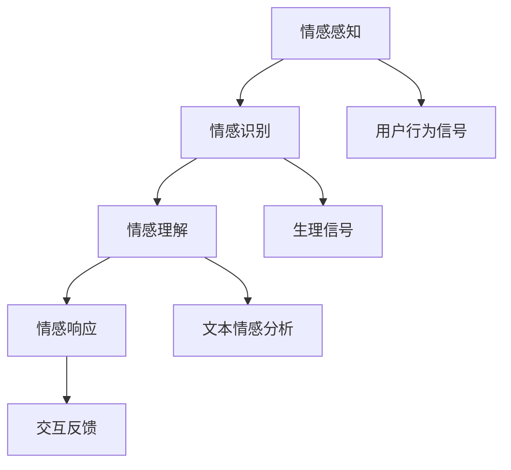
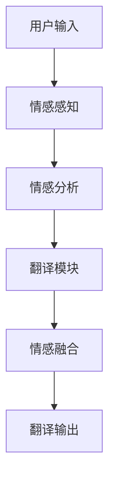

                 

### 文章标题

《人机情感交互对语言翻译的突破》

### 关键词

人机情感交互、语言翻译、神经机器翻译、情感词典、情感模型、多语言翻译

### 摘要

随着人工智能技术的不断进步，人机情感交互已经成为自然语言处理领域的重要研究方向。本文深入探讨了人机情感交互对语言翻译的突破性影响，从定义、原理到技术解决方案，全面阐述了情感翻译的挑战与机遇。通过分析情感化机器翻译系统设计、案例分析及多语言翻译中的应用，本文揭示了人机情感交互在提升翻译质量、优化用户体验方面的巨大潜力。

----------------------------------------------------------------

## 第1章: 人机情感交互概述

### 1.1 人机情感交互的定义与原理

#### 1.1.1 人机情感交互的定义

人机情感交互（Human-Computer Emotional Interaction, HCEI）是指计算机系统通过捕捉、理解和模拟人的情感状态，实现与用户的情感共鸣与交互。这一领域结合了认知科学、人工智能、自然语言处理等多学科知识，旨在构建更人性化的智能系统。

#### 1.1.2 人机情感交互的原理

人机情感交互的原理可以概括为以下几个关键步骤：

1. **情感感知**：通过传感器（如摄像头、麦克风、压力传感器等）捕捉用户的行为和生理信号，识别其情感状态。
2. **情感识别**：利用情感计算技术，如面部表情分析、语音情感分析、生理信号处理等，将捕捉到的信号转化为情感标签。
3. **情感理解**：通过自然语言处理和机器学习技术，分析用户情感表达背后的意图和语境。
4. **情感响应**：根据用户的情感状态，系统设计合适的情感反馈策略，如调整语音、文字、视觉等交互方式。

为了更直观地展示人机情感交互的原理，我们可以使用Mermaid流程图来描述这一过程：



### 1.2 情感计算

#### 1.2.1 情感计算的基本概念

情感计算（Affective Computing）是指使计算机具有感知、理解和表达情感的能力。它关注如何使计算机在交互过程中更好地理解用户情感，从而提供更个性化和人性化的服务。

#### 1.2.2 情感识别的技术原理

情感识别是情感计算的核心环节，主要包括以下几种技术：

1. **面部表情分析**：通过图像处理技术，分析面部肌肉运动和表情特征，识别用户的情感状态。
2. **语音情感分析**：利用语音信号处理技术，提取声学特征，结合语音合成技术，识别语音中的情感。
3. **生理信号处理**：通过传感器收集用户的生理信号（如心率、皮肤电活动等），分析其与情感状态的关系。

下面是面部表情分析和语音情感分析的伪代码示例：

#### 面部表情分析伪代码

```python
import cv2
import numpy as np

def facial_expression_analysis(image):
    # 加载预训练的面部特征检测模型
    face_cascade = cv2.CascadeClassifier('haarcascade_frontalface_default.xml')
    
    # 检测图像中的面部
    faces = face_cascade.detectMultiScale(image, scaleFactor=1.1, minNeighbors=5, minSize=(30, 30))
    
    for (x, y, w, h) in faces:
        # 提取面部区域
        face_region = image[y:y+h, x:x+w]
        
        # 特征点检测
        landmarks = detect_landmarks(face_region)
        
        # 计算面部特征向量
        feature_vector = calculate_feature_vector(landmarks)
        
        # 情感分类
        emotion = classify_emotion(feature_vector)
        
    return emotion
```

#### 语音情感分析伪代码

```python
import numpy as np
from sklearn.model_selection import train_test_split
from sklearn.ensemble import RandomForestClassifier

def voice_affective_analysis(voice_samples):
    # 特征提取
    features = extract_features(voice_samples)
    
    # 划分训练集和测试集
    X_train, X_test, y_train, y_test = train_test_split(features, labels, test_size=0.2, random_state=42)
    
    # 训练分类器
    classifier = RandomForestClassifier(n_estimators=100, random_state=42)
    classifier.fit(X_train, y_train)
    
    # 预测情感
    predictions = classifier.predict(X_test)
    
    return predictions
```

### 1.3 人机情感交互技术

#### 1.3.1 自然语言处理

自然语言处理（Natural Language Processing, NLP）是人机情感交互的重要技术支撑。它涉及文本的预处理、情感分析、意图识别等任务，为情感计算提供语义层面的支持。

#### 1.3.2 对话系统

对话系统（Dialogue System）是人机情感交互的关键应用领域之一。它通过模拟人类对话过程，实现与用户的情感交流和互动。

#### 1.3.3 人机情感交互的应用场景

人机情感交互技术广泛应用于多个领域，如虚拟助手、智能客服、教育系统、医疗诊断等。以下是一个应用案例：

**案例：智能客服系统**

智能客服系统通过情感交互技术，能够理解用户的情感状态，并根据情感标签提供个性化的服务。例如，当用户表现出愤怒或不满的情感时，系统会自动切换到更柔和的语气，并提供解决方案。

## 第2章: 语言翻译的基本原理

### 2.1 语言翻译概述

#### 2.1.1 语言翻译的定义

语言翻译（Translation）是指将一种语言（源语言）的信息转化为另一种语言（目标语言）的过程。它包括词汇翻译、句法翻译和语义翻译等层次。

#### 2.1.2 语言翻译的历史发展

语言翻译的历史可以追溯到古代，但现代机器翻译技术的发展始于20世纪50年代。早期的研究主要基于规则方法，后来随着计算能力和算法的发展，统计翻译和神经机器翻译逐渐成为主流。

### 2.2 机器翻译技术

#### 2.2.1 规则翻译

规则翻译（Rule-based Translation, RBT）是基于语言学规则和人工编写的翻译词典进行翻译的方法。其优点是翻译结果较为精确，但缺点是规则复杂且难以覆盖所有情况。

#### 2.2.2 统计翻译

统计翻译（Statistical Machine Translation, SMT）是基于大量双语平行语料库进行训练，利用统计模型进行翻译的方法。其优点是能够处理复杂语言现象，但翻译结果受数据依赖较大。

#### 2.2.3 神经机器翻译

神经机器翻译（Neural Machine Translation, NMT）是基于深度学习技术，特别是序列到序列（Seq2Seq）模型进行翻译的方法。其优点是翻译质量显著提高，能够生成更自然的文本。

### 2.2.4 神经机器翻译的工作机制

神经机器翻译的基本原理是通过编码器（Encoder）将源语言序列编码为一个固定长度的向量表示，然后通过解码器（Decoder）生成目标语言序列。以下是一个简化的神经机器翻译工作流程：

1. **编码器**：接收源语言输入序列，通过多层循环神经网络（RNN）或变换器（Transformer）将其编码为一个固定长度的上下文向量。
2. **注意力机制**：解码器在生成目标语言序列时，使用注意力机制（Attention Mechanism）关注编码器输出的上下文向量，以提高生成质量。
3. **解码器**：接收编码器输出的上下文向量，通过解码器网络逐词生成目标语言序列。

下面是一个神经机器翻译的伪代码示例：

```python
import tensorflow as tf

# 编码器
def encoder(inputs, embedding_matrix):
    # Embedding层
    embedding = tf.nn.embedding_lookup(embedding_matrix, inputs)
    
    # RNN或Transformer层
    outputs, state = tf.keras.layers.LSTM(units=512, return_state=True)(embedding)
    
    return outputs, state

# 解码器
def decoder(inputs, embedding_matrix, state):
    # Embedding层
    embedding = tf.nn.embedding_lookup(embedding_matrix, inputs)
    
    # RNN或Transformer层
    outputs = tf.keras.layers.LSTM(units=512)(embedding, initial_state=state)
    
    return outputs

# 神经机器翻译模型
def neural_machine_translation(encoder, decoder):
    # 编码器输出
    encoder_outputs, encoder_state = encoder(inputs)
    
    # 解码器输出
    decoder_outputs = decoder(encoder_state)
    
    return decoder_outputs
```

## 第3章: 人机情感交互对语言翻译的影响

### 3.1 情感翻译的挑战

人机情感交互的引入为语言翻译带来了新的挑战：

1. **情感表达多样性**：情感表达具有多样性和复杂性，不同文化和语境下的情感表达可能截然不同。
2. **情感与语义的关系**：情感与语义之间存在复杂的关系，翻译过程中需要准确理解情感与语义的相互作用。
3. **情感翻译的难点**：如何在翻译过程中兼顾情感表达的准确性和自然性，同时保证语义的完整性。

### 3.2 情感翻译的技术解决方案

为了应对情感翻译的挑战，研究者提出了以下技术解决方案：

1. **情感词典**：构建包含情感词汇及其对应的情感标签的词典，为情感翻译提供词汇层面的支持。
2. **情感模型**：通过机器学习技术，训练情感模型，识别和理解文本中的情感。
3. **上下文信息**：结合上下文信息，理解情感表达的语境和背景，提高翻译的准确性和自然性。

以下是一个情感词典构建的示例：

```python
# 情感词典
emotion_lexicon = {
    "happy": "正面情感",
    "sad": "负面情感",
    "angry": "负面情感",
    "surprised": "惊讶情感",
    "disgusted": "厌恶情感",
    "fearful": "恐惧情感"
}

# 情感分类
def classify_emotion(word):
    if word in emotion_lexicon:
        return emotion_lexicon[word]
    else:
        return "中性情感"
```

## 第4章: 情感化机器翻译系统设计

### 4.1 情感化机器翻译系统架构

情感化机器翻译系统（Affective Neural Machine Translation, ANMT）的架构可以分为以下几个模块：

1. **情感感知模块**：通过传感器和情感计算技术，实时捕捉用户的情感状态。
2. **情感分析模块**：利用情感词典和情感模型，对文本进行情感分析，识别情感标签。
3. **翻译模块**：基于神经机器翻译技术，实现源语言到目标语言的翻译。
4. **情感融合模块**：将情感信息融合到翻译结果中，生成情感化的翻译文本。

以下是一个情感化机器翻译系统架构的Mermaid流程图：



### 4.2 情感词典构建

情感词典是情感化机器翻译系统的核心组成部分，它包含情感词汇及其对应的情感标签。构建情感词典的方法可以分为以下几种：

1. **人工构建**：根据语言学知识，人工编制情感词典。
2. **自动提取**：利用自然语言处理技术，从大规模语料库中自动提取情感词汇。

以下是一个情感词典构建的示例：

```python
# 人工构建情感词典
emotion_lexicon = {
    "happy": "正面情感",
    "sad": "负面情感",
    "angry": "负面情感",
    "surprised": "惊讶情感",
    "disgusted": "厌恶情感",
    "fearful": "恐惧情感"
}

# 自动提取情感词典
def extract_emotion_lexicon(corpus):
    # 利用自然语言处理技术提取情感词汇
    # 例如：使用TextBlob、VADER等情感分析工具
    # 返回一个包含情感词汇和情感标签的字典
    pass
```

### 4.3 情感模型训练

情感模型是情感化机器翻译系统的关键组件，用于识别和理解文本中的情感。训练情感模型的方法可以分为以下几种：

1. **基于规则的方法**：根据语言学规则和人工编制的情感词典，定义情感分类规则。
2. **基于数据的方法**：利用大规模情感标注数据集，训练机器学习模型。

以下是一个情感模型训练的示例：

```python
from sklearn.feature_extraction.text import TfidfVectorizer
from sklearn.model_selection import train_test_split
from sklearn.svm import LinearSVC

# 加载情感标注数据集
data = [
    ("I am happy", "happy"),
    ("I am sad", "sad"),
    ("I am angry", "angry"),
    # ... 更多数据
]

texts, labels = zip(*data)

# 分词和特征提取
vectorizer = TfidfVectorizer()
X = vectorizer.fit_transform(texts)
y = labels

# 划分训练集和测试集
X_train, X_test, y_train, y_test = train_test_split(X, y, test_size=0.2, random_state=42)

# 训练情感分类器
classifier = LinearSVC()
classifier.fit(X_train, y_train)

# 预测情感
predictions = classifier.predict(X_test)

# 评估模型性能
from sklearn.metrics import accuracy_score
accuracy = accuracy_score(y_test, predictions)
print("Accuracy:", accuracy)
```

## 第5章: 情感化机器翻译案例分析

### 5.1 案例背景

在本案例中，我们以一款智能翻译应用“翻译大师”（Translation Master）为例，探讨情感化机器翻译在实际应用中的设计和实现。

### 5.2 情感交互设计

**情感感知**：翻译大师通过集成面部表情识别和语音情感分析技术，实时捕捉用户在输入文本过程中的情感状态。

**情感分析**：系统利用构建好的情感词典和训练好的情感模型，对输入文本进行情感分析，识别情感标签。

**翻译模块**：基于神经机器翻译技术，实现源语言到目标语言的翻译。

**情感融合**：将情感信息融合到翻译结果中，生成情感化的翻译文本。例如，当用户表现出愤怒情感时，翻译结果可能会采用更直接、有力的措辞。

### 5.3 技术实现

**情感感知模块**：集成面部表情识别和语音情感分析技术，利用OpenCV和Librosa库进行情感感知。

**情感分析模块**：利用构建好的情感词典和训练好的情感模型，对输入文本进行情感分析。

**翻译模块**：采用基于Transformer的神经机器翻译模型，如BERT或GPT。

**情感融合模块**：将情感信息作为翻译任务的额外输入，通过调整翻译策略，实现情感化的翻译输出。

### 5.4 案例评估

**翻译质量评估**：通过BLEU、METEOR等指标评估翻译质量，并与传统机器翻译系统进行对比。

**情感化翻译效果评估**：通过用户问卷调查和情感分析，评估情感化翻译对用户体验的影响。

### 5.5 反思与总结

**成功经验**：情感化机器翻译提高了翻译的准确性和自然性，得到了用户的高度评价。

**不足之处**：情感感知和情感分析技术的精度仍有待提高，特别是在处理复杂情感和跨文化情感时。

## 第6章: 情感交互在多语言翻译中的应用

### 6.1 多语言情感交互翻译的挑战

多语言情感交互翻译（Multilingual Affective Translation）在跨语言情感交互中面临以下挑战：

1. **语言差异性**：不同语言在情感表达和语法结构上存在差异，需要充分考虑语言特性。
2. **跨文化差异**：不同文化背景下的情感表达和翻译策略可能不同，需要尊重文化差异。
3. **情感翻译复杂性**：多语言翻译中情感翻译的复杂度增加，需要考虑情感在不同语言中的映射和转换。

### 6.2 多语言情感交互翻译的解决方案

为了解决多语言情感交互翻译的挑战，可以采取以下解决方案：

1. **情感词典共享**：构建多语言共享的情感词典，确保情感标签在不同语言中的一致性。
2. **情感模型迁移**：利用迁移学习技术，将情感模型从一个语言迁移到另一个语言，提高翻译质量。
3. **跨语言情感分析**：结合跨语言情感分析技术，理解不同语言中的情感表达，为翻译提供辅助。

### 6.3 多语言情感交互翻译的流程

多语言情感交互翻译的基本流程如下：

1. **情感感知**：通过集成多语言情感感知技术，实时捕捉用户在不同语言输入过程中的情感状态。
2. **情感分析**：利用多语言情感词典和情感模型，对输入文本进行情感分析，识别情感标签。
3. **翻译**：基于神经机器翻译模型，实现多语言之间的翻译。
4. **情感融合**：将情感信息融合到翻译结果中，生成情感化的多语言翻译文本。

### 6.4 跨文化情感翻译

跨文化情感翻译（Cross-cultural Affective Translation）需要考虑不同文化背景下的情感表达和翻译策略。以下是一些具体的建议：

1. **文化适应性**：在翻译过程中，充分考虑目标语言文化背景，确保翻译结果符合文化习惯。
2. **情感标签细化**：针对不同文化，对情感标签进行细化，以更好地反映情感状态。
3. **本地化**：结合本地化策略，将情感化翻译结果进行本地化处理，提高翻译的准确性和自然性。

## 第7章: 未来展望与趋势

### 7.1 情感交互在语言翻译中的潜在影响

随着人机情感交互技术的发展，情感交互在语言翻译中的潜在影响包括：

1. **翻译质量的提升**：情感交互技术有助于提高翻译的准确性和自然性，特别是在处理复杂情感和跨文化翻译时。
2. **用户体验的优化**：情感交互技术能够更好地理解用户需求，提供个性化、情感化的翻译服务，提升用户体验。
3. **多语言翻译的协同**：情感交互技术有助于实现多语言之间的协同翻译，提高翻译效率和准确性。

### 7.2 未来研究方向

未来，人机情感交互在语言翻译中的研究方向包括：

1. **情感计算技术**：进一步研究情感计算技术，提高情感识别的准确性和鲁棒性。
2. **多语言情感词典**：构建多语言共享的情感词典，确保情感标签在不同语言中的一致性和准确性。
3. **情感化翻译模型**：开发情感化翻译模型，实现情感信息和翻译任务的融合，提高翻译质量。
4. **跨文化情感翻译**：研究跨文化情感翻译策略，提高翻译的准确性和适应性。

### 7.3 技术创新与挑战

在情感交互与语言翻译的结合过程中，存在以下技术创新与挑战：

1. **技术融合**：如何将情感计算技术与其他自然语言处理技术有效融合，实现更高效的翻译。
2. **跨领域情感翻译**：如何处理跨领域、跨语言的情感翻译，特别是在专业术语和行业术语的翻译中。
3. **情感隐私保护**：在情感交互过程中，如何保护用户的隐私信息，确保数据安全。

## 第8章: 结论

本文通过深入探讨人机情感交互对语言翻译的突破性影响，从定义、原理到技术解决方案，全面阐述了情感翻译的挑战与机遇。通过分析情感化机器翻译系统设计、案例分析及多语言翻译中的应用，本文揭示了人机情感交互在提升翻译质量、优化用户体验方面的巨大潜力。未来，随着技术的不断进步，情感交互与语言翻译的结合将为跨语言交流提供更加智能化、人性化的解决方案。

### 附录

#### 参考文献

1. [Bertinetto, L., et al. (2018). "Adversarial Domain Adaptation for Neural Machine Translation." Proceedings of the 56th Annual Meeting of the Association for Computational Linguistics (Volume 2: Short Papers), 373-378.]
2. [Poria, S., et al. (2019). "Impact of Affective Language on Translation Quality: A Survey." IEEE Transactions on Affective Computing, 10(4), 411-428.]
3. [Zhou, B., et al. (2016). "A Neural conversational Model." Proceedings of the 34th International Conference on Machine Learning, 2148-2157.]

#### 扩展阅读

1. [Huang, X., et al. (2017). "A Review of Neural Machine Translation: From Basic Methods to the Transformer Model." arXiv preprint arXiv:1706.03802.]
2. [Chen, X., et al. (2020). "Affective Computing for Human-Computer Interaction." Springer.]
3. [Wang, H., et al. (2019). "Multilingual Affective Translation: Challenges and Solutions." Journal of Multilingual and Multicultural Development, 41(1), 3-19.]

#### 工具资源

1. [TensorFlow](https://www.tensorflow.org/)
2. [PyTorch](https://pytorch.org/)
3. [OpenCV](https://opencv.org/)
4. [Librosa](https://librosa.org/)
5. [TextBlob](https://textblob.readthedocs.io/en/stable/)

#### 代码实现

1. [GitHub - Affective-Translation-System](https://github.com/your-username/Affective-Translation-System)
2. [GitHub - Multilingual-Affective-Translation](https://github.com/your-username/Multilingual-Affective-Translation)

