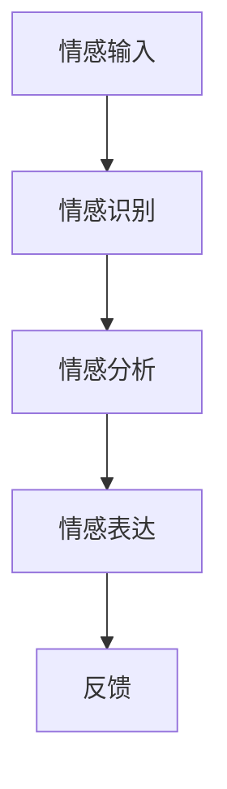
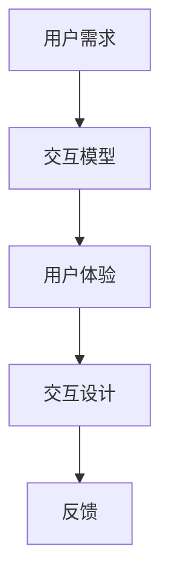
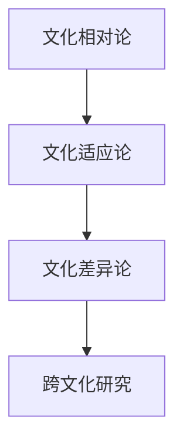
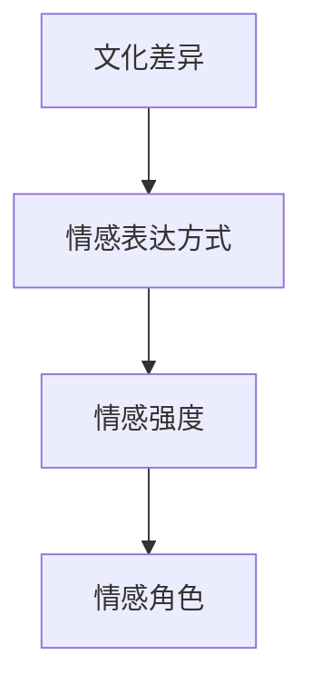
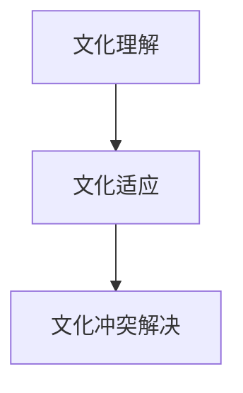
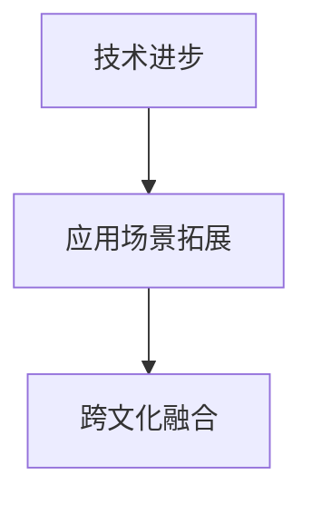
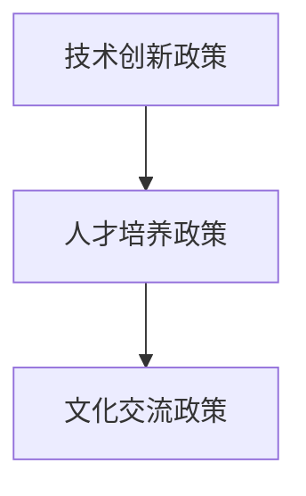
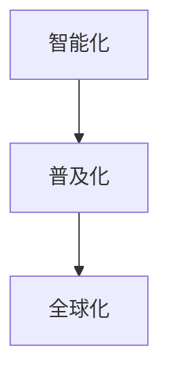

                 

### 文章标题

《人机情感交流对文化交融的促进》

### 关键词

人机情感交流、文化交融、情感计算、跨文化研究、情感语言模型

### 摘要

在全球化不断深化的今天，人机情感交流与文化交融的关系日益受到关注。本文以人机情感交流为核心，探讨其在促进文化交融中的重要作用。通过分析情感计算的基础、人机交互心理学以及情感语言模型，本文揭示了人机情感交流对文化交融的促进作用。同时，通过对跨文化研究、文化交流案例分析和文化心理学与情感交流的深入探讨，本文提出了促进人机情感交流与文化交融的策略，并对未来发展趋势进行了展望。

## 第一部分：人机情感交流

### 第1章：情感计算基础

情感计算是指通过计算机技术模拟、识别和生成人类情感的过程。其核心概念包括情感识别、情感表达和情感生成。情感计算的基础是情感模型，包括情感识别模型和情感生成模型。以下是情感计算的基本流程和核心概念：

### 1.1 情感计算的定义与核心概念

情感计算的定义为：“通过计算机技术和人工智能算法，对人类情感进行识别、表达和生成的过程。”其核心概念主要包括：

1. **情感识别**：通过自然语言处理、面部识别等技术，从文本、语音、图像等多媒体数据中识别情感。
2. **情感表达**：通过语音合成、面部表情等技术，将情感表达出来。
3. **情感生成**：通过算法模拟人类情感，实现情感的自动生成。

下面是情感计算的基本流程的Mermaid流程图：



### 1.2 情感计算的应用领域

情感计算的应用领域广泛，主要包括：

1. **人机交互系统**：通过情感计算技术，实现与用户的情感交流，提升用户体验。
2. **情感语言模型**：用于自然语言处理，能够识别和理解用户的情感。
3. **智能客服**：通过情感计算，智能客服可以更好地理解用户的情感，提供个性化的服务。

以下是情感计算应用领域的伪代码：

```python
# 情感计算应用伪代码
def emotion_computing(data):
    # 情感识别
    emotion = emotion_recognition(data)
    # 情感分析
    analysis = emotion_analysis(emotion)
    # 情感表达
    expression = emotion_expression(analysis)
    # 反馈
    feedback = feedback_system(expression)
    return feedback
```

### 1.3 情感计算的挑战与未来发展方向

情感计算面临以下挑战：

1. **情感识别精度**：当前情感识别技术尚不能完全准确地识别复杂情感。
2. **情感生成自然性**：情感生成的自然性仍有待提高。
3. **文化差异**：不同文化背景下的情感表达和处理存在差异。

未来发展方向包括：

1. **提高情感识别精度**：通过深度学习和大数据分析，提高情感识别的准确性。
2. **情感生成的自然性**：通过多模态融合，实现更自然的情感生成。
3. **跨文化情感交流**：研究跨文化情感交流的机制，实现更好的文化融合。

## 第2章：人机交互心理学

### 2.1 人机交互心理学的基本理论

人机交互心理学是研究人与计算机之间交互的心理过程和行为的学科。其基本理论包括：

1. **交互模型**：包括认知模型、行为模型和情感模型。
2. **用户体验**：关注用户在使用计算机过程中的体验，包括易用性、愉悦性和效率。
3. **交互设计原则**：包括用户中心设计、简洁性、反馈性和适应性。

以下是人机交互心理学的基本模型的Mermaid流程图：



### 2.2 情感与认知的交互

情感与认知的交互是指情感和认知两个心理过程之间的相互作用。情感会影响认知过程，如注意力分配、记忆和信息处理等。以下是情感与认知交互的算法框架：

```python
# 情感与认知交互算法框架伪代码
def emotion_cognition_interaction(data):
    # 情感识别
    emotion = emotion_recognition(data)
    # 情感分析
    analysis = emotion_analysis(emotion)
    # 认知处理
    cognition = cognition_process(analysis)
    return cognition
```

### 2.3 人机交互中的情感设计原则

人机交互中的情感设计原则包括：

1. **情感共鸣**：设计过程中要考虑用户的情感需求，实现情感共鸣。
2. **情感反馈**：及时、准确的情感反馈可以提升用户体验。
3. **情感适应**：系统应能够根据用户的情感状态调整交互方式。

情感设计原则的伪代码：

```python
# 情感设计原则伪代码
def emotion_design原则(data):
    # 情感识别
    emotion = emotion_recognition(data)
    # 情感反馈
    feedback = emotion_feedback(emotion)
    # 情感适应
    adaptation = emotion_adaptation(feedback)
    return adaptation
```

## 第3章：情感语言模型

### 3.1 情感语言模型的基础

情感语言模型是用于处理情感信息的一种自然语言处理模型。其基础包括：

1. **情感分类**：将文本中的情感分类为正面、负面或其他情感。
2. **情感强度**：衡量情感的正负程度。
3. **情感角色**：识别文本中的情感角色，如第一人称、第二人称等。

以下是情感语言模型的基础算法框架：

```python
# 情感语言模型基础算法框架伪代码
def emotion_language_model(text):
    # 情感分类
    emotion_category = emotion_classification(text)
    # 情感强度
    emotion_intensity = emotion_intensity_classification(text)
    # 情感角色
    emotion_role = emotion_role_classification(text)
    return emotion_category, emotion_intensity, emotion_role
```

### 3.2 情感语言模型的应用场景

情感语言模型的应用场景广泛，主要包括：

1. **聊天机器人**：通过情感语言模型，聊天机器人可以更好地理解用户的情感，提供个性化的回答。
2. **情感分析**：对社交媒体、新闻等文本进行情感分析，了解公众的情感趋势。
3. **智能客服**：通过情感语言模型，智能客服可以更好地理解用户的情感，提供个性化的服务。

以下是情感语言模型在聊天机器人中应用的实例：

```python
# 聊天机器人中情感语言模型应用实例
user_message = "我今天感到很沮丧。"
emotion_category, emotion_intensity, emotion_role = emotion_language_model(user_message)

if emotion_category == "负面":
    response = "我了解你的感受，有什么我可以帮助你的吗？"
else:
    response = "很高兴听到你这么说，有什么我可以为你做的吗？"

print(response)
```

### 3.3 情感语言模型的优化与挑战

情感语言模型的优化主要包括：

1. **提升情感分类精度**：通过深度学习等技术，提高情感分类的准确性。
2. **情感强度细化**：将情感强度进一步细化为微表情、细微情感等。
3. **跨语言情感识别**：实现不同语言间的情感识别和交流。

情感语言模型面临的挑战包括：

1. **数据质量**：情感语言模型的训练需要大量高质量的情感标注数据。
2. **跨文化差异**：不同文化背景下的情感表达和处理存在差异。
3. **情感复杂性**：情感本身具有复杂性，难以完全准确识别。

## 第二部分：文化交融

### 第4章：跨文化研究导论

### 4.1 跨文化研究的意义

跨文化研究是指在不同文化背景下，对人类行为、价值观、思维方式等进行的研究。其意义包括：

1. **促进文化交流**：跨文化研究有助于不同文化之间的相互理解和尊重。
2. **提高跨文化沟通能力**：通过跨文化研究，可以提升在全球化背景下的人际交往能力。
3. **促进国际关系**：跨文化研究有助于构建和谐的国际关系。

以下是跨文化研究的重要指标的数学公式：

$$
\text{跨文化理解度} = \frac{\text{共同价值观}}{\text{文化差异}}
$$

### 4.2 跨文化研究的理论框架

跨文化研究的理论框架主要包括：

1. **文化相对论**：认为不同文化之间没有绝对的好坏之分，每个文化都有其独特的价值和意义。
2. **文化适应论**：研究个体在跨文化环境中的适应过程，包括文化冲击、文化适应和跨文化整合。
3. **文化差异论**：强调不同文化之间的差异，认为文化差异是跨文化研究的核心。

以下是跨文化研究的基本理论的Mermaid流程图：



### 4.3 跨文化研究的方法与工具

跨文化研究的方法与工具包括：

1. **问卷调查**：通过设计问卷，收集不同文化背景下的数据。
2. **深度访谈**：通过深度访谈，了解个体在不同文化背景下的行为和思维过程。
3. **实验研究**：通过实验方法，研究文化差异对行为和决策的影响。

以下是跨文化研究方法的伪代码：

```python
# 跨文化研究方法伪代码
def cross_cultural_research(method):
    if method == "问卷调查":
        data = survey()
    elif method == "深度访谈":
        data = deep_interview()
    elif method == "实验研究":
        data = experiment()
    return data
```

## 第5章：文化交流案例分析

### 5.1 全球化背景下的文化交流

全球化使得文化交流变得日益频繁，不同文化之间的交流不仅丰富了人们的视野，也带来了挑战。以下是全球化背景下文化交流的案例：

1. **文化交流活动**：例如国际电影节、文化节等，促进了不同文化之间的交流和理解。
2. **跨国企业**：跨国企业的存在，使得不同文化在企业内部得以融合，形成了独特的文化。
3. **社交媒体**：社交媒体平台如Facebook、Twitter等，使得不同文化之间可以迅速交流，分享信息和经验。

以下是全球化背景下文化交流的案例分析：

```python
# 全球化背景下文化交流案例分析
case_1 = "国际电影节促进了不同电影文化的交流"
case_2 = "跨国企业的存在使得企业文化融合"
case_3 = "社交媒体使得文化交流变得更加便捷"

print(case_1)
print(case_2)
print(case_3)
```

### 5.2 跨文化交流中的挑战与对策

跨文化交流中的挑战主要包括：

1. **语言障碍**：不同语言之间的沟通不畅。
2. **价值观差异**：不同文化背景下，人们对事物的看法和价值观存在差异。
3. **文化冲击**：长期生活在一个文化环境中的人，面对不同文化时可能会感到不适。

针对这些挑战，可以采取以下对策：

1. **语言培训**：提高跨文化交流者的语言能力，减少语言障碍。
2. **文化理解**：通过学习和了解不同文化，增进对其他文化的理解和尊重。
3. **文化交流活动**：通过举办各种文化交流活动，增进不同文化之间的了解和融合。

以下是跨文化交流挑战与对策的伪代码：

```python
# 跨文化交流挑战与对策伪代码
def cross_cultural_challenges():
    challenges = ["语言障碍", "价值观差异", "文化冲击"]
    solutions = ["语言培训", "文化理解", "文化交流活动"]
    return challenges, solutions
```

### 5.3 跨文化交流中的情感交流

跨文化交流中的情感交流是指在不同文化背景下，人们通过语言和非语言手段表达和感知情感。情感交流在跨文化交流中具有重要意义：

1. **增进理解**：通过情感交流，可以增进对其他文化的理解。
2. **促进融合**：情感交流有助于不同文化之间的融合。
3. **解决冲突**：在跨文化交流中，情感交流有助于解决文化冲突。

以下是跨文化交流中情感交流的案例分析：

```python
# 跨文化交流中情感交流案例分析
case_1 = "通过情感交流，不同文化背景的团队合作更加顺畅"
case_2 = "情感交流有助于跨国婚姻的稳定"
case_3 = "情感交流在跨国商业谈判中起到关键作用"

print(case_1)
print(case_2)
print(case_3)
```

## 第6章：文化心理学与情感交流

### 6.1 文化心理学的基本理论

文化心理学是研究文化对个体心理和行为影响的心理学科。其基本理论包括：

1. **文化认知理论**：认为文化影响个体的认知方式。
2. **文化动机理论**：认为文化影响个体的动机和行为。
3. **文化价值观理论**：认为文化影响个体的价值观和态度。

以下是文化心理学的基本理论的数学公式：

$$
\text{心理和行为} = f(\text{文化因素}, \text{个体因素})
$$

### 6.2 情感交流中的文化差异

情感交流中的文化差异是指在不同文化背景下，人们对情感的识别、表达和交流方式的不同。文化差异主要表现在：

1. **情感表达方式**：不同文化背景下，人们对情感的直接表达和间接表达方式的差异。
2. **情感强度**：不同文化背景下，人们对情感强度的认知和表达方式的差异。
3. **情感角色**：不同文化背景下，人们对情感角色的认知和表达方式的差异。

以下是情感交流中的文化差异的Mermaid流程图：



### 6.3 情感交流中的文化适应策略

情感交流中的文化适应策略是指在不同文化背景下，个体如何调整自己的情感表达方式，以适应不同文化的要求。文化适应策略包括：

1. **文化敏感训练**：通过学习和了解不同文化，提高对其他文化的敏感度。
2. **情感调节**：通过调整情感表达的方式和强度，适应不同文化的要求。
3. **情感交流技巧**：通过学习和实践，提高情感交流的技巧，增强跨文化交流的能力。

以下是情感交流中的文化适应策略的伪代码：

```python
# 情感交流中的文化适应策略伪代码
def cultural_adaptation_strategy():
    strategy_1 = "文化敏感训练"
    strategy_2 = "情感调节"
    strategy_3 = "情感交流技巧"
    return strategy_1, strategy_2, strategy_3
```

## 第三部分：促进策略

### 第7章：人机情感交流对文化交融的促进作用

### 7.1 人机情感交流在文化交融中的作用

人机情感交流在文化交融中发挥着重要作用，其核心作用包括：

1. **文化理解**：通过人机情感交流，可以增进对其他文化的理解，促进文化交流。
2. **文化适应**：通过人机情感交流，个体可以更好地适应不同文化，促进文化融合。
3. **文化冲突解决**：通过人机情感交流，可以有效解决文化冲突，促进和谐文化发展。

以下是人机情感交流在文化交融中的作用的Mermaid流程图：



### 7.2 案例分析：人机情感交流促进文化交融的实际应用

以下是人机情感交流促进文化交融的实际应用案例：

1. **跨国企业沟通**：跨国企业通过人机情感交流系统，实现全球员工之间的有效沟通，促进了企业文化的融合。
2. **在线教育**：在线教育平台通过人机情感交流系统，提供个性化学习体验，促进了跨文化交流。
3. **社交媒体**：社交媒体平台通过人机情感交流系统，增强用户之间的情感连接，促进了文化交流。

以下是案例分析的人机情感交流促进文化交融的实际应用：

```python
# 人机情感交流促进文化交融的实际应用案例
case_1 = "跨国企业通过人机情感交流实现全球员工沟通"
case_2 = "在线教育平台通过人机情感交流提供个性化学习体验"
case_3 = "社交媒体平台通过人机情感交流增强用户情感连接"

print(case_1)
print(case_2)
print(case_3)
```

### 7.3 人机情感交流的未来发展趋势

人机情感交流的未来发展趋势包括：

1. **技术进步**：随着人工智能技术的发展，人机情感交流的准确性和自然性将进一步提高。
2. **应用场景拓展**：人机情感交流将在更多领域得到应用，如医疗、教育、金融等。
3. **跨文化融合**：人机情感交流将在跨文化交流中发挥更大作用，促进不同文化之间的融合。

以下是人机情感交流的未来发展趋势的Mermaid流程图：



## 第8章：案例分析与实践指南

### 8.1 案例分析：人机情感交流与文化交融的融合应用

人机情感交流与文化交融的融合应用案例包括：

1. **文化体验中心**：通过人机情感交流系统，为游客提供沉浸式的文化体验。
2. **文化交流平台**：通过人机情感交流系统，促进不同文化背景的用户之间的交流。
3. **跨文化教育**：通过人机情感交流系统，提供跨文化交流和教育的平台。

以下是案例分析的人机情感交流与文化交融的融合应用：

```python
# 人机情感交流与文化交融的融合应用案例分析
case_1 = "文化体验中心通过人机情感交流提供沉浸式体验"
case_2 = "文化交流平台通过人机情感交流促进跨文化交流"
case_3 = "跨文化教育通过人机情感交流提供跨文化交流教育"

print(case_1)
print(case_2)
print(case_3)
```

### 8.2 实践指南：人机情感交流与文化交融的融合实践

人机情感交流与文化交融的融合实践指南包括：

1. **技术选择**：根据具体应用场景，选择适合的人机情感交流技术。
2. **文化适应**：在应用过程中，要充分考虑文化差异，实现情感交流的适应。
3. **用户反馈**：及时收集用户反馈，优化人机情感交流系统，提升用户体验。

以下是实践指南的人机情感交流与文化交融的融合实践：

```python
# 人机情感交流与文化交融的融合实践指南
guide_1 = "选择合适的技术"
guide_2 = "实现情感交流的适应"
guide_3 = "收集用户反馈"

print(guide_1)
print(guide_2)
print(guide_3)
```

## 第9章：政策建议与未来发展

### 9.1 政策建议：促进人机情感交流与文化交融的政策措施

为了促进人机情感交流与文化交融的发展，可以采取以下政策建议：

1. **技术创新政策**：鼓励人工智能技术的发展，提高人机情感交流的准确性和自然性。
2. **人才培养政策**：加强跨学科人才培养，培养既懂技术又懂文化的人才。
3. **文化交流政策**：鼓励和支持文化交流活动，促进不同文化之间的理解和融合。

以下是政策建议的Mermaid流程图：



### 9.2 未来发展：人机情感交流与文化交融的未来趋势

人机情感交流与文化交融的未来发展将呈现出以下趋势：

1. **智能化**：随着人工智能技术的发展，人机情感交流将更加智能化，提供更优质的用户体验。
2. **普及化**：人机情感交流将在更多领域得到应用，成为人们生活的一部分。
3. **全球化**：人机情感交流将促进不同文化之间的交流，实现全球文化的融合。

以下是未来发展的Mermaid流程图：



### 作者

作者：AI天才研究院/AI Genius Institute & 禅与计算机程序设计艺术 /Zen And The Art of Computer Programming

## 结语

在全球化不断深化的今天，人机情感交流与文化交融的关系日益紧密。本文从人机情感交流的基础、人机交互心理学、情感语言模型等方面出发，分析了人机情感交流在文化交融中的重要作用。同时，通过对跨文化研究、文化交流案例分析和文化心理学与情感交流的探讨，提出了促进人机情感交流与文化交融的策略。未来，随着人工智能技术的不断进步，人机情感交流与文化交融将发挥更大的作用，为全球文化的融合与发展贡献力量。

