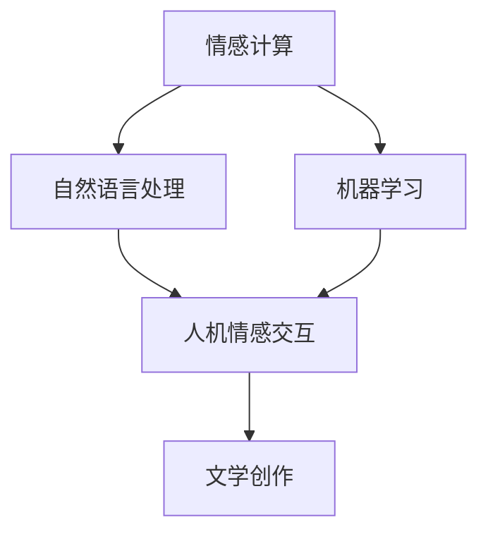

                 

### 文章标题：人机情感融合对文学创作的影响

#### 关键词：人机情感融合、文学创作、情感计算、人工智能、情感识别

#### 摘要：
本文深入探讨了人机情感融合对文学创作的影响。随着人工智能技术的发展，情感计算和情感识别技术在文学创作中的应用逐渐增多，不仅改变了文学创作的形式，也影响了文学作品的内容和风格。文章首先介绍了人机情感融合的背景和意义，然后详细分析了情感融合技术的核心概念、原理以及在实际文学创作中的应用。通过实例和案例分析，本文展示了情感融合对文学创作的深远影响，并对未来人机情感融合技术在文学创作中的发展进行了展望。

---

## 第一部分：引论

### 1.1 人机情感融合的背景与意义

随着人工智能（AI）技术的发展，计算机开始具备处理和模拟人类情感的能力。人机情感融合（Human-Computer Emotional Fusion，简称HCEF）是指通过结合情感计算、自然语言处理和机器学习等技术，使计算机能够理解和表达情感，并与人类进行情感交流。这一技术的出现为文学创作带来了新的契机和挑战。

#### 核心概念与联系

人机情感融合涉及多个核心概念和技术，主要包括：

1. **情感计算**：研究计算机如何识别、理解、处理和模拟情感。
2. **自然语言处理**：通过算法和技术使计算机能够理解、生成和处理自然语言。
3. **机器学习**：使用算法从数据中学习，用于情感识别和生成。

这些概念之间的关系可以用以下Mermaid流程图表示：



#### 人机情感融合的历史与发展趋势

人机情感融合技术的发展经历了几个关键阶段：

1. **早期研究**：20世纪80年代，情感计算概念首次被提出，研究者开始探索如何使计算机识别情感。
2. **技术突破**：21世纪初，随着自然语言处理和机器学习技术的发展，情感识别和生成技术取得了显著进展。
3. **实际应用**：近年来，情感融合技术逐渐应用于多个领域，包括虚拟助手、游戏、教育等，也为文学创作带来了新的可能性。

#### 文学创作中情感表达的重要性

情感是文学创作的核心元素，文学作品通过情感来打动读者，引发共鸣。情感表达不仅涉及到文本内容，还涉及到语言风格、叙述技巧等多个方面。人机情感融合技术的引入，使得文学创作中的情感表达更加丰富和多样。

### 1.2 人机情感融合与文学创作的相关性

人机情感融合技术对文学创作产生了深远的影响，不仅改变了文学创作的形式，还影响了作品的内容和风格。

#### 人机情感融合对文学创作的影响

1. **情感识别与分析**：通过情感计算技术，可以对文学作品中的情感进行识别和分析，为文学研究和创作提供数据支持。
2. **情感生成与创作**：基于情感计算模型，计算机可以生成具有特定情感的文本，为文学创作提供新工具。
3. **人机协同创作**：人与计算机可以协同创作，结合人类情感和计算机的技术优势，创作出更加丰富和深刻的文学作品。

#### 情感计算在文学分析中的应用

1. **情感标注与词典**：通过情感标注和词典，可以对文学作品中的情感进行分类和量化。
2. **情感强度评估**：使用情感强度评估模型，可以衡量文学作品中的情感强度和变化。
3. **情感风格分析**：通过情感风格分析，可以揭示文学作品的情感特征和风格特点。

#### 文学情感分析技术的现状与挑战

当前，文学情感分析技术已经取得了显著进展，但仍面临一些挑战：

1. **情感理解的准确性**：情感表达的多样性和复杂性使得情感识别的准确性受到挑战。
2. **情感生成与创造力**：如何使计算机生成具有创造力和情感深度的文学作品仍需深入研究。
3. **人机交互**：如何实现更加自然和流畅的人机情感交互仍需进一步探索。

### 1.3 本书结构安排与内容概述

本书分为五个部分，内容安排如下：

1. **引论**：介绍人机情感融合的背景和意义，分析情感融合与文学创作的相关性。
2. **情感融合技术基础**：详细阐述情感融合技术的核心概念、原理和应用。
3. **情感融合在文学创作中的应用**：探讨情感融合技术在文学创作中的具体应用，包括情感分析、人机协同创作和情感驱动的文学创作。
4. **情感融合对文学创作的潜在影响**：分析情感融合对文学创作的影响，包括形式、内容和市场等方面的变化。
5. **情感融合技术的挑战与未来**：讨论情感融合技术的挑战和未来发展趋势，展望人机情感融合在文学创作中的未来前景。

---

在下一部分，我们将详细探讨情感融合技术的核心概念和原理，包括情感计算、自然语言处理和机器学习等方面的内容。

---

## 第二部分：情感融合技术基础

### 2.1 情感融合技术概述

情感融合技术是指通过结合情感计算、自然语言处理和机器学习等技术，使计算机能够识别、理解和表达情感，从而实现人机情感交互的一种技术体系。情感融合技术的核心在于如何将情感这一抽象的概念转化为计算机可以处理和模拟的数值和模型。

#### 情感融合的概念与分类

情感融合技术可以根据其应用场景和目的进行分类：

1. **情感识别**：通过分析语言、语音、面部表情等信号，识别出人类情感的类别和强度。
2. **情感表达**：计算机通过文本、语音、图像等形式表达情感。
3. **情感理解**：计算机对文本、语音、图像等中蕴含的情感进行理解和分析。
4. **情感生成**：计算机根据特定目的生成具有特定情感的内容。

#### 情感融合的关键技术

情感融合技术涉及多个关键技术，主要包括：

1. **情感计算**：研究如何通过算法和模型识别、理解和模拟情感。
2. **自然语言处理**：处理和理解自然语言，提取情感信息。
3. **机器学习**：利用数据进行情感识别和生成。
4. **深度学习**：通过神经网络等技术实现复杂情感的计算和模拟。

#### 情感融合技术的发展趋势

随着人工智能技术的不断发展，情感融合技术也在不断演进：

1. **技术多样化**：情感融合技术涉及多个学科领域，如心理学、认知科学、计算机科学等。
2. **应用领域扩大**：从虚拟助手、游戏到教育、医疗等，情感融合技术的应用范围不断扩大。
3. **准确性提升**：通过不断优化算法和模型，情感融合技术的准确性不断提高。

### 2.2 情感识别与建模

情感识别与建模是情感融合技术的重要组成部分，旨在使计算机能够识别和模拟人类的情感。

#### 情感识别原理与算法

情感识别的核心任务是确定文本、语音或图像中蕴含的情感类别和强度。常见的情感识别算法包括：

1. **基于规则的算法**：通过预定义的规则进行情感分类。
2. **机器学习方法**：使用分类算法，如支持向量机（SVM）、朴素贝叶斯（NB）等，对情感进行分类。
3. **深度学习方法**：通过神经网络，如卷积神经网络（CNN）和循环神经网络（RNN），实现情感识别。

#### 情感建模方法

情感建模是指通过数学模型和算法来模拟和表达情感。常见的情感建模方法包括：

1. **情感语义网络**：通过构建情感语义网络，表示情感之间的关联和分类。
2. **情感特征提取**：从文本、语音和图像中提取情感特征，用于情感建模。
3. **情感强度评估**：通过情感强度评估模型，确定情感的程度和变化。

#### 情感识别与建模的伪代码

以下是情感识别与建模的伪代码示例：

```python
# 情感识别
def recognize_emotion(text):
    # 提取文本特征
    features = extract_text_features(text)
    # 使用机器学习模型进行情感分类
    emotion = classify_emotion(features)
    return emotion

# 情感建模
def build_emotion_model():
    # 准备数据集
    dataset = load_dataset()
    # 提取特征和标签
    features, labels = extract_features_labels(dataset)
    # 训练情感分类模型
    model = train_model(features, labels)
    return model
```

### 2.3 人机情感交互

人机情感交互是指计算机与人类在情感层面的互动，旨在实现更加自然和有效的沟通。

#### 人机情感交互的基本原理

人机情感交互的基本原理包括：

1. **情感识别**：计算机通过情感识别技术，理解用户的情感状态。
2. **情感表达**：计算机通过语音、图像、文本等方式，表达情感。
3. **情感反馈**：计算机根据用户情感，提供适当的情感反馈。

#### 人机情感交互技术

人机情感交互技术包括：

1. **情感识别与响应**：通过情感识别技术，计算机可以理解用户的情感，并做出相应的响应。
2. **情感反馈机制**：计算机通过情感反馈，调整自身的情感表达和行为。
3. **情感一致性**：确保计算机的情感表达与用户的情感状态保持一致。

#### 人机情感交互应用实例

以下是人机情感交互的几个应用实例：

1. **虚拟助手**：虚拟助手通过情感交互，提供更加自然和人性化的服务。
2. **游戏**：游戏中的人物角色通过情感交互，增强玩家的沉浸感和互动性。
3. **教育**：教育应用中，计算机通过情感交互，了解学生的学习状态，提供个性化的学习建议。

---

在下一部分，我们将探讨情感融合技术在文学创作中的具体应用，包括情感分析、人机协同创作和情感驱动的文学创作等方面。

---

## 第三部分：情感融合在文学创作中的应用

### 3.1 情感分析在文学创作中的应用

情感分析是情感融合技术在文学创作中的一个重要应用领域，通过对文学作品进行情感分析，可以深入了解作品中的情感表达和情感变化。

#### 文学文本的情感分析

文学文本的情感分析主要包括情感分类和情感强度评估。

1. **情感分类**：通过情感分类算法，将文学作品中的情感分类为喜悦、悲伤、愤怒等基本情感类别。常见的情感分类算法包括基于规则的方法和机器学习方法。

2. **情感强度评估**：通过情感强度评估模型，确定文学作品中的情感强度，即情感的深度和广度。情感强度评估可以帮助文学创作者更好地理解作品的情感表达，从而进行更精确的情感调控。

#### 情感标注与情感词典

1. **情感标注**：情感标注是指对文学作品中的情感进行标注，以便进行后续的情感分析。情感标注可以通过人工标注或自动标注的方法进行。

2. **情感词典**：情感词典是一个包含情感词汇及其对应情感类别的词典，用于辅助情感分类和情感强度评估。情感词典的构建可以通过语料库分析和情感计算模型训练得到。

#### 情感分析算法在文学中的应用

情感分析算法在文学中的应用包括：

1. **情感趋势分析**：通过分析文学作品中的情感变化，了解作品的整体情感趋势，有助于揭示作品的情感主题和情感强度。

2. **情感对比分析**：通过对不同文学作品或同一作品不同部分的情感对比分析，发现作品之间的情感差异和情感变化。

### 3.2 人机协同创作

人机协同创作是指人与计算机共同参与文学创作的过程，通过情感融合技术，可以实现更加自然和高效的人机协作。

#### 人机协同创作模式

1. **基于规则的协同创作**：通过预定义的规则，计算机和人类共同参与创作，计算机负责生成初步的文本，人类负责调整和优化。

2. **基于生成模型的协同创作**：使用生成模型，如变分自编码器（VAE）和生成对抗网络（GAN），计算机和人类共同生成文学作品。这种模式可以产生更加丰富和多样化的文本内容。

#### 人机协同创作的案例研究

以下是人机协同创作的几个案例研究：

1. **莎士比亚助手**：莎士比亚助手（ShakespeareAI）是一个基于生成模型的协同创作工具，可以帮助用户生成莎士比亚风格的文本。用户可以输入关键词或短语，莎士比亚助手将生成与之风格相近的文本。

2. **AI写作助手**：AI写作助手如Wordsmith和GPT-3等，可以通过情感融合技术，帮助用户生成具有特定情感风格和主题的文本。

### 3.3 情感驱动的文学创作

情感驱动的文学创作是指通过情感融合技术，使文学创作过程更加依赖于情感的驱动和引导。

#### 情感驱动的创作理念

情感驱动的创作理念认为，情感是文学创作的核心驱动力，文学作品应该通过情感来触动读者的心灵。情感驱动的文学创作强调：

1. **情感的真实性**：创作过程中要追求情感的真实性，使作品中的情感表达更加深刻和真实。

2. **情感的多样性**：通过情感融合技术，可以生成丰富多样的情感表达，使文学作品具有更高的情感层次和深度。

#### 情感驱动创作的方法与技术

1. **情感导向的情节生成**：通过情感计算模型，可以生成具有特定情感倾向的情节，使文学作品在情感上更加统一和协调。

2. **情感导向的文本生成**：使用情感生成模型，如情感对抗生成网络（AEGAN），可以生成具有特定情感色彩的文本。

#### 情感驱动创作的实践与评估

1. **实践应用**：情感驱动创作已经在文学创作中得到了广泛应用，如故事生成、诗歌创作等。

2. **评估方法**：可以通过情感分析技术，对情感驱动创作的作品进行评估，包括情感准确性、情感深度和情感一致性等方面。

---

在下一部分，我们将探讨情感融合对文学创作的潜在影响，包括对文学形式、内容和市场等方面的改变。

---

## 第四部分：情感融合对文学创作的潜在影响

### 4.1 情感融合对文学创作的影响

情感融合技术的发展对文学创作产生了深远的影响，不仅改变了文学创作的形式，还影响了作品的内容和风格。

#### 文学创作的新形式

1. **互动式文学**：通过情感融合技术，可以创作出互动式文学作品，使读者成为作品的一部分，增强读者的参与感和体验感。

2. **情感化文本生成**：基于情感融合技术，可以生成具有特定情感色彩和主题的文本，使文学作品更加生动和感人。

#### 文学情感的深度挖掘与表达

1. **情感深度分析**：通过情感计算技术，可以深度分析文学作品中的情感表达，揭示作品的情感内涵和情感深度。

2. **情感表达的创新**：情感融合技术可以为文学创作者提供新的情感表达工具，使情感表达更加多样化和细腻。

#### 文学创作与情感认知的互动

1. **情感认知建模**：通过情感认知建模，可以更好地理解人类情感认知的过程和机制，为文学创作提供理论支持。

2. **情感互动体验**：通过情感融合技术，可以创造更加真实和丰富的情感互动体验，增强文学作品与读者之间的情感连接。

### 4.2 情感融合对文学市场的影响

情感融合技术对文学市场也产生了重要影响，改变了读者的阅读体验和市场需求。

#### 读者需求的改变

1. **情感共鸣**：情感融合技术可以创造出更加贴近读者情感的文学作品，满足读者对情感共鸣的需求。

2. **个性化阅读**：基于情感融合技术，可以提供个性化的阅读推荐，满足不同读者的情感需求。

#### 文学作品的市场定位

1. **情感化营销**：通过情感融合技术，可以对文学作品进行情感化营销，吸引更多读者。

2. **多元化创作**：情感融合技术可以激发文学创作者的创造力，推动文学作品的多元化发展。

#### 情感融合对文学产业的影响

1. **文学产业的创新**：情感融合技术为文学产业带来了新的发展机遇，推动了文学产业的创新和升级。

2. **产业链的整合**：情感融合技术可以促进文学产业链的整合，实现文学创作、传播、消费的有机统一。

### 4.3 情感融合对文学教育的启示

情感融合技术对文学教育也具有深远的影响，为文学教育提供了新的教学方法和教学内容。

#### 文学教育的创新方法

1. **情感化教学**：通过情感融合技术，可以开展情感化教学，激发学生的学习兴趣和参与度。

2. **情感分析工具**：利用情感分析工具，可以对文学作品进行情感分析，提高学生的文学鉴赏能力。

#### 情感融合在文学教学中的应用

1. **情感导向的阅读**：通过情感导向的阅读，学生可以更加深入地理解作品的情感内涵。

2. **情感驱动的创作**：通过情感驱动的创作，学生可以培养情感表达和情感沟通的能力。

#### 文学情感教育的重要性

1. **情感认知的培养**：通过文学情感教育，可以培养学生的情感认知能力，提高他们的情感素养。

2. **人文素养的提升**：文学情感教育可以增强学生的人文素养，培养他们的情感体验和情感表达能力。

---

在下一部分，我们将讨论情感融合技术的挑战和未来发展趋势，以及这些技术对文学创作的潜在影响。

---

## 第五部分：情感融合技术的挑战与未来

### 5.1 情感融合技术的挑战

尽管情感融合技术在文学创作等领域展现出了巨大的潜力，但同时也面临着一系列挑战。

#### 情感理解的准确性

情感理解的准确性是目前情感融合技术面临的主要挑战之一。由于情感表达的多样性和复杂性，计算机在识别和理解情感时往往存在误差。这需要进一步优化情感识别算法，提高情感分析的准确性。

#### 人机情感交互的逼真性

人机情感交互的逼真性也是情感融合技术的一个重要挑战。为了实现更加自然和流畅的人机交互，计算机需要更好地模拟和理解人类的情感，并提供合适的情感反馈。

#### 情感融合技术的可扩展性

情感融合技术的可扩展性是另一个关键挑战。随着应用场景的不断扩展，情感融合技术需要能够适应不同的情感需求和交互方式，从而满足多样化的应用需求。

### 5.2 情感融合技术的未来发展趋势

随着人工智能技术的不断进步，情感融合技术也在不断发展和完善。以下是情感融合技术的未来发展趋势：

#### 情感融合技术的最新研究进展

近年来，情感融合技术取得了显著的研究进展，包括：

1. **情感识别算法的优化**：通过深度学习和强化学习等方法，情感识别算法的准确性和鲁棒性得到了显著提升。

2. **情感交互系统的设计**：基于情感计算和自然语言处理技术，设计出更加自然和流畅的人机情感交互系统。

3. **情感驱动的创作工具**：开发出基于情感融合技术的文学创作工具，帮助文学创作者生成具有特定情感色彩的作品。

#### 未来人机情感融合的预测

未来，人机情感融合技术将在以下几个方面取得突破：

1. **情感模拟的精细化**：通过更加精细的情感模拟，实现人机之间的情感共鸣和互动。

2. **情感识别的智能化**：利用大数据和深度学习技术，使情感识别更加智能化，能够更好地理解复杂的情感表达。

3. **情感驱动的个性化服务**：基于情感融合技术，提供更加个性化的文学创作和阅读服务，满足不同读者的情感需求。

#### 情感融合技术在文学创作中的潜在应用

未来，情感融合技术在文学创作中具有以下潜在应用：

1. **情感驱动的文学创作**：通过情感融合技术，文学创作者可以更加深入地挖掘和表达情感，创作出更加细腻和感人的作品。

2. **互动式文学体验**：利用情感融合技术，可以创作出互动式文学作品，增强读者的参与感和体验感。

3. **情感化的文学推荐**：基于情感融合技术，可以为读者提供更加个性化的文学推荐，满足他们的情感需求。

---

在最后部分，我们将总结全文，并给出一些最佳实践和建议。

---

## 总结与展望

随着人工智能技术的不断进步，人机情感融合在文学创作中的应用变得越来越广泛。本文首先介绍了人机情感融合的背景和意义，分析了情感融合技术的核心概念和原理，探讨了情感融合技术在文学创作中的具体应用和潜在影响，最后讨论了情感融合技术的挑战和未来发展趋势。

### 最佳实践

1. **情感分析工具的使用**：文学创作者可以借助情感分析工具，深入分析作品的情感表达，从而优化创作策略。

2. **人机协同创作的实践**：文学创作者可以尝试与计算机协同创作，利用计算机的算法和模型生成具有特定情感色彩的作品。

3. **情感驱动的文学创作**：通过情感驱动的方法，文学创作者可以更加深入地挖掘和表达情感，创作出更具感染力的作品。

### 小结

本文通过对人机情感融合与文学创作关系的详细探讨，展示了情感融合技术对文学创作的深远影响。在未来，随着技术的进一步发展，人机情感融合将不仅改变文学创作的形式，还将深入影响文学的内容和风格。

### 注意事项

1. **情感理解的准确性**：在应用情感融合技术时，要关注情感识别的准确性，以避免产生误解和误导。

2. **隐私保护**：在利用情感融合技术进行文学创作和数据分析时，要确保用户的隐私和数据安全。

### 拓展阅读

1. **《情感计算基础教程》**：详细介绍了情感计算的基本原理和应用。
2. **《人工智能与文学创作》**：探讨了人工智能技术在文学创作中的应用和影响。
3. **《人机交互心理学》**：研究了人机交互中的情感因素和心理机制。

---

在未来的文学创作中，人机情感融合将扮演越来越重要的角色。通过不断探索和创新，我们可以期待文学创作进入一个全新的时代。

### 作者信息

- 作者：AI天才研究院/AI Genius Institute & 禅与计算机程序设计艺术 /Zen And The Art of Computer Programming

---

感谢您阅读本文，希望它能激发您对人机情感融合与文学创作的兴趣和思考。如果您对本文有任何疑问或建议，欢迎在评论区留言讨论。让我们一起探索人机情感融合的无限可能！

