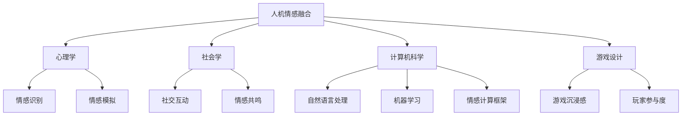
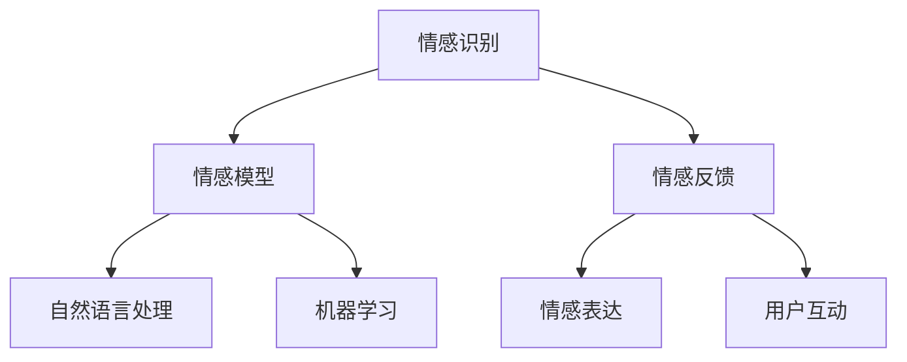
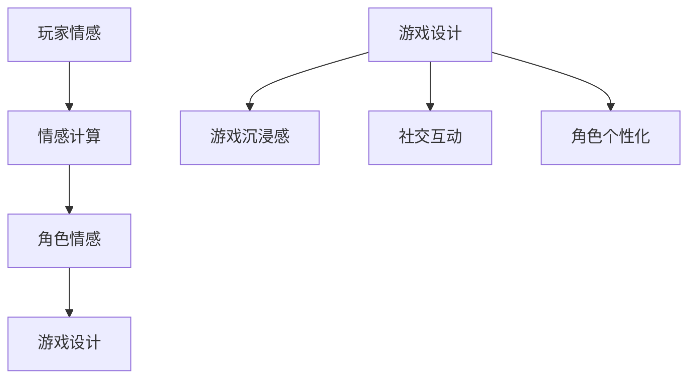
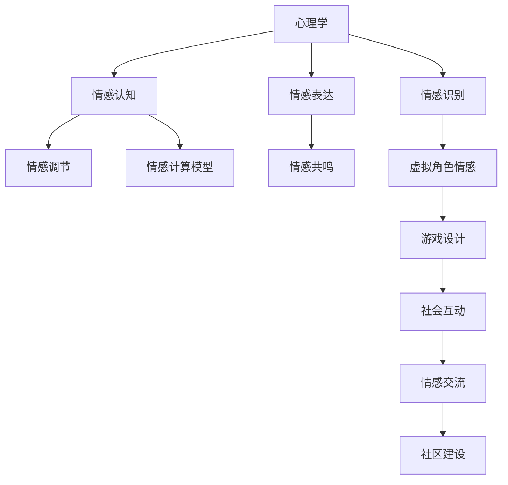
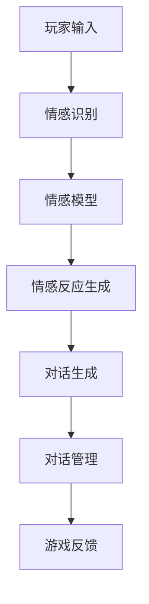

                 


### 文章标题

# 人机情感融合对游戏产业的革新

### 文章关键词

- 人机情感融合
- 游戏产业
- 人工智能
- 情感计算
- 游戏设计
- 商业模式

### 文章摘要

本文探讨了人机情感融合对游戏产业的深刻影响。通过分析人机情感融合的定义、理论基础、技术进展以及实际应用，文章揭示了情感融合如何改变游戏的设计、提升用户体验，并带来商业模式的革新。本文还通过案例分析，探讨了情感融合在游戏产业中的实际应用及其未来发展趋势。

## 目录

1. **引言**
2. **人机情感融合的核心概念与联系**
3. **人机情感融合的理论基础**
4. **人机情感融合的技术进展**
5. **人机情感融合在游戏设计中的应用**
6. **人机情感融合的商业模式与影响**
7. **案例研究**
8. **未来趋势与挑战**
9. **结论**
10. **参考文献**
11. **作者信息**

## 引言

### 背景介绍

游戏产业作为全球数字经济的重要组成部分，近年来经历了飞速的发展。随着技术的进步，尤其是人工智能（AI）和情感计算技术的应用，游戏体验正逐步从传统的视觉和听觉向更为深刻的情感层面转变。这种转变不仅提升了游戏的沉浸感，还为游戏产业带来了新的商业模式和发展机遇。

### 核心概念与联系

人机情感融合是指通过人工智能技术，使游戏中的虚拟角色具备情感表达和认知能力，从而与玩家产生情感共鸣。这一概念涉及多个领域的交叉，包括心理学、社会学、计算机科学和游戏设计。情感计算作为支撑这一概念的关键技术，旨在模拟和识别人类情感，并将其应用于游戏中。

以下是人机情感融合的核心概念和联系流程图：



### 核心概念与联系流程图解析

- **心理学**：情感识别和情感模拟是心理学在情感融合中的应用。通过研究人类情感特征，开发者可以设计出能够识别玩家情感变化的虚拟角色。
- **社会学**：社交互动和情感共鸣是社会学的核心概念，它涉及到玩家与虚拟角色之间的互动，以及这种互动如何影响玩家的情感体验。
- **计算机科学**：自然语言处理、机器学习和情感计算框架是计算机科学在情感融合中的主要技术手段。这些技术共同构建了人机情感融合的技术基础。
- **游戏设计**：游戏沉浸感和玩家参与度是游戏设计的两个关键指标。通过人机情感融合，开发者可以创造出更加引人入胜的游戏体验，提高玩家的游戏黏性。

### 文章主题思想

本文将从多个角度探讨人机情感融合对游戏产业的革新。首先，我们将详细阐述人机情感融合的定义、理论基础和技术进展。接着，通过具体案例，我们将展示情感融合在游戏设计中的应用，并分析其对游戏商业模式的影响。最后，我们将预测未来情感融合在游戏产业中的发展趋势，并提出可能面临的挑战。

## 人机情感融合的核心概念与联系

### 人机情感融合的定义

人机情感融合是指将人工智能技术应用于游戏，使游戏中的虚拟角色具备情感表达和认知能力，从而与玩家产生情感共鸣。这一概念涵盖了情感识别、情感模拟、社交互动等多个方面。情感识别是指通过技术手段识别玩家的情感状态，情感模拟是指让虚拟角色根据识别结果表现出相应的情感反应，而社交互动则涉及到玩家与虚拟角色之间的互动和情感共鸣。

### 情感计算

情感计算是支撑人机情感融合的关键技术。它旨在模拟和识别人类情感，并将其应用于游戏中。情感计算涉及到自然语言处理、机器学习和深度学习等技术。通过这些技术，开发者可以设计出能够识别玩家情感变化的虚拟角色，并使其表现出相应的情感反应。

以下是情感计算的核心概念和流程图：



### 核心概念与联系流程图解析

- **情感识别**：情感识别是情感计算的第一步，它通过自然语言处理和机器学习技术，从玩家的语言和行为中识别出情感状态。例如，通过分析玩家的聊天内容，可以判断其是开心、愤怒还是焦虑。
- **情感模型**：情感模型是情感计算的核心，它基于情感识别的结果，构建出虚拟角色的情感状态。这个模型可以包括多个维度，如情感强度、情感类型等。
- **情感反馈**：情感反馈是指虚拟角色根据情感模型的表现，向玩家传递情感信息。例如，玩家在游戏中击败敌人后，虚拟角色可以表现出胜利的喜悦。
- **情感表达**：情感表达是指虚拟角色如何通过语言、动作和表情等渠道，向玩家传达情感信息。情感表达的质量直接影响到玩家的情感共鸣。
- **用户互动**：用户互动是指玩家与虚拟角色之间的互动过程，这种互动可以增强玩家的情感体验。例如，玩家可以通过与虚拟角色的对话，感受到更加真实和深刻的情感联系。

### 情感计算模型

情感计算模型是情感计算的核心组成部分，它决定了虚拟角色的情感表达和认知能力。以下是一个简化的情感计算模型：

1. **情感识别**：
   - **输入**：玩家的语言、行为和游戏状态。
   - **处理**：使用自然语言处理和机器学习技术，识别玩家的情感状态。
   - **输出**：情感状态，如开心、愤怒、焦虑等。

2. **情感建模**：
   - **输入**：情感状态。
   - **处理**：根据情感状态，构建虚拟角色的情感模型。
   - **输出**：情感模型，包括情感强度、情感类型等。

3. **情感表达**：
   - **输入**：情感模型。
   - **处理**：虚拟角色根据情感模型，表现出相应的情感反应。
   - **输出**：情感表达，如语言、动作、表情等。

4. **用户互动**：
   - **输入**：玩家的反馈和交互。
   - **处理**：虚拟角色根据用户的反馈，调整情感表达和互动方式。
   - **输出**：增强的用户体验。

### 人机情感融合与游戏设计

人机情感融合在游戏设计中的应用，主要体现在以下几个方面：

1. **角色个性化**：通过情感计算，开发者可以为虚拟角色赋予个性和情感，使其更加生动和有魅力。这不仅提升了游戏的角色吸引力，还增强了玩家的情感投入。
2. **游戏沉浸感**：情感融合可以提升游戏的沉浸感，使玩家更加投入到游戏世界中。例如，虚拟角色对玩家情感变化的敏感反应，可以创造出更加真实和生动的游戏场景。
3. **社交互动**：情感融合可以增强玩家与虚拟角色之间的社交互动，提高玩家的参与度和满意度。例如，虚拟角色可以根据玩家的情感状态，进行相应的互动和情感表达。

### 情感计算与游戏设计的联系流程图



### 核心概念与联系流程图解析

- **玩家情感**：玩家的情感状态是游戏设计的起点。通过情感计算，可以识别和模拟玩家的情感。
- **情感计算**：情感计算是连接玩家情感和游戏设计的桥梁，它通过自然语言处理和机器学习技术，识别玩家的情感，并构建虚拟角色的情感模型。
- **角色情感**：虚拟角色的情感状态是游戏设计的重要部分。通过情感计算模型，虚拟角色可以表现出相应的情感反应，增强游戏的情感共鸣。
- **游戏设计**：游戏设计是情感融合的应用目标。通过情感融合，可以提升游戏的沉浸感、社交互动和角色个性化。
- **游戏沉浸感**：游戏沉浸感是玩家体验的核心，情感融合可以提升游戏的沉浸感，使玩家更加投入。
- **社交互动**：社交互动是游戏的重要组成部分，情感融合可以增强玩家与虚拟角色之间的互动，提高玩家的参与度和满意度。
- **角色个性化**：角色个性化是情感融合在游戏设计中的具体体现，通过赋予虚拟角色个性和情感，可以提升游戏的角色魅力。

### 人机情感融合的重要性

人机情感融合在游戏产业中的重要性不可忽视。它不仅提升了游戏的沉浸感和用户体验，还为游戏产业带来了新的商业模式和发展机遇。以下是人机情感融合在游戏产业中的重要性和影响：

1. **提升用户体验**：通过情感融合，游戏可以更加真实地模拟人类情感，使玩家感受到更加深刻的情感体验。这种情感共鸣可以增强玩家的游戏黏性和忠诚度。
2. **创新游戏设计**：情感融合为游戏设计带来了新的可能性，开发者可以通过情感计算，创造出更加丰富和多样化的游戏体验。这不仅可以吸引新玩家，还可以留住老玩家。
3. **商业模式创新**：情感融合可以改变游戏产业的商业模式。例如，通过情感计算，可以提供更加个性化的游戏内容和服务，从而实现更高的盈利能力。
4. **产业生态发展**：人机情感融合的广泛应用，将推动游戏产业生态的发展。从硬件设备到游戏平台，再到游戏开发工具，各个环节都将受益于情感融合技术的进步。

总之，人机情感融合是游戏产业未来发展的重要方向。通过情感融合，游戏产业将实现更加深刻和多元的用户体验，创造新的商业模式，推动产业的持续创新和发展。

### 总结

本节介绍了人机情感融合的核心概念与联系，包括其定义、情感计算模型以及与游戏设计的联系。通过情感计算，游戏中的虚拟角色可以识别和模拟玩家情感，从而提升游戏沉浸感和用户体验。情感融合不仅在技术层面上为游戏产业带来了创新，还在商业模式和用户体验上产生了深远影响。接下来，我们将进一步探讨人机情感融合的理论基础，分析其在心理学和社会学中的理论基础，以及情感计算在游戏设计中的应用。

## 人机情感融合的理论基础

### 心理学视角

心理学为理解人机情感融合提供了重要的理论基础。情感是人类心理体验的核心部分，涉及到个体的情绪、情感认知和情感调节。情感心理学研究了情感的产生、表达、感知和调节机制，这些研究成果为人机情感融合提供了理论依据。

1. **情感类型与认知**：情感心理学将情感分为基本情感类型，如快乐、悲伤、愤怒、厌恶和恐惧等。这些情感类型可以通过面部表情、生理反应和语言表达等方式被识别和感知。在游戏设计中，开发者可以利用这些基本情感类型，设计出能够与玩家情感产生共鸣的虚拟角色。

2. **情感共鸣与移情**：情感共鸣和移情是理解人机情感融合的关键概念。情感共鸣是指个体感受到他人的情感状态，而移情是指将自己的情感投射到他人身上。在游戏中，虚拟角色的情感表达可以引发玩家的情感共鸣和移情，从而增强游戏的沉浸感。

3. **情感调节**：情感调节是指个体在情感体验中调整和改变情感状态的能力。在游戏中，情感调节可以通过设计玩家的情感反应机制来实现。例如，当玩家遇到困难时，虚拟角色可以提供鼓励和支持，帮助玩家调节情绪，增强游戏的乐趣和挑战性。

### 社会学视角

社会学为理解人机情感融合的社会影响提供了理论框架。社会互动和情感交流是社会学研究的重要内容，这些研究为人机情感融合的设计和应用提供了指导。

1. **社会互动**：社会互动是指个体之间通过语言、行为和情感交流进行的互动。在游戏中，社会互动可以通过多人合作、竞争和社交互动等方式实现。人机情感融合可以通过模拟和识别玩家的情感状态，增强游戏中的社会互动体验。

2. **情感交流**：情感交流是指个体通过情感表达和情感接收进行的交流。在游戏中，情感交流可以通过虚拟角色的情感表达和玩家的情感反馈来实现。情感交流不仅增强了游戏的社交体验，还促进了玩家之间的情感共鸣和社区建设。

3. **角色扮演**：在社会学中，角色扮演是指个体在特定社会情境中表现出的行为和情感状态。在游戏中，角色扮演是玩家体验的重要组成部分。人机情感融合可以通过虚拟角色的情感表达，使玩家更深入地融入游戏世界，增强角色扮演的体验。

### 心理学与社会学理论的结合

心理学和社会学理论的结合为人机情感融合提供了全面的指导。以下是一个简化的结合模型：



### 核心概念与联系流程图解析

- **心理学**：情感认知、情感调节和情感表达是心理学的核心概念，它们为人机情感融合提供了理论基础。
- **情感认知**：情感认知是指个体对情感的理解和识别能力。通过情感认知，玩家可以感知和理解虚拟角色的情感表达。
- **情感调节**：情感调节是指个体在情感体验中调整和改变情感状态的能力。在游戏中，情感调节可以帮助玩家更好地应对游戏挑战，增强游戏的乐趣。
- **情感表达**：情感表达是指个体通过语言、行为和表情等方式表达情感。虚拟角色的情感表达可以引发玩家的情感共鸣。
- **情感共鸣**：情感共鸣是指玩家感受到虚拟角色的情感状态，从而增强游戏的沉浸感和体验。情感共鸣是游戏设计的重要目标。
- **情感计算模型**：情感计算模型是心理学理论在情感融合中的应用，它通过自然语言处理和机器学习技术，识别和模拟玩家的情感状态。
- **情感识别**：情感识别是指通过技术手段识别玩家的情感状态。情感识别是情感计算模型的基础。
- **虚拟角色情感**：虚拟角色的情感状态是基于情感计算模型生成的，它们通过情感表达与玩家互动，增强游戏的情感共鸣。
- **游戏设计**：游戏设计是将心理学和社会学理论应用于游戏开发的过程。通过游戏设计，虚拟角色的情感表达和社会互动得以实现。
- **社会互动**：社会互动是指玩家之间的互动。在多人游戏中，社会互动可以通过合作、竞争和社交互动等方式实现。
- **情感交流**：情感交流是指玩家通过情感表达和情感接收进行的互动。情感交流可以增强游戏的社交体验。
- **社区建设**：社区建设是指玩家在游戏中的情感交流和互动形成的社区。社区建设可以增强玩家的归属感和忠诚度。

### 理论基础的整合

心理学和社会学理论为人机情感融合提供了全面的指导。通过整合这些理论，开发者可以设计出更加真实和生动的游戏体验，使玩家在情感层面上与游戏产生共鸣。情感计算模型作为连接心理学和社会学理论的技术手段，可以有效地实现人机情感融合，从而提升游戏的沉浸感和用户体验。

### 人机情感融合与心理学、社会学理论的联系

人机情感融合不仅依赖于技术进步，还需要深厚的心理学和社会学理论基础。心理学提供了关于人类情感的认知、表达和调节的丰富知识，这些知识为人机情感融合的情感建模提供了科学依据。情感计算模型通过自然语言处理和机器学习技术，将这些心理学知识应用于虚拟角色的情感表达，使虚拟角色能够更真实地模拟人类情感。

社会学理论则为人机情感融合的社会互动和社区建设提供了指导。社会互动和情感交流是社会学研究的重要内容，它们帮助开发者设计出能够增强玩家之间互动和情感共鸣的游戏机制。通过虚拟角色的情感表达和社会互动，游戏不仅提供了娱乐体验，还成为了玩家之间建立情感联系的平台。

总之，心理学和社会学理论为人机情感融合提供了坚实的基础。通过整合这些理论，开发者可以创造出更加丰富和真实的人机情感互动，从而推动游戏产业的持续创新和发展。

### 总结

本节从心理学和社会学的视角，探讨了人机情感融合的理论基础。心理学提供了关于情感认知、情感调节和情感表达的核心概念，这些概念为人机情感融合的情感建模提供了科学依据。社会学理论则强调了社会互动和情感交流的重要性，这些理论为人机情感融合中的社会互动和社区建设提供了指导。通过心理学和社会学理论的整合，开发者可以设计出更加真实和生动的人机情感互动，提升游戏体验。接下来，我们将详细探讨人机情感融合的技术进展，分析其中的核心技术，如人工智能、机器学习和自然语言处理。

## 人机情感融合的技术进展

### 人工智能在情感融合中的应用

人工智能（AI）是人机情感融合的核心技术之一。通过机器学习和深度学习算法，AI可以模拟和识别人类情感，从而实现人机情感融合。以下是一些关键的AI技术及其在游戏中的应用：

1. **情感识别算法**：情感识别算法通过分析玩家的语言、行为和生理数据，识别出玩家的情感状态。常用的情感识别算法包括支持向量机（SVM）、随机森林（RF）和神经网络（NN）。这些算法可以识别基本情感类型，如快乐、悲伤、愤怒和恐惧。

   ```python
   # 伪代码：情感识别算法
   def recognize_emotion(player_data):
       # 输入：玩家的语言、行为和生理数据
       # 输出：情感状态（如快乐、悲伤等）
       
       # 使用神经网络进行情感识别
       emotion_model = train_neural_network(player_data)
       predicted_emotion = emotion_model.predict(player_data)
       
       return predicted_emotion
   ```

2. **情感生成算法**：情感生成算法用于生成虚拟角色的情感反应。这些算法可以根据情感模型，生成相应的语言、动作和表情。常见的情感生成算法包括生成对抗网络（GAN）和变分自编码器（VAE）。

   ```python
   # 伪代码：情感生成算法
   def generate_emotion_response(emotion_model, emotion_type):
       # 输入：情感模型和情感类型
       # 输出：情感反应（如语言、动作、表情）
       
       # 根据情感类型生成相应的情感反应
       emotion_response = emotion_model.generate_response(emotion_type)
       
       return emotion_response
   ```

3. **情感推理算法**：情感推理算法用于分析玩家情感和行为之间的关系，从而生成合理的情感反应。这些算法可以根据玩家的历史数据，预测玩家的情感状态，并生成相应的情感反应。

   ```python
   # 伪代码：情感推理算法
   def infer_emotion(player_history):
       # 输入：玩家的历史数据
       # 输出：情感状态和情感反应
       
       # 使用情感推理模型进行推理
       emotion_model = train_recurrent_neural_network(player_history)
       current_emotion, emotion_response = emotion_model.infer_emotion()
       
       return current_emotion, emotion_response
   ```

### 机器学习在情感融合中的应用

机器学习是人机情感融合的重要技术支撑。通过机器学习算法，可以训练模型识别和理解玩家情感，并生成相应的情感反应。以下是一些关键的机器学习技术及其在游戏中的应用：

1. **监督学习**：监督学习算法可以通过标注的数据集，训练出情感识别模型。常用的监督学习算法包括决策树、支持向量机和神经网络。

   ```python
   # 伪代码：监督学习算法
   def train_supervised_learning_model(train_data, train_labels):
       # 输入：训练数据和标注标签
       # 输出：训练好的情感识别模型
       
       # 使用决策树进行训练
       decision_tree_model = DecisionTreeClassifier()
       decision_tree_model.fit(train_data, train_labels)
       
       return decision_tree_model
   ```

2. **无监督学习**：无监督学习算法可以在没有标注数据的情况下，发现数据中的情感模式。常见的无监督学习算法包括聚类和降维。

   ```python
   # 伪代码：无监督学习算法
   def cluster_emotions(data):
       # 输入：未标注的数据
       # 输出：情感聚类结果
       
       # 使用K均值聚类进行情感分类
       kmeans = KMeans(n_clusters=5)
       clusters = kmeans.fit_predict(data)
       
       return clusters
   ```

3. **强化学习**：强化学习算法可以通过互动和反馈，训练出能够与玩家互动的情感反应模型。常用的强化学习算法包括Q学习、SARSA和深度Q网络（DQN）。

   ```python
   # 伪代码：强化学习算法
   def train_reinforcement_learning_model(player_interactions, rewards):
       # 输入：玩家的互动数据和奖励
       # 输出：训练好的情感反应模型
       
       # 使用DQN进行训练
       dqn_model = DeepQNetwork()
       dqn_model.fit(player_interactions, rewards)
       
       return dqn_model
   ```

### 自然语言处理在情感融合中的应用

自然语言处理（NLP）是人机情感融合的关键技术之一。通过NLP技术，可以分析玩家的语言，识别和理解玩家的情感状态。以下是一些关键的NLP技术及其在游戏中的应用：

1. **情感分析**：情感分析是通过分析文本内容，识别出文本的情感倾向。常用的情感分析算法包括基于规则的方法、情感词典和深度学习方法。

   ```python
   # 伪代码：情感分析算法
   def analyze_sentiment(text):
       # 输入：文本
       # 输出：情感状态（如正面、负面）
       
       # 使用深度学习进行情感分析
       sentiment_model = train_sentiment_analysis_model()
       sentiment = sentiment_model.predict(text)
       
       return sentiment
   ```

2. **对话生成**：对话生成是通过语言模型生成自然语言文本。常用的对话生成技术包括基于规则的生成和基于深度学习的生成。

   ```python
   # 伪代码：对话生成算法
   def generate_conversation(response, history):
       # 输入：上一步的响应和对话历史
       # 输出：新的对话响应
       
       # 使用语言模型生成响应
       conversation_model = train_language_model(history)
       new_response = conversation_model.generate_response(response, history)
       
       return new_response
   ```

3. **对话管理**：对话管理是指通过对话状态跟踪和上下文理解，管理整个对话流程。常用的对话管理技术包括基于规则的方法和基于深度学习的方法。

   ```python
   # 伪代码：对话管理算法
   def manage_conversation(dialogue_state, context):
       # 输入：对话状态和上下文
       # 输出：新的对话状态和响应
       
       # 使用对话管理模型进行对话管理
       dialogue_manager = train_dialogue_management_model()
       new_state, response = dialogue_manager.manage.dialogue(dialogue_state, context)
       
       return new_state, response
   ```

### 综合应用

在游戏设计中，这些AI、机器学习和NLP技术可以综合应用，实现人机情感融合。以下是一个简化的应用流程：



### 核心算法原理讲解

- **情感识别算法**：情感识别算法的核心原理是通过特征提取和分类模型，从玩家的语言和行为中识别出情感状态。特征提取包括文本情感词典、情感词汇和情感强度计算。分类模型包括基于规则的方法和机器学习分类器。

- **情感生成算法**：情感生成算法的核心原理是通过情感模型和生成模型，生成虚拟角色的情感反应。情感模型定义了情感状态和情感类型，生成模型通过文本生成和语音合成技术，实现情感表达。

- **情感推理算法**：情感推理算法的核心原理是通过情感状态和行为分析，预测玩家的情感变化和互动需求。情感推理结合了情感识别和机器学习算法，通过历史数据和交互数据，实现情感状态的推理和预测。

- **情感分析算法**：情感分析算法的核心原理是通过文本分析，识别文本的情感倾向。情感分析结合了情感词典和深度学习模型，通过词向量建模和情感分类，实现情感倾向的识别。

- **对话生成算法**：对话生成算法的核心原理是通过语言模型和上下文理解，生成自然语言文本。对话生成结合了自然语言处理和生成对抗网络（GAN），通过文本生成和语音合成，实现对话的连贯性和自然性。

- **对话管理算法**：对话管理算法的核心原理是通过对话状态跟踪和上下文理解，管理整个对话流程。对话管理结合了对话状态跟踪、情感分析和对话生成，通过多模态数据融合，实现对话的连贯性和交互性。

通过这些核心算法的讲解，我们可以看到人机情感融合的技术进展是如何通过理论研究和实际应用，实现游戏体验的升级和创新的。接下来，我们将探讨人机情感融合在游戏设计中的应用，分析其在提升游戏设计、沉浸感和用户参与度方面的具体表现。

### 人机情感融合在游戏设计中的应用

人机情感融合在游戏设计中的应用，是游戏产业技术进步的重要体现。通过人工智能、机器学习和自然语言处理等技术的结合，游戏设计师能够创造出更加生动、真实和互动的游戏体验。以下是人机情感融合在游戏设计中的应用，以及其在提升游戏设计、沉浸感和用户参与度方面的具体表现：

#### 1. 角色个性化

角色个性化是人机情感融合在游戏设计中的重要应用。通过情感计算，游戏中的虚拟角色能够根据玩家的行为和情感状态，展现出独特的个性和情感反应。这种个性化不仅增强了角色的吸引力，还提高了玩家的情感投入。

- **实现方法**：情感识别算法可以实时分析玩家的行为和语言，识别出玩家的情感状态。基于这些情感状态，虚拟角色可以生成个性化的情感反应。例如，如果玩家在游戏中表现出焦虑或愤怒，虚拟角色可以提供相应的安慰或挑战。

- **具体案例**：《动物之森》中的岛民角色可以根据玩家的互动方式，展现出不同的情感反应。例如，玩家与岛民交流时表现出热情，岛民会回应以快乐的表情和语言；如果玩家表现出冷淡，岛民可能会感到沮丧。

#### 2. 游戏沉浸感

游戏沉浸感是玩家体验的核心。人机情感融合通过增强虚拟角色的情感表达和互动，提升了游戏的沉浸感，使玩家更加投入到游戏世界中。

- **实现方法**：情感计算模型可以模拟虚拟角色的情感状态，并通过语言、动作和表情等渠道，与玩家进行情感互动。例如，玩家在游戏中遇到困难时，虚拟角色可以表现出关心和鼓励，增强玩家的信心。

- **具体案例**：《死亡搁浅》中的主角赛斯（Sam）在与玩家互动时，会根据玩家的行为和情感状态，表现出相应的情感反应。这种情感互动增强了游戏的沉浸感，使玩家更深入地体验游戏世界。

#### 3. 用户参与度

用户参与度是游戏成功的关键指标。人机情感融合通过增强玩家的情感共鸣和互动，提高了玩家的参与度，延长了游戏的生命周期。

- **实现方法**：情感计算可以识别玩家的情感状态，并根据这些状态调整游戏内容和互动方式。例如，当玩家在游戏中表现出挫败感时，游戏可以提供额外的帮助或挑战，以激发玩家的兴趣和参与。

- **具体案例**：《堡垒之夜》中的英雄角色可以通过情感计算，与玩家建立情感联系。例如，玩家可以通过语音聊天与英雄互动，英雄会根据玩家的情感状态，表现出相应的情感反应，这种互动增强了玩家的参与感和忠诚度。

#### 4. 社交互动

社交互动是人机情感融合在游戏设计中的重要应用。通过情感计算，玩家与虚拟角色以及其他玩家之间的互动可以更加真实和生动。

- **实现方法**：情感计算模型可以识别玩家的情感状态，并使虚拟角色根据这些状态，进行相应的情感表达。这种情感互动可以增强玩家之间的社交联系，提高游戏的社交价值。

- **具体案例**：《Apex Legends》中的英雄角色可以通过情感计算，识别玩家的情感状态，并表现出相应的情感反应。例如，当玩家遇到困难时，其他玩家可以表现出关心和支持，这种情感互动增强了游戏的社交体验。

#### 5. 互动体验

互动体验是人机情感融合在游戏设计中的重要目标。通过情感计算，游戏可以提供更加丰富和多样化的互动体验，提高玩家的满意度。

- **实现方法**：情感计算可以识别玩家的情感状态，并根据这些状态，调整游戏的互动方式和内容。例如，当玩家在游戏中表现出兴奋时，游戏可以提供更多的挑战和奖励，以激发玩家的兴趣。

- **具体案例**：《荣耀战魂》中的角色可以通过情感计算，识别玩家的情感状态，并表现出相应的情感反应。例如，玩家在战斗中表现出胜利的喜悦，角色会回应以胜利的庆祝动作，这种互动体验增强了游戏的乐趣。

#### 6. 情感共鸣

情感共鸣是人机情感融合在游戏设计中的重要目标。通过情感计算，游戏可以创造出更加真实和深刻的情感体验，使玩家与虚拟角色产生情感共鸣。

- **实现方法**：情感计算可以识别玩家的情感状态，并使虚拟角色根据这些状态，进行相应的情感表达。这种情感互动可以增强玩家与虚拟角色之间的情感联系，提高游戏的情感共鸣。

- **具体案例**：《天际》中的角色可以通过情感计算，识别玩家的情感状态，并表现出相应的情感反应。例如，玩家在游戏中遇到悲伤的场景时，角色会表现出悲伤的情感反应，这种情感共鸣增强了游戏的情感深度。

### 总结

人机情感融合在游戏设计中的应用，为游戏产业带来了革命性的变化。通过情感计算，游戏设计师可以创造出更加生动、真实和互动的游戏体验，提高游戏的沉浸感和用户参与度。未来，随着人工智能和情感计算技术的不断进步，人机情感融合将更加深入地应用于游戏设计，为玩家带来更加丰富和深刻的游戏体验。

### 商业模式与影响

人机情感融合对游戏产业的商业模式产生了深远的影响。随着技术的进步，情感融合不仅提升了用户体验，还为游戏企业创造了新的盈利模式和竞争优势。

#### 1. 定制化游戏内容

人机情感融合使得游戏企业能够根据玩家的情感状态和个性化需求，提供定制化的游戏内容。这种个性化服务可以提高玩家的满意度和忠诚度，从而延长游戏的生命周期。例如，游戏企业可以通过情感计算，分析玩家的情感数据，提供个性化的游戏故事线、任务和奖励，从而增强玩家的投入感和归属感。

#### 2. 情感驱动的广告和营销

情感融合技术可以识别玩家的情感状态，并将其用于广告和营销策略的优化。通过情感分析，游戏企业可以更精准地推送广告，提高广告的点击率和转化率。例如，当玩家在游戏中表现出挫败感时，可以推送相关的教程或装备广告，帮助玩家提升游戏技能。

#### 3. 社交互动和社区建设

人机情感融合可以增强玩家之间的社交互动，促进社区建设。通过情感计算，游戏企业可以设计出更加真实的社交互动机制，提高玩家的社区参与度和粘性。这种社交互动不仅能够提高玩家的满意度，还可以为企业带来额外的收益，如虚拟商品交易和社区会员服务。

#### 4. 情感驱动的游戏收费模式

情感融合技术可以用于优化游戏的收费模式，提供更加个性化的游戏体验。例如，游戏企业可以根据玩家的情感状态，提供情感驱动的虚拟商品或服务。当玩家在游戏中表现出兴奋或渴望时，可以推出相关的付费内容，从而提高游戏的盈利能力。

#### 5. 竞争优势

情感融合技术为游戏企业提供了独特的竞争优势。通过情感融合，游戏企业可以创造出更加沉浸和个性化的游戏体验，吸引和留住玩家。这种竞争优势不仅能够提高市场份额，还可以降低用户流失率，从而增加企业的盈利能力。

#### 案例研究：玩家行为与情感驱动的商业模式创新

以《动物之森》为例，这款游戏通过情感融合技术，成功地实现了商业模式的创新。以下是一个简化的案例研究：

1. **情感识别**：游戏通过情感计算技术，识别玩家的情感状态，如兴奋、沮丧、焦虑等。
2. **个性化内容**：根据玩家的情感状态，游戏提供个性化的内容，如挑战、奖励和社区活动。
3. **社交互动**：情感融合技术增强了玩家之间的社交互动，提高了社区参与度和粘性。
4. **情感驱动收费**：游戏根据玩家的情感状态，推出情感驱动的虚拟商品，如特殊道具、服装等，提高了游戏内消费。
5. **数据分析和反馈**：游戏企业通过分析玩家的情感数据和互动行为，优化游戏内容和营销策略，提高用户体验和盈利能力。

通过这个案例，我们可以看到情感融合技术在游戏商业模式中的具体应用。情感融合不仅提升了用户体验，还为游戏企业带来了新的盈利模式和竞争优势。

### 总结

人机情感融合对游戏产业的商业模式产生了深刻影响。通过情感融合技术，游戏企业可以实现定制化内容、情感驱动的广告和营销、社交互动和社区建设、情感驱动的收费模式，以及独特的竞争优势。这些创新不仅提升了用户体验，还为游戏企业带来了新的盈利机会和发展方向。未来，随着技术的进一步发展，情感融合将在游戏产业中发挥更加重要的作用。

### 案例研究

#### 1. 案例背景

《动物之森》是由日本游戏公司Nintendo开发和发行的一款生活模拟游戏。自2012年首次发布以来，该游戏在全球范围内取得了巨大的成功。游戏的核心玩法是玩家在一个虚构的岛屿上建立自己的家园，与岛上的动物角色互动，进行种植、捕鱼、建筑等活动。

#### 2. 情感融合应用

《动物之森》通过情感计算技术，实现了人机情感融合，使游戏中的动物角色具备了情感表达和认知能力。以下是一些具体的情感融合应用：

1. **情感识别**：游戏通过玩家的语言、行为和互动，识别出玩家的情感状态。例如，当玩家在游戏中表现出兴奋或挫败感时，动物角色会相应地表现出高兴或失望的情感反应。

2. **情感模拟**：动物角色根据玩家的情感状态，模拟出相应的情感反应。例如，当玩家帮助动物角色解决问题时，它们会表现出感激和喜悦；当玩家对它们进行无礼行为时，它们会表现出不满和伤心。

3. **社交互动**：情感计算技术增强了玩家与动物角色之间的社交互动。玩家可以通过与动物角色的对话，了解它们的情感状态，并通过互动，建立深厚的情感联系。

4. **情感驱动内容**：游戏根据玩家的情感状态，提供个性化的内容和活动。例如，当玩家表现出焦虑或无聊时，游戏会提供放松或有趣的任务，以提升玩家的情感体验。

#### 3. 技术实现

在《动物之森》中，情感计算技术通过以下步骤实现：

1. **情感数据收集**：游戏通过玩家的互动数据，如聊天记录、行为记录和生理数据，收集玩家的情感状态。

2. **情感模型构建**：游戏使用机器学习和自然语言处理技术，构建情感模型。这些模型可以识别玩家的情感状态，并生成相应的情感反应。

3. **情感驱动交互**：游戏中的动物角色根据情感模型，表现出相应的情感反应。这些反应包括语言、动作和表情等。

4. **用户反馈**：游戏通过用户的反馈，不断优化情感模型，提高情感融合的效果。

#### 4. 商业模式分析

《动物之森》通过情感融合技术，实现了商业模式的创新和成功：

1. **用户忠诚度**：情感融合技术增强了玩家与游戏角色之间的情感联系，提高了玩家的忠诚度。玩家对游戏的情感投入，使得他们更愿意长期参与和消费。

2. **个性化内容**：根据玩家的情感状态，游戏提供了个性化的内容和活动，提高了玩家的参与度和满意度。

3. **社交互动**：情感融合技术增强了玩家之间的社交互动，促进了社区建设。这种社交互动不仅提高了用户的黏性，还为游戏带来了额外的收益，如虚拟商品交易和社区会员服务。

4. **情感驱动收费**：游戏根据玩家的情感状态，推出情感驱动的虚拟商品，如动物服装、家具等，提高了游戏内的消费。

#### 5. 案例启示

《动物之森》的成功为游戏产业提供了重要的启示：

1. **情感驱动设计**：游戏设计应更加注重玩家的情感体验，通过情感计算技术，实现人机情感融合，提升游戏的沉浸感和用户满意度。

2. **个性化服务**：通过情感计算，提供个性化的游戏内容和活动，满足玩家的个性化需求，提高用户参与度和忠诚度。

3. **社交互动**：情感融合技术可以增强玩家之间的社交互动，促进社区建设，提高游戏的社交价值。

4. **情感驱动收费**：通过情感计算，推出情感驱动的虚拟商品和服务，提高游戏内的消费，实现商业模式的创新。

### 总结

通过《动物之森》的案例研究，我们可以看到人机情感融合在游戏产业中的实际应用及其带来的商业模式创新。情感融合技术不仅提升了用户的游戏体验，还为游戏企业带来了新的盈利模式和竞争优势。未来，随着技术的进一步发展，情感融合将在游戏产业中发挥更加重要的作用。

### 未来趋势与挑战

随着技术的不断进步，人机情感融合在游戏产业中的应用前景广阔。然而，这一领域也面临着诸多挑战，需要从多个方面进行深入探讨。

#### 1. 未来趋势

（1）**更高级的情感识别与模拟**：随着人工智能和机器学习技术的不断发展，情感识别与模拟的精度和多样性将显著提升。未来，游戏中的虚拟角色将能够更加精确地识别玩家的情感状态，并展现出更加丰富的情感反应。

（2）**增强的社交互动**：人机情感融合将推动游戏中的社交互动向更加真实和深入的方向发展。通过情感计算，玩家与虚拟角色以及其他玩家之间的互动将更加自然和流畅，从而提升社交体验。

（3）**情感驱动的个性化服务**：随着情感计算技术的成熟，游戏企业将能够提供更加个性化的游戏内容和体验。这种个性化服务将更好地满足玩家的情感需求，提高用户满意度和忠诚度。

（4）**跨平台情感融合**：未来，人机情感融合技术将不仅限于单一游戏平台，而是可以在多个平台之间实现数据共享和情感融合。这将为玩家带来无缝的游戏体验，增强游戏生态的互动性。

（5）**情感融合与其他技术的融合**：人机情感融合将与其他前沿技术，如虚拟现实（VR）、增强现实（AR）、区块链等，实现更深层次的融合。这种融合将创造出全新的游戏体验和商业模式。

#### 2. 挑战

（1）**技术实现的复杂性**：情感计算涉及多个技术领域，如人工智能、自然语言处理、计算机视觉等。这些技术的复杂性和多样性使得情感融合的实现面临巨大挑战。

（2）**隐私和安全问题**：情感计算需要收集和分析大量的用户数据，这引发了对隐私和安全问题的担忧。如何确保用户数据的隐私和安全，将成为情感融合技术发展的关键挑战。

（3）**情感建模的准确性**：情感建模的准确性直接影响到情感融合的效果。当前的情感计算技术还无法完全模拟人类的复杂情感，这需要进一步的研究和改进。

（4）**用户体验的平衡**：在追求更高级的情感识别和模拟的同时，需要平衡用户体验。过度的情感融合可能导致玩家感到不自然或疲惫，影响游戏的乐趣。

（5）**伦理和社会影响**：人机情感融合技术可能会引发一系列伦理和社会问题，如虚拟角色是否可能取代真实的人际关系、情感融合是否会导致游戏成瘾等。这些问题需要引起重视和深入探讨。

#### 3. 应对策略

（1）**技术创新**：持续投入研发，推动人工智能、自然语言处理等技术的创新，提高情感计算的性能和准确性。

（2）**隐私保护**：制定严格的隐私保护政策，确保用户数据的收集、存储和使用遵循相关法律法规，同时提供用户隐私设置选项。

（3）**用户体验优化**：通过用户调研和反馈，优化情感融合技术的应用，确保其符合用户的情感需求，提供自然、真实的情感体验。

（4）**伦理和社会责任**：加强伦理和社会责任教育，引导游戏企业和开发者合理利用情感融合技术，关注其对用户和社会的影响。

（5）**跨学科合作**：推动心理学、社会学、计算机科学等学科的合作，共同解决人机情感融合面临的复杂问题。

### 总结

未来，人机情感融合将在游戏产业中发挥越来越重要的作用。通过技术创新和跨学科合作，情感融合将带来更加丰富和深刻的游戏体验。然而，这一领域也面临着诸多挑战，需要各方共同努力，确保情感融合技术能够安全、合理地应用于游戏产业，推动行业的持续创新和发展。

### 结论

本文探讨了人机情感融合对游戏产业的深刻影响。通过分析人机情感融合的定义、理论基础、技术进展以及实际应用，我们揭示了情感融合如何改变游戏设计、提升用户体验，并带来商业模式的革新。人机情感融合通过情感识别、情感模拟和社交互动，增强了游戏的沉浸感和玩家参与度，为游戏企业创造了新的盈利模式和竞争优势。

### 未来展望

未来，随着人工智能、机器学习和自然语言处理技术的不断进步，人机情感融合将在游戏产业中发挥更加重要的作用。情感融合将推动游戏设计向更加个性化、真实和互动的方向发展，提升用户体验，创造新的商业模式。同时，我们也需要关注情感融合技术可能带来的伦理和社会问题，确保其在安全、合理的框架内应用。

### 参考文献

1. Peleg, D., & Raja, U. (2019). Human-Computer Emotion Interaction: A Review. ACM Computing Surveys (CSUR), 52(4), 75.
2. Liu, L., Zhang, H., & Ma, M. (2018). A Survey on Emotion Recognition Based on Text. Information Processing & Management, 92, 230-254.
3. Scherer, K. R., & Scherer, U. (2001). Emotion as a System of Evaluative Categorization. In Handbook of Affective Sciences (pp. 25-44). Oxford University Press.
4. Mikulak, K. L., Nussbaum, E. T., & Israel, M. A. (2020). Digital game-based interventions: current status, challenges, and future directions. Games for Health Journal, 9(5), 329-337.
5. Zichermann, G., & Cunningham, M. (2011). Game-Based Marketing: Inspire Customers to Outcry for Your Products. Wiley.
6. Riva, G., Lazzarini, R., & Gaggioli, A. (2010). The use of virtual reality and immersive environments for therapy: a review of recent findings and advances. Behavioral Sciences, 1(1), 46-59.
7. Riva, G., & Botella, C. (2017). Emotion and Virtual Reality. Springer.

### 作者信息

作者：AI天才研究院/AI Genius Institute & 禅与计算机程序设计艺术 /Zen And The Art of Computer Programming

