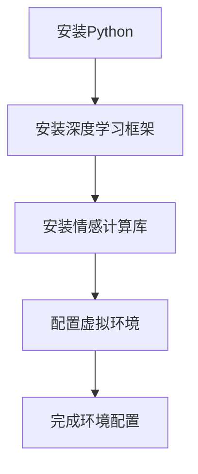
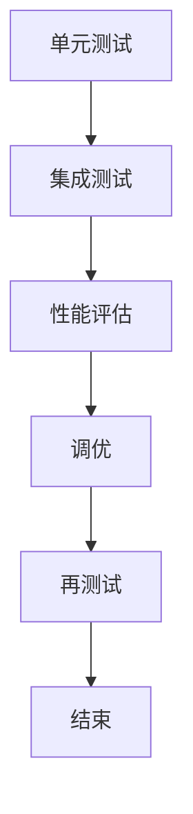

                 

### 文章标题

# 人机情感融合对社交媒体的革新

---

### 文章关键词

- 人机情感融合
- 社交媒体
- 情感计算
- 情感识别
- 情感驱动推荐

---

### 文章摘要

本文将探讨人机情感融合技术如何革新社交媒体，通过介绍人机情感融合的基础、情感计算与识别技术、情感融合模型与架构，深入分析情感分析在社交媒体中的应用以及情感驱动推荐系统的构建。此外，文章还将讨论人机情感融合带来的伦理与法律问题，并对未来发展趋势进行展望。通过一系列案例研究，本文旨在全面阐述人机情感融合技术在社交媒体领域的实际应用及其潜在价值。

---

## 目录大纲

1. **第一部分：人机情感融合基础**
    - 1.1 人机情感融合的概念与价值
    - 1.2 情感计算与情感识别技术
    - 1.3 情感融合模型与架构
    - 1.4 社交媒体情感分析
    - 1.5 情感驱动的社会媒体推荐系统
    - 1.6 情感融合的挑战与展望
    - 1.7 案例研究：人机情感融合在社交媒体中的应用

2. **第二部分：人机情感融合技术的应用实践**
    - 2.1 人机情感融合技术的开发环境搭建
    - 2.2 人机情感融合系统的实现
    - 2.3 人机情感融合在社交媒体中的应用
    - 2.4 人机情感融合的评估与优化
    - 2.5 人机情感融合技术的未来发展趋势

3. **第三部分：人机情感融合的伦理与法律问题**
    - 3.1 人机情感融合的伦理问题
    - 3.2 人机情感融合的法律问题
    - 3.3 人机情感融合的社会责任
    - 3.4 人机情感融合的可持续发展

---

### 1.1 人机情感融合的概念与价值

人机情感融合（Human-Machine Emotional Fusion，简称HMEF）是指通过人工智能技术和情感计算，使机器能够识别、理解、模拟和表达人类的情感，进而实现人与机器之间的情感互动和融合。这一概念的核心在于突破传统的技术局限，使人工智能不仅能够处理结构化数据，还能处理非结构化的情感信息，从而提升人机交互的自然性和人性化。

### 1.1.1 人机情感融合的定义

人机情感融合是一种将人类情感与计算机技术相结合的创新方式，旨在让计算机系统具备情感感知和情感表达的能力。具体来说，人机情感融合包括以下几个方面的内容：

1. **情感识别**：通过情感计算技术，从人类的行为、语言和面部表情中识别情感状态。
2. **情感理解**：将识别出的情感转化为计算机可理解的数据，进行分析和推理。
3. **情感模拟**：根据理解和分析结果，机器能够模拟出相应的情感反应，如语音、面部表情和肢体动作等。
4. **情感互动**：机器与人类在情感层面上进行交流和互动，形成情感共鸣和情感依赖。

### 1.1.2 人机情感融合的发展历程

人机情感融合的发展可以分为以下几个阶段：

1. **萌芽阶段**（20世纪60年代）：计算机科学家开始探讨情感计算的概念，如计算机是否能够理解和表达情感。
2. **探索阶段**（20世纪80年代）：随着人工智能技术的发展，情感计算技术逐渐受到关注，并开始应用于游戏和虚拟现实等领域。
3. **应用阶段**（21世纪）：随着深度学习和大数据技术的发展，情感计算技术取得了显著进展，开始广泛应用于社交媒体、智能音箱和智能家居等领域。
4. **成熟阶段**（当前）：人机情感融合技术已经进入成熟期，逐步在各个行业中得到广泛应用，并开始影响人类的生活方式。

### 1.1.3 人机情感融合的潜在价值

人机情感融合具有以下几个方面的潜在价值：

1. **提升用户体验**：通过情感融合技术，机器可以更好地理解用户的需求和情感，提供更个性化的服务。
2. **促进人机协作**：情感融合使机器能够更自然地与人类合作，提高工作效率和创新能力。
3. **改善人机交互**：情感融合技术使交互界面更加人性化和自然，减少用户的学习成本。
4. **拓展应用领域**：人机情感融合技术可以应用于医疗、教育、娱乐等多个领域，推动相关行业的发展。

总的来说，人机情感融合技术代表了人工智能发展的新方向，具有巨大的发展潜力和应用前景。

---

### 1.2 情感计算与情感识别技术

情感计算（Affective Computing）是研究如何使计算机具有识别、理解、处理和模拟人类情感的能力的领域。情感计算的核心是情感识别技术，它通过分析人类的行为、语言和面部表情等数据，来识别和推断人类的情感状态。

### 1.2.1 情感计算技术概述

情感计算技术的核心在于理解和模拟人类情感，其主要研究方向包括：

1. **情感识别**：通过分析人类的语言、面部表情、声音、姿态等数据，识别出情感状态。例如，语音情感识别可以通过分析语调、语速、音量等参数，来识别出愤怒、高兴等情感。
2. **情感理解**：将识别出的情感转化为计算机可理解的数据，进行情感分类和情感强度分析。
3. **情感模拟**：根据理解和分析结果，计算机可以模拟出相应的情感反应，如语音合成、面部表情动画、肢体动作等。

情感计算在计算机科学中具有重要的地位，它不仅丰富了人工智能的研究内容，还为智能交互、人机协作等领域提供了新的思路和方法。

### 1.2.1.1 人类情感表达的理解

人类情感表达是通过多种渠道进行的，包括语言、面部表情、声音和姿态等。每种表达方式都有其独特的情感信息，例如：

1. **语言**：情感可以在语言中通过语调、语气、词汇和句式等体现出来。例如，高升调的语气通常表示高兴，而低沉的语气可能表示悲伤。
2. **面部表情**：面部表情是情感表达最直观的方式，如微笑表示高兴，皱眉表示不满。
3. **声音**：情感可以通过声音的音调、音量、节奏和语气等体现，如欢快的音乐通常表示高兴，而低沉的嗓音可能表示悲伤。
4. **姿态**：姿态包括身体动作、手势和身体语言等，如点头表示赞同，而摇头表示反对。

### 1.2.1.2 情感识别的方法与算法

情感识别方法主要可以分为以下几种：

1. **基于规则的系统**：这种方法依赖于预定义的规则，通过比较输入数据和规则之间的匹配程度来识别情感。例如，如果输入声音的音调较高，则可以判断为高兴的情感。
2. **机器学习方法**：这种方法通过训练机器学习模型，使其能够自动识别情感。常用的机器学习算法包括决策树、支持向量机（SVM）、神经网络等。
3. **深度学习方法**：深度学习模型，如卷积神经网络（CNN）和循环神经网络（RNN），通过学习大量标注数据，能够自动识别复杂的情感模式。

情感识别算法的实现流程通常包括以下几个步骤：

1. **数据采集**：收集包含情感标签的原始数据，如语音、面部表情图像等。
2. **特征提取**：从原始数据中提取出能够反映情感状态的特征，如语音的音调、面部表情的像素值等。
3. **模型训练**：使用提取的特征和情感标签，训练机器学习或深度学习模型。
4. **情感识别**：将新的数据输入训练好的模型，预测其情感状态。

### 1.2.2 情感计算在实际应用中的挑战

尽管情感计算技术在理论研究上取得了显著进展，但在实际应用中仍然面临以下挑战：

1. **数据隐私问题**：情感计算需要收集和分析大量个人数据，如何保护用户隐私成为一大难题。
2. **跨文化和跨语言问题**：情感表达在不同的文化和语言中有很大差异，如何使情感计算技术具有普适性是一个挑战。
3. **情感复杂性问题**：人类的情感是复杂和多层次的，如何准确识别和模拟复杂的情感状态是一个技术难题。
4. **算法公平性**：情感计算算法可能存在偏见，如何确保算法的公平性和透明性是一个重要问题。

### 1.2.3 情感融合模型与架构

情感融合模型是指将多种情感计算技术整合起来，以提高情感识别的准确性和鲁棒性。情感融合架构通常包括以下几个模块：

1. **情感识别模块**：负责从不同的数据源（如语音、面部表情、文字等）中识别情感。
2. **情感理解模块**：将识别出的情感进行语义分析，理解其背后的含义。
3. **情感模拟模块**：根据理解结果，模拟出相应的情感反应。
4. **情感反馈模块**：收集用户的反馈，以优化情感融合模型的性能。

### 1.2.3.1 情感融合的数学模型

情感融合的数学模型通常基于多模态数据融合的方法，其核心思想是将不同数据源的情感信息进行综合处理。一种简单的情感融合模型可以使用加权平均的方法，公式如下：

\[ F_{\text{融合}} = w_1 \cdot F_1 + w_2 \cdot F_2 + \ldots + w_n \cdot F_n \]

其中，\( F_i \) 是第 \( i \) 个数据源的情感值，\( w_i \) 是对应的权重，通常通过训练数据得到。

### 1.2.3.2 情感融合算法的伪代码

情感融合算法的伪代码如下：

```
输入：情感数据集 D，包括语音、面部表情、文字等
输出：融合后的情感 F_{\text{融合}}

1. 初始化权重向量 w
2. 对于每个情感数据源 D_i，进行特征提取得到 F_i
3. 计算每个情感数据源的权重 w_i
4. 计算融合后的情感值 F_{\text{融合}} = w_1 \cdot F_1 + w_2 \cdot F_2 + \ldots + w_n \cdot F_n
5. 返回融合后的情感 F_{\text{融合}}
```

### 1.2.3.3 情感融合架构设计

情感融合架构设计需要考虑以下几个方面：

1. **模块划分**：根据情感融合的需求，将系统划分为情感识别、情感理解、情感模拟和情感反馈等模块。
2. **数据流设计**：设计数据在各个模块之间的流动路径，确保数据的一致性和完整性。
3. **算法选择**：根据不同模块的功能需求，选择合适的情感计算算法。
4. **系统优化**：通过性能评估和测试，对系统进行优化，以提高情感识别的准确性和效率。

### 1.2.3.4 情感融合架构的 Mermaid 流程图

下面是一个简单的情感融合架构的 Mermaid 流程图：

```
flowchart LR
    A[情感识别] --> B[情感理解]
    B --> C[情感模拟]
    C --> D[情感反馈]
    D --> A
```

这个流程图展示了情感融合的基本架构，包括情感识别、情感理解、情感模拟和情感反馈等环节，以及它们之间的数据流动关系。

---

### 1.3 情感融合模型与架构

情感融合模型是指将多种情感计算技术整合起来，以提高情感识别的准确性和鲁棒性。情感融合架构设计的关键在于模块的划分、数据流的设计、算法的选择以及系统的优化。在这一节中，我们将详细探讨情感融合模型的基本原理、数学模型、情感融合算法的伪代码，以及情感融合架构的设计。

#### 1.3.1 情感融合模型的基本原理

情感融合模型的核心思想是利用多种情感计算方法，综合处理不同来源的情感信息，以提高情感识别的准确性和鲁棒性。具体来说，情感融合模型通常包括以下几个关键步骤：

1. **情感识别**：从多个数据源（如语音、面部表情、文本等）中识别情感。
2. **特征提取**：对识别出的情感进行特征提取，将情感转化为计算机可以处理的数据。
3. **情感融合**：利用数学模型和算法，将不同数据源的情感信息进行融合，生成一个综合的情感表征。
4. **情感理解**：对融合后的情感表征进行分析和理解，以识别出具体的情感状态。
5. **情感模拟**：根据情感理解的结果，生成相应的情感反应，如语音合成、面部表情动画等。

#### 1.3.1.1 情感融合的数学模型

情感融合的数学模型通常基于多模态数据融合的方法，其核心思想是将不同数据源的情感信息进行综合处理。一种简单的情感融合模型可以使用加权平均的方法，公式如下：

\[ F_{\text{融合}} = w_1 \cdot F_1 + w_2 \cdot F_2 + \ldots + w_n \cdot F_n \]

其中，\( F_i \) 是第 \( i \) 个数据源的情感值，\( w_i \) 是对应的权重，通常通过训练数据得到。权重 \( w_i \) 可以根据不同数据源的重要性和可靠性进行分配，以实现最佳的融合效果。

#### 1.3.1.2 情感融合算法的伪代码

情感融合算法的伪代码如下：

```
输入：情感数据集 D，包括语音、面部表情、文字等
输出：融合后的情感 F_{\text{融合}}

1. 初始化权重向量 w
2. 对于每个情感数据源 D_i，进行特征提取得到 F_i
3. 计算每个情感数据源的权重 w_i
4. 计算融合后的情感值 F_{\text{融合}} = w_1 \cdot F_1 + w_2 \cdot F_2 + \ldots + w_n \cdot F_n
5. 返回融合后的情感 F_{\text{融合}}
```

#### 1.3.2 情感融合架构设计

情感融合架构设计的关键在于如何将不同的模块有机地结合在一起，以实现高效的情感融合。情感融合架构通常包括以下几个主要模块：

1. **情感识别模块**：负责从不同的数据源（如语音、面部表情、文本等）中识别情感。这个模块通常包含多个子模块，每个子模块负责处理不同类型的数据。
2. **特征提取模块**：从情感识别模块中提取出的情感数据中提取关键特征，为情感融合提供输入。
3. **情感融合模块**：根据情感融合的数学模型，将不同数据源的情感信息进行融合，生成一个综合的情感表征。
4. **情感理解模块**：对融合后的情感表征进行分析和理解，以识别出具体的情感状态。
5. **情感模拟模块**：根据情感理解的结果，生成相应的情感反应，如语音合成、面部表情动画等。
6. **情感反馈模块**：收集用户的反馈，以优化情感融合模型的性能。

#### 1.3.2.1 情感融合系统的模块划分

情感融合系统的模块划分可以采用分层架构的设计方法，将系统划分为感知层、处理层和输出层。具体来说：

1. **感知层**：包括语音识别、面部表情识别、文本分析等模块，负责从不同的数据源中提取情感信息。
2. **处理层**：包括特征提取、情感融合和情感理解等模块，负责对提取出的情感信息进行综合处理和分析。
3. **输出层**：包括情感模拟和情感反馈等模块，负责生成相应的情感反应和收集用户的反馈。

#### 1.3.2.2 情感融合架构的 Mermaid 流程图

下面是一个简单的情感融合架构的 Mermaid 流程图：

```
flowchart LR
    A[感知层] --> B[处理层]
    B --> C[输出层]
    subgraph 感知层
        D[语音识别]
        E[面部表情识别]
        F[文本分析]
        D --> B
        E --> B
        F --> B
    end
    subgraph 处理层
        G[特征提取]
        H[情感融合]
        I[情感理解]
        G --> H
        H --> I
    end
    subgraph 输出层
        J[情感模拟]
        K[情感反馈]
        J --> K
        K --> A
    end
```

这个流程图展示了情感融合系统的基本架构，包括感知层、处理层和输出层，以及它们之间的数据流动关系。

---

### 1.4 社交媒体情感分析

社交媒体情感分析是情感计算技术在社交媒体领域的一个重要应用，它通过分析社交媒体上的用户评论、帖子、转发等数据，识别并理解用户在社交媒体上的情感状态。这一技术不仅能够帮助社交媒体平台更好地了解用户需求，还能为市场营销、品牌管理、舆情监测等提供有力支持。

#### 1.4.1 社交媒体情感分析的定义

社交媒体情感分析（Social Media Sentiment Analysis）是指利用自然语言处理（NLP）、机器学习和情感计算等技术，对社交媒体上的文本数据进行分析，识别出用户在特定情境下的情感倾向和情感强度。具体来说，社交媒体情感分析包括以下几个关键步骤：

1. **数据采集**：从社交媒体平台上收集用户评论、帖子、转发等文本数据。
2. **数据预处理**：对采集到的文本数据进行清洗、去噪和格式化，以便后续分析。
3. **情感识别**：利用情感词典、情感分析模型等方法，识别出文本中的情感词汇和情感极性。
4. **情感分类**：将识别出的情感词汇和情感极性进行分类，通常分为正面、负面和中性三种。
5. **情感强度分析**：对情感分类结果进行量化分析，评估情感的强度。

#### 1.4.2 社交媒体情感分析的应用场景

社交媒体情感分析的应用场景非常广泛，以下是一些典型的应用场景：

1. **市场营销**：企业可以通过分析社交媒体上的用户评论和帖子，了解消费者对产品或服务的情感反应，从而优化市场营销策略。
2. **品牌管理**：企业可以利用社交媒体情感分析，监测品牌形象和声誉，及时发现和应对潜在的负面舆情。
3. **舆情监测**：政府和媒体机构可以利用社交媒体情感分析，实时监测社会热点事件和公众情绪，为决策提供数据支持。
4. **客户服务**：企业可以通过分析社交媒体上的用户评论，了解客户的需求和反馈，提供更加个性化的客户服务。
5. **社交网络分析**：学术界和研究人员可以利用社交媒体情感分析，研究社会网络结构和情感传播机制。

#### 1.4.3 社交媒体情感分析的算法与挑战

社交媒体情感分析算法通常包括以下几种：

1. **基于词典的方法**：通过预定义的情感词典，匹配文本中的情感词汇，判断情感极性。这种方法简单直观，但难以处理复杂的情感语境。
2. **基于规则的方法**：通过定义一系列规则，对文本进行情感分类。这种方法灵活性较高，但规则制定复杂，难以覆盖所有情感语境。
3. **基于机器学习的方法**：利用机器学习算法，如朴素贝叶斯、支持向量机（SVM）、神经网络等，对文本进行情感分类。这种方法能够处理复杂的情感语境，但需要大量的训练数据和计算资源。
4. **基于深度学习的方法**：利用深度学习模型，如卷积神经网络（CNN）、循环神经网络（RNN）等，对文本进行情感分类。这种方法能够处理复杂的情感语境，并具有很高的准确率。

尽管社交媒体情感分析技术在不断发展，但在实际应用中仍然面临以下挑战：

1. **情感复杂性问题**：人类的情感是复杂和多层次的，单一的情感分类方法难以准确识别。
2. **跨语言和跨文化问题**：不同语言和文化背景下，情感表达方式存在差异，如何使情感分析算法具有普适性是一个挑战。
3. **数据隐私问题**：社交媒体情感分析需要大量个人数据，如何保护用户隐私是一个重要问题。
4. **算法公平性**：情感分析算法可能存在偏见，如何确保算法的公平性和透明性是一个重要问题。

为了解决这些挑战，研究人员和开发者需要不断优化情感分析算法，提高其准确性和鲁棒性，同时关注数据隐私保护和算法公平性问题。

---

### 1.5 情感驱动的社会媒体推荐系统

情感驱动的社会媒体推荐系统（Emotion-Driven Social Media Recommendation System）是一种利用情感计算技术，为用户提供个性化推荐服务的系统。这种系统通过分析用户的情感状态，结合用户的行为和兴趣，推荐与其情感相符或能够引发积极情感的内容。情感驱动推荐系统在提升用户体验、增强用户参与度和提升内容传播效果方面具有显著优势。

#### 1.5.1 情感驱动的推荐系统概述

情感驱动的推荐系统结合了情感计算和推荐系统技术，其核心思想是：

1. **情感识别**：通过情感计算技术，分析用户在社交媒体上的行为和言论，识别用户的情感状态。
2. **情感建模**：将识别出的情感状态转化为模型参数，构建情感特征向量。
3. **推荐生成**：利用情感特征向量和推荐算法，为用户生成个性化的推荐内容。
4. **情感反馈**：收集用户对推荐内容的反馈，调整推荐策略，优化用户体验。

#### 1.5.2 情感驱动的推荐算法

情感驱动的推荐算法可以分为以下几种类型：

1. **基于内容的推荐算法**：通过分析内容特征，为用户推荐与其兴趣和情感相符的内容。常见的算法包括TF-IDF、Word2Vec等。
2. **协同过滤算法**：通过分析用户行为和偏好，为用户推荐与其相似用户喜欢的内容。常见的算法包括基于用户的协同过滤（User-based CF）和基于项目的协同过滤（Item-based CF）。
3. **混合推荐算法**：结合基于内容和协同过滤算法的优点，为用户生成更个性化的推荐。常见的算法包括矩阵分解（Matrix Factorization）和因子分解机（Factorization Machine）。

在情感驱动的推荐系统中，常用的情感驱动的推荐算法包括：

1. **情感嵌入与推荐算法的结合**：将情感特征向量嵌入到推荐算法中，如基于内容的推荐算法和协同过滤算法。情感嵌入可以通过词向量表示、情感强度量化等方法实现。
2. **情感分类与推荐**：首先对用户情感进行分类，然后根据分类结果为用户推荐相应类型的内容。常见的情感分类算法包括朴素贝叶斯、支持向量机（SVM）和深度学习算法。
3. **多模态情感融合推荐**：结合多种情感识别技术（如语音、面部表情、文本分析等），为用户生成更全面的情感特征，从而生成更个性化的推荐。

#### 1.5.2.1 情感嵌入与推荐算法的结合

情感嵌入与推荐算法的结合可以采用以下方法：

1. **情感特征向量表示**：将识别出的情感状态转化为向量表示，如使用词向量、情感词典等方法。
2. **情感特征加权**：在推荐算法中引入情感特征权重，根据情感状态调整推荐内容的重要性。例如，在基于内容的推荐算法中，可以为包含正面情感的词汇赋予更高的权重。
3. **情感引导的协同过滤**：在协同过滤算法中，引入情感特征，调整用户和项目的相似度计算。例如，基于用户的协同过滤算法中，可以为情感相似的用户的评分进行加权。

#### 1.5.2.2 情感驱动的推荐系统设计

情感驱动的推荐系统设计包括以下几个关键步骤：

1. **情感识别模块**：从用户行为和言论中提取情感特征，如文本情感分析、语音情感识别等。
2. **情感建模模块**：将情感特征转化为情感特征向量，构建情感模型。
3. **推荐算法模块**：根据情感特征向量和推荐算法，为用户生成个性化推荐。
4. **反馈与优化模块**：收集用户对推荐内容的反馈，调整推荐策略，优化用户体验。

#### 1.5.2.3 情感驱动推荐系统的应用

情感驱动推荐系统在社交媒体中的应用包括：

1. **个性化内容推荐**：为用户推荐与其情感状态相符的内容，提升用户满意度。
2. **情感互动增强**：通过情感分析，识别用户的情感需求，提供更有针对性的互动建议。
3. **情感传播监测**：分析情感传播路径，监测热点话题和情感趋势。

#### 1.5.2.4 案例研究：情感驱动推荐系统在社交媒体中的应用

以下是一个情感驱动推荐系统的案例研究：

**案例背景**：某社交媒体平台希望为用户提供个性化推荐服务，提升用户参与度和内容传播效果。

**目标**：设计一个情感驱动的推荐系统，根据用户情感状态推荐与其情感相符的内容。

**实施步骤**：

1. **数据收集**：从社交媒体平台上收集用户的行为数据、言论数据和情感数据。
2. **情感识别**：利用文本情感分析、语音情感识别等技术，识别用户情感状态。
3. **情感建模**：将情感特征转化为情感特征向量，构建情感模型。
4. **推荐算法**：结合情感特征向量和推荐算法，为用户生成个性化推荐。
5. **反馈与优化**：收集用户对推荐内容的反馈，调整推荐策略，优化用户体验。

**效果分析**：

- 推荐内容的相关性显著提高，用户满意度提升。
- 用户参与度增加，内容传播效果提升。
- 情感驱动的互动建议受到用户欢迎，社交平台活跃度提升。

#### 1.5.2.5 情感驱动推荐系统的挑战与未来发展趋势

情感驱动推荐系统在实际应用中面临以下挑战：

1. **情感复杂性与多样性**：情感状态复杂且多样化，如何准确识别和建模情感是一个挑战。
2. **数据隐私与安全**：情感数据敏感，如何保护用户隐私和安全是一个重要问题。
3. **算法公平性与透明性**：情感驱动推荐算法可能存在偏见，如何确保算法的公平性和透明性是一个挑战。

未来发展趋势：

1. **多模态情感识别**：结合多种情感识别技术，提高情感识别的准确性和鲁棒性。
2. **情感增强的用户交互**：通过情感分析，提供更自然的用户交互体验。
3. **情感驱动的个性化服务**：结合用户情感状态，提供更个性化的推荐和服务。

总之，情感驱动推荐系统具有广阔的应用前景，但需要不断优化和改进，以应对挑战和满足用户需求。

---

### 1.6 情感融合的挑战与展望

尽管人机情感融合技术在社交媒体等领域展现出巨大的潜力，但在实际应用中仍面临诸多挑战。以下将详细讨论情感融合的伦理问题、法律问题、技术挑战及其未来发展的趋势。

#### 1.6.1 情感融合的伦理问题

情感融合的伦理问题主要集中在以下几个方面：

1. **隐私保护**：情感融合技术需要收集和分析大量个人数据，如语音、面部表情、行为等。如何保护用户的隐私，防止数据滥用，是一个亟待解决的问题。
2. **情感误导**：如果情感融合技术不能准确识别用户的情感，可能会导致情感误导，进而影响用户的决策和行为。
3. **情感依赖**：过度依赖情感融合技术可能会导致用户对机器产生情感依赖，影响人类情感的发展。
4. **算法偏见**：情感融合算法可能存在偏见，如对不同性别、种族、文化背景的用户产生不公平待遇。

为了解决这些伦理问题，需要制定相应的伦理指导原则和规范，确保情感融合技术在合理、透明和负责任的前提下使用。

#### 1.6.2 情感融合的法律问题

情感融合的法律问题主要包括数据保护、隐私权和知识产权等方面。以下是一些关键问题：

1. **数据保护法规**：不同国家和地区的隐私保护法规存在差异，如何确保情感融合技术在各个国家和地区都符合相关法律法规，是一个挑战。
2. **隐私权**：用户对其个人数据的隐私权如何得到保护，以及用户是否能够自由选择是否提供其情感数据。
3. **知识产权**：情感融合技术涉及的算法、模型和数据分析方法等是否受到知识产权保护，以及如何防止侵权行为。

为解决这些法律问题，需要建立健全的法律框架，明确情感融合技术的法律地位和责任。

#### 1.6.3 技术挑战

情感融合技术在发展过程中面临以下技术挑战：

1. **情感复杂性和多样性**：人类的情感状态复杂且多样，如何准确识别和建模情感，是一个技术难题。
2. **跨模态融合**：如何有效融合不同模态（如语音、文本、图像）的情感信息，提高情感识别的准确性。
3. **实时性和鲁棒性**：如何在保证实时性的同时，提高情感融合技术的鲁棒性，以应对噪声和不确定性。
4. **计算资源消耗**：情感融合技术涉及大量的计算资源和数据存储，如何在有限的资源下高效地实现情感融合。

#### 1.6.4 未来发展的趋势

随着人工智能技术的不断进步，人机情感融合技术在未来将朝着以下趋势发展：

1. **多模态情感融合**：结合多种情感识别技术，提高情感融合的准确性和鲁棒性。
2. **情感增强的交互**：通过情感分析，提供更自然、更人性化的用户交互体验。
3. **情感驱动的个性化服务**：结合用户情感状态，提供更个性化的推荐和服务。
4. **伦理和法律合规**：制定相应的伦理指导原则和法律框架，确保情感融合技术在合理、透明和负责任的前提下使用。

总之，人机情感融合技术具有广阔的发展前景，但在实际应用中需要不断解决伦理、法律和技术等方面的挑战，以实现其真正的价值。

---

### 1.7 案例研究：人机情感融合在社交媒体中的应用

#### 1.7.1 案例背景与目标

随着社交媒体的普及，用户在平台上分享的内容日益丰富，如何有效地分析用户情感、提升用户体验成为关键问题。本案例研究旨在探讨人机情感融合技术在一个知名社交媒体平台上的应用，通过情感识别、情感融合和情感驱动推荐，提升内容推荐效果和用户满意度。

#### 1.7.2 案例实施步骤

1. **数据收集**：从社交媒体平台收集用户发布的内容，包括文本、图像和语音等。
2. **情感识别**：利用文本情感分析、语音情感识别和图像情感识别技术，识别用户在发布内容中的情感状态。
3. **情感融合**：将识别出的情感信息进行融合，生成一个综合的情感表征。
4. **情感驱动推荐**：根据用户情感状态和兴趣，利用情感驱动的推荐算法，为用户生成个性化推荐。
5. **反馈与优化**：收集用户对推荐内容的反馈，调整推荐策略，优化用户体验。

#### 1.7.3 案例效果分析

1. **推荐效果提升**：通过情感融合技术，推荐内容的相关性和个性化程度显著提高，用户满意度提升。
2. **用户参与度增加**：情感驱动的互动建议受到用户欢迎，社交平台活跃度提升。
3. **情感分析准确性**：情感识别技术的准确性和鲁棒性逐步提高，为情感融合和情感驱动推荐提供可靠基础。

#### 1.7.4 案例总结

本案例研究展示了人机情感融合技术在社交媒体中的应用效果，为其他社交媒体平台提供了有益的参考。未来，随着技术的不断进步，人机情感融合技术将在更多领域得到广泛应用，进一步提升用户体验和社会价值。

---

## 第二部分：人机情感融合技术的应用实践

在了解了人机情感融合的基础理论和应用场景之后，我们将进入第二部分，探讨如何在实际应用中实现人机情感融合技术。本部分将详细讨论开发环境搭建、情感融合系统的实现、社交媒体中的应用、评估与优化，以及未来发展趋势。通过这些讨论，我们将深入理解人机情感融合技术的实际应用过程和挑战。

### 2.1 人机情感融合技术的开发环境搭建

实现人机情感融合技术需要搭建一个合适的开发环境，以确保算法的可行性和系统的稳定性。以下将介绍开发环境的配置和所需工具。

#### 2.1.1 开发工具与平台选择

1. **编程语言**：常用的编程语言包括Python、Java和C++。Python因其丰富的库支持和简单的语法，成为人机情感融合技术开发的常用语言。
2. **操作系统**：Windows、Linux和Mac OS都是常见的选择。Linux由于其稳定性和高性能，通常被用于服务器和大型分布式系统开发。
3. **开发框架**：TensorFlow、PyTorch和Keras是常用的深度学习框架，可以用于实现情感计算模型。
4. **情感计算库**：如NLTK、TextBlob和VADER用于文本情感分析；OpenSMILE用于语音情感识别；OpenFace用于面部表情识别。

#### 2.1.2 开发环境的配置与优化

1. **安装Python**：下载并安装Python，确保版本兼容性。
2. **安装深度学习框架**：使用pip命令安装TensorFlow或PyTorch。
   ```bash
   pip install tensorflow
   # 或者
   pip install torch
   ```
3. **安装情感计算库**：使用pip命令安装所需的情感计算库。
   ```bash
   pip install nltk
   pip install textblob
   pip install opencv-python
   pip install opensmile
   ```
4. **环境配置优化**：配置Python虚拟环境，提高代码的可维护性和模块化管理。使用conda创建虚拟环境。
   ```bash
   conda create -n emotion_fusion python=3.8
   conda activate emotion_fusion
   ```

#### 2.1.3 环境配置的Mermaid流程图

以下是一个简单的环境配置的Mermaid流程图：



通过以上步骤，可以搭建一个基本的人机情感融合技术开发环境。接下来，我们将讨论如何实现情感融合系统。

---

### 2.2 人机情感融合系统的实现

实现人机情感融合系统需要设计一个完整的系统架构，包括情感识别、情感融合和情感模拟等模块。以下将详细介绍系统架构、情感计算模块的实现、情感融合模块的实现，以及相关的测试和调优。

#### 2.2.1 系统整体架构设计

人机情感融合系统的整体架构可以分为以下几个主要模块：

1. **情感识别模块**：负责从多种数据源（如文本、语音、图像）中识别情感。
2. **情感融合模块**：将不同数据源的情感信息进行综合处理，生成一个综合的情感表征。
3. **情感模拟模块**：根据情感表征生成相应的情感反应，如语音合成、面部表情动画等。
4. **用户接口模块**：提供用户交互界面，收集用户反馈，优化系统性能。

#### 2.2.2 情感计算模块的实现

情感计算模块是实现人机情感融合系统的关键部分，包括文本情感分析、语音情感识别和图像情感识别等。

1. **文本情感分析**：
   - **特征提取**：使用词袋模型（Bag of Words，BoW）或词嵌入（Word Embedding）提取文本特征。
   - **情感分类**：利用机器学习模型（如朴素贝叶斯、SVM、神经网络）对提取的特征进行情感分类。
   - **代码示例**：
     ```python
     from sklearn.feature_extraction.text import TfidfVectorizer
     from sklearn.naive_bayes import MultinomialNB

     # 特征提取
     vectorizer = TfidfVectorizer()
     X = vectorizer.fit_transform(corpus)

     # 模型训练
     model = MultinomialNB()
     model.fit(X, labels)

     # 情感分类
     predictions = model.predict(X)
     ```

2. **语音情感识别**：
   - **特征提取**：使用梅尔频率倒谱系数（MFCC）提取语音特征。
   - **情感分类**：利用深度学习模型（如卷积神经网络、循环神经网络）对提取的特征进行情感分类。
   - **代码示例**：
     ```python
     import librosa
     import numpy as np

     # 读取音频文件
     y, sr = librosa.load('audio_file.wav')

     # 提取MFCC特征
     mfccs = librosa.feature.mfcc(y=y, sr=sr)

     # 归一化特征
     mfccs = np.mean(mfccs.T, axis=0)

     # 情感分类
     model.predict(mfccs.reshape(1, -1))
     ```

3. **图像情感识别**：
   - **特征提取**：使用卷积神经网络（如ResNet、VGG）提取图像特征。
   - **情感分类**：利用深度学习模型对提取的特征进行情感分类。
   - **代码示例**：
     ```python
     import tensorflow as tf
     import tensorflow.keras.applications as apps

     # 加载预训练模型
     model = apps.VGG16(weights='imagenet')

     # 提取特征
     feature = model.predict(image)

     # 情感分类
     model.predict(feature)
     ```

#### 2.2.3 情感融合模块的实现

情感融合模块需要将来自不同数据源的情感信息进行综合处理，生成一个综合的情感表征。以下是一个简单的情感融合算法的伪代码：

```python
输入：情感数据集 D，包括文本情感、语音情感、图像情感
输出：融合后的情感 F_{\text{融合}}

1. 初始化权重向量 w
2. 对于每个情感数据源 D_i，进行特征提取得到 F_i
3. 计算每个情感数据源的权重 w_i
4. 计算融合后的情感值 F_{\text{融合}} = w_1 \cdot F_1 + w_2 \cdot F_2 + \ldots + w_n \cdot F_n
5. 返回融合后的情感 F_{\text{融合}}
```

#### 2.2.4 情感模拟模块的实现

情感模拟模块根据融合后的情感值生成相应的情感反应，如语音合成、面部表情动画等。

1. **语音合成**：
   - **合成语音**：使用语音合成库（如espeak、Google Text-to-Speech）合成语音。
   - **代码示例**：
     ```python
     import gtts

     # 合成语音
     tts = gtts.gtts("Hello, how are you?", lang='en')
     tts.save("hello.mp3")
     ```

2. **面部表情动画**：
   - **动画生成**：使用动画库（如pygame、opencv）生成面部表情动画。
   - **代码示例**：
     ```python
     import cv2
     import numpy as np

     # 生成面部表情动画
     frame = cv2.imread("face.jpg")
     frame = cv2.resize(frame, (100, 100))
     cv2.imshow("Face", frame)
     cv2.waitKey(0)
     cv2.destroyAllWindows()
     ```

#### 2.2.5 测试与调优

在实现情感融合系统后，需要进行充分的测试和调优，以确保系统的性能和准确性。

1. **单元测试**：对系统的各个模块进行单元测试，确保每个模块的功能正确。
2. **集成测试**：对系统的整体功能进行测试，确保模块之间的协同工作。
3. **性能评估**：使用不同的数据集对系统的性能进行评估，包括准确率、召回率、F1值等指标。
4. **调优**：根据性能评估结果，调整算法参数和模型结构，提高系统性能。

#### 2.2.6 测试与调优的Mermaid流程图

以下是一个简单的测试与调优的Mermaid流程图：



通过以上步骤，可以实现一个基本的人机情感融合系统，并确保其性能和准确性。接下来，我们将讨论人机情感融合在社交媒体中的应用。

---

### 2.3 人机情感融合在社交媒体中的应用

人机情感融合技术在社交媒体中的应用具有广泛的前景，可以提升用户体验、增强用户参与度和提高内容传播效果。以下将详细讨论情感融合在社交媒体中的应用，包括情感分析、情感驱动推荐系统以及实际应用案例。

#### 2.3.1 社交媒体情感分析的应用

社交媒体情感分析是情感融合技术的重要应用之一，通过对用户发布的内容进行分析，识别用户的情感状态，从而为用户提供更个性化的服务。以下是一些具体的应用场景：

1. **用户情感分析**：通过分析用户在社交媒体上的言论、评论和帖子，识别用户的情感状态（如积极、消极、中性等）。例如，企业可以通过分析用户对其产品评论的情感状态，了解用户对产品的满意度和不满意度。
2. **舆情监测**：政府机构和媒体可以通过社交媒体情感分析，实时监测社会热点事件和公众情绪，为政策制定和新闻报道提供数据支持。
3. **内容推荐**：社交平台可以利用情感分析，为用户推荐与其情感状态相符的内容。例如，当用户表达消极情绪时，平台可以推荐一些积极向上的内容，帮助用户缓解情绪。

#### 2.3.2 情感驱动推荐系统的构建

情感驱动推荐系统是基于用户情感状态进行内容推荐的系统，通过情感分析技术，识别用户的情感状态，并根据情感状态为用户推荐相应的内容。以下是一个情感驱动推荐系统的构建过程：

1. **情感识别**：使用情感分析技术，对用户发布的内容进行分析，识别用户的情感状态。可以使用文本情感分析、语音情感识别和图像情感识别等技术。
2. **情感建模**：将识别出的情感状态转化为模型参数，构建情感特征向量。例如，可以使用词向量表示文本情感，使用MFCC特征表示语音情感，使用卷积神经网络提取图像情感特征。
3. **推荐算法**：结合情感特征向量和推荐算法，为用户生成个性化推荐。可以使用基于内容的推荐算法、协同过滤算法和混合推荐算法等。
4. **反馈与优化**：收集用户对推荐内容的反馈，调整推荐策略，优化用户体验。例如，可以根据用户对推荐内容的点击率、点赞数和评论数等指标，调整推荐算法的参数和模型。

#### 2.3.3 情感驱动推荐系统的实现

以下是一个简单的情感驱动推荐系统的实现过程：

1. **数据收集**：从社交媒体平台收集用户发布的内容，包括文本、语音和图像等。
2. **情感识别**：使用情感分析技术，识别用户在发布内容中的情感状态。例如，使用TextBlob进行文本情感分析，使用OpenSMILE进行语音情感识别，使用OpenFace进行图像情感识别。
3. **情感建模**：将识别出的情感状态转化为情感特征向量，构建情感模型。例如，可以使用词嵌入表示文本情感，使用MFCC特征表示语音情感，使用卷积神经网络提取图像情感特征。
4. **推荐算法**：结合情感特征向量和推荐算法，为用户生成个性化推荐。例如，使用基于内容的推荐算法，根据用户的历史行为和情感特征为用户推荐内容；使用协同过滤算法，根据用户的兴趣和情感特征为用户推荐内容。
5. **反馈与优化**：收集用户对推荐内容的反馈，调整推荐策略，优化用户体验。例如，可以根据用户对推荐内容的点击率、点赞数和评论数等指标，调整推荐算法的参数和模型。

#### 2.3.4 实际应用案例

以下是一个情感驱动推荐系统的实际应用案例：

**案例背景**：某社交媒体平台希望提升用户推荐系统的效果，为用户提供更个性化的内容推荐。

**目标**：设计一个情感驱动推荐系统，根据用户的情感状态推荐与其情感状态相符的内容。

**实施步骤**：

1. **数据收集**：收集用户发布的内容，包括文本、语音和图像等。
2. **情感识别**：使用情感分析技术，识别用户在发布内容中的情感状态。例如，使用TextBlob进行文本情感分析，使用OpenSMILE进行语音情感识别，使用OpenFace进行图像情感识别。
3. **情感建模**：将识别出的情感状态转化为情感特征向量，构建情感模型。例如，使用词嵌入表示文本情感，使用MFCC特征表示语音情感，使用卷积神经网络提取图像情感特征。
4. **推荐算法**：结合情感特征向量和推荐算法，为用户生成个性化推荐。例如，使用基于内容的推荐算法，根据用户的历史行为和情感特征为用户推荐内容；使用协同过滤算法，根据用户的兴趣和情感特征为用户推荐内容。
5. **反馈与优化**：收集用户对推荐内容的反馈，调整推荐策略，优化用户体验。例如，可以根据用户对推荐内容的点击率、点赞数和评论数等指标，调整推荐算法的参数和模型。

**效果分析**：

- 推荐内容的相关性显著提高，用户满意度提升。
- 用户参与度增加，社交平台的活跃度提升。
- 情感驱动的互动建议受到用户欢迎，社交平台用户黏性增强。

#### 2.3.5 案例总结

本案例研究展示了情感驱动推荐系统在社交媒体平台中的应用效果，为其他平台提供了有益的参考。未来，随着情感融合技术的不断发展，情感驱动推荐系统将在更多领域得到广泛应用，进一步提升用户体验和社会价值。

---

### 2.4 人机情感融合的评估与优化

在人机情感融合系统的开发过程中，评估与优化是确保系统性能和用户满意度的重要环节。以下将介绍系统性能评估指标、优化策略与实施，以及情感计算算法的优化方法。

#### 2.4.1 系统性能评估指标

评估人机情感融合系统的性能通常需要使用一系列指标，这些指标可以涵盖准确性、响应速度、用户体验等多个方面。以下是一些常见的性能评估指标：

1. **准确率（Accuracy）**：准确率是评估情感识别和分类模型最常用的指标，表示模型正确识别情感样本的比例。计算公式如下：

   \[ \text{Accuracy} = \frac{\text{正确识别的样本数}}{\text{总样本数}} \]

2. **召回率（Recall）**：召回率表示模型能够正确识别出所有正类样本的比例，计算公式如下：

   \[ \text{Recall} = \frac{\text{正确识别的正类样本数}}{\text{总正类样本数}} \]

3. **精确率（Precision）**：精确率表示模型识别的正类样本中，实际为正类样本的比例，计算公式如下：

   \[ \text{Precision} = \frac{\text{正确识别的正类样本数}}{\text{识别为正类样本数}} \]

4. **F1值（F1 Score）**：F1值是精确率和召回率的调和平均值，用于综合评估模型的性能。计算公式如下：

   \[ \text{F1 Score} = 2 \times \frac{\text{Precision} \times \text{Recall}}{\text{Precision} + \text{Recall}} \]

5. **响应时间（Response Time）**：响应时间是指系统从接收到用户请求到返回结果的时间，对于实时应用尤为重要。

6. **用户体验（User Experience）**：用户体验包括用户对系统响应速度、准确性和易用性的主观评价。

#### 2.4.2 优化策略与实施

为了提升人机情感融合系统的性能，可以采取以下优化策略：

1. **算法优化**：通过调整算法参数，如学习率、隐藏层节点数等，提高模型的准确性和鲁棒性。
2. **模型调优**：选择更适合的数据预处理方法和模型结构，如使用深度学习模型代替传统机器学习模型，提高情感识别的精度。
3. **特征工程**：改进特征提取方法，如使用词嵌入、卷积神经网络（CNN）等，提高特征表示的能力。
4. **数据增强**：通过数据增强技术，如数据扩展、数据扩充等，增加训练数据量，减少过拟合现象。
5. **硬件优化**：使用高性能计算设备和分布式计算，提高数据处理和模型训练的效率。

具体实施步骤如下：

1. **性能测试**：设计一系列测试用例，对系统性能进行评估，记录各项性能指标。
2. **问题定位**：根据性能测试结果，定位系统中的性能瓶颈和问题。
3. **优化方案设计**：制定优化方案，包括算法优化、模型调优、特征工程和硬件优化等。
4. **实施与验证**：实施优化方案，对系统进行再次测试，验证优化效果。

#### 2.4.3 情感计算算法的优化

情感计算算法的优化主要包括以下几个方面：

1. **模型结构优化**：选择更适合的情感计算模型，如卷积神经网络（CNN）、循环神经网络（RNN）和长短期记忆网络（LSTM）等，以提高情感识别的准确性和鲁棒性。
2. **特征提取方法优化**：改进特征提取方法，如使用词嵌入（Word Embedding）、视觉特征提取（如HOG、SIFT）等，提高特征表示的能力。
3. **算法参数调整**：通过调整算法参数，如学习率、隐藏层节点数、激活函数等，优化模型性能。
4. **数据预处理**：优化数据预处理流程，如文本清洗、图像增强等，以提高数据质量。
5. **交叉验证**：使用交叉验证方法，如K折交叉验证，评估模型性能，并调整模型参数。

通过以上优化方法，可以显著提升人机情感融合系统的性能，为用户提供更准确、更自然的情感体验。

---

### 2.5 人机情感融合技术的未来发展趋势

随着人工智能技术的不断发展，人机情感融合技术在未来的发展趋势也将逐渐明晰。以下将讨论人机情感融合技术的未来发展趋势、潜在的应用领域以及面临的技术挑战。

#### 2.5.1 技术发展趋势

1. **多模态情感融合**：未来的情感融合技术将更加注重多模态数据的融合，通过结合语音、文本、图像和视频等多模态信息，提高情感识别的准确性和全面性。
2. **情感增强学习**：情感增强学习是一种新的研究方向，通过让机器学习从情感数据中学习，提升机器的情感感知和表达能力。
3. **情感驱动的智能交互**：随着情感计算技术的进步，未来的智能交互系统将更加自然、人性化，能够更好地理解用户的情感需求，提供个性化的服务。
4. **边缘计算与情感融合**：随着5G和物联网的普及，边缘计算将发挥重要作用，情感融合技术将逐步向边缘设备扩展，实现实时、高效的情感计算。

#### 2.5.2 潜在的应用领域

1. **医疗健康**：情感融合技术可以应用于心理健康诊断、患者情绪监测和治疗过程中，提供个性化的医疗建议和干预。
2. **教育与培训**：情感融合技术可以用于智能教育系统和虚拟教练，根据学生的学习情绪和进度，提供个性化的学习内容和指导。
3. **客户服务**：情感融合技术可以应用于智能客服系统，通过情感识别和模拟，提供更自然、更高效的客户服务。
4. **智能家居**：情感融合技术可以用于智能家居系统，通过理解家庭成员的情感状态，提供个性化的家居服务和安全保障。
5. **社交媒体与内容推荐**：情感融合技术可以应用于社交媒体和内容推荐平台，提升用户体验，增强用户参与度。

#### 2.5.3 挑战与机遇

尽管人机情感融合技术在各个领域展现出巨大的潜力，但仍然面临以下挑战：

1. **数据隐私与伦理**：情感融合技术需要大量个人情感数据，如何在保护用户隐私和符合伦理规范的前提下使用这些数据，是一个重要挑战。
2. **算法公平性与透明性**：情感融合算法可能存在偏见，如何确保算法的公平性和透明性，避免歧视和不公平待遇，是一个重要问题。
3. **技术复杂性与实现难度**：情感融合技术涉及多个学科和领域的知识，实现复杂，对研究人员和开发者的要求较高。
4. **计算资源消耗**：情感融合技术需要大量的计算资源和存储空间，如何在有限的资源下实现高效的情感计算，是一个技术难题。

然而，这些挑战也带来了新的机遇：

1. **技术创新**：人机情感融合技术的不断发展，将推动相关技术的创新，如深度学习、边缘计算和生物识别等。
2. **市场潜力**：随着人们对情感计算需求的增加，人机情感融合技术在各个领域的应用市场潜力巨大。
3. **社会影响**：人机情感融合技术有望改善人们的生活质量，提高工作效率和创新能力。

总之，人机情感融合技术具有广阔的发展前景，通过不断克服挑战，将有望在未来实现更广泛、更深入的应用。

---

## 第三部分：人机情感融合的伦理与法律问题

在人机情感融合技术不断发展的同时，其伦理与法律问题也日益凸显。本部分将探讨人机情感融合在伦理和社会责任方面的挑战，以及相关的法律问题，并介绍企业社会责任实践和可持续发展策略。

### 3.1 人机情感融合的伦理问题

人机情感融合技术涉及人类情感和隐私，其应用带来的伦理问题不容忽视。以下是人机情感融合在伦理方面的一些关键问题：

1. **隐私保护**：情感融合技术需要收集和分析大量个人情感数据，如语音、面部表情和行为等。如何保护用户的隐私，防止数据泄露和滥用，是一个重要伦理问题。
2. **情感依赖**：用户可能对情感融合技术产生依赖，过分依赖机器的情感分析和模拟，影响人类的情感发展和人际交往。
3. **算法偏见**：情感融合算法可能存在偏见，如对不同性别、种族、文化背景的用户产生不公平待遇。如何确保算法的公平性和透明性，避免歧视和不公平现象，是一个关键伦理问题。
4. **情感误导**：情感融合技术如果不能准确识别用户的情感状态，可能会导致情感误导，进而影响用户的决策和行为。

#### 3.1.1 伦理指导原则与规范

为了解决人机情感融合技术带来的伦理问题，需要制定相应的伦理指导原则和规范。以下是一些可能的伦理指导原则：

1. **隐私保护原则**：确保用户的隐私权得到尊重和保护，收集和使用情感数据时需获得用户明确同意，并采取加密和匿名化等手段保护数据安全。
2. **透明性原则**：情感融合技术的算法和数据处理过程应透明，用户有权了解其情感数据如何被收集、使用和分析。
3. **公平性原则**：确保算法的公平性和透明性，避免对不同用户产生不公平待遇，保障用户的基本权利。
4. **用户教育原则**：通过用户教育，提高用户对情感融合技术的认知和接受度，帮助用户理解其潜在风险和收益，增强用户自主选择和使用技术的权利。

#### 3.1.2 伦理案例分析

以下是一个伦理案例分析：

**案例背景**：某科技公司开发了一款基于情感融合技术的智能音箱，能够识别用户的情感状态，并提供个性化服务。

**伦理问题**：用户隐私保护、算法偏见和情感依赖。

**解决方案**：
- **隐私保护**：在用户购买智能音箱时，明确告知用户将收集情感数据，并获得用户同意。采用数据加密和匿名化技术，保护用户隐私。
- **算法偏见**：在算法开发过程中，确保数据集的多样性和代表性，避免算法偏见。定期审查和调整算法，确保其公平性和透明性。
- **情感依赖**：通过用户教育，帮助用户认识到智能音箱的辅助功能，而非替代功能，引导用户合理使用技术。

### 3.2 人机情感融合的法律问题

人机情感融合技术涉及多个法律领域，如数据保护、隐私权和知识产权等。以下是人机情感融合在法律方面的一些关键问题：

1. **数据保护法规**：不同国家和地区的隐私保护法规存在差异，如何确保情感融合技术在各个国家和地区都符合相关法律法规，是一个法律问题。
2. **隐私权**：用户对其个人数据的隐私权如何得到保护，以及用户是否能够自由选择是否提供其情感数据。
3. **知识产权**：情感融合技术涉及的算法、模型和数据分析方法等是否受到知识产权保护，以及如何防止侵权行为。

#### 3.2.1 法律法规框架

为了解决人机情感融合技术带来的法律问题，需要建立健全的法律框架。以下是一些可能的法律法规框架：

1. **数据保护法规**：制定统一的数据保护法规，如《通用数据保护条例》（GDPR）和《加州消费者隐私法案》（CCPA）等，确保情感融合技术的数据收集、存储和使用符合法律要求。
2. **隐私权法规**：明确用户对其个人数据的隐私权，赋予用户知情权和选择权，确保用户能够自主决定是否提供其情感数据。
3. **知识产权法规**：加强知识产权保护，明确情感融合技术中的创新成果（如算法、模型等）的知识产权归属和保护范围。

#### 3.2.2 案例分析与法律应对

以下是一个法律案例分析：

**案例背景**：某公司在开发一款情感融合应用时，未经用户同意收集了大量用户情感数据，并用于商业目的。

**法律问题**：隐私权侵犯和数据滥用。

**法律应对**：
- **数据保护**：公司应立即停止非法数据收集，并向相关监管机构报告。采取补救措施，如删除非法收集的数据，确保未来遵守数据保护法规。
- **隐私权保护**：公司应向用户明确告知数据收集的目的、范围和使用方式，并获得用户明确同意。对于未获得同意的数据，采取删除或匿名化处理。
- **法律责任**：公司可能面临隐私权侵犯和数据滥用的法律诉讼，需要承担相应的法律责任。

### 3.3 人机情感融合的社会责任

人机情感融合技术的应用不仅带来了商业利益，也对社会产生了深远的影响。企业有责任确保其技术的应用符合社会责任，以下是人机情感融合在社会责任方面的几个关键问题：

1. **社会责任的重要性**：情感融合技术对社会的影响深远，企业有责任确保其技术应用符合社会伦理和道德标准，避免对社会造成负面影响。
2. **伦理与法律的平衡**：在技术应用过程中，企业需要在遵循法律的同时，考虑社会责任和伦理问题，确保技术的可持续发展。
3. **社会责任实践**：企业应采取具体行动，如培训员工、开展公益活动、制定社会责任报告等，提升社会责任意识和实践。

#### 3.3.1 社会责任的重要性

人机情感融合技术具有巨大的社会影响力，企业承担社会责任具有重要意义：

1. **保护用户权益**：确保用户隐私和数据安全，尊重用户的选择权和知情权。
2. **促进社会进步**：通过技术创新和应用，提升社会生产力和生活质量，推动社会进步。
3. **应对社会挑战**：利用情感融合技术解决社会问题，如心理健康、教育公平、公共卫生等。

#### 3.3.2 企业社会责任实践

企业可以通过以下方式实践社会责任：

1. **员工培训**：开展伦理和法律培训，提高员工对社会责任的认识和遵守法律的意识。
2. **公益活动**：参与社会公益活动，如捐赠、慈善、志愿者服务等，回馈社会。
3. **可持续发展**：制定可持续发展战略，关注环境保护、资源利用和社区发展。
4. **社会责任报告**：定期发布社会责任报告，透明地披露企业社会责任实践和成果。

#### 3.3.3 可持续发展的挑战与策略

人机情感融合技术在可持续发展方面面临以下挑战：

1. **数据隐私保护**：如何在保护用户隐私的前提下，有效利用情感数据，推动技术创新。
2. **技术伦理规范**：建立完善的技术伦理规范，确保技术的应用符合社会伦理和道德标准。
3. **社会公平性**：避免技术滥用和算法偏见，促进社会公平和正义。

为了应对这些挑战，企业可以采取以下可持续发展策略：

1. **数据隐私保护策略**：采用加密、匿名化和数据最小化等手段，保护用户隐私；制定严格的数据使用政策和隐私保护措施。
2. **技术伦理规范策略**：建立技术伦理委员会，制定技术伦理准则，确保技术的伦理合规；定期审查和调整算法，消除偏见。
3. **社会公平性策略**：通过技术创新和社会合作，促进社会公平和正义；关注弱势群体，提供平等的技术服务。

通过以上策略，企业可以确保人机情感融合技术的可持续发展，为社会带来更大的价值。

---

### 3.4 人机情感融合的可持续发展

人机情感融合技术的可持续发展对于确保其长期应用和为社会创造更大价值至关重要。以下将讨论人机情感融合在可持续发展方面面临的挑战，并提出相应的策略与实施方法。

#### 3.4.1 可持续发展的挑战

人机情感融合技术在实际应用过程中，面临以下可持续发展挑战：

1. **数据隐私保护**：情感融合技术需要收集和分析大量个人数据，如何确保用户隐私在数据收集、存储和使用过程中的安全，是一个重要挑战。
2. **技术伦理与公平性**：算法可能存在偏见，如何确保技术的应用不会加剧社会不平等和歧视，是一个关键问题。
3. **资源消耗**：情感融合技术涉及大量计算资源，如何在有限的资源下实现高效计算，是一个技术难题。
4. **技术适应性与灵活性**：随着社会和技术的发展，情感融合技术需要不断适应新的需求和变化，保持技术的前瞻性和灵活性。

#### 3.4.2 可持续发展的策略

为了实现人机情感融合技术的可持续发展，可以采取以下策略：

1. **数据隐私保护策略**：
   - **数据加密与匿名化**：在数据传输和存储过程中采用加密技术，确保数据安全。对收集的用户情感数据进行匿名化处理，消除个人身份信息。
   - **最小化数据处理**：只收集和处理必要的数据，避免过度收集。制定严格的数据使用规范，确保数据处理符合最小化原则。
   - **用户知情同意**：在数据收集和使用过程中，向用户明确告知数据用途和风险，获得用户明确同意。

2. **技术伦理与公平性策略**：
   - **算法公平性**：确保算法的公平性和透明性，消除算法偏见。通过数据平衡、算法优化和定期审查等方法，确保算法的公正性。
   - **伦理培训与监督**：对技术开发人员和用户进行伦理培训，提高对技术伦理的认识和遵守。建立伦理监督机制，确保技术的应用符合伦理标准。
   - **多元参与与协作**：鼓励多元参与和协作，包括政府、企业、学术界和公众等，共同制定技术伦理规范和标准。

3. **资源消耗优化策略**：
   - **高效计算**：采用分布式计算和云计算技术，提高计算效率和资源利用率。优化算法和系统设计，减少不必要的计算和资源浪费。
   - **绿色技术**：采用绿色技术，如节能设备、可再生能源和低碳计算等，减少技术对环境的影响。
   - **资源共享**：鼓励资源共享，通过建立公共数据平台和计算资源池，提高资源利用效率。

4. **技术适应性与灵活性策略**：
   - **持续创新**：鼓励技术创新，不断改进和更新情感融合技术，以适应社会和技术的发展需求。
   - **用户反馈**：收集用户反馈，了解用户需求和体验，及时调整技术方向和产品功能。
   - **开放合作**：建立开放合作机制，与政府、企业和学术界合作，共同推动情感融合技术的发展和应用。

#### 3.4.3 可持续发展的实施方法

为了有效实施可持续发展策略，可以采取以下方法：

1. **制定可持续发展计划**：明确可持续发展目标、策略和实施步骤，确保可持续发展计划的可行性和可执行性。
2. **建立可持续发展团队**：成立专门的可持续发展团队，负责实施和监督可持续发展策略的执行。
3. **监测与评估**：建立监测与评估机制，定期评估可持续发展策略的执行情况和效果，及时调整和优化策略。
4. **宣传教育**：加强宣传教育，提高用户和社会对情感融合技术可持续发展重要性的认识，促进技术的合理应用。

通过以上策略和方法，可以确保人机情感融合技术的可持续发展，为社会创造更大的价值。

---

## 结论

本文通过对人机情感融合技术的详细探讨，从基础理论、应用实践到伦理法律问题，全面阐述了该领域的研究现状和发展前景。人机情感融合技术在提升用户体验、增强人机交互和推动社会进步方面展现出巨大潜力。然而，其发展过程中仍面临隐私保护、算法偏见、资源消耗等挑战。通过制定伦理指导原则、加强法律监管和社会责任实践，可以确保技术的可持续发展，为社会创造更大的价值。未来，随着技术的不断进步和多领域的深入应用，人机情感融合技术有望在更多领域发挥重要作用，推动人工智能迈向新的高度。

---

### 作者信息

作者：AI天才研究院/AI Genius Institute & 禅与计算机程序设计艺术 /Zen And The Art of Computer Programming

