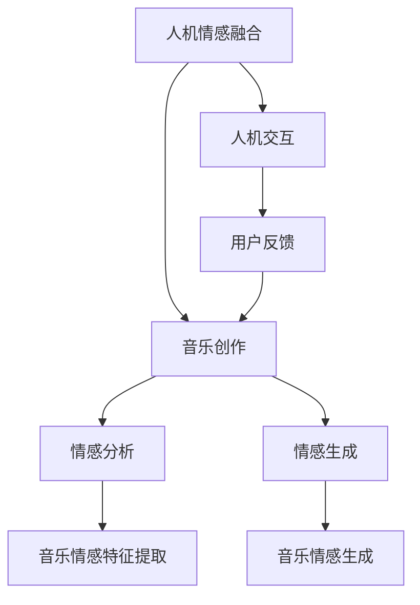

                 

### 第1章 引言

## 1.1 人机情感融合与音乐创作的背景与意义

人机情感融合（Human-Computer Emotional Fusion，HCEF）是近年来人工智能（AI）与情感计算领域的前沿研究方向。它旨在通过理解、模拟和交互人类情感，实现人与计算机之间的情感共鸣。音乐创作作为一种高度情感化的活动，一直是人类情感表达的重要手段。然而，随着技术的进步，人机情感融合在音乐创作中的应用正逐渐改变这一领域。

在背景方面，人机情感融合的研究始于20世纪90年代，随着计算机处理能力的提高和情感计算技术的不断发展，人机情感交互得到了广泛关注。音乐创作作为艺术与技术的结合，自古以来就受到人们的喜爱。然而，传统音乐创作往往依赖于个人的灵感和技巧，难以适应快速变化的社会需求。

人机情感融合对音乐创作的意义在于：

1. **个性化创作**：通过分析用户的情感状态，机器可以生成符合用户情感需求的个性化音乐。
2. **辅助创作**：人机情感融合技术可以帮助音乐家在创作过程中更好地理解和表达情感，从而提高创作效率和质量。
3. **创新形式**：人机情感融合技术可以为音乐创作带来新的形式，如互动音乐、情感音乐游戏等，拓宽音乐创作的边界。

### 1.2 当前音乐创作领域的挑战与机遇

当前，音乐创作领域面临着一系列挑战和机遇：

#### 挑战

1. **创造力限制**：传统音乐创作往往依赖于个人的灵感和技巧，而机器难以完全模拟这种创造力。
2. **情感表达复杂性**：音乐情感表达复杂多样，人机情感融合技术需要精确捕捉和处理这些情感。
3. **技术门槛**：人机情感融合技术需要较高的计算能力和专业知识，使得其在音乐创作中的应用受到限制。

#### 机遇

1. **技术进步**：随着计算机处理能力的提高和机器学习算法的进步，人机情感融合技术越来越成熟，为音乐创作提供了新的可能性。
2. **市场需求**：随着音乐消费的不断升级，用户对个性化、互动化的音乐需求日益增长，为人机情感融合在音乐创作中的应用提供了广阔的市场空间。
3. **跨界融合**：人机情感融合与音乐创作的结合，可以激发新的艺术形式和商业模式，推动整个音乐产业的创新与发展。

### 1.3 本书结构与内容概述

本书将分为七个章节，全面探讨人机情感融合对音乐创作的影响。以下是各章节的主要内容概述：

- **第1章 引言**：介绍人机情感融合与音乐创作的背景与意义，以及本书的结构与内容。
- **第2章 基础理论**：探讨人机情感融合与音乐创作的基本概念、核心要素和相关理论。
- **第3章 核心算法原理**：详细讲解情感识别、生成算法和人机交互模型在音乐创作中的应用。
- **第4章 数学模型和公式讲解**：介绍情感特征提取、情感生成模型的数学原理和公式。
- **第5章 项目实战案例**：通过实际项目展示人机情感融合技术在音乐创作中的具体应用。
- **第6章 应用案例**：探讨人机情感融合在音乐创作中的不同应用场景。
- **第7章 未来展望**：分析人机情感融合在音乐创作中的发展趋势与未来研究方向。

### Mermaid 流程图

以下是一个展示人机情感融合与音乐创作关系的 Mermaid 流程图：

### 结论

人机情感融合对音乐创作的影响正日益显著。通过理解人机情感融合的基本理论，探讨核心算法原理，结合数学模型和公式，以及实际项目案例，本书将为读者提供一个全面、深入的认识。随着技术的不断进步，人机情感融合在音乐创作中的应用将越来越广泛，有望为音乐创作带来前所未有的变革。

---

**摘要：** 本文探讨了人机情感融合对音乐创作的影响。通过介绍人机情感融合的基本理论、核心算法原理、数学模型和公式，结合实际项目案例，分析了人机情感融合如何改变音乐创作的形式和效率。本文认为，人机情感融合将为音乐创作带来个性化、互动化和创新的机遇，有望推动音乐产业的未来发展。

