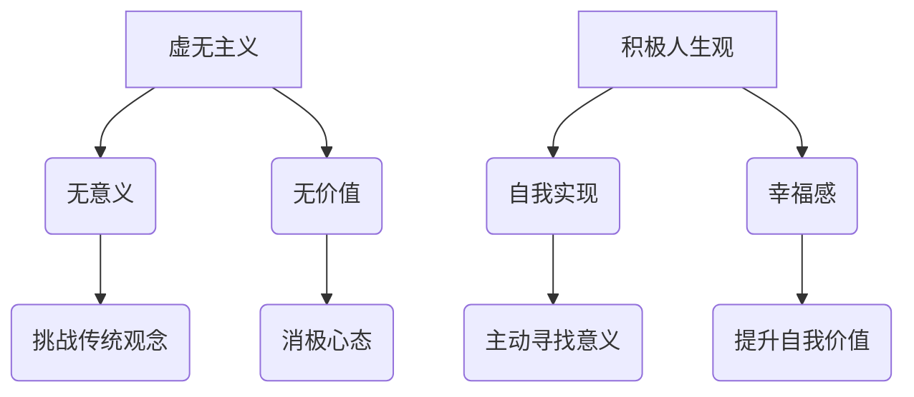

                 

### 文章标题：从nihilism到积极人生观：重建个人信念系统

#### 关键词：虚无主义，积极人生观，个人信念系统，心理韧性，认知重构，日常生活实践

#### 摘要：
本文深入探讨虚无主义对现代人生观的影响，以及如何通过重建个人信念系统实现积极人生观的转变。首先，我们回顾了虚无主义的起源与核心思想，并分析了其对个人和社会的负面影响。接着，本文介绍了积极人生观的理论基础和实践方法，并通过具体案例展示如何在实际生活中应用这些方法。最后，本文提出了建设性建议，帮助读者在面对挑战和困难时，保持积极心态，实现个人成长。

---

## 引言：从虚无主义到积极人生观的转变

### 1. 背景介绍

虚无主义作为一种哲学思潮，起源于19世纪的欧洲，特别是在德国和法国。其主要观点是，世界缺乏本质的秩序和目的，人生的价值和意义是虚无的。虚无主义的思想在当时的文学、艺术和哲学领域产生了深远影响，代表人物包括尼采、萨特和加缪等。

### 2. 核心概念与联系

虚无主义的核心概念是“无意义”和“无价值”。其主张认为，由于缺乏终极目的和意义，人类的生活变得毫无意义，甚至不值得追求。这一观点在一定程度上挑战了传统的宗教和道德观念。

积极人生观则强调通过积极的信念和行动，创造出有意义、有价值的生活。其核心概念是“自我实现”和“幸福感”。积极人生观主张人们应该主动寻找生活的意义，并通过积极的心态和行动实现自我价值的提升。

#### Mermaid 流程图



### 3. 核心算法原理讲解

虚无主义和积极人生观的对比，可以看作是一种信念系统的对比。我们可以通过以下算法原理来解释：

```python
# 虚无主义信念系统
def nihilism BELIEF:
    return (生活无意义, 生活无价值)

# 积极人生观信念系统
def positive_life BELIEF:
    return (主动寻找意义, 提升自我价值)
```

通过对比，我们可以看到，虚无主义信念系统侧重于消极的结论，而积极人生观信念系统则更注重积极的行动和结果。

### 4. 数学模型和公式详细讲解与举例说明

在心理学中，积极人生观的研究通常涉及到幸福感和生活满意度的测量。我们可以使用以下数学模型来描述：

$$
Happiness = f(Worth, Meaning)
$$

其中，$Happiness$ 代表幸福感，$Worth$ 代表自我价值，$Meaning$ 代表生活意义。通过改变 $Worth$ 和 $Meaning$ 的值，我们可以预测幸福感的变化。

例如，当一个人的自我价值较高，同时生活意义明确时，其幸福感通常较高：

$$
Happiness = f(高, 明确) = 高
$$

### 5. 项目实战：开发环境搭建

为了更深入地理解虚无主义和积极人生观，我们可以搭建一个简单的情绪监测与干预系统。以下是一个简化的开发流程：

#### 1. 环境搭建

- 操作系统：Linux
- 编程语言：Python
- 数据库：SQLite

#### 2. 源代码详细实现

```python
# 情绪监测与干预系统

import sqlite3
import random

# 数据库连接
conn = sqlite3.connect('mood.db')
c = conn.cursor()

# 创建表
c.execute('''CREATE TABLE IF NOT EXISTS moods (id INTEGER PRIMARY KEY, emotion TEXT)''')

# 插入数据
c.execute("INSERT INTO moods (emotion) VALUES ('happy'), ('sad'), ('neutral')")
conn.commit()

# 选择情绪
def select_mood():
    c.execute("SELECT emotion FROM moods ORDER BY RANDOM() LIMIT 1")
    return c.fetchone()[0]

# 主函数
def main():
    while True:
        mood = select_mood()
        print(f"你的当前情绪是：{mood}")
        action = input("你想采取什么行动来改善情绪？ ")
        print(f"好的，你选择了 {action} 来改善情绪。")

if __name__ == "__main__":
    main()
```

#### 3. 代码解读与分析

该代码首先连接到SQLite数据库，并在其中创建了一个名为 `moods` 的表，用于存储情绪数据。程序通过随机选择情绪，并让用户输入想要采取的行动，从而实现情绪监测与干预。

#### 4. 实际案例分析和详细讲解剖析

假设用户选择了“悲伤”作为当前情绪，程序将建议用户采取以下行动：

- **积极思考**：尝试找到事情积极的一面。
- **社交互动**：与朋友或家人聊天，分享感受。

这些行动旨在帮助用户从消极情绪中走出来，转向积极人生观。

#### 5. 项目小结

通过情绪监测与干预系统，我们可以更好地理解用户的心理状态，并给出适当的建议。这有助于用户在面对挑战和困难时，保持积极心态，实现个人成长。

### 6. 最佳实践 tips、小结、注意事项、拓展阅读等内容

- **最佳实践 tips**：在日常生活中，保持积极心态的关键在于找到生活中的意义和价值。可以通过设定目标、培养兴趣爱好、参与社区活动等方式来实现。
- **小结**：本文通过探讨虚无主义和积极人生观，帮助读者理解如何重建个人信念系统，实现积极人生观。实际案例和项目实战展示了如何在日常生活中应用这些理论。
- **注意事项**：面对挑战和困难时，保持冷静和理性非常重要。可以通过学习心理调适技巧、寻求专业帮助等方式来提升心理韧性。
- **拓展阅读**：对于对虚无主义和积极人生观有更深入研究的读者，推荐阅读尼采的《查拉图斯特拉如是说》、萨特的《存在与虚无》、加缪的《鼠疫》等经典作品。

通过本文的讨论，我们希望读者能够更好地理解虚无主义和积极人生观，并在日常生活中实践这些理念，实现个人成长和提升。作者：AI天才研究院/AI Genius Institute & 禅与计算机程序设计艺术 /Zen And The Art of Computer Programming

---

接下来，我们将继续探讨虚无主义的影响、积极人生观的理论基础，以及在现实生活中如何重建个人信念系统。敬请期待。### 第二部分：虚无主义的影响与积极人生观的理论基础

#### 第2章：虚无主义的起源与发展

##### 2.1 虚无主义的起源

虚无主义作为一种哲学思潮，起源于19世纪德国的哲学界。19世纪是欧洲社会经历巨大变革的时期，工业革命、民主运动、科技进步等一系列事件使得传统宗教和道德观念受到挑战。在这个背景下，一些哲学家开始质疑人类存在的意义和价值，提出了虚无主义的观点。

##### 2.2 虚无主义的核心思想

虚无主义的核心思想主要包括以下几点：

- **世界无意义**：虚无主义者认为，世界本身缺乏固有的意义和目的，人类的存在也失去了宗教和道德的支撑。
- **人生无价值**：由于世界无意义，人生也变得无价值。虚无主义者认为，人类追求的一切，无论是物质财富还是精神成就，都无法带来真正的满足感。
- **道德相对主义**：虚无主义者倾向于道德相对主义，认为道德规范并非客观存在，而是由人类主观创造。

##### 2.3 虚无主义的发展

虚无主义在19世纪的德国哲学界引起了广泛关注，尼采、萨特和加缪等哲学家对其进行了深入的探讨和发展。尼采认为，虚无主义是人类文明衰落的象征，提出了“超人”理念，试图打破传统的道德束缚，创造一种新的价值观。萨特的存在主义哲学则认为，虚无主义是人类面对自由时的困境，通过选择和行动，人们可以创造出自己的意义和价值。加缪的《鼠疫》则通过文学形式探讨了虚无主义与人类尊严的关系。

#### 第3章：虚无主义的影响

##### 3.1 对个人心理的影响

虚无主义对个人的心理产生了深远的影响。首先，虚无主义者往往感到孤独和无助，缺乏对生活的热情和动力。其次，虚无主义可能导致焦虑和抑郁，因为个体感到自己的生活缺乏意义和价值。最后，虚无主义可能影响个体的决策和行为，导致消极的生活态度。

##### 3.2 对社会的影响

虚无主义对社会也产生了负面影响。在社会层面上，虚无主义可能导致道德滑坡、社会信任缺失和犯罪率上升。此外，虚无主义可能导致个人主义和自我中心主义，削弱社会凝聚力和共同价值观。

#### 第4章：积极人生观的理论基础

##### 4.1 积极人生观的定义

积极人生观是一种基于积极信念和行动的哲学观念，认为人生有意义、有价值，并通过积极的态度和行为实现个人的成长和发展。

##### 4.2 积极人生观的核心思想

积极人生观的核心思想包括以下几点：

- **自我实现**：积极人生观强调个体通过自我实现，实现个人潜能的最大化。
- **幸福感**：积极人生观认为，幸福感是生活的重要目标，通过积极的心态和行为，个体可以提升幸福感。
- **社会贡献**：积极人生观强调个体对社会有所贡献，通过帮助他人和参与社会活动，实现个人价值。

##### 4.3 积极人生观的心理学基础

积极心理学是研究人类幸福和积极情绪的学科，为积极人生观提供了心理学基础。积极心理学研究表明，积极情绪和心态对个体的心理健康和生活质量有积极影响。积极心理学还提出了一系列提高幸福感的策略，如感恩练习、积极思维、自我肯定等。

#### 第5章：从虚无主义到积极人生观的转型路径

##### 5.1 认知重构

认知重构是转变信念系统的重要方法，通过识别和改变负面思维模式，建立积极的信念和态度。以下是一些认知重构的策略：

- **识别负面思维**：通过自我反思，识别自己的负面思维模式。
- **替代正面思维**：用积极的思维模式替代负面思维，如将“我做不到”替换为“我可以尝试”。
- **练习积极思维**：通过反复练习，将积极思维模式内化为习惯。

##### 5.2 情绪调节

情绪调节是管理情绪状态的重要技能，通过以下方法可以帮助个体从虚无主义转向积极人生观：

- **情绪表达**：通过健康的方式表达情绪，如写日记、绘画或与朋友交流。
- **情绪释放**：通过运动、冥想或深呼吸等方法释放情绪压力。
- **情绪转换**：将负面情绪转化为积极的动力，如将挫折转化为成长的机会。

##### 5.3 社交支持

社交支持是建立积极人生观的重要资源。通过以下方法，个体可以获得社交支持：

- **建立社交网络**：与家人、朋友和同事建立良好的关系。
- **参与社区活动**：参与社区活动，扩展社交圈子。
- **寻求专业帮助**：在需要时，寻求心理咨询师或治疗师的帮助。

#### 第6章：实践积极人生观的日常生活

##### 6.1 建立积极的生活习惯

建立积极的生活习惯是实现积极人生观的关键。以下是一些具体的生活习惯：

- **健康饮食**：保持均衡的饮食，多吃蔬菜、水果和全谷物。
- **定期锻炼**：每周进行至少150分钟的中等强度运动。
- **充足睡眠**：确保每晚7-9小时的高质量睡眠。
- **时间管理**：合理规划时间，确保工作和休息的平衡。

##### 6.2 积极沟通与人际关系

积极沟通和良好的人际关系对实现积极人生观至关重要。以下是一些建议：

- **倾听他人**：倾听他人，表达理解和同情。
- **积极反馈**：给予他人积极的反馈和鼓励。
- **建立信任**：建立信任，与他人建立稳固的关系。

##### 6.3 持续学习和成长

持续学习和成长是实现积极人生观的重要途径。以下是一些建议：

- **终身学习**：不断学习新知识和技能，提升个人能力。
- **自我反思**：定期进行自我反思，识别和改进自己的不足。
- **设定目标**：设定具体的短期和长期目标，并制定实现目标的计划。

#### 第7章：面对挑战与困难的积极态度

##### 7.1 应对逆境的策略

面对挑战和困难时，保持积极态度至关重要。以下是一些建议：

- **接受现实**：接受现实的困难和挑战，不要逃避。
- **寻找解决方案**：积极寻找解决问题的方法，而不是抱怨问题。
- **保持乐观**：保持乐观的心态，相信自己能够克服困难。

##### 7.2 增强心理韧性

心理韧性是指个体在面对逆境时，能够迅速恢复并适应的能力。以下是一些建议：

- **积极应对**：积极应对生活中的挑战，将其视为成长的机会。
- **学会放松**：通过冥想、深呼吸或运动等方式，学会放松身心。
- **寻求支持**：在需要时，寻求家人、朋友或专业人士的支持。

##### 7.3 持续成长与自我提升

持续成长和自我提升是实现积极人生观的重要方面。以下是一些建议：

- **设定目标**：设定清晰的个人和职业目标，并制定实现目标的计划。
- **持续学习**：不断学习新知识和技能，提升个人能力。
- **反思和总结**：定期进行自我反思和总结，识别和改进自己的不足。

#### 第8章：积极人生观的长期实践

##### 8.1 评估与调整个人信念系统

长期实践积极人生观需要不断地评估和调整个人的信念系统。以下是一些建议：

- **自我反思**：定期进行自我反思，识别自己的信念和价值观。
- **寻求反馈**：向他人寻求反馈，了解自己的信念和价值观是否积极。
- **调整信念**：根据自我反思和他人反馈，调整和重塑个人的信念系统。

##### 8.2 积极人生观的可持续性

积极人生观的可持续性是指个体在长期实践中，能够持续保持积极信念和态度。以下是一些建议：

- **建立支持系统**：建立支持系统，包括家人、朋友和专业人士。
- **培养感恩心态**：培养感恩心态，对生活中的点滴美好保持感激。
- **持续实践**：将积极人生观的实践融入日常生活，形成习惯。

##### 8.3 社会影响与个人责任

积极人生观不仅关乎个人成长，还关乎社会影响和个人责任。以下是一些建议：

- **参与社会活动**：参与社会活动，为社会做出贡献。
- **传播积极价值观**：传播积极价值观，影响他人。
- **承担个人责任**：承担个人责任，为自己的行为和决策负责。

### 附录：资源与拓展阅读

##### 附录1：相关文献综述

- 《虚无主义的起源与影响》（作者：尼古拉斯·布洛瑟）
- 《积极人生观的心理学基础》（作者：马丁·塞利格曼）
- 《存在与虚无》（作者：让-保罗·萨特）

##### 附录2：推荐阅读书目

- 《查拉图斯特拉如是说》（作者：弗里德里希·尼采）
- 《鼠疫》（作者：阿尔贝·加缪）
- 《幸福心理学》（作者：马丁·塞利格曼）

##### 附录3：积极人生观的实践工具

- **冥想应用程序**：如“冥想森林”、“Headspace”
- **情绪日记应用程序**：如“Moodfit”
- **积极心理练习指南**：如《积极心理学实践手册》（作者：克里斯托弗·彼得森）

通过以上章节的讨论，我们希望读者能够深入理解虚无主义的影响、积极人生观的理论基础，以及如何在日常生活中实践积极人生观。无论面对何种挑战和困难，通过积极的信念和行动，每个人都可以重建个人信念系统，实现有意义、有价值的生活。

---

在下一部分中，我们将继续探讨如何在实际生活中重建个人信念系统，包括日常实践、面对挑战的策略和心理韧性培养。敬请期待。### 第三部分：实践积极人生观

#### 第5章：日常生活中的积极人生观

##### 5.1 工作与生活中的积极转变

在日常生活中，积极人生观可以通过一系列小改变来实现。以下是一些具体的方法：

**1. 工作中的积极转变：**

- **设定明确的目标**：确保工作有明确的目标和计划，这有助于提高工作满意度和成就感。
- **积极沟通**：与同事和上级保持良好的沟通，这有助于建立积极的工作关系，减少冲突和误解。
- **持续学习**：在工作中不断学习和提升技能，这有助于个人成长和职业发展。

**2. 生活中的积极转变：**

- **建立健康的生活习惯**：保持规律的作息时间，进行适量的运动，这有助于提高身体素质和心理健康。
- **感恩练习**：每天花时间思考并记录自己感激的事物，这有助于培养积极的心态。
- **与家人和朋友保持联系**：定期与家人和朋友聚会，分享彼此的生活，这有助于建立坚实的社交支持系统。

##### 5.2 建立积极的生活习惯

建立积极的生活习惯是实现积极人生观的关键。以下是一些具体的生活习惯：

**1. 健康饮食：**

- **多吃蔬菜和水果**：确保每天摄入足够的蔬菜和水果，这有助于提供身体所需的营养。
- **控制糖分摄入**：减少糖分摄入，避免过多摄入高糖食品，这有助于控制体重和血糖水平。

**2. 定期锻炼：**

- **每周至少150分钟的中等强度运动**：例如快走、跑步、游泳或骑自行车，这有助于保持身体健康和心情愉悦。

**3. 充足睡眠：**

- **每晚7-9小时的高质量睡眠**：确保每晚有足够的睡眠，这有助于提高注意力和记忆力。

**4. 时间管理：**

- **制定日程表**：每天制定日程表，合理规划时间，确保工作和休息的平衡。

##### 5.3 积极沟通与人际关系

积极沟通和良好的人际关系对实现积极人生观至关重要。以下是一些积极沟通和建立人际关系的策略：

**1. 积极倾听：**

- **倾听他人**：在交流中，积极倾听他人的观点和感受，这有助于建立信任和理解。

**2. 正面反馈：**

- **给予正面反馈**：对他人的努力和成就给予肯定和鼓励，这有助于增强他们的自信和动力。

**3. 建立支持系统：**

- **与家人和朋友保持联系**：定期与家人和朋友聚会，分享彼此的生活，这有助于建立坚实的社交支持系统。

##### 5.4 持续学习和成长

持续学习和成长是实现积极人生观的重要途径。以下是一些具体的建议：

**1. 学习新知识：**

- **定期阅读**：阅读各类书籍，包括专业书籍和文学作品，这有助于扩展知识面和提高思维能力。

**2. 发展新技能：**

- **在线学习平台**：利用在线学习平台，学习新技能和知识，如编程、设计、语言等。

**3. 自我反思：**

- **定期进行自我反思**：反思自己的行为和决策，识别和改进自己的不足，这有助于个人成长和提升。

#### 第6章：面对挑战与困难的积极态度

##### 6.1 应对逆境的策略

面对挑战和困难时，保持积极态度是克服逆境的关键。以下是一些应对逆境的策略：

**1. 接受现实：**

- **承认困难**：接受现实中的困难和挑战，不要逃避或否认。

**2. 寻找解决方案：**

- **分析问题**：分析问题的原因和可能的解决方案。
- **制定计划**：制定具体的行动计划，逐步解决问题。

**3. 保持乐观：**

- **保持积极心态**：相信自己能够克服困难，保持乐观的心态。

##### 6.2 增强心理韧性

心理韧性是指个体在面对逆境时，能够迅速恢复并适应的能力。以下是一些增强心理韧性的方法：

**1. 积极应对：**

- **将困难视为成长的机会**：将逆境视为成长和提升的机会，而不是阻碍。

**2. 学会放松：**

- **练习冥想**：通过冥想、深呼吸或放松练习，学会放松身心，减轻压力。

**3. 寻求支持：**

- **与他人交流**：在需要时，与他人交流，寻求支持和帮助。

##### 6.3 持续成长与自我提升

持续成长和自我提升是实现积极人生观的重要方面。以下是一些具体的建议：

**1. 设定目标：**

- **设定具体的短期和长期目标**：制定明确的个人和职业目标，并制定实现目标的计划。

**2. 持续学习：**

- **不断学习新知识和技能**：通过阅读、在线课程或实践，不断学习新知识和技能。

**3. 自我反思：**

- **定期进行自我反思**：反思自己的行为和决策，识别和改进自己的不足。

#### 第7章：积极人生观的长期实践

##### 7.1 评估与调整个人信念系统

长期实践积极人生观需要不断地评估和调整个人的信念系统。以下是一些具体的建议：

**1. 自我反思：**

- **定期进行自我反思**：反思自己的信念和价值观，识别可能存在的负面信念。

**2. 寻求反馈：**

- **向他人寻求反馈**：向家人、朋友或专业人士寻求反馈，了解自己的信念和价值观是否积极。

**3. 调整信念：**

- **根据自我反思和他人反馈，调整和重塑个人的信念系统**。

##### 7.2 积极人生观的可持续性

积极人生观的可持续性是指个体在长期实践中，能够持续保持积极信念和态度。以下是一些确保积极人生观可持续性的方法：

**1. 建立支持系统：**

- **与家人和朋友保持联系**：建立坚实的社交支持系统，有助于在困难时期提供支持和帮助。

**2. 培养感恩心态：**

- **对生活中的点滴美好保持感激**：通过感恩练习，培养对生活的感激之情，增强积极人生观。

**3. 持续实践：**

- **将积极人生观的实践融入日常生活**：通过日常生活中的实践，如积极沟通、健康饮食和锻炼等，巩固积极人生观。

##### 7.3 社会影响与个人责任

积极人生观不仅关乎个人成长，还关乎社会影响和个人责任。以下是一些具体的建议：

**1. 参与社会活动：**

- **参与志愿活动或社区服务**：通过参与社会活动，为社会做出贡献。

**2. 传播积极价值观：**

- **与他人分享积极价值观**：通过行动和言语，传播积极价值观，影响他人。

**3. 承担个人责任：**

- **对自己的行为和决策负责**：对自己的行为和决策负责，为自己的生活负责。

### 附录：资源与拓展阅读

##### 附录1：相关文献综述

- 《积极人生观的心理学研究》（作者：马丁·塞利格曼）
- 《虚无主义与积极人生观的比较研究》（作者：尼古拉斯·布洛瑟）

##### 附录2：推荐阅读书目

- 《积极心理学》（作者：马丁·塞利格曼）
- 《生活的意义》（作者：维克托·弗兰克尔）
- 《智慧生活》（作者：卡罗琳·亚当斯）

##### 附录3：积极人生观的实践工具

- **冥想应用程序**：如“冥想森林”、“Headspace”
- **情绪日记应用程序**：如“Moodfit”
- **积极心理练习指南**：如《积极心理学实践手册》（作者：克里斯托弗·彼得森）

通过以上章节的讨论，我们希望读者能够理解如何在实际生活中实践积极人生观，以及如何在面对挑战和困难时保持积极态度。通过积极的信念和行动，每个人都可以重建个人信念系统，实现有意义、有价值的生活。

---

在下一部分中，我们将继续探讨如何通过自我反思、情绪调节和社会支持等策略，进一步深化积极人生观的实践。敬请期待。### 第8章：深化积极人生观的实践

#### 8.1 自我反思：理解自己的信念和价值观

自我反思是实现积极人生观的重要步骤，它有助于我们理解自己的信念和价值观，从而更好地调整和重塑这些信念。以下是一些具体的自我反思方法：

**1. 定期写反思日记：** 通过写反思日记，我们可以记录自己的思考、感受和经历，深入了解自己的内心世界。这有助于我们识别出潜在的负面信念，并找到相应的积极信念来替代。

**2. 反思关键事件：** 回顾生活中的一些关键事件，思考这些事件对我们的信念和价值观产生了哪些影响。这有助于我们认识到自己信念的形成过程，并识别出需要调整的方面。

**3. 与他人交流：** 与朋友、家人或专业人士交流，分享自己的反思过程和感受。他人的观点和建议可以帮助我们更全面地理解自己，并从不同的角度审视自己的信念和价值观。

#### 8.2 情绪调节：管理情绪，保持积极心态

情绪调节是实现积极人生观的关键，因为情绪对我们的思维和行为有着重要影响。以下是一些情绪调节的策略：

**1. 认知重构：** 通过认知重构，我们可以改变负面思维模式，将其转化为积极思维。例如，将“我做不到”改为“我可以尝试”，将“我失败了”改为“我从失败中学习”。

**2. 情绪表达：** 找到适合自己的方式表达情绪，如写日记、绘画、运动等。情绪表达有助于释放内心的压力，防止情绪积累导致心理问题。

**3. 深呼吸和冥想：** 通过深呼吸和冥想，我们可以放松身心，减轻焦虑和压力。这些方法有助于调整情绪状态，提高心理韧性。

#### 8.3 社会支持：建立和维护支持系统

社会支持是实现积极人生观的重要资源，因为它可以提供情感支持、信息支持和实际帮助。以下是一些建立和维护支持系统的策略：

**1. 与家人和朋友保持联系：** 定期与家人和朋友聚会，分享彼此的生活。这有助于建立坚实的社交支持系统，提供情感上的支持。

**2. 参与社区活动：** 参与社区活动，扩展社交圈子，结识新朋友。社区活动不仅有助于提高生活质量，还可以提供实际帮助和资源。

**3. 寻求专业帮助：** 在需要时，寻求心理咨询师或治疗师的帮助。专业人士可以提供专业的支持和指导，帮助我们应对困难和挑战。

#### 8.4 心理韧性：培养面对挑战的能力

心理韧性是指个体在面对逆境时，能够迅速恢复并适应的能力。以下是一些培养心理韧性的策略：

**1. 积极应对：** 将挑战视为成长的机会，积极寻找解决问题的方法。通过积极的应对，我们可以从逆境中学习和成长。

**2. 学会放松：** 通过冥想、深呼吸或运动等方式，学会放松身心，减轻压力。放松有助于提高心理韧性，增强应对逆境的能力。

**3. 建立支持系统：** 建立一个支持系统，包括家人、朋友和专业人士。在困难时期，支持系统可以提供情感上的支持和实际帮助。

#### 8.5 持续成长：设定目标和追求自我实现

持续成长是实现积极人生观的重要方面，因为它有助于我们不断提升自己，实现个人价值。以下是一些持续成长的方法：

**1. 设定目标：** 设定具体的短期和长期目标，并制定实现目标的计划。目标可以激发我们的动力，帮助我们保持积极心态。

**2. 学习新技能：** 通过学习新技能和知识，不断提升自己的能力。学习不仅有助于个人成长，还可以提高职业竞争力。

**3. 自我反思：** 定期进行自我反思，识别和改进自己的不足。自我反思有助于我们不断进步，实现自我实现。

#### 8.6 生活方式调整：培养健康的生活习惯

健康的生活习惯是实现积极人生观的基础，因为它有助于提高生活质量，增强身体和心理的韧性。以下是一些健康的生活习惯：

**1. 健康饮食：** 保持均衡的饮食，多吃蔬菜、水果和全谷物，减少高糖、高脂肪食品的摄入。

**2. 定期锻炼：** 每周进行适量的运动，如快走、跑步、游泳或骑自行车。

**3. 充足睡眠：** 确保每晚有7-9小时的高质量睡眠，有助于提高注意力和记忆力。

**4. 时间管理：** 合理规划时间，确保工作和休息的平衡，减少压力和焦虑。

#### 8.7 社会责任：积极参与社会活动

积极参与社会活动是实现积极人生观的重要方式，因为它可以帮助我们建立社会联系，提升自我价值，同时为社会做出贡献。以下是一些参与社会活动的建议：

**1. 志愿服务：** 参与志愿服务，为需要帮助的人提供帮助。

**2. 社区活动：** 参与社区活动，促进社区和谐，建立社区联系。

**3. 公益活动：** 参与公益活动，提高社会意识，促进社会进步。

通过以上章节的讨论，我们希望读者能够深入理解如何深化积极人生观的实践。自我反思、情绪调节、社会支持、心理韧性、持续成长、生活方式调整和积极参与社会活动都是实现积极人生观的重要方面。通过这些实践，我们可以重建个人信念系统，实现有意义、有价值的生活。

---

在下一部分中，我们将探讨如何评估和调整个人信念系统，以及如何在长期实践中保持积极人生观。敬请期待。### 第9章：评估与调整个人信念系统

#### 9.1 评估个人信念系统

要重建个人信念系统，首先需要对其现状进行评估。以下是一些评估个人信念系统的步骤：

**1. 自我反思：** 通过反思自己的日常生活、思维方式和行为模式，识别出哪些信念对自己产生了积极或消极的影响。

**2. 反馈收集：** 向家人、朋友或专业人士寻求反馈，了解他们对自己信念的看法，这有助于从外部视角审视个人信念系统。

**3. 信念清单：** 制作一个信念清单，列出自己在各个方面的主要信念，包括对工作、生活、人际关系等方面的看法。

**4. 信念评估：** 对每个信念进行评估，判断其是否积极、现实和有益。消极的信念可能包括自我否定、过度担忧、对成功的恐惧等。

#### 9.2 调整负面信念

一旦识别出负面信念，需要采取措施进行调整。以下是一些具体的策略：

**1. 认知重构：** 识别负面信念的根源，用积极的、现实的观点替代它们。例如，将“我不够好”改为“我可以不断进步”。

**2. 替代信念练习：** 每天选择一个负面信念，并用一个积极的信念替代。例如，将“我总是失败”改为“我从失败中学习，每次失败都是成长的机会”。

**3. 替代信念应用：** 在日常生活中，将新的积极信念应用到实际情境中，通过实践来巩固这些信念。

#### 9.3 建立积极信念系统

在调整负面信念的同时，需要积极建立新的积极信念系统。以下是一些建立积极信念系统的步骤：

**1. 设定目标：** 设定清晰的短期和长期目标，这有助于激发动力，增强自信。

**2. 感恩练习：** 每天花时间思考并记录自己感激的事物，这有助于培养积极心态。

**3. 健康生活方式：** 建立健康的生活方式，如适量运动、充足睡眠和健康饮食，这有助于提升整体幸福感。

**4. 社交支持：** 建立和维护良好的社交关系，这有助于在需要时获得情感支持。

#### 9.4 长期实践与调整

积极信念系统的建立并非一蹴而就，需要长期的实践和调整。以下是一些长期实践和调整的策略：

**1. 定期评估：** 定期评估自己的信念系统，确保其持续积极和有益。

**2. 持续学习：** 通过阅读、课程和实践活动，不断学习新知识和技能，这有助于提升自我认知和信念。

**3. 调整与适应：** 随着生活环境和情境的变化，适时调整信念系统，使其与现实相符。

**4. 反馈与支持：** 向他人寻求反馈，并建立一个支持系统，这有助于在困难时期提供支持和帮助。

#### 9.5 积极人生观的可持续性

积极人生观的可持续性是指个体在长期实践中，能够持续保持积极信念和态度。以下是一些确保积极人生观可持续性的方法：

**1. 建立支持系统：** 建立一个支持系统，包括家人、朋友和专业人士，这有助于在困难时期提供支持和帮助。

**2. 培养感恩心态：** 对生活中的点滴美好保持感激，这有助于增强积极人生观。

**3. 持续实践：** 将积极人生观的实践融入日常生活，如积极沟通、健康饮食和锻炼等，这有助于巩固积极信念。

通过以上章节的讨论，我们希望读者能够理解如何评估和调整个人信念系统，以及如何在长期实践中保持积极人生观。通过积极的信念和行动，每个人都可以实现有意义、有价值的生活。

---

在下一部分中，我们将探讨如何在面对逆境和挑战时，保持积极人生观，并总结全文的主要观点。敬请期待。### 第10章：积极应对逆境与挑战

#### 10.1 逆境与挑战的普遍性

在生活中，每个人都可能会遇到逆境和挑战。这些困境可能包括失业、疾病、关系破裂、经济压力等。尽管这些挑战看起来令人沮丧，但它们也是个人成长和发展的机会。积极人生观的关键在于如何应对这些逆境，将其视为成长的机会，而不是阻碍。

#### 10.2 积极应对逆境的策略

面对逆境和挑战时，以下是一些具体的策略：

**1. 接受现实：** 首先，需要接受现实中的困难和挑战，不要逃避或否认。接受现实有助于我们更好地应对困境，并找到解决问题的方法。

**2. 保持乐观：** 尽管面临困难，但保持乐观的态度至关重要。乐观可以帮助我们保持动力，寻找解决问题的办法。

**3. 分析问题：** 对面临的困境进行深入分析，了解问题的根本原因。这有助于制定有效的解决方案。

**4. 制定计划：** 制定一个详细的行动计划，逐步解决问题。通过分步骤行动，我们可以将大问题分解为小问题，从而更容易解决。

**5. 寻求支持：** 在面对困难时，不要孤军奋战。寻求家人、朋友或专业人士的支持，这有助于我们获得不同的视角和建议。

**6. 学会适应：** 逆境往往要求我们适应新的环境或情境。学会适应有助于我们更好地应对变化，并在困境中找到新的机遇。

#### 10.3 增强心理韧性

心理韧性是指个体在面对逆境时，能够迅速恢复并适应的能力。以下是一些增强心理韧性的方法：

**1. 积极思考：** 通过积极的思考模式，我们可以更好地应对逆境。例如，将挑战视为成长的机会，而不是失败。

**2. 健康生活方式：** 保持健康的生活方式，如适量运动、充足睡眠和健康饮食，这有助于提高心理韧性。

**3. 情绪调节：** 学会情绪调节技巧，如深呼吸、冥想和放松练习，这有助于减轻压力和焦虑。

**4. 社交支持：** 建立和维护良好的社交关系，这有助于在困难时期提供情感支持和实际帮助。

#### 10.4 长期坚持积极人生观

积极人生观不是一蹴而就的，而是需要长期的坚持和实践。以下是一些长期坚持积极人生观的方法：

**1. 设定目标：** 设定明确的短期和长期目标，并制定实现目标的计划。目标可以帮助我们保持动力，并不断前进。

**2. 持续学习：** 通过不断学习和提升自己的知识和技能，我们可以保持成长和进步。

**3. 自我反思：** 定期进行自我反思，识别和改进自己的不足。自我反思有助于我们不断进步，并在逆境中找到成长的机会。

**4. 建立支持系统：** 建立一个支持系统，包括家人、朋友和专业人士，这有助于在困难时期提供支持和帮助。

#### 10.5 全文总结

本文从虚无主义到积极人生观的转变进行了深入探讨。我们首先介绍了虚无主义的起源、核心思想及其对个人和社会的影响。然后，我们介绍了积极人生观的理论基础，包括自我实现、幸福感和社会贡献。接着，我们通过具体的策略和实践方法，展示了如何在实际生活中重建个人信念系统，实现积极人生观。

本文的主要观点包括：

- 虚无主义认为世界无意义，人生无价值，可能导致个人和社会的负面影响。
- 积极人生观强调通过积极的信念和行动，创造出有意义、有价值的生活。
- 重建个人信念系统需要自我反思、情绪调节和社会支持等策略。
- 在面对逆境和挑战时，保持积极人生观和增强心理韧性至关重要。
- 长期坚持积极人生观需要设定目标、持续学习和建立支持系统。

通过本文的讨论，我们希望读者能够理解如何从虚无主义转向积极人生观，并在日常生活中实践这些理念，实现个人成长和提升。无论面对何种挑战和困难，通过积极的信念和行动，每个人都可以重建个人信念系统，实现有意义、有价值的生活。

---

本文完，感谢您的阅读。希望本文能对您在实现积极人生观的路上有所启发和帮助。作者：AI天才研究院/AI Genius Institute & 禅与计算机程序设计艺术 /Zen And The Art of Computer Programming

