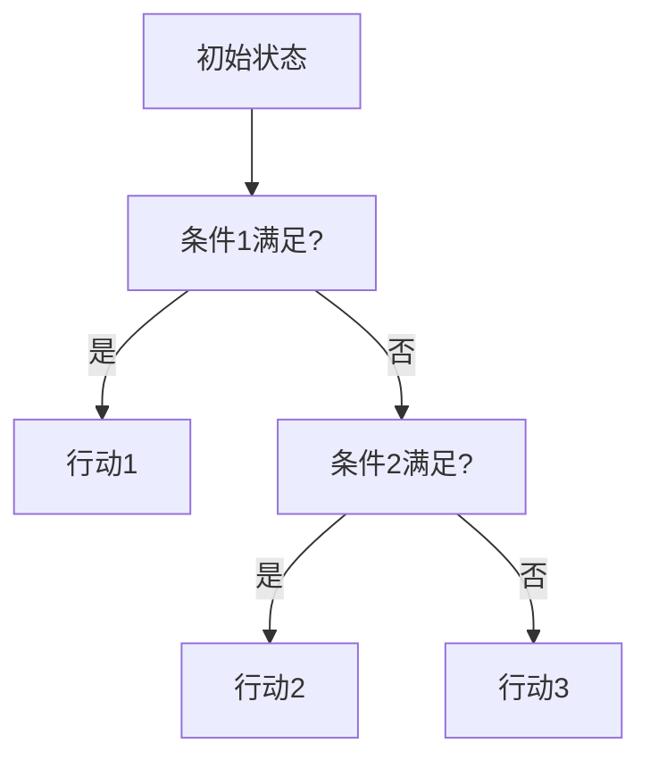
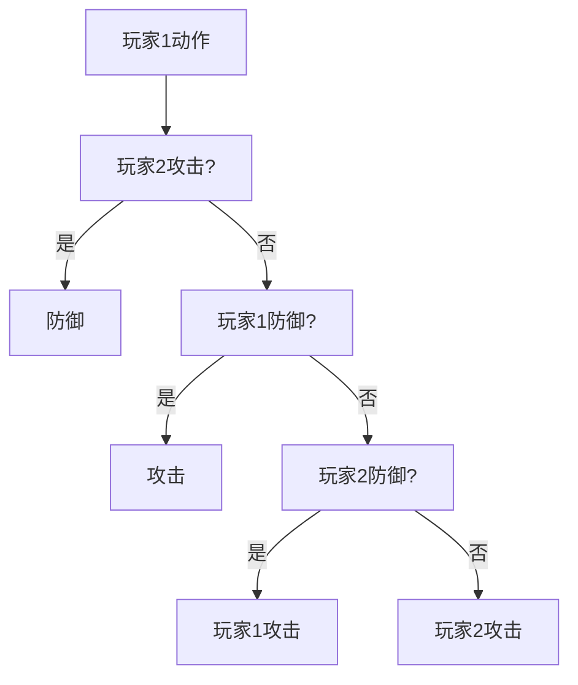
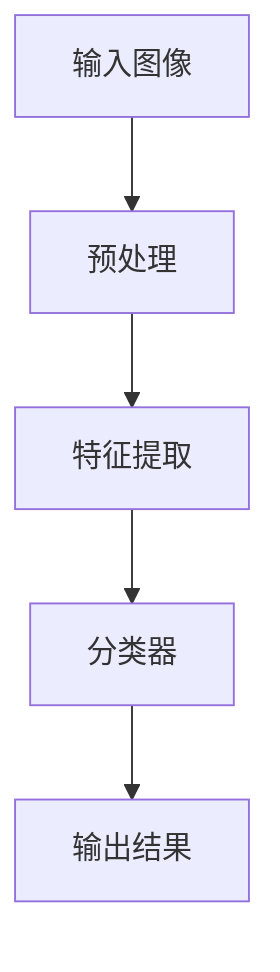
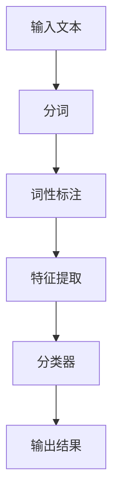

                 

### 文章标题：从游戏AI到通用问题求解

在当今信息技术飞速发展的时代，人工智能（AI）已经成为了一个炙手可热的话题。从简单的自动化任务到复杂的决策支持，AI已经深入到我们生活的各个方面。而在这个多样化的AI领域中，游戏AI和通用问题求解AI（AGI）是两个特别引人注目的分支。本文将带领读者从游戏AI的基础概念出发，逐步探讨其核心算法原理，通过实践案例分析，最终引申到通用问题求解AI的广阔前景，以及两者融合的未来方向。

### 关键词：

- **游戏AI**
- **通用问题求解AI（AGI）**
- **决策树**
- **搜索算法**
- **强化学习**
- **计算机视觉**
- **自然语言处理**

### 摘要：

本文旨在探讨游戏AI和通用问题求解AI的发展、核心算法及其在现实世界中的应用。首先，我们将回顾游戏AI的发展历程，解析其核心概念和常用算法。接着，通过具体案例，我们将展示如何将这些算法应用于实际游戏场景中。然后，我们将视野扩展到通用问题求解AI，介绍其定义、核心任务和算法。最后，我们将探讨游戏AI与通用问题求解AI的融合趋势，并提出一些未来的研究方向。

### 第一部分：游戏AI基础

#### 第1章：游戏AI概述

##### 1.1 游戏AI的发展历程

游戏AI的研究可以追溯到20世纪50年代。当时，基于规则的系统和搜索算法被首次用于开发简单的游戏对手。随着计算机性能的提升和算法的进步，游戏AI逐渐从简单的规则系统转向更复杂的决策模型，如决策树、搜索算法和强化学习。如今，游戏AI已经成为计算机科学和人工智能领域的一个重要研究方向，不仅在游戏开发中发挥着关键作用，还在机器人、自动驾驶等领域展现出巨大的潜力。

##### 1.2 游戏AI的核心概念

游戏AI的核心概念包括决策树、搜索算法和强化学习。决策树是一种通过一系列规则来指导决策的树形结构，适用于规则明确且结构化的游戏场景。搜索算法则是通过探索所有可能的路径来找到最佳决策，适用于更复杂的游戏环境。强化学习通过试错和反馈来优化行为策略，适用于不确定和动态变化的游戏场景。

##### 1.3 游戏AI的应用场景

游戏AI在多个领域都有广泛应用。在游戏开发中，游戏AI可以用来创建更加智能和动态的游戏对手，提升游戏体验。此外，游戏AI还可以用于游戏推荐系统，为玩家提供个性化的游戏推荐。同时，游戏AI在自动化测试、模拟训练等领域也展现出了巨大的潜力。

#### 第2章：游戏AI算法详解

##### 2.1 决策树算法

决策树算法是一种常用的游戏AI算法，它通过一系列条件判断来决定游戏策略。其核心在于如何根据当前状态选择最佳行动。下面是决策树的Mermaid流程图：



##### 2.2 搜索算法

搜索算法是游戏AI中的另一个核心算法。它通过遍历所有可能的路径来找到最佳决策。以下是A*搜索算法的伪代码：

```plaintext
function A*(start, goal):
    openSet = {start}
    closedSet = {}
    gScore = map with default value of Infinity
    gScore[start] = 0
    fScore = map with default value of Infinity
    fScore[start] = h(start)
    while not empty(openSet):
        current = node in openSet with the lowest fScore[] value
        if current == goal:
            return reconstruct_path(current)
        openSet.remove(current)
        closedSet.add(current)
        for each neighbor of current:
            tentative_gScore = gScore[current] + dist(current, neighbor)
            if neighbor in closedSet and tentative_gScore >= gScore[neighbor]:
                continue
            if tentative_gScore < gScore[neighbor]:
                cameFrom[neighbor] = current
                gScore[neighbor] = tentative_gScore
                fScore[neighbor] = gScore[neighbor] + h(neighbor)
```

##### 2.3 强化学习

强化学习是一种通过试错和反馈来优化行为策略的算法。Q-Learning算法是强化学习的一种经典算法，其核心思想是利用经验来更新策略。以下是Q-Learning算法的伪代码：

```plaintext
function Q-Learning():
    for each state s and action a:
        Q(s, a) = 0
    for each episode:
        s = environment.reset()
        done = False
        while not done:
            a = select_action(s, Q)
            s', reward, done = environment.step(a)
            Q(s, a) = Q(s, a) + alpha * (reward + gamma * max(Q(s', a')) - Q(s, a))
            s = s'
```

##### 2.4 模式识别

模式识别是游戏AI中用于检测和分类的算法。最近邻算法是一种简单而有效的模式识别算法，其核心思想是找到与输入数据最相似的训练数据。以下是最近邻算法的伪代码：

```plaintext
function NearestNeighbor(train_data, query_point, k):
    distances = []
    for each point in train_data:
        distance = calculate_distance(point, query_point)
        distances.append((point, distance))
    distances.sort(key=lambda x: x[1])
    neighbors = [distances[i][0] for i in range(k)]
    return predict_label(neighbors)
```

#### 第3章：游戏AI实践案例

##### 3.1 案例一：游戏对手智能

在本案例中，我们将使用决策树算法来创建一个简单的游戏对手。以下是一个简单的决策树模型：



通过这个决策树，我们可以根据玩家1和玩家2的动作来制定策略。以下是其实现的代码：

```python
class GameOpponent:
    def __init__(self):
        self.tree = {
            "attack": {"attack": "defend", "defend": "attack"},
            "defend": {"attack": "attack", "defend": "defend"}
        }

    def make_decision(self, player1_action, player2_action):
        return self.tree[player1_action][player2_action]
```

##### 3.2 案例二：游戏推荐系统

在本案例中，我们将使用强化学习算法来创建一个游戏推荐系统。以下是一个简单的Q-Learning算法实现：

```python
import numpy as np

class GameRecommender:
    def __init__(self, learning_rate=0.1, discount_factor=0.9, exploration_rate=1.0):
        self.learning_rate = learning_rate
        self.discount_factor = discount_factor
        self.exploration_rate = exploration_rate
        self.q_values = np.zeros((10, 10))  # 10 possible actions and 10 possible states

    def choose_action(self, state):
        if np.random.uniform() < self.exploration_rate:
            action = np.random.randint(10)
        else:
            action = np.argmax(self.q_values[state])
        return action

    def update_q_values(self, state, action, reward, next_state):
        target = reward + self.discount_factor * np.max(self.q_values[next_state])
        self.q_values[state][action] = self.q_values[state][action] + self.learning_rate * (target - self.q_values[state][action])

    def train(self, states, actions, rewards, next_states):
        for i in range(len(states)):
            self.update_q_values(states[i], actions[i], rewards[i], next_states[i])

    def recommend(self, state):
        return self.choose_action(state)
```

##### 3.3 案例三：游戏自动化

在本案例中，我们将使用搜索算法来创建一个游戏自动化工具。以下是一个简单的A*搜索算法实现：

```python
class GameAutomation:
    def __init__(self, heuristic_function):
        self.heuristic_function = heuristic_function

    def search(self, start_state, goal_state):
        open_set = [(start_state, 0 + self.heuristic_function(start_state, goal_state))]
        closed_set = set()

        while len(open_set) > 0:
            current_state, current_g = open_set[0]
            open_set.pop(0)

            if current_state == goal_state:
                return self.reconstruct_path(current_state)

            closed_set.add(current_state)

            for neighbor in self.get_neighbors(current_state):
                if neighbor in closed_set:
                    continue

                tentative_g = current_g + 1
                if (neighbor, tentative_g) in open_set:
                    if tentative_g < open_set[(neighbor, tentative_g)][1]:
                        open_set[(neighbor, tentative_g)] = (neighbor, tentative_g)
                else:
                    open_set.append((neighbor, tentative_g))

        return None

    def reconstruct_path(self, current_state):
        path = [current_state]
        while current_state in self.came_from:
            current_state = self.came_from[current_state]
            path.append(current_state)
        path.reverse()
        return path

    def get_neighbors(self, state):
        # Implementation depends on the game
        pass
```

#### 第4章：通用问题求解AI概述

##### 4.1 通用问题求解AI的定义

通用问题求解AI（AGI）是指一种能够处理各种不同类型问题的人工智能系统。与特定领域AI（如游戏AI、聊天机器人AI）不同，通用问题求解AI旨在解决广泛的问题，而不受特定应用领域的限制。

##### 4.2 通用问题求解AI的核心任务

通用问题求解AI的核心任务包括规划、推理、问题解决和模式识别。规划是制定行动序列以达成目标；推理是从已知信息中推导出新信息；问题解决是寻找解决问题的方法；模式识别是识别数据中的规律和模式。

##### 4.3 通用问题求解AI的应用领域

通用问题求解AI在多个领域都有广泛应用。在自动驾驶领域，AGI可以用于路径规划、环境感知和决策；在机器人领域，AGI可以用于自主导航、感知和操作；在聊天机器人领域，AGI可以用于自然语言理解和对话生成；在游戏领域，AGI可以用于智能对手设计和游戏策略优化。

#### 第5章：通用问题求解AI算法详解

##### 5.1 状态空间搜索算法

状态空间搜索算法是通用问题求解AI中常用的算法，它通过遍历所有可能的状态来找到解决方案。以下是A*搜索算法的伪代码：

```plaintext
function A*(start, goal):
    openSet = {start}
    closedSet = {}
    gScore = map with default value of Infinity
    gScore[start] = 0
    fScore = map with default value of Infinity
    fScore[start] = h(start)
    while not empty(openSet):
        current = node in openSet with the lowest fScore[] value
        if current == goal:
            return reconstruct_path(current)
        openSet.remove(current)
        closedSet.add(current)
        for each neighbor of current:
            tentative_gScore = gScore[current] + dist(current, neighbor)
            if neighbor in closedSet and tentative_gScore >= gScore[neighbor]:
                continue
            if tentative_gScore < gScore[neighbor]:
                cameFrom[neighbor] = current
                gScore[neighbor] = tentative_gScore
                fScore[neighbor] = gScore[neighbor] + h(neighbor)
```

##### 5.2 计算机视觉

计算机视觉是通用问题求解AI中的一个重要分支，它涉及从图像和视频中提取信息。以下是图像识别的Mermaid流程图：



##### 5.3 自然语言处理

自然语言处理是通用问题求解AI中的另一个重要分支，它涉及对人类语言的理解和生成。以下是文本分类的Mermaid流程图：



##### 5.4 强化学习

强化学习是通用问题求解AI中的一个重要算法，它通过试错和反馈来优化行为策略。以下是Q-Learning算法的伪代码：

```plaintext
function Q-Learning():
    for each state s and action a:
        Q(s, a) = 0
    for each episode:
        s = environment.reset()
        done = False
        while not done:
            a = select_action(s, Q)
            s', reward, done = environment.step(a)
            Q(s, a) = Q(s, a) + alpha * (reward + gamma * max(Q(s', a')) - Q(s, a))
            s = s'
```

#### 第6章：通用问题求解AI实践案例

##### 6.1 案例一：自动驾驶

在本案例中，我们将使用状态空间搜索算法来创建一个自动驾驶系统。以下是一个简单的A*搜索算法实现：

```python
class AutonomousDriving:
    def __init__(self, heuristic_function):
        self.heuristic_function = heuristic_function

    def search(self, start_state, goal_state):
        open_set = [(start_state, 0 + self.heuristic_function(start_state, goal_state))]
        closed_set = set()

        while len(open_set) > 0:
            current_state, current_g = open_set[0]
            open_set.pop(0)

            if current_state == goal_state:
                return self.reconstruct_path(current_state)

            closed_set.add(current_state)

            for neighbor in self.get_neighbors(current_state):
                if neighbor in closed_set:
                    continue

                tentative_g = current_g + 1
                if (neighbor, tentative_g) in open_set:
                    if tentative_g < open_set[(neighbor, tentative_g)][1]:
                        open_set[(neighbor, tentative_g)] = (neighbor, tentative_g)
                else:
                    open_set.append((neighbor, tentative_g))

        return None

    def reconstruct_path(self, current_state):
        path = [current_state]
        while current_state in self.came_from:
            current_state = self.came_from[current_state]
            path.append(current_state)
        path.reverse()
        return path

    def get_neighbors(self, state):
        # Implementation depends on the driving environment
        pass
```

##### 6.2 案例二：机器人

在本案例中，我们将使用通用问题求解AI来创建一个智能机器人。以下是一个简单的实现：

```python
class IntelligentRobot:
    def __init__(self):
        self.planner = AutonomousDriving(lambda s: 0)  # Replace with appropriate heuristic
        self.nlp = NLP()  # Replace with a suitable NLP library

    def execute_command(self, command):
        # Use NLP to interpret the command
        intent, entities = self.nlp.parse(command)
        if intent == "navigate":
            # Use the planner to navigate to the destination
            destination = entities["destination"]
            path = self.planner.search(current_position, destination)
            if path:
                # Follow the path
                for step in path:
                    move_to(step)
            else:
                # Handle failure to find a path
                pass
        # Handle other intents
```

##### 6.3 案例三：聊天机器人

在本案例中，我们将使用自然语言处理和强化学习来创建一个智能聊天机器人。以下是一个简单的实现：

```python
class ChatBot:
    def __init__(self):
        self.nlp = NLP()  # Replace with a suitable NLP library
        self.recommender = GameRecommender()  # Replace with a suitable recommender system

    def respond(self, message):
        # Use NLP to interpret the message
        intent, entities = self.nlp.parse(message)
        if intent == "recommend_game":
            # Use the recommender to suggest a game
            game = self.recommender.recommend(entities["preferences"])
            return f"I recommend the game '{game}'."
        # Handle other intents
        return "I don't understand."
```

##### 6.4 案例四：游戏

在本案例中，我们将使用通用问题求解AI来创建一个智能游戏对手。以下是一个简单的实现：

```python
class IntelligentGameOpponent:
    def __init__(self):
        self.planner = AutonomousDriving(lambda s: 0)  # Replace with appropriate heuristic
        self.nlp = NLP()  # Replace with a suitable NLP library

    def make_decision(self, game_state):
        # Use NLP to understand the game state
        intent, entities = self.nlp.parse(game_state)
        if intent == "navigate":
            # Use the planner to navigate to the destination
            destination = entities["destination"]
            path = self.planner.search(current_position, destination)
            if path:
                # Follow the path
                for step in path:
                    make_move(step)
            else:
                # Handle failure to find a path
                pass
        # Handle other intents
```

### 第三部分：综合应用与未来发展

#### 第7章：游戏AI与通用问题求解AI的融合

##### 7.1 融合的必要性

游戏AI和通用问题求解AI的融合具有以下必要性：

- **资源共享**：两者在算法和数据上可以共享资源，提高资源利用效率。
- **能力互补**：游戏AI擅长处理动态、不确定的问题，而通用问题求解AI擅长处理结构化、复杂的问题。两者的融合可以实现优势互补，提升整体性能。
- **应用拓展**：融合后的AI系统可以应用于更广泛的领域，如自动化、智能客服、医疗诊断等。

##### 7.2 融合的应用场景

游戏AI与通用问题求解AI的融合在多个应用场景中展现出巨大的潜力：

- **复杂游戏**：融合后的AI可以应对更加复杂的游戏场景，提供更加智能和动态的游戏体验。
- **教育领域**：融合后的AI可以用于个性化教育，根据学生的学习情况提供实时反馈和指导。
- **工业自动化**：融合后的AI可以用于自动化生产线，提高生产效率和产品质量。

##### 7.3 融合的挑战与机遇

融合游戏AI与通用问题求解AI面临着以下挑战：

- **算法融合**：如何将游戏AI和通用问题求解AI的算法有效融合，仍是一个技术难题。
- **数据整合**：游戏数据和通用问题数据在格式和内容上存在差异，如何有效整合和利用这些数据是一个挑战。
- **应用拓展**：如何将融合后的AI系统应用于新的领域，需要深入研究和实践。

然而，融合也带来了巨大的机遇：

- **技术创新**：融合可以推动AI算法的创新和发展，为AI领域带来新的突破。
- **应用拓展**：融合后的AI系统可以应用于更广泛的领域，为社会带来更多的价值和便利。
- **人才培养**：融合需要多领域的专业知识，可以培养更多具备跨学科能力的复合型人才。

### 附录

#### 附录A：常见算法Mermaid流程图

以下是常见算法的Mermaid流程图：

- 决策树
  ```mermaid
  graph TD
      A[初始状态] --> B[条件1满足?]
      B -->|是| C[行动1]
      B -->|否| D[条件2满足?]
      D -->|是| E[行动2]
      D -->|否| F[行动3]
  ```
  
- A*搜索算法
  ```mermaid
  graph TD
      A[初始状态] --> B[目标状态?]
      B -->|是| C[结束]
      B -->|否| D[计算f值]
      D -->|是| E[更新open_set]
      E -->|否| F[移除当前节点]
      F -->|是| G[扩展邻居]
      G -->|是| B
  ```

#### 附录B：核心算法原理伪代码

以下是核心算法的伪代码：

- 决策树
  ```plaintext
  function build_decision_tree(data):
      if all samples have the same label:
          return leaf node with majority label
      else:
          best_feature = select_best_feature(data)
          node = Node(feature, {})
          for each value of best_feature in data:
              subset = filter_data(data, best_feature, value)
              node.children[value] = build_decision_tree(subset)
          return node
  ```

- A*搜索算法
  ```plaintext
  function A*(start, goal):
      openSet = {start}
      closedSet = {}
      gScore = map with default value of Infinity
      gScore[start] = 0
      fScore = map with default value of Infinity
      fScore[start] = h(start)
      while not empty(openSet):
          current = node in openSet with the lowest fScore[] value
          if current == goal:
              return reconstruct_path(current)
          openSet.remove(current)
          closedSet.add(current)
          for each neighbor of current:
              tentative_gScore = gScore[current] + dist(current, neighbor)
              if neighbor in closedSet and tentative_gScore >= gScore[neighbor]:
                  continue
              if tentative_gScore < gScore[neighbor]:
                  cameFrom[neighbor] = current
                  gScore[neighbor] = tentative_gScore
                  fScore[neighbor] = gScore[neighbor] + h(neighbor)
  ```

- Q-Learning算法
  ```plaintext
  function Q-Learning():
      for each state s and action a:
          Q(s, a) = 0
      for each episode:
          s = environment.reset()
          done = False
          while not done:
              a = select_action(s, Q)
              s', reward, done = environment.step(a)
              Q(s, a) = Q(s, a) + alpha * (reward + gamma * max(Q(s', a')) - Q(s, a))
              s = s'
  ```

#### 附录C：数学模型和公式

以下是核心算法的数学模型和公式：

- 决策树
  $$ entropy(X) = -\sum_{i} p(x_i) \cdot \log_2 p(x_i) $$

- 状态空间搜索算法
  $$ g(n) + h(n) \leq g(n') + h(n') $$

- 强化学习
  $$ Q(s, a) = r + \gamma \cdot \max_{a'} Q(s', a') $$

- 自然语言处理
  $$ \text{TF}(t) = \frac{f(t)}{N} $$
  $$ \text{IDF}(t) = \log_2(\frac{N}{f(t) + 1}) $$

#### 附录D：实践案例代码解读

以下是实践案例的代码解读：

- 游戏对手智能
  ```python
  class GameOpponent:
      def __init__(self):
          self.tree = {
              "attack": {"attack": "defend", "defend": "attack"},
              "defend": {"attack": "attack", "defend": "defend"}
          }

      def make_decision(self, player1_action, player2_action):
          return self.tree[player1_action][player2_action]
  ```

- 游戏推荐系统
  ```python
  import numpy as np

  class GameRecommender:
      def __init__(self, learning_rate=0.1, discount_factor=0.9, exploration_rate=1.0):
          self.learning_rate = learning_rate
          self.discount_factor = discount_factor
          self.exploration_rate = exploration_rate
          self.q_values = np.zeros((10, 10))  # 10 possible actions and 10 possible states

      def choose_action(self, state):
          if np.random.uniform() < self.exploration_rate:
              action = np.random.randint(10)
          else:
              action = np.argmax(self.q_values[state])
          return action

      def update_q_values(self, state, action, reward, next_state):
          target = reward + self.discount_factor * np.max(self.q_values[next_state])
          self.q_values[state][action] = self.q_values[state][action] + self.learning_rate * (target - self.q_values[state][action])

      def train(self, states, actions, rewards, next_states):
          for i in range(len(states)):
              self.update_q_values(states[i], actions[i], rewards[i], next_states[i])

      def recommend(self, state):
          return self.choose_action(state)
  ```

- 游戏自动化
  ```python
  class GameAutomation:
      def __init__(self, heuristic_function):
          self.heuristic_function = heuristic_function

      def search(self, start_state, goal_state):
          open_set = [(start_state, 0 + self.heuristic_function(start_state, goal_state))]
          closed_set = set()

          while len(open_set) > 0:
              current_state, current_g = open_set[0]
              open_set.pop(0)

              if current_state == goal_state:
                  return self.reconstruct_path(current_state)

              closed_set.add(current_state)

              for neighbor in self.get_neighbors(current_state):
                  if neighbor in closed_set:
                      continue

                  tentative_g = current_g + 1
                  if (neighbor, tentative_g) in open_set:
                      if tentative_g < open_set[(neighbor, tentative_g)][1]:
                          open_set[(neighbor, tentative_g)] = (neighbor, tentative_g)
                  else:
                      open_set.append((neighbor, tentative_g))

          return None

      def reconstruct_path(self, current_state):
          path = [current_state]
          while current_state in self.came_from:
              current_state = self.came_from[current_state]
              path.append(current_state)
          path.reverse()
          return path

      def get_neighbors(self, state):
          # Implementation depends on the game
          pass
  ```

#### 最佳实践 tips、小结、注意事项、拓展阅读等内容

- **最佳实践 tips**：

  - 在设计游戏AI时，要充分考虑游戏的动态性和不确定性。
  - 在选择算法时，要结合具体的应用场景，选择适合的算法。
  - 在训练模型时，要保证数据的质量和多样性。

- **小结**：

  - 游戏AI和通用问题求解AI在算法和应用上各有特色。
  - 两者融合可以带来更多的应用场景和可能性。
  - 面对挑战，我们需要不断创新和探索。

- **注意事项**：

  - 在融合游戏AI和通用问题求解AI时，要注意算法的兼容性和数据的一致性。
  - 在应用AI系统时，要充分评估系统的可靠性和安全性。

- **拓展阅读**：

  - 《人工智能：一种现代的方法》
  - 《强化学习：原理与Python实现》
  - 《决策树与随机森林》

通过本文的介绍，我们相信读者对游戏AI和通用问题求解AI有了更深入的了解。希望本文能够为读者在AI领域的研究和实践提供一些启示和帮助。在未来的发展中，让我们共同探索AI的无限可能！作者：AI天才研究院/AI Genius Institute & 禅与计算机程序设计艺术 /Zen And The Art of Computer Programming。

