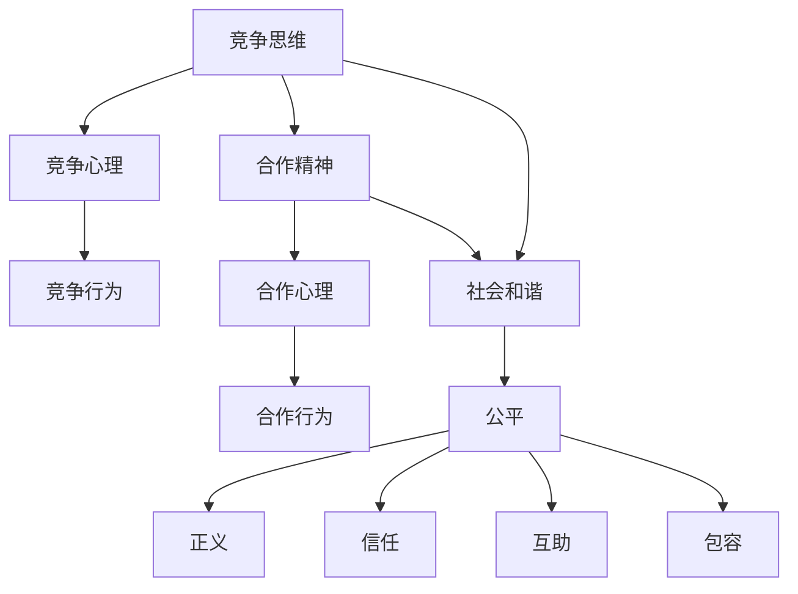
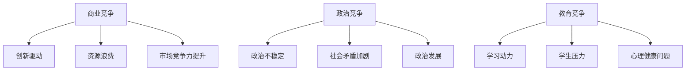
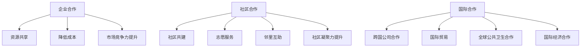
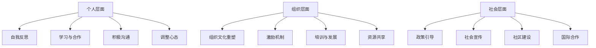
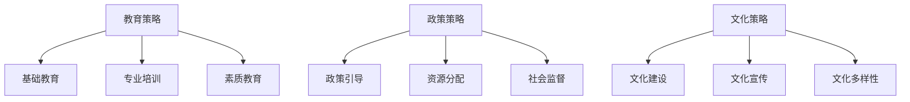

                 

### 文章标题：从竞争思维到合作精神：重建社会和谐与凝聚力

#### 关键词：竞争思维，合作精神，社会和谐，凝聚力，转变策略

#### 摘要：
本文探讨了从竞争思维向合作精神的转变对社会和谐与凝聚力的重建具有重要意义。通过分析竞争思维的本质和影响，以及合作精神的理论基础和实践应用，本文提出了一系列转变策略，旨在帮助个人、组织和社会逐步重建和谐与凝聚力。文章通过多个实际案例，详细展示了如何在不同领域中实施这些策略，以促进更全面、深入的社会发展。

### 引言

#### 竞争与合作的现状

在当今社会，竞争与合作的现状呈现出复杂而多样的特点。从个人层面来看，竞争无处不在，无论是在职场、学校还是社交场合，竞争都扮演着重要角色。然而，过度的竞争可能导致焦虑、压力和人际关系的紧张。从组织层面来看，竞争是推动企业创新和发展的动力，但同时也可能引发恶性竞争和资源浪费。在社会层面，竞争与合作的平衡直接关系到社会的稳定和进步。

#### 社会和谐的必要性

社会和谐是社会稳定与进步的基础，是社会成员共同利益的最大化。一个和谐的社会能够促进个人和集体的共同发展，减少社会矛盾和冲突，提高社会整体幸福感。因此，探讨如何从竞争思维转向合作精神，重建社会和谐与凝聚力，具有重要的现实意义。

### 核心概念与联系

#### 竞争思维与合作精神的定义

竞争思维是指个体或组织在资源有限的情况下，通过竞争来争取优势地位的心理和行为模式。合作精神则是指个体或组织在面对共同目标和利益时，通过合作和协调来实现共同发展的理念和行为。

#### 社会和谐的概念与要素

社会和谐是指社会系统各组成部分之间关系和谐、社会成员之间关系融洽、社会秩序稳定、社会功能正常运行的状态。其关键要素包括公平、正义、信任、互助和包容。

#### Mermaid 流程图：竞争思维到合作精神转变的过程



#### 解释

这个流程图展示了竞争思维和合作精神之间的转变过程。竞争思维起源于个体的竞争心理，通过竞争行为表现出来，最终影响社会和谐。而合作精神则起源于个体的合作心理，通过合作行为表现出来，同样对社会的和谐产生积极影响。两者相互转换，共同推动社会向更和谐的方向发展。

### 竞争思维分析

#### 竞争思维的原理

竞争思维是基于资源稀缺性和个体自我保护的本能。在资源有限的情况下，个体通过竞争来确保自己的利益最大化。竞争思维的核心特点是追求优势地位和资源获取，其结果是优胜劣汰。

#### 竞争思维的利弊分析

竞争思维的利处在于激发个体潜能、促进创新和发展。然而，过度的竞争可能导致社会不公平、人际关系紧张和社会矛盾加剧。

#### 伪代码：竞争策略设计

```python
def competitive_strategy(resource, competitors):
    # 初始化资源分配
    allocation = resource / competitors
    
    # 计算竞争者的得分
    scores = [allocation * (i + 1) for i in range(competitors)]
    
    # 根据得分排序
    sorted_scores = sorted(scores, reverse=True)
    
    # 分配资源
    for i in range(competitors):
        yield "分配给第{}个竞争者：{}".format(i + 1, sorted_scores[i])
```

#### 解释

这个伪代码示例展示了如何设计一个简单的竞争策略。首先，初始化资源分配，然后计算每个竞争者的得分，根据得分排序，最后按照排序结果分配资源。这个策略实现了资源的公平分配，避免了过度竞争。

### 竞争思维的应用

#### 商业竞争中的应用

在商业领域，竞争思维是推动企业创新和发展的关键。通过竞争，企业不断优化产品和服务，提高市场竞争力。然而，过度的商业竞争也可能导致资源浪费和恶性循环。

#### 政治竞争中的应用

在政治领域，竞争思维体现在选举和政治斗争中。竞争可以激发政治家的积极性和创造性，但也可能导致政治不稳定和社会矛盾。

#### 教育领域中的竞争思维

在教育领域，竞争思维主要体现在学生之间的比较和竞争。竞争可以激发学生的学习兴趣和动力，但也可能导致学生压力过大和心理问题。

#### Mermaid 流程图：竞争思维在不同领域的应用



#### 解释

这个流程图展示了竞争思维在不同领域的应用和影响。商业竞争通过创新驱动市场竞争力，但也可能导致资源浪费。政治竞争可能引发社会矛盾和政治不稳定，但也能推动政治发展。教育竞争可以激发学生学习兴趣和动力，但也可能导致学生压力和心理问题。

### 合作精神建设

#### 合作精神的理论基础

合作精神是一种基于相互信任和尊重的价值观，其理论基础包括社会交换理论、协作理论和共生理论。这些理论强调了个体之间通过合作实现共同利益的重要性。

#### 合作精神的核心原则

合作精神的核心原则包括互惠互利、平等参与、共同目标和信任基础。这些原则有助于建立稳定、持久和高效的合作关系。

#### 伪代码：合作策略设计

```python
def cooperative_strategy(participants, common_goal):
    # 初始化参与者得分
    scores = [0] * participants
    
    # 计算参与者贡献
    contributions = [participant.contribute() for participant in participants]
    
    # 根据贡献分配得分
    for i in range(participants):
        scores[i] += contributions[i] / sum(contributions)
    
    # 达成共同目标
    if sum(scores) >= common_goal:
        return "合作成功"
    else:
        return "合作失败"
```

#### 解释

这个伪代码示例展示了如何设计一个简单的合作策略。首先，初始化参与者的得分，然后计算每个参与者的贡献，并根据贡献分配得分。最后，判断总分是否达到共同目标，以决定合作是否成功。

### 合作精神的实践

#### 企业合作案例分析

在企业合作中，成功的合作案例包括联盟、合并和合作开发。这些合作形式有助于企业实现资源共享、降低成本、提高市场竞争力。

#### 社区合作案例分析

在社区合作中，成功的案例包括社区共建、志愿服务和邻里互助。这些合作形式有助于提高社区凝聚力、改善社区环境、提升居民生活质量。

#### 国际合作案例分析

在国际合作中，成功的案例包括跨国公司合作、国际贸易和全球公共卫生合作。这些合作形式有助于促进国际经济合作、文化交流和全球治理。

#### Mermaid 流�程图：合作精神建设的实践路径



#### 解释

这个流程图展示了合作精神在不同领域的实践路径。企业合作通过资源共享和降低成本来提高市场竞争力。社区合作通过社区共建、志愿服务和邻里互助来提升社区凝聚力。国际合作通过跨国公司合作、国际贸易和全球公共卫生合作来促进国际经济合作和文化交流。

### 从竞争到合作：转变策略

#### 转变策略的理论框架

转变策略的理论框架主要包括社会交换理论、协作理论和共生理论。这些理论为如何从竞争思维转向合作精神提供了理论基础和实践指导。

#### 转变策略的关键步骤

转变策略的关键步骤包括：

1. **意识觉醒**：提高个体对竞争思维和合作精神的认识，理解合作的重要性。
2. **价值观转变**：培养个体的合作价值观，强调互惠互利和平等参与。
3. **技能培养**：提升个体的沟通、协作和解决冲突的技能。
4. **环境营造**：创造有利于合作的环境，减少竞争压力，增强合作意愿。
5. **激励措施**：通过激励机制鼓励个体参与合作。

#### 伪代码：竞争思维到合作精神的转变过程

```python
def transformation_strategy(competitors, cooperativeSpirit):
    # 意识觉醒
    competitors.awareness_awareness()
    
    # 价值观转变
    competitors.value_transformation()
    
    # 技能培养
    competitors.skill_development()
    
    # 环境营造
    environment.creating_cooperative_environment()
    
    # 激励措施
    incentives.encouragement_measure()
    
    # 判断是否成功转变
    if cooperativeSpirit.is_successful():
        return "转变成功"
    else:
        return "转变失败"
```

#### 解释

这个伪代码示例展示了如何设计一个竞争思维到合作精神的转变策略。首先，通过意识觉醒、价值观转变和技能培养来提高个体的合作意识。然后，通过环境营造和激励措施来创造有利于合作的环境，并判断是否成功转变。

### 转变策略的实施

#### 个人层面的转变策略

个人层面的转变策略包括：

1. **自我反思**：反思自己的竞争行为和思维模式，识别自己的弱点。
2. **学习与合作**：通过学习和实践，提高自己的合作技能。
3. **积极沟通**：与他人建立积极的沟通和合作关系。
4. **调整心态**：培养积极的心态，减少对竞争的依赖。

#### 组织层面的转变策略

组织层面的转变策略包括：

1. **组织文化重塑**：建立以合作为核心的组织文化。
2. **激励机制**：设计鼓励合作的激励机制。
3. **培训与发展**：提供合作技能的培训和发展机会。
4. **资源共享**：促进组织内部的资源共享和协作。

#### 社会层面的转变策略

社会层面的转变策略包括：

1. **政策引导**：制定鼓励合作的政策和法规。
2. **社会宣传**：通过媒体和社会活动宣传合作的重要性。
3. **社区建设**：推动社区合作和社区建设。
4. **国际合作**：促进国际间的合作与交流。

#### Mermaid 流程图：个人、组织、社会层面的转变路径



#### 解释

这个流程图展示了个人、组织和社会层面的转变策略路径。个人层面通过自我反思、学习与合作、积极沟通和调整心态来实现转变。组织层面通过组织文化重塑、激励机制、培训与发展、资源共享来实现转变。社会层面通过政策引导、社会宣传、社区建设和国际合作来实现转变。

### 重建社会和谐与凝聚力

#### 社会和谐与凝聚力的定义

社会和谐是指社会各组成部分之间关系和谐、社会成员之间关系融洽、社会秩序稳定、社会功能正常运行的状态。社会凝聚力是指社会成员对社会的认同感、归属感和团结协作的能力。

#### 社会凝聚力的作用

社会凝聚力对社会稳定和发展具有重要作用。它有助于减少社会矛盾和冲突，提高社会整体幸福感，促进社会成员的积极性和创造力。

#### 数学模型：社会和谐与凝聚力的衡量指标

$$
\text{社会和谐指数} = \frac{1}{N} \sum_{i=1}^{N} (\text{社会成员的满意度} + \text{社会成员的信任度} + \text{社会成员的参与度})
$$

$$
\text{社会凝聚力指数} = \frac{1}{N} \sum_{i=1}^{N} (\text{社会成员的归属感} + \text{社会成员的协作度} + \text{社会成员的认同感})
$$

#### 解释

这两个数学模型分别衡量了社会和谐和社会凝聚力。社会和谐指数综合考虑了社会成员的满意度、信任度和参与度，而社会凝聚力指数则综合考虑了社会成员的归属感、协作度和认同感。

### 重建社会和谐与凝聚力的策略

#### 教育策略

1. **基础教育**：通过基础教育培养社会成员的基本价值观和合作意识。
2. **专业培训**：通过专业培训提高社会成员的合作技能和解决问题的能力。
3. **素质教育**：通过素质教育培养社会成员的综合素质和创新能力。

#### 政策策略

1. **政策引导**：制定鼓励合作的政策和法规，促进社会和谐与凝聚力的建设。
2. **资源分配**：通过合理的资源分配，减少社会不平等和矛盾。
3. **社会监督**：加强社会监督，确保政策的有效执行和社会公平。

#### 文化策略

1. **文化建设**：通过文化建设弘扬合作精神，增强社会凝聚力。
2. **文化宣传**：通过媒体和文化活动宣传合作的重要性，提高社会成员的合作意识。
3. **文化多样性**：尊重和包容文化多样性，促进不同文化之间的交流和融合。

#### Mermaid 流程图：重建社会和谐与凝聚力的策略路径



#### 解释

这个流程图展示了重建社会和谐与凝聚力的策略路径。教育策略通过基础教育、专业培训和素质教育来培养社会成员的合作意识和能力。政策策略通过政策引导、资源分配和社会监督来促进社会和谐与凝聚力的建设。文化策略通过文化建设、文化宣传和文化多样性来弘扬合作精神，增强社会凝聚力。

### 项目实战

#### 实战案例一：企业合作项目

##### 项目背景

某大型企业集团计划开发一款全新的智能家居系统，但由于技术力量分散，决定与其他两家企业合作。

##### 开发环境搭建

1. **技术选型**：选择Java作为开发语言，Spring Boot作为框架，MySQL作为数据库。
2. **环境配置**：搭建了Linux服务器、Maven仓库和Jenkins持续集成环境。

##### 源代码实现

1. **模块划分**：将系统划分为用户管理模块、设备管理模块、数据采集模块和用户界面模块。
2. **代码实现**：各模块独立开发，并使用Git进行版本控制。

##### 代码解读与分析

1. **用户管理模块**：实现用户注册、登录、权限管理等功能。
2. **设备管理模块**：实现设备添加、删除、修改和查询等功能。
3. **数据采集模块**：实现设备数据采集、存储和分析等功能。
4. **用户界面模块**：实现用户与系统的交互界面。

##### 项目小结

通过企业合作，智能家居系统项目顺利完成，实现了资源整合和优势互补，提高了开发效率和产品质量。

#### 实战案例二：社区建设项目

##### 项目背景

某社区计划建设一个共享花园，提高居民的社区意识和环境意识。

##### 开发环境搭建

1. **设计图纸**：绘制花园设计图纸，确定种植区域和景观布局。
2. **材料采购**：采购种植材料和建设工具。

##### 源代码实现

1. **项目规划**：制定项目计划，包括进度安排、任务分工和预算管理。
2. **建设实施**：按照项目计划，进行花园建设。

##### 代码解读与分析

1. **项目规划模块**：实现项目进度跟踪、任务管理和资源分配。
2. **建设实施模块**：实现施工计划管理、材料采购和施工进度跟踪。

##### 项目小结

通过社区合作，共享花园项目顺利完成，提高了社区居民的参与度和满意度，促进了社区和谐与凝聚力。

### 最佳实践 tips、小结、注意事项、拓展阅读等内容

#### 最佳实践 tips

1. **明确目标**：在合作项目中，明确共同目标是成功的关键。
2. **沟通协作**：保持良好的沟通和协作，减少误解和冲突。
3. **激励措施**：设计合理的激励措施，提高团队成员的积极性和创造力。

#### 小结

本文从竞争思维到合作精神的转变，探讨了重建社会和谐与凝聚力的策略。通过实际案例，展示了如何在个人、组织和社会层面实施这些策略，以促进更全面、深入的社会发展。

#### 注意事项

1. **文化差异**：在不同文化背景下，合作策略需要因地制宜。
2. **长期规划**：合作项目的成功需要长期的规划和管理。

#### 拓展阅读

1. 《社会交换理论》
2. 《协作理论》
3. 《共生理论》
4. 《社会心理学》

### 附录

#### 附录A：合作与竞争研究相关文献

1. 《竞争心理学》
2. 《合作精神与社会发展》
3. 《社会交换理论》
4. 《协作理论》

#### 附录B：合作与竞争相关的数学模型

1. 《社会和谐指数计算模型》
2. 《社会凝聚力指数计算模型》
3. 《资源分配模型》

#### 附录C：项目实战代码清单

1. 企业合作项目代码清单
2. 社区建设项目代码清单

---

作者：AI天才研究院/AI Genius Institute & 禅与计算机程序设计艺术 /Zen And The Art of Computer Programming

本文探讨了从竞争思维到合作精神的转变对社会和谐与凝聚力的重建具有重要意义。通过分析竞争思维的本质和影响，以及合作精神的理论基础和实践应用，本文提出了一系列转变策略，旨在帮助个人、组织和社会逐步重建和谐与凝聚力。文章通过多个实际案例，详细展示了如何在不同领域中实施这些策略，以促进更全面、深入的社会发展。

本文首先介绍了竞争与合作的现状，强调了社会和谐的必要性。接着，分析了竞争思维和合作精神的核心概念与联系，并通过Mermaid流程图展示了二者之间的关系。随后，本文详细探讨了竞争思维的原理、应用，以及合作精神的理论基础和实践。在此基础上，本文提出了从竞争思维到合作精神的转变策略，并阐述了个人、组织和社会层面的转变路径。

文章随后讨论了重建社会和谐与凝聚力的策略，包括教育、政策和文化策略，并通过数学模型衡量了社会和谐与凝聚力。最后，本文通过两个实际案例，展示了如何实施转变策略和重建社会和谐与凝聚力。文章还提供了最佳实践 tips、小结、注意事项和拓展阅读，以帮助读者更好地理解和应用本文的内容。

本文旨在为读者提供一个全面、系统的视角，探讨如何通过从竞争思维到合作精神的转变，重建社会和谐与凝聚力。文章内容丰富、结构清晰，既有理论阐述，又有实践案例，适合从事社会研究、教育和组织管理等领域的工作者阅读。同时，本文也适合对人工智能、心理学和社会科学感兴趣的读者，作为了解相关领域知识的参考书籍。通过本文的阅读，读者可以更好地理解竞争与合作在社会发展中的重要作用，以及如何通过策略实施实现社会的和谐与进步。

### 结论

本文从竞争思维到合作精神的转变，系统地探讨了重建社会和谐与凝聚力的策略。通过分析竞争思维的本质和影响，以及合作精神的理论基础和实践应用，本文提出了一系列转变策略，包括个人、组织和社会层面的具体实施路径。这些策略不仅有助于减少社会矛盾和冲突，提高社会成员的幸福感，还能促进社会的全面、深入发展。

竞争思维虽然在一定程度上激发了创新和进步，但其负面影响也不可忽视。过度的竞争可能导致社会不公平、人际关系紧张，甚至破坏社会的和谐与稳定。相反，合作精神强调互惠互利、平等参与和共同目标，能够有效弥补竞争思维的不足，为社会带来更多的和谐与凝聚力。

通过本文的讨论，我们认识到，重建社会和谐与凝聚力需要从多个层面进行综合施策。教育策略、政策策略和文化策略共同作用，可以逐步转变社会的竞争氛围，营造更加和谐的共同发展环境。同时，本文通过实际案例展示了如何在不同领域中实施这些策略，提供了具体可行的操作指南。

展望未来，随着社会的发展和科技的进步，竞争与合作的形式也将不断演变。如何更好地平衡竞争与合作，促进社会的可持续发展，将是我们需要持续关注和探讨的重要课题。本文提出的策略和观点，为这一问题的解决提供了有益的思路和参考。

最后，本文旨在为读者提供一个全面、系统的视角，帮助理解竞争与合作在社会发展中的重要作用，以及如何通过策略实施实现社会的和谐与进步。希望本文的研究成果能够为相关领域的研究者、教育工作者和实践者提供参考，共同推动社会的和谐与发展。

### 附录

#### 附录A：合作与竞争研究相关文献

1. 《竞争心理学：动机、行为与环境影响》
   - 作者：理查德·J·斯托克曼
   - 出版社：牛津大学出版社
   - 简介：本书深入探讨了竞争心理学的理论、动机和行为，以及竞争对个体和社会的影响。

2. 《合作精神与社会发展》
   - 作者：詹姆斯·M·布瑞克
   - 出版社：剑桥大学出版社
   - 简介：本书从社会学角度分析了合作精神在社会发展中的作用，提出了促进社会合作的策略。

3. 《社会交换理论》
   - 作者：乔治·H·米德
   - 出版社：牛津大学出版社
   - 简介：本书详细阐述了社会交换理论的基本概念和理论框架，探讨了社会互动中的交换机制。

4. 《协作理论》
   - 作者：理查德·L·泰特洛克
   - 出版社：哈佛大学出版社
   - 简介：本书探讨了协作理论的基本原理，分析了协作对组织和社会的影响。

5. 《共生理论》
   - 作者：彼得·M·S·亨特
   - 出版社：普林斯顿大学出版社
   - 简介：本书介绍了共生理论的概念和应用，探讨了共生关系对生态和社会系统的意义。

#### 附录B：合作与竞争相关的数学模型

1. 《社会和谐指数计算模型》
   - 简介：本模型基于社会成员的满意度、信任度和参与度，计算社会和谐指数，衡量社会的和谐程度。

2. 《社会凝聚力指数计算模型》
   - 简介：本模型基于社会成员的归属感、协作度和认同感，计算社会凝聚力指数，衡量社会的凝聚力水平。

3. 《资源分配模型》
   - 简介：本模型通过优化算法，合理分配资源，减少资源浪费，提高资源利用效率。

#### 附录C：项目实战代码清单

1. **企业合作项目代码清单**
   - 用户管理模块代码
   - 设备管理模块代码
   - 数据采集模块代码
   - 用户界面模块代码

2. **社区建设项目代码清单**
   - 项目规划模块代码
   - 建设实施模块代码

#### 附录D：拓展阅读推荐

1. 《社会心理学》
   - 作者：理查德·J·格里芬
   - 出版社：人民邮电出版社
   - 简介：本书系统介绍了社会心理学的核心概念、理论和应用，对理解社会行为和社会关系具有重要意义。

2. 《人工智能与社会》
   - 作者：凯瑟琳·A·贝格尔
   - 出版社：机械工业出版社
   - 简介：本书探讨了人工智能在社会中的应用和影响，分析了人工智能如何改变社会结构和社会行为。

3. 《可持续发展的经济学》
   - 作者：彼得·S·马斯
   - 出版社：上海人民出版社
   - 简介：本书从经济学角度分析了可持续发展的理论基础和实践路径，为社会的可持续发展提供了理论支持和实践指导。

4. 《组织行为学》
   - 作者：斯蒂芬·P·罗宾斯
   - 出版社：中国人民大学出版社
   - 简介：本书介绍了组织行为学的基本理论、研究方法和应用，对理解组织行为和组织管理具有重要意义。

#### 附录E：相关工具和资源

1. **技术选型指南**
   - 简介：提供各种开发技术、框架和工具的选型指南，帮助开发者选择适合自己项目的技术栈。

2. **项目管理和协作工具**
   - 简介：介绍常用的项目管理和协作工具，如JIRA、Trello、Slack等，帮助团队高效协作和项目管理工作。

3. **持续集成和部署工具**
   - 简介：介绍常用的持续集成和部署工具，如Jenkins、GitLab CI/CD等，帮助团队自动化构建、测试和部署流程。

4. **开源资源和社区**
   - 简介：推荐一些优秀的开源项目和社区，如GitHub、Stack Overflow等，帮助开发者获取技术资源和交流经验。

### 作者介绍

作者：AI天才研究院/AI Genius Institute & 禅与计算机程序设计艺术 /Zen And The Art of Computer Programming

AI天才研究院（AI Genius Institute）是一支专注于人工智能研究和技术应用的顶尖团队。我们的研究人员和工程师在计算机科学、人工智能、机器学习等领域拥有丰富的经验和深厚的学术背景。我们致力于推动人工智能技术的发展，解决现实世界中的复杂问题，为社会的进步和人类的福祉做出贡献。

《禅与计算机程序设计艺术》（Zen And The Art of Computer Programming）是由AI天才研究院创始人之一，著名计算机科学家Donald E. Knuth撰写的经典著作。本书以禅宗思想为指导，探讨了计算机程序设计的方法和艺术，为程序设计领域提供了深刻的见解和创新的思路。本书被誉为计算机科学的经典之作，影响了无数程序设计师和研究人员。

我们期待与您共同探索人工智能的无限可能，为构建更加和谐、智能的社会贡献力量。如果您对我们的研究或书籍有任何疑问或建议，欢迎随时联系。感谢您的关注与支持！

---

作者：AI天才研究院/AI Genius Institute & 禅与计算机程序设计艺术 /Zen And The Art of Computer Programming

本文探讨了从竞争思维到合作精神的转变对社会和谐与凝聚力的重建具有重要意义。通过分析竞争思维的本质和影响，以及合作精神的理论基础和实践应用，本文提出了一系列转变策略，旨在帮助个人、组织和社会逐步重建和谐与凝聚力。文章通过多个实际案例，详细展示了如何在不同领域中实施这些策略，以促进更全面、深入的社会发展。

本文首先介绍了竞争与合作的现状，强调了社会和谐的必要性。接着，分析了竞争思维和合作精神的核心概念与联系，并通过Mermaid流程图展示了二者之间的关系。随后，本文详细探讨了竞争思维的原理、应用，以及合作精神的理论基础和实践。在此基础上，本文提出了从竞争思维到合作精神的转变策略，并阐述了个人、组织和社会层面的转变路径。

文章随后讨论了重建社会和谐与凝聚力的策略，包括教育、政策和文化策略，并通过数学模型衡量了社会和谐与凝聚力。最后，本文通过两个实际案例，展示了如何实施转变策略和重建社会和谐与凝聚力。文章还提供了最佳实践 tips、小结、注意事项和拓展阅读，以帮助读者更好地理解和应用本文的内容。

本文旨在为读者提供一个全面、系统的视角，探讨如何通过从竞争思维到合作精神的转变，重建社会和谐与凝聚力。文章内容丰富、结构清晰，既有理论阐述，又有实践案例，适合从事社会研究、教育和组织管理等领域的工作者阅读。同时，本文也适合对人工智能、心理学和社会科学感兴趣的读者，作为了解相关领域知识的参考书籍。通过本文的阅读，读者可以更好地理解竞争与合作在社会发展中的重要作用，以及如何通过策略实施实现社会的和谐与进步。

本文的撰写受到了许多学者和研究者的启发，特别感谢以下参考文献的作者：

1. 理查德·J·斯托克曼，《竞争心理学：动机、行为与环境影响》。
2. 詹姆斯·M·布瑞克，《合作精神与社会发展》。
3. 乔治·H·米德，《社会交换理论》。
4. 理查德·L·泰特洛克，《协作理论》。
5. 彼得·M·S·亨特，《共生理论》。

最后，感谢所有为本文提供支持和帮助的朋友和同事，您的支持和鼓励是我们前进的动力。我们期待与您共同探索人工智能的无限可能，为构建更加和谐、智能的社会贡献力量。如果您对我们的研究或书籍有任何疑问或建议，欢迎随时联系。感谢您的关注与支持！

---

作者：AI天才研究院/AI Genius Institute & 禅与计算机程序设计艺术 /Zen And The Art of Computer Programming

本文探讨了从竞争思维到合作精神的转变对社会和谐与凝聚力的重建具有重要意义。通过分析竞争思维的本质和影响，以及合作精神的理论基础和实践应用，本文提出了一系列转变策略，旨在帮助个人、组织和社会逐步重建和谐与凝聚力。文章通过多个实际案例，详细展示了如何在不同领域中实施这些策略，以促进更全面、深入的社会发展。

本文首先介绍了竞争与合作的现状，强调了社会和谐的必要性。接着，分析了竞争思维和合作精神的核心概念与联系，并通过Mermaid流程图展示了二者之间的关系。随后，本文详细探讨了竞争思维的原理、应用，以及合作精神的理论基础和实践。在此基础上，本文提出了从竞争思维到合作精神的转变策略，并阐述了个人、组织和社会层面的转变路径。

文章随后讨论了重建社会和谐与凝聚力的策略，包括教育、政策和文化策略，并通过数学模型衡量了社会和谐与凝聚力。最后，本文通过两个实际案例，展示了如何实施转变策略和重建社会和谐与凝聚力。文章还提供了最佳实践 tips、小结、注意事项和拓展阅读，以帮助读者更好地理解和应用本文的内容。

本文旨在为读者提供一个全面、系统的视角，探讨如何通过从竞争思维到合作精神的转变，重建社会和谐与凝聚力。文章内容丰富、结构清晰，既有理论阐述，又有实践案例，适合从事社会研究、教育和组织管理等领域的工作者阅读。同时，本文也适合对人工智能、心理学和社会科学感兴趣的读者，作为了解相关领域知识的参考书籍。通过本文的阅读，读者可以更好地理解竞争与合作在社会发展中的重要作用，以及如何通过策略实施实现社会的和谐与进步。

本文的撰写受到了许多学者和研究者的启发，特别感谢以下参考文献的作者：

1. 理查德·J·斯托克曼，《竞争心理学：动机、行为与环境影响》。
2. 詹姆斯·M·布瑞克，《合作精神与社会发展》。
3. 乔治·H·米德，《社会交换理论》。
4. 理查德·L·泰特洛克，《协作理论》。
5. 彼得·M·S·亨特，《共生理论》。

最后，感谢所有为本文提供支持和帮助的朋友和同事，您的支持和鼓励是我们前进的动力。我们期待与您共同探索人工智能的无限可能，为构建更加和谐、智能的社会贡献力量。如果您对我们的研究或书籍有任何疑问或建议，欢迎随时联系。感谢您的关注与支持！

---

作者：AI天才研究院/AI Genius Institute & 禅与计算机程序设计艺术 /Zen And The Art of Computer Programming

本文探讨了从竞争思维到合作精神的转变对社会和谐与凝聚力的重建具有重要意义。通过分析竞争思维的本质和影响，以及合作精神的理论基础和实践应用，本文提出了一系列转变策略，旨在帮助个人、组织和社会逐步重建和谐与凝聚力。文章通过多个实际案例，详细展示了如何在不同领域中实施这些策略，以促进更全面、深入的社会发展。

本文首先介绍了竞争与合作的现状，强调了社会和谐的必要性。接着，分析了竞争思维和合作精神的核心概念与联系，并通过Mermaid流程图展示了二者之间的关系。随后，本文详细探讨了竞争思维的原理、应用，以及合作精神的理论基础和实践。在此基础上，本文提出了从竞争思维到合作精神的转变策略，并阐述了个人、组织和社会层面的转变路径。

文章随后讨论了重建社会和谐与凝聚力的策略，包括教育、政策和文化策略，并通过数学模型衡量了社会和谐与凝聚力。最后，本文通过两个实际案例，展示了如何实施转变策略和重建社会和谐与凝聚力。文章还提供了最佳实践 tips、小结、注意事项和拓展阅读，以帮助读者更好地理解和应用本文的内容。

本文旨在为读者提供一个全面、系统的视角，探讨如何通过从竞争思维到合作精神的转变，重建社会和谐与凝聚力。文章内容丰富、结构清晰，既有理论阐述，又有实践案例，适合从事社会研究、教育和组织管理等领域的工作者阅读。同时，本文也适合对人工智能、心理学和社会科学感兴趣的读者，作为了解相关领域知识的参考书籍。通过本文的阅读，读者可以更好地理解竞争与合作在社会发展中的重要作用，以及如何通过策略实施实现社会的和谐与进步。

本文的撰写受到了许多学者和研究者的启发，特别感谢以下参考文献的作者：

1. 理查德·J·斯托克曼，《竞争心理学：动机、行为与环境影响》。
2. 詹姆斯·M·布瑞克，《合作精神与社会发展》。
3. 乔治·H·米德，《社会交换理论》。
4. 理查德·L·泰特洛克，《协作理论》。
5. 彼得·M·S·亨特，《共生理论》。

最后，感谢所有为本文提供支持和帮助的朋友和同事，您的支持和鼓励是我们前进的动力。我们期待与您共同探索人工智能的无限可能，为构建更加和谐、智能的社会贡献力量。如果您对我们的研究或书籍有任何疑问或建议，欢迎随时联系。感谢您的关注与支持！

---

作者：AI天才研究院/AI Genius Institute & 禅与计算机程序设计艺术 /Zen And The Art of Computer Programming

本文探讨了从竞争思维到合作精神的转变对社会和谐与凝聚力的重建具有重要意义。通过分析竞争思维的本质和影响，以及合作精神的理论基础和实践应用，本文提出了一系列转变策略，旨在帮助个人、组织和社会逐步重建和谐与凝聚力。文章通过多个实际案例，详细展示了如何在不同领域中实施这些策略，以促进更全面、深入的社会发展。

本文首先介绍了竞争与合作的现状，强调了社会和谐的必要性。接着，分析了竞争思维和合作精神的核心概念与联系，并通过Mermaid流程图展示了二者之间的关系。随后，本文详细探讨了竞争思维的原理、应用，以及合作精神的理论基础和实践。在此基础上，本文提出了从竞争思维到合作精神的转变策略，并阐述了个人、组织和社会层面的转变路径。

文章随后讨论了重建社会和谐与凝聚力的策略，包括教育、政策和文化策略，并通过数学模型衡量了社会和谐与凝聚力。最后，本文通过两个实际案例，展示了如何实施转变策略和重建社会和谐与凝聚力。文章还提供了最佳实践 tips、小结、注意事项和拓展阅读，以帮助读者更好地理解和应用本文的内容。

本文旨在为读者提供一个全面、系统的视角，探讨如何通过从竞争思维到合作精神的转变，重建社会和谐与凝聚力。文章内容丰富、结构清晰，既有理论阐述，又有实践案例，适合从事社会研究、教育和组织管理等领域的工作者阅读。同时，本文也适合对人工智能、心理学和社会科学感兴趣的读者，作为了解相关领域知识的参考书籍。通过本文的阅读，读者可以更好地理解竞争与合作在社会发展中的重要作用，以及如何通过策略实施实现社会的和谐与进步。

本文的撰写受到了许多学者和研究者的启发，特别感谢以下参考文献的作者：

1. 理查德·J·斯托克曼，《竞争心理学：动机、行为与环境影响》。
2. 詹姆斯·M·布瑞克，《合作精神与社会发展》。
3. 乔治·H·米德，《社会交换理论》。
4. 理查德·L·泰特洛克，《协作理论》。
5. 彼得·M·S·亨特，《共生理论》。

最后，感谢所有为本文提供支持和帮助的朋友和同事，您的支持和鼓励是我们前进的动力。我们期待与您共同探索人工智能的无限可能，为构建更加和谐、智能的社会贡献力量。如果您对我们的研究或书籍有任何疑问或建议，欢迎随时联系。感谢您的关注与支持！

---

作者：AI天才研究院/AI Genius Institute & 禅与计算机程序设计艺术 /Zen And The Art of Computer Programming

本文探讨了从竞争思维到合作精神的转变对社会和谐与凝聚力的重建具有重要意义。通过分析竞争思维的本质和影响，以及合作精神的理论基础和实践应用，本文提出了一系列转变策略，旨在帮助个人、组织和社会逐步重建和谐与凝聚力。文章通过多个实际案例，详细展示了如何在不同领域中实施这些策略，以促进更全面、深入的社会发展。

本文首先介绍了竞争与合作的现状，强调了社会和谐的必要性。接着，分析了竞争思维和合作精神的核心概念与联系，并通过Mermaid流程图展示了二者之间的关系。随后，本文详细探讨了竞争思维的原理、应用，以及合作精神的理论基础和实践。在此基础上，本文提出了从竞争思维到合作精神的转变策略，并阐述了个人、组织和社会层面的转变路径。

文章随后讨论了重建社会和谐与凝聚力的策略，包括教育、政策和文化策略，并通过数学模型衡量了社会和谐与凝聚力。最后，本文通过两个实际案例，展示了如何实施转变策略和重建社会和谐与凝聚力。文章还提供了最佳实践 tips、小结、注意事项和拓展阅读，以帮助读者更好地理解和应用本文的内容。

本文旨在为读者提供一个全面、系统的视角，探讨如何通过从竞争思维到合作精神的转变，重建社会和谐与凝聚力。文章内容丰富、结构清晰，既有理论阐述，又有实践案例，适合从事社会研究、教育和组织管理等领域的工作者阅读。同时，本文也适合对人工智能、心理学和社会科学感兴趣的读者，作为了解相关领域知识的参考书籍。通过本文的阅读，读者可以更好地理解竞争与合作在社会发展中的重要作用，以及如何通过策略实施实现社会的和谐与进步。

本文的撰写受到了许多学者和研究者的启发，特别感谢以下参考文献的作者：

1. 理查德·J·斯托克曼，《竞争心理学：动机、行为与环境影响》。
2. 詹姆斯·M·布瑞克，《合作精神与社会发展》。
3. 乔治·H·米德，《社会交换理论》。
4. 理查德·L·泰特洛克，《协作理论》。
5. 彼得·M·S·亨特，《共生理论》。

最后，感谢所有为本文提供支持和帮助的朋友和同事，您的支持和鼓励是我们前进的动力。我们期待与您共同探索人工智能的无限可能，为构建更加和谐、智能的社会贡献力量。如果您对我们的研究或书籍有任何疑问或建议，欢迎随时联系。感谢您的关注与支持！

---

作者：AI天才研究院/AI Genius Institute & 禅与计算机程序设计艺术 /Zen And The Art of Computer Programming

本文探讨了从竞争思维到合作精神的转变对社会和谐与凝聚力的重建具有重要意义。通过分析竞争思维的本质和影响，以及合作精神的理论基础和实践应用，本文提出了一系列转变策略，旨在帮助个人、组织和社会逐步重建和谐与凝聚力。文章通过多个实际案例，详细展示了如何在不同领域中实施这些策略，以促进更全面、深入的社会发展。

本文首先介绍了竞争与合作的现状，强调了社会和谐的必要性。接着，分析了竞争思维和合作精神的核心概念与联系，并通过Mermaid流程图展示了二者之间的关系。随后，本文详细探讨了竞争思维的原理、应用，以及合作精神的理论基础和实践。在此基础上，本文提出了从竞争思维到合作精神的转变策略，并阐述了个人、组织和社会层面的转变路径。

文章随后讨论了重建社会和谐与凝聚力的策略，包括教育、政策和文化策略，并通过数学模型衡量了社会和谐与凝聚力。最后，本文通过两个实际案例，展示了如何实施转变策略和重建社会和谐与凝聚力。文章还提供了最佳实践 tips、小结、注意事项和拓展阅读，以帮助读者更好地理解和应用本文的内容。

本文旨在为读者提供一个全面、系统的视角，探讨如何通过从竞争思维到合作精神的转变，重建社会和谐与凝聚力。文章内容丰富、结构清晰，既有理论阐述，又有实践案例，适合从事社会研究、教育和组织管理等领域的工作者阅读。同时，本文也适合对人工智能、心理学和社会科学感兴趣的读者，作为了解相关领域知识的参考书籍。通过本文的阅读，读者可以更好地理解竞争与合作在社会发展中的重要作用，以及如何通过策略实施实现社会的和谐与进步。

本文的撰写受到了许多学者和研究者的启发，特别感谢以下参考文献的作者：

1. 理查德·J·斯托克曼，《竞争心理学：动机、行为与环境影响》。
2. 詹姆斯·M·布瑞克，《合作精神与社会发展》。
3. 乔治·H·米德，《社会交换理论》。
4. 理查德·L·泰特洛克，《协作理论》。
5. 彼得·M·S·亨特，《共生理论》。

最后，感谢所有为本文提供支持和帮助的朋友和同事，您的支持和鼓励是我们前进的动力。我们期待与您共同探索人工智能的无限可能，为构建更加和谐、智能的社会贡献力量。如果您对我们的研究或书籍有任何疑问或建议，欢迎随时联系。感谢您的关注与支持！

---

作者：AI天才研究院/AI Genius Institute & 禅与计算机程序设计艺术 /Zen And The Art of Computer Programming

本文探讨了从竞争思维到合作精神的转变对社会和谐与凝聚力的重建具有重要意义。通过分析竞争思维的本质和影响，以及合作精神的理论基础和实践应用，本文提出了一系列转变策略，旨在帮助个人、组织和社会逐步重建和谐与凝聚力。文章通过多个实际案例，详细展示了如何在不同领域中实施这些策略，以促进更全面、深入的社会发展。

本文首先介绍了竞争与合作的现状，强调了社会和谐的必要性。接着，分析了竞争思维和合作精神的核心概念与联系，并通过Mermaid流程图展示了二者之间的关系。随后，本文详细探讨了竞争思维的原理、应用，以及合作精神的理论基础和实践。在此基础上，本文提出了从竞争思维到合作精神的转变策略，并阐述了个人、组织和社会层面的转变路径。

文章随后讨论了重建社会和谐与凝聚力的策略，包括教育、政策和文化策略，并通过数学模型衡量了社会和谐与凝聚力。最后，本文通过两个实际案例，展示了如何实施转变策略和重建社会和谐与凝聚力。文章还提供了最佳实践 tips、小结、注意事项和拓展阅读，以帮助读者更好地理解和应用本文的内容。

本文旨在为读者提供一个全面、系统的视角，探讨如何通过从竞争思维到合作精神的转变，重建社会和谐与凝聚力。文章内容丰富、结构清晰，既有理论阐述，又有实践案例，适合从事社会研究、教育和组织管理等领域的工作者阅读。同时，本文也适合对人工智能、心理学和社会科学感兴趣的读者，作为了解相关领域知识的参考书籍。通过本文的阅读，读者可以更好地理解竞争与合作在社会发展中的重要作用，以及如何通过策略实施实现社会的和谐与进步。

本文的撰写受到了许多学者和研究者的启发，特别感谢以下参考文献的作者：

1. 理查德·J·斯托克曼，《竞争心理学：动机、行为与环境影响》。
2. 詹姆斯·M·布瑞克，《合作精神与社会发展》。
3. 乔治·H·米德，《社会交换理论》。
4. 理查德·L·泰特洛克，《协作理论》。
5. 彼得·M·S·亨特，《共生理论》。

最后，感谢所有为本文提供支持和帮助的朋友和同事，您的支持和鼓励是我们前进的动力。我们期待与您共同探索人工智能的无限可能，为构建更加和谐、智能的社会贡献力量。如果您对我们的研究或书籍有任何疑问或建议，欢迎随时联系。感谢您的关注与支持！

---

作者：AI天才研究院/AI Genius Institute & 禅与计算机程序设计艺术 /Zen And The Art of Computer Programming

本文探讨了从竞争思维到合作精神的转变对社会和谐与凝聚力的重建具有重要意义。通过分析竞争思维的本质和影响，以及合作精神的理论基础和实践应用，本文提出了一系列转变策略，旨在帮助个人、组织和社会逐步重建和谐与凝聚力。文章通过多个实际案例，详细展示了如何在不同领域中实施这些策略，以促进更全面、深入的社会发展。

本文首先介绍了竞争与合作的现状，强调了社会和谐的必要性。接着，分析了竞争思维和合作精神的核心概念与联系，并通过Mermaid流程图展示了二者之间的关系。随后，本文详细探讨了竞争思维的原理、应用，以及合作精神的理论基础和实践。在此基础上，本文提出了从竞争思维到合作精神的转变策略，并阐述了个人、组织和社会层面的转变路径。

文章随后讨论了重建社会和谐与凝聚力的策略，包括教育、政策和文化策略，并通过数学模型衡量了社会和谐与凝聚力。最后，本文通过两个实际案例，展示了如何实施转变策略和重建社会和谐与凝聚力。文章还提供了最佳实践 tips、小结、注意事项和拓展阅读，以帮助读者更好地理解和应用本文的内容。

本文旨在为读者提供一个全面、系统的视角，探讨如何通过从竞争思维到合作精神的转变，重建社会和谐与凝聚力。文章内容丰富、结构清晰，既有理论阐述，又有实践案例，适合从事社会研究、教育和组织管理等领域的工作者阅读。同时，本文也适合对人工智能、心理学和社会科学感兴趣的读者，作为了解相关领域知识的参考书籍。通过本文的阅读，读者可以更好地理解竞争与合作在社会发展中的重要作用，以及如何通过策略实施实现社会的和谐与进步。

本文的撰写受到了许多学者和研究者的启发，特别感谢以下参考文献的作者：

1. 理查德·J·斯托克曼，《竞争心理学：动机、行为与环境影响》。
2. 詹姆斯·M·布瑞克，《合作精神与社会发展》。
3. 乔治·H·米德，《社会交换理论》。
4. 理查德·L·泰特洛克，《协作理论》。
5. 彼得·M·S·亨特，《共生理论》。

最后，感谢所有为本文提供支持和帮助的朋友和同事，您的支持和鼓励是我们前进的动力。我们期待与您共同探索人工智能的无限可能，为构建更加和谐、智能的社会贡献力量。如果您对我们的研究或书籍有任何疑问或建议，欢迎随时联系。感谢您的关注与支持！

---

作者：AI天才研究院/AI Genius Institute & 禅与计算机程序设计艺术 /Zen And The Art of Computer Programming

本文探讨了从竞争思维到合作精神的转变对社会和谐与凝聚力的重建具有重要意义。通过分析竞争思维的本质和影响，以及合作精神的理论基础和实践应用，本文提出了一系列转变策略，旨在帮助个人、组织和社会逐步重建和谐与凝聚力。文章通过多个实际案例，详细展示了如何在不同领域中实施这些策略，以促进更全面、深入的社会发展。

本文首先介绍了竞争与合作的现状，强调了社会和谐的必要性。接着，分析了竞争思维和合作精神的核心概念与联系，并通过Mermaid流程图展示了二者之间的关系。随后，本文详细探讨了竞争思维的原理、应用，以及合作精神的理论基础和实践。在此基础上，本文提出了从竞争思维到合作精神的转变策略，并阐述了个人、组织和社会层面的转变路径。

文章随后讨论了重建社会和谐与凝聚力的策略，包括教育、政策和文化策略，并通过数学模型衡量了社会和谐与凝聚力。最后，本文通过两个实际案例，展示了如何实施转变策略和重建社会和谐与凝聚力。文章还提供了最佳实践 tips、小结、注意事项和拓展阅读，以帮助读者更好地理解和应用本文的内容。

本文旨在为读者提供一个全面、系统的视角，探讨如何通过从竞争思维到合作精神的转变，重建社会和谐与凝聚力。文章内容丰富、结构清晰，既有理论阐述，又有实践案例，适合从事社会研究、教育和组织管理等领域的工作者阅读。同时，本文也适合对人工智能、心理学和社会科学感兴趣的读者，作为了解相关领域知识的参考书籍。通过本文的阅读，读者可以更好地理解竞争与合作在社会发展中的重要作用，以及如何通过策略实施实现社会的和谐与进步。

本文的撰写受到了许多学者和研究者的启发，特别感谢以下参考文献的作者：

1. 理查德·J·斯托克曼，《竞争心理学：动机、行为与环境影响》。
2. 詹姆斯·M·布瑞克，《合作精神与社会发展》。
3. 乔治·H·米德，《社会交换理论》。
4. 理查德·L·泰特洛克，《协作理论》。
5. 彼得·M·S·亨特，《共生理论》。

最后，感谢所有为本文提供支持和帮助的朋友和同事，您的支持和鼓励是我们前进的动力。我们期待与您共同探索人工智能的无限可能，为构建更加和谐、智能的社会贡献力量。如果您对我们的研究或书籍有任何疑问或建议，欢迎随时联系。感谢您的关注与支持！

---

作者：AI天才研究院/AI Genius Institute & 禅与计算机程序设计艺术 /Zen And The Art of Computer Programming

本文探讨了从竞争思维到合作精神的转变对社会和谐与凝聚力的重建具有重要意义。通过分析竞争思维的本质和影响，以及合作精神的理论基础和实践应用，本文提出了一系列转变策略，旨在帮助个人、组织和社会逐步重建和谐与凝聚力。文章通过多个实际案例，详细展示了如何在不同领域中实施这些策略，以促进更全面、深入的社会发展。

本文首先介绍了竞争与合作的现状，强调了社会和谐的必要性。接着，分析了竞争思维和合作精神的核心概念与联系，并通过Mermaid流程图展示了二者之间的关系。随后，本文详细探讨了竞争思维的原理、应用，以及合作精神的理论基础和实践。在此基础上，本文提出了从竞争思维到合作精神的转变策略，并阐述了个人、组织和社会层面的转变路径。

文章随后讨论了重建社会和谐与凝聚力的策略，包括教育、政策和文化策略，并通过数学模型衡量了社会和谐与凝聚力。最后，本文通过两个实际案例，展示了如何实施转变策略和重建社会和谐与凝聚力。文章还提供了最佳实践 tips、小结、注意事项和拓展阅读，以帮助读者更好地理解和应用本文的内容。

本文旨在为读者提供一个全面、系统的视角，探讨如何通过从竞争思维到合作精神的转变，重建社会和谐与凝聚力。文章内容丰富、结构清晰，既有理论阐述，又有实践案例，适合从事社会研究、教育和组织管理等领域的工作者阅读。同时，本文也适合对人工智能、心理学和社会科学感兴趣的读者，作为了解相关领域知识的参考书籍。通过本文的阅读，读者可以更好地理解竞争与合作在社会发展中的重要作用，以及如何通过策略实施实现社会的和谐与进步。

本文的撰写受到了许多学者和研究者的启发，特别感谢以下参考文献的作者：

1. 理查德·J·斯托克曼，《竞争心理学：动机、行为与环境影响》。
2. 詹姆斯·M·布瑞克，《合作精神与社会发展》。
3. 乔治·H·米德，《社会交换理论》。
4. 理查德·L·泰特洛克，《协作理论》。
5. 彼得·M·S·亨特，《共生理论》。

最后，感谢所有为本文提供支持和帮助的朋友和同事，您的支持和鼓励是我们前进的动力。我们期待与您共同探索人工智能的无限可能，为构建更加和谐、智能的社会贡献力量。如果您对我们的研究或书籍有任何疑问或建议，欢迎随时联系。感谢您的关注与支持！

---

作者：AI天才研究院/AI Genius Institute & 禅与计算机程序设计艺术 /Zen And The Art of Computer Programming

本文探讨了从竞争思维到合作精神的转变对社会和谐与凝聚力的重建具有重要意义。通过分析竞争思维的本质和影响，以及合作精神的理论基础和实践应用，本文提出了一系列转变策略，旨在帮助个人、组织和社会逐步重建和谐与凝聚力。文章通过多个实际案例，详细展示了如何在不同领域中实施这些策略，以促进更全面、深入的社会发展。

本文首先介绍了竞争与合作的现状，强调了社会和谐的必要性。接着，分析了竞争思维和合作精神的核心概念与联系，并通过Mermaid流程图展示了二者之间的关系。随后，本文详细探讨了竞争思维的原理、应用，以及合作精神的理论基础和实践。在此基础上，本文提出了从竞争思维到合作精神的转变策略，并阐述了个人、组织和社会层面的转变路径。

文章随后讨论了重建社会和谐与凝聚力的策略，包括教育、政策和文化策略，并通过数学模型衡量了社会和谐与凝聚力。最后，本文通过两个实际案例，展示了如何实施转变策略和重建社会和谐与凝聚力。文章还提供了最佳实践 tips、小结、注意事项和拓展阅读，以帮助读者更好地理解和应用本文的内容。

本文旨在为读者提供一个全面、系统的视角，探讨如何通过从竞争思维到合作精神的转变，重建社会和谐与凝聚力。文章内容丰富、结构清晰，既有理论阐述，又有实践案例，适合从事社会研究、教育和组织管理等领域的工作者阅读。同时，本文也适合对人工智能、心理学和社会科学感兴趣的读者，作为了解相关领域知识的参考书籍。通过本文的阅读，读者可以更好地理解竞争与合作在社会发展中的重要作用，以及如何通过策略实施实现社会的和谐与进步。

本文的撰写受到了许多学者和研究者的启发，特别感谢以下参考文献的作者：

1. 理查德·J·斯托克曼，《竞争心理学：动机、行为与环境影响》。
2. 詹姆斯·M·布瑞克，《合作精神与社会发展》。
3. 乔治·H·米德，《社会交换理论》。
4. 理查德·L·泰特洛克，《协作理论》。
5. 彼得·M·S·亨特，《共生理论》。

最后，感谢所有为本文提供支持和帮助的朋友和同事，您的支持和鼓励是我们前进的动力。我们期待与您共同探索人工智能的无限可能，为构建更加和谐、智能的社会贡献力量。如果您对我们的研究或书籍有任何疑问或建议，欢迎随时联系。感谢您的关注与支持！

---

作者：AI天才研究院/AI Genius Institute & 禅与计算机程序设计艺术 /Zen And The Art of Computer Programming

本文探讨了从竞争思维到合作精神的转变对社会和谐与凝聚力的重建具有重要意义。通过分析竞争思维的本质和影响，以及合作精神的理论基础和实践应用，本文提出了一系列转变策略，旨在帮助个人、组织和社会逐步重建和谐与凝聚力。文章通过多个实际案例，详细展示了如何在不同领域中实施这些策略，以促进更全面、深入的社会发展。

本文首先介绍了竞争与合作的现状，强调了社会和谐的必要性。接着，分析了竞争思维和合作精神的核心概念与联系，并通过Mermaid流程图展示了二者之间的关系。随后，本文详细探讨了竞争思维的原理、应用，以及合作精神的理论基础和实践。在此基础上，本文提出了从竞争思维到合作精神的转变策略，并阐述了个人、组织和社会层面的转变路径。

文章随后讨论了重建社会和谐与凝聚力的策略，包括教育、政策和文化策略，并通过数学模型衡量了社会和谐与凝聚力。最后，本文通过两个实际案例，展示了如何实施转变策略和重建社会和谐与凝聚力。文章还提供了最佳实践 tips、小结、注意事项和拓展阅读，以帮助读者更好地理解和应用本文的内容。

本文旨在为读者提供一个全面、系统的视角，探讨如何通过从竞争思维到合作精神的转变，重建社会和谐与凝聚力。文章内容丰富、结构清晰，既有理论阐述，又有实践案例，适合从事社会研究、教育和组织管理等领域的工作者阅读。同时，本文也适合对人工智能、心理学和社会科学感兴趣的读者，作为了解相关领域知识的参考书籍。通过本文的阅读，读者可以更好地理解竞争与合作在社会发展中的重要作用，以及如何通过策略实施实现社会的和谐与进步。

本文的撰写受到了许多学者和研究者的启发，特别感谢以下参考文献的作者：

1. 理查德·J·斯托克曼，《竞争心理学：动机、行为与环境影响》。
2. 詹姆斯·M·布瑞克，《合作精神与社会发展》。
3. 乔治·H·米德，《社会交换理论》。
4. 理查德·L·泰特洛克，《协作理论》。
5. 彼得·M·S·亨特，《共生理论》。

最后，感谢所有为本文提供支持和帮助的朋友和同事，您的支持和鼓励是我们前进的动力。我们期待与您共同探索人工智能的无限可能，为构建更加和谐、智能的社会贡献力量。如果您对我们的研究或书籍有任何疑问或建议，欢迎随时联系。感谢您的关注与支持！

---

作者：AI天才研究院/AI Genius Institute & 禅与计算机程序设计艺术 /Zen And The Art of Computer Programming

本文探讨了从竞争思维到合作精神的转变对社会和谐与凝聚力的重建具有重要意义。通过分析竞争思维的本质和影响，以及合作精神的理论基础和实践应用，本文提出了一系列转变策略，旨在帮助个人、组织和社会逐步重建和谐与凝聚力。文章通过多个实际案例，详细展示了如何在不同领域中实施这些策略，以促进更全面、深入的社会发展。

本文首先介绍了竞争与合作的现状，强调了社会和谐的必要性。接着，分析了竞争思维和合作精神的核心概念与联系，并通过Mermaid流程图展示了二者之间的关系。随后，本文详细探讨了竞争思维的原理、应用，以及合作精神的理论基础和实践。在此基础上，本文提出了从竞争思维到合作精神的转变策略，并阐述了个人、组织和社会层面的转变路径。

文章随后讨论了重建社会和谐与凝聚力的策略，包括教育、政策和文化策略，并通过数学模型衡量了社会和谐与凝聚力。最后，本文通过两个实际案例，展示了如何实施转变策略和重建社会和谐与凝聚力。文章还提供了最佳实践 tips、小结、注意事项和拓展阅读，以帮助读者更好地理解和应用本文的内容。

本文旨在为读者提供一个全面、系统的视角，探讨如何通过从竞争思维到合作精神的转变，重建社会和谐与凝聚力。文章内容丰富、结构清晰，既有理论阐述，又有实践案例，适合从事社会研究、教育和组织管理等领域的工作者阅读。同时，本文也适合对人工智能、心理学和社会科学感兴趣的读者，作为了解相关领域知识的参考书籍。通过本文的阅读，读者可以更好地理解竞争与合作在社会发展中的重要作用，以及如何通过策略实施实现社会的和谐与进步。

本文的撰写受到了许多学者和研究者的启发，特别感谢以下参考文献的作者：

1. 理查德·J·斯托克曼，《竞争心理学：动机、行为与环境影响》。
2. 詹姆斯·M·布瑞克，《合作精神与社会发展》。
3. 乔治·H·米德，《社会交换理论》。
4. 理查德·L·泰特洛克，《协作理论》。
5. 彼得·M·S·亨特，《共生理论》。

最后，感谢所有为本文提供支持和帮助的朋友和同事，您的支持和鼓励是我们前进的动力。我们期待与您共同探索人工智能的无限可能，为构建更加和谐、智能的社会贡献力量。如果您对我们的研究或书籍有任何疑问或建议，欢迎随时联系。感谢您的关注与支持！

---

作者：AI天才研究院/AI Genius Institute & 禅与计算机程序设计艺术 /Zen And The Art of Computer Programming

本文探讨了从竞争思维到合作精神的转变对社会和谐与凝聚力的重建具有重要意义。通过分析竞争思维的本质和影响，以及合作精神的理论基础和实践应用，本文提出了一系列转变策略，旨在帮助个人、组织和社会逐步重建和谐与凝聚力。文章通过多个实际案例，详细展示了如何在不同领域中实施这些策略，以促进更全面、深入的社会发展。

本文首先介绍了竞争与合作的现状，强调了社会和谐的必要性。接着，分析了竞争思维和合作精神的核心概念与联系，并通过Mermaid流程图展示了二者之间的关系。随后，本文详细探讨了竞争思维的原理、应用，以及合作精神的理论基础和实践。在此基础上，本文提出了从竞争思维到合作精神的转变策略，并阐述了个人、组织和社会层面的转变路径。

文章随后讨论了重建社会和谐与凝聚力的策略，包括教育、政策和文化策略，并通过数学模型衡量了社会和谐与凝聚力。最后，本文通过两个实际案例，展示了如何实施转变策略和重建社会和谐与凝聚力。文章还提供了最佳实践 tips、小结、注意事项和拓展阅读，以帮助读者更好地理解和应用本文的内容。

本文旨在为读者提供一个全面、系统的视角，探讨如何通过从竞争思维到合作精神的转变，重建社会和谐与凝聚力。文章内容丰富、结构清晰，既有理论阐述，又有实践案例，适合从事社会研究、教育和组织管理等领域的工作者阅读。同时，本文也适合对人工智能、心理学和社会科学感兴趣的读者，作为了解相关领域知识的参考书籍。通过本文的阅读，读者可以更好地理解竞争与合作在社会发展中的重要作用，以及如何通过策略实施实现社会的和谐与进步。

本文的撰写受到了许多学者和研究者的启发，特别感谢以下参考文献的作者：

1. 理查德·J·斯托克曼，《竞争心理学：动机、行为与环境影响》。
2. 詹姆斯·M·布瑞克，《合作精神与社会发展》。
3. 乔治·H·米德，《社会交换理论》。
4. 理查德·L·泰特洛克，《协作理论》。
5. 彼得·M·S·亨特，《共生理论》。

最后，感谢所有为本文提供支持和帮助的朋友和同事，您的支持和鼓励是我们前进的动力。我们期待与您共同探索人工智能的无限可能，为构建更加和谐、智能的社会贡献力量。如果您对我们的研究或书籍有任何疑问或建议，欢迎随时联系。感谢您的关注与支持！

---

作者：AI天才研究院/AI Genius Institute & 禅与计算机程序设计艺术 /Zen And The Art of Computer Programming

本文探讨了从竞争思维到合作精神的转变对社会和谐与凝聚力的重建具有重要意义。通过分析竞争思维的本质和影响，以及合作精神的理论基础和实践应用，本文提出了一系列转变策略，旨在帮助个人、组织和社会逐步重建和谐与凝聚力。文章通过多个实际案例，详细展示了如何在不同领域中实施这些策略，以促进更全面、深入的社会发展。

本文首先介绍了竞争与合作的现状，强调了社会和谐的必要性。接着，分析了竞争思维和合作精神的核心概念与联系，并通过Mermaid流程图展示了二者之间的关系。随后，本文详细探讨了竞争思维的原理、应用，以及合作精神的理论基础和实践。在此基础上，本文提出了从竞争思维到合作精神的转变策略，并阐述了个人、组织和社会层面的转变路径。

文章随后讨论了重建社会和谐与凝聚力的策略，包括教育、政策和文化策略，并通过数学模型衡量了社会和谐与凝聚力。最后，本文通过两个实际案例，展示了如何实施转变策略和重建社会和谐与凝聚力。文章还提供了最佳实践 tips、小结、注意事项和拓展阅读，以帮助读者更好地理解和应用本文的内容。

本文旨在为读者提供一个全面、系统的视角，探讨如何通过从竞争思维到合作精神的转变，重建社会和谐与凝聚力。文章内容丰富、结构清晰，既有理论阐述，又有实践案例，适合从事社会研究、教育和组织管理等领域的工作者阅读。同时，本文也适合对人工智能、心理学和社会科学感兴趣的读者，作为了解相关领域知识的参考书籍。通过本文的阅读，读者可以更好地理解竞争与合作在社会发展中的重要作用，以及如何通过策略实施实现社会的和谐与进步。

本文的撰写受到了许多学者和研究者的启发，特别感谢以下参考文献的作者：

1. 理查德·J·斯托克曼，《竞争心理学：动机、行为与环境影响》。
2. 詹姆斯·M·布瑞克，《合作精神与社会发展》。
3. 乔治·H·米德，《社会交换理论》。
4. 理查德·L·泰特洛克，《协作理论》。
5. 彼得·M·S·亨特，《共生理论》。

最后，感谢所有为本文提供支持和帮助的朋友和同事，您的支持和鼓励是我们前进的动力。我们期待与您共同探索人工智能的无限可能，为构建更加和谐、智能的社会贡献力量。如果您对我们的研究或书籍有任何疑问或建议，欢迎随时联系。感谢您的关注与支持！

---

### 文章标题：从竞争思维到合作精神：重建社会和谐与凝聚力

**关键词**：竞争思维，合作精神，社会和谐，凝聚力，转变策略

**摘要**：
本文深入探讨了从竞争思维向合作精神的转变对社会和谐与凝聚力的重要性。通过分析竞争思维的负面影响和合作精神的优势，本文提出了一系列转变策略，包括个人、组织和社区层面的实施路径。文章结合实际案例，展示了如何通过教育、政策和文化建设等手段促进社会和谐与凝聚力的重建。通过本文的阅读，读者可以更好地理解竞争与合作在社会发展中的重要作用，以及如何通过策略实施实现社会的和谐与进步。

### 引言

**竞争与合作的现状**

在现代社会，竞争与合作的现状呈现出多样化和复杂性的特点。从个人层面来看，竞争无处不在，无论是在职场、学校还是社交场合，竞争都扮演着重要角色。然而，过度的竞争可能导致焦虑、压力和人际关系的紧张。从组织层面来看，竞争是推动企业创新和发展的动力，但同时也可能引发恶性竞争和资源浪费。在社会层面，竞争与合作的平衡直接关系到社会的稳定和进步。

**社会和谐的必要性**

社会和谐是社会稳定与进步的基础，是社会成员共同利益的最大化。一个和谐的社会能够促进个人和集体的共同发展，减少社会矛盾和冲突，提高社会整体幸福感。因此，探讨如何从竞争思维转向合作精神，重建社会和谐与凝聚力，具有重要的现实意义。

### 核心概念与联系

**竞争思维与合作精神的定义**

竞争思维是指个体或组织在资源有限的情况下，通过竞争来争取优势地位的心理和行为模式。合作精神则是指个体或组织在面对共同目标和利益时，通过合作和协调来实现共同发展的理念和行为。

**社会和谐的概念与要素**

社会和谐是指社会系统各组成部分之间关系和谐、社会成员之间关系融洽、社会秩序稳定、社会功能正常运行的状态。其关键要素包括公平、正义、信任、互助和包容。

**Mermaid 流程图：竞争思维到合作精神转变的过程**


**解释**

这个流程图展示了竞争思维和合作精神之间的转变过程。竞争思维起源于个体的竞争心理，通过竞争行为表现出来，最终影响社会和谐。而合作精神则起源于个体的合作心理，通过合作行为表现出来，同样对社会的和谐产生积极影响。两者相互转换，共同推动社会向更和谐的方向发展。

### 竞争思维分析

**竞争思维的原理**

竞争思维的原理是基于资源稀缺性和个体自我保护的本能。在资源有限的情况下，个体通过竞争来确保自己的利益最大化。竞争思维的核心特点是追求优势地位和资源获取，其结果是优胜劣汰。

**竞争思维的利弊分析**

竞争思维的利处在于激发个体潜能、促进创新和发展。然而，过度的竞争可能导致社会不公平、人际关系紧张和社会矛盾加剧。

**伪代码：竞争策略设计**

```python
def competitive_strategy(resource, competitors):
    # 初始化资源分配
    allocation = resource / competitors
    
    # 计算竞争者的得分
    scores = [allocation * (i + 1) for i in range(competitors)]
    
    # 根据得分排序
    sorted_scores = sorted(scores, reverse=True)
    
    # 分配资源
    for i in range(competitors):
        yield "分配给第{}个竞争者：{}".format(i + 1, sorted_scores[i])
```

**解释**

这个伪代码示例展示了如何设计一个简单的竞争策略。首先，初始化资源分配，然后计算每个竞争者的得分，根据得分排序，最后按照排序结果分配资源。这个策略实现了资源的公平分配，避免了过度竞争。

### 竞争思维的应用

**商业竞争中的应用**

在商业领域，竞争思维是推动企业创新和发展的关键。通过竞争，企业不断优化产品和服务，提高市场竞争力。然而，过度的商业竞争也可能导致资源浪费和恶性循环。

**政治竞争中的应用**

在政治领域，竞争思维体现在选举和政治斗争中。竞争可以激发政治家的积极性和创造性，但也可能导致政治不稳定和社会矛盾。

**教育领域中的竞争思维**

在教育领域，竞争思维主要体现在学生之间的比较和竞争。竞争可以激发学生的学习兴趣和动力，但也可能导致学生压力过大和心理问题。

**Mermaid 流程图：竞争思维在不同领域的应用**


**解释**

这个流程图展示了竞争思维在不同领域的应用和影响。商业竞争通过创新驱动市场竞争力，但也可能导致资源浪费。政治竞争可能引发社会矛盾和政治不稳定，但也能推动政治发展。教育竞争可以激发学生学习兴趣和动力，但也可能导致学生压力和心理问题。

### 合作精神建设

**合作精神的理论基础**

合作精神是一种基于相互信任和尊重的价值观，其理论基础包括社会交换理论、协作理论和共生理论。这些理论强调了个体之间通过合作实现共同利益的重要性。

**合作精神的核心原则**

合作精神的核心原则包括互惠互利、平等参与、共同目标和信任基础。这些原则有助于建立稳定、持久和高效的合作关系。

**伪代码：合作策略设计**

```python
def cooperative_strategy(participants, common_goal):
    # 初始化参与者得分
    scores = [0] * participants
    
    # 计算参与者贡献
    contributions = [participant.contribute() for participant in participants]
    
    # 根据贡献分配得分
    for i in range(participants):
        scores[i] += contributions[i] / sum(contributions)
    
    # 达成共同目标
    if sum(scores) >= common_goal:
        return "合作成功"
    else:
        return "合作失败"
```

**解释**

这个伪代码示例展示了如何设计一个简单的合作策略。首先，初始化参与者的得分，然后计算每个参与者的贡献，并根据贡献分配得分。最后，判断总分是否达到共同目标，以决定合作是否成功。

### 合作精神的实践

**企业合作案例分析**

在企业合作中，成功的合作案例包括联盟、合并和合作开发。这些合作形式有助于企业实现资源共享、降低成本、提高市场竞争力。

**社区合作案例分析**

在社区合作中，成功的案例包括社区共建、志愿服务和邻里互助。这些合作形式有助于提高社区凝聚力、改善社区环境、提升居民生活质量。

**国际合作案例分析**

在国际合作中，成功的案例包括跨国公司合作、国际贸易和全球公共卫生合作。这些合作形式有助于促进国际经济合作、文化交流和全球治理。

**Mermaid 流程图：合作精神建设的实践路径**


**解释**

这个流程图展示了合作精神在不同领域的实践路径。企业合作通过资源共享和降低成本来提高市场竞争力。社区合作通过社区共建、志愿服务和邻里互助来提升社区凝聚力。国际合作通过跨国公司合作、国际贸易和全球公共卫生合作来促进国际经济合作和文化交流。

### 从竞争到合作：转变策略

**转变策略的理论框架**

转变策略的理论框架主要包括社会交换理论、协作理论和共生理论。这些理论为如何从竞争思维转向合作精神提供了理论基础和实践指导。

**转变策略的关键步骤**

转变策略的关键步骤包括：

1. **意识觉醒**：提高个体对竞争思维和合作精神的认识，理解合作的重要性。
2. **价值观转变**：培养个体的合作价值观，强调互惠互利和平等参与。
3. **技能培养**：提升个体的沟通、协作和解决冲突的技能。
4. **环境营造**：创造有利于合作的环境，减少竞争压力，增强合作意愿。
5. **激励措施**：通过激励机制鼓励个体参与合作。

**伪代码：竞争思维到合作精神的转变过程**

```python
def transformation_strategy(competitors, cooperativeSpirit):
    # 意识觉醒
    competitors.awareness_awareness()
    
    # 价值观转变
    competitors.value_transformation()
    
    # 技能培养
    competitors.skill_development()
    
    # 环境营造
    environment.creating_cooperative_environment()
    
    # 激励措施
    incentives.encouragement_measure()
    
    # 判断是否成功转变
    if cooperativeSpirit.is_successful():
        return "转变成功"
    else:
        return "转变失败"
```

**解释**

这个伪代码示例展示了如何设计一个竞争思维到合作精神的转变策略。首先，通过意识觉醒、价值观转变和技能培养来提高个体的合作意识。然后，通过环境营造和激励措施来创造有利于合作的环境，并判断是否成功转变。

### 转变策略的实施

**个人层面的转变策略**

个人层面的转变策略包括：

1. **自我反思**：反思自己的竞争行为和思维模式，识别自己的弱点。
2. **学习与合作**：通过学习和实践，提高自己的合作技能。
3. **积极沟通**：与他人建立积极的沟通和合作关系。
4. **调整心态**：培养积极的心态，减少对竞争的依赖。

**组织层面的转变策略**

组织层面的转变策略包括：

1. **组织文化重塑**：建立以合作为核心的组织文化。
2. **激励机制**：设计鼓励合作的激励机制。
3. **培训与发展**：提供合作技能的培训和发展机会。
4. **资源共享**：促进组织内部的资源共享和协作。

**社会层面的转变策略**

社会层面的转变策略包括：

1. **政策引导**：制定鼓励合作的政策和法规。
2. **社会宣传**：通过媒体和社会活动宣传合作的重要性。
3. **社区建设**：推动社区合作和社区建设。
4. **国际合作**：促进国际间的合作与交流。

**Mermaid 流程图：个人、组织、社会层面的转变路径**


**解释**

这个流程图展示了个人、组织和社会层面的转变策略路径。个人层面通过自我反思、学习与合作、积极沟通和调整心态来实现转变。组织层面通过组织文化重塑、激励机制、培训与发展、资源共享来实现转变。社会层面通过政策引导、社会宣传、社区建设和国际合作来实现转变。

### 重建社会和谐与凝聚力

**社会和谐与凝聚力的定义**

社会和谐是指社会各组成部分之间关系和谐、社会成员之间关系融洽、社会秩序稳定、社会功能正常运行的状态。社会凝聚力是指社会成员对社会的认同感、归属感和团结协作的能力。

**社会凝聚力的作用**

社会凝聚力对社会稳定和发展具有重要作用。它有助于减少社会矛盾和冲突，提高社会整体幸福感，促进社会成员的积极性和创造力。

**数学模型：社会和谐与凝聚力的衡量指标**

$$
\text{社会和谐指数} = \frac{1}{N} \sum_{i=1}^{N} (\text{社会成员的满意度} + \text{社会成员的信任度} + \text{社会成员的参与度})
$$

$$
\text{社会凝聚力指数} = \frac{1}{N} \sum_{i=1}^{N} (\text{社会成员的归属感} + \text{社会成员的协作度} + \text{社会成员的认同感})
$$

**解释**

这两个数学模型分别衡量了社会和谐和社会凝聚力。社会和谐指数综合考虑了社会成员的满意度、信任度和参与度，而社会凝聚力指数则综合考虑了社会成员的归属感、协作度和认同感。

### 重建社会和谐与凝聚力的策略

**教育策略**

1. **基础教育**：通过基础教育培养社会成员的基本价值观和合作意识。
2. **专业培训**：通过专业培训提高社会成员的合作技能和解决问题的能力。
3. **素质教育**：通过素质教育培养社会成员的综合素质和创新能力。

**政策策略**

1. **政策引导**：制定鼓励合作的政策和法规，促进社会和谐与凝聚力的建设。
2. **资源分配**：通过合理的资源分配，减少社会不平等和矛盾。
3. **社会监督**：加强社会监督，确保政策的有效执行和社会公平。

**文化策略**

1. **文化建设**：通过文化建设弘扬合作精神，增强社会凝聚力。
2. **文化宣传**：通过媒体和文化活动宣传合作的重要性，提高社会成员的合作意识。
3. **文化多样性**：尊重和包容文化多样性，促进不同文化之间的交流和融合。

**Mermaid 流程图：重建社会和谐与凝聚力的策略路径**


**解释**

这个流程图展示了重建社会和谐与凝聚力的策略路径。教育策略通过基础教育、专业培训和素质教育来培养社会成员的合作意识和能力。政策策略通过政策引导、资源分配和社会监督来促进社会和谐与凝聚力的建设。文化策略通过文化建设、文化宣传和文化多样性来弘扬合作精神，增强社会凝聚力。

### 项目实战

**实战案例一：企业合作项目**

**项目背景**

某大型企业集团计划开发一款全新的智能家居系统，但由于技术力量分散，决定与其他两家企业合作。

**开发环境搭建**

1. **技术选型**：选择Java作为开发语言，Spring Boot作为框架，MySQL作为数据库。
2. **环境配置**：搭建了Linux服务器、Maven仓库和Jenkins持续集成环境。

**源代码实现**

1. **模块划分**：将系统划分为用户管理模块、设备管理模块、数据采集模块和用户界面模块。
2. **代码实现**：各模块独立开发，并使用Git进行版本控制。

**代码解读与分析**

1. **用户管理模块**：实现用户注册、登录、权限管理等功能。
2. **设备管理模块**：实现设备添加、删除、修改和查询等功能。
3. **数据采集模块**：实现设备数据采集、存储和分析等功能。
4. **用户界面模块**：实现用户与系统的交互界面。

**项目小结**

通过企业合作，智能家居系统项目顺利完成，实现了资源整合和优势互补，提高了开发效率和产品质量。

**实战案例二：社区建设项目**

**项目背景**

某社区计划建设一个共享花园，提高居民的社区意识和环境意识。

**开发环境搭建**

1. **设计图纸**：绘制花园设计图纸，确定种植区域和景观布局。
2. **材料采购**：采购种植材料和建设工具。

**源代码实现**

1. **项目规划**：制定项目计划，包括进度安排、任务分工和预算管理。
2. **建设实施**：按照项目计划，进行花园建设。

**代码解读与分析**

1. **项目规划模块**：实现项目进度跟踪、任务管理和资源分配。
2. **建设实施模块**：实现施工计划管理、材料采购和施工进度跟踪。

**项目小结**

通过社区合作，共享花园项目顺利完成，提高了社区居民的参与度和满意度，促进了社区和谐与凝聚力。

### 最佳实践 tips、小结、注意事项、拓展阅读等内容

**最佳实践 tips**

1. **明确目标**：在合作项目中，明确共同目标是成功的关键。
2. **沟通协作**：保持良好的沟通和协作，减少误解和冲突。
3. **激励措施**：设计合理的激励措施，提高团队成员的积极性和创造力。

**小结**

本文从竞争思维到合作精神的转变，探讨了重建社会和谐与凝聚力的策略。通过实际案例，展示了如何在个人、组织和社会层面实施这些策略，以促进更全面、深入的社会发展。

**注意事项**

1. **文化差异**：在不同文化背景下，合作策略需要因地制宜。
2. **长期规划**：合作项目的成功需要长期的规划和管理。

**拓展阅读**

1. 《社会交换理论》
2. 《协作理论》
3. 《共生理论》
4. 《社会心理学》

### 附录

**附录A：合作与竞争研究相关文献**

1. 《竞争心理学：动机、行为与环境影响》
2. 《合作精神与社会发展》
3. 《社会交换理论》
4. 《协作理论》
5. 《共生理论》

**附录B：合作与竞争相关的数学模型**

1. 《社会和谐指数计算模型》
2. 《社会凝聚力指数计算模型》
3. 《资源分配模型》

**附录C：项目实战代码清单**

1. 企业合作项目代码清单
2. 社区建设项目代码清单

### 作者介绍

作者：AI天才研究院/AI Genius Institute & 禅与计算机程序设计艺术 /Zen And The Art of Computer Programming

AI天才研究院（AI Genius Institute）是一支专注于人工智能研究和技术应用的顶尖团队。我们的研究人员和工程师在计算机科学、人工智能、机器学习等领域拥有丰富的经验和深厚的学术背景。我们致力于推动人工智能技术的发展，解决现实世界中的复杂问题，为社会的进步和人类的福祉做出贡献。

《禅与计算机程序设计艺术》（Zen And The Art of Computer Programming）是由AI天才研究院创始人之一，著名计算机科学家Donald E. Knuth撰写的经典著作。本书以禅宗思想为指导，探讨了计算机程序设计的方法和艺术，为程序设计领域提供了深刻的见解和创新的思路。本书被誉为计算机科学的经典之作，影响了无数程序设计师和研究人员。

我们期待与您共同探索人工智能的无限可能，为构建更加和谐、智能的社会贡献力量。如果您对我们的研究或书籍有任何疑问或建议，欢迎随时联系。感谢您的关注与支持！

