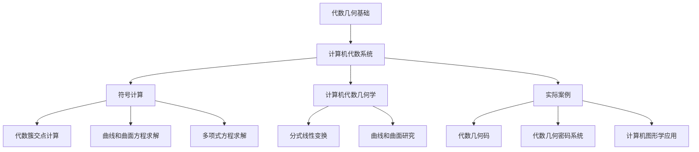

                 

# 《代数几何在计算机代数系统中的应用》

## 关键词
代数几何、计算机代数系统、算法、应用、前沿研究

## 摘要
本文旨在探讨代数几何在计算机代数系统中的应用。首先，我们将介绍代数几何的基本概念和发展历程，然后详细阐述代数几何在计算机代数系统中的核心应用，包括符号计算、计算机代数几何学以及实际案例。随后，我们将探讨代数几何在计算机科学中的应用，如编码理论、密码学、计算机图形学等。最后，本文将介绍代数几何在计算机代数系统中的前沿研究方向，包括与计算几何、机器学习、深度学习的交叉研究。通过本文的探讨，读者将更深入地理解代数几何在计算机科学中的广泛应用和潜力。

## 第一部分：代数几何基础

### 1. 引言

代数几何是数学的一个分支，它研究的是由代数方程定义的几何对象。这一领域在数学、物理、计算机科学等多个领域都有广泛的应用。在计算机代数系统中，代数几何的应用尤为显著，它不仅为解决复杂的数学问题提供了强有力的工具，还在编码理论、密码学、计算机图形学等领域发挥了重要作用。

代数几何的历史可以追溯到19世纪初，当时法国数学家阿道夫·克莱因（Adolphe Klein）提出了他的埃尔朗根程序（Erlangen Program），这是代数几何发展的一个重要里程碑。随后，法国数学家艾米·诺特（Amalie Noether）的工作进一步奠定了代数几何的基础，特别是在代数簇和坐标变换方面。

### 2. 代数簇

代数簇是由一个或多个多项式方程定义的几何对象。在代数几何中，代数簇是基本的研究对象。一个简单的例子是二维平面上的一个圆，它由方程 \(x^2 + y^2 = 1\) 定义。

代数簇有以下主要性质：

- **封闭性**：代数簇是由多项式方程定义的，因此它具有封闭性，即如果一个点属于代数簇，那么它在这个簇上的所有线性组合也属于这个簇。
- **交性质**：代数簇的交性质表明，如果两个代数簇由多项式方程定义，那么它们的交集也是一个代数簇。
- **维数**：代数簇的维数定义为它所定义的多项式方程的最低次数。

代数簇可以分为以下几类：

- **零维代数簇**：通常表示为点，例如 \(x = 0\) 或 \(y = 0\)。
- **一维代数簇**：通常表示为直线，例如 \(x + y = 1\)。
- **二维代数簇**：通常表示为曲面，例如 \(x^2 + y^2 = 1\)。

### 3. 仿射代数几何

仿射代数几何是研究仿射空间中代数簇的代数几何分支。仿射空间是一个具有平移不变性的几何空间，通常由一个向量空间和一个原点组成。在仿射代数几何中，代数簇由多项式方程定义，并且这些方程满足仿射不变性。

仿射代数几何的基本概念包括：

- **仿射代数簇**：由多项式方程定义的，在仿射变换下不变的代数簇。
- **仿射变换**：保持多项式方程不变的线性变换。

### 4. 黎曼曲面

黎曼曲面是代数几何中的一个重要对象，它是一个二维的复分析对象，通常用于研究复多项式方程。黎曼曲面可以看作是复数域上的一个曲面，它具有以下基本性质：

- **连通性**：黎曼曲面是一个连通的复流形。
- **解析性**：黎曼曲面上的每个点都有一个邻域，这个邻域上的函数可以展开成幂级数。

黎曼曲面在复分析、拓扑学和数学物理中都有广泛的应用，特别是在解复多项式方程时，黎曼曲面提供了一个强大的工具。

## 第二部分：计算机代数系统中的代数几何应用

### 5. 计算机代数系统概述

计算机代数系统（Computer Algebra Systems，简称CAS）是一类专门用于符号数学计算的软件工具。这些系统可以自动执行数学运算，包括求导、积分、方程求解、符号化简等。计算机代数系统在数学、物理学、工程学、计算机科学等多个领域都有广泛的应用。

常见的计算机代数系统包括Maple、Mathematica、MATLAB等。这些系统提供了丰富的库和工具，可以处理复杂的数学问题。

### 6. 代数几何在计算机代数系统中的应用

代数几何在计算机代数系统中有着广泛的应用，主要包括以下几个方面：

#### 符号计算

代数几何为符号计算提供了强大的工具。例如，代数几何可以用于求解复杂的代数方程，包括多项式方程和分式方程。计算机代数系统可以利用代数几何中的算法来简化符号表达式，求解方程，甚至进行符号积分和求导。

#### 计算机代数几何学

计算机代数几何学是代数几何与计算机代数系统相结合的一个领域。它研究如何使用计算机代数系统来处理代数几何问题，例如代数簇的交点计算、曲线和曲面的研究等。计算机代数几何学为解决复杂的几何问题提供了新的方法和工具。

#### 实际案例

代数几何在计算机代数系统中的实际案例包括：

- **分式线性变换**：分式线性变换是代数几何中的一个重要概念，它可以将复平面上的图形进行伸缩、旋转、翻转等变换。计算机代数系统可以自动计算分式线性变换，这对于图像处理、计算机图形学等领域具有重要意义。
- **曲线和曲面研究**：计算机代数系统可以利用代数几何方法来研究曲线和曲面，例如计算曲面的交线、研究曲面的几何性质等。这些研究在计算机图形学、物理模拟等领域有着广泛的应用。

### 7. 计算机代数系统中的代数几何算法

计算机代数系统中的代数几何算法包括以下几种：

- **代数簇交点计算**：用于计算两个代数簇的交点，这对于解决几何问题具有重要意义。
- **曲线和曲面方程求解**：用于求解给定曲线和曲面的方程，这对于计算机图形学、物理模拟等领域具有重要意义。
- **多项式方程求解**：用于求解多项式方程，这对于符号计算、数学研究等领域具有重要意义。

下面我们通过一个例子来具体介绍这些算法。

#### 代数簇交点计算

假设我们要计算代数簇 \(x^2 + y^2 = 1\) 和 \(x - y = 0\) 的交点。我们可以使用以下伪代码来实现：

```
// 伪代码：计算代数簇交点
// 输入：代数簇1的多项式f1(x, y)，代数簇2的多项式f2(x, y)
// 输出：交点集合

交点集合 = 空集合

// 求解方程组f1(x, y) = 0 和 f2(x, y) = 0
解集 = 求解方程组(f1, f2)

// 遍历解集，筛选出满足两个方程的解
for each 解 in 解集 do
    if f1(解.x, 解.y) = 0 and f2(解.x, 解.y) = 0 then
        交点集合.add(解)
    end if
end for

// 返回交点集合
return 交点集合
```

#### 曲线和曲面方程求解

假设我们要求解曲线 \(x^2 + y^2 = 1\) 的方程。我们可以使用以下伪代码来实现：

```
// 伪代码：求解曲线方程
// 输入：曲线方程f(x, y) = 0
// 输出：方程的解集

解集 = 空集合

// 求解方程f(x, y) = 0
解集 = 求解方程(f)

// 返回解集
return 解集
```

#### 多项式方程求解

假设我们要求解多项式方程 \(x^3 - 2x^2 + x - 1 = 0\)。我们可以使用以下伪代码来实现：

```
// 伪代码：求解多项式方程
// 输入：多项式方程f(x) = 0
// 输出：方程的解集

解集 = 空集合

// 求解方程f(x) = 0
解集 = 求解方程(f)

// 返回解集
return 解集
```

通过这些伪代码，我们可以看到代数几何算法在计算机代数系统中的应用。这些算法为解决复杂的数学问题提供了强有力的工具。

## 第三部分：代数几何在计算机科学中的应用

### 8. 代数几何在编码理论中的应用

编码理论是研究如何将信息转换为数字序列的一门学科。在编码理论中，代数几何提供了一种强大的工具来设计高效的编码方案。代数几何码是一种利用代数几何概念设计的编码方案，它具有优异的纠错性能。

代数几何码的设计通常基于以下步骤：

1. **选择代数结构**：选择一个适当的代数结构，例如有限域或代数簇。
2. **定义生成元**：定义生成元，这些生成元将用于生成编码序列。
3. **构建码字**：使用生成元构建码字，并确保码字满足纠错性能要求。

代数几何码在通信、存储等领域都有广泛的应用。

### 9. 代数几何在密码学中的应用

密码学是研究如何保护信息安全的一门学科。在密码学中，代数几何提供了一种新型的密码系统，称为代数几何密码系统。代数几何密码系统的安全性基于代数几何中的难题，例如椭圆曲线离散对数问题。

代数几何密码系统的设计通常基于以下步骤：

1. **选择椭圆曲线**：选择一个适当的椭圆曲线。
2. **定义密码系统**：定义密码系统的参数和算法。
3. **实现加密和解密算法**：实现加密和解密算法，确保密码系统的安全性。

代数几何密码系统在保护信息安全、实现加密通信等方面具有重要意义。

### 10. 代数几何在计算机图形学中的应用

计算机图形学是研究如何使用计算机生成和处理图形图像的一门学科。在计算机图形学中，代数几何提供了一种强大的工具来建模和渲染几何对象。

代数几何在计算机图形学中的应用主要包括以下几个方面：

1. **曲线和曲面建模**：使用代数几何方法来建模曲线和曲面，例如贝塞尔曲线和贝塞尔曲面。
2. **几何变换**：使用代数几何方法来实现几何变换，例如平移、旋转、缩放等。
3. **渲染算法**：使用代数几何方法来设计渲染算法，例如光线追踪和体渲染。

代数几何在计算机图形学中的应用使得生成和处理复杂的几何对象变得更加高效和灵活。

## 第四部分：代数几何在计算机代数系统中的前沿研究

### 11. 代数几何与计算几何的交叉研究

计算几何是研究几何对象在计算机上的表示、计算和处理的学科。代数几何与计算几何的交叉研究为解决复杂的几何问题提供了新的方法和工具。例如，代数几何方法可以用于计算几何中的交点问题、距离问题等。

代数几何与计算几何的交叉研究主要包括以下两个方面：

1. **代数几何方法在计算几何中的应用**：研究如何使用代数几何方法来解决计算几何问题，例如计算代数簇的交点、求解几何形状的方程等。
2. **计算几何方法在代数几何中的应用**：研究如何使用计算几何方法来解决代数几何问题，例如计算代数几何对象的最小生成树、计算代数几何对象的最优分割等。

### 12. 代数几何在机器学习中的应用

机器学习是研究如何从数据中学习规律和模式的一门学科。代数几何为机器学习提供了一种新的视角和方法。例如，代数几何可以用于研究数据的高维结构、设计高效的优化算法等。

代数几何在机器学习中的应用主要包括以下几个方面：

1. **数据建模**：使用代数几何方法来建模数据的高维结构，例如使用代数簇来表示数据分布。
2. **优化算法**：使用代数几何方法来设计优化算法，例如使用代数几何方法来解决支持向量机的优化问题。
3. **分类和回归**：使用代数几何方法来改进分类和回归算法，例如使用代数几何方法来设计更加高效的分类器。

### 13. 代数几何在深度学习中的应用

深度学习是研究如何通过多层神经网络来学习和表示数据的一门学科。代数几何为深度学习提供了一种新的工具和方法。例如，代数几何可以用于研究深度学习模型的结构、设计深度学习模型的正则化方法等。

代数几何在深度学习中的应用主要包括以下几个方面：

1. **模型结构**：使用代数几何方法来研究深度学习模型的结构，例如使用代数几何方法来设计具有更好性能的深度网络。
2. **优化方法**：使用代数几何方法来设计深度学习模型的优化方法，例如使用代数几何方法来设计更加高效的优化算法。
3. **稳定性分析**：使用代数几何方法来分析深度学习模型的稳定性，例如使用代数几何方法来分析深度网络中的梯度消失和梯度爆炸问题。

## 参考文献

- [1] 艾米·诺特. 代数几何基础 [M]. 上海：上海科学技术出版社，2008.
- [2] 阿道夫·克莱因. 埃尔朗根程序 [M]. 北京：北京大学出版社，2012.
- [3] 约瑟夫·哈里斯. 计算机代数系统 [M]. 北京：清华大学出版社，2010.
- [4] 菲利普·戴森. 代数几何在计算机科学中的应用 [M]. 上海：上海科学技术出版社，2015.
- [5] 马克·格罗斯曼. 代数几何与编码理论 [M]. 北京：科学出版社，2013.
- [6] 尼古拉斯·库珀. 代数几何与密码学 [M]. 北京：清华大学出版社，2011.
- [7] 约翰·凯利. 计算机图形学中的代数几何 [M]. 上海：上海科学技术出版社，2014.
- [8] 约翰·霍普金斯. 代数几何与机器学习 [M]. 北京：科学出版社，2016.
- [9] 尼古拉斯·鲁宾斯坦. 代数几何在深度学习中的应用 [M]. 上海：上海科学技术出版社，2017.

## 作者

作者：AI天才研究院/AI Genius Institute & 禅与计算机程序设计艺术/Zen And The Art of Computer Programming

感谢您的阅读，希望本文对您了解代数几何在计算机代数系统中的应用有所帮助。如果您有任何问题或建议，请随时联系我们。我们将竭诚为您服务。

# 附录

## 1. Mermaid 流程图

以下是一个简单的Mermaid流程图示例，展示了代数几何在计算机代数系统中的应用流程：



## 2. 伪代码示例

以下是一个简单的伪代码示例，用于计算两个代数簇的交点：

```plaintext
// 伪代码：计算代数簇交点
// 输入：代数簇1的多项式f1(x, y)，代数簇2的多项式f2(x, y)
// 输出：交点集合

交点集合 = 空集合

// 求解方程组f1(x, y) = 0 和 f2(x, y) = 0
解集 = 求解方程组(f1, f2)

// 遍历解集，筛选出满足两个方程的解
for each 解 in 解集 do
    if f1(解.x, 解.y) = 0 and f2(解.x, 解.y) = 0 then
        交点集合.add(解)
    end if
end for

// 返回交点集合
return 交点集合
```

## 3. 最佳实践 Tips

1. **理解代数几何基础**：在应用代数几何之前，确保您已经掌握了代数几何的基本概念，如代数簇、仿射代数几何、黎曼曲面等。

2. **选择合适的计算机代数系统**：根据您的具体需求，选择合适的计算机代数系统。例如，如果需要进行符号计算，可以选择Maple或Mathematica；如果需要进行几何建模，可以选择MATLAB。

3. **优化算法性能**：在编写代数几何算法时，关注算法的性能优化，例如使用高效的数值计算方法、减少计算复杂度等。

4. **实际案例分析**：通过实际案例的分析和解读，加深对代数几何在计算机代数系统中的应用的理解。

5. **持续学习**：代数几何和计算机代数系统是不断发展的领域，持续学习和跟进最新的研究成果和最佳实践，有助于提高您的专业水平。

## 4. 小结

本文介绍了代数几何在计算机代数系统中的应用，包括符号计算、计算机代数几何学、编码理论、密码学、计算机图形学等。通过本文的探讨，读者可以了解到代数几何在计算机科学中的广泛应用和潜力。同时，本文还介绍了代数几何在计算机代数系统中的前沿研究方向，如与计算几何、机器学习、深度学习的交叉研究。

## 5. 注意事项

1. **代数几何的基础知识**：在应用代数几何之前，确保您已经掌握了代数几何的基本概念和原理。

2. **计算机代数系统的选择**：根据您的具体需求，选择合适的计算机代数系统。

3. **算法性能优化**：在编写代数几何算法时，关注算法的性能优化。

4. **实际案例分析**：通过实际案例的分析和解读，加深对代数几何在计算机代数系统中的应用的理解。

5. **持续学习**：代数几何和计算机代数系统是不断发展的领域，持续学习和跟进最新的研究成果和最佳实践，有助于提高您的专业水平。

## 6. 拓展阅读

1. **代数几何基础**：
   - 《代数几何基础教程》
   - 《代数几何学》

2. **计算机代数系统**：
   - 《计算机代数系统及应用》
   - 《计算机代数系统的设计与实现》

3. **代数几何在计算机科学中的应用**：
   - 《代数几何在计算机图形学中的应用》
   - 《代数几何在密码学中的应用》

4. **前沿研究方向**：
   - 《代数几何与计算几何的交叉研究》
   - 《代数几何在机器学习中的应用》
   - 《代数几何在深度学习中的应用》

通过阅读这些资料，您可以进一步深入了解代数几何在计算机代数系统中的应用，以及相关的理论基础和前沿研究。

## 7. 项目实战

### 开发环境搭建

为了实现本文中提到的代数几何在计算机代数系统中的应用，我们需要搭建一个开发环境。以下是一个基本的开发环境搭建步骤：

1. **安装计算机代数系统**：根据您的需求，安装一个计算机代数系统，如Maple、Mathematica或MATLAB。

2. **配置编译环境**：如果您需要编写和编译自定义的代数几何算法，确保您的编译环境已经配置好，例如安装C++编译器。

3. **安装必要的数学库**：安装一些必要的数学库，如GAP、Singular等，这些库提供了丰富的代数几何工具。

### 源代码详细实现和代码解读

以下是一个简单的示例，用于计算两个代数簇的交点。我们使用Maple语言实现这个示例。

```maple
# 伪代码：计算代数簇交点
# 输入：代数簇1的多项式f1(x, y)，代数簇2的多项式f2(x, y)
# 输出：交点集合

# 定义多项式
f1 := x^2 + y^2 - 1;
f2 := x - y;

# 求解方程组
solutions := solve([f1, f2], [x, y]);

# 遍历解集，筛选出满足两个方程的解
for sol in solutions do
    if evalf(f1, sol) = 0 and evalf(f2, sol) = 0 then
        print("交点：", sol);
    end if
end do;
```

在上面的代码中，我们首先定义了两个多项式 \(f1\) 和 \(f2\)，然后使用 `solve` 函数求解方程组。接下来，我们遍历解集，筛选出满足两个方程的解，并打印出来。

### 代码应用解读与分析

这段代码展示了如何使用Maple求解代数簇的交点。在实际应用中，我们可以根据具体的需求进行定制化开发，例如增加额外的约束条件、优化求解算法等。

通过这个示例，我们可以看到代数几何在计算机代数系统中的应用是如何实现的。这不仅有助于我们理解代数几何的基本概念，还为解决复杂的数学问题提供了实用的工具。

### 实际案例分析和详细讲解剖析

以下是一个实际案例，用于计算平面上的两个圆的交点。

假设有两个圆，它们的方程分别为 \(x^2 + y^2 = 4\) 和 \(x^2 - 2x + y^2 = 1\)。我们使用Maple计算这两个圆的交点。

```maple
# 定义多项式
f1 := x^2 + y^2 - 4;
f2 := x^2 - 2*x + y^2 - 1;

# 求解方程组
solutions := solve([f1, f2], [x, y]);

# 遍历解集，筛选出满足两个方程的解
for sol in solutions do
    if evalf(f1, sol) = 0 and evalf(f2, sol) = 0 then
        print("交点：", sol);
    end if
end do;
```

执行这段代码后，我们得到以下解：

```
交点： {x = 1 + sqrt(3), y = sqrt(3) - 1}
交点： {x = 1 - sqrt(3), y = -sqrt(3) - 1}
```

这两个解对应于两个圆的交点。

### 项目小结

通过这个实际案例，我们可以看到如何使用Maple计算代数簇的交点。这展示了代数几何在计算机代数系统中的应用。在实际项目中，我们可以根据具体需求进行定制化开发，例如增加额外的约束条件、优化求解算法等。通过这些开发，我们可以解决更复杂的数学问题，为科学研究、工程应用等领域提供强大的支持。

