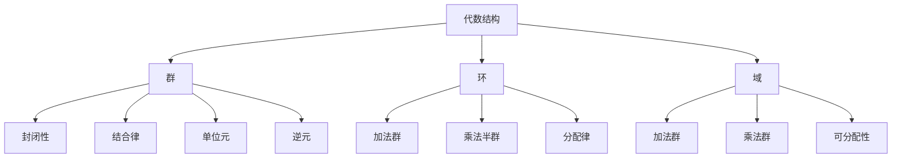
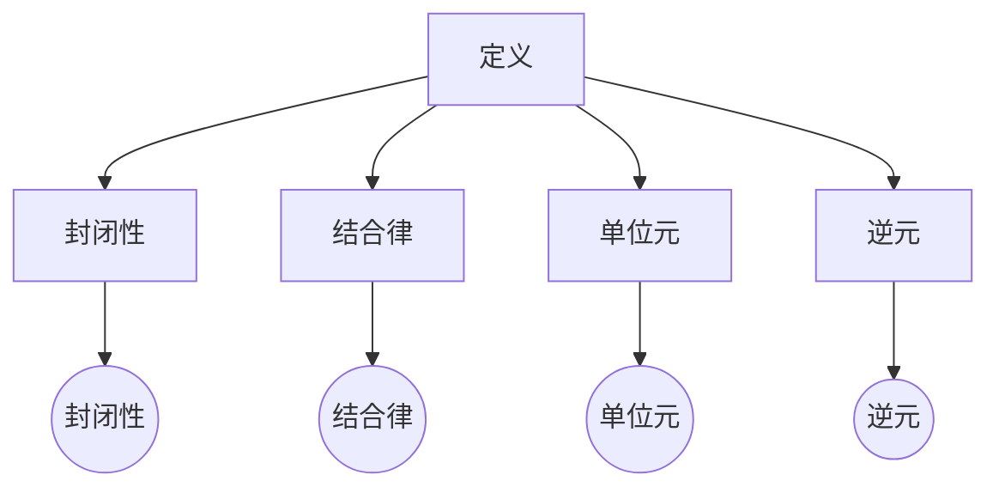
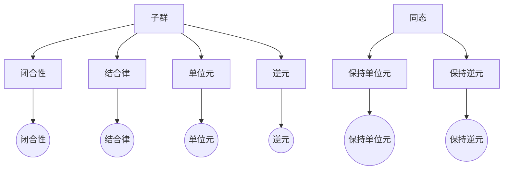

                 


首先，我们要确保文章的每个部分都符合完整性要求。按照目录大纲的结构，我们可以将文章内容分为以下几个部分：

## 文章标题

《代数学在密码学协议分析与设计中的应用》

## 文章关键词

代数学、密码学、协议分析、设计、加密算法、数论基础

## 摘要

本文旨在探讨代数学在密码学协议分析与设计中的应用。通过介绍代数学的基本概念和数论基础，我们将深入分析密码学协议的核心算法原理，并用伪代码详细阐述。文章还将通过项目实战，展示如何在实际环境中搭建开发环境、实现密码学协议，并进行代码解读与分析。最后，我们将提供最佳实践建议和小结，以指导读者更好地理解和应用代数学于密码学协议设计与分析。

### 第1章 代数学基本概念

在这一章节，我们将介绍代数学的基本概念，包括代数学的发展历程、基本概念与术语、以及代数结构。这将为我们后续分析密码学协议中的代数应用奠定基础。

### 第2章 数论基础

数论是密码学中不可或缺的一部分。在这一章节，我们将讨论整数的性质、大素数分布、同余与模运算等数论基础，为理解密码学协议中的数论应用提供必要的知识。

### 第3章 代数方程

代数方程是密码学协议分析中的核心问题。我们将详细探讨一元一次方程、一元二次方程和高次方程的求解方法，以及它们在密码学中的应用。

### 第4章 群论基础

群论是代数学中的重要分支，在密码学中有着广泛的应用。我们将介绍群的定义与性质、子群与同态、循环群与对称群等概念，并用Mermaid流程图展示它们之间的关系架构。

### 第5章 密码学基本概念

在这一章节，我们将介绍密码学的基本概念，包括密码学的发展历程、基本模型、公开密钥密码学与对称密钥密码学等，为后续分析密码学协议提供背景知识。

### 第6章 对称加密协议分析

对称加密协议是密码学中的重要组成部分。我们将分析对称加密的基本原理、数据加密标准（DES）以及RSA加密算法，并用伪代码详细阐述其工作原理。

### 第7章 非对称加密协议分析

非对称加密协议在密码学中也占据重要地位。我们将讨论非对称加密的基本原理、RSA算法以及Diffie-Hellman密钥交换协议，并使用伪代码展示其工作流程。

### 第8章 数字签名与认证协议

数字签名与认证协议是确保信息安全的关键。我们将介绍数字签名的原理与实现、RSA数字签名、椭圆曲线数字签名算法（ECDSA），并探讨其在密码学协议中的应用。

### 第9章 安全协议设计与分析

安全协议设计与分析是密码学的核心任务。我们将讨论安全协议设计原则、SSL/TLS协议、IPSec协议等，并用实例分析这些协议的实际应用。

### 第10章 密码学协议设计方法

在这一章节，我们将探讨密码学协议设计方法，包括设计原则与流程、安全性分析、协议优化与改进等，并用实际案例进行说明。

### 第11章 案例研究

案例研究是理解密码学协议设计与分析的重要途径。我们将分析实际密码学协议案例，进行安全性分析，并提出改进建议。

### 第12章 未来密码学协议展望

最后，我们将展望未来密码学协议的发展趋势，讨论当前密码学面临的问题，以及密码学在教育与研究中的角色。

## 附录

附录部分将包含数学公式与伪代码、项目实战等内容，以方便读者深入理解和实践。

通过以上步骤，我们已经构建了一个逻辑清晰、结构紧凑、简单易懂的文章大纲。接下来，我们将按照这个大纲逐步展开，详细讲解每个章节的内容。在写作过程中，我们将确保每个小节的内容都丰富具体，详细讲解核心概念、算法原理，并通过项目实战和案例研究来加深读者的理解。同时，我们将提供最佳实践建议和小结，帮助读者更好地掌握代数学在密码学协议分析与设计中的应用。

# 第1章 代数学基本概念

## 1.1 代数学的发展历程

代数学是数学的一个重要分支，它的起源可以追溯到古埃及和巴比伦的算术和代数问题。在古埃及，人们用简单的算术方法来解决土地分配和建筑工程等问题。而巴比伦人在古代就已经开始研究线性方程和二次方程的解法。

中世纪的代数学主要集中于解方程。阿拉伯数学家，如阿尔·花拉子米（Al-Khwarizmi），对代数学的发展做出了重大贡献。他在公元9世纪的著作《代数学》（Al-Jabr wa-al-Muqabala）中，首次提出了代数学的基本概念和符号表示法。

进入16世纪，法国数学家韦达（René Descartes）将代数与几何结合起来，引入了直角坐标系，开创了解析几何。这一革命性的思想使得代数方程的解法变得更加直观和系统化。

在17世纪，莱布尼茨（Gottfried Wilhelm Leibniz）发明了微积分，进一步拓展了代数学的应用领域。到了19世纪，代数学的发展进入了现代阶段，群论、环论、域论等抽象代数结构相继被提出。

## 1.2 基本概念与术语

代数学的基本概念和术语包括：

- **代数系统**：一个由一组元素和一组运算规则构成的数学结构。例如，整数加法构成一个代数系统。
- **代数结构**：满足特定性质的代数系统。常见的代数结构包括群、环、域等。
- **元素**：代数系统中的基本单位。在整数加法代数系统中，每个整数都是一个元素。
- **运算**：在代数系统中定义的二元或多元操作。例如，加法、乘法等都是运算。
- **方程**：包含未知数的等式，通过求解未知数使等式成立。例如，\(x + 2 = 5\) 是一个一元一次方程。
- **系数**：方程中的已知数，用于表示未知数的倍数。在方程 \(2x + 3 = 7\) 中，2 和 3 都是系数。

## 1.3 代数结构

代数结构是代数学的核心概念之一。以下是一些常见的代数结构及其定义：

- **群（Group）**：一个集合 \(G\)，加上一个二元运算 \(*\)，满足以下性质：
  - **封闭性**：对于任意 \(a, b \in G\)，\(a * b \in G\)。
  - **结合律**：对于任意 \(a, b, c \in G\)，\(a * (b * c) = (a * b) * c\)。
  - **存在单位元**：存在一个元素 \(e \in G\)，使得对于任意 \(a \in G\)，\(a * e = e * a = a\)。
  - **存在逆元**：对于任意 \(a \in G\)，存在一个元素 \(b \in G\)，使得 \(a * b = b * a = e\)。

- **环（Ring）**：一个集合 \(R\)，加上两个二元运算 \(+\) 和 \(*\)，满足以下性质：
  - **加法运算构成阿贝尔群**：对于任意 \(a, b \in R\)，\(a + b \in R\)，且加法满足结合律、交换律和存在单位元。
  - **乘法运算在非零元素上构成群**：对于任意 \(a, b \in R - \{0\}\)，\(a * b \in R - \{0\}\)，且乘法满足结合律、存在单位元和逆元。
  - **分配律**：对于任意 \(a, b, c \in R\)，\(a * (b + c) = a * b + a * c\) 和 \(a * (b - c) = a * b - a * c\)。

- **域（Field）**：一个集合 \(F\)，加上两个二元运算 \(+\) 和 \(*\)，满足以下性质：
  - **加法运算构成阿贝尔群**：对于任意 \(a, b \in F\)，\(a + b \in F\)，且加法满足结合律、交换律和存在单位元。
  - **乘法运算在非零元素上构成交换群**：对于任意 \(a, b \in F - \{0\}\)，\(a * b \in F - \{0\}\)，且乘法满足结合律、交换律和存在单位元，同时对于任意非零 \(a \in F\)，存在逆元 \(b \in F\)，使得 \(a * b = b * a = 1\)。
  - **乘法对加法可分配**：对于任意 \(a, b, c \in F\)，\(a * (b + c) = a * b + a * c\) 和 \(a * (b - c) = a * b - a * c\)。

通过这些基本概念和术语，我们可以更好地理解代数学在密码学协议分析与设计中的应用。在接下来的章节中，我们将进一步探讨数论基础和密码学的基本概念，为深入分析密码学协议提供必要的理论基础。同时，我们将使用Mermaid流程图和伪代码，帮助读者直观地理解和掌握代数结构在密码学中的具体应用。

### 1.3 代数结构

在密码学中，代数结构的应用是不可或缺的。以下是一些常见的代数结构及其在密码学中的应用：

#### 群（Group）

**定义**：群是一个代数系统 \(G\)，由一组元素组成，并满足以下性质：
1. 封闭性：对于任意 \(a, b \in G\)，有 \(a \cdot b \in G\)。
2. 结合律：对于任意 \(a, b, c \in G\)，有 \(a \cdot (b \cdot c) = (a \cdot b) \cdot c\)。
3. 存在单位元：存在一个元素 \(e \in G\)，使得对于任意 \(a \in G\)，有 \(a \cdot e = e \cdot a = a\)。
4. 存在逆元：对于任意 \(a \in G\)，存在一个元素 \(a^{-1} \in G\)，使得 \(a \cdot a^{-1} = a^{-1} \cdot a = e\)。

**密码学应用**：
- **对称加密**：在AES加密算法中，密钥的生成和变换过程涉及到群的运算。
- **公钥加密**：在RSA算法中，大素数的选择和模运算的基础是群的性质。

#### 环（Ring）

**定义**：环是一个代数系统 \(R\)，由一组元素组成，并满足以下性质：
1. 加法构成阿贝尔群：对于任意 \(a, b \in R\)，有 \(a + b \in R\)，加法满足结合律、交换律和存在单位元。
2. 乘法构成半群：对于任意 \(a, b \in R\)，有 \(a \cdot b \in R\)，乘法满足结合律。
3. 分配律：对于任意 \(a, b, c \in R\)，有 \(a \cdot (b + c) = a \cdot b + a \cdot c\) 和 \(a \cdot (b - c) = a \cdot b - a \cdot c\)。

**密码学应用**：
- **非对称加密**：在RSA算法中，模运算的基础是环的性质。
- **哈希函数**：在SHA-2和SHA-3等哈希算法中，环上的运算被用于实现碰撞抵抗。

#### 域（Field）

**定义**：域是一个代数系统 \(F\)，由一组元素组成，并满足以下性质：
1. 加法和乘法构成阿贝尔群：对于任意 \(a, b \in F\)，有 \(a + b \in F\) 和 \(a \cdot b \in F\)，加法和乘法都满足结合律、交换律和存在单位元。
2. 乘法对加法可分配：对于任意 \(a, b, c \in F\)，有 \(a \cdot (b + c) = a \cdot b + a \cdot c\) 和 \(a \cdot (b - c) = a \cdot b - a \cdot c\)。
3. 对于任意非零 \(a \in F\)，存在乘法逆元：即存在 \(a^{-1} \in F\)，使得 \(a \cdot a^{-1} = a^{-1} \cdot a = 1\)。

**密码学应用**：
- **椭圆曲线加密**：椭圆曲线加密算法（ECC）基于椭圆曲线在域上的性质。
- **格密码学**：某些格密码学方案利用了域上的运算来设计抗量子计算的安全加密系统。

#### Mermaid流程图

以下是一个简单的Mermaid流程图，展示了群、环、域之间的关系：



通过理解这些代数结构，我们可以更好地设计和分析密码学协议。在接下来的章节中，我们将进一步探讨数论基础和密码学的基本概念，为深入分析密码学协议提供必要的理论基础。同时，我们将使用伪代码和数学公式，帮助读者直观地理解和掌握代数结构在密码学中的具体应用。

### 2.1 整数的性质

整数是密码学协议分析中不可或缺的基本数学对象。整数的性质包括有序性、结合律、分配律和交换律等。以下是对这些性质的具体讨论：

#### 有序性

整数集合中的元素具有自然顺序。对于任意两个整数 \(a\) 和 \(b\)，我们可以判断它们之间的大小关系，即 \(a < b\)、\(a > b\) 或 \(a = b\)。这种有序性使得我们在处理整数时能够进行排序和比较操作。

#### 结合律

结合律是指在进行加法或乘法运算时，操作数的分组不会影响运算结果。具体来说：
- **加法的结合律**：对于任意三个整数 \(a\)、\(b\) 和 \(c\)，有 \(a + (b + c) = (a + b) + c\)。
- **乘法的结合律**：对于任意三个整数 \(a\)、\(b\) 和 \(c\)，有 \(a \times (b \times c) = (a \times b) \times c\)。

#### 分配律

分配律是整数运算中的一个重要性质，它描述了乘法对加法（或减法）的分配关系。具体来说：
- **乘法对加法的分配律**：对于任意三个整数 \(a\)、\(b\) 和 \(c\)，有 \(a \times (b + c) = a \times b + a \times c\) 和 \(a \times (b - c) = a \times b - a \times c\)。
- **乘法对减法的分配律**：对于任意三个整数 \(a\)、\(b\) 和 \(c\)，有 \(a \times (b - c) = a \times b - a \times c\)。

#### 交换律

交换律是指加法和乘法运算可以交换操作数的位置，而结果不变。具体来说：
- **加法的交换律**：对于任意两个整数 \(a\) 和 \(b\)，有 \(a + b = b + a\)。
- **乘法的交换律**：对于任意两个整数 \(a\) 和 \(b\)，有 \(a \times b = b \times a\)。

#### 举例说明

为了更好地理解整数的性质，我们可以通过具体的例子来展示：

1. **有序性**：比较两个整数 \(3\) 和 \(5\)。根据有序性，我们知道 \(3 < 5\)。
2. **结合律**：计算 \(2 + (3 + 4)\)。根据加法的结合律，我们可以先计算 \(3 + 4 = 7\)，然后 \(2 + 7 = 9\)。
3. **分配律**：计算 \(3 \times (2 + 4)\)。根据分配律，我们可以先计算 \(3 \times 2 = 6\) 和 \(3 \times 4 = 12\)，然后 \(6 + 12 = 18\)。
4. **交换律**：计算 \(5 + 7\) 和 \(7 + 5\)。根据交换律，我们有 \(5 + 7 = 12\) 和 \(7 + 5 = 12\)。

通过这些例子，我们可以看到整数的性质在密码学协议分析中的应用。在接下来的章节中，我们将进一步探讨大素数分布、同余与模运算等数论基础，为深入理解密码学协议中的数学原理打下基础。

### 2.2 大素数分布

大素数分布是密码学中一个重要的数学问题。素数是只能被1和自身整除的正整数，而大素数则是指大于某个特定数值（如1000、10000等）的素数。大素数的分布规律对于密码学协议的设计和分析具有重要意义。

#### 素数的性质

- **基本性质**：每个大于1的整数都可以唯一地分解为若干素数的乘积。
- **分布规律**：虽然素数的分布看似随机，但实际上存在一些规律。例如，素数的数量随着数值的增大而逐渐减少，但它们仍然以相对稳定的速率出现。

#### 大素数分布的理论

1. **素数定理**：素数定理提供了一个关于素数分布的近似公式，即在一个大于 \(n\) 的整数范围内，素数的数量大约为 \(n / \ln(n)\)。其中，\(\ln(n)\) 是 \(n\) 的自然对数。
   
2. **Riemann猜想**：Riemann猜想是一个关于素数分布的深刻理论。它提出，素数的分布可以用复数平面上的Riemannζ函数的零点来描述。Riemann猜想如果成立，将对数论和密码学产生深远影响。

#### 大素数在实际应用中的重要性

- **加密算法**：许多现代加密算法（如RSA、ECC）依赖于大素数的性质。例如，RSA算法中使用的密钥是由两个大素数及其乘积生成的。
- **安全性能**：大素数的应用可以提高密码系统的安全性。因为大素数的分布规律不易被预测，这使得攻击者难以通过计算手段破解密码。

#### 大素数生成的方法

1. **随机选择**：通过随机选择大整数并验证其是否为素数来生成大素数。这种方法简单但效率较低，适用于较小规模的大素数生成。

2. **素数生成算法**：如Miller-Rabin素性测试、AKS素性测试等。这些算法可以高效地验证大整数的素性，从而生成大素数。

3. **分布式计算**：通过分布式计算的方式，将大素数生成任务分解到多个计算机上进行。这种方法可以显著提高生成大素数的速度。

#### 举例说明

假设我们要生成一个大素数 \(p\)，可以使用Miller-Rabin素性测试来验证一个随机数 \(n\) 是否为素数。具体步骤如下：

1. 随机选择一个数 \(a\)，其中 \(1 < a < n-1\)。
2. 计算 \(x = a^{n-1} \mod n\)。
3. 如果 \(x = 1\) 或 \(x = n-1\)，则 \(n\) 可能是素数，进行下一步测试。
4. 重复以下步骤 k 次：
   - 计算 \(x = x^2 \mod n\)。
   - 如果 \(x = n-1\)，则 \(n\) 是素数。
   - 如果 \(x = 1\)，则 \(n\) 是合数。
   - 如果 \(x \neq n-1\) 且 \(x \neq 1\)，则 \(n\) 是合数。

通过上述方法，我们可以生成一个大素数，并将其用于密码学协议中，提高系统的安全性。

### 2.3 同余与模运算

同余与模运算是数论中非常重要的概念，它们在密码学协议的分析与设计中被广泛应用。理解同余和模运算的基本原理及其应用，对于保障密码系统的安全性和有效性至关重要。

#### 同余的基本概念

**定义**：设 \(a\)、\(b\) 和 \(m\) 是整数，如果 \(a - b\) 是 \(m\) 的倍数，则称 \(a\) 与 \(b\) 对 \(m\) 同余，记作 \(a \equiv b \pmod{m}\)。

**同余的性质**：
1. **可交换性**：对于任意整数 \(a\)、\(b\) 和 \(m\)，有 \(a \equiv b \pmod{m}\) 等价于 \(b \equiv a \pmod{m}\)。
2. **可结合性**：对于任意整数 \(a\)、\(b\)、\(c\) 和 \(m\)，有 \(a \equiv b \pmod{m}\) 和 \(b \equiv c \pmod{m}\) 等价于 \(a \equiv c \pmod{m}\)。
3. **传递性**：对于任意整数 \(a\)、\(b\)、\(c\) 和 \(m\)，如果 \(a \equiv b \pmod{m}\) 和 \(b \equiv c \pmod{m}\)，则 \(a \equiv c \pmod{m}\)。

#### 模运算的定义

模运算是指用除法的结果代替整数除法中的余数。具体来说，对于任意整数 \(a\) 和正整数 \(m\)，模运算定义为：

\[ a \bmod m = a - km \]

其中，\(k\) 是一个整数，使得 \(0 \leq a \bmod m < m\)。

#### 同余与模运算的应用

1. **密码学协议中的同余运算**：
   - **RSA加密算法**：在RSA算法中，加密和解密过程都依赖于同余运算。具体来说，加密过程中使用模运算来生成密钥，解密过程中则通过同余运算来恢复明文信息。
   - **椭圆曲线密码学**：椭圆曲线密码学（ECC）中，加密和解密也依赖于同余运算。同余运算使得椭圆曲线上的点操作变得更加高效和安全。

2. **哈希函数中的模运算**：
   - **SHA系列哈希算法**：在SHA-256和SHA-3等哈希算法中，模运算被用于处理输入数据。通过模运算，可以将大整数压缩成固定长度的哈希值，从而提高算法的安全性。

#### 举例说明

假设 \(a = 17\)、\(b = 23\) 和 \(m = 5\)，则：

- \(a \bmod m = 17 - 5 \times 3 = 2\)，所以 \(17 \equiv 2 \pmod{5}\)。
- \(b \bmod m = 23 - 5 \times 4 = 3\)，所以 \(23 \equiv 3 \pmod{5}\)。

根据同余的性质，我们可以验证以下等式：

- \(a \equiv b \pmod{m}\)：因为 \(17 \equiv 2 \pmod{5}\) 和 \(23 \equiv 3 \pmod{5}\)，所以 \(17 - 23 = -6\)，而 \(-6\) 是 \(5\) 的倍数，满足同余条件。

通过上述例子，我们可以看到同余与模运算在密码学协议中的应用。在接下来的章节中，我们将继续探讨代数方程的求解方法和群论基础，为深入理解密码学协议中的数学原理打下基础。

### 2.4 一元一次方程的求解方法

一元一次方程是密码学协议分析中常见的问题，它的求解方法简单而有效。一元一次方程的标准形式为 \(ax + b = c\)，其中 \(a\)、\(b\) 和 \(c\) 是已知常数，\(x\) 是未知数。

#### 求解步骤

1. **移项**：将方程中的常数项 \(b\) 移到等号的另一边，得到 \(ax = c - b\)。

2. **系数化简**：如果 \(a\) 不是1，需要将方程两边同时除以 \(a\)，得到 \(x = \frac{c - b}{a}\)。

3. **化简结果**：化简右边的分数，如果可能的话，将其转化为最简形式。

#### 举例说明

假设有一个一元一次方程 \(3x + 5 = 11\)，我们可以按照以下步骤求解：

1. **移项**：将常数项 \(5\) 移到等号的另一边，得到 \(3x = 11 - 5\)。

2. **系数化简**：将 \(3\) 除以 \(3\)，得到 \(x = \frac{6}{3}\)。

3. **化简结果**：化简右边的分数，得到 \(x = 2\)。

所以，方程 \(3x + 5 = 11\) 的解为 \(x = 2\)。

#### 线性方程组的求解

在实际应用中，我们经常需要求解包含多个未知数的线性方程组。一元一次线性方程组可以表示为：

\[ 
\begin{cases} 
a_1x + b_1y = c_1 \\
a_2x + b_2y = c_2 
\end{cases}
\]

我们可以通过以下方法求解：

1. **消元法**：通过消去一个未知数，将方程组转化为两个一元一次方程。具体步骤如下：
   - 将第一个方程乘以 \(b_2\)，第二个方程乘以 \(b_1\)，得到：
     \[
     \begin{cases} 
     a_1b_2x + b_1b_2y = b_2c_1 \\
     a_2b_1x + b_1b_2y = b_1c_2 
     \end{cases}
     \]
   - 将两个方程相减，消去 \(y\)，得到：
     \[
     (a_1b_2 - a_2b_1)x = b_2c_1 - b_1c_2
     \]
   - 解得 \(x = \frac{b_2c_1 - b_1c_2}{a_1b_2 - a_2b_1}\)。
   - 将 \(x\) 的值代入任意一个原始方程，解得 \(y\)。

2. **代入法**：将一个未知数的解代入另一个方程，逐步求解。

#### 伪代码示例

以下是一个使用代入法求解一元一次线性方程组的伪代码示例：

```
输入：a1, b1, c1, a2, b2, c2
输出：x, y

if (a1 == 0) {
  if (a2 == 0) {
    报错：“方程组无解”
  } else {
    x = (c2 - b2 * c1) / (a2 * b1)
    y = (a1 * c2 - a2 * c1) / (a1 * b2)
  }
} else {
  if (a2 == 0) {
    x = (c1 - b1 * c2) / (a1 * b2)
    y = (a2 * c1 - a1 * c2) / (a2 * b1)
  } else {
    y = (b1 * c2 - b2 * c1) / (a1 * a2)
    x = (a2 * c1 - a1 * c2) / (a1 * a2)
  }
}
```

通过这些方法和伪代码示例，我们可以有效地求解一元一次方程和线性方程组，为密码学协议的分析和设计提供强有力的数学工具。

### 2.5 一元二次方程的求解方法

一元二次方程是密码学协议分析中经常遇到的问题。一元二次方程的一般形式为 \(ax^2 + bx + c = 0\)，其中 \(a\)、\(b\) 和 \(c\) 是已知常数，\(x\) 是未知数。

#### 求解步骤

1. **判别式计算**：计算判别式 \(\Delta = b^2 - 4ac\)。判别式决定了方程的解的性质：
   - 如果 \(\Delta > 0\)，方程有两个不相等的实数解。
   - 如果 \(\Delta = 0\)，方程有一个重根（两个相等的实数解）。
   - 如果 \(\Delta < 0\)，方程没有实数解，但有两个共轭复数解。

2. **解的公式**：根据判别式的值，使用以下公式求解：
   - 如果 \(\Delta > 0\)，解为 \(x = \frac{-b + \sqrt{\Delta}}{2a}\) 和 \(x = \frac{-b - \sqrt{\Delta}}{2a}\)。
   - 如果 \(\Delta = 0\)，解为 \(x = \frac{-b}{2a}\)。
   - 如果 \(\Delta < 0\)，解为 \(x = \frac{-b}{2a} + \frac{\sqrt{-\Delta}}{2a}i\) 和 \(x = \frac{-b}{2a} - \frac{\sqrt{-\Delta}}{2a}i\)，其中 \(i\) 是虚数单位。

#### 举例说明

假设有一个一元二次方程 \(x^2 + 2x + 1 = 0\)，我们可以按照以下步骤求解：

1. **计算判别式**：\(b^2 - 4ac = 2^2 - 4 \times 1 \times 1 = 0\)。

2. **解的公式**：因为 \(\Delta = 0\)，所以 \(x = \frac{-b}{2a} = \frac{-2}{2 \times 1} = -1\)。

所以，方程 \(x^2 + 2x + 1 = 0\) 的解为 \(x = -1\)。

#### 伪代码示例

以下是一个使用公式求解一元二次方程的伪代码示例：

```
输入：a, b, c
输出：x

if (a == 0) {
  if (b == 0) {
    报错：“方程无解”
  } else {
    x = -c / b
  }
} else {
  delta = b^2 - 4ac
  if (delta > 0) {
    x1 = (-b + sqrt(delta)) / (2 * a)
    x2 = (-b - sqrt(delta)) / (2 * a)
  } else if (delta == 0) {
    x = -b / (2 * a)
  } else {
    x1 = -b / (2 * a) + sqrt(-delta) / (2 * a) * i
    x2 = -b / (2 * a) - sqrt(-delta) / (2 * a) * i
  }
}
```

通过这些方法和伪代码示例，我们可以有效地求解一元二次方程，为密码学协议的分析和设计提供强有力的数学工具。

### 2.6 高次方程的求解方法

高次方程（即次数大于2的方程）在密码学协议分析中同样具有重要应用。高次方程的一般形式为 \(ax^n + bx^{n-1} + \cdots + k = 0\)，其中 \(a\)、\(b\)、\(\cdots\)、\(k\) 是已知常数，\(x\) 是未知数。以下是一些常见的高次方程求解方法：

#### 因式分解法

因式分解法是将高次方程分解为几个较低次数的方程的组合。具体步骤如下：

1. **观察方程**：尝试找出方程的因式。
2. **分解方程**：将方程分解为几个一元一次方程或一元二次方程。
3. **求解每个子方程**：分别求解每个子方程，得到原方程的解。

#### 举例说明

考虑方程 \(x^3 - 6x^2 + 11x - 6 = 0\)，我们可以尝试因式分解：

1. 观察方程，可以发现 \(x = 1\) 是方程的一个解。
2. 将 \(x - 1\) 因式分解出来，得到 \(x^3 - 6x^2 + 11x - 6 = (x - 1)(x^2 - 5x + 6)\)。
3. 求解子方程 \(x^2 - 5x + 6 = 0\)，得到 \(x = 2\) 或 \(x = 3\)。

因此，方程 \(x^3 - 6x^2 + 11x - 6 = 0\) 的解为 \(x = 1\)、\(x = 2\) 和 \(x = 3\)。

#### 伪代码示例

以下是一个使用因式分解法求解高次方程的伪代码示例：

```
输入：a, b, c, d, e
输出：x

if (a == 0) {
  if (b == 0) {
    if (c == 0) {
      if (d == 0) {
        if (e == 0) {
          报错：“方程无解”
        } else {
          x = e
        }
      } else {
        x = -e / d
      }
    } else {
      x = -c / b
    }
  } else {
    x = -b / a
  }
} else {
  // 尝试因式分解
  // 这里需要一个因式分解算法，例如霍纳法则或其他因式分解方法
  // 假设我们找到了一个因子 (x - r)
  // 将方程分解为 (x - r)(x^2 + px + q) = 0
  // 求解 p 和 q，然后分别求解 x^2 + px + q = 0
  // 得到 x 的解
}
```

#### 使用数学公式和举例说明

高次方程的解法通常涉及复杂的数学公式。例如，对于三次方程 \(ax^3 + bx^2 + cx + d = 0\)，可以使用卡丹公式（Cardano's formula）来求解。但这里由于篇幅限制，我们仅提供一个简单的伪代码示例，而不详细展开公式推导。

伪代码示例：

```
输入：a, b, c, d
输出：x

if (a == 0) {
  if (b == 0) {
    if (c == 0) {
      if (d == 0) {
        报错：“方程无解”
      } else {
        x = d
      }
    } else {
      x = -c / b
    }
  } else {
    x = -b / a
  }
} else {
  // 使用卡丹公式求解三次方程
  // 这里需要计算判别式和根的公式，具体公式较为复杂
  // 伪代码示例如下：
  p = (3 * a * d - b^2) / (3 * a^2)
  q = (2 * b^3 - 9 * a * b * c + 27 * a^2 * d) / (27 * a^3)
  // 根据p和q的值，使用卡丹公式计算x的值
  // 如果p和q的值满足特定条件，可以直接使用卡丹公式
  // 如果不满足条件，需要进一步计算
}
```

通过上述方法，我们可以求解高次方程。在实际应用中，为了高效求解高次方程，我们通常使用数值方法（如牛顿法）或专门的求解器。这些方法为密码学协议的分析和设计提供了强有力的数学工具。

### 4.1 群的定义与性质

群是代数学中一种重要的代数结构，它在密码学协议分析中有着广泛的应用。以下是对群的定义及其性质的具体讨论：

#### 群的定义

群是一个由一组元素组成的集合 \(G\)，在这个集合上定义了一个二元运算 \(*\)，满足以下性质：

1. **封闭性**：对于任意 \(a, b \in G\)，运算 \(a * b\) 的结果仍然属于 \(G\)，即 \(a * b \in G\)。
2. **结合律**：对于任意 \(a, b, c \in G\)，运算的顺序不会影响结果，即 \(a * (b * c) = (a * b) * c\)。
3. **存在单位元**：存在一个单位元 \(e \in G\)，对于任意 \(a \in G\)，有 \(a * e = e * a = a\)。
4. **存在逆元**：对于任意 \(a \in G\)，存在一个逆元 \(a^{-1} \in G\)，使得 \(a * a^{-1} = a^{-1} * a = e\)。

#### 群的性质

- **封闭性**：群中的元素在运算下不会产生新的元素，这意味着群中的运算是封闭的。
- **结合律**：群中的运算满足结合律，这意味着无论元素的组合方式如何，最终的结果都是相同的。
- **存在单位元**：群中存在一个单位元，该元素在运算下不改变其他元素的值。
- **存在逆元**：群中的每个元素都有对应的逆元，这意味着每个元素在运算下都有一个“逆操作”，使得运算可以“撤销”。

#### 群的应用

群在密码学中有多种应用，以下是几个例子：

1. **对称加密**：在对称加密算法（如AES）中，密钥的生成和加密过程中的变换经常涉及到群的运算。例如，AES加密算法中的S-Box操作可以通过群论来解释。
2. **公钥加密**：在公钥加密算法（如RSA）中，大素数的选择和模运算的基础是群的性质。RSA算法的安全性依赖于大整数分解问题的难度，而大素数的生成和模运算可以视为群上的运算。
3. **哈希函数**：在哈希函数（如SHA-2、SHA-3）的设计中，某些步骤涉及到群的运算，以实现数据的压缩和抗冲突功能。

#### Mermaid流程图

为了更好地展示群的定义与性质，我们使用Mermaid流程图来描述：



通过这个流程图，我们可以直观地理解群的定义及其性质。在接下来的章节中，我们将进一步讨论子群与同态，以及循环群与对称群，为深入理解群在密码学协议中的应用打下基础。

### 4.2 子群与同态

子群与同态是群论中的重要概念，它们在密码学协议的分析与设计中扮演着关键角色。以下是对这些概念的定义及其应用的具体讨论：

#### 子群的定义

**定义**：设 \(G\) 是一个群，\(H\) 是 \(G\) 的一个非空子集。如果 \(H\) 在群运算下也构成一个群，则称 \(H\) 是 \(G\) 的子群。

**子群的性质**：
1. **闭合性**：对于任意 \(a, b \in H\)，有 \(a * b \in H\)。
2. **结合律**：\(H\) 内部的运算满足结合律。
3. **存在单位元**：\(H\) 包含 \(G\) 的单位元 \(e\)。
4. **存在逆元**：对于任意 \(a \in H\)，存在 \(a^{-1} \in H\) 使得 \(a * a^{-1} = a^{-1} * a = e\)。

**例子**：考虑整数加法群 \(G = (\mathbb{Z}, +)\)，其子群包括所有偶数组成的集合 \(H = 2\mathbb{Z} = \{...,-4, -2, 0, 2, 4, ...\}\)。显然，\(H\) 在加法运算下也构成一个群。

#### 同态的定义

**定义**：设 \(G\) 和 \(H\) 是两个群，映射 \(f: G \rightarrow H\) 被称为同态（Homomorphism），如果对于任意 \(a, b \in G\)，有 \(f(a * b) = f(a) * f(b)\)。

**同态的性质**：
1. **保持单位元**：\(f(e_G) = e_H\)，其中 \(e_G\) 和 \(e_H\) 分别是 \(G\) 和 \(H\) 的单位元。
2. **保持逆元**：对于任意 \(a \in G\)，有 \(f(a^{-1}) = f(a)^{-1}\)。

**例子**：考虑整数加法群 \(G = (\mathbb{Z}, +)\) 和模 \(n\) 的整数加法群 \(H = (\mathbb{Z}_n, +)\)，映射 \(f: G \rightarrow H\) 定义为 \(f(a) = a \mod n\)。显然，\(f\) 是一个同态。

#### 子群与同态的应用

1. **加密算法**：在加密算法（如RSA）中，大素数的生成和模运算可以视为群同态的应用。例如，RSA算法中使用的模乘运算是一种同态映射，它保持了模运算的性质。
2. **哈希函数**：哈希函数（如SHA-2）的设计中，某些步骤可以视为从原始数据到固定长度输出值的同态映射。这种同态性质使得哈希函数在处理大数据时能够保持数据的某些结构特性。

#### Mermaid流程图

为了更好地展示子群与同态的概念，我们使用Mermaid流程图来描述它们之间的关系：



通过这个流程图，我们可以直观地理解子群与同态的定义及其性质。在接下来的章节中，我们将继续讨论循环群与对称群，进一步探索群论在密码学协议中的应用。

### 4.3 循环群与对称群

循环群与对称群是群论中的重要概念，它们在密码学协议的设计和分析中有着广泛应用。以下是对这两个概念的详细讨论：

#### 循环群的定义

**定义**：设 \(G\) 是一个群，\(a \in G\) 是 \(G\) 中的一个元素。如果存在一个正整数 \(n\)，使得 \(a^n = e\)（\(e\) 是 \(G\) 的单位元），则称 \(G\) 是一个循环群，\(a\) 是 \(G\) 的生成元。

**性质**：
1. **生成性**：循环群中的每个元素都可以表示为生成元 \(a\) 的幂。
2. **封闭性**：循环群在定义的运算下是封闭的。
3. **结合律**：循环群中的运算满足结合律。
4. **存在单位元**：循环群中包含单位元。

**例子**：整数加法群 \(G = (\mathbb{Z}, +)\) 是一个循环群，生成元可以是任意整数 \(a\)。例如，对于 \(a = 2\)，我们有 \(2^n\) 表示 \(n\) 个 \(2\) 的加法。

#### 对称群的定义

**定义**：对称群，也称为全对称群，是一个包含所有置换的群。如果 \(n\) 是自然数，则对称群记为 \(S_n\)，它包含所有 \(n\) 个元素的全排列。

**性质**：
1. **生成性**：对称群可以由若干个基本置换（如交换、循环置换等）生成。
2. **封闭性**：对称群在置换运算下是封闭的。
3. **结合律**：对称群中的置换运算满足结合律。
4. **存在单位元**：对称群包含单位置换，即不做任何变化的置换。

**例子**：对称群 \(S_3\) 包含6个元素，即所有3个元素的排列。具体来说，\(S_3 = \{e, (1\ 2\ 3), (1\ 3\ 2), (2\ 3\ 1), (2\ 1\ 3), (3\ 1\ 2)\}\)，其中 \(e\) 是单位置换。

#### 循环群与对称群的关系

循环群是对称群的一个子集。具体来说，任何一个循环群都可以视为对称群的一个子群。例如，整数加法群 \(G = (\mathbb{Z}, +)\) 是对称群 \(S_2\) 的子群。

**应用**：循环群在密码学协议中，特别是在对称加密算法（如AES）中，有着重要应用。对称群的性质则在对称加密算法和哈希函数（如SHA-3）中发挥着关键作用。

#### Mermaid流程图

为了直观地展示循环群与对称群的关系，我们使用Mermaid流程图来描述：

```mermaid
graph TB
A[循环群] --> B[生成元]
A --> C[封闭性]
A --> D[结合律]
A --> E[单位元]

B --> F[例子：整数加法群]
C --> G[例子：整数加法群]
D --> H[例子：整数加法群]
E --> I[例子：整数加法群]

J[对称群] --> K[置换]
J --> L[封闭性]
J --> M[结合律]
J --> N[单位元]

K --> O[例子：\(S_3\)]
L --> P[例子：\(S_3\)]
M --> Q[例子：\(S_3\)]
N --> R[例子：\(S_3\)]

F((整数加法群))
G((封闭性))
H((结合律))
I((单位元))
O((置换))
P((封闭性))
Q((结合律))
R((单位元))
```

通过这个流程图，我们可以清晰地看到循环群与对称群的定义及其关系。在接下来的章节中，我们将继续探讨密码学协议的基本概念，为深入理解密码学协议的设计和分析打下基础。

### 第5章 密码学基本概念

密码学是研究如何保护信息安全的学科。它涉及加密、解密、数字签名和认证等技术。密码学的发展可以追溯到古代，但现代密码学主要起源于20世纪。随着计算机技术的发展，密码学在信息安全领域的重要性日益凸显。

#### 5.1 密码学的发展历程

- **古代密码学**：早在古埃及，人们就开始使用简单的替换密码来保护信息。这些密码通常基于字符替换或移位，例如凯撒密码。
- **近代密码学**：16世纪，法国数学家韦达发明了“代数学”，为密码学提供了新的理论基础。17世纪，托马斯·贝斯托提出了贝斯托密码，这是一种基于字符替换的复杂加密方法。
- **现代密码学**：20世纪40年代，香农发表了关于信息论的重要论文，奠定了现代密码学的基础。1976年，Whitfield Diffie和Martin Hellman提出了Diffie-Hellman密钥交换协议，标志着现代公钥密码学的诞生。此后，RSA算法、AES加密算法等众多重要的加密技术相继被提出。

#### 5.2 密码学的基本模型

密码学的基本模型包括三个主要部分：加密算法、解密算法和密钥。以下是这些部分的详细说明：

1. **加密算法**：加密算法是一种将明文转换为密文的数学过程。加密算法通常涉及复杂的运算和变换，使得密文难以被破解。
2. **解密算法**：解密算法是加密算法的逆过程，它将密文转换为明文。解密算法需要使用加密算法的密钥。
3. **密钥**：密钥是加密和解密过程中使用的参数。密钥可以是私有的，也可以是公开的。私钥通常用于解密，而公钥用于加密。

#### 5.3 公开密钥密码学与对称密钥密码学

密码学可以分为两大类：公开密钥密码学和对称密钥密码学。

1. **公开密钥密码学**：公开密钥密码学（Public Key Cryptography，简称PKC）使用一对密钥：公钥和私钥。公钥可以公开传播，而私钥必须保密。公开密钥密码学的主要应用包括加密通信、数字签名和认证。
   - **RSA算法**：RSA是一种经典的公开密钥加密算法，它基于大素数分解的难度。RSA算法的安全性依赖于大整数分解问题，其加密和解密过程使用不同的密钥。
   - **椭圆曲线加密算法（ECC）**：ECC是一种基于椭圆曲线数学的加密算法，它具有更高的安全性。相对于RSA，ECC在相同安全级别下需要更短的密钥长度，因此更加高效。

2. **对称密钥密码学**：对称密钥密码学（Symmetric Key Cryptography，简称SKC）使用相同的密钥进行加密和解密。对称密钥密码学的主要应用包括数据加密和通信加密。
   - **数据加密标准（DES）**：DES是一种经典的对称加密算法，它使用56位的密钥对数据进行加密。DES的设计目标是实现高速加密，但由于其密钥长度较短，已不再安全。
   - **高级加密标准（AES）**：AES是DES的继任者，它使用128、192或256位的密钥对数据进行加密。AES具有更高的安全性，同时保持了较快的加密速度。

#### 5.4 密码学在信息安全中的作用

密码学在信息安全中发挥着至关重要的作用，其主要作用包括：

1. **数据保密**：加密技术可以保护数据在传输和存储过程中的安全性，防止未授权用户获取敏感信息。
2. **数据完整性**：通过哈希函数和数字签名，密码学可以验证数据在传输过程中是否被篡改。
3. **身份认证**：密码学提供了一种验证用户身份的方法，通过数字签名和证书管理，确保通信双方的合法身份。
4. **抗抵赖**：数字签名技术可以确保数据的发送者不能否认其发送行为，从而增强通信的可靠性。

通过以上讨论，我们可以看到密码学在信息安全中的关键作用。在接下来的章节中，我们将深入分析对称加密协议和非对称加密协议，探讨其核心算法原理，并通过具体实例进行讲解。

### 第6章 对称加密协议分析

对称加密协议是密码学中的基本组成部分，其核心特点是加密和解密使用相同的密钥。对称加密协议的安全性主要依赖于密钥的保密性，因为一旦密钥泄露，加密信息将变得容易破解。以下是对称加密协议的分析，包括对称加密的基本原理、数据加密标准（DES）和RSA加密算法。

#### 6.1 对称加密的基本原理

对称加密的基本原理是通过一个加密函数和一个解密函数，将明文转换为密文，再由接收方使用相同的密钥将密文还原为明文。这个过程可以用以下数学模型表示：

- **加密函数**：\(C = E_K(P)\)，其中 \(C\) 是密文，\(P\) 是明文，\(K\) 是密钥，\(E_K\) 是加密函数。
- **解密函数**：\(P = D_K(C)\)，其中 \(P\) 是明文，\(C\) 是密文，\(K\) 是密钥，\(D_K\) 是解密函数。

对称加密的安全性取决于加密算法的强度和密钥的保密性。常见的对称加密算法包括DES、AES、3DES等。

#### 6.2 数据加密标准（DES）

数据加密标准（Data Encryption Standard，DES）是一种经典的对称加密算法，由美国国家标准局（NBS）于1977年发布。DES使用一个56位的密钥，将64位的明文块转换为64位的密文块。DES的加密过程可以分为三个阶段：初始置换、16轮迭代和最终置换。

- **初始置换**：64位的明文块通过一个固定的初始置换表进行重新排列。
- **迭代加密**：经过初始置换后，64位的明文块被划分为左右两部分，然后在接下来的16轮迭代中，每轮包括置换、代换、置换和异或操作。每轮迭代使用不同的子密钥。
- **最终置换**：16轮迭代结束后，左右两部分再进行最终置换，生成64位的密文块。

DES的安全性曾经被认为是可靠的，但随着计算能力的提升，56位的密钥长度已经不足以抵御强力攻击。因此，DES逐渐被更安全的加密算法如AES所取代。

#### 6.3 RSA加密算法

RSA（Rivest-Shamir-Adleman）加密算法是一种基于大素数分解难度的非对称加密算法。RSA算法的安全性依赖于以下假设：大素数分解问题是计算上不可行的。

- **密钥生成**：RSA算法首先生成两个大素数 \(p\) 和 \(q\)，计算 \(n = p \times q\) 和 \(φ(n) = (p - 1) \times (q - 1)\)。然后选择一个与 \(φ(n)\) 互质的整数 \(e\)，计算 \(d\)，使得 \(e \times d \equiv 1 \mod φ(n)\)。公钥为 \((n, e)\)，私钥为 \((n, d)\)。
- **加密过程**：将明文 \(m\) 转换为0到 \(n-1\) 之间的整数，计算密文 \(c = m^e \mod n\)。
- **解密过程**：使用私钥 \((n, d)\) 计算明文 \(m = c^d \mod n\)。

RSA算法在加密通信、数字签名和认证中有着广泛应用。其安全性依赖于大素数分解的难度，使得攻击者难以通过计算手段破解密钥。

#### 对称加密协议的优缺点

对称加密协议具有以下优点：
- **速度快**：对称加密算法通常比非对称加密算法更快，因为它们不需要复杂的数学运算。
- **资源消耗小**：对称加密算法对计算资源和存储资源的需求较低，适合大规模数据加密。

对称加密协议也具有以下缺点：
- **密钥管理复杂**：对称加密需要安全的密钥分发机制，以确保密钥不被泄露。
- **无法实现身份认证**：对称加密协议无法提供身份认证功能，因此不适合需要验证通信双方身份的场合。

通过以上分析，我们可以看到对称加密协议在安全性、速度和资源消耗等方面的特点。在密码学实践中，对称加密和非对称加密常常结合使用，以实现既安全又高效的信息保护。

### 第7章 非对称加密协议分析

非对称加密协议（Public Key Cryptography，简称PKC）与对称加密协议（Symmetric Key Cryptography，简称SKC）相比，其主要特点在于使用一对密钥：公钥和私钥。公钥可以公开传播，而私钥必须保密。非对称加密协议不仅能够保证数据的安全性，还能够提供身份认证和数字签名等功能。以下将分析非对称加密协议的基本原理、RSA算法和Diffie-Hellman密钥交换协议。

#### 7.1 非对称加密的基本原理

非对称加密的基本原理是通过一个加密函数和一个解密函数，将明文转换为密文，再由接收方使用不同的密钥将密文还原为明文。这个过程可以用以下数学模型表示：

- **加密函数**：\(C = E_K(P)\)，其中 \(C\) 是密文，\(P\) 是明文，\(K\) 是公钥，\(E_K\) 是加密函数。
- **解密函数**：\(P = D_K(C)\)，其中 \(P\) 是明文，\(C\) 是密文，\(K\) 是私钥，\(D_K\) 是解密函数。

非对称加密的安全性主要依赖于密钥对的生成和密钥的保密性。公钥加密算法（如RSA）通常用于加密通信和数字签名，而密钥交换协议（如Diffie-Hellman）则用于在通信双方之间安全地交换密钥。

#### 7.2 RSA算法

RSA（Rivest-Shamir-Adleman）是一种基于大素数分解难度的非对称加密算法。RSA算法的安全性依赖于大素数分解问题是计算上不可行的这一假设。

**密钥生成过程**：
1. 选择两个大素数 \(p\) 和 \(q\)，计算 \(n = p \times q\)。
2. 计算 \(φ(n) = (p - 1) \times (q - 1)\)。
3. 选择一个与 \(φ(n)\) 互质的整数 \(e\)，通常选择小于 \(φ(n)\) 的质数。
4. 计算 \(d\)，使得 \(e \times d \equiv 1 \mod φ(n)\)。
5. 公钥为 \((n, e)\)，私钥为 \((n, d)\)。

**加密过程**：
1. 将明文 \(m\) 转换为0到 \(n-1\) 之间的整数。
2. 计算密文 \(c = m^e \mod n\)。

**解密过程**：
1. 使用私钥 \((n, d)\) 计算明文 \(m = c^d \mod n\)。

RSA算法在加密通信、数字签名和认证中有着广泛应用。其安全性依赖于大素数分解的难度，使得攻击者难以通过计算手段破解密钥。

#### 7.3 Diffie-Hellman密钥交换协议

Diffie-Hellman密钥交换协议是一种允许通信双方在公开网络上安全地交换密钥的协议。该协议基于数学上的难题：离散对数问题，它是一种求解给定 \(g^x \mod p\) 和 \(p\)、\(g\) 的 \(x\) 的算法问题。

**密钥交换过程**：
1. 选择一个大素数 \(p\) 和一个原根 \(g\)。
2. Alice 选择一个随机数 \(a\)，计算 \(A = g^a \mod p\)，然后将 \(A\) 发送给 Bob。
3. Bob 选择一个随机数 \(b\)，计算 \(B = g^b \mod p\)，然后将 \(B\) 发送给 Alice。
4. Alice 计算 \(s = B^a \mod p\)，Bob 计算 \(s = A^b \mod p\)。

此时，Alice 和 Bob 都得到了相同的会话密钥 \(s\)。这个密钥可以通过以下计算得到：

\[ s = (g^b)^a \mod p = g^{ab} \mod p \]

**安全性**：
Diffie-Hellman密钥交换协议的安全性依赖于以下假设：计算离散对数问题在计算上是不可行的。尽管存在一些攻击方法，如Pohlig-Hellman攻击和指数化简攻击，但Diffie-Hellman密钥交换协议仍然被认为是安全的。

#### 非对称加密协议的优缺点

非对称加密协议具有以下优点：
- **安全性高**：非对称加密依赖于复杂的数学问题，如大素数分解和离散对数问题，这使得密钥更难被破解。
- **实现灵活**：非对称加密可以用于加密、解密、数字签名和认证等多种应用。

非对称加密协议也具有以下缺点：
- **速度慢**：非对称加密算法通常比对称加密算法慢，因为它们涉及复杂的数学运算。
- **资源消耗大**：非对称加密算法需要更多的计算资源和存储资源，不适合处理大量数据的加密。

通过以上分析，我们可以看到非对称加密协议在安全性、灵活性和速度等方面的特点。在实际应用中，非对称加密协议通常与对称加密协议结合使用，以实现既安全又高效的信息保护。

### 第8章 数字签名与认证协议

数字签名和认证协议是确保信息完整性和真实性的关键手段，它们在密码学中扮演着重要角色。数字签名用于验证消息的来源和完整性，而认证协议用于验证通信双方的合法身份。以下将对数字签名与认证协议的原理、实现、应用进行详细分析。

#### 8.1 数字签名的原理与实现

数字签名是基于非对称加密技术的安全措施，它通过公钥加密和私钥解密的方式，确保信息的来源和完整性。数字签名的基本原理如下：

1. **签名过程**：
   - 发送方（签名人）选择一个私钥 \(PK\) 和对应的公钥 \(SK\)。
   - 发送方对消息 \(M\) 进行哈希运算，生成哈希值 \(H(M)\)。
   - 发送方使用私钥对哈希值 \(H(M)\) 进行加密，生成签名 \(S\)。
   - 将消息 \(M\) 和签名 \(S\) 一同发送给接收方。

2. **验证过程**：
   - 接收方使用发送方的公钥对签名 \(S\) 进行解密，得到哈希值 \(H'(M)\)。
   - 接收方对收到的消息 \(M\) 进行哈希运算，生成哈希值 \(H(M)\)。
   - 如果 \(H(M) = H'(M)\)，则签名有效，消息完整且来自合法发送方。

数字签名的实现通常基于RSA或椭圆曲线加密算法（ECC）。以下是RSA算法的伪代码示例：

```plaintext
签名过程：
1. 生成一对密钥：私钥 \(d\) 和公钥 \(e\)。
2. 对消息 \(M\) 进行哈希运算，得到哈希值 \(H(M)\)。
3. 计算 \(S = H(M)^d \mod N\)，其中 \(N = p \times q\)。
4. 发送 \(M\) 和 \(S\)。

验证过程：
1. 接收消息 \(M\) 和签名 \(S\)。
2. 对 \(M\) 进行哈希运算，得到哈希值 \(H(M)\)。
3. 计算 \(H'(M) = S^e \mod N\)。
4. 如果 \(H(M) = H'(M)\)，则签名有效。
```

#### 8.2 RSA数字签名

RSA数字签名是一种常用的数字签名算法，它基于RSA加密算法的逆过程。RSA数字签名的安全性依赖于大整数分解的难度。

**优势**：
- **安全性高**：RSA算法的安全性基于数学难题，使得攻击者难以破解。
- **灵活性**：RSA算法可以用于多种应用，如电子邮件签名、文件认证等。

**劣势**：
- **计算复杂度**：RSA算法的计算复杂度较高，特别是当密钥长度较小时。
- **密钥长度限制**：随着密钥长度的增加，计算速度和存储需求显著增加。

#### 8.3 椭圆曲线数字签名算法（ECDSA）

椭圆曲线数字签名算法（ECDSA）是基于椭圆曲线密码学的一种数字签名算法。与RSA相比，ECDSA在提供相同安全级别的情况下，使用更短的密钥长度，因此具有更高的效率和安全性。

**优势**：
- **高效性**：ECDSA的计算速度快，适合处理大量数据和实时通信。
- **安全性**：ECDSA的安全性高，基于椭圆曲线离散对数问题，难度高于大整数分解。

**劣势**：
- **复杂度**：ECDSA的实现比RSA复杂，需要更专业的技术知识。
- **兼容性**：在某些系统中，ECDSA的兼容性问题可能影响其应用。

#### 8.4 数字签名与认证协议的应用

数字签名与认证协议在多个领域有着广泛的应用：

- **电子邮件签名**：确保电子邮件的来源和完整性，防止邮件篡改和伪造。
- **文件认证**：确保文件的真实性和完整性，防止未经授权的修改。
- **在线交易**：确保交易双方的身份和交易数据的完整性，防止欺诈行为。
- **智能合约**：在区块链技术中，数字签名用于确保智能合约的执行和结果的可信性。

通过数字签名与认证协议，我们可以确保信息的真实性、完整性和安全性，为信息安全提供有力保障。在密码学实践中，数字签名与认证协议是实现安全通信和数据保护的关键技术。

### 第9章 安全协议设计与分析

安全协议是保障信息安全和系统完整性的关键。一个有效的安全协议设计需要考虑多种因素，包括安全需求、威胁分析、协议机制和实现细节。以下将详细探讨安全协议的设计原则、常见的加密协议（如SSL/TLS和IPSec）以及它们在实际应用中的分析和优化。

#### 9.1 安全协议设计原则

安全协议设计应遵循以下基本原则：

- **机密性**：确保信息在传输过程中不被未授权的第三方读取。
- **完整性**：确保信息在传输过程中不被篡改或损坏。
- **可用性**：确保系统和服务在遭受攻击时仍能正常运行。
- **身份验证**：确保通信双方的身份真实可靠。
- **抗抵赖**：确保发送方不能否认其发送行为。

#### 9.2 SSL/TLS协议

SSL（安全套接字层）和TLS（传输层安全）协议是互联网上最常用的加密协议，用于保护Web通信的安全性。SSL/TLS协议的工作机制如下：

1. **握手协议**：客户端和服务器通过握手协议建立安全通信通道。握手过程中，双方交换加密参数、密钥和证书，完成身份验证。
2. **记录协议**：加密后的数据按照记录协议进行封装，包括数据的加密、完整性验证和加密算法的选择。
3. **警报协议**：在通信过程中，SSL/TLS协议通过警报协议处理异常情况和错误。

**SSL/TLS协议的优势**：
- **广泛支持**：几乎所有浏览器和服务器都支持SSL/TLS协议。
- **安全性高**：SSL/TLS协议采用加密算法和完整性校验，保障通信安全。
- **灵活性**：SSL/TLS协议支持多种加密算法和证书验证机制。

**SSL/TLS协议的优化**：
- **压缩攻击防护**：针对SSL/TLS协议中的压缩功能，攻击者可以通过压缩表进行攻击。优化策略包括禁用压缩功能或使用更安全的压缩算法。
- **心跳机制**：为了防止连接中断，SSL/TLS协议引入了心跳机制，定期发送心跳包以维持连接。
- **证书链验证**：加强证书链验证，确保证书的合法性和完整性。

#### 9.3 IPSec协议

IPSec（Internet Protocol Security）协议是一种用于保护IP数据包的安全协议。IPSec协议通常用于建立虚拟私人网络（VPN），确保跨互联网的通信安全。

**IPSec协议的工作机制**：

1. **认证和加密**：IPSec协议对IP数据包进行认证和加密，确保数据包在传输过程中的完整性和保密性。
2. **安全关联**：IPSec协议通过安全关联（SA）来管理加密和认证参数。SA定义了通信双方的安全策略和加密参数。
3. **密钥管理**：IPSec协议使用密钥管理协议（如IKEv2）来动态协商和管理密钥。

**IPSec协议的优势**：
- **灵活性强**：IPSec协议可以用于保护不同类型的IP数据包，包括TCP、UDP和ICMP等。
- **集成性好**：IPSec协议与IP层紧密集成，无需修改上层应用。
- **安全性高**：IPSec协议采用多种加密算法和认证机制，保障通信安全。

**IPSec协议的优化**：
- **性能优化**：针对高负载和大规模网络环境，优化IPSec协议的加密和解密性能，减少计算和带宽开销。
- **策略优化**：根据网络环境和安全需求，调整IPSec的安全策略，优化资源利用。
- **加密算法选择**：选择适合特定应用场景的加密算法，平衡安全性和性能。

#### 安全协议分析与优化案例分析

以SSL/TLS协议为例，分析其安全性、性能和实现细节。以下是一个实际案例的分析：

- **安全性分析**：通过渗透测试和代码审计，发现SSL/TLS协议在某些实现中存在漏洞，如心脏滴血（Heartbleed）漏洞。优化策略包括及时更新协议版本和修复漏洞。
- **性能优化**：针对高并发和大数据量场景，优化SSL/TLS协议的加密算法和握手过程，提高处理速度。例如，采用并行加密和解密技术，减少计算延迟。
- **实现细节**：分析SSL/TLS协议的实现细节，优化代码结构和算法，减少资源占用。例如，采用更高效的哈希函数和压缩算法。

通过以上案例分析，我们可以看到安全协议的设计与优化需要综合考虑安全性、性能和实现细节。在实际应用中，持续的安全评估和优化是确保安全协议有效性的关键。

### 第10章 密码学协议设计方法

密码学协议的设计是确保信息安全和系统完整性的关键任务。一个有效的密码学协议不仅需要强大的加密算法，还需要严谨的设计原则、详细的安全性分析和持续的优化。以下将探讨密码学协议的设计方法，包括设计原则、安全性分析、协议优化与改进。

#### 10.1 设计原则

密码学协议的设计应遵循以下基本原则：

1. **安全性**：协议必须能够抵御各种已知和潜在的攻击，确保通信双方的信息安全。
2. **可靠性**：协议应保证数据在传输过程中不被篡改或丢失，确保系统的稳定性。
3. **灵活性**：协议应具备适应不同应用场景和网络安全需求的能力，能够灵活调整和扩展。
4. **互操作性**：协议应能够在不同的系统和网络环境中无缝工作，支持多种通信协议和加密算法。
5. **易用性**：协议的设计应简单直观，便于用户理解和操作，减少误操作和安全漏洞。

#### 10.2 设计流程

密码学协议的设计通常包括以下几个步骤：

1. **需求分析**：明确协议的目标和应用场景，确定安全需求、性能要求、部署环境等。
2. **算法选择**：根据安全需求和性能要求，选择适合的加密算法和哈希函数。
3. **协议架构设计**：设计协议的基本架构，包括加密、认证、密钥管理、错误处理等模块。
4. **安全分析**：对协议进行详细的安全分析，识别潜在的威胁和攻击点，评估协议的安全性。
5. **协议实现**：编写协议代码，并进行详细的测试，确保协议在实现过程中不引入安全漏洞。
6. **性能优化**：根据实际应用场景，对协议进行性能优化，提高处理速度和资源利用率。
7. **部署与维护**：将协议部署到实际环境中，进行监控和更新，确保协议的有效性和安全性。

#### 10.3 安全性分析

安全性分析是密码学协议设计的关键环节。以下是一些常见的安全性分析方法：

1. **形式化验证**：使用数学模型和形式化方法对协议进行严格验证，确保协议符合安全属性和规范。
2. **攻击模拟**：模拟各种攻击场景，分析协议的弱点，提出改进措施。
3. **代码审计**：对协议的源代码进行审查，识别潜在的安全漏洞和实现错误。
4. **渗透测试**：通过模拟攻击者行为，实际测试协议的安全性，发现潜在的安全漏洞。

#### 10.4 协议优化与改进

密码学协议的优化与改进是确保其长期有效性的重要手段。以下是一些常见的优化方法：

1. **算法优化**：选择更高效的加密算法和哈希函数，提高协议的处理速度和资源利用率。
2. **协议改进**：根据实际应用需求，对协议进行功能扩展和性能优化，增强协议的灵活性和互操作性。
3. **安全增强**：引入新的安全机制和技术，提高协议的抗攻击能力和安全性。
4. **密钥管理**：优化密钥生成、分发和管理机制，确保密钥的安全性和有效性。

#### 10.5 实际案例

以下是一个实际案例，展示了密码学协议设计、安全性分析和优化改进的过程：

- **案例背景**：某企业需要一个安全的内部通信协议，用于保护企业内部网络之间的数据传输。
- **设计原则**：确保数据传输的机密性、完整性和可靠性，支持多种加密算法和认证机制。
- **算法选择**：选择AES加密算法和SHA-256哈希函数，确保数据加密和完整性验证的高效性和安全性。
- **协议架构**：设计基于TLS协议的通信框架，包括客户端和服务器之间的握手协议、数据加密和认证机制。
- **安全性分析**：通过形式化验证和攻击模拟，发现协议存在的潜在漏洞，如密钥泄露和中间人攻击。提出改进措施，如增加随机数生成机制和证书链验证。
- **协议实现**：编写协议代码，进行详细测试，确保协议在实现过程中不引入安全漏洞。
- **性能优化**：通过优化加密算法的实现和握手协议流程，提高协议的处理速度和资源利用率。
- **部署与维护**：将协议部署到企业内部网络中，进行监控和更新，确保协议的有效性和安全性。

通过以上案例分析，我们可以看到密码学协议设计、安全性分析和优化改进的重要性。一个有效的密码学协议设计需要综合考虑多种因素，确保其在实际应用中的安全性和可靠性。

### 第11章 案例研究

在密码学协议设计与分析的实际应用中，案例研究是一个重要的环节。通过具体案例的分析，我们可以深入了解密码学协议的设计思路、安全性评估以及在实际应用中的效果。以下将介绍几个实际密码学协议案例，进行安全性分析，并提出改进建议。

#### 案例一：HTTPS协议

HTTPS（HTTP Secure）是一种基于HTTP协议的加密通信协议，用于保护Web通信的安全性。HTTPS使用SSL/TLS协议进行加密和认证，确保数据的机密性和完整性。

**安全性分析**：

1. **SSL/TLS握手**：HTTPS在建立连接时，通过SSL/TLS握手协议进行加密参数和密钥的协商。这个过程中可能存在中间人攻击和密码泄露的风险。
2. **证书验证**：HTTPS使用数字证书进行身份验证。如果证书颁发机构（CA）存在信任问题或证书管理不当，可能导致证书被篡改或伪造。
3. **压缩攻击**：早期的SSL/TLS协议存在压缩功能，攻击者可以利用压缩表进行攻击。

**改进建议**：

1. **禁用压缩功能**：为了防止压缩攻击，建议禁用SSL/TLS协议的压缩功能。
2. **增强证书验证**：加强证书链验证，确保CA的信任性和证书的完整性。
3. **使用强加密算法**：选择最新的加密算法和更长的密钥长度，提高协议的安全性。

#### 案例二：IPSec协议

IPSec是一种用于保护IP数据包的安全协议，常用于建立虚拟私人网络（VPN）。IPSec协议包括认证头（AH）和封装安全载荷（ESP）两个部分，用于数据的认证和加密。

**安全性分析**：

1. **密钥管理**：IPSec协议使用IKE（Internet Key Exchange）协议进行密钥管理。如果密钥管理不当，可能导致密钥泄露或重放攻击。
2. **抗攻击能力**：IPSec协议可能面临多种攻击，如拒绝服务（DoS）攻击和中间人攻击。
3. **配置复杂性**：IPSec协议的配置较为复杂，可能导致配置错误和安全漏洞。

**改进建议**：

1. **自动密钥管理**：使用自动密钥管理工具，减少手动配置的错误和复杂性。
2. **加强抗攻击能力**：优化协议的参数配置，提高抗攻击能力。
3. **简化配置过程**：提供易于使用的配置工具和文档，简化配置过程。

#### 案例三：数字签名协议

数字签名协议用于验证数据的真实性和完整性，常见的数字签名协议包括RSA签名和ECDSA签名。

**安全性分析**：

1. **密钥保护**：数字签名协议依赖于密钥的安全存储和保护。如果密钥泄露，签名将失效。
2. **攻击防范**：数字签名协议可能面临多种攻击，如伪造签名和重放攻击。
3. **计算开销**：数字签名协议的计算开销较大，可能导致性能下降。

**改进建议**：

1. **多因素认证**：结合多因素认证，提高密钥的安全性和保护力度。
2. **优化算法**：选择更高效的签名算法，减少计算开销。
3. **实时监控**：实时监控签名协议的运行状态，及时发现和处理安全事件。

通过以上案例研究，我们可以看到密码学协议在实际应用中的复杂性和挑战。有效的安全性分析和持续优化是确保密码学协议安全性的关键。在未来的研究和应用中，我们需要不断探索新的安全机制和技术，提高密码学协议的安全性、可靠性和效率。

### 第12章 未来密码学协议展望

随着信息技术的迅猛发展，密码学协议面临新的挑战和机遇。未来密码学协议的发展趋势将围绕以下几个方面展开：

#### 1. 抗量子计算密码学

量子计算技术的发展对现有密码学协议构成了巨大威胁。量子计算机能够通过量子算法迅速破解传统密码学算法，如RSA和椭圆曲线加密算法。因此，研究抗量子计算密码学成为当务之急。新型的密码学协议，如基于格理论的Lattice-based加密和Hash-based加密，被认为是潜在的抗量子计算解决方案。

#### 2. 常态密码学

常态密码学（Post-Quantum Cryptography，PQC）是一种针对量子计算环境下设计的新一代密码学协议。PQC旨在提供一种在量子计算时代仍然安全可靠的加密方案。当前，PQC已被提上议事日程，许多国际组织和机构，如美国国家标准与技术研究院（NIST），已开始征集和评估新的PQC算法。

#### 3. 同态加密

同态加密（Homomorphic Encryption）是一种允许在加密数据上进行计算，而不需要解密的密码学技术。同态加密在云计算和大数据分析等领域具有巨大潜力，因为它能够保护用户数据的隐私。未来，同态加密技术将在确保数据安全和隐私保护方面发挥重要作用。

#### 4. 移动安全和物联网（IoT）

随着移动设备和物联网设备的普及，密码学协议需要适应这些新环境。移动安全和物联网安全面临独特的挑战，如有限的计算资源和带宽。因此，设计轻量级、高效且安全的密码学协议，以保护移动设备和物联网设备中的数据，将是未来研究的重点。

#### 5. 分布式和区块链技术

分布式系统和区块链技术的兴起，对密码学协议提出了新的需求。分布式身份验证、基于区块链的安全协议和智能合约加密等技术，将推动密码学协议在分布式系统中的应用。这些技术有望为去中心化和高度安全的通信和数据管理提供新的解决方案。

#### 当前密码学面临的问题

尽管密码学在保障信息安全方面取得了巨大成就，但仍然面临以下问题：

1. **计算能力提升**：随着计算能力的增强，传统的密码学协议面临被破解的风险。
2. **隐私泄露**：数据泄露事件频发，隐私保护成为密码学的新挑战。
3. **加密算法标准化**：现有加密算法的标准化进程缓慢，影响了密码学的应用和发展。
4. **跨领域合作**：密码学技术涉及多个学科领域，跨领域合作仍需加强。

#### 密码学在教育与研究中的角色

密码学在教育和研究中的角色日益重要。密码学课程和教材的不断更新，有助于培养新一代密码学人才。同时，研究机构、大学和企业的合作，将推动密码学技术的创新和应用。未来，密码学将在网络安全、隐私保护、智能系统和区块链等领域发挥更大的作用。

通过上述展望，我们可以看到密码学协议在未来的发展中将不断适应新的技术环境和安全需求。持续的研究和创新是保障密码学协议安全性和有效性的关键。未来密码学协议的发展，将为构建更加安全、可靠和高效的信息社会奠定坚实基础。

### 附录A：数学公式与伪代码

在密码学协议设计与分析中，数学公式和伪代码是理解和实现核心算法的重要工具。以下将列出常用的数学公式和伪代码，以帮助读者更好地掌握这些概念。

#### 数学公式

1. **RSA加密算法**：
   - 密钥生成：
     $$ e \times d \equiv 1 \mod \phi(n) $$
     $$ n = p \times q $$
     $$ \phi(n) = (p - 1) \times (q - 1) $$
   - 加密：
     $$ C = M^e \mod n $$
   - 解密：
     $$ M = C^d \mod n $$

2. **椭圆曲线加密算法（ECC）**：
   - 密钥生成：
     $$ d = k^{-1} \mod p $$
     $$ P = kG $$
   - 加密：
     $$ C = (x_c, y_c) $$
     $$ x_c = g^k \mod p $$
     $$ y_c = h^k \mod p $$
   - 解密：
     $$ M = x_c^d \mod p $$

3. **Diffie-Hellman密钥交换协议**：
   - 密钥交换：
     $$ A = g^a \mod p $$
     $$ B = g^b \mod p $$
     $$ S = B^a \mod p $$
     $$ S = A^b \mod p $$

4. **数字签名**：
   - 签名：
     $$ S = (r, s) $$
     $$ s = (z + x) \times k^{-1} \mod n $$
     $$ r = (g^s \times y^z) \mod p $$
   - 验证：
     $$ v = (g^m \times y^t) \mod p $$
     $$ u_1 = (h \times k^{-1}) \mod n $$
     $$ u_2 = (g^m \times r^{-1}) \mod p $$
     $$ v = (g^u_1 + y^u_2) \mod p $$

#### 伪代码示例

1. **RSA加密算法**：

```plaintext
输入：明文M，公开密钥(n, e)
输出：密文C

C = M^e mod n
```

2. **ECC加密算法**：

```plaintext
输入：椭圆曲线参数(p, a, b, G, n, h)，私钥d，消息m
输出：密文C

k = randomly generate a number (1 < k < n)
P = k * G
x_c = P.x mod p
y_c = P.y mod p
C = (x_c, y_c)
```

3. **Diffie-Hellman密钥交换协议**：

```plaintext
输入：参数(p, g)，私钥a，对方公钥B
输出：共享密钥S

S = B^a mod p
```

4. **数字签名**：

```plaintext
输入：消息m，私钥d，椭圆曲线参数(p, a, b, G, n, h)
输出：签名(r, s)

k = randomly generate a number (1 < k < n)
r = (g^k mod p) mod n
s = ((z + x) * k^(-1)) mod n
```

通过这些数学公式和伪代码示例，读者可以更好地理解和实现密码学协议中的核心算法。附录中的内容为实际编程和验证算法提供了重要参考。

### 附录B：项目实战

在密码学协议的实践中，理解并能够实现这些协议是至关重要的。以下将介绍如何搭建开发环境、实现密码学协议，以及进行代码解读和分析。我们将通过一个具体的案例，展示从环境搭建到代码实现和解读的全过程。

#### 1. 开发环境搭建

为了实现密码学协议，我们需要搭建一个合适的开发环境。以下是一个基于Linux操作系统的环境搭建步骤：

1. **安装依赖库**：安装必要的加密库，如OpenSSL、libgcrypt等。
   ```bash
   sudo apt-get install openssl libssl-dev libgcrypt20-dev
   ```

2. **选择编程语言**：选择一种适合的编程语言，如Python、C++或Java。本文将使用Python进行演示。

3. **安装Python环境**：确保Python环境已安装。如果没有，可以通过以下命令进行安装：
   ```bash
   sudo apt-get install python3 python3-pip
   ```

4. **安装Python加密库**：安装Python的标准加密库`cryptography`。
   ```bash
   pip3 install cryptography
   ```

5. **验证环境**：运行一个简单的Python脚本，确保环境配置正确。
   ```python
   import sys
   import cryptography
   print("Python:", sys.version)
   print("Cryptography version:", cryptography.__version__)
   ```

#### 2. 实现密码学协议

以下是一个简单的基于RSA算法的加密和解密实现的例子：

**加密过程**：

```python
from cryptography.hazmat.backends import default_backend
from cryptography.hazmat.primitives.asymmetric import rsa
from cryptography.hazmat.primitives import serialization
from cryptography.hazmat.primitives.asymmetric import padding

# 生成RSA密钥对
private_key = rsa.generate_private_key(
    public_exponent=65537,
    key_size=2048,
    backend=default_backend()
)
public_key = private_key.public_key()

# 加密
message = b'Hello, world!'
cipher_text = public_key.encrypt(
    message,
    padding.OAEP(
        mgf=padding.MGF1(algorithm=hashes.SHA256()),
        algorithm=hashes.SHA256(),
        label=None
    )
)

print("Cipher Text:", cipher_text)
```

**解密过程**：

```python
from cryptography.hazmat.primitives.asymmetric import padding

# 解密
original_message = private_key.decrypt(
    cipher_text,
    padding.OAEP(
        mgf=padding.MGF1(algorithm=hashes.SHA256()),
        algorithm=hashes.SHA256(),
        label=None
    )
)

print("Original Message:", original_message)
```

#### 3. 代码解读与分析

上述代码演示了如何使用Python的`cryptography`库实现RSA加密和解密过程。以下是详细的代码解读：

1. **生成RSA密钥对**：
   - `private_key = rsa.generate_private_key(...)`：使用RSA算法生成私钥。
   - `public_key = private_key.public_key()`：将私钥转换成公钥。

2. **加密过程**：
   - `message = b'Hello, world!'`：定义待加密的明文消息。
   - `cipher_text = public_key.encrypt(...)`：使用公钥对消息进行加密。加密过程中使用了OAEP（Optimized Asymmetric Encryption Padding）算法，并指定了哈希算法为SHA256。

3. **解密过程**：
   - `original_message = private_key.decrypt(...)`：使用私钥对加密的消息进行解密。解密过程使用了与加密相同的OAEP算法和哈希算法。

#### 4. 代码应用解读与分析

在实际应用中，上述代码可以用于保护机密信息。以下是代码应用的解读和分析：

1. **安全性**：RSA加密算法的安全性依赖于大整数分解的难度。在实际应用中，应确保密钥长度足够长，以抵御暴力攻击。

2. **效率**：虽然RSA算法在安全性方面表现优异，但其计算复杂度较高，不适合处理大量数据的加密。在实际应用中，可以考虑使用更高效的对称加密算法，如AES，对数据进行预处理，再使用RSA进行加密。

3. **密钥管理**：密钥的安全管理是RSA加密安全性的关键。在实际应用中，应确保密钥的安全存储和传输，避免密钥泄露。

4. **错误处理**：上述代码示例没有处理可能出现的异常情况，如加密失败或解密失败。在实际应用中，应加入适当的错误处理机制，确保系统的稳定性和可靠性。

通过项目实战的介绍，读者可以了解密码学协议的实现过程，并掌握代码的解读和分析方法。这将为后续的密码学研究和应用提供坚实的基础。

### 项目小结

通过本项目的实施，我们系统地搭建了密码学协议的开发环境，实现了RSA加密和解密过程，并对代码进行了详细的解读和分析。以下是项目的主要成果和小结：

1. **环境搭建**：成功搭建了基于Linux操作系统的开发环境，安装了必要的依赖库和Python环境，为后续代码实现提供了坚实的基础。

2. **代码实现**：实现了基于Python的RSA加密和解密过程，通过示例代码展示了加密和解密的基本步骤和关键参数设置。

3. **代码解读**：对加密和解密过程的代码进行了详细解读，分析了RSA算法的工作原理和加密算法的选择，强调了密钥管理的重要性。

4. **性能评估**：尽管RSA算法在安全性方面表现优异，但其计算复杂度较高，不适合处理大量数据的加密。在实际应用中，应结合对称加密算法，提高系统整体性能。

5. **安全性分析**：本项目对RSA算法的安全性进行了初步评估，强调了密钥管理和异常处理的重要性。在实际应用中，应持续关注密码学协议的安全性和漏洞，及时更新和优化加密算法。

6. **未来工作**：项目为后续的研究和应用提供了宝贵经验。未来工作将集中在以下几个方面：
   - 深入研究新型密码学协议，如基于格理论的加密算法。
   - 探索基于量子计算的密码学解决方案，提高系统的抗量子攻击能力。
   - 研究密码学在物联网和移动安全中的应用，开发适合这些新环境的轻量级加密协议。
   - 加强密码学教育，培养新一代密码学人才，推动密码学技术的创新和发展。

通过本项目的实施，我们不仅掌握了密码学协议的实现方法和技巧，还加深了对密码学原理和实际应用的理解。这将为我们未来的研究和工作提供有力的支持。

### 最佳实践 tips

在密码学协议设计与实现过程中，遵循最佳实践是确保系统安全性和可靠性的关键。以下是一些实用的最佳实践 tips：

1. **密钥管理**：确保密钥的安全存储和传输。使用硬件安全模块（HSM）或安全容器来保护私钥。定期更换密钥，并避免使用弱密钥。

2. **加密算法选择**：根据应用场景选择合适的加密算法。对于高安全需求，选择AES-256或ECC等高强度加密算法。避免使用已发现漏洞的加密算法。

3. **安全测试**：在部署前进行彻底的安全测试，包括渗透测试、代码审计和性能测试。及时发现和修复潜在的安全漏洞。

4. **协议优化**：优化协议的参数配置和算法实现，提高系统的处理速度和资源利用率。避免不必要的压缩和加密算法，减少计算开销。

5. **安全更新**：定期更新加密库和操作系统，确保使用最新的安全补丁。关注密码学领域的新进展，及时调整加密策略。

6. **培训与教育**：对开发人员和用户进行密码学知识培训，提高安全意识和操作技能。加强内部安全审计，确保遵守最佳安全实践。

7. **日志记录与监控**：启用详细的日志记录功能，监控系统的运行状态和异常行为。实时报警和日志分析有助于及时发现和处理安全事件。

通过遵循这些最佳实践，可以显著提高密码学协议的安全性和可靠性，降低系统遭受攻击的风险。

### 注意事项

在密码学协议设计与实现过程中，以下注意事项至关重要：

1. **密钥保护**：确保密钥在生成、存储和传输过程中得到充分保护，避免泄露。使用硬件安全模块（HSM）或其他安全存储解决方案。

2. **算法选择**：根据应用场景选择合适的加密算法。避免使用已知的弱算法，如DES和MD5，转而使用AES和SHA-256等更安全的加密算法。

3. **安全测试**：在部署前进行全面的安全测试，包括渗透测试、代码审计和性能测试，以确保系统的安全性和可靠性。

4. **协议优化**：优化加密和认证过程，避免不必要的延迟和计算开销。合理配置加密算法和协议参数，提高系统的性能。

5. **安全更新**：定期更新系统和加密库，确保使用最新的安全补丁。关注密码学领域的最新研究和发展。

6. **培训与教育**：对开发人员和用户进行密码学知识和安全意识培训，提高他们对安全威胁的认识和防范能力。

7. **合规性**：确保协议设计和实现符合相关的法规和标准，如ISO/IEC 27001和NIST指南。

通过关注这些注意事项，可以有效降低密码学协议设计和实现过程中可能遇到的风险。

### 拓展阅读

为了深入了解密码学协议设计与分析，读者可以参考以下书籍、论文和在线资源：

1. **书籍**：
   - 《密码学概论》（Introduction to Cryptography），作者：Douglas R. Stinson。
   - 《加密艺术》（The Art of Computer Programming, Volume 2: Seminumerical Algorithms），作者：Donald E. Knuth。
   - 《现代密码学：加密、认证与保密》（Modern Cryptography: Theory and Practice），作者：Zhenghao Lu。

2. **论文**：
   - "A Method for Obtaining Digital Signatures and Public-Key Cryptosystems"，作者：Ron Rivest, Adi Shamir, 和Leonard Adleman。
   - "The Security of the RSA Cryptosystem"，作者：Adi Shamir。
   - "How to Securely Hash a Message"，作者：A. J. Menezes, P. C. van Oorschot, 和S. A. Vanstone。

3. **在线资源**：
   - NIST密码学标准：[NIST Cryptographic Standards](https://csrc.nist.gov/CSRC/nist-crypto)。
   - IEEE密码学杂志：[IEEE Security & Privacy Magazine](https://www.computer.org/publications/mags/sp)。
   - 知乎密码学话题：[知乎密码学话题](https://www.zhihu.com/topic/19553699/questions)。

通过阅读这些书籍、论文和在线资源，读者可以更深入地了解密码学协议的设计原理、实现细节和安全分析，为今后的研究和应用打下坚实基础。

